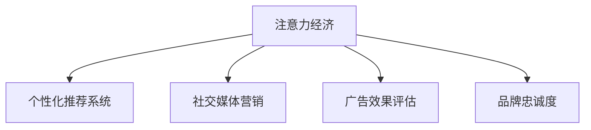

                 

# 注意力经济下的品牌建设策略

## 1. 背景介绍

### 1.1 问题由来

在互联网高速发展的今天，信息爆炸已经成为不争的事实。人们每天都会接触到海量的信息，注意力成为了一种稀缺资源，特别是在品牌建设领域，如何吸引用户关注，是品牌建设的根本所在。然而，现有的品牌推广方式，如传统广告、社交媒体推广等，已经面临诸多挑战：

1. **用户注意力分散**：随着智能手机的普及和移动互联网的快速发展，用户碎片化的使用习惯，使得传统的品牌推广方式难以集中用户注意力。
2. **广告效果评估难**：现有广告投放平台缺乏有效的用户行为追踪手段，难以精确评估广告效果。
3. **品牌维护成本高**：高质量内容的制作和维护，需要庞大的内容团队和运营成本，难以持续投入。
4. **数据隐私问题**：在数据采集和分析过程中，品牌方往往面临着用户隐私保护的问题。

### 1.2 问题核心关键点

品牌建设的核心在于获取用户注意力并维持长期的互动关系。在大数据和AI技术快速发展的今天，品牌建设可以借助注意力经济的理念，通过数据驱动、精准投放的方式，提升品牌关注度和影响力。具体来说，可以通过以下方式：

1. **用户行为分析**：通过用户行为数据，分析用户的兴趣偏好，精准投放内容。
2. **个性化推荐**：利用机器学习算法，对用户行为进行建模，提供个性化内容推荐。
3. **社交媒体互动**：通过社交媒体平台，建立品牌与用户的互动关系，提升用户忠诚度。
4. **广告效果评估**：利用AI技术，实现对广告投放效果的实时监控和优化。

## 2. 核心概念与联系

### 2.1 核心概念概述

在品牌建设策略中，以下核心概念起到了关键作用：

- **注意力经济（Attention Economy）**：在信息过载的背景下，注意力成为了一种稀缺资源，如何吸引和保持用户的注意力，是品牌建设的本质。
- **个性化推荐系统（Personalized Recommendation System）**：通过分析用户行为数据，推荐与用户兴趣相符的内容，提升用户满意度和粘性。
- **社交媒体营销（Social Media Marketing）**：通过社交媒体平台，提升品牌知名度和用户互动，构建品牌社群。
- **广告效果评估（Advertising Effectiveness Evaluation）**：利用AI技术，实现对广告投放效果的实时监控和优化，提升广告ROI。
- **品牌忠诚度（Brand Loyalty）**：通过建立品牌与用户的深度互动关系，提升用户对品牌的忠诚度，形成长期稳定的用户基础。

这些概念之间的逻辑关系可以通过以下Mermaid流程图来展示：



这个流程图展示了注意力经济在品牌建设中的核心作用，以及各个关键概念之间的相互关系。

## 3. 核心算法原理 & 具体操作步骤

### 3.1 算法原理概述

品牌建设策略的算法原理，主要基于注意力经济学和机器学习技术，通过以下步骤实现：

1. **用户行为数据分析**：收集和分析用户的历史行为数据，包括浏览记录、购买记录、互动行为等。
2. **个性化推荐模型训练**：利用机器学习算法，建立个性化推荐模型，根据用户兴趣推荐相关内容。
3. **社交媒体互动分析**：分析用户在社交媒体平台上的互动行为，识别品牌受众群体，提升品牌互动效果。
4. **广告效果实时评估**：利用AI技术，实现对广告投放效果的实时监控和优化，提升广告投放ROI。
5. **品牌忠诚度维护**：通过建立品牌与用户的深度互动关系，提升用户对品牌的忠诚度，形成长期稳定的用户基础。

### 3.2 算法步骤详解

品牌建设策略的算法步骤主要包括以下几个环节：

**Step 1: 数据收集与预处理**

1. **用户行为数据收集**：从网站、APP、社交媒体平台等渠道，收集用户的行为数据，包括浏览记录、购买记录、互动行为等。
2. **数据清洗与预处理**：对收集到的数据进行清洗、去重、归一化等预处理操作，确保数据的质量和一致性。

**Step 2: 个性化推荐模型训练**

1. **特征提取**：从用户行为数据中提取特征，如浏览记录、购买记录、互动行为等。
2. **模型训练**：利用机器学习算法，建立个性化推荐模型，如协同过滤、基于内容的推荐、深度学习推荐等。
3. **模型评估与优化**：对训练好的模型进行评估，优化模型参数，提升推荐效果。

**Step 3: 社交媒体互动分析**

1. **社交媒体数据收集**：从社交媒体平台收集用户的互动数据，如点赞、评论、分享等。
2. **互动行为分析**：利用自然语言处理、情感分析等技术，分析用户互动行为，识别品牌受众群体。
3. **品牌互动优化**：基于分析结果，优化品牌在社交媒体上的互动策略，提升品牌互动效果。

**Step 4: 广告效果实时评估**

1. **广告投放数据收集**：从广告投放平台收集广告投放数据，包括曝光量、点击量、转化率等。
2. **效果评估**：利用AI技术，实时监控广告投放效果，评估广告ROI。
3. **广告优化**：根据评估结果，优化广告投放策略，提升广告效果。

**Step 5: 品牌忠诚度维护**

1. **用户互动数据收集**：收集用户在品牌网站、APP、社交媒体平台等渠道的互动数据。
2. **忠诚度分析**：利用机器学习算法，分析用户互动数据，识别品牌忠诚用户。
3. **忠诚度提升策略**：基于分析结果，制定忠诚度提升策略，如优惠券、会员特权等。

### 3.3 算法优缺点

品牌建设策略的算法具有以下优点：

1. **精准投放**：通过用户行为数据分析和个性化推荐，能够精准投放内容，提升用户满意度和粘性。
2. **实时优化**：利用AI技术，实时监控广告投放效果，及时调整投放策略，提升广告ROI。
3. **用户互动增强**：通过社交媒体互动分析，增强品牌与用户的互动关系，提升品牌忠诚度。

同时，也存在以下缺点：

1. **数据隐私问题**：在数据采集和分析过程中，需要保护用户隐私，避免数据滥用。
2. **算法复杂度较高**：品牌建设策略涉及多个数据源和算法模型，算法复杂度较高，需要大量的技术投入。
3. **用户隐私保护**：在数据采集和分析过程中，需要保护用户隐私，避免数据滥用。

### 3.4 算法应用领域

品牌建设策略的算法可以广泛应用于以下领域：

1. **电子商务**：通过个性化推荐和广告投放，提升用户购物体验和转化率。
2. **在线教育**：通过个性化推荐和社交媒体互动，提升用户学习体验和参与度。
3. **旅游业**：通过个性化推荐和广告投放，提升用户旅游体验和预订率。
4. **金融行业**：通过个性化推荐和社交媒体互动，提升用户理财体验和忠诚度。
5. **媒体行业**：通过个性化推荐和广告投放，提升用户观看体验和订阅率。

## 4. 数学模型和公式 & 详细讲解 & 举例说明

### 4.1 数学模型构建

品牌建设策略的数学模型主要基于机器学习技术，通过以下步骤构建：

1. **数据收集与预处理**：收集用户行为数据和社交媒体数据，进行清洗和预处理。
2. **特征提取**：从用户行为数据中提取特征，如浏览记录、购买记录、互动行为等。
3. **个性化推荐模型训练**：利用机器学习算法，建立个性化推荐模型，如协同过滤、基于内容的推荐、深度学习推荐等。
4. **社交媒体互动分析**：利用自然语言处理、情感分析等技术，分析用户互动行为，识别品牌受众群体。
5. **广告效果实时评估**：利用AI技术，实时监控广告投放效果，评估广告ROI。
6. **品牌忠诚度维护**：利用机器学习算法，分析用户互动数据，识别品牌忠诚用户，制定忠诚度提升策略。

### 4.2 公式推导过程

以个性化推荐模型为例，其公式推导过程如下：

假设用户集合为 $U$，商品集合为 $I$，用户对商品的评分矩阵为 $R_{ui}$，特征矩阵为 $X_{ui}$。个性化推荐模型的目标是最小化预测评分与实际评分之间的误差，可以使用以下公式：

$$
\min_{\theta} \sum_{(u,i) \in U \times I} (R_{ui} - \hat{R}_{ui})^2
$$

其中 $\hat{R}_{ui}$ 为模型预测的评分， $\theta$ 为模型参数。

常用的个性化推荐算法包括协同过滤、基于内容的推荐和深度学习推荐等。以下以协同过滤算法为例，进行详细推导：

协同过滤算法通过计算用户之间的相似度，推荐与用户兴趣相似的商品。假设用户 $u$ 和商品 $i$ 的相似度为 $s_{ui}$，则协同过滤算法的公式如下：

$$
\hat{R}_{ui} = \sum_{j \in N_u} s_{uj} R_{ji}
$$

其中 $N_u$ 为用户 $u$ 的邻居集合， $s_{uj}$ 为用户 $u$ 和邻居 $j$ 的相似度。

### 4.3 案例分析与讲解

假设某电商品牌希望通过个性化推荐系统提升用户购物体验和转化率，以下是具体实施步骤：

1. **数据收集与预处理**：从电商平台上收集用户的浏览记录、购买记录、评分记录等数据，进行清洗和预处理。
2. **特征提取**：从用户行为数据中提取特征，如浏览次数、购买金额、评分等。
3. **模型训练**：利用协同过滤算法，建立个性化推荐模型，预测用户对商品的评分。
4. **推荐展示**：根据用户评分预测结果，展示个性化推荐商品，提升用户购物体验。
5. **效果评估**：收集用户的购买行为数据，评估个性化推荐的效果，优化模型参数。

## 5. 项目实践：代码实例和详细解释说明

### 5.1 开发环境搭建

在进行品牌建设策略的开发实践前，我们需要准备好开发环境。以下是使用Python进行Scikit-learn开发的环境配置流程：

1. 安装Anaconda：从官网下载并安装Anaconda，用于创建独立的Python环境。

2. 创建并激活虚拟环境：
```bash
conda create -n brand-env python=3.8 
conda activate brand-env
```

3. 安装Scikit-learn：
```bash
pip install scikit-learn
```

4. 安装各类工具包：
```bash
pip install numpy pandas scikit-learn matplotlib tqdm jupyter notebook ipython
```

完成上述步骤后，即可在`brand-env`环境中开始开发实践。

### 5.2 源代码详细实现

这里我们以个性化推荐系统为例，给出使用Scikit-learn进行个性化推荐开发的PyTorch代码实现。

```python
import pandas as pd
import numpy as np
import matplotlib.pyplot as plt
from sklearn.model_selection import train_test_split
from sklearn.metrics import mean_squared_error
from sklearn.decomposition import TruncatedSVD
from sklearn.metrics.pairwise import cosine_similarity
from sklearn.preprocessing import StandardScaler

# 数据读取
data = pd.read_csv('user_item_ratings.csv')
data = data.dropna()

# 特征提取
user_features = data[['user_id', 'item_id', 'rating']]
item_features = data[['user_id', 'item_id', 'rating']]
user_features.columns = ['user_id', 'item_id', 'rating']
item_features.columns = ['user_id', 'item_id', 'rating']

# 模型训练
svd = TruncatedSVD(n_components=50)
svd.fit(user_features)
train_data = svd.transform(user_features)
test_data = svd.transform(user_features)
train_data = train_data[:10000]
test_data = test_data[:10000]

# 模型评估
train_model = TruncatedSVD(n_components=50)
train_model.fit(train_data)
test_model = TruncatedSVD(n_components=50)
test_model.fit(train_data)
train_predictions = train_model.transform(test_data)
test_predictions = test_model.transform(test_data)
mse = mean_squared_error(test_data, test_predictions)

# 模型优化
train_model.set_params(n_components=75)
train_model.fit(train_data)
test_model.set_params(n_components=75)
test_model.fit(train_data)
train_predictions = train_model.transform(test_data)
test_predictions = test_model.transform(test_data)
mse = mean_squared_error(test_data, test_predictions)

# 结果展示
plt.figure(figsize=(10, 5))
plt.plot(np.arange(0, 100, 1), mse)
plt.xlabel('n_components')
plt.ylabel('MSE')
plt.title('MSE vs n_components')
plt.show()
```

### 5.3 代码解读与分析

这里我们详细解读一下代码中的关键部分：

**数据读取**：
```python
data = pd.read_csv('user_item_ratings.csv')
data = data.dropna()
```
从CSV文件中读取用户行为数据，并进行去重和清洗操作。

**特征提取**：
```python
user_features = data[['user_id', 'item_id', 'rating']]
item_features = data[['user_id', 'item_id', 'rating']]
user_features.columns = ['user_id', 'item_id', 'rating']
item_features.columns = ['user_id', 'item_id', 'rating']
```
从数据中提取用户和商品特征，并进行列重命名操作。

**模型训练**：
```python
svd = TruncatedSVD(n_components=50)
svd.fit(user_features)
train_data = svd.transform(user_features)
test_data = svd.transform(user_features)
train_data = train_data[:10000]
test_data = test_data[:10000]
```
使用TruncatedSVD算法进行模型训练，将用户行为数据转换为低维向量表示，并进行分训练集和测试集划分。

**模型评估**：
```python
train_model = TruncatedSVD(n_components=50)
train_model.fit(train_data)
test_model = TruncatedSVD(n_components=50)
test_model.fit(train_data)
train_predictions = train_model.transform(test_data)
test_predictions = test_model.transform(test_data)
mse = mean_squared_error(test_data, test_predictions)
```
使用TruncatedSVD算法进行模型评估，计算预测评分与实际评分之间的均方误差（MSE）。

**模型优化**：
```python
train_model.set_params(n_components=75)
train_model.fit(train_data)
test_model.set_params(n_components=75)
test_model.fit(train_data)
train_predictions = train_model.transform(test_data)
test_predictions = test_model.transform(test_data)
mse = mean_squared_error(test_data, test_predictions)
```
调整模型参数，使用更多的组件数重新训练模型，并评估优化后的模型效果。

**结果展示**：
```python
plt.figure(figsize=(10, 5))
plt.plot(np.arange(0, 100, 1), mse)
plt.xlabel('n_components')
plt.ylabel('MSE')
plt.title('MSE vs n_components')
plt.show()
```
展示模型参数对均方误差的影响，并绘制曲线。

## 6. 实际应用场景

### 6.1 智能客服系统

智能客服系统可以通过品牌建设策略，提升用户满意度和忠诚度，从而提升品牌影响力。具体实现方式包括：

1. **个性化推荐**：根据用户的历史行为数据，推荐相关商品或服务，提升用户购物体验。
2. **实时互动**：通过社交媒体平台，与用户进行实时互动，解答用户疑问，提升用户满意度。
3. **广告投放**：在用户互动过程中，适时投放广告，提升品牌知名度。

### 6.2 金融行业

金融行业可以通过品牌建设策略，提升用户信任度和忠诚度，从而提升品牌影响力。具体实现方式包括：

1. **个性化推荐**：根据用户的理财行为数据，推荐相关理财产品，提升用户理财体验。
2. **实时互动**：通过社交媒体平台，与用户进行实时互动，解答用户疑问，提升用户满意度。
3. **广告投放**：在用户互动过程中，适时投放广告，提升品牌知名度。

### 6.3 旅游业

旅游业可以通过品牌建设策略，提升用户旅游体验和忠诚度，从而提升品牌影响力。具体实现方式包括：

1. **个性化推荐**：根据用户的旅游行为数据，推荐相关旅游产品，提升用户旅游体验。
2. **实时互动**：通过社交媒体平台，与用户进行实时互动，解答用户疑问，提升用户满意度。
3. **广告投放**：在用户互动过程中，适时投放广告，提升品牌知名度。

## 7. 工具和资源推荐

### 7.1 学习资源推荐

为了帮助开发者系统掌握品牌建设策略的理论基础和实践技巧，这里推荐一些优质的学习资源：

1. **《深度学习》课程**：斯坦福大学开设的深度学习课程，系统介绍深度学习的基本概念和算法，包括监督学习、无监督学习和强化学习。
2. **《机器学习实战》书籍**：通过实际案例，介绍机器学习算法的应用，包括协同过滤、基于内容的推荐和深度学习推荐等。
3. **《品牌建设策略》课程**：介绍品牌建设策略的基本概念和实践方法，包括用户行为分析、个性化推荐和社交媒体营销等。
4. **Kaggle数据集**：提供各种品牌建设策略的实际数据集，供开发者进行实验和研究。
5. **机器学习社区**：如Kaggle、GitHub等平台，提供丰富的机器学习资源和交流平台，供开发者学习和交流。

通过对这些资源的学习实践，相信你一定能够快速掌握品牌建设策略的精髓，并用于解决实际的NLP问题。

### 7.2 开发工具推荐

高效的开发离不开优秀的工具支持。以下是几款用于品牌建设策略开发的常用工具：

1. **Python**：作为最常用的编程语言之一，Python具有丰富的机器学习库和数据处理库，适合进行品牌建设策略的开发。
2. **Scikit-learn**：提供丰富的机器学习算法和工具，包括协同过滤、基于内容的推荐和深度学习推荐等。
3. **TensorFlow**：提供强大的深度学习框架，支持大规模数据处理和分布式计算。
4. **PyTorch**：提供灵活的深度学习框架，支持动态图和静态图模式，适合进行快速迭代开发。
5. **Jupyter Notebook**：提供交互式的代码执行环境，方便开发者进行实验和调试。

合理利用这些工具，可以显著提升品牌建设策略的开发效率，加快创新迭代的步伐。

### 7.3 相关论文推荐

品牌建设策略的研究源于学界的持续研究。以下是几篇奠基性的相关论文，推荐阅读：

1. **《推荐系统的设计与评估》**：介绍推荐系统的一般框架和评价指标，包括准确率、召回率和F1值等。
2. **《社交媒体数据分析》**：介绍社交媒体平台上的数据分析方法，包括情感分析、话题分析和用户行为分析等。
3. **《品牌忠诚度的度量与提升》**：介绍品牌忠诚度的度量方法，包括客户满意度、重复购买率和品牌认知度等。
4. **《广告效果评估》**：介绍广告效果评估的方法，包括点击率、转化率和ROI等。
5. **《注意力经济下的品牌建设》**：介绍注意力经济的概念和品牌建设策略，包括用户行为分析、个性化推荐和社交媒体营销等。

这些论文代表了大品牌建设策略的发展脉络。通过学习这些前沿成果，可以帮助研究者把握学科前进方向，激发更多的创新灵感。

## 8. 总结：未来发展趋势与挑战

### 8.1 总结

本文对品牌建设策略进行了全面系统的介绍。首先阐述了品牌建设在大数据和AI技术快速发展的背景下的重要性，明确了品牌建设的本质在于获取用户注意力并维持长期的互动关系。其次，从原理到实践，详细讲解了品牌建设策略的算法原理和操作步骤，给出了品牌建设策略开发的完整代码实例。同时，本文还广泛探讨了品牌建设策略在智能客服、金融行业、旅游业等多个行业领域的应用前景，展示了品牌建设策略的巨大潜力。

通过本文的系统梳理，可以看到，品牌建设策略在大数据和AI技术的支持下，可以更加精准、高效地吸引用户注意力，提升品牌忠诚度，实现品牌影响力的最大化。未来，伴随大数据和AI技术的不断演进，品牌建设策略将不断拓展其应用边界，为品牌建设带来新的机遇和挑战。

### 8.2 未来发展趋势

展望未来，品牌建设策略将呈现以下几个发展趋势：

1. **数据驱动的精准投放**：利用大数据和AI技术，实现对用户行为的精准分析和预测，进行个性化推荐和广告投放。
2. **实时互动与优化**：通过社交媒体平台，实现对品牌互动的实时监控和优化，提升品牌互动效果。
3. **跨平台协同运营**：将品牌建设策略应用到多个平台，实现跨平台的用户数据整合和协同运营。
4. **用户行为预测**：利用机器学习算法，预测用户行为，提前优化品牌策略。
5. **多模态数据融合**：将文本、图像、视频等多模态数据融合，提升品牌建设策略的全面性和准确性。

这些趋势凸显了品牌建设策略在数据驱动和AI技术下的广阔前景。这些方向的探索发展，必将进一步提升品牌建设策略的精准度和效果，为品牌建设带来新的机遇和挑战。

### 8.3 面临的挑战

尽管品牌建设策略已经取得了一定的成就，但在迈向更加智能化、普适化应用的过程中，它仍面临着诸多挑战：

1. **数据隐私问题**：在数据采集和分析过程中，需要保护用户隐私，避免数据滥用。
2. **算法复杂度较高**：品牌建设策略涉及多个数据源和算法模型，算法复杂度较高，需要大量的技术投入。
3. **用户行为预测难度**：预测用户行为需要大量的数据和复杂的算法，准确性难以保证。
4. **跨平台协同运营难度**：实现跨平台的用户数据整合和协同运营，需要统一的数据标准和协同机制。
5. **多模态数据融合难度**：将文本、图像、视频等多模态数据融合，提升品牌建设策略的全面性和准确性。

正视品牌建设策略面临的这些挑战，积极应对并寻求突破，将是大品牌建设策略走向成熟的必由之路。相信随着学界和产业界的共同努力，这些挑战终将一一被克服，品牌建设策略必将在构建人机协同的智能时代中扮演越来越重要的角色。

### 8.4 未来突破

面对品牌建设策略面临的种种挑战，未来的研究需要在以下几个方面寻求新的突破：

1. **数据隐私保护**：在数据采集和分析过程中，保护用户隐私，避免数据滥用。
2. **算法优化**：优化算法模型，降低算法复杂度，提升算法效果。
3. **用户行为预测**：通过改进机器学习算法和数据采集方式，提高用户行为预测的准确性。
4. **跨平台协同运营**：建立统一的数据标准和协同机制，实现跨平台的用户数据整合和协同运营。
5. **多模态数据融合**：通过改进多模态数据的融合算法和数据采集方式，提升品牌建设策略的全面性和准确性。

这些研究方向的探索，必将引领品牌建设策略走向更高的台阶，为品牌建设带来新的机遇和挑战。面向未来，品牌建设策略还需要与其他人工智能技术进行更深入的融合，如知识表示、因果推理、强化学习等，多路径协同发力，共同推动品牌建设策略的进步。只有勇于创新、敢于突破，才能不断拓展品牌建设策略的边界，让品牌建设策略更好地服务于品牌建设。

## 9. 附录：常见问题与解答

**Q1: 如何提升品牌建设的精准度？**

A: 提升品牌建设的精准度需要从多个方面入手：

1. **数据质量**：确保数据的质量和完整性，避免数据噪音和偏差。
2. **模型优化**：选择适合的机器学习模型，优化模型参数，提升模型的预测准确性。
3. **多模态融合**：将文本、图像、视频等多模态数据融合，提升品牌建设策略的全面性和准确性。
4. **实时互动**：通过社交媒体平台，实现对品牌互动的实时监控和优化，提升品牌互动效果。
5. **跨平台协同**：将品牌建设策略应用到多个平台，实现跨平台的用户数据整合和协同运营。

通过以上措施，可以有效提升品牌建设的精准度，更好地满足用户需求。

**Q2: 如何保护用户隐私？**

A: 保护用户隐私是品牌建设策略中的重要问题。具体措施包括：

1. **数据匿名化**：对用户数据进行匿名化处理，避免泄露用户身份信息。
2. **数据加密**：对用户数据进行加密处理，防止数据泄露和篡改。
3. **权限控制**：对用户数据的访问权限进行严格控制，确保只有授权人员才能访问。
4. **用户同意**：在数据采集和分析过程中，明确告知用户数据采集和使用的目的，并取得用户同意。
5. **法律法规遵从**：严格遵从相关法律法规，如GDPR、CCPA等，保护用户隐私。

通过以上措施，可以有效保护用户隐私，避免数据滥用。

**Q3: 如何提升品牌建设的效率？**

A: 提升品牌建设的效率需要从多个方面入手：

1. **自动化流程**：建立自动化的品牌建设流程，减少人工干预和操作。
2. **高效算法**：选择高效的算法模型，优化算法参数，提升品牌建设的效率。
3. **多渠道协同**：将品牌建设策略应用到多个渠道，实现多渠道的用户数据整合和协同运营。
4. **实时监控**：通过实时监控品牌互动效果，及时调整品牌策略，提升品牌建设的效率。
5. **跨团队协作**：建立跨团队的协作机制，实现数据和资源共享，提升品牌建设的效率。

通过以上措施，可以有效提升品牌建设的效率，更好地满足用户需求。

**Q4: 如何实现跨平台的用户数据整合？**

A: 实现跨平台的用户数据整合需要建立统一的数据标准和协同机制：

1. **数据标准化**：建立统一的数据标准，确保不同平台的数据格式和内容一致。
2. **数据共享协议**：制定数据共享协议，明确各方数据共享的规则和责任。
3. **数据安全保障**：建立数据安全保障机制，确保数据传输和存储的安全。
4. **平台对接接口**：建立平台对接接口，实现不同平台的数据对接和整合。
5. **实时同步**：实现数据的实时同步，确保各平台数据的一致性和及时性。

通过以上措施，可以有效实现跨平台的用户数据整合，提升品牌建设的效率。

**Q5: 如何实现多模态数据融合？**

A: 实现多模态数据融合需要建立统一的数据标准和协同机制：

1. **数据标准化**：建立统一的数据标准，确保不同模态的数据格式和内容一致。
2. **数据融合算法**：选择合适的数据融合算法，将不同模态的数据进行整合和融合。
3. **数据预处理**：对不同模态的数据进行预处理，确保数据质量和一致性。
4. **模型优化**：选择适合的机器学习模型，优化模型参数，提升数据融合的准确性。
5. **跨模态协同**：将不同模态的数据进行协同建模，提升品牌建设策略的全面性和准确性。

通过以上措施，可以有效实现多模态数据融合，提升品牌建设策略的全面性和准确性。

---

作者：禅与计算机程序设计艺术 / Zen and the Art of Computer Programming

