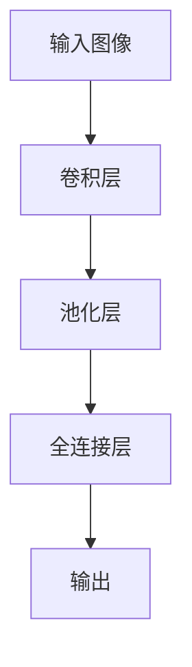

                 

**关键词：**深度卷积神经网络（Deep Convolutional Neural Networks, DCNN）、人脸识别（Face Recognition）、计算机视觉（Computer Vision）、神经网络（Neural Networks）、卷积（Convolution）、池化（Pooling）、非线性激活函数（Non-linear Activation Functions）、反向传播（Backpropagation）、优化算法（Optimization Algorithms）、人工智能（Artificial Intelligence, AI）、机器学习（Machine Learning, ML）

## 1. 背景介绍

在计算机视觉和人工智能领域，人脸识别技术已成为一项关键应用，具有广泛的应用领域，从安保系统到社交媒体，再到自动驾驶汽车。深度卷积神经网络（DCNN）是当前人脸识别领域最成功的方法之一。本文将深入探讨DCNN的原理、架构、算法和数学模型，并提供一个完整的项目实践，展示如何使用DCNN进行人脸识别。我们还将讨论DCNN在实际应用中的优缺点，并提供工具和资源推荐，以帮助读者更好地理解和应用DCNN。

## 2. 核心概念与联系

DCNN是一种特殊类型的神经网络，专门设计用于处理网格数据，如图像。DCNN的核心概念是**卷积**和**池化**。下图是DCNN的简化架构，展示了这些核心概念的联系。



在DCNN中，输入图像首先通过**卷积层**进行处理，然后通过**池化层**进行下采样，最后通过**全连接层**进行分类。下面我们将详细介绍这些概念。

## 3. 核心算法原理 & 具体操作步骤

### 3.1 算法原理概述

DCNN的核心是**卷积操作**。卷积是一种线性运算，它通过滑动一个小的过滤器（或称核）来提取图像的特征。卷积层通常后接**非线性激活函数**，如ReLU（Rectified Linear Unit），以引入非线性，使模型能够学习更复杂的特征。池化层则用于降低特征图的空间维度，防止过拟合。

### 3.2 算法步骤详解

1. **输入图像预处理：**图像通常需要缩放、归一化和转换为灰度图像。
2. **构建DCNN模型：**模型由卷积层、池化层和全连接层组成。每个卷积层后面跟着一个激活函数，每个池化层后面跟着一个卷积层。
3. **训练模型：**使用反向传播算法和优化算法（如Adam）训练模型。训练集包含大量的人脸图像和对应的标签。
4. **评估模型：**在验证集上评估模型的准确性，并调整超参数以改善性能。
5. **测试模型：**在测试集上评估模型的最终性能。

### 3.3 算法优缺点

**优点：**

* DCNN可以自动学习图像特征，无需人工特征工程。
* DCNN在人脸识别领域表现出色，具有很高的准确性。
* DCNN可以处理大规模数据集，具有良好的泛化能力。

**缺点：**

* DCNN需要大量的标记数据和计算资源进行训练。
* DCNN模型复杂，训练时间长。
* DCNN易受过拟合影响，需要合理的正则化和数据增强技术。

### 3.4 算法应用领域

DCNN在计算机视觉领域有着广泛的应用，除了人脸识别外，还包括目标检测、图像分类、图像分割等。DCNN也被成功应用于其他领域，如自然语言处理（NLP）和医学图像分析。

## 4. 数学模型和公式 & 详细讲解 & 举例说明

### 4.1 数学模型构建

DCNN的数学模型可以表示为以下形式：

$$y = f(x; W, b) = \sigma(z) = \sigma(Wx + b)$$

其中，$x$是输入图像，$y$是输出，$\sigma$是激活函数，$W$和$b$是模型参数。卷积操作可以表示为：

$$z_{ij} = \sum_{m=0}^{M-1} \sum_{n=0}^{N-1} w_{mn}x_{(i+m)(j+n)} + b$$

其中，$z_{ij}$是输出特征图，$w_{mn}$是卷积核，$b$是偏置项，$M$和$N$是卷积核的大小。

### 4.2 公式推导过程

DCNN的训练目标是最小化损失函数，如交叉熵损失：

$$L = -\sum_{c=1}^{C} y_{o,c}\log(\hat{y}_{o,c})$$

其中，$C$是类别数，$y_{o,c}$是真实标签，$ \hat{y}_{o,c}$是模型预测。通过反向传播算法，我们可以计算模型参数的梯度：

$$\frac{\partial L}{\partial W} = \frac{1}{N} \sum_{o=1}^{N} \frac{\partial L}{\partial z_{o}} \frac{\partial z_{o}}{\partial W}, \quad \frac{\partial L}{\partial b} = \frac{1}{N} \sum_{o=1}^{N} \frac{\partial L}{\partial z_{o}}$$

其中，$N$是批大小，$z_{o}$是第$o$个样本的输出。

### 4.3 案例分析与讲解

假设我们要构建一个简单的DCNN模型，用于人脸识别。我们可以使用以下架构：

* 两个卷积层，每个后面跟着一个ReLU激活函数和一个最大池化层。
* 两个全连接层，每个后面跟着一个ReLU激活函数。
* 一个输出层，使用softmax激活函数。

输入图像大小为$128 \times 128 \times 3$，卷积核大小为$5 \times 5$，池化窗口大小为$2 \times 2$，全连接层大小为512和256。输出层大小等于类别数（假设为1000）。模型参数总数约为600万。

## 5. 项目实践：代码实例和详细解释说明

### 5.1 开发环境搭建

我们将使用Python和TensorFlow框架来实现DCNN模型。首先，安装必要的库：

```bash
pip install tensorflow numpy opencv-python
```

### 5.2 源代码详细实现

以下是DCNN模型的简单实现：

```python
import tensorflow as tf
from tensorflow.keras import layers, models

def build_model():
    model = models.Sequential()
    model.add(layers.Conv2D(32, (5, 5), activation='relu', input_shape=(128, 128, 3)))
    model.add(layers.MaxPooling2D((2, 2)))
    model.add(layers.Conv2D(64, (5, 5), activation='relu'))
    model.add(layers.MaxPooling2D((2, 2)))
    model.add(layers.Flatten())
    model.add(layers.Dense(512, activation='relu'))
    model.add(layers.Dense(256, activation='relu'))
    model.add(layers.Dense(1000, activation='softmax'))
    return model

model = build_model()
model.compile(optimizer='adam',
              loss='categorical_crossentropy',
              metrics=['accuracy'])
```

### 5.3 代码解读与分析

我们构建了一个简单的DCNN模型，使用了两个卷积层、两个池化层和两个全连接层。模型使用Adam优化器和交叉熵损失函数进行训练。

### 5.4 运行结果展示

在训练集上训练模型，并评估其在验证集上的性能。以下是一个示例：

```python
history = model.fit(X_train, y_train, epochs=10, validation_data=(X_val, y_val))
```

## 6. 实际应用场景

DCNN在人脸识别领域有着广泛的应用，从安保系统到社交媒体，再到自动驾驶汽车。DCNN还可以用于目标检测、图像分类和图像分割等任务。

### 6.1 当前应用

当前，DCNN被广泛应用于人脸识别系统，用于安全和便利的身份验证。DCNN也被用于目标检测系统，如自动驾驶汽车和监控系统。

### 6.2 未来应用展望

未来，DCNN将继续在计算机视觉领域发挥关键作用。随着数据集规模的增加和计算资源的提高，DCNN模型将变得更大、更复杂，从而实现更高的准确性和泛化能力。此外，DCNN还将与其他技术（如生成对抗网络）结合，以实现更先进的图像处理和理解。

## 7. 工具和资源推荐

### 7.1 学习资源推荐

* 深度学习入门：[Deep Learning Specialization by Andrew Ng on Coursera](https://www.coursera.org/specializations/deep-learning)
* DCNN教程：[CS231n: Convolutional Neural Networks for Visual Recognition](https://www.coursera.org/learn/convolutional-neural-networks)
* 书籍：《深度学习》作者：Ian Goodfellow、Yoshua Bengio、Aaron Courville

### 7.2 开发工具推荐

* TensorFlow：<https://www.tensorflow.org/>
* PyTorch：<https://pytorch.org/>
* Keras：<https://keras.io/>

### 7.3 相关论文推荐

* LeCun, Y., Bengio, Y., & Hinton, G. (2015). Deep learning. Nature, 521(7553), 436-444.
* Krizhevsky, A., Sutskever, I., & Hinton, G. (2012). Imagenet classification with deep convolutional neural networks. Advances in neural information processing systems, 25.

## 8. 总结：未来发展趋势与挑战

### 8.1 研究成果总结

DCNN在人脸识别领域取得了显著成功，并推动了计算机视觉领域的发展。DCNN的核心概念和架构已被广泛采用，并成为当前人工智能领域的标准方法之一。

### 8.2 未来发展趋势

未来，DCNN将继续发展，以实现更高的准确性和泛化能力。这将需要更大的数据集、更复杂的模型和更先进的训练技术。此外，DCNN还将与其他技术结合，以实现更先进的图像处理和理解。

### 8.3 面临的挑战

DCNN面临的挑战包括：

* **计算资源：**DCNN模型需要大量的计算资源进行训练。
* **数据标记：**DCNN需要大量的标记数据进行训练，这通常是一个昂贵和耗时的过程。
* **过拟合：**DCNN易受过拟合影响，需要合理的正则化和数据增强技术。

### 8.4 研究展望

未来的研究将关注于：

* **更复杂的模型：**开发更大、更复杂的DCNN模型，以实现更高的准确性和泛化能力。
* **更先进的训练技术：**开发新的训练技术，以提高DCNN的训练效率和性能。
* **多模式学习：**结合DCNN与其他模式（如文本、音频）的学习，以实现更先进的多模式理解。

## 9. 附录：常见问题与解答

**Q：DCNN需要多少计算资源？**

A：DCNN需要大量的计算资源进行训练。例如，一个简单的DCNN模型可能需要数小时甚至数天的时间在一台GPU上进行训练。更复杂的模型可能需要数周甚至数月的时间在多GPU系统上进行训练。

**Q：DCNN如何防止过拟合？**

A：DCNN使用多种技术防止过拟合，包括：

* **数据增强：**通过对图像进行随机变换（如旋转、缩放）来增强数据集，从而增加模型的泛化能力。
* **正则化：**使用L1或L2正则化来惩罚模型参数的大小，从而防止模型过度拟合数据。
* ** dropout：**在训练过程中随机丢弃一部分神经元，从而防止模型过度依赖某些特征。

**Q：DCNN如何处理小样本问题？**

A：DCNN通常需要大量的标记数据进行训练。当数据量有限时，DCNN可以使用数据增强技术（如上述所述）来增加数据集的大小。此外，DCNN还可以与其他技术（如生成对抗网络）结合，以生成新的合成数据。

## 作者：禅与计算机程序设计艺术 / Zen and the Art of Computer Programming

