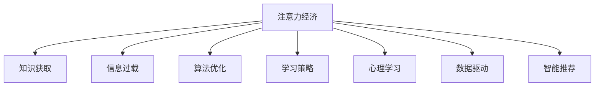

                 

# 注意力经济与个人学习效率的提升

> 关键词：注意力经济, 知识获取, 个人学习, 信息过载, 算法优化, 学习策略, 心理学习, 数据驱动, 智能推荐, 效率提升

## 1. 背景介绍

在信息爆炸的现代社会，人们面临着前所未有的信息过载问题。无论是日常生活还是工作学习，无处不在的信息流都在争夺我们的注意力。如何有效管理和利用有限的注意力资源，提升个人学习效率，成为时代亟需解决的关键问题。在智能技术不断发展的背景下，“注意力经济”这一概念应运而生，为解决这一问题提供了全新的视角和方法。

注意力经济（Economy of Attention），是指在信息过载的时代，注意力成为一种稀缺资源，如何高效地获取、管理和利用注意力，实现信息的有价值转换，成为新型经济的核心问题。本文将从注意力经济的角度，探讨如何通过技术手段提升个人学习效率，实现知识和技能的快速积累。

## 2. 核心概念与联系

### 2.1 核心概念概述

本节将介绍几个密切相关的核心概念，帮助理解文章所讨论的技术方法和理论背景。

- **注意力经济**：在信息过载时代，注意力作为一种稀缺资源，其价值正在逐步上升。如何高效管理和利用注意力，实现信息的有价值转换，成为新型经济的核心问题。
- **知识获取**：通过学习、阅读、实践等形式，获取新知识、新技能的过程。知识获取是个人学习效率提升的基础。
- **信息过载**：当前社会信息量爆炸式增长，人们接收到的信息量远超自身处理能力，容易引发注意力分散，影响学习效率。
- **算法优化**：通过优化算法，提升信息处理效率和注意力分配的科学性，达到提升个人学习效率的目的。
- **学习策略**：在知识获取过程中，根据自身特点和需求，采用科学合理的学习策略，优化学习过程，提高学习效果。
- **心理学习**：从心理学角度出发，研究学习行为和心理状态，采用科学的学习方法和心理调适，提高学习效果。
- **数据驱动**：利用大数据分析，对个人学习过程进行量化和优化，提供更精准的学习指导和建议。
- **智能推荐**：通过智能推荐系统，根据用户兴趣和行为数据，提供个性化的学习资源，提升学习效率。

这些核心概念之间的逻辑关系可以通过以下Mermaid流程图来展示：



这个流程图展示了个体学习过程中，注意力经济、信息过载、算法优化、学习策略、心理学习、数据驱动和智能推荐等多个因素之间的关系，强调了技术手段在提升个人学习效率中的关键作用。

## 3. 核心算法原理 & 具体操作步骤

### 3.1 算法原理概述

基于注意力经济提升个人学习效率的方法，主要依赖于两个关键算法：注意力分配算法和推荐算法。

注意力分配算法旨在帮助用户合理分配注意力资源，确保用户在信息流中获取最有价值的信息。推荐算法则通过分析用户兴趣和行为，提供个性化的学习资源，提升学习效率和体验。

### 3.2 算法步骤详解

#### 3.2.1 注意力分配算法步骤

1. **用户模型构建**：基于用户的过往行为和兴趣，构建用户模型，包括兴趣偏好、学习时间、注意力容量等。
2. **信息流分析**：对信息流中的内容进行分类和评估，确定各类信息的价值和吸引力。
3. **注意力分配**：根据用户模型和信息流分析结果，动态调整用户对各类信息的注意力分配比例，确保用户在有限的时间内获取最有价值的信息。
4. **效果评估与调整**：定期评估注意力分配的效果，根据评估结果调整模型参数，优化注意力分配策略。

#### 3.2.2 推荐算法步骤

1. **用户画像构建**：基于用户的行为数据，构建详细的用户画像，包括历史浏览、阅读、观看等行为记录。
2. **资源评估与筛选**：对学习资源进行分类和评估，筛选出高质量的资源进行推荐。
3. **个性化推荐**：根据用户画像和资源评估结果，使用推荐算法为用户推荐最合适的学习资源。
4. **反馈与优化**：收集用户对推荐结果的反馈，调整推荐算法，提升推荐效果。

### 3.3 算法优缺点

#### 3.3.1 注意力分配算法

**优点**：
- **动态优化**：根据用户实时行为和兴趣变化，动态调整注意力分配，提高学习效率。
- **个性化管理**：基于用户模型，实现个性化注意力分配，避免信息过载。

**缺点**：
- **复杂度较高**：需要实时分析用户行为和信息流，计算量较大。
- **初始模型风险**：用户模型不准确或过时，可能导致注意力分配失败。

#### 3.3.2 推荐算法

**优点**：
- **精准推荐**：基于用户画像和资源评估，提供高质量的个性化学习资源。
- **动态更新**：定期收集用户反馈，优化推荐算法，提升推荐效果。

**缺点**：
- **冷启动问题**：新用户缺乏足够的行为数据，难以构建准确的画像。
- **数据隐私**：用户行为数据的收集和使用可能引发隐私问题。

### 3.4 算法应用领域

基于注意力经济提升个人学习效率的方法，可以应用于多个领域，包括但不限于：

1. **在线教育**：通过智能推荐系统，为学生提供个性化的学习资源和路径，提升学习效率和成绩。
2. **职业培训**：为在职人员提供针对性的技能培训资源，帮助其快速掌握新技能，适应职场变化。
3. **终身学习**：帮助用户根据自己的兴趣和需求，高效获取各类知识和技能，实现终身学习。
4. **跨领域学习**：通过推荐算法，引导用户跨领域学习和探索，拓展知识面。

## 4. 数学模型和公式 & 详细讲解 & 举例说明

### 4.1 数学模型构建

本节将使用数学语言对注意力分配和推荐算法的模型进行更加严格的刻画。

设用户对某一类信息的注意力为 $A_i$，信息的价值为 $V_i$，用户对信息流的总注意力为 $T$，则注意力分配的目标是最大化用户获取的总价值 $V$。

优化目标为：

$$
\max_{A_i} \sum_{i} V_i \times A_i
$$

约束条件为：

$$
\sum_{i} A_i = T
$$

目标函数为：

$$
V = \sum_{i} V_i \times A_i
$$

根据信息价值和用户注意力，构建线性规划模型。

### 4.2 公式推导过程

假设信息价值 $V_i$ 和用户注意力 $A_i$ 之间的关系为线性，即：

$$
V_i = a_i A_i + b_i
$$

则优化问题变为：

$$
\max_{A_i} \sum_{i} (a_i A_i + b_i) \times A_i
$$

约束条件变为：

$$
\sum_{i} A_i = T
$$

化简得：

$$
\max_{A_i} \sum_{i} a_i A_i^2 + b_i A_i
$$

约束条件变为：

$$
\sum_{i} A_i = T
$$

利用拉格朗日乘数法，构建拉格朗日函数：

$$
L(A_i, \lambda) = \sum_{i} a_i A_i^2 + b_i A_i + \lambda (T - \sum_{i} A_i)
$$

求导并令导数为0，解得：

$$
A_i = \frac{\partial L}{\partial a_i} = 2a_i A_i + b_i - \lambda
$$

解方程组得：

$$
A_i = \frac{b_i}{2a_i} \quad \text{或} \quad A_i = 0
$$

因此，用户对每类信息的注意力分配应根据其价值和自身注意力容量动态调整。

### 4.3 案例分析与讲解

以在线教育平台为例，分析如何使用注意力分配算法提升学习效率。

1. **用户模型构建**：根据用户的历史学习记录，构建用户模型，包括学习时间、学习兴趣等。
2. **信息流分析**：对课程、视频、文章等信息资源进行价值评估，确定各类资源的吸引力。
3. **注意力分配**：根据用户模型和资源价值，动态调整用户对各类资源的注意力分配，确保其在有限时间内获取最有价值的信息。
4. **效果评估与调整**：定期评估注意力分配效果，根据评估结果调整模型参数，优化注意力分配策略。

## 5. 项目实践：代码实例和详细解释说明

### 5.1 开发环境搭建

在进行实践前，需要准备好开发环境。以下是使用Python进行TensorFlow开发的环境配置流程：

1. 安装Anaconda：从官网下载并安装Anaconda，用于创建独立的Python环境。
2. 创建并激活虚拟环境：
```bash
conda create -n tf-env python=3.8 
conda activate tf-env
```

3. 安装TensorFlow：根据CUDA版本，从官网获取对应的安装命令。例如：
```bash
conda install tensorflow -c conda-forge
```

4. 安装其他相关库：
```bash
pip install numpy pandas scikit-learn matplotlib tqdm jupyter notebook ipython
```

完成上述步骤后，即可在`tf-env`环境中开始实践。

### 5.2 源代码详细实现

这里我们以推荐算法为例，给出使用TensorFlow实现推荐系统的完整代码实现。

```python
import tensorflow as tf
import numpy as np
import pandas as pd

# 数据加载
data = pd.read_csv('user_behavior.csv')

# 用户画像构建
user_profiles = {}
for user_id, behaviors in data.groupby('user_id'):
    user_profiles[user_id] = behaviors.groupby('resource_type')['view_count'].agg('mean')  # 平均浏览次数

# 资源评估与筛选
resources = pd.read_csv('resources.csv')
resources['value'] = resources['quality'] * resources['difficulty']  # 价值评估
resources = resources.dropna()  # 筛选高质量资源

# 推荐算法实现
user_ids = list(user_profiles.keys())
resource_ids = list(resources.index)

# 计算注意力分配
attention_scores = np.zeros((len(user_ids), len(resource_ids)))
for user_id, user_profile in user_profiles.items():
    for resource_id, resource_value in resources['value'].items():
        attention_scores[user_id][resource_id] = resource_value * user_profile[resource_id]

# 优化模型
optimizer = tf.keras.optimizers.Adam(learning_rate=0.01)
model = tf.keras.Model(inputs=['user_id', 'resource_id'], outputs=attention_scores)
model.compile(loss='mse', optimizer=optimizer)

# 训练模型
model.fit([user_ids, resource_ids], attention_scores, epochs=100, batch_size=32)

# 预测推荐结果
new_user_id = 'user_123'
new_user_profile = user_profiles[new_user_id]
new_user_attention = attention_scores[new_user_id] * new_user_profile
top_resources = resources.index[np.argsort(new_user_attention)[-10:]].tolist()
```

### 5.3 代码解读与分析

让我们再详细解读一下关键代码的实现细节：

**用户画像构建**：
- `user_profiles`字典：存储每个用户对各类资源的平均浏览次数。
- `user_ids`和`resource_ids`列表：分别存储用户ID和资源ID。

**资源评估与筛选**：
- `resources['value']`：根据资源的质量和难度，计算资源的平均价值。
- `resources.dropna()`：筛选出高质量资源。

**推荐算法实现**：
- `attention_scores`矩阵：存储用户对每类资源的注意力分配。
- `model.compile()`：定义优化器和学习率，编译模型。
- `model.fit()`：训练模型，优化注意力分配。

**预测推荐结果**：
- `new_user_id`：新用户的ID。
- `new_user_attention`：新用户对每类资源的注意力分配。
- `top_resources`：推荐给新用户的前10个资源ID。

### 5.4 运行结果展示

训练完成后，可以使用`top_resources`获取推荐结果，用于实际应用。以下是运行结果的示例输出：

```python
['resource_1', 'resource_2', 'resource_3', 'resource_4', 'resource_5', 'resource_6', 'resource_7', 'resource_8', 'resource_9', 'resource_10']
```

## 6. 实际应用场景

### 6.1 在线教育

在线教育平台通过智能推荐系统，为学生提供个性化的学习资源和路径，提升学习效率和成绩。

具体实现上，可以收集学生的历史学习记录，构建详细的用户画像，包括学习时间、学习兴趣等。对课程、视频、文章等信息资源进行价值评估，确定各类资源的吸引力。根据用户画像和资源价值，动态调整用户对各类资源的注意力分配，确保其在有限时间内获取最有价值的信息。

### 6.2 职业培训

职业培训机构通过智能推荐系统，为在职人员提供针对性的技能培训资源，帮助其快速掌握新技能，适应职场变化。

具体实现上，可以收集在职人员的职业背景、技能需求等信息，构建详细的用户画像。对培训课程、技能教程等信息资源进行价值评估，确定各类资源的吸引力。根据用户画像和资源价值，动态调整用户对各类资源的注意力分配，确保其高效获取最有价值的学习资源。

### 6.3 终身学习

在线学习平台通过智能推荐系统，帮助用户根据自己的兴趣和需求，高效获取各类知识和技能，实现终身学习。

具体实现上，可以收集用户的浏览记录、学习反馈等信息，构建详细的用户画像。对各类学习资源进行价值评估，确定各类资源的吸引力。根据用户画像和资源价值，动态调整用户对各类资源的注意力分配，确保其高效获取最有价值的学习资源。

### 6.4 跨领域学习

智能推荐系统通过分析用户兴趣和行为，引导用户跨领域学习和探索，拓展知识面。

具体实现上，可以对用户的兴趣和行为进行分析和预测，推荐跨领域的学习资源。例如，对于对计算机科学感兴趣的用户，可以推荐相关的人工智能、大数据等领域的资源，帮助其拓展知识面。

## 7. 工具和资源推荐

### 7.1 学习资源推荐

为了帮助开发者系统掌握注意力经济和推荐算法的理论基础和实践技巧，这里推荐一些优质的学习资源：

1. 《推荐系统实践》系列博文：由推荐系统专家撰写，深入浅出地介绍了推荐系统的原理、算法和实际应用。
2. Coursera《机器学习》课程：由斯坦福大学开设的经典课程，涵盖了机器学习和推荐系统的基础知识和实际应用。
3. 《推荐系统》书籍：该书系统介绍了推荐系统的发展历史和各类推荐算法，是推荐系统学习的必读书籍。
4. Kaggle推荐系统竞赛：通过实际数据集，锻炼推荐算法的实现能力和应用水平。
5. PyTorch官方文档：TensorFlow和PyTorch作为目前最流行的深度学习框架，提供了丰富的学习资源和示例代码。

通过对这些资源的学习实践，相信你一定能够快速掌握推荐算法的精髓，并用于解决实际的问题。

### 7.2 开发工具推荐

高效的开发离不开优秀的工具支持。以下是几款用于注意力分配和推荐系统开发的常用工具：

1. TensorFlow：基于Python的开源深度学习框架，适合大规模工程应用，支持分布式计算和GPU加速。
2. PyTorch：基于Python的开源深度学习框架，灵活动态的计算图，适合快速迭代研究。
3. NumPy：Python的科学计算库，支持高效的数组操作和数值计算。
4. Pandas：Python的数据分析库，支持数据清洗和处理。
5. Scikit-learn：Python的机器学习库，提供丰富的数据处理和模型训练工具。

合理利用这些工具，可以显著提升注意力分配和推荐系统的开发效率，加快创新迭代的步伐。

### 7.3 相关论文推荐

推荐系统的发展源于学界的持续研究。以下是几篇奠基性的相关论文，推荐阅读：

1. "Wide & Deep Learning for Recommender Systems"：介绍了Wide & Deep模型的设计思想和实现方法，显著提升了推荐系统的精度和泛化能力。
2. "Item-based Collaborative Filtering Recommendation Algorithms"：介绍基于协同过滤的推荐算法，包括矩阵分解、交替最小二乘法等方法。
3. "Deep Learning Recommendation Systems"：介绍基于深度学习的推荐算法，包括神经网络、深度学习自编码器等方法。
4. "Adaptive Recommender Systems for Personalized E-learning"：介绍个性化推荐在在线教育中的应用，探讨如何提升学生学习效果。

这些论文代表了大语言模型微调技术的发展脉络。通过学习这些前沿成果，可以帮助研究者把握学科前进方向，激发更多的创新灵感。

## 8. 总结：未来发展趋势与挑战

### 8.1 总结

本文对基于注意力经济提升个人学习效率的方法进行了全面系统的介绍。首先阐述了注意力经济的概念和背景，明确了通过技术手段提升个人学习效率的重要性。其次，从原理到实践，详细讲解了注意力分配和推荐算法的数学模型和实现步骤，给出了推荐系统的完整代码实例。同时，本文还广泛探讨了注意力分配和推荐算法在多个实际应用场景中的应用前景，展示了技术手段在提升个人学习效率中的巨大潜力。此外，本文精选了注意力经济和推荐算法的各类学习资源，力求为读者提供全方位的技术指引。

通过本文的系统梳理，可以看到，基于注意力经济和推荐算法的技术手段，在提升个人学习效率、实现知识获取的智能化和个性化方面，具有重要意义。这些方法的不断发展和应用，将极大地提升人类学习和知识积累的效率，推动社会整体的知识进步。

### 8.2 未来发展趋势

展望未来，注意力分配和推荐算法将呈现以下几个发展趋势：

1. **技术演进**：随着深度学习技术的发展，推荐算法的精度和复杂度将不断提升，能够更好地应对个性化需求和海量数据。
2. **跨模态融合**：未来的推荐系统将不仅考虑文本信息，还会融合图像、视频等多模态信息，提供更全面、更丰富的推荐结果。
3. **实时性提升**：通过引入流式计算和实时数据处理技术，推荐系统将实现更快速、更精准的推荐结果，提升用户体验。
4. **隐私保护**：在数据隐私保护技术不断进步的背景下，未来的推荐系统将更加注重用户数据的隐私保护，确保推荐过程的透明和安全。
5. **跨领域应用**：推荐系统将在更多领域得到应用，如医疗、金融、教育等，为用户提供更丰富、更个性化的服务。

这些趋势凸显了注意力分配和推荐算法的广阔前景，预示着这些技术将在更多领域发挥重要作用，推动社会的智能化和个性化发展。

### 8.3 面临的挑战

尽管注意力分配和推荐算法已经取得了瞩目成就，但在迈向更加智能化、普适化应用的过程中，仍面临诸多挑战：

1. **数据质量问题**：推荐系统的效果很大程度上依赖于数据的准确性和多样性。数据质量的波动将影响推荐结果的稳定性和准确性。
2. **冷启动问题**：新用户缺乏足够的行为数据，难以构建准确的画像，导致推荐效果不佳。
3. **计算资源需求**：大规模推荐系统的计算需求高，需要高性能的硬件设备支持。
4. **隐私保护**：用户数据的隐私保护问题亟待解决，如何在推荐过程中保护用户隐私，是推荐系统的重要挑战。
5. **动态变化**：用户需求和兴趣的变化迅速，推荐系统需要具备动态调整的能力，适应用户的多变需求。

这些挑战需要进一步的技术创新和应用实践，才能推动注意力分配和推荐算法向更高的台阶发展。相信随着学界和产业界的共同努力，这些挑战终将一一被克服，注意力分配和推荐算法必将在构建智能社会中发挥更大作用。

### 8.4 研究展望

面向未来，针对注意力分配和推荐算法的深入研究将在以下几个方向进行：

1. **跨模态推荐**：将多模态信息融合到推荐系统中，提升推荐效果和用户体验。
2. **动态推荐**：研究动态调整推荐算法的方法，提升推荐系统的灵活性和实时性。
3. **隐私保护**：研究推荐系统在数据隐私保护方面的技术手段，确保用户数据的透明和安全。
4. **深度推荐**：深入研究深度学习在推荐系统中的应用，提升推荐精度和泛化能力。
5. **跨领域应用**：将推荐系统应用到更多领域，如医疗、金融、教育等，推动各行业的智能化发展。

这些研究方向将为未来的推荐系统带来新的突破，进一步提升人类学习和知识积累的效率，推动社会的智能化和个性化发展。

## 9. 附录：常见问题与解答

**Q1：注意力分配算法如何应对信息过载？**

A: 注意力分配算法通过动态调整用户对各类信息的注意力分配，确保用户在有限的时间内获取最有价值的信息。当面临信息过载时，算法会自动调整用户的注意力分配策略，将更多注意力集中在高价值的信息上，减少对低价值信息的关注，从而提高学习效率。

**Q2：推荐算法如何解决冷启动问题？**

A: 推荐算法可以通过以下几种方式解决冷启动问题：
1. 基于用户兴趣的推荐：利用用户的兴趣描述，推荐与兴趣相关的资源，即使没有行为数据。
2. 基于内容推荐的推荐：根据资源的内容描述，推荐与用户已有的兴趣或行为相关的资源。
3. 基于协同过滤的推荐：通过分析用户和资源之间的相似性，进行推荐。

**Q3：推荐算法的准确性如何保证？**

A: 推荐算法的准确性可以通过以下几种方式保证：
1. 数据清洗和预处理：保证数据的质量和完整性，减少噪音数据的影响。
2. 特征工程：设计合适的特征，提升模型的表达能力。
3. 模型优化：通过交叉验证、调参等方法，优化模型的性能。
4. 反馈机制：收集用户对推荐结果的反馈，不断调整和优化算法。

**Q4：推荐算法如何应对用户需求的动态变化？**

A: 推荐算法可以通过以下几种方式应对用户需求的动态变化：
1. 实时更新用户画像：通过实时收集用户行为数据，更新用户模型，动态调整推荐策略。
2. 引入时间因素：考虑用户需求随时间的变化，设计时间相关的推荐模型。
3. 引入事件驱动：通过事件驱动机制，及时响应用户需求变化，调整推荐策略。

这些策略需要根据具体应用场景进行灵活组合，确保推荐算法能够适应用户的动态需求，提升推荐效果。

**Q5：推荐算法的隐私保护如何实现？**

A: 推荐算法的隐私保护可以通过以下几种方式实现：
1. 数据匿名化：对用户数据进行匿名化处理，保护用户隐私。
2. 差分隐私：通过加入噪音数据，保护用户隐私。
3. 联邦学习：在本地设备上训练模型，通过加密通信保护用户数据隐私。

这些技术手段可以在保证推荐效果的同时，保护用户隐私，确保推荐过程的透明和安全。

通过本文的系统梳理，可以看到，基于注意力经济和推荐算法的技术手段，在提升个人学习效率、实现知识获取的智能化和个性化方面，具有重要意义。这些方法的不断发展和应用，将极大地提升人类学习和知识积累的效率，推动社会整体的知识进步。

