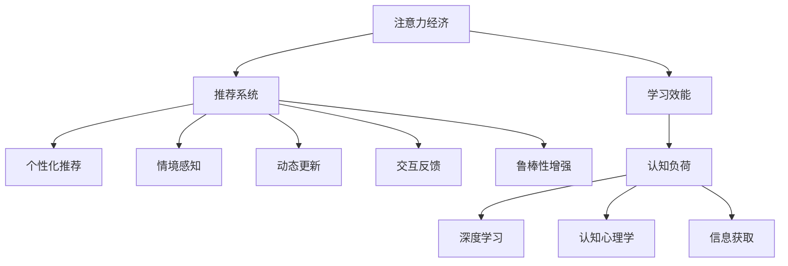

                 

# 注意力经济与个人学习效能的提升

> 关键词：注意力经济, 个人学习, 学习效能, 推荐系统, 认知负载, 深度学习, 认知心理学, 信息获取

## 1. 背景介绍

### 1.1 问题由来
在数字化和信息化的时代背景下，人们获取知识和信息的方式越来越多样化。然而，随着知识总量呈指数级增长，我们面临的是如何有效筛选和利用信息的挑战。传统的基于内容的推荐系统已难以满足个性化、多样化的信息需求，用户需要更加智能化的信息获取方式，以实现高效的认知学习和工作。

注意力经济（Economy of Attention）作为一种新型的经济形态，是指在信息爆炸的今天，人们有限的注意力成为稀缺资源，注意力资源的有效分配与利用将直接影响经济效益和社会价值。在个人学习中，如何高效利用注意力，提高学习效能，成为亟待解决的问题。

### 1.2 问题核心关键点
面对信息过载，注意力经济的核心问题在于如何通过智能推荐系统，实现用户注意力的精准分配。具体而言，需要在以下几个方面进行突破：
1. **个性化推荐**：根据用户的历史行为、兴趣偏好，提供符合其认知负荷的学习资源。
2. **情境感知**：理解用户在不同情境下（如工作、学习、休息）的需求变化，调整推荐策略。
3. **动态更新**：不断更新推荐模型，以适应用户行为的变化和外部环境的影响。
4. **交互反馈**：通过用户的反馈信息，持续优化推荐模型，提升推荐效果。
5. **鲁棒性增强**：提高推荐的稳定性和鲁棒性，避免误导性信息对用户认知的影响。

### 1.3 问题研究意义
在现代社会，学习效率和知识获取速度是个人竞争力的关键指标。通过智能推荐系统，可以有效提升个人学习效能，加速知识获取和技能提升，助力个人成长和职业发展。具体而言，研究注意力经济与个人学习效能的提升，具有以下意义：

1. **提高学习效率**：个性化推荐可以高效分配用户注意力，加快知识获取速度。
2. **促进认知提升**：推荐系统能提供符合用户认知负荷的内容，增强认知学习效果。
3. **支持终身学习**：动态更新的推荐模型，可以伴随用户不断变化的认知需求，实现终身学习。
4. **提升职业竞争力**：通过精准的学习推荐，增强职业技能的适应性和竞争力。
5. **推动教育公平**：个性化推荐有助于打破信息获取的不平等，促进教育公平。

## 2. 核心概念与联系

### 2.1 核心概念概述

为更好地理解注意力经济与个人学习效能提升的机制，本节将介绍几个核心概念：

- **注意力经济**：在信息时代，用户的时间、精力等注意力资源成为稀缺资源，其分配与利用直接影响经济效益和社会价值。
- **学习效能**：衡量学习者获取知识效率和质量的关键指标，包括认知负荷、注意力分配、知识结构等。
- **推荐系统**：通过分析用户行为和偏好，推荐符合其需求的内容，以提高信息获取效率的技术。
- **认知负荷**：指在获取、处理、存储和应用信息的过程中，认知系统所承受的压力。
- **深度学习**：一种基于神经网络的机器学习方法，能够从数据中自动提取特征，进行模式识别和决策。
- **认知心理学**：研究认知过程（如感知、记忆、思维等）及其神经机制的科学。
- **信息获取**：通过阅读、听讲、观看等多种方式，获取知识和信息的系统过程。

这些核心概念之间的逻辑关系可以通过以下Mermaid流程图来展示：



这个流程图展示了一系列核心概念及其相互关系：

1. 注意力经济通过推荐系统，对用户注意力进行精准分配。
2. 推荐系统包括个性化推荐、情境感知、动态更新等机制。
3. 学习效能涉及认知负荷、深度学习、认知心理学和信息获取等要素。
4. 深度学习通过神经网络，实现对用户行为和内容的理解。
5. 认知心理学研究认知过程及其神经机制，指导推荐系统的设计。
6. 信息获取是知识获取和信息传递的桥梁，与推荐系统紧密关联。

这些概念共同构成了学习效能提升的理论框架，提供了实现个性化推荐的基础。

## 3. 核心算法原理 & 具体操作步骤
### 3.1 算法原理概述

基于深度学习的推荐系统，通过分析用户的历史行为数据，提取用户兴趣和偏好，实现对学习资源的精准推荐。其核心思想在于，利用深度学习模型自动学习用户与内容之间的关联，通过优化模型参数，最大化用户满意度，提升学习效能。

具体而言，推荐系统一般包括以下几个关键步骤：

1. **用户建模**：对用户行为数据进行特征提取，建立用户兴趣模型。
2. **内容建模**：对学习资源进行特征提取，建立内容特征模型。
3. **相似度计算**：计算用户和内容之间的相似度，找出推荐目标。
4. **排名排序**：根据相似度排序，生成推荐列表。
5. **模型训练**：通过用户的交互反馈，不断优化模型，提高推荐精度。

通过以上步骤，推荐系统可以实现用户注意力的精准分配，提升学习效能。

### 3.2 算法步骤详解

以下将详细介绍基于深度学习的推荐系统的关键步骤：

**Step 1: 数据预处理**
- 收集用户的历史行为数据，如浏览记录、评分数据等。
- 对数据进行清洗和特征提取，去除噪声和不相关数据。
- 使用词袋模型或TF-IDF等方法，将文本数据转化为向量表示。

**Step 2: 用户建模**
- 对用户历史行为数据进行编码，生成用户兴趣向量。
- 使用协同过滤、基于内容的推荐等方法，构建用户模型。

**Step 3: 内容建模**
- 对学习资源进行特征提取，如文本关键词、类别标签等。
- 使用深度学习模型，如BERT、GPT等，学习资源表示。

**Step 4: 相似度计算**
- 计算用户与内容的相似度，常用余弦相似度、皮尔逊相关系数等。
- 使用矩阵分解方法，如奇异值分解(SVD)，优化相似度计算效率。

**Step 5: 排名排序**
- 根据相似度计算结果，对学习资源进行排序。
- 使用基线排序算法，如基于梯度的方法，提升推荐精度。

**Step 6: 模型训练**
- 通过用户交互反馈，调整模型参数，优化推荐结果。
- 使用在线学习、增量学习等方法，实时更新推荐模型。

**Step 7: 反馈机制**
- 收集用户的反馈信息，如评分、点击率等。
- 分析反馈数据，改进推荐模型，提高用户体验。

### 3.3 算法优缺点

基于深度学习的推荐系统具有以下优点：
1. 高效性：通过学习用户兴趣和内容特征，实现高效推荐。
2. 准确性：深度学习模型能够从大量数据中提取复杂特征，提高推荐精度。
3. 可扩展性：适用于大规模数据集和多种类型的数据源。
4. 自动化：推荐系统可以自动学习和优化，减轻人工干预。

同时，也存在一些局限性：
1. 数据依赖：深度学习模型的性能高度依赖于数据质量。
2. 泛化能力：当数据分布变化较大时，模型泛化能力可能降低。
3. 计算成本：深度学习模型的训练和推理需要大量计算资源。
4. 可解释性：深度学习模型往往是"黑盒"系统，难以解释推荐逻辑。

尽管存在这些局限性，但基于深度学习的推荐系统仍然是实现注意力经济与个人学习效能提升的有效方法。未来相关研究的方向在于如何进一步降低计算成本，提升模型的泛化能力，并增强推荐系统的可解释性。

### 3.4 算法应用领域

基于深度学习的推荐系统已经在多个领域得到了广泛应用，例如：

- **教育领域**：提供个性化的学习资源推荐，提升学习效果。
- **电商领域**：推荐符合用户兴趣的商品，提高购物体验。
- **新闻媒体**：推荐用户感兴趣的新闻内容，提高阅读质量。
- **社交网络**：推荐用户可能感兴趣的人或内容，加强社交互动。
- **在线课程**：根据用户的学习进度和偏好，推荐适合的视频或文章。

除了上述这些经典应用外，推荐系统还被创新性地应用于更多场景中，如个性化广告、智能助手、智能家居等，为人们的生活带来了更多的便利。随着推荐技术的不断进步，相信推荐系统将在更多领域发挥重要作用，成为信息时代的重要支撑。

## 4. 数学模型和公式 & 详细讲解  
### 4.1 数学模型构建

在本节中，我们将通过数学语言对基于深度学习的推荐系统的关键步骤进行更加严格的刻画。

设用户数量为 $U$，学习资源数量为 $I$。用户 $u$ 对资源 $i$ 的评分向量为 $R_{ui}$，内容 $i$ 的特征向量为 $X_i$，用户 $u$ 的特征向量为 $X_u$。推荐系统的目标是最大化用户满意度，即：

$$
\max_{X_u, X_i} \sum_{u=1}^{U} \sum_{i=1}^{I} R_{ui} \cdot \text{sim}(X_u, X_i)
$$

其中 $\text{sim}$ 为相似度函数，常用余弦相似度。

### 4.2 公式推导过程

假设用户 $u$ 与资源 $i$ 的相似度为 $\text{sim}(X_u, X_i) = \cos(\theta)$，其中 $\theta$ 为两个向量之间的夹角。则目标函数可以写为：

$$
\max_{X_u, X_i} \sum_{u=1}^{U} \sum_{i=1}^{I} R_{ui} \cdot \cos(\theta)
$$

根据梯度上升法，我们可以对用户和内容的特征向量进行优化：

$$
\frac{\partial \mathcal{L}}{\partial X_u} = \sum_{i=1}^{I} R_{ui} \cdot \nabla_{X_u} \cos(\theta)
$$

$$
\frac{\partial \mathcal{L}}{\partial X_i} = \sum_{u=1}^{U} R_{ui} \cdot \nabla_{X_i} \cos(\theta)
$$

其中 $\mathcal{L}$ 为推荐系统的损失函数，通常为均方误差损失。

### 4.3 案例分析与讲解

**案例1: 协同过滤推荐**

协同过滤推荐是一种基于用户行为数据的推荐方法。假设用户 $u$ 与资源 $i$ 的评分矩阵为 $R$，则协同过滤的相似度计算公式为：

$$
\text{sim}(X_u, X_i) = \frac{\sum_{j=1}^{J} R_{uj} \cdot R_{ji}}{\sqrt{\sum_{j=1}^{J} R_{uj}^2} \cdot \sqrt{\sum_{j=1}^{J} R_{ji}^2}}
$$

其中 $J$ 为用户与资源的评分数量。

**案例2: 基于内容的推荐**

基于内容的推荐方法利用资源本身的特征进行推荐。假设资源 $i$ 的特征向量为 $X_i$，用户 $u$ 的特征向量为 $X_u$，则基于内容的相似度计算公式为：

$$
\text{sim}(X_u, X_i) = \cos(X_u \cdot W \cdot X_i^T)
$$

其中 $W$ 为特征向量的权重矩阵。

## 5. 项目实践：代码实例和详细解释说明
### 5.1 开发环境搭建

在进行推荐系统开发前，我们需要准备好开发环境。以下是使用Python进行PyTorch开发的环境配置流程：

1. 安装Anaconda：从官网下载并安装Anaconda，用于创建独立的Python环境。

2. 创建并激活虚拟环境：
```bash
conda create -n recsys-env python=3.8 
conda activate recsys-env
```

3. 安装PyTorch：根据CUDA版本，从官网获取对应的安装命令。例如：
```bash
conda install pytorch torchvision torchaudio cudatoolkit=11.1 -c pytorch -c conda-forge
```

4. 安装各类工具包：
```bash
pip install numpy pandas scikit-learn matplotlib tqdm jupyter notebook ipython
```

完成上述步骤后，即可在`recsys-env`环境中开始推荐系统开发。

### 5.2 源代码详细实现

下面我们以基于协同过滤的推荐系统为例，给出使用PyTorch进行开发的PyTorch代码实现。

首先，定义评分数据和内容特征数据：

```python
import torch
from torch.utils.data import Dataset

class MovieDataset(Dataset):
    def __init__(self, data):
        self.data = data
        self.num_users = len(data['users'])
        self.num_items = len(data['items'])

    def __len__(self):
        return self.num_users

    def __getitem__(self, index):
        user = self.data['users'][index]
        items = self.data['items'][index]
        scores = torch.tensor(self.data['scores'][index])
        return user, items, scores
```

然后，定义模型和优化器：

```python
from torch.nn import Embedding, Linear
from torch.nn.functional import cosine_similarity
from torch.optim import Adam

class CollaborativeFilteringModel(torch.nn.Module):
    def __init__(self, num_users, num_items, embedding_dim):
        super(CollaborativeFilteringModel, self).__init__()
        self.user_embedding = Embedding(num_users, embedding_dim)
        self.item_embedding = Embedding(num_items, embedding_dim)
        self.similarity = cosine_similarity
        self.scorer = Linear(embedding_dim * 2, 1)

    def forward(self, user, item):
        user_emb = self.user_embedding(user)
        item_emb = self.item_embedding(item)
        sim = self.similarity(user_emb, item_emb)
        scores = self.scorer(torch.cat((user_emb, item_emb), dim=1))
        return scores
```

接着，定义训练和评估函数：

```python
from torch.utils.data import DataLoader
from sklearn.metrics import mean_squared_error
from tqdm import tqdm

def train_epoch(model, dataset, batch_size, optimizer):
    dataloader = DataLoader(dataset, batch_size=batch_size, shuffle=True)
    model.train()
    epoch_loss = 0
    for batch in tqdm(dataloader, desc='Training'):
        user, items, scores = batch
        model.zero_grad()
        outputs = model(user, items)
        loss = torch.mean((outputs - scores) ** 2)
        epoch_loss += loss.item()
        loss.backward()
        optimizer.step()
    return epoch_loss / len(dataloader)

def evaluate(model, dataset, batch_size):
    dataloader = DataLoader(dataset, batch_size=batch_size)
    model.eval()
    mse = 0
    with torch.no_grad():
        for batch in dataloader:
            user, items, scores = batch
            outputs = model(user, items)
            mse += torch.mean((outputs - scores) ** 2)
    return torch.sqrt(mse / len(dataset))
```

最后，启动训练流程并在测试集上评估：

```python
from sklearn.model_selection import train_test_split

# 假设已有数据集 data，包含用户、物品和评分数据
train_data, test_data = train_test_split(data, test_size=0.2, random_state=42)

train_dataset = MovieDataset(train_data)
test_dataset = MovieDataset(test_data)

model = CollaborativeFilteringModel(num_users, num_items, embedding_dim)
optimizer = Adam(model.parameters(), lr=0.01)

epochs = 10
batch_size = 32

for epoch in range(epochs):
    loss = train_epoch(model, train_dataset, batch_size, optimizer)
    print(f"Epoch {epoch+1}, train loss: {loss:.3f}")
    
print(f"Epoch {epochs}, dev MSE: {evaluate(model, test_dataset, batch_size):.3f}")
```

以上就是使用PyTorch对基于协同过滤的推荐系统进行开发的完整代码实现。可以看到，通过简单的代码实现，我们就能够快速搭建一个基本的推荐模型，并进行训练和评估。

### 5.3 代码解读与分析

让我们再详细解读一下关键代码的实现细节：

**MovieDataset类**：
- `__init__`方法：初始化数据集，记录用户和物品数量。
- `__len__`方法：返回数据集的样本数量。
- `__getitem__`方法：对单个样本进行处理，返回用户、物品和评分。

**CollaborativeFilteringModel类**：
- `__init__`方法：定义模型结构，包含用户嵌入、物品嵌入、相似度计算和评分预测等模块。
- `forward`方法：定义模型的前向传播过程，计算用户和物品的相似度，并输出评分预测结果。

**train_epoch和evaluate函数**：
- `train_epoch`函数：在训练集上迭代，前向传播计算损失函数并反向传播更新模型参数，返回该epoch的平均loss。
- `evaluate`函数：在测试集上评估模型性能，返回平均均方误差(MSE)。

**训练流程**：
- 定义总的epoch数和batch size，开始循环迭代
- 每个epoch内，先在训练集上训练，输出平均loss
- 在测试集上评估，输出平均MSE
- 所有epoch结束后，在测试集上评估，给出最终测试结果

可以看到，PyTorch配合深度学习框架，使得推荐系统的开发变得简洁高效。开发者可以将更多精力放在模型改进和算法优化上，而不必过多关注底层的实现细节。

当然，工业级的系统实现还需考虑更多因素，如模型的保存和部署、超参数的自动搜索、更灵活的任务适配层等。但核心的推荐范式基本与此类似。

## 6. 实际应用场景
### 6.1 智能推荐系统

智能推荐系统已经在电商、视频、音乐等多个领域得到了广泛应用，为用户提供了个性化的商品、视频、音乐等内容推荐，极大地提升了用户体验和满意度。

在具体应用中，智能推荐系统可以应用于：
- **商品推荐**：根据用户的浏览、购买记录，推荐可能感兴趣的商品。
- **视频推荐**：根据用户的观看历史，推荐符合其兴趣的视频内容。
- **音乐推荐**：根据用户的听歌记录，推荐相似的音乐和歌手。

这些推荐系统基于深度学习模型，通过分析用户历史行为数据，建立用户兴趣模型，实现精准推荐。推荐系统已经在多个行业取得了显著的效果，成为提高用户满意度和增加收益的重要工具。

### 6.2 在线学习平台

在线学习平台如Coursera、edX等，通过推荐系统提供个性化课程推荐，帮助用户快速找到合适的学习资源。推荐系统可以根据用户的兴趣和进度，推荐适合的课程和视频，提升学习效果。

在实际应用中，推荐系统可以应用于：
- **课程推荐**：根据用户的学习历史和评分，推荐符合其兴趣的课程。
- **学习资源推荐**：推荐适合的视频、文章和习题，增强学习体验。

通过推荐系统，在线学习平台能够提高课程的完成率和用户满意度，促进教育公平和知识共享。

### 6.3 内容聚合平台

内容聚合平台如知乎、豆瓣等，通过推荐系统提供个性化的内容推荐，帮助用户发现感兴趣的文章、评论和用户。推荐系统可以根据用户的兴趣和行为，推荐相关的内容，增加平台的用户粘性和活跃度。

在实际应用中，推荐系统可以应用于：
- **文章推荐**：根据用户的阅读历史和行为，推荐符合其兴趣的文章。
- **用户推荐**：推荐用户关注的相关用户，增加社交互动。

通过推荐系统，内容聚合平台能够提高用户活跃度和留存率，增强平台的影响力和品牌价值。

### 6.4 未来应用展望

随着推荐技术的不断进步，未来的推荐系统将在更多领域得到应用，为人们的生活带来更多的便利和价值。

在智慧医疗领域，推荐系统可以帮助医生推荐最新的医学研究成果，提升医疗服务的智能化水平。

在智能家居领域，推荐系统可以根据用户的生活习惯和偏好，推荐合适的家居环境和设备，提升生活质量。

在智能交通领域，推荐系统可以帮助司机推荐最优的行车路线和交通情况，提高行车安全性和效率。

此外，在金融、教育、旅游、健康等多个领域，推荐系统也将不断涌现，为各行各业提供智能化的解决方案，带来新的价值和机遇。

## 7. 工具和资源推荐
### 7.1 学习资源推荐

为了帮助开发者系统掌握推荐系统的理论基础和实践技巧，这里推荐一些优质的学习资源：

1. 《推荐系统基础》系列博文：由推荐系统专家撰写，详细介绍了推荐系统的基本原理、常用算法和最新进展。

2. Coursera《推荐系统》课程：斯坦福大学开设的推荐系统课程，涵盖推荐系统的基本概念、算法和实践，适合入门学习。

3. 《推荐系统》书籍：王宏志著，全面介绍了推荐系统的基本原理和实际应用，是推荐系统的经典教材。

4. KDD Cup竞赛数据集：KDD Cup是机器学习领域的重要竞赛，推荐系统是其中的重要比赛，其公开数据集是学习和研究推荐系统的宝贵资源。

5. Arxiv推荐系统相关论文：通过阅读相关论文，了解推荐系统的前沿技术和最新进展，掌握推荐系统的发展趋势。

通过对这些资源的学习实践，相信你一定能够快速掌握推荐系统的精髓，并用于解决实际的推荐问题。

### 7.2 开发工具推荐

高效的开发离不开优秀的工具支持。以下是几款用于推荐系统开发的常用工具：

1. PyTorch：基于Python的开源深度学习框架，灵活动态的计算图，适合快速迭代研究。

2. TensorFlow：由Google主导开发的开源深度学习框架，生产部署方便，适合大规模工程应用。

3. TensorFlow Recommenders：TensorFlow的推荐系统组件，提供了丰富的推荐模型和评估指标，适合实际应用开发。

4. Weights & Biases：模型训练的实验跟踪工具，可以记录和可视化模型训练过程中的各项指标，方便对比和调优。

5. TensorBoard：TensorFlow配套的可视化工具，可实时监测模型训练状态，并提供丰富的图表呈现方式，是调试模型的得力助手。

6. Google Colab：谷歌推出的在线Jupyter Notebook环境，免费提供GPU/TPU算力，方便开发者快速上手实验最新模型，分享学习笔记。

合理利用这些工具，可以显著提升推荐系统的开发效率，加快创新迭代的步伐。

### 7.3 相关论文推荐

推荐系统的研究源于学界的持续探索。以下是几篇奠基性的相关论文，推荐阅读：

1. Factorization Machines for Recommender Systems：提出了基于矩阵分解的推荐算法，成为推荐系统的主流方法。

2. Deep Collaborative Filtering using Neural Multi-Layer Perceptrons：将深度学习引入推荐系统，提高了推荐精度和泛化能力。

3. Attention-Based Recommender Systems：提出基于注意力机制的推荐模型，进一步提高了推荐系统的效果。

4. Multi-Task Learning for Recommender Systems：研究多任务学习在推荐系统中的应用，提升了推荐模型的整体性能。

5. Learning Compressed Sensing-based Recommender Systems：提出了基于压缩感知的推荐方法，减小了计算和存储成本。

6. Fast Matrix Factorization with Implicit Feedback：提出快速矩阵分解算法，提高了推荐系统的训练效率。

这些论文代表了推荐系统的研究进展和方向。通过学习这些前沿成果，可以帮助研究者把握学科前进方向，激发更多的创新灵感。

## 8. 总结：未来发展趋势与挑战

### 8.1 总结

本文对基于深度学习的推荐系统进行了全面系统的介绍。首先阐述了注意力经济与个人学习效能提升的背景和意义，明确了推荐系统在提升学习效率和用户体验中的关键作用。其次，从原理到实践，详细讲解了推荐系统的数学模型和算法步骤，给出了推荐系统开发的完整代码实现。同时，本文还探讨了推荐系统在多个领域的应用前景，展示了其广阔的发展空间。

通过本文的系统梳理，可以看到，基于深度学习的推荐系统已经成为提升学习效能的重要手段，其理论基础和实践经验不断成熟，为信息获取和知识传递带来了新的可能性。未来，随着推荐技术的不断发展，推荐系统必将在更多领域发挥重要作用，成为推动人类进步的重要力量。

### 8.2 未来发展趋势

展望未来，推荐系统的技术发展将呈现以下几个趋势：

1. **深度学习模型的创新**：新的深度学习架构和算法将不断涌现，提升推荐系统的精度和泛化能力。
2. **用户行为的理解**：更深入地理解用户行为和偏好，提升推荐系统的个性化水平。
3. **跨领域推荐**：将推荐系统应用于多个领域，实现跨领域的协同推荐。
4. **动态更新与自适应**：实时更新推荐模型，适应用户行为的变化和外部环境的影响。
5. **多模态数据的融合**：融合视觉、语音、文本等多模态数据，提升推荐系统的综合能力。

这些趋势表明，推荐系统将在多个领域实现更广泛的应用，成为构建智能社会的重要支撑。

### 8.3 面临的挑战

尽管推荐系统已经取得了显著成就，但在实现精准推荐和高效学习的过程中，仍面临诸多挑战：

1. **数据隐私问题**：如何保护用户隐私，防止数据泄露和滥用。
2. **模型复杂性**：如何降低深度学习模型的复杂性，提高训练和推理效率。
3. **泛化能力**：如何提高推荐系统的泛化能力，避免对特定数据集的过拟合。
4. **用户满意度**：如何提升用户满意度，解决推荐系统中的误导性问题和偏见。
5. **计算资源**：如何降低推荐系统的计算成本，提高其在实际应用中的可扩展性。

尽管存在这些挑战，但随着技术不断进步和创新，推荐系统必将在更多领域得到应用，为人类社会的进步带来新的动力。

### 8.4 研究展望

面对推荐系统面临的诸多挑战，未来的研究需要在以下几个方面寻求新的突破：

1. **数据隐私保护**：开发隐私保护算法，保障用户数据的安全和隐私。
2. **模型压缩与优化**：研究模型压缩和优化技术，提高模型的训练和推理效率。
3. **多模态融合**：探索多模态数据融合技术，提升推荐系统的综合能力。
4. **跨领域协同**：研究跨领域的协同推荐算法，提升推荐系统的泛化能力。
5. **用户反馈机制**：建立有效的用户反馈机制，持续优化推荐模型，提高用户体验。

这些研究方向的探索，必将引领推荐系统技术迈向更高的台阶，为构建智能推荐系统铺平道路。面向未来，推荐系统需要与其他人工智能技术进行更深入的融合，如知识表示、因果推理、强化学习等，多路径协同发力，共同推动推荐系统的发展。只有勇于创新、敢于突破，才能不断拓展推荐系统的边界，实现精准推荐和高效学习。

## 9. 附录：常见问题与解答

**Q1：推荐系统如何处理稀疏数据？**

A: 推荐系统中的评分数据往往非常稀疏，即大多数用户-物品对没有评分记录。常用的处理方式包括：
1. 基于矩阵分解的方法，如SVD，能够有效处理稀疏矩阵。
2. 使用深度学习模型，如BERT，对稀疏数据进行表示学习。
3. 利用协同过滤方法，如用户基线、物品基线，对未评分数据进行预测。

**Q2：推荐系统如何缓解冷启动问题？**

A: 冷启动问题指的是新用户或新物品缺乏足够评分记录，难以推荐。常用的缓解方式包括：
1. 基于内容的推荐，利用物品本身的特征进行推荐。
2. 利用相似性匹配，将新用户或新物品与已有的用户或物品进行匹配。
3. 利用社交网络，通过相似用户或物品的评分数据进行推荐。

**Q3：推荐系统如何优化用户满意度？**

A: 用户满意度是推荐系统的重要评价指标。可以通过以下方式优化：
1. 提升推荐精度，减少误导性推荐。
2. 增加推荐多样性，避免推荐同质化内容。
3. 建立反馈机制，根据用户反馈持续优化推荐模型。

**Q4：推荐系统如何提升鲁棒性？**

A: 推荐系统的鲁棒性指的是模型对数据分布变化的适应能力。可以通过以下方式提升：
1. 引入对抗样本，训练鲁棒性更强的推荐模型。
2. 使用正则化技术，如L2正则、Dropout等，防止模型过拟合。
3. 采用增量学习方法，实时更新推荐模型，保持模型的稳定性和鲁棒性。

**Q5：推荐系统如何提升可解释性？**

A: 推荐系统的可解释性指的是模型的决策逻辑和推理过程能够被解释和理解。可以通过以下方式提升：
1. 引入可解释性模块，如Shapley值、LIME等，解释推荐结果的来源。
2. 利用模型压缩和特征重要性分析，简化模型的复杂性。
3. 建立用户反馈机制，了解用户对推荐结果的看法，不断改进推荐算法。

通过这些常见问题的回答，希望能够帮助读者更好地理解推荐系统的核心原理和应用实践，进一步推动个人学习效能的提升和智能推荐技术的发展。

---

作者：禅与计算机程序设计艺术 / Zen and the Art of Computer Programming

