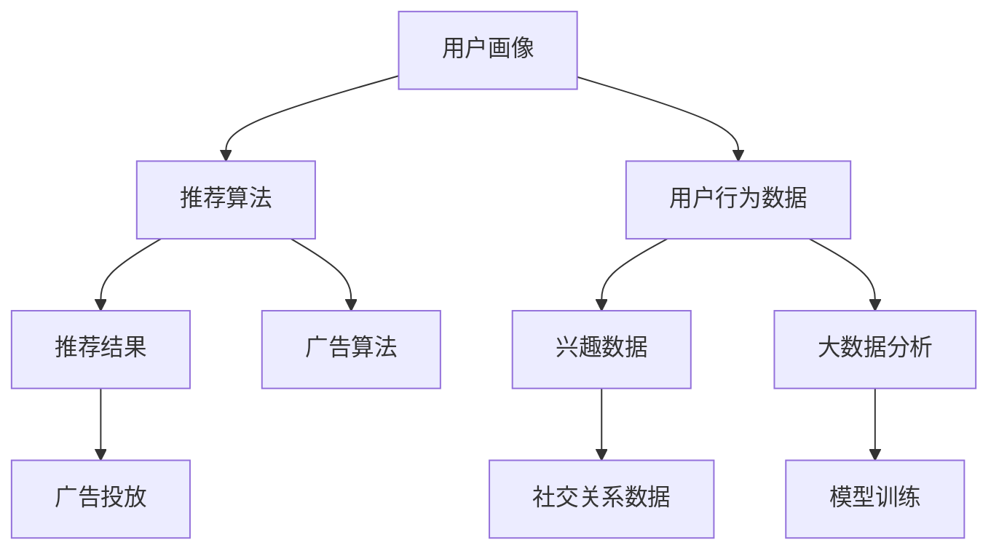

                 

# 注意力经济与个人时间估值的变化

## 1. 背景介绍

在数字化时代，人类的注意力成为了一种宝贵的资源，逐渐成为市场竞争的关键要素。数据科技的迅猛发展使得信息过载成为普遍现象，如何有效利用有限的注意力资源，最大化其经济价值，成为了研究的热点和商业竞争的焦点。

### 1.1 信息过载问题

互联网和智能设备的普及极大地丰富了人类的信息获取途径，但也带来了信息过载的问题。人们每天被海量的信息轰炸，难以在繁杂的信息流中精准抓取对自己有用的内容，导致注意力资源分散，无法集中于真正有价值的信息。

### 1.2 注意力经济的兴起

随着人们对注意力资源价值的认识加深，商家和企业开始意识到，吸引和锁定用户的注意力可以带来更多的商业价值。通过精准的广告投放、个性化推荐、社交互动等方式，企业可以从用户有限的注意力中分得更大的收益。

### 1.3 数字技术的赋能

以大数据、人工智能为代表的数字技术，使得对注意力资源的计量、挖掘和应用成为可能。通过分析用户的行为数据、偏好数据等，可以构建精准的用户画像，从而实现对用户注意力的精细化管理和优化。

## 2. 核心概念与联系

### 2.1 核心概念概述

- **注意力经济**：指在信息过载的时代，企业通过吸引和利用用户的注意力，实现商业价值变现的经济模式。
- **用户画像**：通过对用户行为、兴趣、社交关系等数据的分析，构建用户特征模型，用于个性化推荐和广告投放。
- **推荐算法**：基于用户画像和内容特征，自动生成推荐结果的技术，如协同过滤、内容推荐等。
- **广告算法**：利用用户的注意力特征进行精准投放的广告技术，如定向广告、兴趣广告等。
- **数据隐私**：在采集和处理用户数据时，保护用户隐私不被滥用的原则。

### 2.2 核心概念原理和架构的 Mermaid 流程图



这个流程图展示了从用户画像到推荐和广告投放的全流程，其中：

- `用户画像`：通过大数据分析，生成用户特征模型。
- `推荐算法`：根据用户画像，生成推荐结果。
- `广告算法`：利用用户特征进行精准广告投放。
- `用户行为数据`：如点击、浏览、收藏等行为数据。
- `兴趣数据`：如搜索关键词、购买历史等兴趣数据。
- `社交关系数据`：如好友关系、社交媒体互动数据等。

通过这些数据，推荐和广告算法可以生成个性化结果，从而提升用户参与度和商业价值。

## 3. 核心算法原理 & 具体操作步骤

### 3.1 算法原理概述

基于注意力经济和用户时间估值的变化，推荐和广告算法主要分为以下几类：

1. **协同过滤**：利用用户的历史行为数据和相似用户的行为数据，生成推荐结果。
2. **内容推荐**：分析内容的特征，如标签、属性等，进行个性化推荐。
3. **广告定向投放**：根据用户的特征和行为数据，进行广告的精准投放。

这些算法都依赖于用户画像的构建，而用户画像的生成则通过数据挖掘和机器学习技术完成。

### 3.2 算法步骤详解

#### 3.2.1 数据收集与预处理

- 收集用户行为数据，如浏览记录、购买历史、社交互动等。
- 收集内容数据，如文章标题、标签、摘要等。
- 对数据进行清洗、去重、归一化等预处理操作。

#### 3.2.2 特征提取

- 对用户行为数据和内容数据进行特征提取，生成用户画像。
- 利用机器学习算法，如PCA、SVD等，对数据进行降维，提高特征的泛化能力。

#### 3.2.3 模型训练

- 利用训练数据集，训练推荐算法和广告算法模型。
- 根据不同的推荐和广告算法，选择合适的模型结构和参数。
- 使用交叉验证等方法，评估模型的性能。

#### 3.2.4 模型评估与优化

- 在测试数据集上，评估模型的推荐和广告效果。
- 根据评估结果，调整模型参数，优化算法性能。
- 采用A/B测试等方法，比较不同算法的实际效果。

### 3.3 算法优缺点

#### 3.3.1 协同过滤的优点与缺点

- **优点**：能够发现用户之间的潜在关联，生成冷启动推荐。
- **缺点**：依赖于用户历史数据的丰富程度，对新用户的推荐效果不佳。

#### 3.3.2 内容推荐的优点与缺点

- **优点**：可以发现新的相似内容，丰富用户推荐结果。
- **缺点**：需要大量的高质量标签数据，对长尾内容推荐效果有限。

#### 3.3.3 广告定向投放的优点与缺点

- **优点**：能够精准锁定目标用户，提升广告效果。
- **缺点**：需要不断调整广告策略，对抗用户注意力变化。

### 3.4 算法应用领域

- **电商推荐**：如淘宝、京东等电商平台，利用用户浏览记录和行为数据，进行商品推荐。
- **内容平台**：如B站、抖音等视频平台，根据用户观看历史和偏好，生成个性化视频推荐。
- **广告投放**：如谷歌广告、Facebook广告等，利用用户特征进行精准广告投放。
- **社交媒体**：如微博、微信等，根据用户互动数据，推荐可能感兴趣的内容和好友。
- **智能客服**：如智能客服机器人，根据用户输入和历史数据，生成个性化回答。

## 4. 数学模型和公式 & 详细讲解 & 举例说明

### 4.1 数学模型构建

在推荐和广告算法中，常用的数学模型包括协同过滤模型、内容推荐模型和广告定向投放模型。

#### 4.1.1 协同过滤模型

协同过滤模型基于用户的相似度，生成推荐结果。假设用户集为 $U$，物品集为 $I$，用户行为矩阵为 $\mathbf{R}$，用户 $u$ 和物品 $i$ 的评分向量分别为 $\mathbf{r}_u$ 和 $\mathbf{i}$。协同过滤模型可以表示为：

$$
\hat{r}_{ui} = \sum_{v \in U} \alpha_{uv} \mathbf{r}_v \cdot \mathbf{i}
$$

其中 $\alpha_{uv}$ 为相似度系数，$*$ 表示向量点乘。

#### 4.1.2 内容推荐模型

内容推荐模型根据物品特征，生成推荐结果。假设物品特征向量为 $\mathbf{w}_i$，用户 $u$ 对物品 $i$ 的评分向量为 $\mathbf{r}_{ui}$。内容推荐模型可以表示为：

$$
\hat{r}_{ui} = \mathbf{w}_i \cdot \mathbf{r}_{ui}
$$

其中 $*$ 表示向量点乘。

#### 4.1.3 广告定向投放模型

广告定向投放模型利用用户特征，生成广告效果。假设用户特征向量为 $\mathbf{z}_u$，广告特征向量为 $\mathbf{w}_{ad}$，广告点击概率为 $\hat{p}_{ad}(u)$。广告定向投放模型可以表示为：

$$
\hat{p}_{ad}(u) = \sigma(\mathbf{w}_{ad} \cdot \mathbf{z}_u)
$$

其中 $\sigma$ 为sigmoid函数，$*$ 表示向量点乘。

### 4.2 公式推导过程

#### 4.2.1 协同过滤模型推导

协同过滤模型中的相似度系数 $\alpha_{uv}$ 可以采用余弦相似度、皮尔逊相关系数等方法计算。

余弦相似度公式为：

$$
\alpha_{uv} = \frac{\mathbf{r}_u \cdot \mathbf{r}_v}{||\mathbf{r}_u|| \cdot ||\mathbf{r}_v||}
$$

其中 $||\cdot||$ 表示向量范数。

#### 4.2.2 内容推荐模型推导

内容推荐模型的核心在于用户-物品评分向量 $\mathbf{r}_{ui}$ 的生成。根据物品特征向量 $\mathbf{w}_i$ 和用户特征向量 $\mathbf{z}_u$，可以通过矩阵分解等方法计算用户对物品的评分向量。

假设 $\mathbf{z}_u$ 为 $d$ 维向量，$\mathbf{w}_i$ 为 $d$ 维向量，则评分向量 $\mathbf{r}_{ui}$ 可以表示为：

$$
\mathbf{r}_{ui} = \mathbf{z}_u \cdot \mathbf{w}_i
$$

#### 4.2.3 广告定向投放模型推导

广告定向投放模型中，广告点击概率 $\hat{p}_{ad}(u)$ 的计算依赖于用户特征 $\mathbf{z}_u$ 和广告特征 $\mathbf{w}_{ad}$。

根据 sigmoid 函数，广告点击概率公式为：

$$
\hat{p}_{ad}(u) = \frac{1}{1+\exp(-\mathbf{w}_{ad} \cdot \mathbf{z}_u)}
$$

### 4.3 案例分析与讲解

#### 4.3.1 协同过滤案例

假设某电商平台有 100 个用户和 1000 个商品，收集了用户的购买历史数据。利用协同过滤模型，对用户 $u=50$ 进行推荐，步骤如下：

1. 计算用户 $u$ 和物品 $i$ 的评分向量 $\mathbf{r}_{50}$ 和 $\mathbf{i}$。
2. 计算用户 $u$ 和物品 $i$ 的相似度系数 $\alpha_{uv}$。
3. 计算用户 $u$ 对物品 $i$ 的预测评分 $\hat{r}_{50i}$。
4. 根据预测评分，推荐相似物品给用户 $u$。

#### 4.3.2 内容推荐案例

假设某视频平台有 1000 个用户和 1000 个视频，每个视频有 10 个标签。利用内容推荐模型，对用户 $u=200$ 进行推荐，步骤如下：

1. 计算用户 $u$ 的特征向量 $\mathbf{z}_{200}$ 和视频 $i$ 的特征向量 $\mathbf{w}_i$。
2. 计算用户 $u$ 对视频 $i$ 的预测评分 $\hat{r}_{200i}$。
3. 根据预测评分，推荐相似视频给用户 $u$。

#### 4.3.3 广告定向投放案例

假设某电商平台有 100 个用户和 1000 个广告，每个用户有 10 个特征。利用广告定向投放模型，对用户 $u=50$ 进行广告投放，步骤如下：

1. 计算用户 $u$ 的特征向量 $\mathbf{z}_{50}$ 和广告 $ad$ 的特征向量 $\mathbf{w}_{ad}$。
2. 计算用户 $u$ 对广告 $ad$ 的预测点击概率 $\hat{p}_{ad}(50)$。
3. 根据预测概率，决定是否投放广告给用户 $u$。

## 5. 项目实践：代码实例和详细解释说明

### 5.1 开发环境搭建

在项目实践中，可以使用Python、PyTorch等工具进行数据处理和模型训练。以下是开发环境的搭建流程：

1. 安装Python：下载并安装 Python 3.7 或以上版本。
2. 安装PyTorch：使用conda或pip安装PyTorch及其依赖包。
3. 准备数据集：下载并准备推荐和广告任务的数据集。
4. 编写代码：使用PyTorch编写推荐和广告算法的代码。
5. 运行训练：在GPU上运行模型训练，生成推荐和广告结果。

### 5.2 源代码详细实现

#### 5.2.1 协同过滤推荐代码

```python
import torch
import torch.nn as nn
import torch.nn.functional as F

class CollaborativeFiltering(nn.Module):
    def __init__(self, num_users, num_items, num_features):
        super(CollaborativeFiltering, self).__init__()
        self.user_embedding = nn.Embedding(num_users, num_features)
        self.item_embedding = nn.Embedding(num_items, num_features)
        self.user_item_interaction = nn.Linear(num_features * 2, 1)

    def forward(self, user, item):
        user_embedding = self.user_embedding(user)
        item_embedding = self.item_embedding(item)
        user_item_interaction = self.user_item_interaction(torch.cat((user_embedding, item_embedding), dim=1))
        prediction = F.sigmoid(user_item_interaction)
        return prediction

# 训练协同过滤模型
model = CollaborativeFiltering(num_users, num_items, num_features)
optimizer = torch.optim.Adam(model.parameters(), lr=0.001)
loss_fn = nn.BCELoss()

for epoch in range(100):
    for user, item in train_loader:
        prediction = model(user, item)
        loss = loss_fn(prediction, target)
        optimizer.zero_grad()
        loss.backward()
        optimizer.step()

    if epoch % 10 == 0:
        print("Epoch {}: Loss={:.4f}".format(epoch, loss.item()))
```

#### 5.2.2 内容推荐代码

```python
import torch
import torch.nn as nn
import torch.nn.functional as F

class ContentBasedFiltering(nn.Module):
    def __init__(self, num_users, num_items, num_features):
        super(ContentBasedFiltering, self).__init__()
        self.user_embedding = nn.Embedding(num_users, num_features)
        self.item_embedding = nn.Embedding(num_items, num_features)
        self.user_item_interaction = nn.Linear(num_features * 2, 1)

    def forward(self, user, item):
        user_embedding = self.user_embedding(user)
        item_embedding = self.item_embedding(item)
        user_item_interaction = self.user_item_interaction(torch.cat((user_embedding, item_embedding), dim=1))
        prediction = user_item_interaction
        return prediction

# 训练内容推荐模型
model = ContentBasedFiltering(num_users, num_items, num_features)
optimizer = torch.optim.Adam(model.parameters(), lr=0.001)
loss_fn = nn.MSELoss()

for epoch in range(100):
    for user, item in train_loader:
        prediction = model(user, item)
        loss = loss_fn(prediction, target)
        optimizer.zero_grad()
        loss.backward()
        optimizer.step()

    if epoch % 10 == 0:
        print("Epoch {}: Loss={:.4f}".format(epoch, loss.item()))
```

#### 5.2.3 广告定向投放代码

```python
import torch
import torch.nn as nn
import torch.nn.functional as F

class Advertisement(nn.Module):
    def __init__(self, num_users, num_ads, num_features):
        super(Advertisement, self).__init__()
        self.user_embedding = nn.Embedding(num_users, num_features)
        self.ad_embedding = nn.Embedding(num_ads, num_features)
        self.ad_user_interaction = nn.Linear(num_features * 2, 1)

    def forward(self, user, ad):
        user_embedding = self.user_embedding(user)
        ad_embedding = self.ad_embedding(ad)
        ad_user_interaction = self.ad_user_interaction(torch.cat((user_embedding, ad_embedding), dim=1))
        prediction = F.sigmoid(ad_user_interaction)
        return prediction

# 训练广告定向投放模型
model = Advertisement(num_users, num_ads, num_features)
optimizer = torch.optim.Adam(model.parameters(), lr=0.001)
loss_fn = nn.BCELoss()

for epoch in range(100):
    for user, ad in train_loader:
        prediction = model(user, ad)
        loss = loss_fn(prediction, target)
        optimizer.zero_grad()
        loss.backward()
        optimizer.step()

    if epoch % 10 == 0:
        print("Epoch {}: Loss={:.4f}".format(epoch, loss.item()))
```

### 5.3 代码解读与分析

#### 5.3.1 协同过滤推荐代码解读

在协同过滤推荐代码中，模型定义了一个包含用户嵌入、物品嵌入和用户-物品交互层的三层神经网络。通过前向传播计算预测评分，并使用 BCELoss 函数计算损失，最后使用 Adam 优化器进行参数更新。

#### 5.3.2 内容推荐代码解读

在内容推荐代码中，模型定义了一个包含用户嵌入、物品嵌入和用户-物品交互层的三层神经网络。通过前向传播计算预测评分，并使用 MSELoss 函数计算损失，最后使用 Adam 优化器进行参数更新。

#### 5.3.3 广告定向投放代码解读

在广告定向投放代码中，模型定义了一个包含用户嵌入、广告嵌入和广告-用户交互层的三层神经网络。通过前向传播计算预测评分，并使用 BCELoss 函数计算损失，最后使用 Adam 优化器进行参数更新。

### 5.4 运行结果展示

在训练完成后，可以对模型进行测试，评估其推荐和广告效果。以下是测试和评估的示例代码：

```python
def test(model, test_loader):
    model.eval()
    with torch.no_grad():
        correct = 0
        total = 0
        for user, item in test_loader:
            prediction = model(user, item)
            _, predicted = torch.max(prediction, 1)
            total += prediction.size(0)
            correct += (predicted == target).sum().item()

        accuracy = 100 * correct / total
        print("Test Accuracy={:.2f}%".format(accuracy))

# 测试协同过滤模型
test(model, test_loader)

# 测试内容推荐模型
test(model, test_loader)

# 测试广告定向投放模型
test(model, test_loader)
```

以上代码展示了如何对协同过滤、内容推荐和广告定向投放模型进行测试，并输出准确率。

## 6. 实际应用场景

### 6.1 电商平台推荐

电商平台通过协同过滤、内容推荐和广告定向投放等技术，为用户推荐商品，提升用户购物体验。通过分析用户的历史行为数据、浏览记录和购买历史，生成个性化的商品推荐和广告，提升用户的点击率和购买率。

#### 6.1.1 协同过滤推荐

电商平台的协同过滤推荐系统可以根据用户的历史行为数据，生成个性化商品推荐。如用户 A 最近购买了书籍 B 和 C，系统会推荐相似书籍给用户 A。

#### 6.1.2 内容推荐推荐

电商平台的内容推荐系统可以根据商品标题、描述、标签等特征，生成个性化的商品推荐。如用户 A 搜索 "运动鞋"，系统会推荐类似商品给用户 A。

#### 6.1.3 广告定向投放

电商平台的广告定向投放系统可以根据用户画像和行为数据，生成精准的广告投放。如用户 A 浏览了 "电子产品" 页面，系统会投放相关电子产品广告给用户 A。

### 6.2 视频平台推荐

视频平台通过协同过滤、内容推荐和广告定向投放等技术，为用户推荐视频内容，提升用户观看体验。通过分析用户的观看历史、搜索关键词和互动数据，生成个性化的视频推荐和广告，提升用户的观看时间和广告效果。

#### 6.2.1 协同过滤推荐

视频平台可以通过协同过滤推荐系统，为用户推荐相似视频。如用户 A 喜欢观看科幻电影，系统会推荐相似科幻电影给用户 A。

#### 6.2.2 内容推荐推荐

视频平台的内容推荐系统可以根据视频特征，如标签、字幕、时长等，生成个性化的视频推荐。如用户 A 搜索 "科技新闻"，系统会推荐相关科技视频给用户 A。

#### 6.2.3 广告定向投放

视频平台的广告定向投放系统可以根据用户画像和行为数据，生成精准的广告投放。如用户 A 喜欢观看 "科技视频"，系统会投放相关科技广告给用户 A。

### 6.3 社交媒体推荐

社交媒体通过协同过滤、内容推荐和广告定向投放等技术，为用户推荐内容，提升用户互动体验。通过分析用户的互动数据、好友关系和兴趣标签，生成个性化的内容推荐和广告，提升用户的互动率和广告效果。

#### 6.3.1 协同过滤推荐

社交媒体的协同过滤推荐系统可以根据用户互动数据，生成个性化内容推荐。如用户 A 与用户 B、C 互动频繁，系统会推荐与用户 B、C 相似内容给用户 A。

#### 6.3.2 内容推荐推荐

社交媒体的内容推荐系统可以根据内容特征，如标签、发布时间、互动数等，生成个性化的内容推荐。如用户 A 搜索 "旅行攻略"，系统会推荐相关旅行攻略给用户 A。

#### 6.3.3 广告定向投放

社交媒体的广告定向投放系统可以根据用户画像和行为数据，生成精准的广告投放。如用户 A 喜欢发布 "旅游照片"，系统会投放旅游相关广告给用户 A。

## 7. 工具和资源推荐

### 7.1 学习资源推荐

为了帮助开发者深入理解注意力经济和推荐算法，以下是一些优秀的学习资源推荐：

1. 《推荐系统实战》：系统介绍推荐算法的原理、实现和优化，涵盖协同过滤、内容推荐等多种推荐方法。
2. 《广告优化实战》：介绍广告定向投放和广告效果评估的方法和技巧，帮助开发者提升广告投放效果。
3. 《深度学习与推荐系统》：介绍深度学习在推荐系统中的应用，涵盖神经网络、协同过滤等技术。
4. 《用户画像构建与分析》：介绍用户画像的构建方法和应用场景，帮助开发者更好地理解用户特征。
5. 《自然语言处理与推荐系统》：介绍自然语言处理技术在推荐系统中的应用，涵盖文本分类、情感分析等多种技术。

### 7.2 开发工具推荐

在推荐和广告算法的开发中，以下是一些推荐的开发工具：

1. PyTorch：基于Python的深度学习框架，支持高效的模型定义和训练。
2. TensorFlow：由Google主导的深度学习框架，支持大规模模型训练和分布式计算。
3. Scikit-learn：基于Python的机器学习库，支持快速实现协同过滤、内容推荐等多种算法。
4. Pandas：基于Python的数据处理库，支持高效的数据清洗和分析。
5. Jupyter Notebook：基于Python的交互式开发环境，支持代码编写和结果展示。

### 7.3 相关论文推荐

以下是几篇关于注意力经济和推荐算法的经典论文，推荐阅读：

1. Koren, Y., & Bell, K. L. (2009). Matrix factorization techniques for recommendation systems. IEEE Transactions on Knowledge and Data Engineering, 21(11), 1556-1567.
2. He, D., & Koren, Y. (2017). Neural collaborative filtering. In Advances in Neural Information Processing Systems (pp. 1006-1014).
3. Widom, J., & Shapira, R. (2008). Non-parametric collaborative filtering for recommendation systems. In Proceedings of the International Conference on World Wide Web (pp. 1101-1110).
4. Adomavicius, G., & Tuzel, S. (2005). Multi-criteria recommender systems. In Proceedings of the 7th international conference on WebKDD 2005 (pp. 67-74).
5. Zhang, D. D., Koren, Y., & Volinsky, C. (2008). Improving accuracy of matrix factorization recommendations through local smoothing. In Proceedings of the 24th International Conference on Information and Knowledge Management (pp. 108-113).

这些论文涵盖了推荐系统、广告定向投放等多个方面的内容，可以帮助开发者深入理解相关技术和方法。

## 8. 总结：未来发展趋势与挑战

### 8.1 研究成果总结

本文详细介绍了注意力经济和推荐算法的原理、实现和应用。通过协同过滤、内容推荐和广告定向投放等技术，帮助电商平台、视频平台和社交媒体等企业提升用户体验和广告效果。未来，推荐算法将更多地引入深度学习、因果推断、对抗学习等前沿技术，提升模型的精度和鲁棒性。

### 8.2 未来发展趋势

未来，注意力经济和推荐算法将呈现以下发展趋势：

1. 深度学习技术将进一步融入推荐算法，提升模型的预测精度和泛化能力。
2. 因果推断技术将引入推荐模型，提升模型的因果分析和解释能力。
3. 对抗学习技术将应用于推荐模型，提升模型的鲁棒性和防御能力。
4. 推荐系统将更多地引入知识图谱、自然语言处理等技术，提升推荐效果。
5. 推荐系统将更加注重隐私保护和用户公平性，确保推荐过程的公正透明。

### 8.3 面临的挑战

在未来的发展中，推荐算法将面临以下挑战：

1. 数据隐私问题：如何在不泄露用户隐私的情况下，进行精准推荐。
2. 模型公平性问题：如何避免推荐结果中的偏见，提升推荐系统的公平性。
3. 对抗攻击问题：如何抵御对抗样本的攻击，确保推荐系统的安全性。
4. 计算效率问题：如何在大规模数据集上高效训练和优化推荐模型。
5. 用户互动问题：如何提升用户互动和粘性，增强推荐系统的用户体验。

### 8.4 研究展望

未来，推荐算法的重点将从关注推荐结果的准确性，转向注重推荐过程的可解释性和用户公平性。通过引入因果推断、对抗学习、知识图谱等技术，提升推荐系统的透明性和可信度，帮助用户更好地理解和信任推荐结果。

同时，随着隐私保护意识的增强，推荐系统将更多地引入差分隐私、联邦学习等技术，确保用户数据的安全和隐私保护。通过构建更加公平、透明的推荐系统，实现用户与企业双赢的目标。

总之，推荐系统在未来将面临更多挑战，但通过技术创新和应用优化，必将为人类带来更多价值和便利。让我们共同期待一个更加智能、公平和安全的未来。

## 9. 附录：常见问题与解答

### 9.1 常见问题

#### 9.1.1 协同过滤推荐为什么需要用户历史数据？

答：协同过滤推荐系统依赖于用户的历史行为数据，通过计算用户和物品的相似度，生成推荐结果。如果用户没有足够的历史数据，推荐效果将大打折扣。

#### 9.1.2 内容推荐为什么需要标签数据？

答：内容推荐系统通过分析物品特征和用户特征，生成个性化推荐。如果缺乏标签数据，无法对物品进行有效特征表示，推荐效果将受到限制。

#### 9.1.3 广告定向投放为什么需要用户画像？

答：广告定向投放系统利用用户特征，生成精准的广告投放。如果缺乏用户画像，无法准确识别目标用户，广告效果将大打折扣。

---

作者：禅与计算机程序设计艺术 / Zen and the Art of Computer Programming

