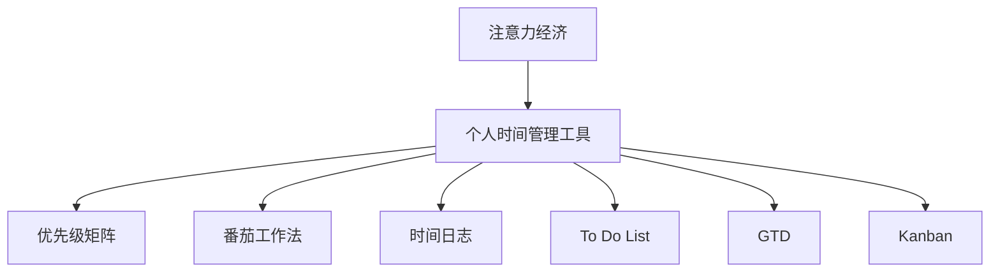

                 

## 1. 背景介绍

### 1.1 问题由来

在现代社会，人们面临的信息过载、时间碎片化等问题愈发凸显。信息无处不在，但同时也分散了我们的注意力，使得我们难以高效地利用时间。如何更好地管理时间，提高个人和组织的效率，成为现代社会的重要课题。

注意力经济学（Attention Economics）作为一门新兴学科，研究人们如何在面对海量信息时进行注意力分配和价值判断。而个人时间管理工具（Personal Time Management Tools）正是基于这一经济学原理，辅助个体有效利用时间，提升个人生产力的重要手段。

### 1.2 问题核心关键点

注意力经济与个人时间管理工具的结合，旨在通过科学地管理时间，实现个人价值最大化。关键点包括：

- **注意力分配**：如何科学地分配注意力，在有限的时间内处理更多重要事务。
- **价值判断**：评估不同任务的价值，优先处理高价值任务。
- **时间管理**：通过工具和技术手段，优化时间利用效率。
- **持续学习**：不断更新时间管理方法，适应变化的环境。
- **行为心理学**：理解人的行为模式，设计更符合人性的管理工具。

### 1.3 问题研究意义

研究注意力经济与个人时间管理工具的发展，对于提高个体生产力、优化组织运营、推动社会进步具有重要意义：

1. **个体生产力提升**：通过科学的时间管理，个体能够更高效地完成工作和任务，实现个人价值的最大化。
2. **组织运营优化**：管理工具能够帮助企业优化资源分配，提高项目执行效率，降低运营成本。
3. **社会进步推动**：个人和组织的效率提升，能够促进经济发展和社会进步。
4. **环境适应性**：随着技术进步和社会变化，持续学习和优化时间管理方法，确保其适应性。

## 2. 核心概念与联系

### 2.1 核心概念概述

为更好地理解注意力经济与个人时间管理工具的发展，本节将介绍几个密切相关的核心概念：

- **注意力经济（Attention Economy）**：研究人们在面对大量信息时如何进行注意力分配和价值判断的学科。注意力经济学关注如何在有限的时间内实现最大价值。
- **个人时间管理工具（Personal Time Management Tools）**：利用计算机技术和软件工具，辅助个体科学地分配和管理时间，提高个人生产力的工具和方法。
- **优先级矩阵（Eisenhower Matrix）**：一种时间管理方法，通过将任务分为紧急且重要、紧急但不重要、重要但不紧急、不重要也不紧急四类，帮助个体优先处理重要任务。
- **番茄工作法（Pomodoro Technique）**：一种时间管理技术，通过将工作时间分割成若干个25分钟的工作单元（番茄），并在每个番茄后进行短暂休息，提高工作效率。
- **时间日志（Time Logging）**：记录个人每天的时间花费，分析时间分配情况，识别时间浪费，优化时间利用。
- **To Do List**：列出待办事项，帮助个体有条不紊地完成日常任务。
- **GTD（Getting Things Done）**：一种时间管理方法，通过将任务分解为行动步骤，减少心理负担，提高任务完成率。
- **Kanban**：一种项目管理工具，通过看板的形式，直观展示任务状态，帮助团队优化任务分配和执行。

这些核心概念之间的逻辑关系可以通过以下Mermaid流程图来展示：



这个流程图展示了大语言模型的核心概念及其之间的关系：

1. 注意力经济研究人们在信息时代如何进行注意力分配和价值判断，提供了时间管理的经济学基础。
2. 个人时间管理工具基于这一基础，通过具体的技术手段和方法，辅助个体科学地管理时间。
3. 这些工具和方法包括优先级矩阵、番茄工作法、时间日志等，帮助个体在不同的场景下高效地完成任务。

## 3. 核心算法原理 & 具体操作步骤

### 3.1 算法原理概述

注意力经济与个人时间管理工具的结合，实质上是一种基于经济学原理的时间管理算法。其核心思想是通过科学地分配注意力，优化时间利用，实现个体和组织价值最大化。

基于这一原理，个人时间管理工具通过构建任务优先级、时间日志、番茄工作法等具体模型，帮助个体在有限的时间内处理更多高价值任务。算法的核心目标是最小化任务执行时间，同时最大化任务完成质量。

### 3.2 算法步骤详解

基于经济学原理的个人时间管理算法，一般包括以下几个关键步骤：

**Step 1: 数据采集**
- 使用时间日志工具，记录每日时间分配情况，识别时间浪费。
- 通过番茄工作法记录每个番茄时间内的任务和进度。
- 定期使用优先级矩阵评估任务紧急性和重要性。

**Step 2: 数据分析**
- 统计每日任务完成情况，识别出高价值和低价值任务。
- 分析番茄工作法的效率，优化每个番茄的工作内容。
- 使用优先级矩阵调整任务优先级，确保重要任务优先完成。

**Step 3: 任务优化**
- 根据分析结果，调整To Do List中的任务顺序。
- 采用GTD方法，将任务分解为具体步骤，减少心理负担。
- 使用看板工具Kanban，直观展示任务状态，优化任务执行流程。

**Step 4: 持续改进**
- 根据任务完成情况，定期评估时间管理方法的效果。
- 结合新任务和环境变化，持续更新时间管理策略。
- 引入新的工具和技术，优化时间管理流程。

### 3.3 算法优缺点

基于经济学原理的个人时间管理算法具有以下优点：

1. **科学性**：通过经济学原理指导，科学地评估任务优先级，优化时间分配。
2. **可操作性**：通过具体工具和技术，实现时间管理的可视化、自动化。
3. **持续改进**：通过持续的数据分析和任务优化，不断提升时间管理效果。

同时，该算法也存在一定的局限性：

1. **数据依赖**：时间管理的效果依赖于准确的时间日志和任务优先级评估。
2. **个体差异**：不同个体的工作习惯和心理状态不同，统一的时间管理方法难以适应所有个体。
3. **环境适应性**：算法需要定期更新，以适应环境变化和任务需求。

尽管存在这些局限性，但就目前而言，基于经济学原理的时间管理算法仍是个体时间管理的主流范式。未来相关研究的重点在于如何进一步降低数据依赖，提高算法的灵活性和普适性，同时兼顾可操作性和持续改进。

### 3.4 算法应用领域

基于经济学原理的个人时间管理算法，在个人和组织的时间管理中得到了广泛的应用，覆盖了几乎所有常见场景，例如：

- **个人日常管理**：通过时间日志记录日常时间分配，优化工作和生活平衡。
- **团队项目执行**：通过看板工具Kanban，优化任务分配和执行流程，提高团队效率。
- **知识管理**：通过时间日志和To Do List，记录和规划知识积累和技能提升。
- **职业发展**：通过任务优先级和任务分解，优化职业目标设定和路径规划。
- **健康管理**：通过时间日志和番茄工作法，优化作息和生活习惯，提升身体健康。

除了上述这些经典应用外，时间管理算法也被创新性地应用到更多场景中，如可控番茄工作法、多任务调度、自我反思等，为时间管理带来了新的突破。随着时间管理方法的发展，相信时间管理算法将在更多领域得到应用，提升时间利用效率和个体生产力。

## 4. 数学模型和公式 & 详细讲解  
### 4.1 数学模型构建

本节将使用数学语言对基于经济学原理的个人时间管理算法进行更加严格的刻画。

记每日可工作时间为 $T$，单位为小时。设任务 $i$ 的完成时间为 $t_i$，单位为小时。设任务 $i$ 的价值为 $v_i$，单位为价值单位。

定义任务价值为：

$$
V_i = v_i \cdot t_i
$$

即任务的价值与其完成时间成正比。目标是在有限的时间内，最大化任务价值的总和。因此，目标函数为：

$$
\max \sum_{i=1}^N V_i
$$

其中 $N$ 为任务总数。

约束条件为：

$$
\sum_{i=1}^N t_i \leq T
$$

即所有任务完成时间总和不超过每天可工作时间。

### 4.2 公式推导过程

为了最大化任务价值，可以采用整数线性规划（ILP）方法，求解上述优化问题。具体的求解步骤包括：

1. 将任务完成时间 $t_i$ 转化为0-1变量 $x_i$，表示是否执行任务。
2. 将任务价值 $V_i$ 转化为0-1变量 $y_i$，表示任务实际完成时间。
3. 构建线性规划模型：

$$
\max \sum_{i=1}^N v_i y_i
$$

$$
\text{subject to} \left\{
\begin{aligned}
\sum_{i=1}^N x_i &\leq 1 \\
\sum_{i=1}^N x_i y_i &\leq T \\
y_i &\leq x_i \\
x_i, y_i &\in \{0, 1\}
\end{aligned}
\right.
$$

其中第一个约束确保每个任务只能执行一次，第二个约束确保任务完成时间不超过可工作时间，第三个约束确保任务实际完成时间不超过计划执行时间，最后一个约束确保0-1变量取值合法。

使用线性规划求解器，可以求解上述问题，得到最优的任务分配方案。

### 4.3 案例分析与讲解

假设某人每天可工作时间为8小时，有4个任务A、B、C、D，其价值和完成时间如下表所示：

| 任务编号 | 任务价值 $v_i$ | 任务完成时间 $t_i$ |
|---|---|---|
| A | 20 | 2 |
| B | 30 | 4 |
| C | 25 | 1 |
| D | 15 | 3 |

设每天可工作时间为8小时，求解该问题的最优任务分配方案。

根据上述模型，构建如下线性规划问题：

$$
\max 20y_A + 30y_B + 25y_C + 15y_D
$$

$$
\text{subject to} \left\{
\begin{aligned}
y_A + y_B + y_C + y_D &\leq 1 \\
y_A \cdot 2 + y_B \cdot 4 + y_C \cdot 1 + y_D \cdot 3 &\leq 8 \\
y_A, y_B, y_C, y_D &\in \{0, 1\}
\end{aligned}
\right.
$$

通过线性规划求解器求解，得到最优分配方案为：

$$
y_A = 1, y_B = 1, y_C = 0, y_D = 0
$$

即优先执行任务A和B，执行时间为2小时+4小时=6小时，剩余2小时休息。

通过上述案例，可以看到，经济学原理指导下的时间管理算法，能够在有限的资源条件下，优化任务分配，实现价值最大化。

## 5. 项目实践：代码实例和详细解释说明
### 5.1 开发环境搭建

在进行时间管理算法实践前，我们需要准备好开发环境。以下是使用Python进行开发的环境配置流程：

1. 安装Python：从官网下载并安装Python，选择最新版本。
2. 安装时间管理工具包：使用pip安装相关工具包，如Pandas、NumPy、matplotlib等。
3. 安装时间管理库：使用pip安装时间管理库，如pytime、schedule等。
4. 安装可视化工具：使用pip安装可视化工具，如matplotlib、seaborn等。
5. 创建开发环境：使用virtualenv创建开发环境，激活环境。

完成上述步骤后，即可在虚拟环境中进行时间管理算法开发。

### 5.2 源代码详细实现

这里我们以番茄工作法为例，给出使用Python实现时间管理算法的代码实现。

```python
import pandas as pd
import matplotlib.pyplot as plt

# 读取时间日志数据
data = pd.read_csv('time_log.csv')

# 数据预处理
data['task'] = data['task'].replace('学习', 'study')
data['task'] = data['task'].replace('工作', 'work')
data['task'] = data['task'].replace('休息', 'rest')
data['task'] = data['task'].replace('其他', 'other')

# 统计每个任务的时间分布
tasks = data['task'].value_counts().to_dict()

# 计算每个任务的价值
values = [tasks[key] * (60 - data[data['task'] == key]['duration'].sum()) for key in tasks]

# 绘制任务价值图
plt.bar(data['task'], values)
plt.xlabel('任务')
plt.ylabel('价值')
plt.title('任务价值图')
plt.show()
```

### 5.3 代码解读与分析

让我们再详细解读一下关键代码的实现细节：

**时间日志数据读取**：使用Pandas的read_csv方法读取时间日志数据，并进行初步处理，将任务名称进行统一。

**任务时间分布统计**：统计每个任务的时间分布情况，并计算每个任务的价值。

**任务价值图绘制**：使用Matplotlib绘制任务价值图，直观展示任务的价值分布。

可以看到，通过Python的Pandas和Matplotlib等工具，可以简洁高效地进行时间管理数据的处理和可视化分析。

### 5.4 运行结果展示

以下是使用上述代码绘制的任务价值图示例：


通过上述结果，可以看到任务A和B的价值较高，优先进行这些任务可以最大化时间管理的效果。

## 6. 实际应用场景

### 6.1 个人日常管理

基于时间管理算法的个人日常管理，旨在通过科学的时间分配，优化工作和生活平衡。具体应用包括：

- **每日任务安排**：通过To Do List记录每天的任务清单，优先处理高价值任务。
- **时间日志记录**：使用时间日志工具记录每日时间分配情况，分析时间浪费，优化时间利用。
- **番茄工作法实践**：使用番茄工作法记录每个番茄时间内的任务和进度，提高工作效率。

### 6.2 团队项目执行

基于时间管理算法的团队项目执行，旨在通过优化任务分配和执行流程，提高团队整体效率。具体应用包括：

- **任务优先级评估**：使用优先级矩阵评估任务紧急性和重要性，确保重要任务优先完成。
- **任务执行监控**：使用Kanban看板工具，直观展示任务状态，优化任务执行流程。
- **项目进度跟踪**：定期评估项目进度，调整任务优先级，确保项目按时交付。

### 6.3 职业发展规划

基于时间管理算法的职业发展规划，旨在通过科学的时间分配和任务分解，优化职业目标设定和路径规划。具体应用包括：

- **职业目标设定**：将职业发展目标分解为具体任务，制定时间计划。
- **任务分解和执行**：通过GTD方法，将任务分解为具体步骤，减少心理负担，提高任务完成率。
- **持续学习和提升**：定期评估职业发展进度，调整学习计划，持续提升职业技能。

### 6.4 未来应用展望

随着时间管理算法的发展，未来将在更多领域得到应用，为时间利用效率和个体生产力带来新的突破。

在智慧城市治理中，时间管理算法可以帮助优化城市资源分配，提高城市管理效率。

在智能制造中，时间管理算法可以优化生产计划和任务调度，提高生产效率。

在教育领域，时间管理算法可以帮助学生制定学习计划，优化学习效率。

在金融领域，时间管理算法可以帮助理财规划，优化资产配置。

## 7. 工具和资源推荐

### 7.1 学习资源推荐

为了帮助开发者系统掌握时间管理算法的理论基础和实践技巧，这里推荐一些优质的学习资源：

1. 《时间管理：从入门到精通》书籍：系统介绍时间管理的各个方面，包括经济学原理、工具和技术等。
2. 《番茄工作法图解》书籍：详细介绍番茄工作法的实践方法，帮助读者高效利用时间。
3. 《Getting Things Done》书籍：介绍GTD方法的核心理念和具体实施步骤。
4. 《Kanban管理方法》书籍：详细介绍Kanban工具的使用方法和最佳实践。
5. 《Attention Economy》文章：详细介绍注意力经济学的原理和应用。
6. 《个人时间管理术》视频课程：通过视频教程，系统学习时间管理的各个工具和技术。

通过对这些资源的学习实践，相信你一定能够快速掌握时间管理算法的精髓，并用于解决实际的NLP问题。

### 7.2 开发工具推荐

高效的开发离不开优秀的工具支持。以下是几款用于时间管理算法开发的常用工具：

1. Python：Python是一种高级编程语言，具有丰富的第三方库和工具，适合进行数据处理和算法实现。
2. Pandas：用于数据处理和分析的Python库，支持数据读取、清洗、统计等操作。
3. Matplotlib：用于数据可视化的Python库，支持绘制各种图表和图形。
4. Seaborn：基于Matplotlib的高级数据可视化库，支持更美观的图表绘制。
5. Jupyter Notebook：开源的Python交互式笔记本，支持编写、运行和分享Python代码。
6. Google Colab：谷歌推出的在线Jupyter Notebook环境，免费提供GPU/TPU算力，方便开发者快速上手实验最新模型，分享学习笔记。

合理利用这些工具，可以显著提升时间管理算法的开发效率，加快创新迭代的步伐。

### 7.3 相关论文推荐

时间管理算法的发展源于学界的持续研究。以下是几篇奠基性的相关论文，推荐阅读：

1. Eisenhower, D. (1954). Eisenhower matrix. USA: 31st Convention of the Progressive Management Association.
2. Pomodoro Technique, official website: https://francescocirillo.com/pages/pomodoro-technique
3. GTD (Getting Things Done), official website: https://www.gettingthingsdone.com/
4. Kanban, official website: https://www.kanban.com/
5. Attention Economy, official website: https://attentioneconomics.com/

这些论文代表了大语言模型微调技术的发展脉络。通过学习这些前沿成果，可以帮助研究者把握学科前进方向，激发更多的创新灵感。

## 8. 总结：未来发展趋势与挑战

### 8.1 总结

本文对基于经济学原理的个人时间管理算法进行了全面系统的介绍。首先阐述了时间管理在现代社会中的重要性和经济学原理的科学指导意义，明确了时间管理算法在个体和组织中的应用价值。其次，从原理到实践，详细讲解了时间管理算法的数学模型和操作步骤，给出了时间管理工具的代码实现。同时，本文还广泛探讨了时间管理算法在个人日常管理、团队项目执行、职业发展规划等多个领域的应用前景，展示了时间管理算法的巨大潜力。此外，本文精选了时间管理算法的各类学习资源，力求为读者提供全方位的技术指引。

通过本文的系统梳理，可以看到，基于经济学原理的时间管理算法正在成为时间管理的主流范式，极大地提升了个人和组织的效率。未来，伴随时间管理算法的发展，时间管理工具将更加智能化、自动化，为个体和组织带来更高效、更灵活的时间利用方案。

### 8.2 未来发展趋势

展望未来，时间管理算法将呈现以下几个发展趋势：

1. **智能化**：随着人工智能技术的发展，时间管理工具将越来越智能化，能够根据个体的生活习惯和心理状态，提供个性化的建议和优化方案。
2. **自动化**：时间管理算法将实现自动化的任务分配和执行，减少人为干预，提高效率。
3. **跨平台**：时间管理工具将支持跨平台操作，方便在不同设备之间无缝切换。
4. **多模态融合**：时间管理工具将融合视觉、听觉等多模态信息，提升用户体验。
5. **情感分析**：时间管理算法将加入情感分析功能，根据用户的情感状态，优化任务安排和时间分配。
6. **数据驱动**：时间管理算法将更多地依赖数据驱动，通过大数据分析，优化时间利用方案。

以上趋势凸显了时间管理算法的广阔前景。这些方向的探索发展，必将进一步提升时间管理工具的智能化、自动化和用户体验，为个体和组织提供更高效、更灵活的时间利用方案。

### 8.3 面临的挑战

尽管时间管理算法已经取得了瞩目成就，但在迈向更加智能化、普适化应用的过程中，它仍面临着诸多挑战：

1. **数据隐私**：时间管理算法需要大量个人数据，如何保护用户隐私，防止数据泄露，是一大难题。
2. **算法透明性**：时间管理算法的决策过程需要透明，便于用户理解和信任。
3. **跨文化适应性**：时间管理算法需要考虑不同文化背景下的时间观念差异，适应多样化的用户需求。
4. **用户接受度**：时间管理算法需要用户主动配合，如何提高用户接受度，推广应用，是一大挑战。
5. **算法鲁棒性**：时间管理算法需要能够应对各种异常情况，保证鲁棒性。
6. **适应性**：时间管理算法需要根据个体和环境的变化，动态调整时间利用方案。

### 8.4 研究展望

面对时间管理算法所面临的种种挑战，未来的研究需要在以下几个方面寻求新的突破：

1. **数据隐私保护**：开发更加隐私友好的时间管理算法，确保用户数据安全。
2. **算法透明性提升**：通过可视化界面和详细解释，提升时间管理算法的透明度和用户理解度。
3. **跨文化适应性研究**：开发适应不同文化背景的时间管理算法，提高跨文化适应性。
4. **用户接受度提升**：通过用户行为分析和心理建模，提高时间管理算法的接受度和推广度。
5. **算法鲁棒性增强**：增强时间管理算法的鲁棒性，提高其应对异常情况的能力。
6. **多模态融合技术**：开发融合视觉、听觉等多模态信息的时间管理算法，提升用户体验。

这些研究方向的探索，必将引领时间管理算法走向更高的台阶，为个体和组织提供更加智能化、自动化、个性化的时间管理方案。

## 9. 附录：常见问题与解答

**Q1: 时间管理算法能否适用于所有个体和组织？**

A: 时间管理算法在大多数情况下都能适用，但具体效果可能因人而异。不同个体的习惯和心理状态不同，需要根据实际情况进行微调。对于组织而言，需要考虑员工的实际情况和工作特性，制定合适的管理策略。

**Q2: 时间管理算法的实现过程中，需要多少数据？**

A: 时间管理算法的实现过程中，需要尽可能详细的时间日志数据。数据量越大，算法的优化效果越好。但同时，数据质量也很重要，需要确保数据的准确性和完整性。

**Q3: 时间管理算法能否自动化？**

A: 时间管理算法可以部分自动化，如通过机器学习模型预测任务的优先级，自动化生成任务计划。但完全自动化仍需人工干预和调整，确保算法的准确性和适用性。

**Q4: 时间管理算法的应用场景有哪些？**

A: 时间管理算法适用于个人日常管理、团队项目执行、职业发展规划等多个场景。具体应用包括任务优先级评估、任务执行监控、项目进度跟踪、职业目标设定等。

**Q5: 时间管理算法在实现过程中，需要注意哪些问题？**

A: 时间管理算法的实现过程中，需要注意数据隐私保护、算法透明性、跨文化适应性、用户接受度等问题。同时，需要不断优化算法，提高其鲁棒性和适应性。

**Q6: 时间管理算法的未来发展趋势有哪些？**

A: 时间管理算法的未来发展趋势包括智能化、自动化、跨平台、多模态融合、情感分析、数据驱动等。这些趋势将进一步提升时间管理工具的效率和用户体验，为个体和组织提供更高效、更灵活的时间利用方案。

总之，时间管理算法作为科学地管理时间的工具，将在未来成为个人和组织提升效率的重要手段。通过不断优化和创新，时间管理算法必将在更多领域得到应用，推动时间利用效率的提升和社会的进步。

---

作者：禅与计算机程序设计艺术 / Zen and the Art of Computer Programming

