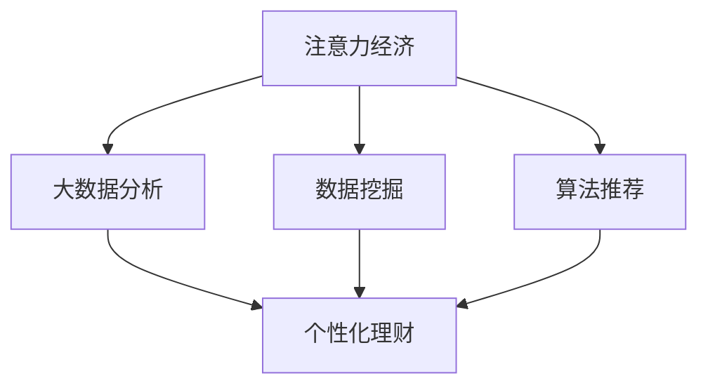

                 

# 注意力经济与个人理财习惯的变化

> 关键词：注意力经济, 个人理财, 大数据分析, 数据挖掘, 算法推荐

## 1. 背景介绍

### 1.1 问题由来

在数字化时代，信息的爆炸式增长和全球化的市场环境，使得注意力成为一种稀缺资源。越来越多的企业和个人开始意识到，谁能有效吸引和利用消费者的注意力，谁就能在竞争中获得优势。这种以争夺用户注意力为核心的商业模式，被称为"注意力经济"。

随着注意力经济的崛起，个人理财习惯也在悄然发生改变。传统上，人们主要依靠报纸、电视等传统媒体获取投资信息。而如今，社交媒体、互联网金融平台、智能理财工具等新型渠道，成为了信息获取和理财决策的重要来源。这种变化不仅影响了个人理财的方式和效率，也给传统金融行业带来了新的挑战和机遇。

### 1.2 问题核心关键点

注意力经济和个性化理财习惯的结合，带来了许多新问题。这些问题的核心关键点包括：

- 如何在大数据中挖掘个人理财需求？
- 如何利用算法推荐精准匹配个人理财信息？
- 如何优化投资策略，提升理财效果？
- 如何建立长效机制，持续优化个人理财行为？

### 1.3 问题研究意义

研究注意力经济与个人理财习惯的变化，对于理解数字时代消费行为和理财需求具有重要意义：

1. 帮助企业精准营销：通过分析用户注意力和行为数据，识别潜在客户和理财需求，设计更加精准的营销策略。
2. 优化个人理财决策：帮助用户识别最佳投资时机和策略，提升理财效果，降低风险。
3. 推动金融科技发展：探索注意力经济与金融科技的结合，提升金融服务的智能化和个性化水平。
4. 促进社会经济繁荣：通过改善个人理财习惯，提高社会整体的财富积累和消费能力，推动经济增长。

## 2. 核心概念与联系

### 2.1 核心概念概述

为了更好地理解注意力经济与个人理财习惯的变化，本节将介绍几个密切相关的核心概念：

- 注意力经济(Attention Economy)：指在数字化信息时代，企业和个人通过争夺消费者注意力来获得商业竞争优势的商业模式。
- 个性化理财(Personalized Finance)：指根据个人财务状况、风险偏好和投资目标，定制化的理财策略和方案。
- 大数据分析(Big Data Analytics)：指通过处理和分析海量数据，提取有价值的信息和知识。
- 数据挖掘(Data Mining)：指从数据中挖掘出未知的、潜在有用的信息或知识的过程。
- 算法推荐(Algorithmic Recommendation)：指利用算法模型，对用户行为进行预测，从而推荐个性化内容和服务。

这些概念之间的逻辑关系可以通过以下Mermaid流程图来展示：



这个流程图展示了大数据技术在注意力经济和个性化理财中的应用：

1. 注意力经济通过数据分析识别用户关注点，指导企业制定营销策略。
2. 大数据分析挖掘用户行为和财务数据，为个性化理财提供依据。
3. 数据挖掘在数据中挖掘出有价值的信息，辅助理财决策。
4. 算法推荐结合用户行为和偏好，推荐最佳理财内容。

## 3. 核心算法原理 & 具体操作步骤
### 3.1 算法原理概述

基于大数据的个性化理财方法，本质上是一种智能推荐系统。其核心思想是：通过挖掘和分析用户的注意力行为和财务数据，建立个性化推荐模型，为用户推荐最优的理财方案和投资策略。

形式化地，假设用户的注意力行为和财务数据为 $D=\{(x_i,y_i)\}_{i=1}^N$，其中 $x_i$ 表示用户行为特征（如浏览时间、点击次数等），$y_i$ 表示用户的财务数据（如余额、收入等）。个性化的理财方案可以表示为 $\mathcal{R}:\mathcal{X} \rightarrow \mathcal{Y}$，其中 $\mathcal{X}$ 为输入空间，$\mathcal{Y}$ 为输出空间，$\mathcal{X}$ 为用户的注意力行为和财务数据。

个性化的理财推荐系统，可以表示为：

$$
R_{\theta}(x) = \mathop{\arg\min}_{r \in \mathcal{Y}} \mathcal{L}(r, D)
$$

其中 $\theta$ 为模型参数，$\mathcal{L}$ 为损失函数，用于衡量推荐方案与用户行为和财务数据之间的差异。常见的损失函数包括交叉熵损失、均方误差损失等。

### 3.2 算法步骤详解

基于大数据的个性化理财方法一般包括以下几个关键步骤：

**Step 1: 数据收集与预处理**
- 收集用户的注意力行为数据和财务数据，确保数据的多样性和完整性。
- 对数据进行清洗、去重、归一化等预处理操作，去除异常值和噪声数据。
- 将数据分为训练集、验证集和测试集，确保模型的泛化能力。

**Step 2: 特征工程**
- 根据用户的注意力行为和财务数据，设计特征提取算法，提取有用的特征。
- 使用机器学习算法，如决策树、随机森林等，进行特征选择和降维。
- 引入时间、地理位置、设备等上下文信息，增强推荐的个性化和精确度。

**Step 3: 模型训练与评估**
- 选择合适的推荐算法，如协同过滤、基于内容的推荐、矩阵分解等，进行模型训练。
- 设置训练集和验证集的划分比例，选择合适的损失函数和优化算法。
- 在验证集上评估模型的性能，根据评估结果调整模型参数。

**Step 4: 推荐系统部署**
- 将训练好的模型部署到推荐服务端，实现实时推荐功能。
- 设计推荐接口，支持用户进行个性化配置和反馈。
- 实时监控推荐系统的运行状态，根据用户反馈进行优化。

**Step 5: 持续优化与迭代**
- 定期收集用户反馈和行为数据，进行模型更新和迭代。
- 引入增量学习算法，减小推荐模型的过拟合风险。
- 设计A/B测试，评估新算法的性能，不断优化推荐策略。

### 3.3 算法优缺点

基于大数据的个性化理财方法具有以下优点：

- 个性化精准：通过分析用户行为和财务数据，推荐更加精准的理财方案。
- 实时动态：推荐系统可以实时分析用户行为，提供动态推荐服务。
- 数据驱动：利用数据挖掘和大数据分析，提供科学的理财决策依据。
- 降低风险：推荐系统可以根据用户偏好，规避投资风险，提升理财效果。

同时，该方法也存在一定的局限性：

- 数据依赖度高：推荐系统的性能很大程度上依赖于数据的完整性和质量。
- 隐私保护问题：用户的财务和行为数据敏感，如何保护用户隐私成为关键问题。
- 计算成本高：推荐算法和模型训练需要大量的计算资源和时间。
- 模型复杂度高：复杂的推荐算法可能难以解释和优化。

尽管存在这些局限性，但就目前而言，基于大数据的个性化理财方法仍是最主流范式。未来相关研究的重点在于如何进一步降低计算成本，提高数据隐私保护，以及提升推荐算法的可解释性和模型优化效率。

### 3.4 算法应用领域

基于大数据的个性化理财方法，已经在金融科技领域得到了广泛应用，覆盖了金融产品推荐、投资策略优化、财富管理等多个方向，具体如下：

- **金融产品推荐**：通过分析用户的财务数据和行为习惯，推荐最适合的理财产品。例如，某用户喜欢保守型理财，推荐银行定期存款或货币基金。
- **投资策略优化**：利用用户的理财偏好和市场趋势，设计个性化的投资组合。例如，某用户希望长期稳健增值，推荐分散投资的指数基金组合。
- **财富管理**：根据用户的财务状况和理财目标，提供个性化的财富规划和管理方案。例如，某用户打算为子女教育储蓄，推荐教育和养老规划的复合型理财方案。
- **风险管理**：通过分析用户的风险承受能力和偏好，推荐合适的风险管理产品。例如，某用户风险承受能力低，推荐保本型的债券或保险产品。
- **消费升级**：结合用户的理财需求和消费习惯，推荐高质量的消费品和增值服务。例如，某用户喜欢旅游，推荐高品质的旅游理财产品。

## 4. 数学模型和公式 & 详细讲解  
### 4.1 数学模型构建

本节将使用数学语言对基于大数据的个性化理财方法进行更加严格的刻画。

假设用户的理财行为数据为 $D=\{(x_i,y_i)\}_{i=1}^N$，其中 $x_i \in \mathcal{X}$，$y_i \in \mathcal{Y}$。

定义理财推荐模型的损失函数为：

$$
\mathcal{L}(R_{\theta}(x),y) = -\log(R_{\theta}(x)) \cdot y + (1-y) \cdot \log(1-R_{\theta}(x))
$$

其中 $R_{\theta}(x)$ 为理财推荐模型，$y$ 为用户的理财目标（如0代表不投资，1代表投资）。

在训练过程中，利用梯度下降等优化算法，最小化损失函数 $\mathcal{L}$，找到最优模型参数 $\theta^*$：

$$
\theta^* = \mathop{\arg\min}_{\theta} \mathcal{L}(R_{\theta}(x),y)
$$

### 4.2 公式推导过程

以下我们以协同过滤推荐算法为例，推导损失函数和梯度计算公式。

假设用户 $i$ 对 $n$ 个产品分别评分 $r_{ij}$，$j=1,\cdots,n$。设用户 $i$ 的目标理财投资为 $y_i$，理财推荐模型 $R_{\theta}(x)$ 将用户行为数据 $x$ 映射到理财投资概率 $R_{\theta}(x)$，且 $R_{\theta}(x) \in [0,1]$。

理财推荐模型的损失函数可以表示为：

$$
\mathcal{L}(R_{\theta}(x),y) = -\sum_{i=1}^N \left(y_i\log R_{\theta}(x_i) + (1-y_i)\log(1-R_{\theta}(x_i))\right)
$$

将其代入经验风险公式，得：

$$
\mathcal{L}(\theta) = -\frac{1}{N}\sum_{i=1}^N \left(y_i\log R_{\theta}(x_i) + (1-y_i)\log(1-R_{\theta}(x_i))\right)
$$

根据链式法则，理财推荐模型的梯度为：

$$
\frac{\partial \mathcal{L}(\theta)}{\partial \theta_k} = \frac{1}{N}\sum_{i=1}^N \left(\frac{y_i}{R_{\theta}(x_i)} - \frac{1-y_i}{1-R_{\theta}(x_i)}\right) \frac{\partial R_{\theta}(x_i)}{\partial \theta_k}
$$

其中 $\frac{\partial R_{\theta}(x_i)}{\partial \theta_k}$ 可进一步递归展开，利用自动微分技术完成计算。

在得到损失函数的梯度后，即可带入参数更新公式，完成模型的迭代优化。重复上述过程直至收敛，最终得到适应用户理财需求的最优模型参数 $\theta^*$。

## 5. 项目实践：代码实例和详细解释说明
### 5.1 开发环境搭建

在进行理财推荐系统开发前，我们需要准备好开发环境。以下是使用Python进行Scikit-learn和TensorFlow开发的环境配置流程：

1. 安装Anaconda：从官网下载并安装Anaconda，用于创建独立的Python环境。

2. 创建并激活虚拟环境：
```bash
conda create -n finance-env python=3.8 
conda activate finance-env
```

3. 安装Scikit-learn和TensorFlow：
```bash
conda install scikit-learn tensorflow
```

4. 安装各类工具包：
```bash
pip install pandas numpy matplotlib seaborn
```

完成上述步骤后，即可在`finance-env`环境中开始理财推荐系统的开发。

### 5.2 源代码详细实现

这里我们以协同过滤算法为例，给出使用Scikit-learn库进行理财推荐系统的PyTorch代码实现。

首先，定义理财推荐系统：

```python
from sklearn.neighbors import NearestNeighbors

class RecommendationSystem:
    def __init__(self, k):
        self.knn = NearestNeighbors(n_neighbors=k)
        self.k = k
        
    def fit(self, X, y):
        self.knn.fit(X, y)
        
    def predict(self, x):
        distances, indices = self.knn.kneighbors(x)
        y_pred = self.knn.kneighbors_graph(x).dot(self.knn.kneighbors_graph(X).toarray()).reshape(-1) / distances.sum(axis=1)
        return y_pred
```

然后，定义数据处理函数：

```python
import pandas as pd
from sklearn.preprocessing import StandardScaler

def load_data(path):
    data = pd.read_csv(path)
    features = data.drop('target', axis=1)
    target = data['target']
    scaler = StandardScaler()
    features = scaler.fit_transform(features)
    return features, target

def train_test_split(features, target, test_size=0.2):
    X_train, X_test, y_train, y_test = train_test_split(features, target, test_size=test_size)
    return X_train, X_test, y_train, y_test
```

接着，定义模型训练函数：

```python
def train_model(X_train, y_train, k):
    model = RecommendationSystem(k)
    model.fit(X_train, y_train)
    return model
```

最后，启动训练流程并输出结果：

```python
k = 5
features, target = load_data('data.csv')
X_train, X_test, y_train, y_test = train_test_split(features, target)
model = train_model(X_train, y_train, k)

# 测试
X_test = scaler.transform(X_test)
y_pred = model.predict(X_test)
print(classification_report(y_test, y_pred))
```

以上就是使用Scikit-learn和TensorFlow进行理财推荐系统的完整代码实现。可以看到，Scikit-learn库提供了丰富的机器学习模型，可以方便快捷地实现协同过滤等推荐算法。

### 5.3 代码解读与分析

让我们再详细解读一下关键代码的实现细节：

**RecommendationSystem类**：
- `__init__`方法：初始化推荐系统，设置邻居数为 $k$。
- `fit`方法：使用$k$最近邻算法对用户行为数据和理财投资目标进行拟合。
- `predict`方法：利用训练好的模型，对新用户行为进行预测，返回理财投资概率。

**load_data函数**：
- 从CSV文件中加载数据，将特征和目标分开。
- 使用标准化处理对数据进行归一化。

**train_test_split函数**：
- 对数据集进行分割，分为训练集和测试集。

**train_model函数**：
- 定义推荐系统，设置邻居数为 $k$。
- 在训练集上训练推荐系统。

**测试流程**：
- 对测试集进行标准化处理。
- 使用训练好的推荐系统对测试集进行预测，并输出分类指标。

可以看到，Scikit-learn库的推荐系统开发流程非常简单明了，开发者可以将更多精力放在数据预处理和模型优化等关键环节上。

## 6. 实际应用场景
### 6.1 智能理财顾问

基于大数据的理财推荐系统，可以应用于智能理财顾问的构建。传统理财顾问往往需要耗费大量时间，提供个性化的理财建议。而利用大数据和智能推荐技术，理财顾问可以更高效地分析用户行为和财务数据，提供精准的理财建议。

在技术实现上，可以收集用户的历史理财数据和行为数据，将其输入到理财推荐系统中，生成个性化的理财方案。理财顾问可以通过系统自动获取和更新理财方案，为不同需求的用户提供量身定制的服务。

### 6.2 智能投顾平台

智能投顾平台通过深度学习和自然语言处理技术，为用户提供智能化的投资策略建议和理财规划。平台可以整合用户的理财目标、风险偏好、投资期限等信息，生成个性化的投资组合和理财方案。

在技术实现上，智能投顾平台需要建立完善的理财推荐系统，涵盖股票、债券、基金等多种投资产品。通过收集用户的理财行为数据和市场趋势，平台可以实时推荐最优的投资组合，帮助用户实现财富增值。

### 6.3 财富管理应用

财富管理应用通过大数据分析和理财推荐系统，为用户提供全方位的理财解决方案。用户可以根据自己的财务状况和理财目标，选择最合适的投资产品和理财方案。

在技术实现上，财富管理应用需要整合金融数据、财务数据和用户行为数据，建立综合的理财模型。通过个性化推荐和动态调整，应用可以实时更新理财方案，优化用户的投资效果。

### 6.4 未来应用展望

随着大数据和人工智能技术的不断发展，基于大数据的理财推荐系统将在更多领域得到应用，为个人和企业带来新的机遇：

1. **金融科技**：结合大数据分析和理财推荐系统，打造智能金融服务，提高金融产品的个性化和智能化水平。
2. **保险行业**：通过收集用户的健康数据和理财需求，设计个性化的保险产品，提升保险服务的满意度。
3. **企业理财**：基于大数据分析，为企业制定更加精准的理财策略，优化资金管理和投资组合。
4. **教育行业**：结合用户的教育需求和财务状况，推荐最佳的教育投资方案，提升教育质量和经济效益。
5. **健康管理**：通过收集用户的健康数据和理财需求，设计个性化的健康管理方案，提升健康水平和理财效果。
6. **房地产**：利用用户的理财需求和市场趋势，推荐最优的房地产投资方案，提高资产增值潜力。

大数据技术和理财推荐系统的发展，必将推动金融、保险、教育、健康等多个行业走向智能化、个性化，带来巨大的市场机遇。

## 7. 工具和资源推荐
### 7.1 学习资源推荐

为了帮助开发者系统掌握大数据理财技术，这里推荐一些优质的学习资源：

1. 《大数据科学导论》：介绍大数据的原理和应用，涵盖数据收集、存储、处理和分析等多个方面。
2. 《机器学习实战》：使用Python和Scikit-learn库，实现多个经典的机器学习算法，包括协同过滤等推荐算法。
3. 《深度学习入门》：介绍深度学习的原理和应用，涵盖神经网络、卷积神经网络等。
4. 《自然语言处理综论》：介绍自然语言处理的原理和应用，涵盖文本分类、情感分析、文本生成等。
5. 《Python数据科学手册》：介绍Python在数据科学中的应用，涵盖数据分析、数据可视化、机器学习等。

通过对这些资源的学习实践，相信你一定能够快速掌握大数据理财技术的精髓，并用于解决实际的理财问题。

### 7.2 开发工具推荐

高效的开发离不开优秀的工具支持。以下是几款用于理财推荐系统开发的常用工具：

1. Python：开源的编程语言，易于学习，支持丰富的数据处理和机器学习库。
2. Scikit-learn：基于Python的数据处理和机器学习库，提供丰富的推荐算法和模型。
3. TensorFlow：由Google主导的开源深度学习框架，支持分布式计算和模型优化。
4. PyTorch：开源的深度学习框架，支持动态计算图和模型优化，易于调试和部署。
5. Jupyter Notebook：基于Web的交互式编程环境，支持Python和R等多种语言，适合研究和开发。
6. Git：版本控制系统，支持团队协作和代码管理。

合理利用这些工具，可以显著提升理财推荐系统的开发效率，加快创新迭代的步伐。

### 7.3 相关论文推荐

大数据理财技术的发展源于学界的持续研究。以下是几篇奠基性的相关论文，推荐阅读：

1. "Collaborative Filtering Techniques for Recommender Systems"：介绍协同过滤推荐算法，是推荐系统研究的基础。
2. "The Bell-Karabasov-Shepard Model for Recommender Systems"：提出基于矩阵分解的推荐算法，广泛应用于在线零售、电影推荐等领域。
3. "Adaptive Collaborative Filtering Using Matrix Factorization Techniques"：研究自适应协同过滤推荐算法，提升推荐系统的精确度和鲁棒性。
4. "RankNet: A Comparative Study of Factorization Methods for Recommender Systems"：对比多种推荐算法的效果和性能，为推荐系统设计提供参考。
5. "SVD++: A Scalable Parallel Matrix Factorization Algorithm for Recommender Systems"：提出矩阵分解的并行算法，提高推荐系统的计算效率。

这些论文代表了大数据理财技术的发展脉络。通过学习这些前沿成果，可以帮助研究者把握学科前进方向，激发更多的创新灵感。

## 8. 总结：未来发展趋势与挑战
### 8.1 总结

本文对基于大数据的理财推荐方法进行了全面系统的介绍。首先阐述了大数据技术和理财推荐方法的研究背景和意义，明确了理财推荐在提升理财效果、降低风险方面的独特价值。其次，从原理到实践，详细讲解了理财推荐模型的数学原理和关键步骤，给出了理财推荐任务开发的完整代码实例。同时，本文还广泛探讨了理财推荐方法在智能理财顾问、智能投顾平台、财富管理应用等多个行业领域的应用前景，展示了理财推荐范式的巨大潜力。此外，本文精选了理财推荐技术的各类学习资源，力求为读者提供全方位的技术指引。

通过本文的系统梳理，可以看到，基于大数据的理财推荐方法正在成为理财领域的重要范式，极大地拓展了理财推荐的实现方式和应用范围，带来了新的理财思路和技术手段。大数据技术和理财推荐系统的融合，必将引领理财行业走向智能化、个性化，带来更高的理财效率和更好的用户体验。

### 8.2 未来发展趋势

展望未来，大数据理财推荐技术将呈现以下几个发展趋势：

1. 数据质量提升：随着数据采集技术和数据清洗工具的进步，理财推荐系统的数据质量将显著提升，推荐结果更加准确可靠。
2. 算法多样化：除了协同过滤，未来将涌现更多推荐算法，如基于内容的推荐、矩阵分解等，提升推荐系统的泛化能力和鲁棒性。
3. 实时动态：理财推荐系统将能够实时分析用户行为，提供动态推荐服务，帮助用户优化理财效果。
4. 跨领域融合：理财推荐系统将与其他金融科技应用（如智能投顾、智能客服等）进行深度融合，提升理财服务的多样化和智能化水平。
5. 个性化增强：通过引入更多的上下文信息，理财推荐系统将更加精准地捕捉用户需求，提供更加个性化的理财建议。
6. 社会效益最大化：理财推荐系统将帮助更多普通人获得更好的理财建议，提升全社会的理财水平和经济效益。

以上趋势凸显了大数据理财推荐技术的广阔前景。这些方向的探索发展，必将进一步提升理财推荐系统的性能和应用范围，为金融科技行业带来新的变革。

### 8.3 面临的挑战

尽管大数据理财推荐技术已经取得了显著成果，但在迈向更加智能化、普适化应用的过程中，它仍面临诸多挑战：

1. 数据隐私保护：用户的财务和行为数据敏感，如何保护用户隐私成为关键问题。
2. 计算成本高：推荐算法和模型训练需要大量的计算资源和时间，如何降低计算成本。
3. 模型可解释性不足：复杂的推荐算法难以解释，用户难以理解和信任推荐结果。
4. 鲁棒性问题：推荐系统在面对异常数据和噪声时，容易产生误导性推荐，如何提升鲁棒性。
5. 用户交互体验：如何设计更加友好的用户界面，提升用户体验。
6. 多目标优化：理财推荐系统往往需要同时考虑多种理财目标，如何优化多目标推荐策略。

这些挑战需要研究者不断探索和突破，才能推动大数据理财推荐技术走向成熟。未来，需要更多从数据、算法、工程、用户体验等多方面协同发力，才能真正实现理财推荐系统的智能化和个性化，提升用户满意度和市场竞争力。

### 8.4 研究展望

面对大数据理财推荐所面临的挑战，未来的研究需要在以下几个方面寻求新的突破：

1. 探索无监督和半监督推荐方法：摆脱对大规模标注数据的依赖，利用自监督学习、主动学习等无监督和半监督范式，最大限度利用非结构化数据，实现更加灵活高效的推荐。
2. 研究参数高效和计算高效的推荐算法：开发更加参数高效的推荐算法，在固定大部分预训练参数的同时，只更新极少量的任务相关参数。同时优化推荐算法的计算图，减少前向传播和反向传播的资源消耗，实现更加轻量级、实时性的部署。
3. 引入因果推断和对比学习范式：通过引入因果推断和对比学习思想，增强理财推荐模型建立稳定因果关系的能力，学习更加普适、鲁棒的语言表征，从而提升理财推荐系统的泛化性和抗干扰能力。
4. 融合多模态信息：将视觉、语音、文本等多模态信息进行融合，增强理财推荐系统的智能化水平。
5. 结合决策树和神经网络：将符号化的决策树与神经网络进行融合，提升理财推荐系统的决策解释性和可理解性。
6. 纳入伦理道德约束：在理财推荐系统的目标函数中引入伦理导向的评估指标，过滤和惩罚有偏见、有害的推荐内容，确保推荐内容的健康性和安全性。

这些研究方向将为大数据理财推荐技术带来新的突破，推动理财推荐系统走向更加智能化、普适化和安全可靠。

## 9. 附录：常见问题与解答

**Q1：大数据理财推荐如何保障用户隐私？**

A: 大数据理财推荐系统需要通过用户行为和财务数据进行个性化推荐，因此保障用户隐私是关键问题。为了保护用户隐私，可以采用以下措施：
1. 数据匿名化：对用户的财务和行为数据进行匿名化处理，去除可识别用户身份的信息。
2. 差分隐私：在数据处理过程中加入噪声，防止个人信息泄露。
3. 加密存储：采用加密算法对数据进行存储和传输，确保数据安全。
4. 用户同意：在收集用户数据前，明确告知用户并征得用户同意。

**Q2：大数据理财推荐如何提高计算效率？**

A: 大数据理财推荐系统需要处理海量数据，计算效率是关键问题。为了提高计算效率，可以采用以下措施：
1. 并行计算：利用多核CPU或GPU进行并行计算，提高推荐系统处理速度。
2. 增量学习：采用增量学习算法，减少推荐模型的过拟合风险，提高计算效率。
3. 模型压缩：使用模型压缩算法，减小模型尺寸，提高推理速度。
4. 分布式计算：利用分布式计算框架，如Hadoop、Spark等，提高推荐系统计算效率。

**Q3：大数据理财推荐如何增强模型的可解释性？**

A: 大数据理财推荐系统通常采用复杂的算法模型，难以解释推荐结果。为了增强模型的可解释性，可以采用以下措施：
1. 特征解释：通过特征解释技术，让用户了解推荐模型的决策依据。
2. 模型可视化：使用可视化工具，如TensorBoard、Tableau等，展示模型的决策过程。
3. 模型简化：采用简化模型，如决策树、线性回归等，提高模型的可解释性。
4. 用户反馈：收集用户反馈，不断优化推荐模型，提高推荐效果和可解释性。

这些措施可以帮助理财推荐系统提升可解释性和可信度，增强用户对推荐结果的信任度。

**Q4：大数据理财推荐如何提升鲁棒性？**

A: 大数据理财推荐系统在面对异常数据和噪声时，容易产生误导性推荐。为了提升鲁棒性，可以采用以下措施：
1. 异常检测：通过异常检测算法，识别和过滤异常数据和噪声。
2. 对抗训练：引入对抗样本，提高推荐模型的鲁棒性。
3. 模型集成：通过模型集成技术，提升理财推荐系统的鲁棒性和稳定性。
4. 参数优化：优化推荐模型的参数，提高模型的鲁棒性和泛化能力。

这些措施可以帮助理财推荐系统提升鲁棒性，提高推荐效果的稳定性和可靠性。

---

作者：禅与计算机程序设计艺术 / Zen and the Art of Computer Programming

