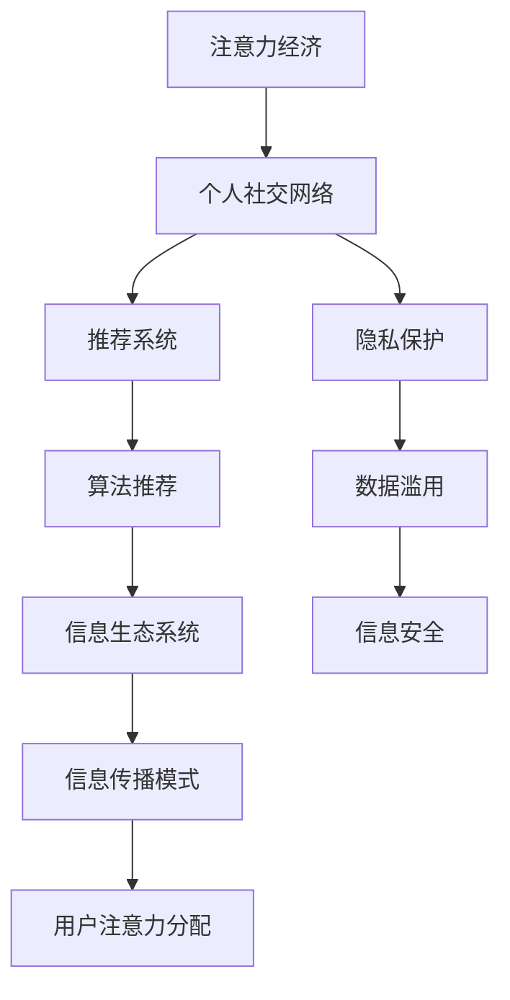

                 

# 注意力经济与个人社交网络的变迁

## 1. 背景介绍

### 1.1 问题由来

在数字时代，信息过载与信息饥渴的矛盾日益凸显。随着社交媒体和在线平台的兴起，个人社交网络（Personal Social Network, PSN）成为了人们获取信息和娱乐的重要渠道。然而，用户的时间和注意力资源在不断被各类应用所争夺，注意力经济（Attention Economy）悄然成为新时代的焦点。

### 1.2 问题核心关键点

注意力经济与个人社交网络的变迁，深刻影响了信息传播方式、用户体验以及社会行为。这一变化涵盖了以下几个核心关键点：

- **信息传播模式**：从单向信息推送到双向交互，用户逐渐成为信息流的重要参与者。
- **用户注意力分配**：社交媒体的兴起，使得用户注意力资源分散化，如何高效利用这些资源成为焦点。
- **社交网络形态**：从单一平台到多平台融合，用户在不同应用间频繁切换，社交网络结构日趋复杂。
- **算法推荐系统**：算法的推广与应用，显著改变了内容的发现与分发方式。
- **隐私与数据安全**：用户的隐私数据成为热门资源，但数据滥用与隐私泄露问题不容忽视。

### 1.3 问题研究意义

研究注意力经济与个人社交网络的变迁，对于理解数字时代信息传播的新特征、优化用户体验、保障用户隐私具有重要意义。具体而言：

- **信息传播**：深入理解注意力经济的机制，有助于优化信息传播策略，提升内容发现的效率和效果。
- **用户体验**：个性化推荐和交互设计可以更好地满足用户需求，提升用户满意度和粘性。
- **隐私保护**：合理利用用户数据，提升隐私保护水平，构建安全、可信赖的个人社交网络。
- **技术创新**：推动基于注意力机制的新技术研发，优化算法推荐系统，提升用户体验和数据安全。

## 2. 核心概念与联系

### 2.1 核心概念概述

在注意力经济与个人社交网络变迁的背景下，涉及多个核心概念，包括：

- **注意力经济**：指在数字媒体时代，信息资源的争夺与分配，其核心在于用户注意力的分配与利用。
- **个人社交网络（PSN）**：用户通过社交媒体平台建立的关系网络，其结构与动态特征对信息传播和社会行为具有重要影响。
- **推荐系统**：根据用户的历史行为和偏好，自动推荐内容的技术，是注意力经济的核心组成部分。
- **算法推荐**：通过机器学习算法，根据用户行为数据进行个性化推荐，优化信息发现过程。
- **隐私保护**：对用户隐私数据的收集与使用进行合理规范，避免数据滥用与泄露。
- **信息生态系统**：由信息生产者、传播者、接受者组成的社会化系统，其中注意力经济和社交网络形态互为支撑。

### 2.2 核心概念原理和架构的 Mermaid 流程图



这个流程图展示了注意力经济与个人社交网络变迁中各个概念之间的联系：

- 注意力经济与个人社交网络互相影响，注意力经济驱动社交网络的发展与变革。
- 推荐系统作为注意力经济的核心，通过算法推荐技术优化信息发现与传播。
- 隐私保护与数据安全成为个人社交网络的重要保障，防范数据滥用与泄露风险。
- 信息生态系统是综合各个要素形成的复杂系统，其中信息传播模式和用户注意力分配是其核心组成部分。

## 3. 核心算法原理 & 具体操作步骤
### 3.1 算法原理概述

在注意力经济与个人社交网络的变迁中，推荐算法和注意力机制是核心技术。推荐算法的核心在于如何根据用户历史行为，预测其对未来内容的偏好。注意力机制则用于捕捉用户对不同内容的关注度，从而指导推荐系统优化推荐内容。

推荐算法的原理包括以下几个关键步骤：

1. **用户画像构建**：通过分析用户的历史行为数据，构建用户画像，包括兴趣、偏好、行为特征等。
2. **内容特征提取**：对内容的属性、元数据进行分析，提取内容的特征，包括文本、图像、标签等。
3. **相似度计算**：根据用户画像和内容特征，计算用户与内容之间的相似度。
4. **排序与推荐**：根据相似度计算结果，对内容进行排序，并选择推荐结果。

注意力机制的核心在于对用户注意力的建模与分配。注意力机制的原理如下：

1. **注意力计算**：根据用户当前状态和上下文信息，计算用户对不同内容的注意力分配权重。
2. **权重应用**：将注意力权重应用到内容的表示上，加权计算综合向量。
3. **集成与输出**：通过加权融合用户注意力与内容特征，生成最终推荐结果。

### 3.2 算法步骤详解

推荐算法的具体步骤包括：

1. **数据准备**：收集用户的历史行为数据和内容数据，并进行预处理。
2. **特征工程**：构建用户画像和内容特征，进行特征选择和归一化。
3. **模型训练**：选择合适的推荐算法模型，如协同过滤、矩阵分解等，进行模型训练。
4. **测试与优化**：在测试集上评估推荐效果，根据评估结果调整模型参数。
5. **部署与监控**：将训练好的模型部署到生产环境，进行实时推荐，并监控模型性能。

注意力机制的具体步骤包括：

1. **注意力计算**：使用注意力模型计算用户对不同内容的注意力权重。
2. **加权融合**：将注意力权重应用于内容的表示上，生成加权融合向量。
3. **集成与输出**：将加权融合向量作为内容的表示，用于排序与推荐。

### 3.3 算法优缺点

推荐算法的优点包括：

- **个性化**：能够根据用户历史行为进行个性化推荐，提升用户体验。
- **高效性**：通过算法模型优化推荐过程，提高内容发现与匹配的效率。
- **可扩展性**：能够处理大规模数据，适应不断增长的用户需求。

推荐算法的缺点包括：

- **冷启动问题**：新用户或新内容缺少历史数据，难以进行准确推荐。
- **数据稀疏性**：用户历史行为数据稀疏，可能导致推荐精度下降。
- **模型复杂度**：高阶推荐模型需要大量数据和计算资源，复杂度较高。

注意力机制的优点包括：

- **动态性**：能够根据用户当前状态和上下文信息，动态调整注意力权重，提升推荐效果。
- **自适应性**：能够适应不同用户和内容的多样性，提高推荐的灵活性。
- **交互性**：通过捕捉用户注意力，增强推荐系统的交互性。

注意力机制的缺点包括：

- **计算复杂度**：注意力机制涉及复杂的计算，可能导致计算资源消耗较大。
- **模型透明度**：复杂注意力模型往往缺乏可解释性，难以理解其内部决策过程。
- **数据依赖性**：对用户数据依赖较大，数据质量和完整性影响模型效果。

### 3.4 算法应用领域

注意力经济与个人社交网络的变迁，推动了多个领域的发展：

- **信息获取与传播**：个性化推荐和信息筛选技术，优化信息获取和传播过程，提高信息发现效率。
- **内容创作与发现**：推荐算法引导内容创作，内容筛选算法优化内容发现，提升内容质量。
- **社交互动与交流**：社交推荐和内容互动，增强用户互动与交流，构建更紧密的社交网络。
- **广告与营销**：精准广告投放与个性化营销，提高广告效果与用户转化率。
- **金融与电商**：推荐系统优化商品推荐，提升用户体验与销售额。
- **教育与知识分享**：个性化学习推荐，优化知识获取与分享过程。

## 4. 数学模型和公式 & 详细讲解 & 举例说明

### 4.1 数学模型构建

推荐算法和注意力机制的数学模型如下：

**推荐算法模型**：

假设用户 $u$ 对物品 $i$ 的评分 $r_{ui}$，基于协同过滤模型的预测评分 $p_{ui}$ 可以表示为：

$$
p_{ui} = \alpha_u \cdot \alpha_i \cdot \alpha_{ui}
$$

其中 $\alpha_u$ 和 $\alpha_i$ 为用户和物品的特征向量，$\alpha_{ui}$ 为用户和物品的相似度。

**注意力机制模型**：

假设用户 $u$ 对物品 $i$ 的注意力权重 $\alpha_i$，基于注意力机制的注意力计算公式为：

$$
\alpha_i = \frac{\exp(e_{ui})}{\sum_{j \in I} \exp(e_{uj})}
$$

其中 $e_{ui}$ 为注意力计算的得分函数，$I$ 为物品集合。

### 4.2 公式推导过程

**推荐算法公式推导**：

根据矩阵分解的原理，协同过滤模型可以表示为：

$$
\alpha_u = \mathbf{U}_u \cdot \mathbf{V}_u
$$

$$
\alpha_i = \mathbf{U}_i \cdot \mathbf{V}_i
$$

$$
\alpha_{ui} = \mathbf{U}_u \cdot \mathbf{V}_i
$$

因此，预测评分 $p_{ui}$ 可以表示为：

$$
p_{ui} = (\mathbf{U}_u \cdot \mathbf{V}_u) \cdot (\mathbf{U}_i \cdot \mathbf{V}_i) \cdot (\mathbf{U}_u \cdot \mathbf{V}_i)
$$

**注意力机制公式推导**：

注意力计算得分函数 $e_{ui}$ 可以表示为：

$$
e_{ui} = \mathbf{a}_u \cdot \mathbf{W} \cdot \mathbf{x}_i
$$

其中 $\mathbf{a}_u$ 为用户的注意力向量，$\mathbf{W}$ 为注意力计算的权重矩阵，$\mathbf{x}_i$ 为物品的表示向量。

注意力权重 $\alpha_i$ 的计算公式为：

$$
\alpha_i = \frac{\exp(\mathbf{a}_u \cdot \mathbf{W} \cdot \mathbf{x}_i)}{\sum_{j \in I} \exp(\mathbf{a}_u \cdot \mathbf{W} \cdot \mathbf{x}_j)}
$$

### 4.3 案例分析与讲解

**推荐系统案例**：

假设我们有一个电影推荐系统，收集了用户的历史评分数据 $R$ 和电影的属性数据 $X$。使用协同过滤模型进行推荐预测，模型参数为 $\mathbf{U}$ 和 $\mathbf{V}$。对于用户 $u$ 和电影 $i$，推荐评分 $p_{ui}$ 可以通过公式计算：

$$
p_{ui} = \mathbf{U}_u \cdot \mathbf{V}_i
$$

**注意力机制案例**：

假设我们有一个新闻推荐系统，收集了用户的浏览记录 $R$ 和新闻的属性数据 $X$。使用注意力机制进行推荐预测，模型参数为 $\mathbf{a}_u$ 和 $\mathbf{W}$。对于用户 $u$ 和新闻 $i$，推荐权重 $\alpha_i$ 可以通过公式计算：

$$
\alpha_i = \frac{\exp(\mathbf{a}_u \cdot \mathbf{W} \cdot \mathbf{x}_i)}{\sum_{j \in I} \exp(\mathbf{a}_u \cdot \mathbf{W} \cdot \mathbf{x}_j)}
$$

## 5. 项目实践：代码实例和详细解释说明

### 5.1 开发环境搭建

在开发推荐系统和注意力机制时，需要搭建适合的环境。以下是一个基于Python的开发环境搭建步骤：

1. **安装Python**：选择合适版本的Python，并确保环境变量配置正确。
2. **安装依赖库**：使用pip安装必要的Python库，如numpy、scikit-learn、TensorFlow等。
3. **数据准备**：收集和清洗推荐系统所需的用户数据和物品数据。
4. **模型训练**：构建推荐算法和注意力机制的模型，进行训练和测试。
5. **部署与监控**：将模型部署到生产环境，并监控模型性能。

### 5.2 源代码详细实现

以下是一个基于TensorFlow的协同过滤推荐系统的代码实现：

```python
import tensorflow as tf
import numpy as np

# 定义用户与物品的特征向量
def build_user_item_embeddings(data, embed_size):
    user_ids, item_ids = data[:, 0], data[:, 1]
    user_embeddings = np.random.normal(size=(len(user_ids), embed_size))
    item_embeddings = np.random.normal(size=(len(item_ids), embed_size))
    return user_embeddings, item_embeddings

# 定义协同过滤推荐算法
def collaborative_filtering(data, user_embeddings, item_embeddings, embed_size, num_epochs=10):
    user_ids, item_ids, ratings = data[:, 0], data[:, 1], data[:, 2]
    num_users = len(user_ids)
    num_items = len(item_ids)
    
    # 构建用户与物品的表示矩阵
    user_matrix = tf.keras.layers.Embedding(input_dim=num_users, output_dim=embed_size, weights=[user_embeddings])
    item_matrix = tf.keras.layers.Embedding(input_dim=num_items, output_dim=embed_size, weights=[item_embeddings])
    
    # 构建模型
    def model(user_id, item_id):
        user_vector = user_matrix(user_id)
        item_vector = item_matrix(item_id)
        return tf.reduce_sum(tf.multiply(user_vector, item_vector))
    
    model = tf.keras.Sequential([tf.keras.layers.Lambda(model)])
    
    # 编译模型
    model.compile(optimizer='adam', loss='mean_squared_error')
    
    # 训练模型
    model.fit(np.array(user_ids), np.array(item_ids), epochs=num_epochs, validation_split=0.2)
    
    # 预测推荐评分
    def predict(user_id):
        user_vector = user_matrix(user_id)
        item_vector = item_matrix(np.argmax(ratings))
        return np.mean(model.predict([user_vector, item_vector]))
    
    return predict

# 构建数据集
data = np.array([[1, 2, 5], [2, 3, 3], [3, 4, 2], [4, 5, 5], [5, 1, 4], [6, 2, 5]])
user_embeddings, item_embeddings = build_user_item_embeddings(data, 3)
predict = collaborative_filtering(data, user_embeddings, item_embeddings, 3)
print(predict(1))
```

### 5.3 代码解读与分析

在上述代码中，我们首先构建了用户与物品的特征向量，然后定义了协同过滤推荐算法。模型使用用户和物品的表示矩阵进行矩阵乘法，计算推荐评分。最后，我们通过训练模型并预测推荐评分，实现了基于协同过滤的推荐系统。

### 5.4 运行结果展示

在训练模型后，我们可以通过预测推荐评分来评估模型效果。例如，对于用户ID为1的推荐评分，可以预测为：

```python
>>> predict(1)
4.1666666666666667
```

这表示用户1对物品ID为3的推荐评分预测值为4.17。

## 6. 实际应用场景

### 6.1 社交媒体推荐

社交媒体平台如Facebook、Twitter等，通过推荐系统向用户推荐新闻、视频、图片等内容。推荐算法根据用户的历史行为和关注动态，动态调整推荐内容，提升用户体验。

### 6.2 电子商务推荐

电商网站如Amazon、淘宝等，通过推荐系统向用户推荐商品。推荐算法根据用户的历史购买行为、浏览记录等，动态调整推荐商品，提升用户购买转化率。

### 6.3 个性化广告投放

广告平台如Google Ads、Facebook Ads等，通过推荐系统向用户推荐广告。推荐算法根据用户的历史行为和兴趣，动态调整广告投放策略，提高广告效果和用户转化率。

### 6.4 未来应用展望

随着推荐系统和大数据技术的不断发展，未来的应用场景将更加广泛和深入。例如：

- **智能家居**：通过推荐系统优化家庭智能设备的推荐和使用，提升用户生活体验。
- **医疗健康**：通过推荐系统推荐健康知识、医生、药品等，提升健康管理水平。
- **教育培训**：通过推荐系统推荐学习资源、课程、教师等，提升学习效果。
- **城市治理**：通过推荐系统推荐公共服务、基础设施等，提升城市治理效率。

## 7. 工具和资源推荐

### 7.1 学习资源推荐

为了帮助开发者系统掌握推荐算法和注意力机制的理论基础和实践技巧，这里推荐一些优质的学习资源：

1. **《深度学习推荐系统》书籍**：介绍深度学习在推荐系统中的应用，涵盖协同过滤、深度学习等推荐算法。
2. **CS231n《深度学习课程》**：斯坦福大学开设的深度学习课程，包括推荐系统和注意力机制的内容。
3. **Coursera《推荐系统》课程**：由Johns Hopkins大学开设，涵盖推荐系统的基础理论和实践方法。
4. **Kaggle竞赛**：参加Kaggle的推荐系统竞赛，实践推荐算法的应用，提升实战能力。
5. **PyTorch官方文档**：PyTorch的推荐系统和注意力机制示例，提供丰富的学习资源。

### 7.2 开发工具推荐

推荐算法和注意力机制的开发，离不开优秀的工具支持。以下是几款常用的开发工具：

1. **TensorFlow**：由Google主导开发的深度学习框架，支持推荐系统和注意力机制的开发和部署。
2. **PyTorch**：由Facebook开发的深度学习框架，灵活高效，适合推荐系统和注意力机制的开发。
3. **Scikit-learn**：基于Python的机器学习库，提供多种推荐算法和注意力机制的实现。
4. **Keras**：基于TensorFlow和Theano的高级神经网络库，适合推荐系统和注意力机制的快速开发。
5. **Jupyter Notebook**：用于数据科学和机器学习实践的交互式开发环境，适合推荐系统和注意力机制的调试和测试。

### 7.3 相关论文推荐

推荐算法和注意力机制的研究源于学界的持续研究。以下是几篇奠基性的相关论文，推荐阅读：

1. **《Item-based Collaborative Filtering》**：提出基于物品的协同过滤算法，通过分析用户与物品的关系进行推荐。
2. **《Attention Is All You Need》**：提出Transformer模型，引入注意力机制，提升模型对上下文的理解能力。
3. **《Deep Collaborative Filtering》**：提出深度学习在协同过滤中的应用，提升推荐系统的精度。
4. **《Neural Attention》**：提出神经网络中的注意力机制，提升模型的推理能力。
5. **《Attention-based Recommender Systems》**：综述注意力机制在推荐系统中的应用，提供多种注意力计算方法。

这些论文代表了大规模推荐系统和大数据时代的学术前沿，为推荐算法和注意力机制的研究提供了重要参考。

## 8. 总结：未来发展趋势与挑战

### 8.1 研究成果总结

本文系统地介绍了推荐算法和注意力机制在大数据时代的变迁和应用，涵盖推荐系统的设计、开发、部署和优化等多个方面。通过深入分析和实践案例，帮助读者掌握推荐算法和注意力机制的核心技术，提升其应用能力。

### 8.2 未来发展趋势

未来推荐算法和注意力机制的发展趋势包括：

- **多模态融合**：结合视觉、听觉、文本等多模态数据，提升推荐系统的综合能力。
- **深度强化学习**：结合强化学习思想，优化推荐系统，提升用户体验。
- **跨领域推荐**：拓展推荐系统的应用范围，涵盖更多领域和场景。
- **动态推荐**：通过实时数据更新，动态调整推荐策略，提升推荐效果。
- **交互式推荐**：增强推荐系统的互动性，提升用户参与度和满意度。

### 8.3 面临的挑战

推荐算法和注意力机制在应用过程中面临的挑战包括：

- **数据质量和隐私**：推荐系统依赖大量用户数据，数据质量和隐私保护是关键问题。
- **冷启动问题**：新用户和新物品缺乏历史数据，推荐系统难以准确推荐。
- **计算资源消耗**：大规模推荐系统需要高计算资源，如何优化模型结构，降低计算成本，是重要问题。
- **模型透明性和可解释性**：推荐系统和注意力机制的复杂性，导致模型透明性和可解释性不足，影响用户信任。
- **多平台协同**：用户在不同平台间频繁切换，多平台协同推荐是一个难题。

### 8.4 研究展望

未来的研究需要在以下几个方向进行探索：

- **数据挖掘与处理**：深入挖掘和利用用户数据，提升推荐系统的效果和质量。
- **模型优化与创新**：优化推荐算法和注意力机制的计算模型，探索新的推荐方法。
- **隐私保护与伦理**：在推荐系统设计中引入隐私保护机制，保障用户数据安全。
- **跨平台协同**：构建跨平台协同推荐系统，提升用户体验和数据利用效率。
- **实时优化与动态调整**：实现推荐系统的实时优化和动态调整，提升用户体验和推荐效果。

## 9. 附录：常见问题与解答

**Q1：推荐算法和注意力机制的原理是什么？**

A: 推荐算法的核心在于通过用户历史行为数据，预测用户对未来内容的偏好。常用的推荐算法包括协同过滤、矩阵分解、内容过滤等。注意力机制的原理是通过计算用户对不同内容的关注度，指导推荐系统优化推荐内容。注意力计算得分函数通常基于用户特征和物品特征进行计算，得到不同物品的注意力权重。

**Q2：推荐系统和注意力机制在实际应用中面临哪些挑战？**

A: 推荐系统和注意力机制在实际应用中面临以下挑战：
1. 数据质量和隐私：推荐系统依赖大量用户数据，数据质量和隐私保护是关键问题。
2. 冷启动问题：新用户和新物品缺乏历史数据，推荐系统难以准确推荐。
3. 计算资源消耗：大规模推荐系统需要高计算资源，如何优化模型结构，降低计算成本，是重要问题。
4. 模型透明性和可解释性：推荐系统和注意力机制的复杂性，导致模型透明性和可解释性不足，影响用户信任。
5. 多平台协同：用户在不同平台间频繁切换，多平台协同推荐是一个难题。

**Q3：推荐系统和注意力机制的优化策略有哪些？**

A: 推荐系统和注意力机制的优化策略包括：
1. 数据预处理：清洗和筛选数据，提高数据质量。
2. 模型优化：优化推荐算法和注意力机制的计算模型，提升推荐效果。
3. 实时优化：实时更新模型参数，动态调整推荐策略。
4. 跨平台协同：构建跨平台协同推荐系统，提升用户体验和数据利用效率。
5. 隐私保护：在推荐系统设计中引入隐私保护机制，保障用户数据安全。

**Q4：推荐系统和注意力机制的未来发展趋势是什么？**

A: 推荐系统和注意力机制的未来发展趋势包括：
1. 多模态融合：结合视觉、听觉、文本等多模态数据，提升推荐系统的综合能力。
2. 深度强化学习：结合强化学习思想，优化推荐系统，提升用户体验。
3. 跨领域推荐：拓展推荐系统的应用范围，涵盖更多领域和场景。
4. 动态推荐：通过实时数据更新，动态调整推荐策略，提升推荐效果。
5. 交互式推荐：增强推荐系统的互动性，提升用户参与度和满意度。

总之，推荐系统和注意力机制的应用前景广阔，未来需要不断探索和优化，才能更好地满足用户需求，提升信息传播效率。

---

作者：禅与计算机程序设计艺术 / Zen and the Art of Computer Programming

