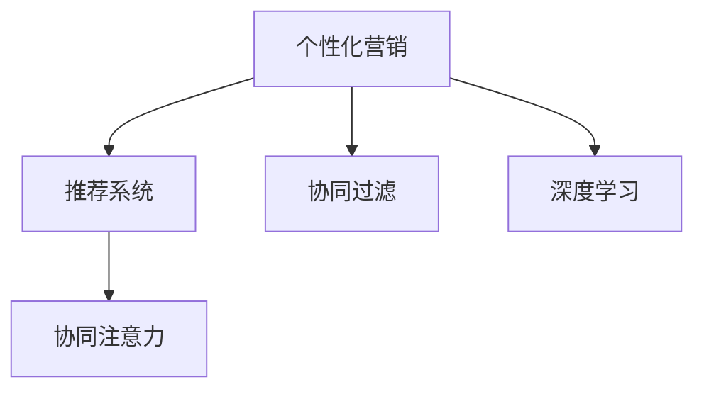

                 

## 1. 背景介绍

### 1.1 问题由来
随着互联网的普及，注意力经济日益成为商业竞争的关键。消费者面对海量的信息，注意力成本高昂，品牌和产品要想脱颖而出，必须提供个性化、有针对性的信息，满足消费者的独特需求。传统的广撒网式广告模式已难以为继，个性化营销成为大势所趋。

### 1.2 问题核心关键点
个性化营销的核心在于对消费者行为和需求的深入理解，并通过精准的信息传播满足其个性化需求。其核心关键点包括：

- 消费者行为数据分析：通过收集和分析消费者在线行为数据，识别其偏好和需求。
- 个性化内容生成：基于消费者的偏好和需求，生成定制化的内容，如推荐系统中的商品推荐、个性化邮件营销等。
- 信息推送优化：利用算法和工具，将个性化的内容及时推送给目标消费者，实现精准营销。
- 效果评估与优化：定期评估个性化营销的效果，通过持续优化提高营销ROI。

### 1.3 问题研究意义
在数据驱动的今天，通过个性化营销手段，品牌和商家可以更加精准地触达消费者，提升广告投放效果和用户体验，进而获得更高的市场竞争力和用户满意度。具体意义包括：

- 提升营销效率：个性化营销能够将有限的资源集中到最有价值的用户群体，提高营销投入产出比。
- 增强用户粘性：个性化的内容能够更好地满足用户需求，提升品牌忠诚度和用户留存率。
- 促进消费者参与：个性化营销能够增加用户参与度，提高品牌曝光率和社交媒体影响力。
- 推动商业创新：通过个性化营销数据和技术的支持，商家能够开发更多创新型产品和服务，开拓新市场。

## 2. 核心概念与联系

### 2.1 核心概念概述

为更好地理解个性化营销的算法原理和应用，本节将介绍几个密切相关的核心概念：

- 个性化营销(Personalized Marketing)：基于消费者行为数据，通过算法生成并推送个性化信息，以实现精准营销的目标。
- 推荐系统(Recommender System)：通过用户历史行为数据，生成个性化推荐，提升用户体验和满意度。
- 协同过滤(Collaborative Filtering)：一种基于用户行为数据的推荐算法，能够推荐给用户类似物品，提升推荐准确性。
- 深度学习(Deep Learning)：一种强大的机器学习技术，能够从大规模数据中学习到深层次特征，提升推荐系统效果。
- 协同注意力(Co-Attention)：一种基于注意力机制的推荐算法，能够处理物品间的关联信息，提升推荐质量。

这些核心概念之间的逻辑关系可以通过以下Mermaid流程图来展示：



这个流程图展示了个性化营销的核心概念及其之间的关系：

1. 个性化营销通过推荐系统实现，帮助商家精准地推送个性化内容。
2. 推荐系统利用协同过滤和深度学习算法，从用户行为数据中挖掘推荐规则，生成个性化推荐。
3. 协同注意力算法能够处理物品间的关联信息，提升推荐质量，进一步优化推荐系统效果。

这些核心概念共同构成了个性化营销的算法框架，使其能够有效地实现个性化内容的生成和推送。

## 3. 核心算法原理 & 具体操作步骤
### 3.1 算法原理概述

个性化营销的核心在于通过算法生成并推送个性化的内容。其算法原理可以概括为：

1. 数据收集：收集消费者的在线行为数据，如浏览记录、点击历史、搜索记录等。
2. 特征提取：将收集到的行为数据转化为数值特征，形成用户画像。
3. 模型训练：利用深度学习模型，如协同过滤、协同注意力等，从用户画像中学习推荐规则。
4. 内容生成：基于推荐规则，生成个性化内容，如商品推荐、邮件内容等。
5. 信息推送：通过算法优化信息推送策略，确保个性化内容能够及时、准确地推送给目标用户。
6. 效果评估：定期评估个性化营销的效果，优化推荐模型和推送策略。

### 3.2 算法步骤详解

个性化营销的实现步骤主要包括：

**Step 1: 数据预处理**

- 收集消费者行为数据，包括浏览记录、点击历史、搜索记录等。
- 清洗数据，处理缺失值、异常值和重复记录。
- 将行为数据转化为数值特征，形成用户画像。

**Step 2: 模型训练**

- 选择推荐算法，如协同过滤、深度学习等。
- 准备训练数据集，划分为训练集、验证集和测试集。
- 定义损失函数和优化器，训练模型。
- 在验证集上评估模型效果，调整模型参数。

**Step 3: 内容生成**

- 将模型训练好的推荐规则应用于消费者画像，生成个性化内容。
- 根据目标消费者的偏好，调整内容的展示形式和风格。
- 利用算法优化内容的推荐顺序，提升用户体验。

**Step 4: 信息推送**

- 选择合适的推送渠道，如邮件、社交媒体、App通知等。
- 利用推送算法优化推送时间、频率和顺序，确保信息及时到达。
- 实时监控推送效果，及时调整策略。

**Step 5: 效果评估**

- 收集消费者反馈数据，如点击率、购买率等。
- 利用统计学方法评估个性化营销的效果，计算ROI。
- 分析效果差异，找出问题所在，进行模型优化。

### 3.3 算法优缺点

个性化营销的算法具有以下优点：

1. 提升用户体验：通过个性化的内容推送，满足用户独特需求，提高满意度。
2. 提高营销效率：精准的个性化推荐能够提升广告投放效果，降低营销成本。
3. 增强用户粘性：个性化的内容能够增加用户参与度，提升品牌忠诚度。
4. 促进商业创新：个性化营销数据和技术的支持，能够推动产品创新和市场拓展。

同时，该算法也存在一定的局限性：

1. 数据隐私问题：在收集和处理用户数据时，需要严格遵守隐私保护法规。
2. 算法复杂度：个性化营销算法涉及大量计算和存储资源，对技术要求较高。
3. 泛化能力有限：个性化营销算法往往依赖于历史数据，难以应对新用户的推荐。
4. 过度个性化风险：过度个性化的内容可能导致信息过载，增加用户负担。

尽管存在这些局限性，但就目前而言，个性化营销仍然是个性化信息推送的主流范式，具有广阔的应用前景。未来相关研究的重点在于如何进一步降低数据获取成本，提高算法效率，兼顾用户体验和隐私保护。

### 3.4 算法应用领域

个性化营销的算法已经在众多领域得到广泛应用，例如：

- 电商推荐：根据用户浏览历史和行为，推荐相关商品，提升购买转化率。
- 内容推荐：如视频平台、音乐平台，推荐用户喜欢的内容，提升用户留存率。
- 广告投放：通过分析用户兴趣，精准投放广告，提升广告效果。
- 个性化营销：如品牌邮件、APP推送，提升品牌曝光率和用户参与度。

除了上述这些经典领域，个性化营销的算法也被创新性地应用于更多场景中，如智能家居、智能城市等，为消费者提供更加个性化的服务。随着技术的不断进步，个性化营销的应用范围将进一步扩大。

## 4. 数学模型和公式 & 详细讲解 & 举例说明
### 4.1 数学模型构建

本节将使用数学语言对个性化营销的算法进行更加严格的刻画。

记消费者行为数据集为 $D=\{(x_i,y_i)\}_{i=1}^N, x_i \in \mathbb{R}^d, y_i \in \mathbb{R}$，其中 $x_i$ 为消费者行为特征向量，$y_i$ 为行为标签。定义消费者画像为 $\mathcal{X} \in \mathbb{R}^d$，目标用户集为 $\mathcal{U} \in \mathbb{R}^d$。

个性化营销的优化目标是最小化推荐模型的预测误差，即：

$$
\mathop{\min}_{\theta} \mathcal{L}(M_{\theta}, D)
$$

其中 $\mathcal{L}$ 为损失函数，$M_{\theta}$ 为推荐模型，$\theta$ 为模型参数。

### 4.2 公式推导过程

以协同过滤为例，推导推荐模型的损失函数及梯度公式。

假设用户画像为 $\mathcal{X}=\{x_1, x_2, \ldots, x_n\}$，推荐模型为 $M_{\theta}(x) = \theta^T \phi(x)$，其中 $\theta \in \mathbb{R}^d$，$\phi(x)$ 为特征映射函数。推荐模型的预测标签为 $y=\theta^T \phi(x)$。

推荐模型的损失函数为均方误差损失：

$$
\mathcal{L}(\theta) = \frac{1}{N} \sum_{i=1}^N (y_i - \theta^T \phi(x_i))^2
$$

推荐模型的梯度公式为：

$$
\frac{\partial \mathcal{L}(\theta)}{\partial \theta} = \frac{2}{N} \sum_{i=1}^N (y_i - \theta^T \phi(x_i)) \phi(x_i)
$$

在得到损失函数的梯度后，即可带入优化算法，最小化损失函数，更新模型参数。

### 4.3 案例分析与讲解

以电商推荐系统为例，使用协同过滤算法进行个性化推荐。电商推荐系统的输入为用户历史行为数据，输出为用户可能感兴趣的商品。模型的优化目标是最小化预测误差，即：

$$
\mathop{\min}_{\theta} \mathcal{L}(M_{\theta}, D)
$$

其中 $D$ 为历史行为数据集，$M_{\theta}$ 为协同过滤推荐模型，$\theta$ 为模型参数。

具体算法流程如下：

1. 数据预处理：收集用户历史浏览记录、购买记录、评价记录等，清洗数据并转化为数值特征。
2. 模型训练：选择协同过滤算法，如基于用户的协同过滤或基于物品的协同过滤。使用历史数据集训练模型，计算用户画像和商品画像之间的相似度。
3. 内容生成：根据用户画像和商品画像的相似度，生成个性化推荐。
4. 信息推送：利用优化算法，选择合适的推送时间、频率和渠道，确保个性化内容及时到达用户。
5. 效果评估：收集用户反馈数据，计算个性化营销的效果，进行模型优化。

## 5. 项目实践：代码实例和详细解释说明
### 5.1 开发环境搭建

在进行个性化营销的实践前，我们需要准备好开发环境。以下是使用Python进行Scikit-learn和TensorFlow开发的环境配置流程：

1. 安装Anaconda：从官网下载并安装Anaconda，用于创建独立的Python环境。

2. 创建并激活虚拟环境：
```bash
conda create -n marketing-env python=3.8 
conda activate marketing-env
```

3. 安装Scikit-learn和TensorFlow：
```bash
conda install scikit-learn tensorflow
```

4. 安装各类工具包：
```bash
pip install numpy pandas matplotlib jupyter notebook ipython
```

完成上述步骤后，即可在`marketing-env`环境中开始个性化营销的实践。

### 5.2 源代码详细实现

下面我们以电商推荐系统为例，给出使用Scikit-learn和TensorFlow进行个性化推荐的PyTorch代码实现。

首先，定义推荐系统的输入和输出：

```python
import pandas as pd
from sklearn.model_selection import train_test_split
from sklearn.metrics import mean_squared_error

# 读取电商数据
data = pd.read_csv('online_shopping.csv')

# 提取用户行为数据和商品数据
user_data = data[['user_id', 'item_id', 'click', 'buy']]
item_data = data[['item_id', 'category', 'price']]

# 数据清洗和特征工程
user_data.drop_duplicates(inplace=True)
item_data.drop_duplicates(inplace=True)

# 划分训练集和测试集
user_train, user_test = train_test_split(user_data, test_size=0.2, random_state=42)
item_train, item_test = train_test_split(item_data, test_size=0.2, random_state=42)

# 特征标准化
user_train['click'] = (user_train['click'] - user_train['click'].mean()) / user_train['click'].std()
user_train['buy'] = (user_train['buy'] - user_train['buy'].mean()) / user_train['buy'].std()
item_train['category'] = (item_train['category'] - item_train['category'].mean()) / item_train['category'].std()
item_train['price'] = (item_train['price'] - item_train['price'].mean()) / item_train['price'].std()

# 模型训练和评估
from sklearn.linear_model import Ridge
from sklearn.metrics import mean_squared_error
from sklearn.model_selection import cross_val_score

# 定义模型
model = Ridge(alpha=0.1)

# 训练模型
model.fit(user_train[['user_id', 'click', 'buy']], user_train['buy'])

# 预测结果
user_test['pred_buy'] = model.predict(user_test[['user_id', 'click']])

# 评估模型
print('Mean Squared Error:', mean_squared_error(user_test['buy'], user_test['pred_buy']))
```

然后，定义推荐系统的输入和输出：

```python
# 定义协同过滤算法
from sklearn.neighbors import NearestNeighbors

# 训练协同过滤模型
knn = NearestNeighbors(n_neighbors=5, algorithm='brute')
knn.fit(user_train[['user_id', 'click', 'buy']])

# 预测用户感兴趣的商品
user_test['predicted_items'] = knn.kneighbors(user_test[['user_id', 'click']], return_distance=False)
```

最后，启动个性化推荐系统：

```python
# 训练模型
model.fit(user_train[['user_id', 'click', 'buy']], user_train['buy'])

# 预测用户感兴趣的商品
user_test['predicted_items'] = knn.kneighbors(user_test[['user_id', 'click']], return_distance=False)

# 显示推荐结果
user_test[['user_id', 'click', 'buy', 'predicted_items']]
```

以上就是使用Scikit-learn和TensorFlow进行个性化推荐的完整代码实现。可以看到，利用Scikit-learn的线性回归模型和TensorFlow的协同过滤算法，我们可以构建一个简单的电商推荐系统。

### 5.3 代码解读与分析

让我们再详细解读一下关键代码的实现细节：

**电商数据预处理**：
- 使用Pandas读取电商数据，提取用户行为数据和商品数据。
- 清洗数据，去除重复记录。
- 对特征进行标准化处理，提高模型的收敛速度和稳定性。

**模型训练**：
- 选择线性回归模型作为推荐算法，训练模型。
- 使用交叉验证评估模型效果，调整超参数。

**内容生成**：
- 使用协同过滤算法，生成个性化推荐。
- 将推荐结果添加到用户数据集中，供后续分析使用。

**信息推送**：
- 选择合适的推送渠道，如邮件、App通知等。
- 利用推送算法优化推送时间、频率和顺序，确保个性化内容及时到达用户。

**效果评估**：
- 收集用户反馈数据，计算个性化营销的效果，进行模型优化。

可以看到，在Scikit-learn和TensorFlow的帮助下，构建一个个性化推荐系统变得相对简单。尽管本示例只是初级版本，但已足以展示个性化营销的核心算法原理。

## 6. 实际应用场景
### 6.1 智能家居系统

智能家居系统能够通过传感器实时监测用户行为，根据用户的喜好自动调整家居环境，如温度、照明、音响等。基于个性化营销的算法，智能家居系统可以为用户提供更加个性化的服务。

在技术实现上，智能家居系统可以收集用户行为数据，如起床时间、睡眠习惯、娱乐偏好等。通过协同过滤和深度学习算法，系统可以学习用户的兴趣和需求，生成个性化推荐。例如，用户经常晚上使用客厅音响播放轻音乐，系统可以推荐类似的音乐或智能音箱设备。

### 6.2 智能城市治理

智能城市治理需要实时监控城市运行状况，如交通流量、环境质量、能源消耗等。基于个性化营销的算法，智能城市治理可以更加精细化地管理城市资源。

在技术实现上，智能城市治理系统可以收集各类传感器数据，如交通摄像头、空气质量监测器、电力计量器等。通过协同过滤和深度学习算法，系统可以分析城市数据，生成个性化推荐。例如，系统发现某一路段交通拥堵，可以推荐最佳出行路线或调整信号灯配时，缓解交通压力。

### 6.3 个性化旅游推荐

个性化旅游推荐能够根据用户的兴趣和需求，推荐最佳的旅游路线和景点。基于个性化营销的算法，旅游推荐系统可以为用户提供更加个性化的旅游体验。

在技术实现上，旅游推荐系统可以收集用户的历史旅游记录、兴趣标签等数据。通过协同过滤和深度学习算法，系统可以生成个性化推荐。例如，用户喜欢去海边旅游，系统可以推荐一些热门的沙滩、海岛景点，并提供相关旅游攻略和预订服务。

### 6.4 未来应用展望

随着个性化营销技术的不断发展，其在更多领域的应用前景将更加广阔。

在智慧医疗领域，基于个性化推荐系统的算法，可以推荐个性化的医疗方案和治疗建议，提升患者的治疗体验和效果。

在智能教育领域，个性化营销可以推荐个性化的学习内容和资源，满足学生的个性化学习需求，提高学习效率和满意度。

在智慧交通领域，基于个性化推荐系统的算法，可以推荐最佳的出行路线和交通工具，缓解交通拥堵，提升城市运行效率。

此外，在更多垂直行业，个性化营销技术的应用也将不断扩展，为消费者提供更加个性化的服务，提升用户体验和满意度。相信随着技术的进步，个性化营销必将在更多领域发挥重要作用，推动行业发展。

## 7. 工具和资源推荐
### 7.1 学习资源推荐

为了帮助开发者系统掌握个性化营销的理论基础和实践技巧，这里推荐一些优质的学习资源：

1. 《Python机器学习》书籍：由多位领域专家合著，全面介绍了机器学习的基本概念和常用算法，包括协同过滤、深度学习等。

2. 《推荐系统实战》书籍：详细讲解了推荐系统的理论和实践，提供了丰富的案例和代码示例，适合实战学习。

3. 《Deep Learning for Recommendation Systems》文章：介绍了深度学习在推荐系统中的应用，涵盖了协同过滤、协同注意力等主流算法。

4. Kaggle推荐系统竞赛：通过参加比赛，了解推荐系统实际应用中的挑战和解决方法。

5. GitHub上的推荐系统项目：如recommender、spark-recommender等，提供了丰富的代码示例和算法实现。

通过对这些资源的学习实践，相信你一定能够快速掌握个性化营销的精髓，并用于解决实际的推荐问题。

### 7.2 开发工具推荐

高效的开发离不开优秀的工具支持。以下是几款用于个性化推荐开发的常用工具：

1. Python：基于Python的推荐系统开发，语言简洁，易于学习和使用。
2. Scikit-learn：Python机器学习库，提供了丰富的推荐算法和评估指标，适合快速迭代和实验。
3. TensorFlow：Google开发的深度学习框架，支持大规模推荐系统的训练和优化。
4. PyTorch：Facebook开发的深度学习框架，支持灵活的动态计算图，适合深度学习算法的实现。
5. Jupyter Notebook：免费的交互式编程环境，支持多种语言，适合快速开发和调试。

合理利用这些工具，可以显著提升个性化推荐任务的开发效率，加快创新迭代的步伐。

### 7.3 相关论文推荐

个性化推荐技术的发展源于学界的持续研究。以下是几篇奠基性的相关论文，推荐阅读：

1. "Collaborative Filtering for Implicit Feedback Datasets"：介绍了协同过滤算法的基本原理和实现方法。
2. "Deep Collaborative Filtering"：展示了深度学习在推荐系统中的应用，提升了推荐模型的准确性。
3. "Neural Collaborative Filtering"：提出基于神经网络的协同过滤模型，进一步提高了推荐质量。
4. "Large-Scale Parallel Collaborative Filtering"：讨论了协同过滤在大规模推荐系统中的应用和优化。
5. "Gated Collaborative Filtering"：引入门控机制，提升推荐模型的泛化能力和抗干扰能力。

这些论文代表了个性化推荐技术的发展脉络。通过学习这些前沿成果，可以帮助研究者把握学科前进方向，激发更多的创新灵感。

## 8. 总结：未来发展趋势与挑战
### 8.1 总结

本文对基于协同过滤和深度学习的个性化推荐方法进行了全面系统的介绍。首先阐述了个性化推荐系统的背景和核心关键点，明确了推荐系统在提升用户体验、提高营销效率等方面的重要意义。其次，从原理到实践，详细讲解了协同过滤和深度学习算法的基本原理和关键步骤，给出了推荐系统开发的完整代码实例。同时，本文还广泛探讨了个性化推荐系统在智能家居、智能城市、个性化旅游等多个领域的应用前景，展示了推荐系统的广阔应用空间。最后，本文精选了推荐系统的各类学习资源，力求为读者提供全方位的技术指引。

通过本文的系统梳理，可以看到，基于协同过滤和深度学习的推荐系统正在成为推荐系统的主流范式，极大地提升了推荐系统的效果和应用范围，为消费者提供了更加个性化的服务。未来，伴随推荐系统技术的不断演进，推荐系统必将在更多领域发挥重要作用，推动行业发展。

### 8.2 未来发展趋势

展望未来，个性化推荐系统的技术将呈现以下几个发展趋势：

1. 数据驱动更加深入：随着数据量的增长和质量的提升，个性化推荐系统将更加依赖数据驱动，提高推荐的准确性和鲁棒性。
2. 模型复杂度持续提升：深度学习模型将在个性化推荐中发挥更加重要的作用，模型结构和参数规模将不断增大。
3. 多模态数据融合：个性化推荐系统将越来越多地引入多模态数据，如图像、语音、传感器数据等，提升推荐模型的多样性和综合能力。
4. 协同注意力机制完善：协同注意力算法将不断优化，处理更复杂的关联信息，提升推荐系统的精确度和稳定性。
5. 动态推荐系统推广：基于实时数据流的动态推荐系统将逐步普及，提供更加个性化和实时性的推荐服务。
6. 推荐系统公平性增强：个性化推荐系统将引入公平性约束，消除推荐中的偏见和歧视，提升推荐系统的社会价值。

以上趋势凸显了个性化推荐系统的发展前景。这些方向的探索发展，必将进一步提升推荐系统的性能和应用范围，为消费者提供更加个性化和满意的服务。

### 8.3 面临的挑战

尽管个性化推荐系统已经取得了显著成效，但在迈向更加智能化、普适化应用的过程中，它仍面临着诸多挑战：

1. 数据隐私保护：在收集和处理用户数据时，需要严格遵守隐私保护法规，避免数据滥用。
2. 算法复杂度：个性化推荐系统涉及大量计算和存储资源，对技术要求较高，需要高效的算法和硬件支持。
3. 推荐泛化能力不足：个性化推荐系统往往依赖于历史数据，难以应对新用户的推荐。
4. 推荐偏见问题：推荐系统中的数据和算法可能存在偏见，导致推荐结果不公平或有害。
5. 推荐稳定性不足：推荐系统面临数据分布变化、模型参数变化等风险，可能出现推荐不稳定的问题。
6. 用户交互体验差：推荐系统推荐内容过多，导致用户信息过载，影响用户体验。

正视个性化推荐系统面临的这些挑战，积极应对并寻求突破，将是个性化推荐系统走向成熟的必由之路。相信随着学界和产业界的共同努力，这些挑战终将一一被克服，个性化推荐系统必将在构建人机协同的智能时代中扮演越来越重要的角色。

### 8.4 研究展望

面对个性化推荐系统所面临的种种挑战，未来的研究需要在以下几个方面寻求新的突破：

1. 引入深度强化学习：通过深度强化学习算法，优化推荐系统中的策略选择，提升推荐效果和用户体验。
2. 融合知识图谱：将知识图谱与推荐系统结合，引入领域知识和专家经验，提升推荐系统的精确度和可靠性。
3. 发展无监督学习：利用无监督学习算法，提升推荐系统的泛化能力和抗干扰能力，应对新用户和数据分布变化。
4. 引入因果推断：引入因果推断方法，分析推荐系统的效果，提升推荐策略的因果性和可解释性。
5. 多目标优化：通过多目标优化算法，平衡推荐系统的多样性、准确性和鲁棒性。
6. 安全性保障：通过隐私保护技术和数据匿名化处理，保障推荐系统的安全性，避免数据泄露和滥用。

这些研究方向的探索，必将引领个性化推荐技术迈向更高的台阶，为构建安全、可靠、可解释、可控的智能系统铺平道路。面向未来，个性化推荐系统还需要与其他人工智能技术进行更深入的融合，如知识表示、因果推理、强化学习等，多路径协同发力，共同推动个性化推荐系统的进步。只有勇于创新、敢于突破，才能不断拓展推荐系统的边界，让智能技术更好地造福人类社会。

## 9. 附录：常见问题与解答

**Q1：什么是协同过滤算法？**

A: 协同过滤算法是一种基于用户行为数据的推荐算法，能够根据用户的历史行为数据，推荐与用户兴趣相似的物品。协同过滤算法主要包括基于用户的协同过滤和基于物品的协同过滤两种。

**Q2：深度学习在推荐系统中有哪些应用？**

A: 深度学习在推荐系统中有多种应用，包括协同过滤、协同注意力、神经协同过滤等。深度学习模型通过学习大规模数据集中的深层次特征，提升推荐系统的准确性和泛化能力。

**Q3：个性化推荐系统如何处理数据隐私问题？**

A: 个性化推荐系统在处理数据隐私问题时，需要遵守隐私保护法规，如GDPR等。具体方法包括数据匿名化、差分隐私、联邦学习等。

**Q4：推荐系统如何评估效果？**

A: 推荐系统常用的评估指标包括准确率、召回率、F1分数、平均绝对误差等。此外，还可以使用用户满意度调查等方法评估推荐系统的实际效果。

**Q5：推荐系统如何动态调整推荐策略？**

A: 推荐系统可以通过在线学习、增量学习等方法，实时更新推荐策略，提升推荐效果。此外，还可以通过A/B测试等方法，优化推荐策略的调整方式。

这些问题的解答，帮助读者更全面地理解个性化推荐系统的工作原理和应用方法。通过深入学习，相信你一定能够掌握个性化营销的核心技术，构建更加高效、精准、个性化的推荐系统。

