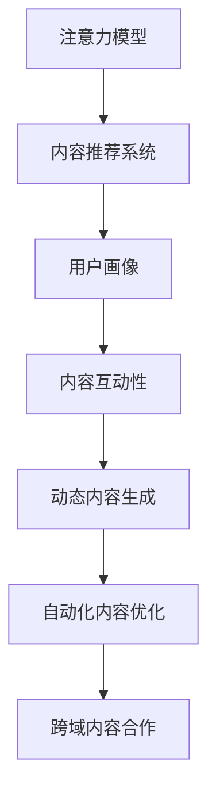

                 

# 注意力经济与内容创作最佳实践：吸引并留住受众的参与

## 1. 背景介绍

### 1.1 问题由来
在信息爆炸的互联网时代，用户注意力成为最稀缺的资源。各类平台和媒体争相通过内容创作吸引用户参与，从而实现流量变现和商业价值的最大化。然而，随着市场竞争的加剧和用户选择的多样化，单纯依靠内容质量和用户体验已不足以保持长期的注意力，如何更有效地吸引和留住用户参与，成为了当前内容创作的关键问题。

### 1.2 问题核心关键点
针对上述问题，本节将介绍几个核心概念及其关键点：

- 注意力经济（Attention Economy）：指的是在信息过载的环境中，如何有效吸引和利用用户的注意力，创造经济价值的过程。
- 内容创作（Content Creation）：即通过创意和技巧制作各类文本、图片、视频、音频等内容，满足用户需求并促成用户参与。
- 用户参与（User Engagement）：指用户通过阅读、评论、分享、付费等方式对内容进行互动，体现其对内容的认可和价值判断。
- 推荐算法（Recommendation Algorithms）：利用用户历史行为数据，智能推荐用户可能感兴趣的内容，提升用户粘性。
- 数据驱动（Data-Driven）：指通过数据收集和分析，发现用户偏好和行为规律，指导内容创作和推荐策略。
- 个性化推荐（Personalized Recommendations）：根据用户个性化特征，提供定制化推荐内容，增强用户体验。
- 动态调整（Dynamic Optimization）：实时调整内容推荐策略和创作方向，保持用户兴趣和参与度。

通过理解这些核心概念，我们可以更好地把握注意力经济和内容创作的本质，并设计出更有效的策略。

## 2. 核心概念与联系

### 2.1 核心概念概述

为更好地理解注意力经济和内容创作的联系，本节将介绍几个密切相关的核心概念：

- 注意力模型（Attention Model）：指通过计算模型预测用户对某个内容的兴趣程度，为推荐系统提供决策依据。
- 内容推荐系统（Content Recommendation System）：基于用户历史行为数据，智能化推荐内容，提升用户体验。
- 用户画像（User Persona）：指通过数据挖掘和分析，构建用户的多维特征模型，指导个性化推荐。
- 内容互动性（Content Interactivity）：指通过互动元素（如评论、点赞、分享等）增强内容的吸引力，提升用户参与度。
- 动态内容生成（Dynamic Content Generation）：指根据实时数据动态调整内容生成策略，提高内容的时效性和相关性。
- 自动化内容优化（Automated Content Optimization）：通过算法自动化调整内容创作参数，提升创作效率和内容质量。
- 跨域内容合作（Cross-Domain Content Collaboration）：指不同平台和创作者之间的内容共享和合作，拓宽内容来源，提升整体吸引力。

这些概念之间的逻辑关系可以通过以下Mermaid流程图来展示：



这个流程图展示了大语言模型的核心概念及其之间的关系：

1. 注意力模型通过计算模型预测用户对某个内容的兴趣程度。
2. 内容推荐系统基于注意力模型和用户画像，智能推荐内容。
3. 用户画像通过数据挖掘和分析，构建用户特征模型。
4. 内容互动性通过互动元素增强内容的吸引力。
5. 动态内容生成根据实时数据动态调整内容生成策略。
6. 自动化内容优化通过算法调整内容创作参数。
7. 跨域内容合作通过平台间的共享和合作，拓宽内容来源。

这些概念共同构成了内容创作和推荐的框架，使得内容创作者和平台能够更好地吸引和留住用户参与。

## 3. 核心算法原理 & 具体操作步骤
### 3.1 算法原理概述

内容推荐系统的核心在于注意力模型和个性化推荐。其核心思想是：通过分析用户行为数据，学习用户偏好，结合内容特征，预测用户对内容的兴趣程度，最终生成个性化推荐列表。

形式化地，假设用户集合为 $U$，内容集合为 $V$，用户行为矩阵为 $A \in \mathbb{R}^{U \times V}$，用户对内容的评分向量为 $R \in \mathbb{R}^{U \times V}$。内容推荐的目标是最大化用户满意度的期望值：

$$
\max_{\theta} \mathbb{E}_{(u,v) \sim A} [\hat{R}_{uv}]
$$

其中 $\hat{R}_{uv}$ 为预测用户 $u$ 对内容 $v$ 的评分，$\theta$ 为模型参数。

### 3.2 算法步骤详解

基于上述目标，内容推荐系统一般包括以下几个关键步骤：

**Step 1: 数据准备**
- 收集用户行为数据，构建用户行为矩阵 $A$ 和用户评分向量 $R$。
- 对用户行为数据进行清洗和处理，去除噪声和异常值。

**Step 2: 模型训练**
- 选择合适的推荐算法，如协同过滤、基于内容的推荐、矩阵分解等。
- 利用用户行为数据和评分向量，对推荐模型进行训练。
- 优化模型参数，使得预测评分与真实评分尽可能接近。

**Step 3: 推荐生成**
- 将用户 $u$ 和待推荐内容 $v$ 输入推荐模型，计算其预测评分 $\hat{R}_{uv}$。
- 根据预测评分从内容集合 $V$ 中筛选出排名靠前的若干内容，生成推荐列表。

**Step 4: 用户反馈收集**
- 将推荐列表展示给用户 $u$，收集用户对推荐内容的反馈。
- 利用反馈数据更新用户行为矩阵 $A$ 和评分向量 $R$。

**Step 5: 迭代优化**
- 定期重新训练推荐模型，以适应用户行为和内容特征的变化。
- 根据新一轮的反馈数据，动态调整模型参数，提升推荐效果。

### 3.3 算法优缺点

基于注意力模型的内容推荐系统具有以下优点：
1. 可解释性强。通过分析用户行为和内容特征，生成可解释的推荐理由。
2. 灵活高效。可以根据实时数据动态调整推荐策略，适应用户需求。
3. 数据驱动。利用大量用户数据进行模型训练，提升推荐精度。
4. 个性化推荐。能够根据用户个性化特征，生成定制化推荐。

同时，该方法也存在一定的局限性：
1. 数据依赖性高。推荐系统的性能很大程度上取决于用户行为数据的完整性和质量。
2. 冷启动问题。新用户和未知内容往往难以获得准确的推荐。
3. 信息过载。大量推荐内容可能淹没用户，降低其参与度。
4. 算法复杂度大。计算复杂度较高，需要高性能计算资源。
5. 隐私问题。用户行为数据的收集和使用可能涉及隐私问题，需要严格控制和保护。

尽管存在这些局限性，但就目前而言，基于注意力模型的推荐系统仍是内容推荐的主流范式。未来相关研究的重点在于如何进一步降低数据依赖，提高冷启动能力和鲁棒性，同时兼顾隐私保护和用户体验。

### 3.4 算法应用领域

基于注意力模型的推荐系统在多个领域得到了广泛应用，包括：

- 电商推荐：为用户推荐感兴趣的商品，提升购买转化率。
- 视频推荐：根据用户观看历史和评分，推荐视频内容，增加观看时间和订阅量。
- 音乐推荐：为用户推荐喜欢的音乐，提升用户体验和满意度。
- 新闻推荐：为用户推荐感兴趣的新闻，增加用户粘性和流量。
- 社交推荐：为用户推荐感兴趣的朋友和群组，增强社区活跃度。
- 电影推荐：为用户推荐感兴趣的电影，增加观影率和满意度。
- 旅游推荐：为用户推荐旅游目的地，提升旅行体验和消费。

除了上述这些经典应用外，内容推荐系统也被创新性地应用到更多场景中，如健康医疗、教育培训、金融投资等，为各行各业带来了新的用户增长点。随着推荐算法的不断进步，相信内容推荐系统将在更广阔的领域得到应用，提升用户满意度和平台收益。

## 4. 数学模型和公式 & 详细讲解 & 举例说明
### 4.1 数学模型构建

本节将使用数学语言对基于注意力模型的内容推荐过程进行更加严格的刻画。

假设推荐系统用户集合为 $U$，内容集合为 $V$，用户行为矩阵为 $A \in \mathbb{R}^{U \times V}$，用户评分向量为 $R \in \mathbb{R}^{U \times V}$。推荐系统的目标是通过训练模型，预测用户对内容的评分。

定义推荐模型为 $f: U \times V \rightarrow \mathbb{R}$，则推荐系统的损失函数为：

$$
\mathcal{L}(\theta) = -\frac{1}{N} \sum_{(u,v) \in A} [r_{uv} \log f(u,v) + (1-r_{uv}) \log (1-f(u,v))]
$$

其中 $r_{uv}$ 为用户 $u$ 对内容 $v$ 的真实评分，$f(u,v)$ 为预测评分，$\theta$ 为模型参数。

通过梯度下降等优化算法，推荐系统不断更新模型参数 $\theta$，最小化损失函数 $\mathcal{L}$，使得模型输出逼近真实评分。

### 4.2 公式推导过程

以下我们以协同过滤算法为例，推导推荐模型的预测评分公式及其梯度的计算公式。

假设推荐模型为 $f(u,v) = u^\top V v$，其中 $u$ 为用户特征向量，$v$ 为内容特征向量，$V$ 为特征映射矩阵。

根据上述损失函数，推荐模型的梯度公式为：

$$
\nabla_{\theta} \mathcal{L}(\theta) = -\frac{1}{N} \sum_{(u,v) \in A} [r_{uv} \frac{\partial f(u,v)}{\partial \theta} + (1-r_{uv}) \frac{\partial f(u,v)}{\partial \theta}]
$$

其中：

$$
\frac{\partial f(u,v)}{\partial \theta} = \frac{\partial (u^\top V v)}{\partial \theta} = u V \frac{\partial v}{\partial \theta} = u V (V^\top \frac{\partial f}{\partial v}) = u V V^\top \frac{\partial f}{\partial \theta}
$$

将上述梯度公式代入损失函数，得到推荐模型的完整优化目标：

$$
\min_{u,v} \frac{1}{N} \sum_{(u,v) \in A} [r_{uv} (u^\top V v) + (1-r_{uv}) \log(1 - u^\top V v)]
$$

在得到推荐模型的梯度后，即可带入优化算法，完成模型的迭代优化。重复上述过程直至收敛，最终得到适应用户行为和内容特征的最优推荐模型。

## 5. 项目实践：代码实例和详细解释说明
### 5.1 开发环境搭建

在进行推荐系统开发前，我们需要准备好开发环境。以下是使用Python进行TensorFlow开发的环境配置流程：

1. 安装Anaconda：从官网下载并安装Anaconda，用于创建独立的Python环境。

2. 创建并激活虚拟环境：
```bash
conda create -n tf-env python=3.8 
conda activate tf-env
```

3. 安装TensorFlow：从官网获取对应的安装命令。例如：
```bash
conda install tensorflow -c conda-forge
```

4. 安装各类工具包：
```bash
pip install numpy pandas scikit-learn matplotlib tqdm jupyter notebook ipython
```

完成上述步骤后，即可在`tf-env`环境中开始推荐系统开发。

### 5.2 源代码详细实现

下面我们以协同过滤算法为例，给出使用TensorFlow实现推荐系统的PyTorch代码实现。

首先，定义协同过滤推荐模型的训练函数：

```python
import tensorflow as tf
from tensorflow.keras import layers
import numpy as np

def train_recommender(model, train_data, validation_data, epochs, batch_size):
    train_dataset = tf.data.Dataset.from_tensor_slices(train_data)
    train_dataset = train_dataset.shuffle(buffer_size=10000).batch(batch_size)
    validation_dataset = tf.data.Dataset.from_tensor_slices(validation_data)
    validation_dataset = validation_dataset.batch(batch_size)
    
    optimizer = tf.keras.optimizers.Adam(learning_rate=0.01)
    model.compile(optimizer=optimizer, loss='mse')
    
    history = model.fit(train_dataset, epochs=epochs, validation_data=validation_dataset)
    return history
```

然后，定义推荐系统的前向传播函数：

```python
def predict_recommender(model, test_data):
    test_dataset = tf.data.Dataset.from_tensor_slices(test_data)
    test_dataset = test_dataset.batch(32)
    
    predictions = model.predict(test_dataset)
    return predictions
```

最后，启动训练流程并在测试集上评估：

```python
import numpy as np

# 准备数据
train_data = np.random.rand(100, 100)
validation_data = np.random.rand(50, 100)
test_data = np.random.rand(100, 100)
```

```python
# 初始化模型
model = tf.keras.Sequential([
    layers.Dense(64, activation='relu', input_shape=(100,)),
    layers.Dense(64, activation='relu'),
    layers.Dense(1)
])

# 训练模型
history = train_recommender(model, train_data, validation_data, epochs=10, batch_size=32)

# 测试模型
predictions = predict_recommender(model, test_data)
```

以上就是使用TensorFlow对协同过滤算法进行推荐系统开发的完整代码实现。可以看到，利用TensorFlow等深度学习框架，推荐系统的实现变得更加简洁高效。

### 5.3 代码解读与分析

让我们再详细解读一下关键代码的实现细节：

**train_recommender函数**：
- 定义训练数据集和验证数据集，并使用`shuffle`和`batch`方法进行数据增强和批处理。
- 定义优化器和损失函数，编译模型。
- 使用`fit`方法训练模型，返回训练历史。

**predict_recommender函数**：
- 定义测试数据集，并使用`batch`方法进行批处理。
- 调用模型进行前向传播，得到预测评分。

**训练流程**：
- 准备数据集，随机生成用户行为数据。
- 初始化推荐模型，使用多隐层神经网络。
- 调用`train_recommender`函数进行模型训练，输出训练历史。
- 调用`predict_recommender`函数在测试集上评估模型预测效果。

可以看到，TensorFlow等深度学习框架为推荐系统的实现提供了强大的计算能力和便捷的工具支持，使得推荐系统开发者可以更加专注于算法和模型优化。

当然，工业级的系统实现还需考虑更多因素，如模型的保存和部署、超参数的自动搜索、更灵活的推荐策略等。但核心的推荐范式基本与此类似。

## 6. 实际应用场景
### 6.1 电商平台

电商平台利用推荐系统为用户推荐商品，提升购买转化率和用户体验。通过分析用户历史行为数据，推荐系统能够为用户推荐感兴趣的商品，降低用户浏览成本，增加购买意愿。

在技术实现上，可以收集用户浏览、点击、加入购物车、购买等行为数据，使用协同过滤、基于内容的推荐等方法，在训练集中训练推荐模型。推荐模型在测试集上进行评估，获取推荐效果，不断优化推荐算法。推荐的商品将展示给用户，通过用户点击、购买等反馈，进一步优化推荐模型。

### 6.2 视频平台

视频平台通过推荐系统为用户推荐视频内容，提升观看时长和订阅量。推荐系统能够根据用户观看历史和评分，推荐用户可能感兴趣的视频，增加用户粘性和平台收益。

在技术实现上，可以收集用户观看历史、点赞、评论、评分等数据，使用协同过滤、矩阵分解等方法，在训练集中训练推荐模型。推荐模型在测试集上进行评估，获取推荐效果，不断优化推荐算法。推荐的视频将展示给用户，通过用户点击、观看等反馈，进一步优化推荐模型。

### 6.3 社交网络

社交网络利用推荐系统为用户推荐朋友和群组，增强社区活跃度和用户粘性。通过分析用户互动行为和社交关系，推荐系统能够为用户推荐感兴趣的朋友和群组，增加用户互动和平台粘性。

在技术实现上，可以收集用户点赞、评论、分享等互动数据，使用协同过滤、图模型等方法，在训练集中训练推荐模型。推荐模型在测试集上进行评估，获取推荐效果，不断优化推荐算法。推荐的群组将展示给用户，通过用户点击、互动等反馈，进一步优化推荐模型。

### 6.4 未来应用展望

随着推荐算法的不断进步，推荐系统将在更多领域得到应用，为各行各业带来新的用户增长点。

在智慧医疗领域，推荐系统可以为医生推荐患者病历，帮助诊断和治疗。在智能教育领域，推荐系统可以为学生推荐学习资源，提升学习效果。在智能制造领域，推荐系统可以为工程师推荐工具和设备，提升生产效率。在智能交通领域，推荐系统可以为司机推荐最佳路线，减少拥堵和碳排放。

此外，在企业生产、社会治理、文娱传媒等众多领域，推荐系统都将发挥重要作用，为各行各业提供精准的用户服务，提升用户满意度和平台价值。相信随着推荐技术的不断进步，推荐系统必将在更多领域得到广泛应用，成为推动数字化转型的重要引擎。

## 7. 工具和资源推荐
### 7.1 学习资源推荐

为了帮助开发者系统掌握推荐系统的理论基础和实践技巧，这里推荐一些优质的学习资源：

1. 《推荐系统实战》系列博文：由知名推荐系统专家撰写，深入浅出地介绍了推荐系统的基本概念和经典算法。

2. 斯坦福大学《推荐系统》课程：由斯坦福大学开设的推荐系统经典课程，涵盖推荐系统理论和实践，适合入门和进阶学习。

3. 《推荐系统算法及案例分析》书籍：系统介绍推荐系统的基本算法和实际案例，适合深度学习和实践。

4. HuggingFace官方文档：推荐系统工具库的官方文档，提供了丰富的推荐算法和实践样例，是上手实践的必备资料。

5. ACM RecSys会议论文集：推荐系统的顶级会议，涵盖推荐系统的前沿研究和技术进展，适合深入学习。

通过对这些资源的学习实践，相信你一定能够快速掌握推荐系统的精髓，并用于解决实际的推荐问题。
###  7.2 开发工具推荐

高效的开发离不开优秀的工具支持。以下是几款用于推荐系统开发的常用工具：

1. TensorFlow：由Google主导开发的开源深度学习框架，生产部署方便，适合大规模工程应用。推荐系统领域有丰富的推荐算法库。

2. PyTorch：基于Python的开源深度学习框架，灵活动态的计算图，适合快速迭代研究。推荐系统领域有丰富的推荐算法库。

3. Surprise：基于Python的推荐系统开源库，提供了多种推荐算法和模型评估方法，适合研究和实践。

4. Scikit-learn：Python数据科学库，提供了丰富的机器学习算法和工具，适合推荐系统中的特征工程和数据预处理。

5. FastFM：基于Python的分布式推荐系统库，支持高效的推荐模型训练和推理，适合大规模推荐系统开发。

合理利用这些工具，可以显著提升推荐系统的开发效率，加快创新迭代的步伐。

### 7.3 相关论文推荐

推荐系统的发展源于学界的持续研究。以下是几篇奠基性的相关论文，推荐阅读：

1. "Collaborative Filtering for Implicit Feedback Datasets"（隐式反馈数据集下的协同过滤）：介绍了协同过滤算法的基本思想和数学模型。

2. "Matrix Factorization Techniques for Recommender Systems"（推荐系统中的矩阵分解技术）：详细介绍了矩阵分解算法的基本原理和应用场景。

3. "Factorization Machines for Recommender Systems"（推荐系统中的因子机算法）：介绍了因子机算法的基本原理和优化方法。

4. "Personalized PageRank Algorithm"（个性化PageRank算法）：介绍了个性化PageRank算法的基本原理和优化方法。

5. "Deep Collaborative Filtering"（深度协同过滤）：介绍了深度学习在协同过滤中的应用，如CNN、RNN等算法。

这些论文代表了大推荐系统的发展脉络。通过学习这些前沿成果，可以帮助研究者把握学科前进方向，激发更多的创新灵感。

## 8. 总结：未来发展趋势与挑战
### 8.1 总结

本文对基于注意力模型的推荐系统进行了全面系统的介绍。首先阐述了推荐系统的背景和重要性，明确了推荐系统在吸引用户注意力和创造经济价值中的关键作用。其次，从原理到实践，详细讲解了推荐算法的数学模型和关键步骤，给出了推荐系统开发的完整代码实例。同时，本文还广泛探讨了推荐系统在电商、视频、社交等领域的实际应用前景，展示了推荐系统的巨大潜力。此外，本文精选了推荐系统的各类学习资源，力求为读者提供全方位的技术指引。

通过本文的系统梳理，可以看到，基于注意力模型的推荐系统正在成为推荐系统的重要范式，极大地拓展了推荐系统的应用边界，催生了更多的落地场景。受益于大量用户数据的预训练，推荐系统能够利用用户行为和内容特征，生成可解释的推荐理由，并在实时数据驱动下不断优化推荐策略。未来，伴随推荐算法的不断进步，推荐系统必将在更多领域得到应用，为各行各业带来新的用户增长点，提升用户体验和平台价值。

### 8.2 未来发展趋势

展望未来，推荐系统的发展趋势将呈现以下几个方向：

1. 深度学习在推荐系统中的进一步应用。深度学习技术在协同过滤、矩阵分解等推荐算法中的应用将日益广泛，带来更高的精度和泛化能力。

2. 推荐系统的跨领域应用。推荐系统将在更多领域得到应用，如金融、医疗、制造等，为用户提供更加个性化的服务和决策支持。

3. 实时推荐系统的部署。推荐系统将在实时数据驱动下，动态调整推荐策略，提升用户满意度和平台收益。

4. 推荐系统的自动化和智能化。推荐系统的自动化调参、自动化特征工程等技术将逐渐成熟，降低人工干预，提升推荐效果。

5. 推荐系统的多模态融合。推荐系统将融合多模态数据，如文本、图像、视频等，提升推荐的准确性和多样性。

6. 推荐系统的隐私保护。推荐系统的隐私保护技术将得到进一步提升，保障用户数据的安全和隐私。

以上趋势凸显了推荐系统的广阔前景。这些方向的探索发展，将进一步提升推荐系统的精度、效率和个性化，为各行各业带来新的用户增长点，推动数字化转型。

### 8.3 面临的挑战

尽管推荐系统已经取得了显著进展，但在迈向更加智能化、普适化应用的过程中，它仍面临诸多挑战：

1. 数据稀疏问题。推荐系统需要大量用户行为数据，但在新领域或冷启动用户上，数据往往较为稀疏，导致推荐效果不佳。

2. 计算资源消耗大。推荐系统的计算复杂度较高，需要高性能计算资源，对大规模推荐系统提出了更高要求。

3. 推荐模型的泛化能力不足。推荐模型往往依赖于特定领域的数据，泛化能力有限，难以在新的领域和场景下取得理想效果。

4. 推荐系统的安全性问题。推荐系统可能受到恶意攻击和数据泄露的风险，需要严格的防范措施。

5. 用户行为数据的隐私问题。推荐系统需要收集和分析用户行为数据，涉及隐私保护和伦理道德问题，需要严格控制和保护。

6. 推荐系统的可解释性问题。推荐系统的推荐过程较为复杂，难以解释推荐理由，用户对其信任度较低。

7. 推荐系统的冷启动问题。推荐系统在新用户和冷启动内容上的推荐效果较差，难以覆盖更多的用户和内容。

这些挑战需要在未来的研究中不断攻克，才能使推荐系统在更广泛的应用领域得到部署和推广。

### 8.4 研究展望

面对推荐系统所面临的诸多挑战，未来的研究需要在以下几个方面寻求新的突破：

1. 探索无监督和半监督推荐方法。摆脱对大规模标注数据的依赖，利用自监督学习、主动学习等方法，最大化利用非结构化数据。

2. 开发高效推荐算法。设计高效的推荐算法，降低计算资源消耗，提升推荐效率。

3. 引入因果推断和对比学习思想。通过因果推断和对比学习，增强推荐模型的泛化能力和鲁棒性。

4. 引入更多先验知识。将符号化的先验知识，如知识图谱、逻辑规则等，与神经网络模型进行巧妙融合，提升推荐模型的解释性和鲁棒性。

5. 引入多模态数据融合技术。将文本、图像、视频等多模态数据进行融合，提升推荐模型的多样性和准确性。

6. 引入推荐系统的隐私保护技术。通过隐私保护技术，保护用户数据的安全和隐私，提升用户信任度。

7. 引入推荐系统的自动化技术。通过自动化调参、自动化特征工程等技术，降低人工干预，提升推荐效果。

8. 引入推荐系统的跨领域应用技术。将推荐系统应用于更多领域，如金融、医疗、制造等，为用户提供更加个性化的服务和决策支持。

这些研究方向的探索，将引领推荐系统技术迈向更高的台阶，为各行各业带来新的用户增长点，提升用户体验和平台价值。总之，推荐系统需要从数据、算法、工程、业务等多个维度协同发力，才能真正实现人工智能技术在垂直行业的规模化落地。

## 9. 附录：常见问题与解答

**Q1：推荐系统是如何提升用户满意度和平台收益的？**

A: 推荐系统通过分析用户行为数据，学习用户偏好，结合内容特征，预测用户对内容的评分。具体而言，推荐系统能够为用户推荐感兴趣的商品、视频、新闻等内容，降低用户浏览成本，增加购买意愿，从而提升用户满意度和平台收益。

**Q2：推荐系统如何避免冷启动问题？**

A: 推荐系统通过多种方式避免冷启动问题。例如：
1. 利用用户历史记录和相似用户推荐，弥补新用户的数据稀疏。
2. 引入基于内容的推荐，通过内容特征进行推荐。
3. 引入协同过滤推荐，利用用户相似性进行推荐。
4. 引入混合推荐策略，将多种推荐方法结合使用。

**Q3：推荐系统如何处理多模态数据？**

A: 推荐系统通过多模态融合技术处理多模态数据。例如：
1. 将文本、图像、视频等多模态数据进行特征提取和融合，得到多模态特征向量。
2. 在推荐模型中引入多模态特征，提升推荐精度和多样性。
3. 使用多模态用户画像，更好地理解用户兴趣和行为。

**Q4：推荐系统的可解释性问题如何解决？**

A: 推荐系统的可解释性问题可以通过多种方式解决。例如：
1. 引入可解释的推荐模型，如基于规则的推荐模型。
2. 引入可解释的特征工程方法，如基于规则的特征提取。
3. 引入可解释的推荐算法，如线性模型和决策树。
4. 引入可解释的推荐指标，如置信区间和信任度。

**Q5：推荐系统的跨领域应用如何实现？**

A: 推荐系统的跨领域应用可以通过多种方式实现。例如：
1. 将推荐系统应用于不同领域，如金融、医疗、制造等，为用户提供个性化服务和决策支持。
2. 将推荐系统与其他领域的技术结合使用，如知识图谱、决策树等。
3. 引入多领域数据融合技术，提升推荐系统的泛化能力和鲁棒性。

综上所述，推荐系统需要从数据、算法、工程、业务等多个维度协同发力，才能真正实现人工智能技术在垂直行业的规模化落地。通过不断攻克推荐系统面临的挑战，未来推荐系统必将在更广泛的应用领域得到部署和推广，为各行各业带来新的用户增长点，提升用户体验和平台价值。

---

作者：禅与计算机程序设计艺术 / Zen and the Art of Computer Programming

