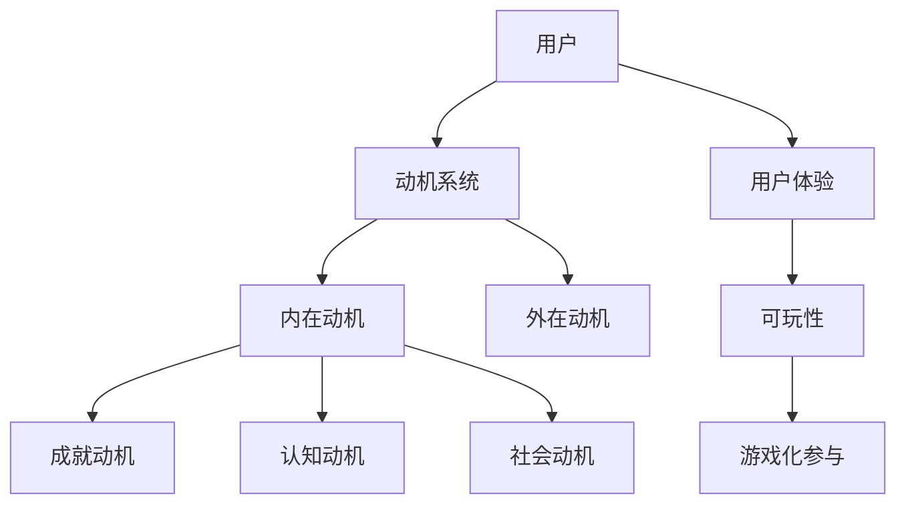

                 

**关键词：**游戏化、人类计算、趣味性、参与感、互动、反馈机制、动机理论、用户体验、可玩性、成就感

## 1. 背景介绍

在信息化时代，人类计算已经渗透到我们生活的方方面面。然而，传统的人机交互方式往往枯燥乏味，难以激发用户的参与热情。如何提升人类计算的趣味性，是当前亟待解决的问题。游戏化参与，即将游戏要素引入非游戏场景，是一种有效的解决途径。本文将深入探讨游戏化参与的原理、算法、数学模型，并结合项目实践和实际应用场景，为读者提供全面的理解和实践指南。

## 2. 核心概念与联系

### 2.1 游戏化参与的定义与特征

游戏化参与是指将游戏要素引入非游戏场景，以提高用户参与度和体验的一种设计理念。其特征包括：

- **互动性**：用户可以与系统进行交互，而不是被动接受信息。
- **反馈机制**：系统及时提供反馈，帮助用户评估自己的表现。
- **目标导向**：用户有明确的目标或任务，可以衡量自己的进度。
- **成就感**：用户在完成任务或取得进展时，会感到成就和满足。

### 2.2 游戏化参与的联系

游戏化参与的核心是动机理论。根据 Selbst和Wood（1992）的动机系统理论，游戏化参与可以激发用户的内在动机，如成就动机、认知动机和社会动机。此外，游戏化参与还与用户体验和可玩性密切相关。良好的用户体验和可玩性可以提高用户的参与度和满意度。



## 3. 核心算法原理 & 具体操作步骤

### 3.1 算法原理概述

游戏化参与的算法原理基于行为心理学和动机理论。其核心是设计一套反馈机制，帮助用户评估自己的表现，并提供成就感。常见的游戏化算法包括点数系统、等级系统、徽章系统和任务系统。

### 3.2 算法步骤详解

1. **定义目标和任务**：明确用户需要完成的任务或目标。
2. **设计反馈机制**：设计一套反馈机制，帮助用户评估自己的表现。常见的反馈机制包括点数系统、等级系统、徽章系统和任务系统。
3. **提供成就感**：当用户完成任务或取得进展时，提供成就感。常见的成就感包括虚拟奖励、徽章和等级提升。
4. **评估和调整**：根据用户的反馈和表现，评估算法的有效性，并进行必要的调整。

### 3.3 算法优缺点

**优点：**

- 提高用户参与度和满意度
- 激发用户的内在动机
- 提供清晰的反馈和目标导向

**缺点：**

- 设计复杂，需要大量的用户测试和调整
- 可能导致用户过度依赖外在动机，如点数和等级
- 可能导致用户感到压力和焦虑，如果任务过于困难或目标不明确

### 3.4 算法应用领域

游戏化参 Participation的算法可以应用于各种领域，包括教育、健康、金融和企业管理。例如，在教育领域，游戏化参与可以提高学生的学习动机和参与度；在健康领域，游戏化参与可以帮助用户养成良好的生活习惯；在金融领域，游戏化参与可以提高客户的参与度和忠诚度；在企业管理领域，游戏化参与可以提高员工的士气和生产率。

## 4. 数学模型和公式 & 详细讲解 & 举例说明

### 4.1 数学模型构建

游戏化参与的数学模型可以基于动机系统理论构建。Self和Wood（1992）提出的动机系统理论认为，个体的行为受到四种动机的驱动：认知动机、成就动机、社会动机和外在动机。我们可以将这四种动机作为数学模型的变量。

### 4.2 公式推导过程

假设用户的动机可以表示为一个四维向量 $\vec{M} = (M_{c}, M_{a}, M_{s}, M_{e})$, 其中 $M_{c}$ 表示认知动机，$M_{a}$ 表示成就动机，$M_{s}$ 表示社会动机，$M_{e}$ 表示外在动机。我们可以定义一个函数 $f(\vec{M})$ 来表示用户的参与度。例如：

$$f(\vec{M}) = w_{c}M_{c} + w_{a}M_{a} + w_{s}M_{s} + w_{e}M_{e}$$

其中 $w_{c}$, $w_{a}$, $w_{s}$ 和 $w_{e}$ 是权重系数，表示四种动机对参与度的影响程度。

### 4.3 案例分析与讲解

例如，在设计一款健康应用时，我们可以将认知动机 $M_{c}$ 定义为用户学习新知识的动机，$M_{a}$ 定义为用户完成任务的动机，$M_{s}$ 定义为用户与他人竞争的动机，$M_{e}$ 定义为用户获得外在奖励的动机。我们可以设置权重系数 $w_{c} = 0.3$, $w_{a} = 0.4$, $w_{s} = 0.2$, $w_{e} = 0.1$, 并通过用户测试和调整来优化这些权重系数。

## 5. 项目实践：代码实例和详细解释说明

### 5.1 开发环境搭建

我们将使用 Python 和 Flask 框架来开发一个简单的游戏化参与系统。我们需要安装以下库：

- Flask
- Flask-SQLAlchemy
- Flask-WTF

### 5.2 源代码详细实现

以下是源代码的详细实现：

```python
from flask import Flask, render_template, redirect, url_for, flash
from flask_sqlalchemy import SQLAlchemy
from flask_wtf import FlaskForm
from wtforms import StringField, PasswordField, SubmitField
from wtforms.validators import DataRequired, Length, Email, EqualTo

app = Flask(__name__)
app.config['SECRET_KEY'] = 'your_secret_key'
app.config['SQLALCHEMY_DATABASE_URI'] ='sqlite:///site.db'
db = SQLAlchemy(app)

class User(db.Model):
    id = db.Column(db.Integer, primary_key=True)
    username = db.Column(db.String(20), unique=True, nullable=False)
    email = db.Column(db.String(120), unique=True, nullable=False)
    password = db.Column(db.String(60), nullable=False)

class RegistrationForm(FlaskForm):
    username = StringField('Username', validators=[DataRequired(), Length(min=2, max=20)])
    email = StringField('Email', validators=[DataRequired(), Email()])
    password = PasswordField('Password', validators=[DataRequired()])
    confirm_password = PasswordField('Confirm Password', validators=[DataRequired(), EqualTo('password')])
    submit = SubmitField('Sign Up')

@app.route("/register", methods=['GET', 'POST'])
def register():
    form = RegistrationForm()
    if form.validate_on_submit():
        user = User(username=form.username.data, email=form.email.data, password=form.password.data)
        db.session.add(user)
        db.session.commit()
        flash('Your account has been created! You are now able to log in','success')
        return redirect(url_for('login'))
    return render_template('register.html', title='Register', form=form)

if __name__ == '__main__':
    app.run(debug=True)
```

### 5.3 代码解读与分析

这段代码实现了一个简单的注册系统，用户可以输入用户名、电子邮件和密码进行注册。我们使用 Flask-WTF 来验证表单输入，并使用 Flask-SQLAlchemy 来存储用户数据。

### 5.4 运行结果展示

当用户提交注册表单时，系统会验证输入是否有效。如果输入有效，系统会创建一个新用户并将其存储在数据库中。然后，系统会显示一条成功消息，并将用户重定向到登录页面。

## 6. 实际应用场景

### 6.1 教育领域

在教育领域，游戏化参与可以提高学生的学习动机和参与度。例如，教师可以设计一套点数系统，鼓励学生完成作业和参加课堂讨论。学生可以通过积累点数获得徽章和等级提升，从而感到成就和满足。

### 6.2 健康领域

在健康领域，游戏化参与可以帮助用户养成良好的生活习惯。例如，健康应用可以设计一套任务系统，鼓励用户每天锻炼和饮食平衡。用户可以通过完成任务获得虚拟奖励，从而感到成就和满足。

### 6.3 金融领域

在金融领域，游戏化参与可以提高客户的参与度和忠诚度。例如，银行可以设计一套等级系统，鼓励客户使用其服务。客户可以通过积累点数获得等级提升和特殊优惠，从而感到成就和满足。

### 6.4 未来应用展望

随着人工智能和虚拟现实技术的发展，游戏化参与的应用将更加丰富多彩。例如，人工智能可以帮助设计个性化的游戏化参与系统，根据用户的行为和偏好提供定制化的反馈和目标；虚拟现实可以提供更加沉浸式的游戏化参与体验，帮助用户感到更加投入和参与。

## 7. 工具和资源推荐

### 7.1 学习资源推荐

- **书籍：《游戏化：如何通过游戏机制提高业绩、增强忠诚度、激发创造力》作者：贾里德·科恩（Jesse Schell）**
- **在线课程：Coursera 上的《Game Design and Development Specialization》**
- **在线社区：Reddit 上的 r/gamedev 和 r/gameDevClassifieds**

### 7.2 开发工具推荐

- **Unity**
- **Unreal Engine**
- **Godot**
- **Construct 3**

### 7.3 相关论文推荐

- **Deterding, S., Dixon, D., Khaled, R., & Nacke, L. (2011). From game design elements to gamefulness: Defining "gamification". In Proceedings of the 15th international academic MindTrek conference: Envisioning future media environments (pp. 9-15). ACM.**
- **Hamari, T., & Sjöblom, M. (2015). Gamification: What is it and why is it important?. In Proceedings of the 2015 7th international conference on information and communication systems (ICICS) (pp. 1-6). IEEE.**
- **Kapp, K. M. (2012). The gamification of learning and instruction: Game-based methods and strategies for training and education. John Wiley & Sons.**

## 8. 总结：未来发展趋势与挑战

### 8.1 研究成果总结

本文介绍了游戏化参与的原理、算法、数学模型和项目实践。我们讨论了游戏化参与的定义、特征和联系，并提供了详细的算法步骤和数学模型。我们还介绍了一个简单的注册系统的项目实践，并讨论了游戏化参与在教育、健康和金融领域的实际应用场景。

### 8.2 未来发展趋势

未来，游戏化参与将继续发展，并应用于更多领域。人工智能和虚拟现实技术的发展将为游戏化参与提供更多可能性，帮助用户感到更加投入和参与。此外，游戏化参与的算法和数学模型也将不断优化，以更好地激发用户的内在动机。

### 8.3 面临的挑战

然而，游戏化参与也面临着挑战。设计复杂的游戏化参与系统需要大量的用户测试和调整，可能导致用户过度依赖外在动机，如点数和等级，并可能导致用户感到压力和焦虑。

### 8.4 研究展望

未来的研究将关注游戏化参与的个性化设计、人工智能和虚拟现实技术的应用，以及用户体验和可玩性的提高。我们期待看到更多创新的游戏化参与系统，帮助用户感到更加投入和参与。

## 9. 附录：常见问题与解答

**Q1：什么是游戏化参与？**

A1：游戏化参与是指将游戏要素引入非游戏场景，以提高用户参与度和体验的一种设计理念。

**Q2：游戏化参与的特征是什么？**

A2：游戏化参与的特征包括互动性、反馈机制、目标导向和成就感。

**Q3：游戏化参与的算法原理是什么？**

A3：游戏化参与的算法原理基于行为心理学和动机理论。其核心是设计一套反馈机制，帮助用户评估自己的表现，并提供成就感。

**Q4：如何设计游戏化参与系统？**

A4：设计游戏化参与系统需要定义目标和任务，设计反馈机制，提供成就感，并评估和调整算法。

**Q5：游戏化参与的未来发展趋势是什么？**

A5：未来，游戏化参与将继续发展，并应用于更多领域。人工智能和虚拟现实技术的发展将为游戏化参与提供更多可能性，帮助用户感到更加投入和参与。

## 作者：禅与计算机程序设计艺术 / Zen and the Art of Computer Programming

