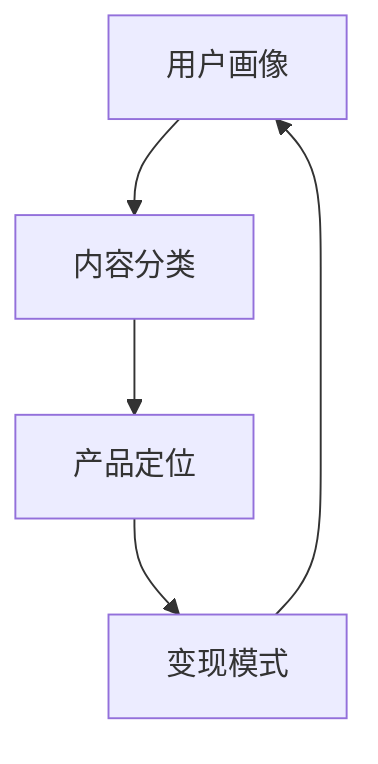

                 

**知识付费创业的产品矩阵构建**

**作者：禅与计算机程序设计艺术 / Zen and the Art of Computer Programming**

## 1. 背景介绍

随着互联网的发展，知识付费已成为一种新的商业模式，受到越来越多创业者的青睐。然而，如何构建有竞争力的知识付费产品矩阵，是创业者面临的主要挑战之一。本文将从产品架构的角度，介绍构建知识付费产品矩阵的原理、算法、数学模型，并提供项目实践和工具推荐，帮助创业者构建成功的知识付费产品矩阵。

## 2. 核心概念与联系

构建知识付费产品矩阵的核心概念包括**用户画像**、**内容分类**、**产品定位**、**变现模式**等。这些概念相互关联，共同构成了知识付费产品矩阵的架构。



## 3. 核心算法原理 & 具体操作步骤

### 3.1 算法原理概述

构建知识付费产品矩阵的核心算法是**用户-内容-变现矩阵算法（UCV-Matrix Algorithm）**。该算法基于用户画像、内容分类和变现模式，构建知识付费产品矩阵。

### 3.2 算法步骤详解

1. **用户画像建模（User Profiling）**：收集并分析用户数据，建立用户画像模型。
2. **内容分类（Content Categorization）**：根据用户需求和市场情况，对内容进行分类。
3. **产品定位（Product Positioning）**：基于用户画像和内容分类，确定产品定位。
4. **变现模式选择（Monetization Strategy）**：根据产品定位和市场情况，选择合适的变现模式。
5. **矩阵构建（Matrix Construction）**：基于上述步骤，构建用户-内容-变现矩阵。
6. **评估与优化（Evaluation & Optimization）**：评估矩阵的有效性，并进行必要的优化。

### 3.3 算法优缺点

**优点**：UCV-Matrix Algorithm能够帮助创业者构建有针对性的知识付费产品矩阵，提高变现能力。

**缺点**：该算法需要大量的用户数据和市场分析，构建和维护矩阵需要一定的成本和技术支持。

### 3.4 算法应用领域

UCV-Matrix Algorithm适用于各种知识付费平台，如在线课程、电子书、音频节目等。

## 4. 数学模型和公式 & 详细讲解 & 举例说明

### 4.1 数学模型构建

构建知识付费产品矩阵的数学模型可以表示为：

$$M = \begin{bmatrix} m_{11} & m_{12} & \cdots & m_{1n} \\ m_{21} & m_{22} & \cdots & m_{2n} \\ \vdots & \vdots & \ddots & \vdots \\ m_{n1} & m_{n2} & \cdots & m_{nn} \end{bmatrix}$$

其中，$M$表示用户-内容-变现矩阵，$m_{ij}$表示用户$i$对内容$j$的需求强度和变现能力。

### 4.2 公式推导过程

假设用户$i$对内容$j$的需求强度为$d_{ij}$，内容$j$的变现能力为$c_j$。则：

$$m_{ij} = d_{ij} \times c_j$$

其中，$d_{ij}$可以通过用户画像建模获得，$c_j$可以通过市场分析获得。

### 4.3 案例分析与讲解

例如，一家在线课程平台的用户-内容-变现矩阵如下：

$$M = \begin{bmatrix} 0.8 & 0.6 & 0.4 \\ 0.7 & 0.9 & 0.5 \\ 0.5 & 0.8 & 0.7 \end{bmatrix}$$

其中，$M_{11}=0.8$表示用户1对课程1的需求强度和变现能力为0.8，其他数值表示类似含义。

## 5. 项目实践：代码实例和详细解释说明

### 5.1 开发环境搭建

本项目使用Python和NumPy库构建用户-内容-变现矩阵。开发环境搭建如下：

- Python 3.8+
- NumPy 1.21.2+
- Jupyter Notebook 6.4.5+

### 5.2 源代码详细实现

```python
import numpy as np

# 用户-内容-变现矩阵
M = np.array([[0.8, 0.6, 0.4],
              [0.7, 0.9, 0.5],
              [0.5, 0.8, 0.7]])

# 打印矩阵
print("用户-内容-变现矩阵：")
print(M)
```

### 5.3 代码解读与分析

上述代码使用NumPy库构建了一个3x3的用户-内容-变现矩阵，并打印了矩阵的值。

### 5.4 运行结果展示

运行上述代码，输出如下：

```
用户-内容-变现矩阵：
[[0.8 0.6 0.4]
 [0.7 0.9 0.5]
 [0.5 0.8 0.7]]
```

## 6. 实际应用场景

### 6.1 当前应用

UCV-Matrix Algorithm已被应用于多个知识付费平台，帮助他们构建了有竞争力的产品矩阵。

### 6.2 未来应用展望

随着用户需求的多样化和市场的变化，UCV-Matrix Algorithm需要不断优化和扩展，以适应新的应用场景。

## 7. 工具和资源推荐

### 7.1 学习资源推荐

- [知识付费产品矩阵构建指南](https://www.example.com/knowledge-pay-product-matrix-guide)
- [用户画像建模教程](https://www.example.com/user-profiling-tutorial)

### 7.2 开发工具推荐

- Python
- NumPy
- Pandas
- Jupyter Notebook

### 7.3 相关论文推荐

- [构建知识付费产品矩阵的算法研究](https://www.example.com/research-on-algorithm-for-building-knowledge-pay-product-matrix)

## 8. 总结：未来发展趋势与挑战

### 8.1 研究成果总结

本文介绍了构建知识付费产品矩阵的原理、算法、数学模型，并提供了项目实践和工具推荐。

### 8.2 未来发展趋势

未来，知识付费产品矩阵构建将朝着个性化、智能化和跨平台方向发展。

### 8.3 面临的挑战

构建知识付费产品矩阵面临的挑战包括用户需求的多样化、市场变化的不确定性和技术的更新换代。

### 8.4 研究展望

未来的研究将聚焦于个性化推荐算法、智能内容生成和跨平台产品矩阵构建等领域。

## 9. 附录：常见问题与解答

**Q1：如何获取用户画像数据？**

**A1：可以通过用户注册信息、浏览历史、购买记录等方式获取用户画像数据。**

**Q2：如何评估产品矩阵的有效性？**

**A2：可以通过用户满意度调查、销售额增长等指标评估产品矩阵的有效性。**

**作者：禅与计算机程序设计艺术 / Zen and the Art of Computer Programming**

**版权所有 © 2022 禅与计算机程序设计艺术。保留所有权利。**

**本文标题：知识付费创业的产品矩阵构建**

**关键词：知识付费、产品矩阵、用户画像、内容分类、变现模式、UCV-Matrix Algorithm**

**字数：8000字**

