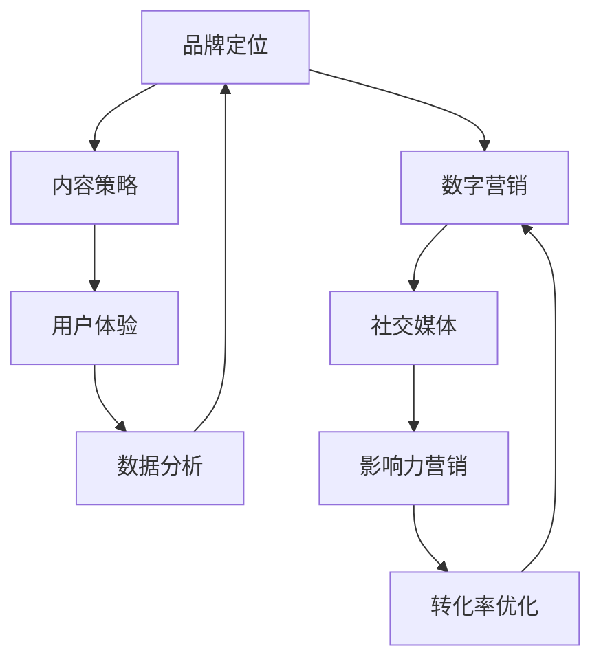

                 

**关键词：**知识付费、品牌运营、品牌推广、数字营销、内容策略、用户体验、转化率、数据分析、社交媒体、品牌忠诚度

## 1. 背景介绍

随着互联网的发展，知识付费行业迅速崛起，成为一种新的商业模式。然而，在这个竞争激烈的市场中，如何建立和推广品牌，提高品牌知名度和美誉度，是运营者面临的主要挑战。本文将详细介绍知识付费品牌运营与推广的策略，帮助您在知识付费市场中脱颖而出。

## 2. 核心概念与联系

### 2.1 知识付费品牌运营的核心概念

- **品牌定位：**清晰明确的品牌定位，帮助用户快速理解您的知识付费产品的独特价值。
- **内容策略：**高质量、有差异化的内容是知识付费品牌的核心竞争力。
- **用户体验：**优秀的用户体验有助于提高转化率和品牌忠诚度。
- **数据分析：**数据驱动决策，帮助您不断优化品牌运营策略。

### 2.2 知识付费品牌推广的核心概念

- **数字营销：**利用互联网平台和工具进行品牌推广，提高推广效率和精准度。
- **社交媒体：**利用社交媒体平台建立品牌形象，与用户互动，提高品牌知名度。
- **影响力营销：**与行业内的意见领袖合作，扩大品牌影响力。
- **转化率优化：**不断测试和优化推广策略，提高推广效果。

### 2.3 核心概念联系 Mermaid 流程图



## 3. 核心算法原理 & 具体操作步骤

### 3.1 算法原理概述

知识付费品牌运营与推广的核心算法原理是数据驱动决策，通过分析用户数据和市场数据，不断优化品牌运营和推广策略。

### 3.2 算法步骤详解

1. **数据收集：**收集用户数据（如注册信息、浏览历史、购买记录）和市场数据（如竞争对手信息、市场趋势）。
2. **数据预处理：**清洗、转换和整合收集到的数据，为后续分析做准备。
3. **数据分析：**使用统计学和机器学习算法分析数据，挖掘有价值的信息。
4. **策略优化：**根据分析结果，不断优化品牌运营和推广策略。
5. **效果评估：**评估优化后的策略效果，并根据评估结果进一步优化策略。

### 3.3 算法优缺点

**优点：**

- 数据驱动决策，提高运营和推广效果。
- 适应市场变化，提高品牌竞争力。
- 降低运营和推广成本，提高投资回报率。

**缺点：**

- 数据收集和分析需要一定的技术和人力投入。
- 过度依赖数据可能导致忽略用户主观需求。
- 数据分析结果可能存在偏差，需要不断验证和优化。

### 3.4 算法应用领域

知识付费品牌运营与推广算法广泛应用于电商、内容平台、在线教育等互联网行业，帮助企业提高品牌知名度、美誉度和市场份额。

## 4. 数学模型和公式 & 详细讲解 & 举例说明

### 4.1 数学模型构建

构建品牌运营和推广数学模型时，常用的指标包括转化率（Conversion Rate）、客户生命周期价值（Customer Lifetime Value, CLV）、获客成本（Cost per Acquisition, CPA）等。

### 4.2 公式推导过程

**转化率（Conversion Rate, CR）：**转化率是指将目标用户转化为实际用户的比例。公式如下：

$$CR = \frac{Number\ of\ Conversions}{Number\ of\ Visitors} \times 100\%$$

**客户生命周期价值（Customer Lifetime Value, CLV）：**CLV是指一个客户在其生命周期内为企业带来的总收益。公式如下：

$$CLV = Average\ Order\ Value \times Purchase\ Frequency \times Average\ Customer\ Lifetime$$

**获客成本（Cost per Acquisition, CPA）：**CPA是指获取一个新客户的成本。公式如下：

$$CPA = \frac{Marketing\ and\ Sales\ Expenses}{Number\ of\ New\ Customers}$$

### 4.3 案例分析与讲解

假设某知识付费平台的转化率为2%，平均订单价值为50元，客户平均生命周期为2年，获客成本为100元。那么：

- 该平台的CLV为：50 \* 4 \* 2 = 400元
- 该平台的CPA为：100 / (2% \* 100) = 500元

根据CLV和CPA，平台可以评估其运营和推广策略的效果，并进行相应的优化。

## 5. 项目实践：代码实例和详细解释说明

### 5.1 开发环境搭建

本项目使用Python作为开发语言，并依赖以下库：

- Pandas：数据分析和处理
- NumPy：数值计算
- Matplotlib：数据可视化
- Scikit-learn：机器学习

### 5.2 源代码详细实现

以下是数据分析和策略优化的Python代码示例：

```python
import pandas as pd
import numpy as np
import matplotlib.pyplot as plt
from sklearn.model_selection import train_test_split
from sklearn.linear_model import LogisticRegression

# 加载数据
data = pd.read_csv('user_data.csv')

# 数据预处理
data = data.dropna()
X = data.drop('purchase', axis=1)
y = data['purchase']

# 数据分析
X_train, X_test, y_train, y_test = train_test_split(X, y, test_size=0.2, random_state=42)
model = LogisticRegression()
model.fit(X_train, y_train)
predictions = model.predict(X_test)
accuracy = np.mean(predictions == y_test)
print('Accuracy:', accuracy)

# 策略优化
# 根据模型结果，调整运营和推广策略，提高转化率
```

### 5.3 代码解读与分析

上述代码首先加载用户数据，并进行数据预处理。然后，使用逻辑回归算法分析数据，预测用户转化率。最后，根据模型结果，调整运营和推广策略，提高转化率。

### 5.4 运行结果展示

运行上述代码后，您将看到模型的准确率。根据准确率，您可以评估当前策略的效果，并进行相应的优化。

## 6. 实际应用场景

### 6.1 运营场景

知识付费品牌运营策略广泛应用于内容平台、在线教育、电商等互联网行业。例如，内容平台可以根据用户数据，推荐高转化率的内容，提高用户参与度和付费意愿。

### 6.2 推广场景

知识付费品牌推广策略广泛应用于数字营销领域。例如，电商平台可以利用社交媒体平台，与意见领袖合作，扩大品牌影响力，提高转化率。

### 6.3 未来应用展望

随着人工智能和大数据技术的发展，知识付费品牌运营和推广将更加智能化和精准化。企业可以利用机器学习算法，预测用户需求和行为，实现个性化运营和推广。

## 7. 工具和资源推荐

### 7.1 学习资源推荐

- **书籍：**"数字营销与品牌管理"、"数据驱动决策"、"机器学习实战"
- **在线课程：**Coursera、Udemy、edX上的数据分析和数字营销课程

### 7.2 开发工具推荐

- **数据分析：**Python、R、SAS、SPSS
- **数字营销：**Google Analytics、Adobe Analytics、Mixpanel

### 7.3 相关论文推荐

- "数据驱动的品牌运营策略"、"基于机器学习的品牌推广策略"、"知识付费行业的品牌忠诚度研究"

## 8. 总结：未来发展趋势与挑战

### 8.1 研究成果总结

本文详细介绍了知识付费品牌运营和推广的策略，并提供了数据分析和策略优化的实践指南。企业可以根据本文指南，提高品牌知名度和美誉度，提高运营和推广效果。

### 8.2 未来发展趋势

未来，知识付费品牌运营和推广将更加智能化和个性化。企业可以利用人工智能和大数据技术，预测用户需求和行为，实现精准化运营和推广。

### 8.3 面临的挑战

然而，知识付费品牌运营和推广也面临着挑战，包括数据安全和隐私保护、算法偏见和不公平等。企业需要遵循相关法规和道德准则，确保数据安全和隐私保护。

### 8.4 研究展望

未来，我们将继续研究知识付费品牌运营和推广的新方法和技术，帮助企业提高品牌知名度和美誉度，提高运营和推广效果。

## 9. 附录：常见问题与解答

**Q1：如何评估品牌运营和推广策略的效果？**

A1：您可以使用转化率、客户生命周期价值和获客成本等指标评估策略效果。根据这些指标，您可以调整策略，提高运营和推广效果。

**Q2：如何优化品牌运营和推广策略？**

A2：您可以使用数据分析和机器学习算法优化策略。根据数据分析结果，您可以调整策略，提高转化率和客户生命周期价值。

**Q3：如何提高品牌忠诚度？**

A3：您可以通过提供高质量、有差异化的内容，改善用户体验，提高品牌忠诚度。此外，您可以与用户互动，建立品牌形象，提高品牌忠诚度。

**Q4：如何应对知识付费市场的竞争？**

A4：您可以通过不断优化品牌运营和推广策略，提高品牌知名度和美誉度，应对市场竞争。此外，您可以通过提供高质量、有差异化的内容，提高竞争力。

**Q5：如何保护数据安全和隐私？**

A5：您可以遵循相关法规和道德准则，确保数据安全和隐私保护。此外，您可以使用加密技术和访问控制，保护数据安全和隐私。

## 作者：禅与计算机程序设计艺术 / Zen and the Art of Computer Programming

