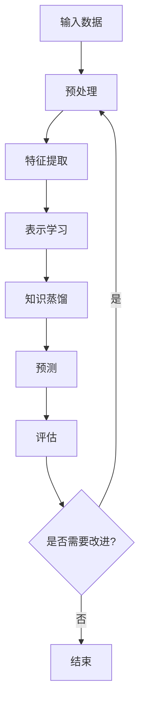

                 

## 关键词

- 知识蒸馏 (Knowledge Distillation)
- 多模态学习 (Multimodal Learning)
- 图像分类 (Image Classification)
- 自然语言处理 (Natural Language Processing)
- 语义理解 (Semantic Understanding)
- 多任务学习 (Multitask Learning)
- 知识转移 (Knowledge Transfer)

## 1. 背景介绍

在当今的深度学习时代，模型的性能和泛化能力是衡量其优劣的关键指标。然而，大多数模型需要大量的标记数据和计算资源来训练，这在某些领域（如医疗、法律等）是不现实的。知识蒸馏是一种有效的方法，旨在利用预训练的大型模型的知识，帮助小型模型获得更好的性能。在多模态学习中，知识蒸馏也发挥着重要作用，帮助模型理解和整合来自不同模态（如文本、图像、音频等）的信息。

## 2. 核心概念与联系

### 2.1 知识蒸馏原理

知识蒸馏的核心思想是使用一个小型的学生网络来学习一个大型的教师网络的输出，而不是直接学习标签。教师网络通常是一个预训练的大型模型，而学生网络则是一个更小、更轻量级的模型。通过这种方式，学生网络可以学习到教师网络的表示和决策规则，从而获得更好的泛化能力。


### 2.2 多模态学习

多模态学习旨在从多个模态的数据中学习表示和特征，并整合这些信息来提高模型的性能。在图像-文本多模态学习中，模型需要理解图像和文本之间的关系，并学习到表示图像和文本的共享表示。知识蒸馏可以帮助模型学习到更好的表示，从而提高多模态学习的性能。


### 2.3 Mermaid 流程图



## 3. 核心算法原理 & 具体操作步骤

### 3.1 算法原理概述

在多模态学习中，知识蒸馏的核心原理是使用教师网络的输出（soft targets）来训练学生网络。教师网络通常是一个预训练的大型模型，而学生网络则是一个更小、更轻量级的模型。通过这种方式，学生网络可以学习到教师网络的表示和决策规则，从而获得更好的泛化能力。

### 3.2 算法步骤详解

1. **预训练教师网络**：使用大量的标记数据训练一个大型的教师网络。
2. **生成soft targets**：使用预训练的教师网络对输入数据进行预测，生成soft targets。
3. **训练学生网络**：使用生成的soft targets来训练一个小型的学生网络。
4. **评估学生网络**：评估学生网络的性能，并根据需要进行调整。
5. **重复步骤3-4**：直到学生网络的性能满足要求为止。

### 3.3 算法优缺点

**优点**：

* 可以帮助小型模型获得更好的泛化能力。
* 可以在资源有限的情况下提高模型的性能。
* 可以帮助模型学习到更好的表示和决策规则。

**缺点**：

* 需要预训练的大型模型作为教师网络。
* 训练过程可能需要更多的时间和计算资源。
* 学生网络的性能可能受到教师网络的限制。

### 3.4 算法应用领域

知识蒸馏在多模态学习中有着广泛的应用，包括但不限于：

* 图像-文本多模态学习：用于图像分类、图像描述、视觉问答等任务。
* 视频-文本多模态学习：用于视频分类、视频描述、视频问答等任务。
* 语音-文本多模态学习：用于语音识别、语音情感分析等任务。

## 4. 数学模型和公式 & 详细讲解 & 举例说明

### 4.1 数学模型构建

在知识蒸馏中，教师网络的输出可以表示为：

$$q_{ij} = \frac{exp(z_{ij}/T)}{\sum_{k}exp(z_{ik}/T)}$$

其中，$z_{ij}$是教师网络的输出，表示第$i$个样本属于第$j$类的概率。$T$是温度参数，用于调节soft targets的平滑度。当$T$接近于0时，soft targets变得更加尖锐，更接近于硬标签。当$T$接近于无穷大时，soft targets变得更加平滑，更接近于均匀分布。

### 4.2 公式推导过程

学生网络的目标函数可以表示为：

$$L_{KD} = -\frac{1}{N}\sum_{i=1}^{N}\sum_{j=1}^{M}q_{ij}log(p_{ij})$$

其中，$p_{ij}$是学生网络的输出，表示第$i$个样本属于第$j$类的概率。$N$是样本数，$M$是类别数。通过最小化这个目标函数，学生网络可以学习到教师网络的表示和决策规则。

### 4.3 案例分析与讲解

例如，在图像-文本多模态学习中，教师网络可以是一个预训练的大型图像分类模型（如ResNet-50），学生网络可以是一个更小、更轻量级的模型（如MobileNet）。通过使用教师网络的输出来训练学生网络，学生网络可以学习到更好的表示和决策规则，从而提高图像分类的性能。

## 5. 项目实践：代码实例和详细解释说明

### 5.1 开发环境搭建

在开始项目实践之前，我们需要搭建开发环境。我们需要安装以下软件和库：

* Python 3.7+
* PyTorch 1.7+
* torchvision 0.8+
* numpy 1.19+
* matplotlib 3.3+

### 5.2 源代码详细实现

以下是使用PyTorch实现知识蒸馏的示例代码：

```python
import torch
import torch.nn as nn
import torch.optim as optim
import torchvision.transforms as transforms
import torchvision.models as models

# 定义教师网络
teacher = models.resnet50(pretrained=True)
teacher.eval()

# 定义学生网络
student = models.mobilenet_v2(pretrained=False)
student.train()

# 定义损失函数
criterion = nn.KLDivLoss(reduction='batchmean')

# 定义优化器
optimizer = optim.SGD(student.parameters(), lr=0.01, momentum=0.9)

# 加载数据集
transform = transforms.Compose([
    transforms.Resize(256),
    transforms.CenterCrop(224),
    transforms.ToTensor(),
    transforms.Normalize(mean=[0.485, 0.456, 0.406], std=[0.229, 0.224, 0.225]),
])
dataset = torchvision.datasets.ImageFolder(root='path/to/dataset', transform=transform)
dataloader = torch.utils.data.DataLoader(dataset, batch_size=32, shuffle=True)

# 训练学生网络
for epoch in range(10):
    for inputs, labels in dataloader:
        # 使用教师网络生成soft targets
        with torch.no_grad():
            outputs = teacher(inputs)
            soft_targets = nn.functional.softmax(outputs / 0.5, dim=1)

        # 使用学生网络预测
        outputs = student(inputs)

        # 计算损失
        loss = criterion(outputs, soft_targets)

        # 反向传播和优化
        optimizer.zero_grad()
        loss.backward()
        optimizer.step()

        # 打印损失
        print(f'Epoch [{epoch+1}/10], Loss: {loss.item():.4f}')
```

### 5.3 代码解读与分析

在代码中，我们首先定义了教师网络（ResNet-50）和学生网络（MobileNet）。然后，我们定义了损失函数（KL散度）和优化器（SGD）。我们使用PyTorch的ImageFolder来加载数据集，并定义了数据预处理的transform。

在训练循环中，我们首先使用教师网络生成soft targets。然后，我们使用学生网络预测，并计算损失。最后，我们进行反向传播和优化，并打印损失。

### 5.4 运行结果展示

通过运行上述代码，我们可以训练学生网络，并评估其性能。在训练过程中，我们可以观察到损失的变化，从而判断学生网络是否学习到了教师网络的表示和决策规则。在评估时，我们可以使用测试集来评估学生网络的准确率，并与教师网络的准确率进行比较。

## 6. 实际应用场景

知识蒸馏在多模态学习中有着广泛的应用，以下是一些实际应用场景：

### 6.1 图像-文本多模态学习

在图像-文本多模态学习中，知识蒸馏可以帮助模型学习到更好的表示，从而提高图像分类、图像描述、视觉问答等任务的性能。例如，在图像描述任务中，模型需要生成描述图像内容的文本。通过使用预训练的大型图像分类模型作为教师网络，小型模型可以学习到更好的表示，从而生成更准确的描述。

### 6.2 视频-文本多模态学习

在视频-文本多模态学习中，知识蒸馏可以帮助模型学习到更好的表示，从而提高视频分类、视频描述、视频问答等任务的性能。例如，在视频描述任务中，模型需要生成描述视频内容的文本。通过使用预训练的大型视频分类模型作为教师网络，小型模型可以学习到更好的表示，从而生成更准确的描述。

### 6.3 语音-文本多模态学习

在语音-文本多模态学习中，知识蒸馏可以帮助模型学习到更好的表示，从而提高语音识别、语音情感分析等任务的性能。例如，在语音识别任务中，模型需要将语音转换为文本。通过使用预训练的大型语音识别模型作为教师网络，小型模型可以学习到更好的表示，从而进行更准确的识别。

### 6.4 未来应用展望

随着多模态学习的发展，知识蒸馏也将发挥越来越重要的作用。未来，知识蒸馏可能会应用于更多的多模态学习任务，如图像-音频多模态学习、图像-语义多模态学习等。此外，知识蒸馏也可能会结合其他技术，如对抗学习、生成对抗网络等，从而提高多模态学习的性能。

## 7. 工具和资源推荐

### 7.1 学习资源推荐

* [Hinton's Distill: A Student's Guide to Knowledge Distillation](https://arxiv.org/abs/1503.02531)
* [Knowledge Distillation: A Survey of Methods, Applications and Trends](https://arxiv.org/abs/2004.11171)
* [Multimodal Learning: A Survey of Methods, Applications and Trends](https://arxiv.org/abs/2102.02599)

### 7.2 开发工具推荐

* PyTorch：一个强大的深度学习框架，支持动态计算图和定义自定义模块。
* TensorFlow：一个流行的深度学习框架，支持静态计算图和定义自定义模块。
* Hugging Face Transformers：一个开源的transformer模型库，支持多模态学习任务。

### 7.3 相关论文推荐

* [DistilBERT, a distilled version of BERT: smaller, faster, cheaper and lighter](https://arxiv.org/abs/1910.01108)
* [Multimodal Knowledge Distillation for Visual Question Answering](https://arxiv.org/abs/1908.07457)
* [Multimodal Knowledge Distillation for Video Understanding](https://arxiv.org/abs/2004.06164)

## 8. 总结：未来发展趋势与挑战

### 8.1 研究成果总结

在本文中，我们介绍了知识蒸馏在多模态学习中的应用策略。我们首先介绍了知识蒸馏的原理和多模态学习的概念。然后，我们详细介绍了知识蒸馏的算法原理和操作步骤。我们还提供了数学模型和公式的详细讲解，并给出了案例分析和代码实例。最后，我们介绍了知识蒸馏在实际应用中的场景，并推荐了相关的学习资源、开发工具和论文。

### 8.2 未来发展趋势

未来，知识蒸馏在多模态学习中的应用将会越来越广泛。随着多模态学习任务的增多，知识蒸馏将会帮助模型学习到更好的表示，从而提高模型的性能。此外，知识蒸馏也将会结合其他技术，如对抗学习、生成对抗网络等，从而提高多模态学习的性能。

### 8.3 面临的挑战

然而，知识蒸馏也面临着一些挑战。首先，教师网络的选择至关重要。如果教师网络的性能不佳，则学生网络的性能也会受到影响。其次，知识蒸馏的过程可能需要更多的时间和计算资源。最后，知识蒸馏的效果可能受到教师网络的限制，学生网络的性能可能无法超越教师网络。

### 8.4 研究展望

未来的研究方向包括但不限于：

* 研究更有效的教师网络选择策略。
* 研究更高效的知识蒸馏算法，以减少时间和计算资源的消耗。
* 研究如何帮助学生网络超越教师网络的性能。
* 研究知识蒸馏在更多多模态学习任务中的应用。

## 9. 附录：常见问题与解答

**Q1：知识蒸馏的优点是什么？**

A1：知识蒸馏的优点包括帮助小型模型获得更好的泛化能力，在资源有限的情况下提高模型的性能，帮助模型学习到更好的表示和决策规则。

**Q2：知识蒸馏的缺点是什么？**

A2：知识蒸馏的缺点包括需要预训练的大型模型作为教师网络，训练过程可能需要更多的时间和计算资源，学生网络的性能可能受到教师网络的限制。

**Q3：知识蒸馏在多模态学习中的应用场景有哪些？**

A3：知识蒸馏在多模态学习中的应用场景包括图像-文本多模态学习、视频-文本多模态学习、语音-文本多模态学习等。

**Q4：知识蒸馏的未来发展趋势是什么？**

A4：知识蒸馏的未来发展趋势包括应用于更多的多模态学习任务，结合其他技术提高多模态学习的性能。

**Q5：知识蒸馏面临的挑战是什么？**

A5：知识蒸馏面临的挑战包括教师网络的选择、训练过程的时间和计算资源消耗、学生网络性能受到教师网络限制等。

## 作者：禅与计算机程序设计艺术 / Zen and the Art of Computer Programming

