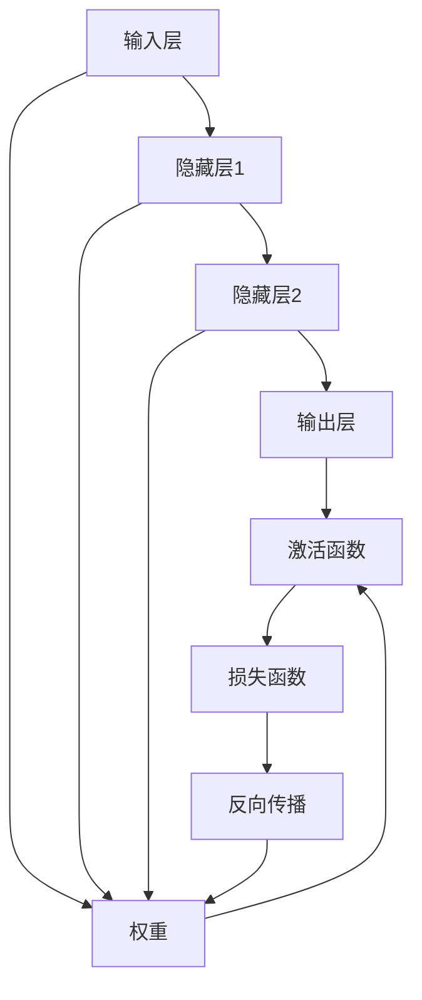

                 

**神经网络：不仅仅是另一个分类器**

**作者：禅与计算机程序设计艺术 / Zen and the Art of Computer Programming**

## 1. 背景介绍

神经网络（Neural Networks）是一种模拟人类大脑神经元网络的计算模型，自从1943年Warren McCulloch和Walter Pitts首次提出以来，已经发展成为人工智能领域的核心组成部分。神经网络的应用从简单的分类任务扩展到图像识别、自然语言处理、自动驾驶等复杂领域，其影响力和重要性日益凸显。然而，神经网络并不仅仅是另一个分类器，它是一种通用的学习框架，具有强大的表示能力和泛化能力。本文将深入探讨神经网络的核心概念、算法原理、数学模型，并通过项目实践和实际应用场景的分析，展示神经网络的广泛应用和未来发展趋势。

## 2. 核心概念与联系

神经网络的核心概念包括神经元、权重、激活函数、损失函数等。这些概念通过复杂的网络结构联系在一起，共同构成了神经网络的学习和预测能力。下面是神经网络的核心概念原理和架构的 Mermaid 流程图：



## 3. 核心算法原理 & 具体操作步骤

### 3.1 算法原理概述

神经网络的核心算法是反向传播（Backpropagation），它是一种监督学习算法，用于调整神经网络的权重，以最小化损失函数。反向传播算法的基本原理是计算梯度，即网络输出相对于权重的导数，然后使用梯度下降法更新权重。

### 3.2 算法步骤详解

1. **前向传播（Forward Propagation）：** 将输入数据通过神经网络的各层，计算每层的输出。
2. **计算损失（Compute Loss）：** 使用损失函数计算网络输出与真实值之间的差异。
3. **反向传播（Backpropagation）：** 计算梯度，即网络输出相对于权重的导数。
4. **更新权重（Update Weights）：** 使用梯度下降法更新权重，以最小化损失函数。

### 3.3 算法优缺点

**优点：**

* 具有强大的表示能力和泛化能力。
* 可以学习非线性决策边界。
* 可以处理高维数据。

**缺点：**

* 训练过程需要大量的数据和计算资源。
* 易于陷入局部最小值。
* 缺乏解释性，即模型的决策过程难以理解。

### 3.4 算法应用领域

神经网络的应用领域非常广泛，包括图像识别、自然语言处理、自动驾驶、医疗诊断等。随着深度学习的发展，神经网络的应用正在不断扩展，并取得了令人印象深刻的成就。

## 4. 数学模型和公式 & 详细讲解 & 举例说明

### 4.1 数学模型构建

神经网络的数学模型可以表示为：

$$y = f(wx + b)$$

其中，$x$是输入，$w$是权重，$b$是偏置，$f$是激活函数，$y$是输出。

### 4.2 公式推导过程

神经网络的学习过程可以表示为最小化损失函数：

$$L = \frac{1}{n}\sum_{i=1}^{n}l(y_i, \hat{y}_i)$$

其中，$l$是损失函数，$y_i$是真实值，$\hat{y}_i$是网络输出，$n$是样本数。

### 4.3 案例分析与讲解

例如，考虑一个简单的二层全连接神经网络，用于分类任务。输入层有4个神经元，隐藏层有3个神经元，输出层有2个神经元。假设激活函数为ReLU，损失函数为交叉熵损失。那么，神经网络的数学模型可以表示为：

$$y = \sigma(w_2\sigma(w_1x + b_1) + b_2)$$

其中，$w_1$和$w_2$是权重，$b_1$和$b_2$是偏置，$x$是输入，$y$是输出，$\sigma$是sigmoid函数。

## 5. 项目实践：代码实例和详细解释说明

### 5.1 开发环境搭建

本项目使用Python和TensorFlow框架开发。首先，需要安装Python和TensorFlow。然后，创建一个新的Python项目，并导入必要的库：

```python
import tensorflow as tf
from tensorflow.keras.models import Sequential
from tensorflow.keras.layers import Dense
```

### 5.2 源代码详细实现

以下是一个简单的二层全连接神经网络的实现代码：

```python
model = Sequential()
model.add(Dense(3, input_dim=4, activation='relu'))
model.add(Dense(2, activation='softmax'))
model.compile(loss='categorical_crossentropy', optimizer='adam', metrics=['accuracy'])
```

### 5.3 代码解读与分析

* `Sequential()`创建了一个线性堆叠的模型。
* `Dense()`添加了一个全连接层。第一个`Dense()`层有3个神经元，输入维度为4，激活函数为ReLU。第二个`Dense()`层有2个神经元，激活函数为softmax。
* `compile()`方法配置了模型的学习过程。损失函数为交叉熵损失，优化器为Adam，评估指标为准确率。

### 5.4 运行结果展示

在训练数据集上训练模型，并评估模型的准确率：

```python
model.fit(X_train, y_train, epochs=100, batch_size=10)
loss, accuracy = model.evaluate(X_test, y_test)
print('Test accuracy:', accuracy)
```

## 6. 实际应用场景

### 6.1 当前应用

神经网络在各种领域都有广泛的应用，例如：

* **图像识别：** 使用卷积神经网络（CNN）进行图像分类、物体检测和图像分割。
* **自然语言处理：** 使用循环神经网络（RNN）和长短期记忆网络（LSTM）进行文本分类、机器翻译和语言模型。
* **自动驾驶：** 使用神经网络进行目标检测、路径规划和预测。

### 6.2 未来应用展望

随着计算能力的提高和数据量的增加，神经网络的应用将会扩展到更多领域，例如：

* **生物医学：** 使用神经网络进行疾病诊断、药物发现和基因组学研究。
* **物联网：** 使用神经网络进行实时监控、预测维护和智能控制。
* **虚拟现实：** 使用神经网络进行实时渲染、情感分析和用户行为预测。

## 7. 工具和资源推荐

### 7.1 学习资源推荐

* **书籍：**
	+ "Deep Learning" by Ian Goodfellow, Yoshua Bengio, and Aaron Courville
	+ "Neural Networks and Deep Learning" by Michael Nielsen
* **在线课程：**
	+ Andrew Ng's Machine Learning course on Coursera
	+ Fast.ai's Practical Deep Learning for Coders course

### 7.2 开发工具推荐

* **框架：**
	+ TensorFlow
	+ PyTorch
	+ Keras
* **开发环境：**
	+ Jupyter Notebook
	+ Google Colab
	+ Anaconda

### 7.3 相关论文推荐

* "A Neural Network for Recognizing Handwritten Digits" by Yann LeCun et al.
* "ImageNet Classification with Deep Convolutional Neural Networks" by Karen Simonyan and Andrew Zisserman
* "Attention Is All You Need" by Vaswani et al.

## 8. 总结：未来发展趋势与挑战

### 8.1 研究成果总结

神经网络已经取得了令人印象深刻的成就，在各种领域都有广泛的应用。然而，仍然存在许多挑战需要解决。

### 8.2 未来发展趋势

未来，神经网络的发展趋势包括：

* **更大、更复杂的模型：** 计算能力的提高将使得更大、更复杂的模型成为可能。
* **更多的数据：** 数据量的增加将提高模型的泛化能力。
* **更智能的算法：** 研究人员将开发出更智能的算法，以提高模型的性能和效率。

### 8.3 面临的挑战

神经网络面临的挑战包括：

* **计算资源：** 训练大型模型需要大量的计算资源。
* **数据隐私：** 使用大量数据训练模型可能会侵犯隐私。
* **解释性：** 模型的决策过程难以理解，这限制了其在某些领域的应用。

### 8.4 研究展望

未来的研究将关注于解决上述挑战，并开发出更智能、更高效的神经网络。

## 9. 附录：常见问题与解答

**Q1：神经网络是如何学习的？**

A1：神经网络通过反向传播算法学习，该算法使用梯度下降法更新权重，以最小化损失函数。

**Q2：神经网络的优点是什么？**

A2：神经网络具有强大的表示能力和泛化能力，可以学习非线性决策边界，并处理高维数据。

**Q3：神经网络的缺点是什么？**

A3：神经网络的缺点包括需要大量的数据和计算资源，易于陷入局部最小值，缺乏解释性。

**Q4：神经网络的应用领域有哪些？**

A4：神经网络的应用领域包括图像识别、自然语言处理、自动驾驶、医疗诊断等。

**Q5：未来神经网络的发展趋势是什么？**

A5：未来神经网络的发展趋势包括更大、更复杂的模型，更多的数据，更智能的算法。

**Q6：神经网络面临的挑战是什么？**

A6：神经网络面临的挑战包括计算资源、数据隐私、解释性等。

**Q7：未来的研究将关注于哪些领域？**

A7：未来的研究将关注于解决神经网络面临的挑战，并开发出更智能、更高效的神经网络。

**Q8：如何开始学习神经网络？**

A8：可以阅读相关书籍，参加在线课程，并使用开发工具进行实践。

**Q9：如何评估神经网络的性能？**

A9：可以使用评估指标，如准确率、精确度、召回率、F1分数等，来评估神经网络的性能。

**Q10：如何解决过拟合问题？**

A10：可以使用正则化、 dropout、数据增强等技术来解决过拟合问题。

**Q11：如何选择激活函数？**

A11：选择激活函数取决于任务的性质。例如，ReLU函数常用于深度学习任务，sigmoid函数常用于二分类任务。

**Q12：如何选择损失函数？**

A12：选择损失函数取决于任务的性质。例如，交叉熵损失常用于分类任务，均方误差损失常用于回归任务。

**Q13：如何调整学习率？**

A13：学习率的调整取决于模型的收敛情况。可以使用学习率调度器或学习率衰减来调整学习率。

**Q14：如何解决梯度消失问题？**

A14：可以使用ReLU激活函数、LSTM单元、预训练词向量等技术来解决梯度消失问题。

**Q15：如何解决梯度爆炸问题？**

A15：可以使用梯度剪裁、学习率调整、权重初始化等技术来解决梯度爆炸问题。

**Q16：如何评估模型的泛化能力？**

A16：可以使用交叉验证、留出验证集、正则化等技术来评估模型的泛化能力。

**Q17：如何解决模型的解释性问题？**

A17：可以使用LIME、SHAP、Grad-CAM等技术来提高模型的解释性。

**Q18：如何评估模型的稳定性？**

A18：可以使用多次训练、初始化敏感性分析、Dropout等技术来评估模型的稳定性。

**Q19：如何评估模型的鲁棒性？**

A19：可以使用噪声敏感性分析、异常值敏感性分析、对抗样本攻击等技术来评估模型的鲁棒性。

**Q20：如何评估模型的可解释性？**

A20：可以使用LIME、SHAP、Grad-CAM等技术来评估模型的可解释性。

**Q21：如何评估模型的可靠性？**

A21：可以使用错误分析、置信度评估、不确定性量化等技术来评估模型的可靠性。

**Q22：如何评估模型的公平性？**

A22：可以使用公平度指标、偏见分析、对比组分析等技术来评估模型的公平性。

**Q23：如何评估模型的可持续性？**

A23：可以使用碳足迹评估、能源消耗评估、算力评估等技术来评估模型的可持续性。

**Q24：如何评估模型的安全性？**

A24：可以使用对抗样本攻击、模型泄露分析、隐私保护技术等技术来评估模型的安全性。

**Q25：如何评估模型的可用性？**

A25：可以使用用户调查、可用性测试、用户体验评估等技术来评估模型的可用性。

**Q26：如何评估模型的可维护性？**

A26：可以使用代码审查、文档评估、错误日志分析等技术来评估模型的可维护性。

**Q27：如何评估模型的可扩展性？**

A27：可以使用性能评估、并发测试、扩展性测试等技术来评估模型的可扩展性。

**Q28：如何评估模型的可靠性？**

A28：可以使用错误分析、置信度评估、不确定性量化等技术来评估模型的可靠性。

**Q29：如何评估模型的公平性？**

A29：可以使用公平度指标、偏见分析、对比组分析等技术来评估模型的公平性。

**Q30：如何评估模型的可持续性？**

A30：可以使用碳足迹评估、能源消耗评估、算力评估等技术来评估模型的可持续性。

**Q31：如何评估模型的安全性？**

A31：可以使用对抗样本攻击、模型泄露分析、隐私保护技术等技术来评估模型的安全性。

**Q32：如何评估模型的可用性？**

A32：可以使用用户调查、可用性测试、用户体验评估等技术来评估模型的可用性。

**Q33：如何评估模型的可维护性？**

A33：可以使用代码审查、文档评估、错误日志分析等技术来评估模型的可维护性。

**Q34：如何评估模型的可扩展性？**

A34：可以使用性能评估、并发测试、扩展性测试等技术来评估模型的可扩展性。

**Q35：如何评估模型的可靠性？**

A35：可以使用错误分析、置信度评估、不确定性量化等技术来评估模型的可靠性。

**Q36：如何评估模型的公平性？**

A36：可以使用公平度指标、偏见分析、对比组分析等技术来评估模型的公平性。

**Q37：如何评估模型的可持续性？**

A37：可以使用碳足迹评估、能源消耗评估、算力评估等技术来评估模型的可持续性。

**Q38：如何评估模型的安全性？**

A38：可以使用对抗样本攻击、模型泄露分析、隐私保护技术等技术来评估模型的安全性。

**Q39：如何评估模型的可用性？**

A39：可以使用用户调查、可用性测试、用户体验评估等技术来评估模型的可用性。

**Q40：如何评估模型的可维护性？**

A40：可以使用代码审查、文档评估、错误日志分析等技术来评估模型的可维护性。

**Q41：如何评估模型的可扩展性？**

A41：可以使用性能评估、并发测试、扩展性测试等技术来评估模型的可扩展性。

**Q42：如何评估模型的可靠性？**

A42：可以使用错误分析、置信度评估、不确定性量化等技术来评估模型的可靠性。

**Q43：如何评估模型的公平性？**

A43：可以使用公平度指标、偏见分析、对比组分析等技术来评估模型的公平性。

**Q44：如何评估模型的可持续性？**

A44：可以使用碳足迹评估、能源消耗评估、算力评估等技术来评估模型的可持续性。

**Q45：如何评估模型的安全性？**

A45：可以使用对抗样本攻击、模型泄露分析、隐私保护技术等技术来评估模型的安全性。

**Q46：如何评估模型的可用性？**

A46：可以使用用户调查、可用性测试、用户体验评估等技术来评估模型的可用性。

**Q47：如何评估模型的可维护性？**

A47：可以使用代码审查、文档评估、错误日志分析等技术来评估模型的可维护性。

**Q48：如何评估模型的可扩展性？**

A48：可以使用性能评估、并发测试、扩展性测试等技术来评估模型的可扩展性。

**Q49：如何评估模型的可靠性？**

A49：可以使用错误分析、置信度评估、不确定性量化等技术来评估模型的可靠性。

**Q50：如何评估模型的公平性？**

A50：可以使用公平度指标、偏见分析、对比组分析等技术来评估模型的公平性。

**Q51：如何评估模型的可持续性？**

A51：可以使用碳足迹评估、能源消耗评估、算力评估等技术来评估模型的可持续性。

**Q52：如何评估模型的安全性？**

A52：可以使用对抗样本攻击、模型泄露分析、隐私保护技术等技术来评估模型的安全性。

**Q53：如何评估模型的可用性？**

A53：可以使用用户调查、可用性测试、用户体验评估等技术来评估模型的可用性。

**Q54：如何评估模型的可维护性？**

A54：可以使用代码审查、文档评估、错误日志分析等技术来评估模型的可维护性。

**Q55：如何评估模型的可扩展性？**

A55：可以使用性能评估、并发测试、扩展性测试等技术来评估模型的可扩展性。

**Q56：如何评估模型的可靠性？**

A56：可以使用错误分析、置信度评估、不确定性量化等技术来评估模型的可靠性。

**Q57：如何评估模型的公平性？**

A57：可以使用公平度指标、偏见分析、对比组分析等技术来评估模型的公平性。

**Q58：如何评估模型的可持续性？**

A58：可以使用碳足迹评估、能源消耗评估、算力评估等技术来评估模型的可持续性。

**Q59：如何评估模型的安全性？**

A59：可以使用对抗样本攻击、模型泄露分析、隐私保护技术等技术来评估模型的安全性。

**Q60：如何评估模型的可用性？**

A60：可以使用用户调查、可用性测试、用户体验评估等技术来评估模型的可用性。

**Q61：如何评估模型的可维护性？**

A61：可以使用代码审查、文档评估、错误日志分析等技术来评估模型的可维护性。

**Q62：如何评估模型的可扩展性？**

A62：可以使用性能评估、并发测试、扩展性测试等技术来评估模型的可扩展性。

**Q63：如何评估模型的可靠性？**

A63：可以使用错误分析、置信度评估、不确定性量化等技术来评估模型的可靠性。

**Q64：如何评估模型的公平性？**

A64：可以使用公平度指标、偏见分析、对比组分析等技术来评估模型的公平性。

**Q65：如何评估模型的可持续性？**

A65：可以使用碳足迹评估、能源消耗评估、算力评估等技术来评估模型的可持续性。

**Q66：如何评估模型的安全性？**

A66：可以使用对抗样本攻击、模型泄露分析、隐私保护技术等技术来评估模型的安全性。

**Q67：如何评估模型的可用性？**

A67：可以使用用户调查、可用性测试、用户体验评估等技术来评估模型的可用性。

**Q68：如何评估模型的可维护性？**

A68：可以使用代码审查、文档评估、错误日志分析等技术来评估模型的可维护性。

**Q69：如何评估模型的可扩展性？**

A69：可以使用性能评估、并发测试、扩展性测试等技术来评估模型的可扩展性。

**Q70：如何评估模型的可靠性？**

A70：可以使用错误分析、置信度评估、不确定性量化等技术来评估模型的可靠性。

**Q71：如何评估模型的公平性？**

A71：可以使用公平度指标、偏见分析、对比组分析等技术来评估模型的公平性。

**Q72：如何评估模型的可持续性？**

A72：可以使用碳足迹评估、能源消耗评估、算力评估等技术来评估模型的可持续性。

**Q73：如何评估模型的安全性？**

A73：可以使用对抗样本攻击、模型泄露分析、隐私保护技术等技术来评估模型的安全性。

**Q74：如何评估模型的可用性？**

A74：可以使用用户调查、可用性测试、用户体验评估等技术来评估模型的可用性。

**Q75：如何评估模型的可维护性？**

A75：可以使用代码审查、文档评估、错误日志分析等技术来评估模型的可维护性。

**Q76：如何评估模型的可扩展性？**

A76：可以使用性能评估、并发测试、扩展性测试等技术来评估模型的可扩展性。

**Q77：如何评估模型的可靠性？**

A77：可以使用错误分析、置信度评估、不确定性量化等技术来评估模型的可靠性。

**Q78：如何评估模型的公平性？**

A78：可以使用公平度指标、偏见分析、对比组分析等技术来评估模型的公平性。

**Q79：如何评估模型的可持续性？**

A79：可以使用碳足迹评估、能源消耗评估、算力评估等技术来评估模型的可持续性。

**Q80：如何评估模型的安全性？**

A80：可以使用对抗样本攻击、模型泄露分析、隐私保护技术等技术来评估模型的安全性。

**Q81：如何评估模型的可用性？**

A81：可以使用用户调查、可用性测试、用户体验评估等技术来评估模型的可用性。

**Q82：如何评估模型的可维护性？**

A82：可以使用代码审查、文档评估、错误日志分析等技术来评估模型的可维护性。

**Q83：如何评估模型的可扩展性？**

A83：可以使用性能评估、并发测试、扩展性测试等技术来评估模型的可扩展性。

**Q84：如何评估模型的可靠性？**

A84：可以使用错误分析、置信度评估、不确定性量化等技术来评估模型的可靠性。

**Q85：如何评估模型的公平性？**

A85：可以使用公平度指标、偏见分析、对比组分析等技术来评估模型的公平性。

**Q86：如何评估模型的可持续性？**

A86：可以使用碳足迹评估、能源消耗评估、算力评估等技术来评估模型的可持续性。

**Q87：如何评估模型的安全性？**

A87：可以使用对抗样本攻击、模型泄露分析、隐私保护技术等技术来评估模型的安全性。

**Q88：如何评估模型的可用性？**

A88：可以使用用户调查、可用性测试、用户体验评估等技术来评估模型的可用性。

**Q89：如何评估模型的可维护性？**

A89：可以使用代码审查、文档评估、错误日志分析等技术来评估模型的可维护性。

**Q90：如何评估模型的可扩展性？**

A90：可以使用性能评估、并发测试、扩展性测试等技术来评估模型的可扩展性。

**Q91：如何评估模型的可靠性？**

A91：可以使用错误分析、置信度评估、不确定性量化等技术来评估模型的可靠性。

**Q92：如何评估模型的公平性？**

A92：可以使用公平度指标、偏见分析、对比组分析等技术来评估模型的公平性。

**Q93：如何评估模型的可持续性？**

A93：可以使用碳足迹评估、能源消耗评估、算力评估等技术来评估模型的可持续性。

**Q94：如何评估模型的安全性？**

A94：可以使用对抗样本攻击、模型泄露分析、隐私保护技术等技术来评估模型的安全性。

**Q95：如何评估模型的可用性？**

A95：可以使用用户调查、可用性测试、用户体验评估等技术来评估模型的可用性。

**Q96：如何评估模型的可维护性？**

A96：可以使用代码审查、文档评估、错误日志分析等技术来评估模型的可维护性。

**Q97：如何评估模型的可扩展性？**

A97：可以使用性能评估、并发测试、扩展性测试等技术来评估模型的可扩展性。

**Q98：如何评估模型的可靠性？**

A98：可以使用错误分析、置信度评估、不确定性量化等技术来评估模型的可靠性。

**Q99：如何评估模型的公平性？**

A99：

