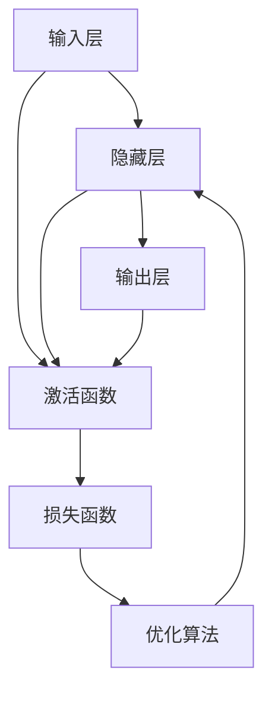

                 

**神经网络：人类与机器的共存**

**作者：禅与计算机程序设计艺术 / Zen and the Art of Computer Programming**

## 1. 背景介绍

在当今世界，人工智能（AI）已经渗透到我们的日常生活中，从搜索引擎到自动驾驶汽车，再到医疗诊断系统，AI无处不在。其中，神经网络（Neural Networks）是AI的核心组成部分，它模仿人类大脑的结构和功能，为机器学习和深度学习提供了基础。

本文将深入探讨神经网络的原理、算法、数学模型，并提供项目实践和实际应用场景。我们还将讨论神经网络的未来发展趋势和挑战，并提供学习资源和工具推荐。

## 2. 核心概念与联系

神经网络是一种模型，它试图模仿人类大脑的结构和功能。它由大量的神经元（或节点）组成，这些神经元通过权重连接在一起，权重决定了信息在网络中的流动。

以下是神经网络的核心概念和联系的Mermaid流程图：



## 3. 核心算法原理 & 具体操作步骤

### 3.1 算法原理概述

神经网络的核心算法是反向传播（Backpropagation），它用于训练神经网络。反向传播算法的目标是最小化网络的输出和真实值之间的误差。

### 3.2 算法步骤详解

1. **正向传播（Forward Propagation）：** 信息从输入层传递到输出层，每个神经元计算其输出值。
2. **计算误差：** 计算网络输出和真实值之间的误差。
3. **反向传播（Backward Propagation）：** 误差从输出层传递到输入层，更新每个神经元的权重。
4. **权重更新：** 使用梯度下降算法更新权重，以最小化误差。

### 3.3 算法优缺点

**优点：**

* 可以学习复杂的非线性函数。
* 可以自动学习特征，无需人工特征工程。

**缺点：**

* 训练过程需要大量的数据和计算资源。
* 易于过拟合和欠拟合。
* 缺乏解释性，难以理解网络的决策过程。

### 3.4 算法应用领域

神经网络在各种领域都有广泛的应用，包括图像识别，自然语言处理，医疗诊断，自动驾驶汽车等。

## 4. 数学模型和公式 & 详细讲解 & 举例说明

### 4.1 数学模型构建

神经网络的数学模型可以表示为：

$$y = f(wx + b)$$

其中，$x$是输入，$w$是权重，$b$是偏置，$f$是激活函数，$y$是输出。

### 4.2 公式推导过程

反向传播算法的数学基础是链式法则。给定一个函数$f(x)$，其导数可以表示为：

$$\frac{\partial f}{\partial x} = \frac{\partial f}{\partial z} \frac{\partial z}{\partial x}$$

其中，$z = wx + b$。

### 4.3 案例分析与讲解

例如，考虑一个简单的单层神经网络，用于预测房价。输入$x$是房屋的面积，输出$y$是房屋的价格。我们可以使用线性激活函数$f(z) = z$和均方误差损失函数$L = \frac{1}{2}(y - \hat{y})^2$。

## 5. 项目实践：代码实例和详细解释说明

### 5.1 开发环境搭建

我们将使用Python和TensorFlow框架来实现一个简单的神经网络。

### 5.2 源代码详细实现

```python
import tensorflow as tf
from tensorflow.keras.models import Sequential
from tensorflow.keras.layers import Dense

# 定义模型
model = Sequential()
model.add(Dense(1, input_dim=1, activation='linear'))

# 编译模型
model.compile(loss='mean_squared_error', optimizer='adam')

# 训练模型
model.fit(x_train, y_train, epochs=50, verbose=0)
```

### 5.3 代码解读与分析

我们定义了一个简单的线性回归模型，使用均方误差作为损失函数，并使用Adam优化器。我们使用`fit`方法训练模型。

### 5.4 运行结果展示

训练好的模型可以用于预测新数据的房价。

## 6. 实际应用场景

### 6.1 当前应用

神经网络在各种领域都有广泛的应用，包括图像识别，自然语言处理，医疗诊断，自动驾驶汽车等。

### 6.2 未来应用展望

未来，神经网络有望在更多领域得到应用，包括生物医学，金融，能源等。此外，神经网络也有望与其他人工智能技术结合，如强化学习和符号推理。

## 7. 工具和资源推荐

### 7.1 学习资源推荐

* Andrew Ng的机器学习课程（Coursera）
* Deep Learning Specialization（Coursera）
* Fast.ai的深度学习课程

### 7.2 开发工具推荐

* TensorFlow
* PyTorch
* Keras

### 7.3 相关论文推荐

* Rumelhart, D. E., Hinton, G. E., & Williams, R. J. (1986). Learning representations by back-propagating errors. Nature, 323(6088), 533-536.
* LeCun, Y., Bengio, Y., & Hinton, G. (2015). Deep learning. Nature, 521(7553), 436-444.

## 8. 总结：未来发展趋势与挑战

### 8.1 研究成果总结

神经网络已经取得了巨大的成功，并成为人工智能领域的核心组成部分。

### 8.2 未来发展趋势

未来，神经网络有望在更多领域得到应用，并与其他人工智能技术结合。此外，神经网络也有望得到进一步的改进，如使用更复杂的架构和激活函数。

### 8.3 面临的挑战

神经网络面临的挑战包括过拟合，欠拟合，缺乏解释性，以及训练过程需要大量的数据和计算资源。

### 8.4 研究展望

未来的研究方向包括改进神经网络的架构和训练算法，开发新的激活函数和优化器，以及研究神经网络的解释性。

## 9. 附录：常见问题与解答

**Q：神经网络是如何学习的？**

**A：**神经网络通过反向传播算法学习。它通过最小化网络输出和真实值之间的误差来更新权重。

**Q：神经网络的优点是什么？**

**A：**神经网络的优点包括可以学习复杂的非线性函数，可以自动学习特征，无需人工特征工程。

**Q：神经网络的缺点是什么？**

**A：**神经网络的缺点包括训练过程需要大量的数据和计算资源，易于过拟合和欠拟合，缺乏解释性，难以理解网络的决策过程。

**作者：禅与计算机程序设计艺术 / Zen and the Art of Computer Programming**

