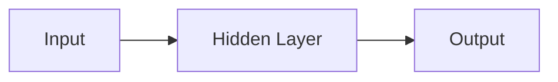

                 

## 1. 背景介绍

神经网络（Neural Network）是一种模拟人类大脑神经元网络的计算模型，是机器学习和深度学习的核心。自从1943年Warren McCulloch和Walter Pitts首次提出神经元模型以来，神经网络已经发展成为一个庞大而多样化的领域，在图像识别、自然语言处理、推荐系统等各种应用中取得了非凡的成功。

## 2. 核心概念与联系

### 2.1 关键概念

- **神经元（Neuron）**：神经网络的基本单位，模拟人类大脑中的神经元。
- **权重（Weight）**：神经元之间连接的强度，通过学习调整。
- **偏置（Bias）**：神经元的固有倾向，通过学习调整。
- **激活函数（Activation Function）**：用于引入非线性，输出神经元的值。
- **损失函数（Loss Function）**：衡量网络输出与真实值之间差异的函数。
- **优化算法（Optimization Algorithm）**：用于调整权重和偏置，以最小化损失函数。

### 2.2 架构

神经网络由输入层、隐藏层和输出层组成。数据通过输入层进入网络，在隐藏层进行处理，最后由输出层生成结果。下图是一个简单的神经网络架构示例：



## 3. 核心算法原理 & 具体操作步骤

### 3.1 算法原理概述

神经网络的学习过程包括两个主要阶段：前向传播和反向传播。

- **前向传播（Forward Propagation）**：数据从输入层传递到输出层，生成网络的输出。
- **反向传播（Backpropagation）**：计算梯度，更新权重和偏置。

### 3.2 算法步骤详解

1. **初始化权重和偏置**：随机初始化权重和偏置。
2. **前向传播**：计算每层的输出，直到输出层。
3. **计算损失**：使用损失函数计算网络输出与真实值之间的差异。
4. **反向传播**：计算梯度，更新权重和偏置。
5. **重复步骤2-4**：直到网络收敛，即损失函数的值小于阈值。

### 3.3 算法优缺点

**优点**：神经网络可以学习复杂的非线性关系，具有很强的泛化能力。

**缺点**：训练过程需要大量的数据和计算资源，易陷入局部最小值，存在过拟合问题。

### 3.4 算法应用领域

神经网络在图像识别、自然语言处理、推荐系统等领域取得了非凡的成功。例如，Convolutional Neural Networks（CNN）在图像识别任务中表现出色，Recurrent Neural Networks（RNN）和Long Short-Term Memory（LSTM）在处理序列数据时表现优异。

## 4. 数学模型和公式 & 详细讲解 & 举例说明

### 4.1 数学模型构建

神经网络的数学模型可以表示为：

$$y = f(wx + b)$$

其中，$x$是输入，$y$是输出，$w$是权重，$b$是偏置，$f$是激活函数。

### 4.2 公式推导过程

神经网络的学习过程可以使用梯度下降算法来最小化损失函数。梯度下降的公式为：

$$w := w - \eta \frac{\partial L}{\partial w}$$

$$b := b - \eta \frac{\partial L}{\partial b}$$

其中，$\eta$是学习率，$\frac{\partial L}{\partial w}$和$\frac{\partial L}{\partial b}$是梯度。

### 4.3 案例分析与讲解

例如，考虑一个简单的二层全连接神经网络，用于分类二维数据。输入层有2个神经元，隐藏层有3个神经元，输出层有1个神经元。假设激活函数为sigmoid，损失函数为均方误差。那么，权重和偏置的更新规则为：

$$w_{ij} := w_{ij} - \eta \frac{\partial L}{\partial w_{ij}}$$

$$b_{j} := b_{j} - \eta \frac{\partial L}{\partial b_{j}}$$

其中，

$$\frac{\partial L}{\partial w_{ij}} = (y - t) \cdot f'(z) \cdot x_i$$

$$\frac{\partial L}{\partial b_{j}} = (y - t) \cdot f'(z)$$

其中，$y$是网络输出，$t$是真实值，$z$是隐藏层的输出，$f'$是激活函数的导数。

## 5. 项目实践：代码实例和详细解释说明

### 5.1 开发环境搭建

本项目使用Python和TensorFlow框架。首先，安装必要的库：

```bash
pip install tensorflow numpy matplotlib
```

### 5.2 源代码详细实现

以下是一个简单的二层全连接神经网络的实现代码：

```python
import numpy as np
import tensorflow as tf
import matplotlib.pyplot as plt

# 定义激活函数
def sigmoid(x):
    return 1 / (1 + np.exp(-x))

def sigmoid_derivative(x):
    return x * (1 - x)

# 定义损失函数
def mean_squared_error(y_true, y_pred):
    return ((y_true - y_pred) ** 2).mean()

# 初始化权重和偏置
np.random.seed(0)
w1 = 2 * np.random.random((2, 3)) - 1
b1 = 2 * np.random.random((1, 3)) - 1
w2 = 2 * np.random.random((3, 1)) - 1
b2 = 2 * np.random.random((1, 1)) - 1

# 定义前向传播
def forward_propagate(x, w1, b1, w2, b2):
    z1 = np.dot(x, w1) + b1
    a1 = sigmoid(z1)
    z2 = np.dot(a1, w2) + b2
    y = sigmoid(z2)
    return y, a1

# 定义反向传播
def backward_propagate(x, y, a1, w1, b1, w2, b2):
    m = x.shape[0]

    dz2 = y - y_target
    dw2 = (1/m) * np.dot(a1.T, dz2)
    db2 = (1/m) * np.sum(dz2, axis=0, keepdims=True)

    da1 = np.dot(dz2, w2.T)
    dz1 = da1 * sigmoid_derivative(a1)
    dw1 = (1/m) * np.dot(x.T, dz1)
    db1 = (1/m) * np.sum(dz1, axis=0, keepdims=True)

    return dw1, db1, dw2, db2

# 定义训练过程
def train(x, y_target, w1, b1, w2, b2, learning_rate=0.1, num_iterations=10000):
    costs = []

    for i in range(num_iterations):
        y, a1 = forward_propagate(x, w1, b1, w2, b2)
        dw1, db1, dw2, db2 = backward_propagate(x, y, a1, w1, b1, w2, b2)
        w1 -= learning_rate * dw1
        b1 -= learning_rate * db1
        w2 -= learning_rate * dw2
        b2 -= learning_rate * db2

        if i % 1000 == 0:
            cost = mean_squared_error(y_target, y)
            costs.append(cost)

    return w1, b1, w2, b2, costs

# 生成数据
x = np.array([[0, 0], [0, 1], [1, 0], [1, 1]])
y_target = np.array([[0], [1], [1], [0]])

# 训练网络
w1, b1, w2, b2, costs = train(x, y_target, w1, b1, w2, b2)

# 绘制成本曲线
plt.plot(costs)
plt.xlabel('Iterations')
plt.ylabel('Cost')
plt.title('Cost over iterations')
plt.show()
```

### 5.3 代码解读与分析

代码首先定义了激活函数sigmoid和其导数，然后定义了损失函数均方误差。接着，初始化权重和偏置。然后，定义了前向传播和反向传播函数。训练过程使用梯度下降算法，每1000次迭代记录一次成本。最后，生成数据，训练网络，并绘制成本曲线。

### 5.4 运行结果展示

运行代码后，成本曲线会显示网络的收敛情况。随着迭代次数的增加，成本应该逐渐减小，直到网络收敛。

## 6. 实际应用场景

神经网络在各种领域都有广泛的应用。例如：

- **图像识别**：Convolutional Neural Networks（CNN）在图像识别任务中表现出色，被广泛应用于人脸识别、物体检测等领域。
- **自然语言处理**：Recurrent Neural Networks（RNN）和Long Short-Term Memory（LSTM）在处理序列数据时表现优异，被广泛应用于文本分类、机器翻译等领域。
- **推荐系统**：神经网络可以学习用户的偏好，为用户提供个性化推荐。

### 6.4 未来应用展望

未来，神经网络的应用将会更加广泛，例如在自动驾驶、医疗诊断等领域。此外，生成式对抗网络（GAN）等新的神经网络架构将会带来更多的创新应用。

## 7. 工具和资源推荐

### 7.1 学习资源推荐

- **书籍**："Deep Learning" by Ian Goodfellow, Yoshua Bengio, and Aaron Courville
- **在线课程**：Coursera的"Deep Learning Specialization"课程
- **博客**："Distill.pub"（<https://distill.pub/>）提供了大量深入浅出的神经网络教程

### 7.2 开发工具推荐

- **TensorFlow** (<https://www.tensorflow.org/>)：一个强大的开源机器学习库。
- **PyTorch** (<https://pytorch.org/>)：一个灵活的开源机器学习库。
- **Keras** (<https://keras.io/>)：一个高级神经网络API，可以在TensorFlow和Theano上运行。

### 7.3 相关论文推荐

- **LeCun, Y., Bengio, Y., & Hinton, G. (2015). Deep learning.** Nature, 521(7553), 436-444.
- **Goodfellow, I., Bengio, Y., & Courville, A. (2016). Deep learning.** MIT press.

## 8. 总结：未来发展趋势与挑战

### 8.1 研究成果总结

神经网络在各种领域取得了非凡的成功，推动了机器学习和人工智能的发展。

### 8.2 未来发展趋势

未来，神经网络的发展将会朝着更深、更广、更智能的方向前进。例如，更深的网络结构，更广泛的应用领域，更智能的学习算法。

### 8.3 面临的挑战

神经网络面临的挑战包括：

- **计算资源**：训练大型神经网络需要大量的计算资源。
- **数据量**：神经网络需要大量的数据进行训练。
- **解释性**：神经网络的决策过程通常是不透明的，很难解释。

### 8.4 研究展望

未来的研究方向包括：

- **更智能的学习算法**：例如，自适应学习率、更智能的正则化方法。
- **更广泛的应用领域**：例如，医疗诊断、自动驾驶。
- **更深的网络结构**：例如，更深的网络、更复杂的网络结构。

## 9. 附录：常见问题与解答

**Q：神经网络是如何学习的？**

A：神经网络通过梯度下降算法最小化损失函数来学习。梯度下降算法更新权重和偏置，使得网络输出更接近真实值。

**Q：神经网络的优点是什么？**

A：神经网络的优点包括可以学习复杂的非线性关系，具有很强的泛化能力。

**Q：神经网络的缺点是什么？**

A：神经网络的缺点包括需要大量的数据和计算资源，易陷入局部最小值，存在过拟合问题。

**Q：神经网络的应用领域有哪些？**

A：神经网络在图像识别、自然语言处理、推荐系统等领域取得了非凡的成功。

**Q：未来神经网络的发展趋势是什么？**

A：未来，神经网络的发展将会朝着更深、更广、更智能的方向前进。

---

作者：禅与计算机程序设计艺术 / Zen and the Art of Computer Programming

