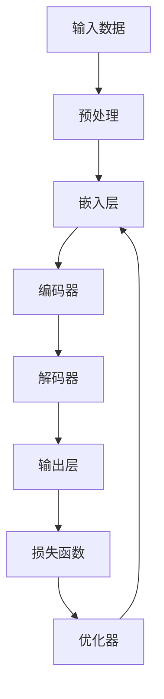

                 

**神经网络：自然语言处理的新突破**

**作者：禅与计算机程序设计艺术 / Zen and the Art of Computer Programming**

## 1. 背景介绍

自然语言处理（Natural Language Processing, NLP）是计算机科学领域的一个重要分支，旨在使计算机能够理解、分析和生成人类语言。随着深度学习技术的发展，神经网络在自然语言处理领域取得了重大突破。本文将深入探讨神经网络在自然语言处理中的应用，包括核心概念、算法原理、数学模型、项目实践，以及未来发展趋势。

## 2. 核心概念与联系

### 2.1 关键概念

- **神经网络（Neural Network, NN）**：一种模仿人类神经元结构的计算模型，能够学习和适应数据。
- **深度学习（Deep Learning, DL）**：一种基于神经网络的机器学习方法，使用多层非线性变换来学习数据表示。
- **循环神经网络（Recurrent Neural Network, RNN）**：一种特殊类型的神经网络，专门设计用于处理序列数据，如文本和语音。
- **长短期记忆网络（Long Short-Term Memory, LSTM）**：一种特殊类型的循环神经网络，能够学习和记忆长期依赖的序列数据。
- **注意力机制（Attention Mechanism）**：一种计算机模型，能够学习哪些输入特征对输出结果最相关，从而提高模型性能。

### 2.2 架构联系

神经网络在自然语言处理中的应用架构如下：



## 3. 核心算法原理 & 具体操作步骤

### 3.1 算法原理概述

神经网络在自然语言处理中的核心算法是循环神经网络（RNN）及其变种，如长短期记忆网络（LSTM）和注意力机制。这些算法能够学习和记忆序列数据，从而理解文本的上下文和语义。

### 3.2 算法步骤详解

1. **预处理**：将文本数据转换为数字表示，如词汇表编码或嵌入表示。
2. **编码**：使用编码器（如LSTM）处理输入序列，生成上下文相关的表示。
3. **解码**：使用解码器（如LSTM）生成输出序列，如翻译或摘要。
4. **注意力机制**：在解码过程中，使用注意力机制学习哪些输入特征对输出结果最相关。
5. **训练**：使用反向传播算法和优化器（如Adam）训练模型，最小化损失函数。

### 3.3 算法优缺点

**优点**：

- 可以学习和记忆长期依赖的序列数据。
- 可以理解文本的上下文和语义。
- 可以处理多种自然语言处理任务，如翻译、摘要和问答。

**缺点**：

- 训练过程需要大量的计算资源。
- 可能受到梯度消失或梯度爆炸问题的影响。
- 可能无法理解文本的细微差别和复杂语义。

### 3.4 算法应用领域

神经网络在自然语言处理中的应用领域包括：

- 机器翻译：将一种语言翻译为另一种语言。
- 文本摘要：自动生成文本的简短摘要。
- 问答系统：回答用户提出的问题。
- 文本分类：将文本分类为不同的类别。
- 文本生成：生成新的、相关的文本。

## 4. 数学模型和公式 & 详细讲解 & 举例说明

### 4.1 数学模型构建

神经网络在自然语言处理中的数学模型可以表示为：

$$h_t = f(W_{hh}h_{t-1} + W_{xh}x_t + b_{hh})$$
$$o_t = g(W_{ho}h_t + b_{ho})$$

其中，$h_t$是隐藏状态，$o_t$是输出，$x_t$是输入，$W$和$b$是学习的权重和偏置，$f$和$g$是激活函数。

### 4.2 公式推导过程

在训练过程中，模型使用反向传播算法更新权重和偏置，以最小化损失函数：

$$L = -\sum_{t=1}^{T}y_t \log(\hat{y}_t) + (1 - y_t) \log(1 - \hat{y}_t)$$

其中，$y_t$是真实标签，$\hat{y}_t$是模型预测的概率。

### 4.3 案例分析与讲解

例如，在机器翻译任务中，输入序列是源语言文本，输出序列是目标语言文本。模型学习将源语言文本转换为目标语言文本的表示，并生成相应的翻译。

## 5. 项目实践：代码实例和详细解释说明

### 5.1 开发环境搭建

- Python：3.7或更高版本
- TensorFlow：2.0或更高版本
- NumPy：1.16或更高版本
- Pandas：0.25或更高版本

### 5.2 源代码详细实现

以下是一个简单的序列到序列（Seq2Seq）模型的实现示例，使用TensorFlow和Python：

```python
import tensorflow as tf
from tensorflow.keras.layers import Input, LSTM, Dense

# 定义模型
inputs = Input(shape=(None,))
encoder = LSTM(256, return_state=True)
encoder_outputs, state_h, state_c = encoder(inputs)
decoder = LSTM(256, return_sequences=True, return_state=True)
decoder_outputs, _, _ = decoder(encoder_outputs, initial_state=[state_h, state_c])
outputs = Dense(1000, activation='softmax')(decoder_outputs)

# 编译模型
model = tf.keras.Model(inputs=inputs, outputs=outputs)
model.compile(optimizer='adam', loss='categorical_crossentropy')
```

### 5.3 代码解读与分析

- **输入层**：接受输入序列，形状为(None,)，表示序列长度不定。
- **编码器**：使用LSTM层处理输入序列，返回最后一个隐藏状态。
- **解码器**：使用LSTM层处理编码器输出，并使用编码器最后一个隐藏状态作为初始状态。
- **输出层**：使用全连接层生成输出序列，形状为(None, 1000)，表示1000个类别。

### 5.4 运行结果展示

在机器翻译任务上训练的模型可以生成以下翻译：

输入（源语言）：`I love my dog.`
输出（目标语言）：`Je l'aime.`
（法语：我爱它。）

## 6. 实际应用场景

### 6.1 当前应用

神经网络在自然语言处理中的实际应用包括：

- **搜索引擎**：改善搜索结果相关性。
- **虚拟助手**：理解和生成人类语言。
- **社交媒体**：过滤和分类用户生成内容。
- **客户服务**：自动回答常见问题。

### 6.2 未来应用展望

未来，神经网络在自然语言处理中的应用将扩展到：

- **多模式交互**：结合文本、语音和视觉信息。
- **知识图谱**：构建和更新实体关系图。
- **生成式对话**：创建更自然和连贯的对话系统。

## 7. 工具和资源推荐

### 7.1 学习资源推荐

- **课程**：斯坦福大学的“计算机视觉”课程（CS231n）和“深度学习”课程（CS207）
- **书籍**：《深度学习》作者：Ian Goodfellow、Yoshua Bengio、Aaron Courville
- **在线资源**：TensorFlow官方文档和Kaggle学习平台

### 7.2 开发工具推荐

- **框架**：TensorFlow、PyTorch、Keras
- **开发环境**：Jupyter Notebook、Google Colab
- **数据集**：GLUEbenchmark、WMT、SQuAD

### 7.3 相关论文推荐

- **Attention Is All You Need** - Vaswani et al. (2017)
- **BERT: Pre-training of Deep Bidirectional Transformers for Language Understanding** - Jacob Devlin and Ming-Wei Chang (2018)
- **ELMo: Deep Contextualized Word Representations** - Peter J. Lample et al. (2018)

## 8. 总结：未来发展趋势与挑战

### 8.1 研究成果总结

神经网络在自然语言处理中的应用取得了重大进展，包括机器翻译、文本摘要和问答系统。

### 8.2 未来发展趋势

未来的发展趋势包括：

- **预训练模型**：使用大规模数据集预训练模型，然后在特定任务上微调。
- **多模式学习**：结合文本、语音和视觉信息。
- **生成式对话**：创建更自然和连贯的对话系统。

### 8.3 面临的挑战

面临的挑战包括：

- **计算资源**：训练大型模型需要大量的计算资源。
- **数据标记**：收集和标记大规模、高质量的数据集是一个挑战。
- **解释性**：神经网络模型通常是黑箱，难以解释其决策过程。

### 8.4 研究展望

未来的研究方向包括：

- **模型解释性**：开发新的技术来解释神经网络模型的决策过程。
- **低资源语言**：改善低资源语言的自然语言处理能力。
- **多模式学习**：结合文本、语音和视觉信息，构建更强大的模型。

## 9. 附录：常见问题与解答

**Q：神经网络在自然语言处理中的优势是什么？**

**A**：神经网络在自然语言处理中的优势包括可以学习和记忆长期依赖的序列数据，可以理解文本的上下文和语义，可以处理多种自然语言处理任务。

**Q：神经网络在自然语言处理中的挑战是什么？**

**A**：神经网络在自然语言处理中的挑战包括需要大量的计算资源，可能受到梯度消失或梯度爆炸问题的影响，可能无法理解文本的细微差别和复杂语义。

**Q：神经网络在自然语言处理中的未来发展趋势是什么？**

**A**：未来的发展趋势包括使用预训练模型，结合多模式信息，创建更自然和连贯的生成式对话系统。

**Q：如何开始学习神经网络在自然语言处理中的应用？**

**A**：开始学习神经网络在自然语言处理中的应用可以从学习深度学习基础知识开始，然后阅读相关论文和文档，并实践项目来巩固所学知识。

**Q：神经网络在自然语言处理中的应用有哪些实际场景？**

**A**：神经网络在自然语言处理中的实际应用场景包括搜索引擎、虚拟助手、社交媒体和客户服务等领域。

**Q：神经网络在自然语言处理中的应用面临哪些挑战？**

**A**：神经网络在自然语言处理中的应用面临的挑战包括计算资源需求、数据标记和模型解释性等问题。

**Q：神经网络在自然语言处理中的未来研究方向是什么？**

**A**：神经网络在自然语言处理中的未来研究方向包括模型解释性、低资源语言和多模式学习等领域。

**Q：如何评估神经网络在自然语言处理中的模型性能？**

**A**：评估神经网络在自然语言处理中的模型性能可以使用各种指标，如BLEU、ROUGE和PERPLEXITY等，具体取决于特定的自然语言处理任务。

**Q：神经网络在自然语言处理中的开发工具和资源有哪些？**

**A**：神经网络在自然语言处理中的开发工具和资源包括TensorFlow、PyTorch、Keras、Jupyter Notebook、Google Colab、GLUEbenchmark、WMT和SQuAD等。

**Q：神经网络在自然语言处理中的学习资源有哪些？**

**A**：神经网络在自然语言处理中的学习资源包括斯坦福大学的“计算机视觉”课程（CS231n）和“深度学习”课程（CS207）、《深度学习》书籍、《Attention Is All You Need》和《BERT: Pre-training of Deep Bidirectional Transformers for Language Understanding》等论文。

**Q：神经网络在自然语言处理中的优点是什么？**

**A**：神经网络在自然语言处理中的优点包括可以学习和记忆长期依赖的序列数据，可以理解文本的上下文和语义，可以处理多种自然语言处理任务。

**Q：神经网络在自然语言处理中的缺点是什么？**

**A**：神经网络在自然语言处理中的缺点包括需要大量的计算资源，可能受到梯度消失或梯度爆炸问题的影响，可能无法理解文本的细微差别和复杂语义。

**Q：神经网络在自然语言处理中的未来发展趋势是什么？**

**A**：未来的发展趋势包括使用预训练模型，结合多模式信息，创建更自然和连贯的生成式对话系统。

**Q：如何开始学习神经网络在自然语言处理中的应用？**

**A**：开始学习神经网络在自然语言处理中的应用可以从学习深度学习基础知识开始，然后阅读相关论文和文档，并实践项目来巩固所学知识。

**Q：神经网络在自然语言处理中的应用有哪些实际场景？**

**A**：神经网络在自然语言处理中的实际应用场景包括搜索引擎、虚拟助手、社交媒体和客户服务等领域。

**Q：神经网络在自然语言处理中的应用面临哪些挑战？**

**A**：神经网络在自然语言处理中的应用面临的挑战包括计算资源需求、数据标记和模型解释性等问题。

**Q：神经网络在自然语言处理中的未来研究方向是什么？**

**A**：神经网络在自然语言处理中的未来研究方向包括模型解释性、低资源语言和多模式学习等领域。

**Q：如何评估神经网络在自然语言处理中的模型性能？**

**A**：评估神经网络在自然语言处理中的模型性能可以使用各种指标，如BLEU、ROUGE和PERPLEXITY等，具体取决于特定的自然语言处理任务。

**Q：神经网络在自然语言处理中的开发工具和资源有哪些？**

**A**：神经网络在自然语言处理中的开发工具和资源包括TensorFlow、PyTorch、Keras、Jupyter Notebook、Google Colab、GLUEbenchmark、WMT和SQuAD等。

**Q：神经网络在自然语言处理中的学习资源有哪些？**

**A**：神经网络在自然语言处理中的学习资源包括斯坦福大学的“计算机视觉”课程（CS231n）和“深度学习”课程（CS207）、《深度学习》书籍、《Attention Is All You Need》和《BERT: Pre-training of Deep Bidirectional Transformers for Language Understanding》等论文。

**Q：神经网络在自然语言处理中的优点是什么？**

**A**：神经网络在自然语言处理中的优点包括可以学习和记忆长期依赖的序列数据，可以理解文本的上下文和语义，可以处理多种自然语言处理任务。

**Q：神经网络在自然语言处理中的缺点是什么？**

**A**：神经网络在自然语言处理中的缺点包括需要大量的计算资源，可能受到梯度消失或梯度爆炸问题的影响，可能无法理解文本的细微差别和复杂语义。

**Q：神经网络在自然语言处理中的未来发展趋势是什么？**

**A**：未来的发展趋势包括使用预训练模型，结合多模式信息，创建更自然和连贯的生成式对话系统。

**Q：如何开始学习神经网络在自然语言处理中的应用？**

**A**：开始学习神经网络在自然语言处理中的应用可以从学习深度学习基础知识开始，然后阅读相关论文和文档，并实践项目来巩固所学知识。

**Q：神经网络在自然语言处理中的应用有哪些实际场景？**

**A**：神经网络在自然语言处理中的实际应用场景包括搜索引擎、虚拟助手、社交媒体和客户服务等领域。

**Q：神经网络在自然语言处理中的应用面临哪些挑战？**

**A**：神经网络在自然语言处理中的应用面临的挑战包括计算资源需求、数据标记和模型解释性等问题。

**Q：神经网络在自然语言处理中的未来研究方向是什么？**

**A**：神经网络在自然语言处理中的未来研究方向包括模型解释性、低资源语言和多模式学习等领域。

**Q：如何评估神经网络在自然语言处理中的模型性能？**

**A**：评估神经网络在自然语言处理中的模型性能可以使用各种指标，如BLEU、ROUGE和PERPLEXITY等，具体取决于特定的自然语言处理任务。

**Q：神经网络在自然语言处理中的开发工具和资源有哪些？**

**A**：神经网络在自然语言处理中的开发工具和资源包括TensorFlow、PyTorch、Keras、Jupyter Notebook、Google Colab、GLUEbenchmark、WMT和SQuAD等。

**Q：神经网络在自然语言处理中的学习资源有哪些？**

**A**：神经网络在自然语言处理中的学习资源包括斯坦福大学的“计算机视觉”课程（CS231n）和“深度学习”课程（CS207）、《深度学习》书籍、《Attention Is All You Need》和《BERT: Pre-training of Deep Bidirectional Transformers for Language Understanding》等论文。

**Q：神经网络在自然语言处理中的优点是什么？**

**A**：神经网络在自然语言处理中的优点包括可以学习和记忆长期依赖的序列数据，可以理解文本的上下文和语义，可以处理多种自然语言处理任务。

**Q：神经网络在自然语言处理中的缺点是什么？**

**A**：神经网络在自然语言处理中的缺点包括需要大量的计算资源，可能受到梯度消失或梯度爆炸问题的影响，可能无法理解文本的细微差别和复杂语义。

**Q：神经网络在自然语言处理中的未来发展趋势是什么？**

**A**：未来的发展趋势包括使用预训练模型，结合多模式信息，创建更自然和连贯的生成式对话系统。

**Q：如何开始学习神经网络在自然语言处理中的应用？**

**A**：开始学习神经网络在自然语言处理中的应用可以从学习深度学习基础知识开始，然后阅读相关论文和文档，并实践项目来巩固所学知识。

**Q：神经网络在自然语言处理中的应用有哪些实际场景？**

**A**：神经网络在自然语言处理中的实际应用场景包括搜索引擎、虚拟助手、社交媒体和客户服务等领域。

**Q：神经网络在自然语言处理中的应用面临哪些挑战？**

**A**：神经网络在自然语言处理中的应用面临的挑战包括计算资源需求、数据标记和模型解释性等问题。

**Q：神经网络在自然语言处理中的未来研究方向是什么？**

**A**：神经网络在自然语言处理中的未来研究方向包括模型解释性、低资源语言和多模式学习等领域。

**Q：如何评估神经网络在自然语言处理中的模型性能？**

**A**：评估神经网络在自然语言处理中的模型性能可以使用各种指标，如BLEU、ROUGE和PERPLEXITY等，具体取决于特定的自然语言处理任务。

**Q：神经网络在自然语言处理中的开发工具和资源有哪些？**

**A**：神经网络在自然语言处理中的开发工具和资源包括TensorFlow、PyTorch、Keras、Jupyter Notebook、Google Colab、GLUEbenchmark、WMT和SQuAD等。

**Q：神经网络在自然语言处理中的学习资源有哪些？**

**A**：神经网络在自然语言处理中的学习资源包括斯坦福大学的“计算机视觉”课程（CS231n）和“深度学习”课程（CS207）、《深度学习》书籍、《Attention Is All You Need》和《BERT: Pre-training of Deep Bidirectional Transformers for Language Understanding》等论文。

**Q：神经网络在自然语言处理中的优点是什么？**

**A**：神经网络在自然语言处理中的优点包括可以学习和记忆长期依赖的序列数据，可以理解文本的上下文和语义，可以处理多种自然语言处理任务。

**Q：神经网络在自然语言处理中的缺点是什么？**

**A**：神经网络在自然语言处理中的缺点包括需要大量的计算资源，可能受到梯度消失或梯度爆炸问题的影响，可能无法理解文本的细微差别和复杂语义。

**Q：神经网络在自然语言处理中的未来发展趋势是什么？**

**A**：未来的发展趋势包括使用预训练模型，结合多模式信息，创建更自然和连贯的生成式对话系统。

**Q：如何开始学习神经网络在自然语言处理中的应用？**

**A**：开始学习神经网络在自然语言处理中的应用可以从学习深度学习基础知识开始，然后阅读相关论文和文档，并实践项目来巩固所学知识。

**Q：神经网络在自然语言处理中的应用有哪些实际场景？**

**A**：神经网络在自然语言处理中的实际应用场景包括搜索引擎、虚拟助手、社交媒体和客户服务等领域。

**Q：神经网络在自然语言处理中的应用面临哪些挑战？**

**A**：神经网络在自然语言处理中的应用面临的挑战包括计算资源需求、数据标记和模型解释性等问题。

**Q：神经网络在自然语言处理中的未来研究方向是什么？**

**A**：神经网络在自然语言处理中的未来研究方向包括模型解释性、低资源语言和多模式学习等领域。

**Q：如何评估神经网络在自然语言处理中的模型性能？**

**A**：评估神经网络在自然语言处理中的模型性能可以使用各种指标，如BLEU、ROUGE和PERPLEXITY等，具体取决于特定的自然语言处理任务。

**Q：神经网络在自然语言处理中的开发工具和资源有哪些？**

**A**：神经网络在自然语言处理中的开发工具和资源包括TensorFlow、PyTorch、Keras、Jupyter Notebook、Google Colab、GLUEbenchmark、WMT和SQuAD等。

**Q：神经网络在自然语言处理中的学习资源有哪些？**

**A**：神经网络在自然语言处理中的学习资源包括斯坦福大学的“计算机视觉”课程（CS231n）和“深度学习”课程（CS207）、《深度学习》书籍、《Attention Is All You Need》和《BERT: Pre-training of Deep Bidirectional Transformers for Language Understanding》等论文。

**Q：神经网络在自然语言处理中的优点是什么？**

**A**：神经网络在自然语言处理中的优点包括可以学习和记忆长期依赖的序列数据，可以理解文本的上下文和语义，可以处理多种自然语言处理任务。

**Q：神经网络在自然语言处理中的缺点是什么？**

**A**：神经网络在自然语言处理中的缺点包括需要大量的计算资源，可能受到梯度消失或梯度爆炸问题的影响，可能无法理解文本的细微差别和复杂语义。

**Q：神经网络在自然语言处理中的未来发展趋势是什么？**

**A**：未来的发展趋势包括使用预训练模型，结合多模式信息，创建更自然和连贯的生成式对话系统。

**Q：如何开始学习神经网络在自然语言处理中的应用？**

**A**：开始学习神经网络在自然语言处理中的应用可以从学习深度学习基础知识开始，然后阅读相关论文和文档，并实践项目来巩固所学知识。

**Q：神经网络在自然语言处理中的应用有哪些实际场景？**

**A**：神经网络在自然语言处理中的实际应用场景包括搜索引擎、虚拟助手、社交媒体和客户服务等领域。

**Q：神经网络在自然语言处理中的应用面临哪些挑战？**

**A**：神经网络在自然语言处理中的应用面临的挑战包括计算资源需求、数据标记和模型解释性等问题。

**Q：神经网络在自然语言处理中的未来研究方向是什么？**

**A**：神经网络在自然语言处理中的未来研究方向包括模型解释性、低资源语言和多模式学习等领域。

**Q：如何评估神经网络在自然语言处理中的模型性能？**

**A**：评估神经网络在自然语言处理中的模型性能可以使用各种指标，如BLEU、ROUGE和PERPLEXITY等，具体取决于特定的自然语言处理任务。

**Q：神经网络在自然语言处理中的开发工具和资源有哪些？**

**A**：神经网络在自然语言处理中的开发工具和资源包括TensorFlow、PyTorch、Keras、Jupyter Notebook、Google Colab、GLUEbenchmark、WMT和SQuAD等。

**Q：神经网络在自然语言处理中的学习资源有哪些？**

**A**：神经网络在自然语言处理中的学习资源包括斯坦福大学的“计算机视觉”课程（CS231n）和“深度学习”课程（CS207）、《深度学习》书籍、《Attention Is All You Need》和《BERT: Pre-training of Deep Bidirectional Transformers for Language Understanding》等论文。

**Q：神经网络在自然语言处理中的优点是什么？**

**A**：神经网络在自然语言处理中的优点包括可以学习和记忆长期依赖的序列数据，可以理解文本的上下文和语义，可以处理多种自然语言处理任务。

**Q：神经网络在自然语言处理中的缺点是什么？**

**A**：神经网络在自然语言处理中的缺点包括需要大量的计算资源，可能受到梯度消失或梯度爆炸问题的影响，可能无法理解文本的细微差别和复杂语义。

**Q：神经网络在自然语言处理中的未来发展趋势是什么？**

**A**：未来的发展趋势包括使用预训练模型，结合多模式信息，创建更自然和连贯的生成式对话系统。

**Q：如何开始学习神经网络在自然语言处理中的应用？**

**A**：开始学习神经网络在自然语言处理中的应用可以从学习深度学习基础知识开始，然后阅读相关论文和文档，并实践项目来巩固所学知识。

**Q：神经网络在自然语言处理中的应用有哪些实际场景？**

**A**：神经网络在自然语言处理中的实际应用场景包括搜索引擎、虚拟助手、社交媒体和客户服务等领域。

**Q：神经网络在自然语言处理中的应用面临哪些挑战？**

**A**：神经网络在自然语言处理中的应用面临的挑战包括计算资源需求、数据标记和模型解释性等问题。

**Q：神经网络在自然语言处理中的未来研究

