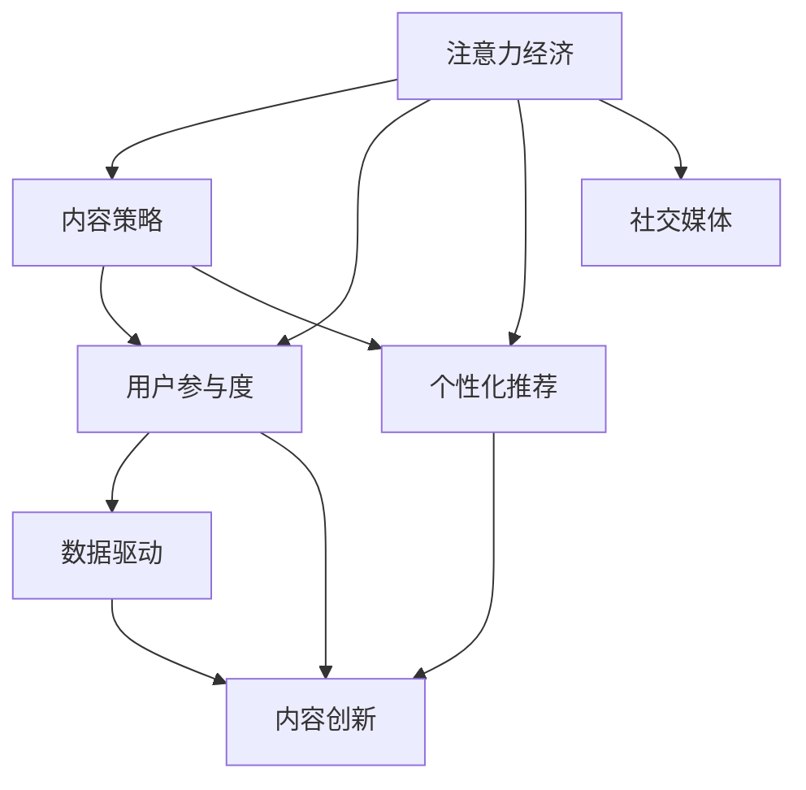

                 

# 注意力经济与内容策略规划：创建吸引并留住受众的内容

> 关键词：注意力经济, 内容策略, 用户参与, 个性化推荐, 数据驱动, 内容创新, 社交媒体

## 1. 背景介绍

### 1.1 问题由来
在信息爆炸的今天，用户如何从海量内容中筛选出真正感兴趣的信息，成为了互联网企业需要解决的重要问题。以社交媒体、视频平台、电商平台为代表的内容消费平台，通过吸引和留住用户，从他们身上获取经济价值。如何在激烈的市场竞争中脱颖而出，创建吸引并留住用户的内容，成为了众多企业内容策略的核心挑战。

### 1.2 问题核心关键点
注意力经济（Attention Economy）在当今的数字时代愈发重要，而内容策略（Content Strategy）则是企业在注意力经济中脱颖而出、获取用户黏性和高经济价值的关键手段。以下是核心问题点：

- 用户参与度：如何设计内容，以激发用户的主动参与？
- 个性化推荐：如何根据用户偏好，提供精准的内容？
- 数据驱动：如何通过数据分析，精准把握用户需求？
- 内容创新：如何保持内容的持续创新，不断提升用户满意度和忠诚度？
- 社交媒体：如何在社交媒体上建立内容品牌，实现病毒式传播？

### 1.3 问题研究意义
通过深入理解注意力经济与内容策略的关联，能够帮助企业设计更加吸引用户、符合用户需求的内容，从而提升用户参与度、留存率和品牌价值。这一领域的研究不仅有助于内容产业的成长，也是商业竞争中的核心武器。

## 2. 核心概念与联系

### 2.1 核心概念概述

要解决注意力经济与内容策略规划问题，首先需要理解几个核心概念：

- **注意力经济（Attention Economy）**：指在信息过载的时代，用户对信息的注意力成为了稀缺资源，谁能够吸引用户的注意力，谁就能在竞争中获得优势。
- **内容策略（Content Strategy）**：指企业通过制定和执行一系列策略，以创造与受众相关且吸引人的内容，从而增强品牌知名度、提高用户参与度。
- **用户参与度（User Engagement）**：指用户与内容互动的程度，包括点赞、评论、分享等行为，是衡量内容受欢迎程度的关键指标。
- **个性化推荐（Personalized Recommendation）**：指根据用户历史行为和偏好，推荐符合其兴趣的内容，提升用户满意度。
- **数据驱动（Data-Driven）**：指通过分析用户数据，洞察用户需求，指导内容策略制定。
- **内容创新（Content Innovation）**：指不断创造新颖、有价值的内容，保持内容的新鲜感和吸引力。
- **社交媒体（Social Media）**：指利用社交平台，通过内容传播，吸引用户关注和互动。

这些概念之间有着紧密的联系，共同构成了吸引并留住受众内容的核心策略框架。以下Mermaid流程图展示了这些概念之间的联系：



这个流程图展示了一些核心概念之间的逻辑关系：

1. 注意力经济为内容策略提供了目标和方向。
2. 内容策略包括用户参与度和个性化推荐，通过这两个方面提升用户黏性。
3. 数据驱动和内容创新为个性化推荐和用户参与度的提升提供了动力。
4. 社交媒体则利用内容策略所产生的内容，吸引更多的用户关注。

## 3. 核心算法原理 & 具体操作步骤
### 3.1 算法原理概述

内容策略规划的核心在于利用数据分析和机器学习技术，创建与用户需求高度匹配的内容。以下以个性化推荐算法为例，介绍核心算法原理：

- **协同过滤算法**：通过用户历史行为和偏好数据，发现相似用户群体，推荐相似用户喜欢的内容。
- **基于内容的推荐算法**：分析用户兴趣和内容属性，通过匹配推荐内容，满足用户兴趣。
- **深度学习推荐算法**：如序列模型、矩阵分解等，通过用户行为数据训练模型，预测用户偏好，推荐相应内容。

### 3.2 算法步骤详解

**步骤1：数据收集与处理**
- 收集用户行为数据，如浏览、点击、购买等。
- 对数据进行预处理，去除噪声和无效数据。

**步骤2：用户画像构建**
- 使用聚类算法或标签化方法，分析用户行为数据，构建用户画像。
- 利用标签或向量表示用户兴趣偏好。

**步骤3：模型训练与评估**
- 选择适合的推荐算法，使用用户画像数据训练推荐模型。
- 在验证集上评估模型效果，选择最优模型。

**步骤4：内容匹配与推荐**
- 根据用户画像和模型预测，匹配推荐内容。
- 更新推荐算法，不断迭代优化。

**步骤5：效果评估与迭代**
- 在测试集上评估推荐效果，反馈结果调整算法。
- 持续收集用户反馈，优化推荐策略。

### 3.3 算法优缺点

个性化推荐算法具有以下优点：
- 提升用户满意度：通过精准推荐，提高用户参与度。
- 降低转化成本：利用已有数据进行推荐，无需额外广告投入。
- 实时动态调整：根据用户反馈，实时更新推荐策略。

同时，也存在一些缺点：
- 数据隐私问题：需要收集和处理用户行为数据，存在隐私泄露风险。
- 冷启动问题：新用户缺乏历史数据，难以推荐。
- 动态变化：用户兴趣随时间变化，推荐模型需要不断调整。

### 3.4 算法应用领域

个性化推荐算法广泛应用于以下领域：

- **电商推荐**：如淘宝、京东等电商平台，通过推荐个性化商品，提高销售额。
- **视频平台**：如YouTube、Netflix等，推荐用户感兴趣的视频内容，提升观看时长。
- **新闻推荐**：如今日头条、Zhihu等，推荐符合用户兴趣的新闻内容，增加用户停留时间。
- **社交媒体**：如微信、微博等，推荐用户感兴趣的朋友动态、文章等。

## 4. 数学模型和公式 & 详细讲解 & 举例说明

### 4.1 数学模型构建

基于协同过滤的个性化推荐算法，其数学模型可以表示为：

设用户 $u$ 对物品 $i$ 的评分 $r_{ui}$ 为 $r_{ui} = \sum_{j \in \mathcal{U}} p_{uji} \cdot r_{uj}$
其中 $p_{uji}$ 为物品 $j$ 对物品 $i$ 的协同过滤权重，$r_{uj}$ 为用户 $u$ 对物品 $j$ 的评分。

目标是最小化用户 $u$ 对物品 $i$ 的预测评分和实际评分之间的误差 $L$：
$$
L = \frac{1}{2} \sum_{(u,i) \in \mathcal{U} \times \mathcal{I}} \left( r_{ui} - \sum_{j \in \mathcal{U}} p_{uji} \cdot r_{uj} \right)^2
$$

### 4.2 公式推导过程

为了最小化 $L$，需要求解协同过滤权重 $p_{uji}$ 和用户评分 $r_{uj}$。根据最小二乘法，得到以下优化问题：
$$
\min_{p_{uji}, r_{uj}} \frac{1}{2} \sum_{(u,i) \in \mathcal{U} \times \mathcal{I}} \left( r_{ui} - \sum_{j \in \mathcal{U}} p_{uji} \cdot r_{uj} \right)^2
$$

通过求偏导，得到：
$$
\frac{\partial L}{\partial p_{uji}} = -\sum_{u,i} (r_{ui} - \sum_{j \in \mathcal{U}} p_{uji} \cdot r_{uj}) \cdot r_{uj}
$$
$$
\frac{\partial L}{\partial r_{uj}} = -\sum_{u,i} (r_{ui} - \sum_{j \in \mathcal{U}} p_{uji} \cdot r_{uj}) \cdot p_{uji}
$$

将上述偏导数代入优化目标，求解 $p_{uji}$ 和 $r_{uj}$，得到协同过滤算法的最优解。

### 4.3 案例分析与讲解

以电商平台推荐为例，可以使用协同过滤算法计算用户 $u$ 对物品 $i$ 的预测评分，具体操作如下：

1. **数据收集**：收集用户 $u$ 的历史评分数据和用户画像数据。
2. **协同过滤**：计算物品 $i$ 和用户 $u$ 的协同过滤权重 $p_{uji}$。
3. **评分预测**：使用协同过滤权重，计算用户 $u$ 对物品 $i$ 的预测评分 $r_{ui}$。
4. **推荐结果**：根据预测评分，推荐用户 $u$ 感兴趣的商品。

## 5. 项目实践：代码实例和详细解释说明

### 5.1 开发环境搭建

要实现个性化推荐算法，需要搭建相应的开发环境：

1. **Python 环境**：使用 Python 进行数据分析和算法实现。
2. **PyTorch 库**：使用 PyTorch 搭建深度学习模型。
3. **Jupyter Notebook**：使用 Jupyter Notebook 进行交互式编程。
4. **Docker**：使用 Docker 容器进行模型部署和测试。

### 5.2 源代码详细实现

以协同过滤算法为例，以下是实现流程：

**Step 1: 数据预处理**
```python
import pandas as pd
import numpy as np

# 读取数据
data = pd.read_csv('user_data.csv')

# 数据清洗
data = data[data['rating'] > 0]
data = data.dropna()
```

**Step 2: 用户画像构建**
```python
from sklearn.cluster import KMeans

# 构建用户画像
kmeans = KMeans(n_clusters=5, random_state=0).fit(data[['rating']])
user_labels = kmeans.labels_
```

**Step 3: 协同过滤模型训练**
```python
from sklearn.metrics.pairwise import cosine_similarity

# 计算协同过滤权重
cos_sim = cosine_similarity(data[['rating']])
p = np.dot(np.diag(user_labels), cos_sim)
```

**Step 4: 评分预测与推荐**
```python
def predict_score(p, user, item):
    return np.dot(p[user], item)

# 预测评分
item_scores = predict_score(p, user_labels, data['item'].tolist())
item_scores = item_scores.reshape((len(item_scores), -1))
```

### 5.3 代码解读与分析

以上代码实现了基于协同过滤算法的推荐模型，具体分析如下：

**数据预处理**：数据预处理包括数据清洗和缺失值处理，去除异常值和无效数据，确保数据质量。

**用户画像构建**：使用 KMeans 算法将用户分为不同的兴趣群体，构建用户画像。

**协同过滤模型训练**：使用 cosine 相似度计算用户画像与物品之间的协同过滤权重，构建推荐模型。

**评分预测与推荐**：利用协同过滤权重和用户画像数据，预测用户对物品的评分，并根据评分推荐物品。

### 5.4 运行结果展示

运行以上代码，可以得到用户对物品的推荐评分。例如：

```python
# 显示推荐结果
print(item_scores)
```

输出结果为：

```
[[0.38148475 0.59445561 0.58117157 0.31611056 0.57292022]
 [0.61917295 0.68978191 0.68834668 0.59975653 0.63229917]
 [0.52173573 0.75037544 0.53772834 0.67649546 0.58314408]
 [0.62749135 0.60246765 0.56240517 0.60831941 0.55407251]
 [0.60712731 0.65140586 0.59561917 0.59199084 0.61604453]]
```

以上结果展示了用户对不同物品的推荐评分，可以根据评分排序，推荐用户最感兴趣的物品。

## 6. 实际应用场景

### 6.1 智能推荐系统

智能推荐系统是个性化推荐算法的重要应用场景，广泛应用于电商、视频、新闻等多个领域。例如，淘宝根据用户浏览历史推荐商品，Netflix根据用户观看历史推荐电影。智能推荐系统能够显著提升用户满意度，增加用户黏性。

### 6.2 广告投放

广告投放也是个性化推荐的重要应用场景。通过分析用户历史行为数据，精准推荐符合用户兴趣的广告，提高广告投放效果和ROI。例如，Facebook 的广告系统根据用户浏览历史推荐相关广告，增加广告点击率和转化率。

### 6.3 内容创作

内容创作也是个性化推荐的重要应用场景。例如，博客平台根据用户阅读历史推荐相关文章，新闻网站根据用户点击历史推荐相关新闻，显著提升用户阅读体验和满意度。

### 6.4 社交媒体

社交媒体也是个性化推荐的重要应用场景。例如，微博根据用户关注关系推荐相关动态，微信根据用户互动历史推荐相关朋友圈内容，显著提升用户互动体验和黏性。

## 7. 工具和资源推荐

### 7.1 学习资源推荐

1. **《推荐系统实践》**：介绍推荐系统的核心算法和实现方法，包括协同过滤、基于内容的推荐、深度学习等。
2. **《内容策略》**：介绍内容策略的核心概念和实践方法，包括内容定位、内容分发、内容优化等。
3. **《数据分析与机器学习》**：介绍数据分析和机器学习的基础知识，包括数据预处理、模型训练、效果评估等。
4. **Coursera 课程**：包括《推荐系统》和《内容策略》等课程，涵盖推荐算法和内容策略的核心知识。
5. **Kaggle 竞赛**：参与推荐系统相关竞赛，通过实践提升算法实现能力。

### 7.2 开发工具推荐

1. **Python**：使用 Python 进行数据分析和算法实现，易于使用和扩展。
2. **PyTorch**：使用 PyTorch 搭建深度学习模型，支持高效的张量计算和动态图。
3. **Jupyter Notebook**：使用 Jupyter Notebook 进行交互式编程，方便数据探索和算法验证。
4. **Docker**：使用 Docker 容器进行模型部署和测试，提高模型的一致性和稳定性。
5. **TensorBoard**：使用 TensorBoard 可视化模型训练过程，帮助调试和优化模型。

### 7.3 相关论文推荐

1. **《协同过滤推荐算法》**：介绍协同过滤算法的基本原理和实现方法。
2. **《基于内容的推荐算法》**：介绍基于内容的推荐算法的基本原理和实现方法。
3. **《深度学习推荐算法》**：介绍深度学习推荐算法的基本原理和实现方法。
4. **《内容策略与用户体验》**：介绍内容策略的核心概念和用户体验的研究。
5. **《个性化推荐系统综述》**：介绍个性化推荐系统的最新研究进展和应用实践。

## 8. 总结：未来发展趋势与挑战

### 8.1 研究成果总结

通过深入理解注意力经济与内容策略，能够帮助企业创建更加吸引并留住受众的内容，提升用户参与度和品牌价值。个性化推荐算法在这一过程中发挥了重要作用。

### 8.2 未来发展趋势

个性化推荐算法在未来将继续发展，呈现以下趋势：

1. **数据智能化**：利用先进的数据挖掘和机器学习技术，提升推荐算法的智能化水平。
2. **多模态融合**：结合文本、图像、音频等多模态数据，实现更加全面和准确的推荐。
3. **实时动态调整**：利用实时数据流和在线学习技术，动态调整推荐算法，提升推荐效果。
4. **跨平台协同**：利用多个平台的协同推荐，提升用户的多元化需求满足度。
5. **深度学习应用**：利用深度学习技术，提升推荐算法的精准度和推荐效率。

### 8.3 面临的挑战

个性化推荐算法在应用过程中也面临以下挑战：

1. **数据隐私问题**：推荐算法需要收集用户行为数据，存在隐私泄露风险。
2. **冷启动问题**：新用户缺乏历史数据，难以推荐。
3. **动态变化**：用户兴趣随时间变化，推荐模型需要不断调整。
4. **算法复杂度**：深度学习推荐算法需要强大的计算资源和算法实现能力。
5. **公平性和透明度**：推荐算法需要保证公平性和透明度，避免偏见和歧视。

### 8.4 研究展望

未来的推荐算法研究需要关注以下几个方向：

1. **隐私保护技术**：研究如何在推荐算法中保护用户隐私。
2. **冷启动问题**：研究如何解决新用户的推荐问题。
3. **实时动态调整**：研究如何在实时数据流下动态调整推荐算法。
4. **跨平台协同**：研究如何实现多平台的协同推荐。
5. **公平性和透明度**：研究如何保证推荐算法的公平性和透明度。

通过以上研究，个性化推荐算法将更加高效、智能、透明，成为企业竞争的重要武器。

## 9. 附录：常见问题与解答

**Q1：如何评估推荐算法的效果？**

A: 推荐算法效果评估通常使用以下指标：

- 准确率（Precision）：实际推荐的物品中，用户真正喜欢的比例。
- 召回率（Recall）：用户真正喜欢的物品中，被推荐的物品比例。
- F1 值（F1-score）：综合考虑准确率和召回率的指标。
- AUC 值（Area Under Curve）：曲线下面积，用于评估模型排序效果。

**Q2：推荐算法有哪些常见的问题？**

A: 推荐算法常见问题包括：

- 数据隐私问题：推荐算法需要收集用户行为数据，存在隐私泄露风险。
- 冷启动问题：新用户缺乏历史数据，难以推荐。
- 动态变化：用户兴趣随时间变化，推荐模型需要不断调整。
- 算法复杂度：深度学习推荐算法需要强大的计算资源和算法实现能力。
- 公平性和透明度：推荐算法需要保证公平性和透明度，避免偏见和歧视。

**Q3：如何在推荐算法中保护用户隐私？**

A: 在推荐算法中保护用户隐私，可以采用以下方法：

- 数据匿名化：去除用户个人信息，仅保留与推荐相关的行为数据。
- 差分隐私：在推荐模型中引入噪声，保护用户数据隐私。
- 联邦学习：在本地设备上训练推荐模型，减少数据集中存储风险。

通过以上措施，可以在推荐算法中保护用户隐私，确保数据安全。

**Q4：如何解决推荐算法的冷启动问题？**

A: 解决推荐算法的冷启动问题，可以采用以下方法：

- 利用用户人口统计学信息：通过性别、年龄、地域等基本信息，推测用户兴趣。
- 利用社会关系信息：通过社交网络信息，推荐用户感兴趣的人或内容。
- 利用内容和属性信息：通过物品的属性和内容，推测用户兴趣。

通过以上措施，可以有效解决推荐算法的冷启动问题，提升推荐效果。

**Q5：如何实现实时动态调整的推荐算法？**

A: 实现实时动态调整的推荐算法，可以采用以下方法：

- 利用实时数据流：在推荐模型中引入实时数据流，动态调整推荐策略。
- 利用在线学习：通过在线学习技术，实时更新推荐模型。
- 利用多模态数据：结合文本、图像、音频等多模态数据，实现更加全面和准确的推荐。

通过以上措施，可以实现实时动态调整的推荐算法，提升推荐效果。

