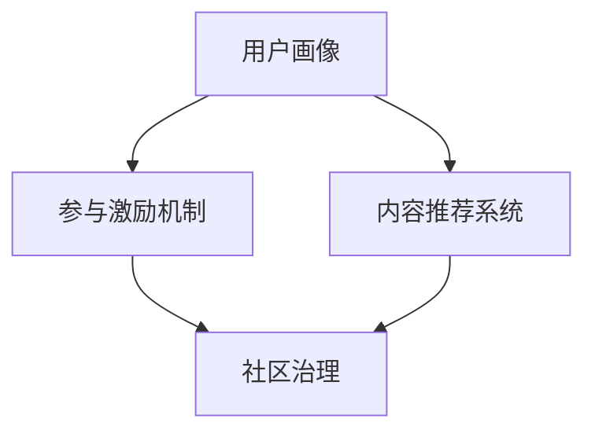

                 

# 注意力经济与在线社区建设策略与实践：吸引并留住受众

在数字化时代，注意力成为一种稀缺资源，特别是在互联网领域，如何吸引并留住受众是企业、社区运营者、内容创作者面临的重大挑战。注意力经济（Economy of Attention）正是在这一背景下兴起的，强调通过提供高质量、有价值的内容和服务，来吸引和维持用户的注意力。本文将探讨注意力经济的核心概念与联系，分析基于注意力的在线社区建设策略与实践，以及如何利用算法和数据技术提升社区的吸引力与用户粘性。

## 1. 背景介绍

### 1.1 问题由来
随着移动互联网的普及和智能终端的普及，人们的注意力被各种应用和服务分流，用户留存难度增加。企业、社区和内容创作者需要借助注意力经济理念，通过高质量内容和互动机制，吸引并留住用户。与此同时，互联网社区正逐步成为数字化转型中的关键环节，通过社区运营，可以汇聚更多用户，激发用户生成内容（UGC），形成良性循环。

### 1.2 问题核心关键点
在注意力经济中，有三个核心概念：注意力（Attention）、价值（Value）、参与度（Engagement）。通过持续提供有价值的内容和服务，激发用户的参与度，才能形成稳定的用户群体。

1. **注意力（Attention）**：用户在互联网上的行为和注意力的分布。高关注度意味着高曝光度，更能吸引更多用户。
2. **价值（Value）**：用户从内容或服务中获得的实际收益，包括信息价值、社交价值、经济价值等。
3. **参与度（Engagement）**：用户与内容、服务的互动程度，如阅读、评论、分享等行为。高参与度意味着用户对内容的认同和粘性。

## 2. 核心概念与联系

### 2.1 核心概念概述

为了更好地理解注意力经济的运作机制，本节将介绍几个关键概念：

- **用户画像（User Persona）**：基于用户行为数据，构建用户兴趣、需求、习惯的虚拟模型，用于个性化的内容和推荐。
- **内容推荐系统（Content Recommendation System）**：通过算法模型，根据用户兴趣和历史行为，自动推荐相关内容，提高用户参与度。
- **参与激励机制（Engagement Incentives）**：通过积分、徽章、奖励等手段，激励用户参与，形成社区活力。
- **社区治理（Community Governance）**：通过制定规则、激励机制等，维护社区秩序，提高用户留存率。

这些概念之间的逻辑关系可以通过以下Mermaid流程图来展示：



这个流程图展示了好几个关键概念之间的联系：

1. 用户画像作为基础数据，指导内容推荐系统的设计。
2. 内容推荐系统通过个性化推荐，增强用户参与度。
3. 参与激励机制促进用户活跃，形成良性社区氛围。
4. 社区治理确保社区秩序，提升用户留存率。

## 3. 核心算法原理 & 具体操作步骤
### 3.1 算法原理概述

注意力经济的核心算法原理在于通过数据分析和机器学习，精准识别用户需求，提供个性化内容和互动机制，从而提升用户参与度和留存率。其核心流程如下：

1. **用户画像构建**：收集用户行为数据，通过聚类、分类等算法，构建用户兴趣和行为特征模型。
2. **内容推荐**：基于用户画像，设计推荐模型，预测用户可能感兴趣的内容，生成推荐列表。
3. **参与激励机制设计**：根据用户行为，设计积分、徽章、奖励等激励措施，激励用户积极参与。
4. **社区治理优化**：通过规则、算法等手段，维护社区秩序，如对抗恶意行为、处理用户投诉等。

### 3.2 算法步骤详解

以下将详细介绍注意力经济中的核心算法步骤：

**Step 1: 用户画像构建**
- 数据采集：收集用户行为数据，包括浏览记录、点赞、评论、分享等。
- 数据清洗与预处理：去除噪音数据，标准化数据格式。
- 特征工程：提取用户兴趣特征、行为特征等，如浏览时间、互动频率等。
- 聚类与分类：使用K-means、层次聚类等算法，将用户分为不同兴趣群体。

**Step 2: 内容推荐系统构建**
- 数据构建：构建用户-内容矩阵，记录用户对内容的互动行为。
- 推荐模型设计：使用协同过滤、矩阵分解、深度学习等算法，预测用户可能感兴趣的内容。
- 模型评估与优化：使用A/B测试、离线评估等方法，评估模型效果，不断优化。

**Step 3: 参与激励机制设计**
- 激励类型设计：设计积分、徽章、奖励等不同类型的激励措施。
- 激励规则设计：定义激励发放条件、规则等，如阅读时长奖励积分。
- 激励模型设计：基于用户行为，设计奖励模型，自动发放激励。

**Step 4: 社区治理优化**
- 规则制定：制定社区规则，如反对恶意内容、打击垃圾信息等。
- 规则执行：使用规则引擎，自动执行社区规则，如封禁恶意账号。
- 用户反馈处理：收集用户反馈，优化社区规则。

### 3.3 算法优缺点

注意力经济基于数据和算法，具有以下优点：
1. 个性化推荐：通过个性化推荐，满足用户多样化需求，提升参与度。
2. 精准营销：基于用户画像，实现精准营销，提升转化率。
3. 社区自治：通过算法和规则，自动维护社区秩序，减少人工干预。

同时，它也存在一些局限性：
1. 隐私问题：大量数据采集和处理可能涉及隐私问题，需严格遵守数据保护法规。
2. 算法偏差：模型可能存在算法偏见，导致推荐偏差，需要定期监测和调整。
3. 用户依赖：过度依赖算法推荐，可能降低用户自主性，需平衡推荐和自由浏览。

### 3.4 算法应用领域

注意力经济的核心算法和策略，在以下几个领域得到了广泛应用：

- **社交媒体**：如微博、微信等，通过推荐算法和激励机制，提升用户活跃度。
- **电商平台**：如淘宝、京东等，通过个性化推荐和推荐引擎，提升用户转化率。
- **内容平台**：如知乎、B站等，通过内容推荐和社区治理，增强用户粘性。
- **在线教育**：如Coursera、Udacity等，通过个性化学习推荐和激励机制，提升学习效果。
- **健康医疗**：如丁香园、健康之路等，通过个性化健康推荐和社区互动，提升健康管理效果。

这些领域的应用展示了注意力经济在提升用户参与度和留存率方面的巨大潜力。

## 4. 数学模型和公式 & 详细讲解 & 举例说明

### 4.1 数学模型构建

为了更好地量化和优化注意力经济中的推荐和激励机制，我们将构建数学模型来描述其工作原理。

假设用户集合为 $U=\{u_1, u_2, \dots, u_n\}$，内容集合为 $V=\{v_1, v_2, \dots, v_m\}$，用户-内容互动矩阵为 $I_{um}$，其中 $I_{um}(i,j)$ 表示用户 $u_i$ 对内容 $v_j$ 的互动评分，$0 \leq I_{um}(i,j) \leq 1$。

我们的目标是设计推荐模型 $P(u,v)$，预测用户 $u$ 对内容 $v$ 的评分，即：

$$
P(u,v) = \mathbb{E}[I_{uv}] = \frac{\sum_{j=1}^m I_{um}(i,j)}{m}
$$

以及参与激励机制 $Q(u,t)$，预测用户 $u$ 在未来时间 $t$ 内参与内容的概率，即：

$$
Q(u,t) = \mathbb{P}[u \text{ 在 } t \text{ 内参与内容}] = \frac{1}{1+\exp(-\eta u \cdot \phi(v)+\gamma t)}
$$

其中 $u \cdot \phi(v)$ 为用户和内容的特征向量点积，$\eta$ 和 $\gamma$ 为模型参数。

### 4.2 公式推导过程

下面将推导上述模型的公式。

**推荐模型推导**：
1. 构建用户-内容互动矩阵 $I_{um}$，其中 $I_{um}(i,j)$ 表示用户 $u_i$ 对内容 $v_j$ 的互动评分。
2. 计算用户对内容的平均互动评分：

$$
P(u,v) = \frac{\sum_{j=1}^m I_{um}(i,j)}{m}
$$

**激励机制推导**：
1. 定义用户参与内容的概率模型：

$$
Q(u,t) = \frac{1}{1+\exp(-\eta u \cdot \phi(v)+\gamma t)}
$$

其中 $u \cdot \phi(v)$ 为用户和内容的特征向量点积，$\eta$ 和 $\gamma$ 为模型参数。

### 4.3 案例分析与讲解

以电商平台的个性化推荐为例，分析推荐模型和激励机制的设计与实现。

假设电商平台收集到用户的浏览记录和购买记录，将这些数据构建为用户-内容互动矩阵 $I_{um}$。使用协同过滤算法，基于用户-内容互动矩阵，设计推荐模型 $P(u,v)$，预测用户 $u$ 对内容 $v$ 的评分。同时，设计激励机制 $Q(u,t)$，预测用户 $u$ 在未来时间 $t$ 内购买内容的概率，通过积分奖励激励用户购买。

## 5. 项目实践：代码实例和详细解释说明
### 5.1 开发环境搭建

在进行注意力经济相关开发前，需要先搭建好开发环境。以下是使用Python进行TensorFlow开发的环境配置流程：

1. 安装Anaconda：从官网下载并安装Anaconda，用于创建独立的Python环境。

2. 创建并激活虚拟环境：
```bash
conda create -n tf-env python=3.8 
conda activate tf-env
```

3. 安装TensorFlow：根据CUDA版本，从官网获取对应的安装命令。例如：
```bash
conda install tensorflow -c tensorflow
```

4. 安装Scikit-learn、NumPy等辅助库：
```bash
pip install numpy pandas scikit-learn matplotlib tqdm jupyter notebook ipython
```

完成上述步骤后，即可在`tf-env`环境中开始注意力经济相关开发。

### 5.2 源代码详细实现

下面我们以推荐系统为例，给出使用TensorFlow实现个性化推荐算法的PyTorch代码实现。

```python
import tensorflow as tf
from tensorflow.keras.layers import Input, Dense, Embedding, Dot, Activation
from tensorflow.keras.models import Model

# 定义用户-内容互动矩阵
interaction_matrix = tf.constant([[0, 1, 0, 1], [1, 0, 1, 0], [0, 0, 0, 1]], dtype=tf.float32)

# 定义用户和内容的特征向量
user_feats = tf.constant([[0.1, 0.2], [0.3, 0.4], [0.5, 0.6]], dtype=tf.float32)
item_feats = tf.constant([[0.4, 0.5], [0.6, 0.7], [0.8, 0.9]], dtype=tf.float32)

# 构建推荐模型
user_input = Input(shape=(2,))
item_input = Input(shape=(2,))
dot_product = Dot(axes=1)([user_input, item_input])
logits = Dense(1, activation='sigmoid')(dot_product)
model = Model([user_input, item_input], logits)

# 编译模型
model.compile(optimizer=tf.keras.optimizers.Adam(), loss='binary_crossentropy', metrics=['accuracy'])

# 训练模型
model.fit([user_feats, item_feats], interaction_matrix, epochs=100, batch_size=1)
```

以上代码实现了基于矩阵分解的协同过滤推荐算法。首先定义用户-内容互动矩阵，然后定义用户和内容的特征向量。通过TensorFlow的Keras API，构建了包含用户和内容输入层、点积层和输出层的推荐模型。最后，编译模型并进行训练。

### 5.3 代码解读与分析

让我们再详细解读一下关键代码的实现细节：

**数据定义**：
- `interaction_matrix`：定义用户-内容互动矩阵，其中每行表示一个用户对内容的评分，0表示未评分，1表示评分1，2表示评分2。
- `user_feats`：定义用户特征向量，每行表示一个用户。
- `item_feats`：定义内容特征向量，每行表示一个内容。

**模型构建**：
- `user_input` 和 `item_input`：定义用户和内容的输入层，维度均为2。
- `Dot`：定义点积层，计算用户特征向量与内容特征向量的点积。
- `Dense`：定义全连接层，输出一个标量，表示用户对内容的评分。
- `model`：定义推荐模型，包含输入层、点积层和全连接层。

**模型训练**：
- `model.compile`：编译模型，使用Adam优化器，损失函数为二元交叉熵，评估指标为准确率。
- `model.fit`：训练模型，输入用户特征向量、内容特征向量和互动矩阵，进行100轮训练，每轮处理1个样本。

## 6. 实际应用场景
### 6.1 社交媒体

社交媒体平台如微博、微信，通过推荐算法和激励机制，显著提升了用户活跃度。具体而言：

1. **推荐算法**：基于用户互动数据，设计协同过滤或矩阵分解算法，生成个性化推荐内容。例如，微博根据用户关注和互动数据，推荐可能感兴趣的内容，提升用户参与度。
2. **激励机制**：通过点赞、评论、分享等行为，发放积分、徽章等奖励，激励用户积极互动。例如，微信通过好友点赞奖励积分，增强用户粘性。

### 6.2 电商平台

电商平台的个性化推荐，极大地提升了用户购买转化率。具体而言：

1. **推荐算法**：基于用户浏览、购买行为数据，使用协同过滤、矩阵分解等算法，生成个性化推荐商品。例如，淘宝根据用户浏览记录和购买记录，推荐可能感兴趣的商品，提升转化率。
2. **激励机制**：通过优惠券、满减活动等手段，激励用户购买。例如，京东通过积分兑换优惠券，提高用户购买意愿。

### 6.3 内容平台

内容平台如知乎、B站，通过推荐算法和激励机制，增强了用户粘性。具体而言：

1. **推荐算法**：基于用户互动数据，使用协同过滤、深度学习等算法，生成个性化推荐内容。例如，知乎根据用户浏览、点赞、评论数据，推荐可能感兴趣的文章，提升用户参与度。
2. **激励机制**：通过点赞、评论、分享等行为，发放积分、徽章等奖励，激励用户积极互动。例如，B站通过点赞奖励积分，增强用户粘性。

## 7. 工具和资源推荐
### 7.1 学习资源推荐

为了帮助开发者系统掌握注意力经济的理论基础和实践技巧，这里推荐一些优质的学习资源：

1. **《推荐系统实战》系列博文**：由推荐系统专家撰写，深入浅出地介绍了推荐系统原理、算法和实践技巧。
2. **Coursera《推荐系统》课程**：由斯坦福大学开设的推荐系统课程，涵盖推荐系统基础、算法、评估等核心内容。
3. **《推荐系统：算法与应用》书籍**：推荐系统领域的经典教材，全面介绍了推荐系统的原理、算法和应用场景。
4. **Kaggle推荐系统竞赛**：Kaggle平台上的推荐系统竞赛，可以实践和学习不同的推荐算法，获取反馈和提升。
5. **Scikit-learn官方文档**：Scikit-learn库的官方文档，提供了丰富的推荐算法实现和案例，适合快速上手实践。

通过对这些资源的学习实践，相信你一定能够快速掌握注意力经济中的核心算法和实践技巧，并用于解决实际的推荐问题。

### 7.2 开发工具推荐

高效的开发离不开优秀的工具支持。以下是几款用于推荐系统开发的常用工具：

1. **TensorFlow**：由Google主导开发的深度学习框架，适合大规模工程应用，提供了丰富的推荐算法实现。
2. **PyTorch**：基于Python的开源深度学习框架，灵活动态的计算图，适合快速迭代研究。
3. **Scikit-learn**：Python的机器学习库，提供了多种推荐算法实现，简单易用。
4. **Jupyter Notebook**：Python的交互式开发环境，支持代码和结果的可视化展示，适合数据分析和模型调试。
5. **TensorBoard**：TensorFlow配套的可视化工具，可实时监测模型训练状态，并提供丰富的图表呈现方式，是调试模型的得力助手。

合理利用这些工具，可以显著提升注意力经济相关任务的开发效率，加快创新迭代的步伐。

### 7.3 相关论文推荐

注意力经济领域的研究始于学术界的持续探索。以下是几篇奠基性的相关论文，推荐阅读：

1. **《网络环境的协同过滤推荐》**：介绍了协同过滤推荐算法的原理和应用。
2. **《矩阵分解方法在推荐系统中的应用》**：探讨了矩阵分解算法在推荐系统中的效果。
3. **《深度学习在推荐系统中的应用》**：介绍了深度学习在推荐系统中的应用和效果。
4. **《推荐系统：目标、算法和实现》**：全面综述了推荐系统的目标、算法和实现方法。
5. **《基于多维数据融合的推荐系统》**：探讨了多维数据融合在推荐系统中的应用。

这些论文代表了大数据、深度学习等技术在推荐系统中的进展，通过学习这些前沿成果，可以帮助研究者把握学科前进方向，激发更多的创新灵感。

## 8. 总结：未来发展趋势与挑战
### 8.1 总结

本文对注意力经济的核心概念与联系进行了详细阐述，并分析了基于注意力的在线社区建设策略与实践。通过系统梳理，可以看到注意力经济正逐渐成为互联网领域的重要范式，通过个性化推荐和激励机制，显著提升了用户参与度和留存率。未来，伴随算法和数据技术的不断进步，注意力经济必将在更多领域得到广泛应用，推动互联网技术的发展和应用。

### 8.2 未来发展趋势

展望未来，注意力经济将呈现以下几个发展趋势：

1. **跨平台融合**：未来的推荐系统将跨平台融合，为用户提供一致的用户体验。例如，社交媒体平台、电商平台的推荐算法相互协作，实现无缝切换。
2. **多模态融合**：未来的推荐系统将融合多模态数据，如文本、图像、音频等，提供更全面、丰富的推荐内容。例如，电商平台的推荐系统不仅基于文本数据，还结合图片和视频信息，提升推荐效果。
3. **个性化推荐**：未来的推荐系统将更加个性化，通过深度学习和大数据分析，实现精准推荐。例如，根据用户的行为数据，生成个性化推荐，提升用户满意度。
4. **实时推荐**：未来的推荐系统将实现实时推荐，基于用户的实时行为数据，生成即时推荐内容。例如，电商平台在用户浏览商品时，即时推荐相关商品，提升购买转化率。
5. **联邦学习**：未来的推荐系统将采用联邦学习等技术，保护用户隐私，同时提升推荐效果。例如，电商平台通过联邦学习，实现多用户协同训练推荐模型，提升推荐准确性。

### 8.3 面临的挑战

尽管注意力经济在实践中有广泛应用，但仍然面临诸多挑战：

1. **隐私问题**：大量数据采集和处理可能涉及隐私问题，需严格遵守数据保护法规。例如，电商平台收集用户行为数据，需确保数据匿名化和去标识化。
2. **算法偏见**：模型可能存在算法偏见，导致推荐偏差，需定期监测和调整。例如，电商平台的推荐算法可能存在性别、年龄偏见，需及时调整算法参数。
3. **用户依赖**：过度依赖算法推荐，可能降低用户自主性，需平衡推荐和自由浏览。例如，电商平台的推荐系统可能过度依赖算法，忽视用户自主选择，导致用户体验下降。
4. **计算资源**：推荐系统的复杂度可能带来高计算资源消耗，需优化算法和数据结构。例如，电商平台的推荐算法可能计算资源消耗大，需优化算法实现。

### 8.4 研究展望

未来，注意力经济的研究将主要集中在以下几个方面：

1. **隐私保护**：通过匿名化和去标识化等技术，保护用户隐私，确保数据安全。例如，电商平台的推荐算法需引入隐私保护技术，保护用户数据。
2. **算法优化**：优化推荐算法，提升推荐效果和速度。例如，电商平台的推荐系统需优化算法实现，提升推荐速度和精度。
3. **多模态融合**：融合多模态数据，提升推荐效果。例如，电商平台的推荐系统需结合文本、图片、视频等多模态数据，提升推荐准确性。
4. **联邦学习**：采用联邦学习等技术，保护用户隐私，提升推荐效果。例如，电商平台可通过联邦学习，实现多用户协同训练推荐模型。
5. **跨平台融合**：实现跨平台融合，提升用户体验。例如，社交媒体平台和电商平台的推荐算法需相互协作，实现无缝切换。

总之，未来的注意力经济将持续探索如何通过算法和数据技术，提升用户参与度和留存率，为互联网技术的发展和应用提供新的动力。同时，需在隐私保护、算法优化、跨平台融合等方面不断突破，推动技术的进步和应用的普及。

## 9. 附录：常见问题与解答

**Q1：推荐系统如何处理冷启动问题？**

A: 冷启动问题指新用户或新物品缺乏历史数据，难以进行推荐。常见的处理方式包括：
1. 基于内容的推荐：通过物品属性和描述，进行推荐。例如，电商平台可根据商品属性，推荐相似商品。
2. 基于流行度的推荐：推荐平台热门物品。例如，电商平台的畅销榜推荐，帮助新用户发现热门商品。
3. 基于用户画像的推荐：根据用户兴趣和行为特征，推荐相似物品。例如，电商平台的推荐算法，根据用户画像推荐相似商品。

**Q2：如何平衡推荐算法和自由浏览？**

A: 推荐算法应与自由浏览相结合，平衡用户自主选择和个性化推荐。具体策略包括：
1. 推荐多样性：通过多样性推荐，降低用户对单一推荐的依赖。例如，电商平台的推荐系统，推荐不同类别的商品，满足用户多样性需求。
2. 个性化选项：提供个性化选项，让用户自主选择推荐物品。例如，电商平台的推荐系统，提供用户自主选择推荐选项，提升用户满意度。
3. 推荐阈值：设定推荐阈值，根据用户行为调整推荐策略。例如，电商平台的推荐系统，根据用户浏览记录和购买行为，动态调整推荐策略。

**Q3：推荐系统如何处理动态数据变化？**

A: 推荐系统应具备动态数据处理能力，实时调整推荐策略。具体策略包括：
1. 实时数据采集：实时采集用户行为数据，更新推荐模型。例如，电商平台实时采集用户浏览数据，更新推荐模型。
2. 动态模型训练：通过在线学习算法，实时训练推荐模型。例如，电商平台的推荐系统，通过在线学习算法，实时更新推荐模型。
3. 数据融合：融合多源数据，提升推荐效果。例如，电商平台的推荐系统，融合用户行为数据、商品评价数据等多源数据，提升推荐效果。

**Q4：推荐系统如何处理恶意行为？**

A: 推荐系统应具备异常检测和处理能力，避免恶意行为影响推荐效果。具体策略包括：
1. 异常检测：通过异常检测算法，识别恶意行为。例如，电商平台通过异常检测算法，识别恶意账号和虚假评价。
2. 人工干预：人工审核和干预，确保推荐系统的公平性。例如，电商平台的推荐系统，通过人工审核，处理恶意行为。
3. 模型更新：定期更新推荐模型，减少算法偏见。例如，电商平台的推荐系统，定期更新模型参数，减少算法偏见。

**Q5：推荐系统如何平衡推荐效果和资源消耗？**

A: 推荐系统应优化算法和资源利用，平衡推荐效果和资源消耗。具体策略包括：
1. 模型压缩：通过模型压缩技术，减少模型参数和计算量。例如，电商平台的推荐系统，通过模型压缩技术，减少计算量。
2. 分布式训练：通过分布式训练技术，加速模型训练。例如，电商平台的推荐系统，通过分布式训练技术，加速模型训练。
3. 资源优化：优化资源利用，提升推荐系统性能。例如，电商平台的推荐系统，优化计算资源利用，提升推荐系统性能。

这些问题的答案展示了如何通过技术手段，解决推荐系统面临的实际问题，优化推荐效果和用户体验。

---

作者：禅与计算机程序设计艺术 / Zen and the Art of Computer Programming

