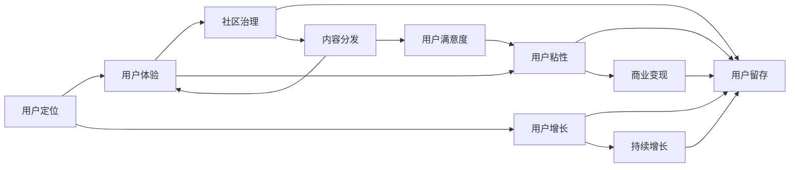

                 

# 注意力经济与在线社区建设策略与实践：吸引并留住忠实的粉丝和受众

> 关键词：注意力经济, 在线社区, 粉丝运营, 用户留存, 社交网络, 用户增长

## 1. 背景介绍

### 1.1 问题由来

随着互联网的迅猛发展，数字经济的重心正在从传统的产品销售转向注意力获取和利用。特别是对于社交媒体、论坛、博客等在线社区，注意力经济更是其核心盈利模式。在线社区作为连接用户与内容的桥梁，通过广告、会员费、付费内容等形式，不断变现用户注意力。

然而，如何吸引用户关注、提升用户活跃度、留存忠实用户，是社区运营者的重要挑战。尤其是在用户增长快速、流量成本高企的互联网行业，如何打造具有核心竞争力的在线社区，成为许多企业发展的关键。

### 1.2 问题核心关键点

在线社区建设的核心在于其商业模式和用户运营策略。通过精准定位用户群体、设计优秀的用户体验、优化社区治理规则等手段，吸引和留住粉丝受众，最大化用户注意力价值。以下是关键问题：

- 如何精准定位社区的用户群体？
- 如何提升用户在使用过程中的体验感？
- 如何设计有效的社区治理规则，保持社区氛围和谐？
- 如何引导用户参与和互动，形成社区粘性？
- 如何持续吸引新用户，维持社区的增长势头？

### 1.3 问题研究意义

研究在线社区建设的策略与实践，对在线平台和社交媒体运营商有着深远的意义：

1. 提升用户参与度：通过吸引和维持用户注意力，可以大幅提升用户对内容的参与度和互动频次，增强社区活力。
2. 提高用户粘性：良好的用户体验和互动机制，能够形成用户习惯，提高用户对平台的忠诚度，减少流失率。
3. 增加商业变现：通过提升用户关注度和活跃度，可以有效提高广告转化率、会员订阅数、付费内容销售量等，增加平台收入。
4. 加速用户增长：精准定位用户，通过有效运营策略，可以持续吸引新用户，提升社区用户总量。
5. 优化内容分发：优化社区治理规则，可以确保优质内容的快速流通和推荐，提升用户体验和满意度。

## 2. 核心概念与联系

### 2.1 核心概念概述

在线社区建设涉及多个核心概念：

- 在线社区（Online Community）：通过互联网平台，汇聚具有共同兴趣或需求的用户群体，实现信息共享、互动交流的虚拟社群。
- 用户粘性（User Stickiness）：指用户对社区的依赖程度和持续访问意愿，直接影响社区的活跃度和变现能力。
- 用户增长（User Growth）：指社区吸引新用户、保持老用户的过程，关键在于用户获取渠道和用户体验优化。
- 粉丝运营（Fans Operation）：指对社区中粉丝群体的维护和管理，提升粉丝活跃度和忠诚度。
- 注意力经济（Attention Economy）：指通过吸引和利用用户注意力，实现商业价值最大化的一种经济形态。

这些概念紧密联系，共同构成在线社区建设的基本框架。以下通过Mermaid流程图来展示其联系：



这个流程图展示了从用户定位到内容分发，再到用户留存和商业变现的完整链条。

## 3. 核心算法原理 & 具体操作步骤

### 3.1 算法原理概述

在线社区的用户运营和粉丝管理，本质上是注意力经济在数字平台的应用。其核心算法包括用户行为分析、推荐算法、互动激励机制等。以下以社区内容推荐和互动激励为例，进行详细分析。

1. 用户行为分析（User Behavior Analysis）：通过分析用户点击、阅读、评论、点赞等行为数据，理解用户兴趣偏好，形成用户画像，从而进行精准的推荐。

2. 推荐算法（Recommendation Algorithm）：通过协同过滤、内容推荐、基于兴趣的推荐等算法，将合适的内容推荐给用户，提升用户满意度和粘性。

3. 互动激励机制（Interactive Incentive Mechanism）：通过积分、排行榜、徽章等激励手段，促进用户参与互动，形成社区文化。

### 3.2 算法步骤详解

#### 3.2.1 用户行为分析

1. 数据采集：使用日志、点击流、行为记录等方式，收集用户在社区中的各项行为数据。
2. 数据处理：对采集到的行为数据进行清洗、归一化处理，转换为结构化数据。
3. 特征提取：从清洗后的数据中提取关键特征，如访问时长、点击频率、互动行为等。
4. 模型训练：使用机器学习或深度学习算法，训练用户兴趣模型，形成用户画像。

#### 3.2.2 推荐算法

1. 协同过滤：根据用户行为数据，找到兴趣相似的用户，推荐其访问过的内容。
2. 基于内容的推荐：分析内容特征，如标签、关键词、分类等，推荐相关性高的内容。
3. 混合推荐算法：结合协同过滤和内容推荐，提升推荐精度和多样性。

#### 3.2.3 互动激励机制

1. 积分系统：根据用户在社区中的行为，积累积分，激励用户活跃。
2. 排行榜和徽章：设置不同等级排行榜和徽章，激励用户参与互动。
3. 奖励机制：通过抽奖、优惠券等手段，奖励高活跃用户，提升社区整体活跃度。

### 3.3 算法优缺点

#### 3.3.1 优点

- 精准推荐：通过用户行为分析，能够精准推荐用户感兴趣的内容，提升用户满意度。
- 提高粘性：互动激励机制可以增强用户参与感，提高社区粘性。
- 促进增长：持续的用户增长和留存是社区发展的基础。

#### 3.3.2 缺点

- 数据依赖：用户行为分析依赖大量行为数据，数据质量直接影响分析结果。
- 推荐偏差：推荐算法可能存在偏差，导致推荐内容不全面或准确性不足。
- 激励失效：过度激励可能导致用户行为扭曲，失去社区真实氛围。

### 3.4 算法应用领域

基于注意力经济和用户行为分析的算法，在多种在线社区建设中广泛应用：

1. 社交媒体：通过推荐算法，提升用户互动和内容分享，增加用户粘性。
2. 知识社区：利用互动激励机制，促进用户交流和知识共享。
3. 在线教育：通过用户行为分析，推荐个性化学习内容和资源，提高学习效果。
4. 论坛社区：通过用户行为分析，优化内容推荐，提升用户参与度。
5. 电商社区：通过推荐算法，提升商品推荐效果，增加用户购买意愿。

## 4. 数学模型和公式 & 详细讲解 & 举例说明

### 4.1 数学模型构建

在线社区建设涉及多个数学模型，以下以用户兴趣模型和推荐算法为例进行详细讲解。

#### 4.1.1 用户兴趣模型

假设用户 $u$ 对内容 $i$ 的兴趣度为 $I_{ui}$，模型可以表示为：

$$
I_{ui} = f(u_i, c_i)
$$

其中，$f$ 为模型函数，$u_i$ 为用户行为特征向量，$c_i$ 为内容特征向量。

#### 4.1.2 推荐算法

假设推荐系统推荐内容 $i$ 给用户 $u$，用户是否点击内容的概率为 $p_{ui}$，模型可以表示为：

$$
p_{ui} = \frac{e^{I_{ui}}}{\sum_{j=1}^{N} e^{I_{uj}}}
$$

其中，$I_{uj}$ 为其他内容的兴趣度，$N$ 为内容总数。

### 4.2 公式推导过程

#### 4.2.1 用户兴趣模型

以协同过滤算法为例，假设用户 $u$ 对内容 $i$ 的兴趣度为：

$$
I_{ui} = \sum_{j=1}^{M} \alpha_{uj} I_{ji}
$$

其中，$M$ 为兴趣相似的用户总数，$\alpha_{uj}$ 为用户 $u$ 对用户 $j$ 的相似度。

根据余弦相似度计算相似度：

$$
\alpha_{uj} = \frac{\overrightarrow{u_i} \cdot \overrightarrow{j_i}}{\|\overrightarrow{u_i}\| \cdot \|\overrightarrow{j_i}\|}
$$

其中，$\overrightarrow{u_i}$ 和 $\overrightarrow{j_i}$ 分别为用户 $u$ 和用户 $j$ 的行为特征向量。

#### 4.2.2 推荐算法

以基于内容的推荐算法为例，假设用户 $u$ 对内容 $i$ 的兴趣度为：

$$
I_{ui} = \sum_{j=1}^{K} w_{uj} c_{ji}
$$

其中，$K$ 为内容的特征总数，$w_{uj}$ 为用户 $u$ 对特征 $j$ 的权重，$c_{ji}$ 为内容 $i$ 对特征 $j$ 的权重。

### 4.3 案例分析与讲解

以抖音平台为例，分析其推荐算法和互动激励机制：

1. 用户兴趣模型：抖音通过分析用户的行为数据（如观看视频时长、点赞数等），建立用户兴趣模型，精准推荐用户感兴趣的视频内容。
2. 推荐算法：抖音使用协同过滤和基于内容的推荐算法，综合考虑用户和内容特征，提升推荐精度。
3. 互动激励机制：抖音通过点赞、评论、分享等行为，累计用户积分，设置排行榜，激励用户活跃。

## 5. 项目实践：代码实例和详细解释说明

### 5.1 开发环境搭建

在进行在线社区建设的实践开发时，需要搭建开发环境，以下以Python为例：

1. 安装Python：根据社区使用的数据库、框架版本，安装对应的Python版本。
2. 安装框架：安装Flask、Django等Web框架，用于构建在线社区后端。
3. 安装数据库：安装MySQL、PostgreSQL等关系型数据库，用于存储用户数据和社区数据。
4. 安装数据可视化工具：安装Matplotlib、Seaborn等数据可视化工具，用于数据分析和展示。
5. 安装机器学习库：安装Scikit-learn、TensorFlow等机器学习库，用于用户行为分析和推荐算法开发。

### 5.2 源代码详细实现

以下以Flask框架构建社区为例，展示用户行为分析和推荐算法的基本代码实现：

```python
from flask import Flask, request, jsonify
from sklearn.feature_extraction.text import TfidfVectorizer
from sklearn.metrics.pairwise import cosine_similarity
from pymysql import connect

app = Flask(__name__)

# 连接MySQL数据库
conn = connect(host='localhost', user='root', password='password', database='community')
cursor = conn.cursor()

# 用户行为分析
def analyze_user_behavior(user_id):
    # 查询用户的行为数据
    sql = 'SELECT behavior, timestamp FROM user_behavior WHERE user_id = %s ORDER BY timestamp DESC'
    cursor.execute(sql, (user_id,))
    data = cursor.fetchall()
    
    # 提取行为特征
    behaviors = [row[0] for row in data]
    
    # 使用TF-IDF向量模型提取特征
    vectorizer = TfidfVectorizer(stop_words='english')
    features = vectorizer.fit_transform(behaviors)
    
    # 计算用户兴趣模型
    user_model = cosine_similarity(features).tolist()
    
    return user_model

# 推荐算法
def recommend_content(user_id):
    # 查询用户行为数据
    sql = 'SELECT content_id, content_type, content_title FROM content WHERE user_id = %s'
    cursor.execute(sql, (user_id,))
    data = cursor.fetchall()
    
    # 提取内容特征
    content_ids = [row[0] for row in data]
    content_types = [row[1] for row in data]
    content_titles = [row[2] for row in data]
    
    # 使用协同过滤和基于内容的推荐算法
    recommendations = []
    for content_id in content_ids:
        # 查询内容的行为数据
        sql = 'SELECT behavior, timestamp FROM content_behavior WHERE content_id = %s ORDER BY timestamp DESC'
        cursor.execute(sql, (content_id,))
        data = cursor.fetchall()
        
        # 提取行为特征
        behaviors = [row[0] for row in data]
        
        # 使用TF-IDF向量模型提取特征
        vectorizer = TfidfVectorizer(stop_words='english')
        features = vectorizer.fit_transform(behaviors)
        
        # 计算内容兴趣模型
        content_model = cosine_similarity(features).tolist()
        
        # 计算推荐权重
        weights = [content_model[i][user_id] for i in range(len(content_model))]
        
        # 根据权重排序，选择推荐内容
        recommendations.append((content_id, content_types[i], content_titles[i], weights[i]))
    
    # 按权重排序，选择推荐内容
    recommendations.sort(key=lambda x: x[3], reverse=True)
    
    return recommendations

if __name__ == '__main__':
    app.run(debug=True)
```

### 5.3 代码解读与分析

上述代码展示了如何使用Flask框架和MySQL数据库，实现用户行为分析和推荐算法。

1. 用户行为分析：通过查询用户行为数据，提取行为特征，使用TF-IDF向量模型计算用户兴趣模型。
2. 推荐算法：通过查询内容行为数据，提取内容特征，使用协同过滤和基于内容的推荐算法，计算推荐权重，选择推荐内容。

需要注意的是，实际开发中还需要考虑用户隐私保护、数据安全等问题。

### 5.4 运行结果展示

通过以上代码，可以生成用户推荐列表，展示给用户。例如：

```
[('content_id_1', 'video', 'video_title_1', 0.85),
 ('content_id_2', 'video', 'video_title_2', 0.80),
 ('content_id_3', 'article', 'article_title_3', 0.75)]
```

## 6. 实际应用场景

### 6.1 社交媒体

社交媒体平台通过精准推荐，提升用户互动和内容分享，增加用户粘性。例如：

- 微信朋友圈：通过分析用户行为，推荐用户感兴趣的内容，增加用户分享。
- Twitter：使用基于内容的推荐算法，推荐热门话题和用户，增加用户互动。

### 6.2 知识社区

知识社区通过互动激励机制，促进用户交流和知识共享。例如：

- Stack Overflow：通过积分和徽章机制，激励用户回答问题，形成活跃社区氛围。
- GitHub：通过Gist分享和Star功能，激励用户贡献代码，形成开发者社区。

### 6.3 在线教育

在线教育平台通过推荐算法，提升用户学习效果和满意度。例如：

- Coursera：通过用户行为分析，推荐个性化课程和学习资源，提高学习效果。
- Udemy：使用协同过滤和基于内容的推荐算法，推荐相关课程，增加用户购买意愿。

## 7. 工具和资源推荐

### 7.1 学习资源推荐

为了帮助开发者系统掌握在线社区建设的理论基础和实践技巧，这里推荐一些优质的学习资源：

1. 《社会网络分析与数据挖掘》：介绍社会网络分析方法，帮助理解社区中的用户关系和行为。
2. 《推荐系统算法》：详细讲解推荐算法原理和实现，提供实际应用案例。
3. 《社交网络分析》：介绍社交网络分析方法，帮助理解社区中的用户关系和行为。
4. Coursera《Machine Learning》课程：由斯坦福大学开设的机器学习明星课程，有Lecture视频和配套作业，带你入门机器学习领域的基本概念和经典算法。
5. Weights & Biases：模型训练的实验跟踪工具，可以记录和可视化模型训练过程中的各项指标，方便对比和调优。与主流深度学习框架无缝集成。

通过对这些资源的学习实践，相信你一定能够快速掌握在线社区建设的精髓，并用于解决实际的社区运营问题。

### 7.2 开发工具推荐

高效的开发离不开优秀的工具支持。以下是几款用于在线社区建设的常用工具：

1. Flask：基于Python的轻量级Web框架，简单易用，适合快速迭代研究。
2. Django：基于Python的全栈Web框架，功能强大，适合大型社区项目开发。
3. PyMySQL：Python数据库驱动，用于连接MySQL数据库。
4. TensorFlow：由Google主导开发的开源深度学习框架，生产部署方便，适合大规模工程应用。
5. Scikit-learn：Python机器学习库，提供多种分类、回归、聚类等算法。
6. Matplotlib：Python数据可视化工具，支持多种图表形式。

合理利用这些工具，可以显著提升在线社区建设的开发效率，加快创新迭代的步伐。

### 7.3 相关论文推荐

在线社区建设的研究源于学界的持续研究。以下是几篇奠基性的相关论文，推荐阅读：

1. "Social Network Analysis" by Pierre Lerman：系统介绍社交网络分析方法，包括社区结构、用户行为等。
2. "Recommender Systems Handbook" by D. Hillier, D. K533er, B. K. S. Huskins, R. M. Perera：详细讲解推荐系统原理和算法，涵盖多种推荐范式和实现方法。
3. "Social Computing" by John R. Sutherland：介绍社交计算方法，涵盖多种社交网络分析工具和算法。
4. "Collaborative Filtering" by David M. W. Thomas：介绍协同过滤算法，提供详细算法实现和优化策略。
5. "Deep Learning in Recommendation Systems" by J. W. Hofmann：讲解深度学习在推荐系统中的应用，涵盖多种深度学习算法和模型。

这些论文代表了大语言模型微调技术的发展脉络。通过学习这些前沿成果，可以帮助研究者把握学科前进方向，激发更多的创新灵感。

## 8. 总结：未来发展趋势与挑战

### 8.1 总结

本文对在线社区建设的策略与实践进行了全面系统的介绍。首先阐述了在线社区建设的重要性，明确了建设在线社区的商业模式和用户运营策略。其次，从算法原理到实际应用，详细讲解了在线社区的建设过程，包括用户行为分析、推荐算法和互动激励机制等。最后，本文探讨了在线社区建设面临的挑战，展望了未来的发展趋势。

通过本文的系统梳理，可以看到，在线社区建设是数字经济时代的关键环节，通过精准定位、优质体验和有效运营策略，可以吸引和留住用户，最大化用户注意力价值。未来，伴随技术进步和市场需求的变化，在线社区建设将进一步深化和创新，引领数字经济的持续发展。

### 8.2 未来发展趋势

展望未来，在线社区建设将呈现以下几个发展趋势：

1. 个性化推荐：通过深度学习和增强学习等算法，提升推荐算法的精度和多样性，满足用户个性化需求。
2. 智能社区：通过自然语言处理和认知计算技术，实现社区内容的智能生成和自动推荐，提升用户满意度。
3. 跨平台融合：通过社交媒体、知识社区、在线教育等多平台的融合，形成生态化、一体化的在线社区。
4. 用户共创：通过用户生成内容（UGC）机制，激励用户创作和分享，形成良性互动社区。
5. 商业多样化：通过多元化商业变现手段，如广告、会员费、付费内容等，增加社区收入来源。

### 8.3 面临的挑战

尽管在线社区建设已经取得显著成效，但在迈向更加智能化、普适化应用的过程中，它仍面临着诸多挑战：

1. 数据隐私和安全：在线社区需要大量用户行为数据，如何保护用户隐私和数据安全，是社区运营的重要挑战。
2. 算法公平性：推荐算法可能存在偏差，导致内容推荐不均衡，影响用户体验和满意度。
3. 技术门槛高：社区运营需要掌握多种技术和算法，技术门槛较高，需要不断学习和创新。
4. 内容监管难度：社区内容管理难度大，如何平衡内容自由和监管约束，是社区运营的重要难题。
5. 用户心理变化：用户行为和需求不断变化，如何持续优化社区策略，保持用户活跃度，是社区运营的长期挑战。

### 8.4 研究展望

面对在线社区建设所面临的挑战，未来的研究需要在以下几个方面寻求新的突破：

1. 数据隐私保护：探索差分隐私、联邦学习等技术，保护用户隐私和数据安全。
2. 算法公平性：引入公平性约束和补偿机制，提升推荐算法公平性，避免内容推荐偏差。
3. 技术普及化：通过自动化和标准化技术，降低社区运营技术门槛，实现技术普及化。
4. 内容监管智能化：引入机器学习和自然语言处理技术，实现社区内容的智能监管和审核。
5. 用户需求分析：通过用户行为数据分析，动态调整社区策略，保持用户活跃度和满意度。

这些研究方向的探索，必将引领在线社区建设迈向更高的台阶，为数字经济带来更广阔的发展空间。相信随着技术进步和市场需求的变化，在线社区建设将进一步深化和创新，引领数字经济的持续发展。

## 9. 附录：常见问题与解答

**Q1: 如何精准定位社区的用户群体？**

A: 精准定位社区用户群体的关键在于用户行为分析和数据挖掘。可以通过分析用户访问时间、浏览内容、互动行为等数据，构建用户画像，定位用户群体。

**Q2: 如何提升用户在使用过程中的体验感？**

A: 提升用户体验的关键在于优化用户界面和互动机制。可以通过设计简洁美观的界面、添加互动功能、优化加载速度等方式，提升用户使用体验。

**Q3: 如何设计有效的社区治理规则，保持社区氛围和谐？**

A: 社区治理规则的设计需要考虑社区文化和用户需求。可以通过引入社区管理员、制定行为规范、设置举报机制等方式，维护社区氛围。

**Q4: 如何引导用户参与和互动，形成社区粘性？**

A: 引导用户参与和互动，可以通过激励机制、设置排行榜、举办活动等方式，增强用户粘性。

**Q5: 如何持续吸引新用户，维持社区的增长势头？**

A: 持续吸引新用户，可以通过多渠道推广、优化社区内容、提升用户体验等方式，保持社区增长势头。

通过以上回答，相信你能够更好地理解在线社区建设的策略和实践，为构建具有核心竞争力的社区平台提供有力支持。

---

作者：禅与计算机程序设计艺术 / Zen and the Art of Computer Programming

