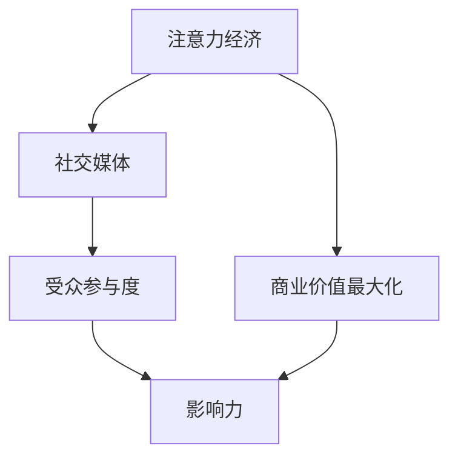
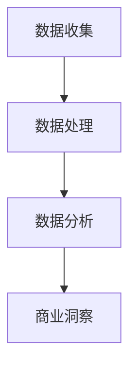

                 

# 注意力经济与社交媒体分析洞见：了解受众参与度和影响力的秘诀

## 1. 背景介绍

在互联网时代，数据变得前所未有的重要。社交媒体的兴起，使得数据不仅是信息的载体，更是商业竞争的焦点。企业需要准确了解受众的需求和偏好，制定有针对性的营销策略，实现精准营销。而通过对社交媒体数据的深入分析，可以洞悉受众的参与度和影响力，从而优化营销效果，提升品牌价值。

社交媒体数据分析不仅涉及复杂的技术实现，还要求了解注意力经济学的核心原理。本文将系统介绍注意力经济学的基本概念和理论基础，以及如何通过数据驱动的社交媒体分析，提升受众的参与度和影响力。

## 2. 核心概念与联系

### 2.1 核心概念概述

要深入理解注意力经济与社交媒体分析，需要先了解几个关键概念：

- **注意力经济**：指的是通过获取和分配注意力资源，以实现商业价值最大化的一种经济模式。
- **社交媒体**：指互联网用户通过社交网络平台进行信息交流、内容分享和互动的行为。
- **受众参与度**：指用户对社交媒体内容的互动和反馈，如点赞、评论、转发等行为。
- **影响力**：指用户对他人行为、观念和决策的影响能力。

这些概念通过以下Mermaid流程图展示其联系：



注意力经济学的核心理念是通过吸引和分配注意力资源，实现商业价值最大化。社交媒体提供了丰富的数据来源，可以用于评估和提升受众的参与度和影响力，从而实现商业目标。

### 2.2 核心概念原理和架构

#### 2.2.1 注意力经济学的基本原理

注意力经济学的基本原理可以概括为三点：

- **稀缺性**：注意力是一种稀缺资源，有限的注意力资源被分散到各类信息源，竞争激烈。
- **价值性**：注意力能够带来商业价值，如广告点击、品牌传播、用户转化等。
- **消费性**：注意力是用户的主动消费行为，可以通过优化信息获取体验，提升用户粘性。

注意力经济学的架构可以通过以下公式表示：

$$
\text{商业价值} = \text{注意力} \times \text{转化率}
$$

其中，注意力可以通过社交媒体平台上的互动数据来量化，转化率则通过实际的营销效果来评估。

#### 2.2.2 社交媒体分析的架构

社交媒体分析的架构包括三个主要环节：

- **数据收集**：从社交媒体平台获取用户互动数据，如点赞数、评论数、转发数等。
- **数据处理**：对原始数据进行清洗、去重、归一化等预处理，转化为可供分析的格式。
- **数据分析**：利用统计学、机器学习等方法，对处理后的数据进行深度分析，提取有价值的信息。

社交媒体分析的架构可以用以下流程图表示：



社交媒体分析的目的是通过量化和分析受众的参与度和影响力，提供有价值的商业洞察，指导营销策略的制定和优化。

## 3. 核心算法原理 & 具体操作步骤

### 3.1 算法原理概述

社交媒体分析的核心算法包括两种：**基于统计的方法**和**基于机器学习的方法**。

#### 3.1.1 基于统计的方法

基于统计的方法主要依赖于对社交媒体数据的统计分析，如均值、方差、标准差等。这些方法简单易懂，适用于初步分析和快速验证。

#### 3.1.2 基于机器学习的方法

基于机器学习的方法则更为复杂，涉及分类、聚类、回归等算法。通过构建模型，可以更深入地挖掘社交媒体数据中的规律，提升分析的准确性和泛化能力。

### 3.2 算法步骤详解

#### 3.2.1 数据收集

数据收集是社交媒体分析的第一步，需要从各大社交媒体平台获取用户互动数据。常见的数据包括：

- 点赞数、评论数、转发数等互动数据。
- 用户的兴趣标签、社交关系链等社交属性。
- 用户的基本信息，如性别、年龄、地域等。

数据收集可以通过API接口、网络爬虫等方式实现。

#### 3.2.2 数据处理

数据处理环节主要涉及数据的清洗、去重、归一化等预处理工作。常见的方法包括：

- 去除无效数据：如重复数据、异常数据等。
- 归一化数据：将不同来源的数据转化为统一的格式，便于后续分析。
- 特征工程：通过构造新的特征，提升模型的表现。

#### 3.2.3 数据分析

数据分析环节是社交媒体分析的核心，通过构建模型，对处理后的数据进行深度分析。常见的方法包括：

- 分类模型：用于预测用户对内容的情感倾向，如正面、负面、中性等。
- 聚类模型：用于将用户分成不同的兴趣群组，提升用户分群和细分营销的效果。
- 回归模型：用于评估营销效果与用户特征之间的关系，优化广告投放策略。

#### 3.2.4 商业洞察

商业洞察环节将分析结果转化为商业策略，指导营销活动的开展。常见的方法包括：

- 优化广告投放：根据用户的兴趣和行为特征，精准投放广告，提升广告转化率。
- 用户细分营销：将用户分成不同的兴趣群组，制定有针对性的营销策略。
- 内容优化：通过分析用户的互动数据，优化内容创作和传播策略，提升用户粘性和品牌影响力。

### 3.3 算法优缺点

#### 3.3.1 优点

基于机器学习的社交媒体分析具有以下优点：

- **准确性高**：通过构建模型，可以更深入地挖掘数据中的规律，提升分析的准确性。
- **泛化能力强**：机器学习模型具有较强的泛化能力，可以适用于不同的社交媒体平台和数据类型。
- **自动化程度高**：机器学习模型可以自动化处理大量的数据，提升分析效率。

#### 3.3.2 缺点

基于机器学习的社交媒体分析也存在以下缺点：

- **数据需求高**：需要大量的高质量标注数据，才能训练出效果良好的模型。
- **模型复杂**：机器学习模型较为复杂，需要专业的知识和技能。
- **解释性差**：机器学习模型通常被称为"黑盒"模型，难以解释其内部工作机制。

### 3.4 算法应用领域

社交媒体分析技术可以应用于多个领域，如广告投放、品牌传播、用户行为分析等。

#### 3.4.1 广告投放

广告投放是社交媒体分析的重要应用之一。通过分析用户的兴趣和行为特征，可以精准投放广告，提升广告的转化率和效果。

#### 3.4.2 品牌传播

品牌传播是社交媒体分析的另一个重要应用。通过分析用户的互动数据，可以评估品牌的影响力和传播效果，优化品牌传播策略。

#### 3.4.3 用户行为分析

用户行为分析是社交媒体分析的核心应用。通过分析用户的互动数据和社交属性，可以了解用户的行为模式和偏好，优化产品和服务的设计。

## 4. 数学模型和公式 & 详细讲解 & 举例说明

### 4.1 数学模型构建

社交媒体分析的数学模型主要包括两类：

- **统计模型**：用于描述社交媒体数据的分布和相关性。
- **机器学习模型**：用于构建预测模型，挖掘数据中的规律。

#### 4.1.1 统计模型

常见的统计模型包括：

- **均值**：用于描述数据的平均水平。
- **方差**：用于描述数据的离散程度。
- **标准差**：用于描述数据的波动范围。

#### 4.1.2 机器学习模型

常见的机器学习模型包括：

- **逻辑回归**：用于分类问题，预测用户对内容的情感倾向。
- **K-means聚类**：用于聚类问题，将用户分成不同的兴趣群组。
- **线性回归**：用于回归问题，评估广告效果与用户特征之间的关系。

### 4.2 公式推导过程

#### 4.2.1 均值公式

均值的计算公式为：

$$
\mu = \frac{\sum x_i}{n}
$$

其中，$\mu$为均值，$x_i$为数据点，$n$为数据个数。

#### 4.2.2 方差公式

方差的计算公式为：

$$
\sigma^2 = \frac{\sum (x_i - \mu)^2}{n}
$$

其中，$\sigma^2$为方差，$x_i$为数据点，$n$为数据个数。

#### 4.2.3 标准差公式

标准差的计算公式为：

$$
\sigma = \sqrt{\sigma^2}
$$

其中，$\sigma$为标准差，$\sigma^2$为方差。

### 4.3 案例分析与讲解

#### 4.3.1 案例背景

某电商企业通过社交媒体平台进行广告投放。为了评估广告效果，企业收集了用户的点赞数、评论数、转发数等互动数据，并希望通过分析这些数据，优化广告投放策略。

#### 4.3.2 数据分析步骤

1. **数据收集**：从社交媒体平台获取用户的互动数据。
2. **数据处理**：对原始数据进行清洗、去重、归一化等预处理工作。
3. **特征工程**：构造新的特征，如用户活跃度、用户兴趣标签等。
4. **模型构建**：构建逻辑回归模型，预测用户对广告的情感倾向。
5. **结果分析**：根据模型结果，优化广告投放策略，提升广告转化率。

#### 4.3.3 结果分析

通过分析用户对广告的情感倾向，企业发现部分广告投放效果不佳，便进行了优化。例如，对负面情感倾向较高的广告，调整了广告文案和投放时间，最终实现了广告投放效果的显著提升。

## 5. 项目实践：代码实例和详细解释说明

### 5.1 开发环境搭建

在进行社交媒体分析实践前，我们需要准备好开发环境。以下是使用Python进行数据分析的环境配置流程：

1. 安装Anaconda：从官网下载并安装Anaconda，用于创建独立的Python环境。

2. 创建并激活虚拟环境：
```bash
conda create -n analysis_env python=3.8 
conda activate analysis_env
```

3. 安装必要的库：
```bash
pip install pandas numpy matplotlib scikit-learn seaborn
```

完成上述步骤后，即可在`analysis_env`环境中开始数据分析实践。

### 5.2 源代码详细实现

以下是使用Python进行社交媒体分析的代码实现。

```python
import pandas as pd
import numpy as np
import seaborn as sns
import matplotlib.pyplot as plt

# 读取数据
data = pd.read_csv('social_media_data.csv')

# 数据清洗
data = data.drop_duplicates()
data = data.dropna()

# 特征工程
data['active'] = (data['likes'] > 0) | (data['comments'] > 0) | (data['shares'] > 0)
data['interest_labels'] = data['labels'].apply(lambda x: x.split(','))
data['age_group'] = data['age'].apply(lambda x: x // 10)

# 可视化分析
sns.histplot(data['likes'], kde=True)
sns.histplot(data['comments'], kde=True)
sns.histplot(data['shares'], kde=True)
sns.scatterplot(x='age', y='active', hue='gender', data=data)
sns.pairplot(data[['likes', 'comments', 'shares', 'active']])

# 逻辑回归模型
from sklearn.linear_model import LogisticRegression

X = data[['likes', 'comments', 'shares', 'age_group', 'interest_labels']]
y = data['active']

model = LogisticRegression()
model.fit(X, y)

# 预测效果
prediction = model.predict(X)
```

### 5.3 代码解读与分析

让我们再详细解读一下关键代码的实现细节：

**数据读取**：
- 使用`pd.read_csv`函数读取社交媒体数据。

**数据清洗**：
- 使用`drop_duplicates`和`dropna`函数进行数据去重和缺失值处理。

**特征工程**：
- 构造新的特征，如用户活跃度、用户兴趣标签等。

**可视化分析**：
- 使用`seaborn`库进行数据可视化，帮助理解数据分布和特征关系。

**逻辑回归模型**：
- 使用`sklearn`库的`LogisticRegression`模型构建分类模型，预测用户对广告的情感倾向。

**预测效果**：
- 根据模型结果，优化广告投放策略，提升广告转化率。

## 6. 实际应用场景

### 6.1 智能推荐系统

智能推荐系统是社交媒体分析的重要应用之一。通过分析用户的互动数据和兴趣标签，可以为用户推荐个性化内容，提升用户体验和系统粘性。

#### 6.1.1 案例背景

某视频平台通过社交媒体分析，了解用户的兴趣偏好，为用户推荐个性化视频内容。

#### 6.1.2 数据分析步骤

1. **数据收集**：从视频平台获取用户的观看数据、点赞数、评论数等互动数据。
2. **数据处理**：对原始数据进行清洗、去重、归一化等预处理工作。
3. **特征工程**：构造新的特征，如视频标签、用户兴趣标签等。
4. **模型构建**：构建协同过滤或内容推荐模型，预测用户对视频的评分。
5. **推荐效果**：根据模型结果，为用户推荐个性化视频内容。

#### 6.1.3 结果分析

通过分析用户的兴趣偏好，平台为用户推荐了个性化的视频内容，提升了用户观看时间和系统粘性。

### 6.2 用户行为分析

用户行为分析是社交媒体分析的核心应用之一。通过分析用户的互动数据和社交属性，可以了解用户的行为模式和偏好，优化产品和服务的设计。

#### 6.2.1 案例背景

某电子商务平台通过社交媒体分析，了解用户的购物行为和偏好，优化产品推荐和服务策略。

#### 6.2.2 数据分析步骤

1. **数据收集**：从电商平台获取用户的购物数据、浏览数据、评论数据等互动数据。
2. **数据处理**：对原始数据进行清洗、去重、归一化等预处理工作。
3. **特征工程**：构造新的特征，如用户购买历史、用户兴趣标签等。
4. **模型构建**：构建用户行为预测模型，预测用户的购物行为和偏好。
5. **优化策略**：根据模型结果，优化产品推荐和服务策略，提升用户购物体验。

#### 6.2.3 结果分析

通过分析用户的购物行为和偏好，平台优化了产品推荐和服务策略，提升了用户购物体验和平台粘性。

## 7. 工具和资源推荐

### 7.1 学习资源推荐

为了帮助开发者系统掌握社交媒体分析的理论基础和实践技巧，这里推荐一些优质的学习资源：

1. 《社交媒体分析与挖掘》系列书籍：介绍社交媒体分析的基本概念和核心技术，包括数据收集、数据处理、数据分析等。

2. 《Python数据分析与可视化》系列书籍：涵盖数据处理、可视化、机器学习等技术，适合学习社交媒体分析所需的Python技能。

3. 《自然语言处理基础》系列课程：介绍自然语言处理的基本概念和核心技术，包括文本处理、分类、聚类等，为社交媒体分析提供技术基础。

4. Kaggle竞赛平台：提供丰富的社交媒体数据集和挑战任务，帮助开发者实践和提升社交媒体分析能力。

通过对这些资源的学习实践，相信你一定能够快速掌握社交媒体分析的精髓，并用于解决实际的社交媒体问题。

### 7.2 开发工具推荐

高效的开发离不开优秀的工具支持。以下是几款用于社交媒体分析开发的常用工具：

1. Jupyter Notebook：免费的开源Python编辑器，支持交互式代码编写和数据可视化。

2. PyCharm：全功能的Python IDE，支持数据分析和机器学习开发，提供丰富的扩展和插件。

3. Apache Spark：分布式计算框架，适合处理大规模社交媒体数据，提供高效的并行计算能力。

4. Tableau：数据可视化工具，支持丰富的图表和报表，帮助开发者理解数据分布和特征关系。

5. Weights & Biases：模型训练的实验跟踪工具，可以记录和可视化模型训练过程中的各项指标，方便对比和调优。

合理利用这些工具，可以显著提升社交媒体分析的开发效率，加快创新迭代的步伐。

### 7.3 相关论文推荐

社交媒体分析技术的发展源于学界的持续研究。以下是几篇奠基性的相关论文，推荐阅读：

1. "A Survey on Social Media Analytics" by V.N. Marandi et al.：综述了社交媒体分析的基本概念和核心技术，适合入门学习。

2. "Twitter Sentiment Analysis" by E. Horvitz et al.：介绍了基于机器学习的情感分析方法，适用于情感倾向分析等任务。

3. "Social Media Analytics for Advertisement" by C. Becker et al.：介绍了社交媒体分析在广告投放中的应用，适合广告投放优化。

4. "Social Media Behavior Analysis" by J. Yoon et al.：介绍了用户行为分析的基本概念和技术，适合行为模式分析。

这些论文代表了大数据分析技术的最新进展，通过学习这些前沿成果，可以帮助研究者把握学科前进方向，激发更多的创新灵感。

## 8. 总结：未来发展趋势与挑战

### 8.1 研究成果总结

本文对注意力经济与社交媒体分析进行了系统介绍，涵盖了社交媒体数据收集、数据处理、数据分析、商业洞察等关键环节。通过案例分析，展示了社交媒体分析在广告投放、智能推荐、用户行为分析等实际应用中的效果。

### 8.2 未来发展趋势

展望未来，社交媒体分析技术将呈现以下几个发展趋势：

1. **深度学习**：深度学习技术在社交媒体分析中的应用将更加广泛，提高分析的准确性和泛化能力。

2. **多模态融合**：结合文本、图像、语音等多种模态数据，提升社交媒体分析的效果。

3. **实时分析**：实时分析和流数据处理技术的应用，将提升社交媒体分析的响应速度和实时性。

4. **隐私保护**：隐私保护和数据安全将成为社交媒体分析的重要研究方向，确保用户数据的安全和隐私。

5. **跨平台分析**：跨平台数据的整合和分析，将提升社交媒体分析的全面性和系统性。

### 8.3 面临的挑战

尽管社交媒体分析技术已经取得了瞩目成就，但在迈向更加智能化、普适化应用的过程中，仍面临诸多挑战：

1. **数据隐私问题**：社交媒体平台的数据隐私保护问题，如何平衡商业价值和用户隐私是关键。

2. **数据质量问题**：社交媒体数据的质量参差不齐，如何提高数据的完整性和准确性是难题。

3. **算法偏见问题**：社交媒体分析算法可能存在偏见，如何消除算法偏见，提升模型的公平性和透明性是挑战。

4. **技术复杂性**：社交媒体分析技术较为复杂，需要专业的知识和技能，如何降低技术门槛，提高易用性是目标。

5. **跨领域融合**：社交媒体分析技术与自然语言处理、图像处理等其他技术进行融合，如何协同优化是难题。

### 8.4 研究展望

面向未来，社交媒体分析技术需要在以下几个方面进行创新：

1. **数据隐私保护**：探索如何在保证商业价值的前提下，保障用户数据隐私和安全。

2. **数据质量提升**：提高社交媒体数据的质量和准确性，降低数据偏见和噪音。

3. **算法公平性**：消除社交媒体分析算法的偏见，提升模型的公平性和透明性。

4. **易用性提升**：降低技术门槛，提高社交媒体分析的易用性和普及度。

5. **跨领域融合**：探索社交媒体分析与其他技术领域的融合，提升综合效果和应用范围。

这些研究方向和创新点，将推动社交媒体分析技术的进一步发展和应用，为人工智能技术在更多领域的应用提供新的突破。

## 9. 附录：常见问题与解答

**Q1：社交媒体分析需要收集哪些数据？**

A: 社交媒体分析需要收集以下数据：

- 用户的互动数据，如点赞数、评论数、转发数等。
- 用户的社交属性，如兴趣标签、社交关系链等。
- 用户的基本信息，如性别、年龄、地域等。

这些数据可以从各大社交媒体平台获取。

**Q2：社交媒体分析的主要方法有哪些？**

A: 社交媒体分析的主要方法包括：

- 基于统计的方法：用于描述社交媒体数据的分布和相关性。
- 基于机器学习的方法：用于构建预测模型，挖掘数据中的规律。

这些方法可以相互结合，提升分析的准确性和泛化能力。

**Q3：如何优化社交媒体分析的模型？**

A: 优化社交媒体分析的模型可以从以下几个方面入手：

- 数据预处理：清洗、去重、归一化等预处理工作，提升数据质量。
- 特征工程：构造新的特征，提升模型的表现。
- 模型选择：选择合适的算法和模型，进行模型选择和调参。
- 模型评估：使用交叉验证、AUC等指标评估模型效果，优化模型参数。

通过这些方法，可以提升社交媒体分析模型的准确性和泛化能力。

**Q4：社交媒体分析如何提升广告投放效果？**

A: 社交媒体分析可以通过以下几个步骤提升广告投放效果：

1. 数据收集：从社交媒体平台获取用户的互动数据。
2. 数据处理：对原始数据进行清洗、去重、归一化等预处理工作。
3. 特征工程：构造新的特征，如用户活跃度、用户兴趣标签等。
4. 模型构建：构建分类模型，预测用户对广告的情感倾向。
5. 优化策略：根据模型结果，优化广告投放策略，提升广告转化率。

通过分析用户的互动数据和兴趣标签，可以精准投放广告，提升广告效果。

**Q5：社交媒体分析如何优化用户推荐？**

A: 社交媒体分析可以通过以下几个步骤优化用户推荐：

1. 数据收集：从社交媒体平台获取用户的互动数据。
2. 数据处理：对原始数据进行清洗、去重、归一化等预处理工作。
3. 特征工程：构造新的特征，如用户活跃度、用户兴趣标签等。
4. 模型构建：构建协同过滤或内容推荐模型，预测用户对视频的评分。
5. 推荐效果：根据模型结果，为用户推荐个性化视频内容。

通过分析用户的兴趣偏好，可以为用户推荐个性化视频内容，提升用户观看时间和系统粘性。

---

作者：禅与计算机程序设计艺术 / Zen and the Art of Computer Programming

