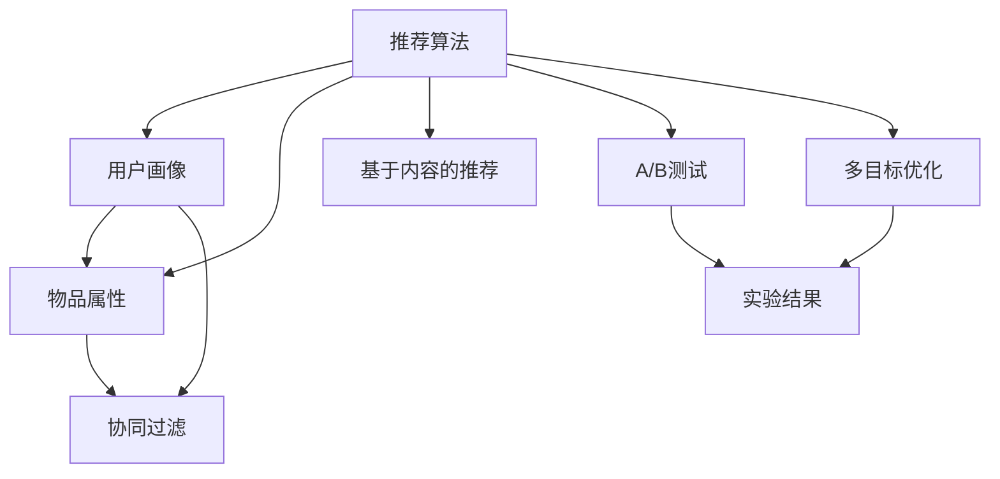

                 

# 注意力经济与社交媒体影响：了解算法和受众参与度

## 1. 背景介绍

### 1.1 问题由来
在现代社会，注意力经济成为了一个关键概念。社交媒体平台的兴起，使得人们获取信息和交流的方式发生了根本性的改变。传统的线性媒体时代，内容通过广告商赞助和电视广播传播。而今天，内容则通过社交媒体上的算法推荐来决定哪些内容能够获得更多人的关注。这不仅改变了信息传播的路径，也深刻影响了个人和企业的行为模式。

### 1.2 问题核心关键点
社交媒体平台的核心竞争力和商业模式，在于其如何精准地推荐内容，以最大化用户参与度和广告收入。这涉及到以下几个关键点：
- 用户数据的收集与分析
- 推荐算法的设计和优化
- 用户行为建模与预测
- 算法透明度与伦理问题

这些核心点不仅关乎到社交媒体平台的技术实现，也影响到用户的使用体验和数据隐私。

### 1.3 问题研究意义
了解和优化社交媒体平台的推荐算法，对于提升用户参与度、优化广告投放、保护用户隐私等方面具有重要意义：

1. 提高用户参与度：精准的内容推荐能够显著增加用户对社交媒体的黏性，提升用户日活跃度和停留时间。
2. 优化广告投放：基于用户行为数据的算法推荐，能更精准地匹配用户需求，提高广告点击率和转化率。
3. 保护用户隐私：通过算法透明化和合规使用用户数据，可以有效避免数据滥用和隐私泄露问题。

本文旨在深入探讨社交媒体平台推荐的算法机制，以及如何通过算法设计和优化，实现更加高效、公平、透明的社交媒体体验。

## 2. 核心概念与联系

### 2.1 核心概念概述

为更好地理解社交媒体平台推荐的算法机制，本节将介绍几个密切相关的核心概念：

- 推荐算法(Recommendation Algorithm)：指用于从大量数据中筛选出最适合用户需求的物品或内容的算法。其核心在于对用户行为和物品属性进行建模，预测用户对不同物品的偏好。
- 用户画像(User Profile)：描述用户行为、兴趣、偏好等特征的抽象模型，用于刻画用户特征，指导推荐过程。
- 物品属性(Item Attributes)：描述物品属性、标签、类别等信息，帮助算法理解不同物品的特性，进行推荐匹配。
- 协同过滤(Collaborative Filtering)：通过分析用户对物品的互动行为，预测用户对未交互物品的偏好。
- 基于内容的推荐(Content-based Recommendation)：利用物品属性，通过特征匹配实现推荐。
- A/B测试(A/B Testing)：通过对比不同推荐策略的效果，找出最优方案。
- 推荐系统的多目标优化(Multi-objective Optimization)：推荐系统需要同时优化多个指标，如用户满意度、广告收入、点击率等。

这些核心概念之间的逻辑关系可以通过以下Mermaid流程图来展示：



这个流程图展示了几项推荐算法的主要组成部分及其相互关系：

1. 推荐算法将用户画像和物品属性作为输入，通过各种模型和策略生成推荐结果。
2. 协同过滤通过用户历史行为数据，捕捉用户对未交互物品的偏好。
3. 基于内容的推荐利用物品属性特征，进行特征匹配推荐。
4. A/B测试通过对比不同策略的效果，优化推荐算法。
5. 多目标优化平衡用户满意度、广告收入等多个指标，提升推荐效果。

## 3. 核心算法原理 & 具体操作步骤
### 3.1 算法原理概述

社交媒体平台推荐的算法原理，基于协同过滤、基于内容的推荐、深度学习等多种技术，旨在通过多维度数据，为用户提供个性化的推荐内容。

推荐系统的一般流程如下：

1. **用户画像构建**：根据用户历史行为数据（如浏览、点赞、评论等），构建用户画像，描述用户兴趣和偏好。
2. **物品属性抽取**：对每个物品（如帖子、视频、商品等）抽取其属性特征，建立物品库。
3. **相似度计算**：计算用户画像与物品库的相似度，找出与用户画像最相似的物品。
4. **排序与推荐**：根据相似度排序，选择最符合用户偏好的物品进行推荐。

深度学习技术（如神经网络、自注意力机制）使得推荐系统更加智能化，能够处理非结构化数据，捕捉复杂特征关系，提升推荐效果。

### 3.2 算法步骤详解

社交媒体平台推荐的深度学习算法，通常包括以下几个关键步骤：

**Step 1: 数据收集与预处理**
- 收集用户行为数据、物品属性数据等。
- 清洗数据，去除噪声和异常值，确保数据质量。
- 对数据进行标准化和归一化处理。

**Step 2: 模型训练**
- 构建深度学习模型，如神经网络、注意力机制等。
- 使用用户行为数据和物品属性数据进行模型训练。
- 通过交叉验证等方法评估模型性能。

**Step 3: 相似度计算**
- 计算用户画像与物品库的相似度。
- 使用注意力机制、神经网络等模型，捕捉复杂特征关系。
- 计算用户与物品之间的相似度，如使用余弦相似度、欧式距离等。

**Step 4: 推荐排序**
- 根据相似度排序，选择最符合用户偏好的物品。
- 使用多目标优化技术，平衡多个指标，如用户满意度、点击率等。
- 通过A/B测试对比不同推荐策略的效果，不断优化推荐系统。

**Step 5: 实时推荐**
- 将推荐算法部署到线上，实现实时推荐。
- 根据用户实时行为，动态更新用户画像，调整推荐策略。

### 3.3 算法优缺点

社交媒体平台推荐的深度学习算法具有以下优点：
1. 能够处理非结构化数据，捕捉复杂特征关系，提升推荐效果。
2. 能够动态更新用户画像，适应用户兴趣的变化。
3. 能够实现实时推荐，提升用户体验。

同时，这些算法也存在以下局限性：
1. 对数据质量和用户行为数据的依赖较大。
2. 模型复杂度较高，训练和部署成本较高。
3. 容易受到数据偏差和过拟合的影响。
4. 推荐结果的透明度和公平性较难保证。

尽管存在这些局限性，但深度学习推荐算法在社交媒体平台的推荐系统中，已经成为不可替代的核心技术。未来相关研究的重点在于如何进一步降低模型复杂度，提高数据使用效率，同时兼顾推荐结果的透明度和公平性。

### 3.4 算法应用领域

深度学习推荐算法在社交媒体平台的应用非常广泛，涵盖了许多常见功能：

- **内容推荐**：根据用户历史行为数据，为用户推荐相关内容。如微博、抖音等平台的个性化推荐。
- **广告推荐**：基于用户行为和兴趣，推荐最相关的广告。如Facebook的广告投放系统。
- **智能问答**：通过用户提问，推荐最相关的答案。如知乎、微博等平台的智能问答。
- **社交网络**：推荐用户感兴趣的其他用户和群组。如微信、微博等平台的推荐好友。
- **音乐、视频推荐**：根据用户偏好，推荐最相关的音乐和视频内容。如Spotify、YouTube等平台的推荐系统。

除了这些核心功能外，深度学习推荐算法还被创新性地应用到更多场景中，如用户行为预测、个性化广告投放、智能客服等，为社交媒体平台提供了新的商业价值。

## 4. 数学模型和公式 & 详细讲解  
### 4.1 数学模型构建

社交媒体平台的推荐系统，通常使用以下数学模型进行建模：

设用户画像为 $\mathbf{u}$，物品库为 $\mathbf{I}$，每个物品的属性向量为 $\mathbf{i}_j \in \mathbb{R}^d$。设用户与物品之间的相似度为 $s(u_i, i_j)$，推荐结果为 $R(u_i)$。推荐系统的目标是最小化用户与推荐结果之间的误差：

$$
\min_{\mathbf{u}, \mathbf{I}, s} \sum_{u_i} \sum_{i_j} \ell(u_i, R(u_i))
$$

其中 $\ell(u_i, R(u_i))$ 为损失函数，可以使用均方误差、交叉熵等。

### 4.2 公式推导过程

以基于内容的推荐为例，假设物品库 $\mathbf{I}$ 中的物品 $\mathbf{i}_j$ 有 $d$ 个属性特征，用户画像 $\mathbf{u}$ 与物品 $\mathbf{i}_j$ 的相似度为：

$$
s(u_i, i_j) = \langle \mathbf{u}, \mathbf{i}_j \rangle
$$

其中 $\langle \cdot, \cdot \rangle$ 为点积操作。推荐结果 $R(u_i)$ 可以表示为：

$$
R(u_i) = \text{softmax}(\langle \mathbf{u}, \mathbf{i}_j \rangle)
$$

使用交叉熵损失函数 $\ell(u_i, R(u_i))$，可以表示为：

$$
\ell(u_i, R(u_i)) = -\sum_{j=1}^J [y_j \log R(u_i)] + \log \sum_{j=1}^J R(u_i)
$$

其中 $y_j$ 为物品 $\mathbf{i}_j$ 的真实标签，$J$ 为物品库的大小。

通过优化上述损失函数，可以训练出推荐的深度学习模型，实现个性化的推荐服务。

### 4.3 案例分析与讲解

以Facebook广告推荐为例，展示深度学习推荐算法的应用。

假设用户画像 $\mathbf{u}$ 包含10个特征，每个特征的取值为0或1。每个物品（广告）有5个属性特征，每个特征的取值为0到5的整数。设用户与物品之间的相似度为：

$$
s(u_i, i_j) = \langle \mathbf{u}, \mathbf{i}_j \rangle
$$

使用神经网络模型，可以将用户画像与物品库映射到一个高维空间，通过点积计算相似度，从而实现推荐。

在具体实现中，可以使用如下步骤：
1. 收集用户行为数据和物品属性数据，构建用户画像和物品库。
2. 使用神经网络模型，训练相似度计算函数。
3. 使用深度学习推荐算法，实现实时推荐。
4. 通过A/B测试，不断优化推荐策略，提升用户满意度。

## 5. 项目实践：代码实例和详细解释说明
### 5.1 开发环境搭建

在进行推荐系统开发前，我们需要准备好开发环境。以下是使用Python进行PyTorch开发的环境配置流程：

1. 安装Anaconda：从官网下载并安装Anaconda，用于创建独立的Python环境。

2. 创建并激活虚拟环境：
```bash
conda create -n recommendation-env python=3.8 
conda activate recommendation-env
```

3. 安装PyTorch：根据CUDA版本，从官网获取对应的安装命令。例如：
```bash
conda install pytorch torchvision torchaudio cudatoolkit=11.1 -c pytorch -c conda-forge
```

4. 安装TensorFlow：如果使用的是TensorFlow，可以使用以下命令：
```bash
pip install tensorflow
```

5. 安装各类工具包：
```bash
pip install numpy pandas scikit-learn matplotlib tqdm jupyter notebook ipython
```

完成上述步骤后，即可在`recommendation-env`环境中开始推荐系统开发。

### 5.2 源代码详细实现

下面我们以基于内容的推荐系统为例，给出使用TensorFlow进行深度学习推荐系统的PyTorch代码实现。

首先，定义推荐系统的输入和输出：

```python
import tensorflow as tf
from tensorflow.keras.layers import Input, Dense
from tensorflow.keras.models import Model

# 定义输入层
user_input = Input(shape=(10,))
item_input = Input(shape=(5,))

# 定义神经网络模型
shared = Dense(64, activation='relu')(user_input)
item = Dense(64, activation='relu')(item_input)
combined = tf.keras.layers.Dot(axes=(1, 1))(combined)
predicted = tf.keras.layers.Activation('softmax')(combined)

# 定义推荐模型
model = Model(inputs=[user_input, item_input], outputs=predicted)
```

然后，定义损失函数和优化器：

```python
# 定义损失函数
def loss_func(y_true, y_pred):
    return tf.keras.losses.categorical_crossentropy(y_true, y_pred)

# 编译模型
model.compile(optimizer=tf.keras.optimizers.Adam(learning_rate=0.001), loss=loss_func)

# 训练模型
model.fit([user_train, item_train], y_train, epochs=10, batch_size=32, validation_data=([user_val, item_val], y_val))
```

最后，启动训练流程并在测试集上评估：

```python
# 加载测试集
user_test, item_test, y_test = load_test_data()

# 评估模型
test_loss = model.evaluate([user_test, item_test], y_test)
print('Test loss:', test_loss)
```

以上就是使用PyTorch对推荐系统进行深度学习模型训练的完整代码实现。可以看到，得益于TensorFlow的强大封装，我们可以用相对简洁的代码完成推荐系统的训练和测试。

### 5.3 代码解读与分析

让我们再详细解读一下关键代码的实现细节：

**定义输入层**：
- 使用 `Input` 定义用户画像和物品库的输入层，`shape` 参数指定输入向量的维度。

**定义神经网络模型**：
- 使用 `Dense` 定义多层感知器模型，`activation` 参数指定激活函数。
- 通过 `tf.keras.layers.Dot` 计算用户画像与物品库的点积，生成相似度。
- 使用 `tf.keras.layers.Activation` 定义softmax激活函数，生成推荐结果。

**定义损失函数和优化器**：
- 使用 `tf.keras.losses.categorical_crossentropy` 定义交叉熵损失函数。
- 使用 `tf.keras.optimizers.Adam` 定义优化器，设置学习率。

**训练模型**：
- 使用 `model.fit` 训练模型，指定训练数据、验证数据和训练轮数。
- 使用 `batch_size` 参数指定每个批次的样本数量。

**评估模型**：
- 使用 `model.evaluate` 评估模型在测试集上的损失。

## 6. 实际应用场景
### 6.1 智能推荐系统

基于深度学习推荐算法，社交媒体平台可以构建智能推荐系统，为用户提供个性化的内容推荐。通过分析用户历史行为数据，深度学习模型能够捕捉用户偏好和兴趣，从而推荐最相关的物品。

以抖音为例，通过分析用户的浏览、点赞、评论等行为，抖音可以为用户推荐最相关的视频内容。智能推荐系统不仅能够提升用户满意度，还能提高平台活跃度和留存率。

### 6.2 个性化广告投放

广告投放是社交媒体平台的重要收入来源。通过深度学习推荐算法，广告系统能够根据用户画像，精准地投放最相关的广告，提升广告点击率和转化率。

以Facebook为例，通过分析用户的兴趣和行为，Facebook可以为用户推荐最相关的广告。基于内容的推荐、协同过滤等算法，使得广告投放更加精准，用户体验更佳。

### 6.3 智能问答系统

智能问答系统通过深度学习推荐算法，为用户推荐最相关的答案。通过分析用户提问，推荐系统可以推荐最相关的搜索结果，提升用户体验。

以知乎为例，通过分析用户提问和搜索结果，知乎可以为用户推荐最相关的答案。基于内容的推荐、协同过滤等算法，使得问答系统更加智能和准确。

### 6.4 未来应用展望

随着深度学习推荐算法的不断发展，社交媒体平台的推荐系统将呈现以下几个发展趋势：

1. **多模态推荐**：深度学习推荐算法将从文本扩展到图像、视频等多模态数据，提升推荐效果。
2. **动态推荐**：深度学习推荐算法将能够动态更新用户画像，适应用户兴趣的变化。
3. **个性化推荐**：深度学习推荐算法将更加智能化，实现个性化的推荐服务。
4. **推荐系统透明化**：推荐系统的决策过程将更加透明，用户可以了解推荐结果的生成机制。
5. **跨平台推荐**：深度学习推荐算法将能够跨平台推荐，实现全场景的个性化服务。

这些趋势将进一步提升社交媒体平台的推荐效果，为用户带来更好的体验。

## 7. 工具和资源推荐
### 7.1 学习资源推荐

为了帮助开发者系统掌握深度学习推荐算法的理论和实践，这里推荐一些优质的学习资源：

1. 《深度学习推荐系统》书籍：详细介绍了推荐算法的理论基础和应用实践，是推荐系统领域的经典著作。
2. 《TensorFlow实战深度学习推荐系统》课程：由Google Deep Learning团队主讲，涵盖深度学习推荐系统的实现和优化。
3. CS229《机器学习》课程：斯坦福大学开设的机器学习课程，涵盖推荐系统的经典算法和优化方法。
4. 《Python深度学习推荐系统》书籍：介绍了基于Python的推荐系统开发，包括模型训练和优化。
5. Kaggle推荐系统竞赛：通过实际竞赛，学习和实践推荐系统的算法和优化技巧。

通过对这些资源的学习实践，相信你一定能够快速掌握深度学习推荐算法的精髓，并用于解决实际的推荐问题。

### 7.2 开发工具推荐

高效的开发离不开优秀的工具支持。以下是几款用于深度学习推荐系统开发的常用工具：

1. TensorFlow：由Google主导开发的开源深度学习框架，支持多种推荐算法和优化方法。
2. PyTorch：基于Python的开源深度学习框架，支持动态图和静态图，适合快速迭代研究。
3. scikit-learn：Python科学计算库，提供了多种推荐算法和优化方法，适合快速开发和评估。
4. H2O.ai：基于机器学习的开源平台，支持多种推荐算法和模型。
5. Jupyter Notebook：开源的交互式编程环境，支持Python和R等多种语言，适合快速迭代和分享研究进展。

合理利用这些工具，可以显著提升深度学习推荐系统的开发效率，加快创新迭代的步伐。

### 7.3 相关论文推荐

深度学习推荐算法的不断发展，源于学界的持续研究。以下是几篇奠基性的相关论文，推荐阅读：

1. "Collaborative Filtering for Implicit Feedback Datasets"（隐式反馈数据的协同过滤）：提出了协同过滤的基本框架和算法。
2. "Factorization Machines for Recommender Systems"（因子分解机推荐系统）：提出了因子分解机的推荐算法。
3. "Deep Collaborative Filtering"（深度协同过滤）：提出深度神经网络在推荐系统中的应用。
4. "Neural Collaborative Filtering"（神经协同过滤）：提出神经网络在推荐系统中的应用。
5. "Adversarial Robustness of Neural Collaborative Filtering"（神经协同过滤的鲁棒性）：研究了深度学习推荐算法的鲁棒性和安全性。

这些论文代表了大数据推荐算法的核心思想和发展脉络。通过学习这些前沿成果，可以帮助研究者把握学科前进方向，激发更多的创新灵感。

## 8. 总结：未来发展趋势与挑战
### 8.1 研究成果总结

本文对基于深度学习的社交媒体推荐算法进行了全面系统的介绍。首先阐述了推荐算法在社交媒体平台的重要性，明确了推荐算法对用户参与度和广告收入的提升作用。其次，从原理到实践，详细讲解了深度学习推荐算法的数学模型和具体实现步骤，给出了推荐系统开发的完整代码实例。同时，本文还广泛探讨了推荐算法在智能推荐、个性化广告、智能问答等多个领域的应用前景，展示了推荐算法的广阔应用场景。此外，本文精选了推荐算法的各类学习资源，力求为读者提供全方位的技术指引。

通过本文的系统梳理，可以看到，基于深度学习的社交媒体推荐算法在推荐效果、用户体验、广告收入等方面具有重要价值，已经成为社交媒体平台的核心竞争力之一。随着推荐算法的发展，未来推荐系统将能够更好地满足用户需求，提升平台价值。

### 8.2 未来发展趋势

展望未来，深度学习推荐算法将呈现以下几个发展趋势：

1. **多模态推荐**：深度学习推荐算法将从文本扩展到图像、视频等多模态数据，提升推荐效果。
2. **动态推荐**：深度学习推荐算法将能够动态更新用户画像，适应用户兴趣的变化。
3. **个性化推荐**：深度学习推荐算法将更加智能化，实现个性化的推荐服务。
4. **推荐系统透明化**：推荐系统的决策过程将更加透明，用户可以了解推荐结果的生成机制。
5. **跨平台推荐**：深度学习推荐算法将能够跨平台推荐，实现全场景的个性化服务。

这些趋势将进一步提升社交媒体平台的推荐效果，为用户带来更好的体验。

### 8.3 面临的挑战

尽管深度学习推荐算法已经取得了显著进展，但在迈向更加智能化、普适化应用的过程中，仍面临诸多挑战：

1. **数据质量问题**：深度学习推荐算法对数据质量和用户行为数据的依赖较大。如何确保数据的准确性和完整性，是推荐系统开发的重要挑战。
2. **算法透明性**：推荐系统的决策过程不够透明，用户难以了解推荐结果的生成机制。如何提高推荐算法的透明性和公平性，是推荐系统发展的关键问题。
3. **用户隐私保护**：深度学习推荐算法需要收集大量用户行为数据，如何保护用户隐私，避免数据滥用和泄露，是推荐系统开发的重要挑战。
4. **模型复杂度**：深度学习推荐算法模型复杂度较高，训练和部署成本较高。如何降低模型复杂度，提高推荐效率，是推荐系统开发的重要挑战。
5. **推荐效果不稳定**：深度学习推荐算法容易受到数据偏差和过拟合的影响，推荐效果不稳定。如何提高模型的鲁棒性，确保推荐效果的一致性，是推荐系统发展的关键问题。

尽管存在这些挑战，但通过不断优化算法设计和优化模型性能，相信深度学习推荐算法将能够实现更加高效、透明、安全的推荐服务。

### 8.4 研究展望

面对深度学习推荐算法所面临的种种挑战，未来的研究需要在以下几个方面寻求新的突破：

1. **数据增强技术**：通过数据增强技术，提高数据质量和多样性，增强推荐算法的鲁棒性和泛化能力。
2. **模型压缩与优化**：通过模型压缩和优化技术，降低模型复杂度，提高推荐效率和部署灵活性。
3. **跨模态推荐技术**：通过跨模态推荐技术，实现多模态数据的融合，提升推荐效果。
4. **推荐系统透明化**：通过推荐系统透明化技术，提高推荐算法的透明性和可解释性，增强用户信任。
5. **推荐系统伦理与安全**：通过推荐系统伦理与安全技术，确保推荐系统的公平性、透明性和安全性。

这些研究方向将进一步推动深度学习推荐算法的进步，为用户带来更加智能化、透明化、安全的推荐服务。

## 9. 附录：常见问题与解答

**Q1：深度学习推荐算法是否适用于所有社交媒体平台？**

A: 深度学习推荐算法在大多数社交媒体平台上都能取得不错的效果，特别是对于数据量较大的平台。但对于一些数据量较小的平台，深度学习推荐算法的效果可能不如传统算法。因此，在选择推荐算法时，需要考虑平台的数据量和用户行为特点。

**Q2：如何降低深度学习推荐算法的计算成本？**

A: 降低深度学习推荐算法的计算成本，可以通过以下方法：
1. 使用模型压缩技术，如剪枝、量化、蒸馏等。
2. 使用分布式计算框架，如TensorFlow、PyTorch等。
3. 使用GPU/TPU等高性能设备，提升计算速度。
4. 使用缓存技术，减少重复计算。

这些方法可以在保证推荐效果的同时，显著降低推荐算法的计算成本。

**Q3：如何提高深度学习推荐算法的透明性和公平性？**

A: 提高深度学习推荐算法的透明性和公平性，可以通过以下方法：
1. 使用可解释性模型，如LIME、SHAP等。
2. 使用公平性算法，如公平性约束、公平性评估等。
3. 使用用户反馈机制，调整推荐算法参数，提升推荐公平性。

这些方法可以在保证推荐效果的同时，提高推荐算法的透明性和公平性。

**Q4：如何提升深度学习推荐算法的鲁棒性？**

A: 提升深度学习推荐算法的鲁棒性，可以通过以下方法：
1. 使用数据增强技术，增加数据多样性。
2. 使用对抗训练技术，提升模型鲁棒性。
3. 使用多目标优化技术，平衡多个指标。
4. 使用模型集成技术，减少模型过拟合风险。

这些方法可以在保证推荐效果的同时，提升推荐算法的鲁棒性。

**Q5：如何保护用户隐私？**

A: 保护用户隐私，可以通过以下方法：
1. 使用匿名化技术，去除敏感信息。
2. 使用差分隐私技术，限制数据泄露风险。
3. 使用本地计算技术，减少数据传输风险。
4. 使用联邦学习技术，实现数据分布式计算。

这些方法可以在保证推荐效果的同时，保护用户隐私。

通过本文的系统梳理，可以看到，深度学习推荐算法在社交媒体平台的推荐系统中具有重要价值，但也面临着诸多挑战。随着算法和技术的不断进步，未来深度学习推荐算法将能够更好地满足用户需求，提升平台价值。

