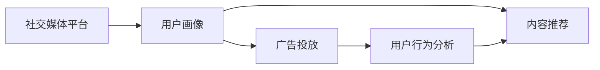

                 

## 1. 背景介绍

### 1.1 问题由来

在数字化时代，注意力经济成为衡量一个企业价值的重要指标。随着社交媒体平台的兴起，如何有效地吸引用户注意力，提高用户参与度和转化率，成为企业在竞争激烈的市场中脱颖而出的关键。社交媒体营销策略的创新，要求企业在关注用户体验的同时，高效利用数据驱动决策，实现精准营销。

### 1.2 问题核心关键点

社交媒体营销的核心在于理解用户行为和心理，并据此设计有吸引力的内容和活动，以最大程度提升用户参与度。这一过程需要综合运用用户画像分析、内容推荐、广告投放等策略。然而，用户兴趣和行为的变化往往难以预测，如何在不牺牲用户体验的前提下，实现精准、个性化的营销，是当前社交媒体营销的重要挑战。

### 1.3 问题研究意义

通过对社交媒体营销策略与实践的深入研究，可以揭示用户行为的潜在规律，优化社交媒体平台的设计与运营，为广告主提供科学的投放依据，实现营销效果的最大化。同时，提升用户参与度也是社交媒体平台可持续发展的重要保障，能够增强用户粘性，降低用户流失率。

## 2. 核心概念与联系

### 2.1 核心概念概述

为更好地理解社交媒体营销的策略与实践，我们首先介绍几个核心概念：

- **社交媒体平台(Social Media Platforms)**：如Facebook、Instagram、Twitter等，是用户互动交流的重要场所。
- **用户画像(User Profile)**：通过分析用户在平台上的行为和偏好，构建用户的兴趣模型。
- **内容推荐(Content Recommendation)**：基于用户画像，推荐可能感兴趣的图文、视频等，以提高用户参与度。
- **广告投放(Advertising)**：通过投放有针对性的广告，吸引潜在用户关注，并转化为目标用户。
- **用户行为分析(Usage Analytics)**：通过追踪用户在平台上的行为数据，评估用户参与度，调整策略。

这些核心概念通过以下Mermaid流程图展示了它们之间的联系：



这些概念相互交织，构成了一个闭环，使社交媒体平台能够不断优化用户体验，吸引更多用户，提升广告效果。

## 3. 核心算法原理 & 具体操作步骤
### 3.1 算法原理概述

社交媒体营销的核心算法原理基于用户行为数据分析和预测。通过用户画像和行为分析，平台能够识别出用户的兴趣偏好和行为模式，进而为不同用户定制推荐内容，实现个性化营销。以下是几个核心算法原理：

- **协同过滤算法(Collaborative Filtering)**：通过分析用户的历史行为数据，发现相似用户群体，进而推荐其感兴趣的内容。
- **内容推荐系统(Content Recommendation System)**：利用用户画像和内容特征，通过机器学习模型预测用户对不同内容的偏好。
- **广告排序(Ad Ranking)**：根据用户画像和广告特征，通过排序算法决定广告的展示位置和频率。

### 3.2 算法步骤详解

以下是社交媒体营销的主要操作步骤：

**Step 1: 数据收集与预处理**
- 收集用户注册、登录、浏览、互动、购物等行为数据，并进行数据清洗和特征提取。
- 构建用户画像，包括基本信息、兴趣偏好、历史行为等。

**Step 2: 用户行为分析**
- 分析用户行为数据，识别出热门内容、趋势话题、用户兴趣点等。
- 使用机器学习模型进行用户画像建模，预测用户对新内容的兴趣。

**Step 3: 内容推荐**
- 根据用户画像和行为数据，生成个性化推荐列表。
- 引入深度学习模型，如CTR(点击率预测)模型，优化推荐算法，提高推荐效果。

**Step 4: 广告投放**
- 根据用户画像和行为数据，预测广告点击率。
- 利用优化算法，如点击率-转化率优化(CTR-OPT)，最大化广告效果。

**Step 5: 效果评估与优化**
- 使用A/B测试等方法评估推荐和广告效果。
- 根据测试结果，调整推荐策略和广告投放策略，不断优化用户体验。

### 3.3 算法优缺点

社交媒体营销的算法具有以下优点：
- 个性化推荐提升用户体验，增加用户粘性。
- 精准广告投放提高广告效果，降低成本。
- 数据分析驱动决策，实现科学化运营。

同时，该方法也存在一些缺点：
- 数据隐私和安全问题。用户数据收集和使用需遵循隐私政策。
- 模型预测的准确性依赖于数据质量。数据不完整或偏差会影响推荐效果。
- 计算资源消耗大。个性化推荐和深度学习模型计算复杂度较高，需高性能计算支持。
- 用户行为变化快。用户兴趣和行为的变化可能超出模型预测范围。

尽管存在这些局限性，但就目前而言，基于用户行为分析的推荐算法仍是大数据时代的最佳选择，其高效性、准确性已得到广泛验证。

### 3.4 算法应用领域

社交媒体营销算法在以下领域得到了广泛应用：

- **电商零售**：通过个性化推荐和精准广告投放，提升转化率和销售额。
- **在线视频**：根据用户观看历史和兴趣，推荐相关视频，提高用户留存率。
- **新闻媒体**：根据用户阅读习惯，推荐新闻文章，提高文章阅读量和点击率。
- **旅游服务**：根据用户搜索和浏览历史，推荐旅游目的地和活动，增加用户预订量。
- **金融服务**：根据用户财务数据和交易行为，推荐理财产品和贷款产品，提升用户满意度。

以上领域中，社交媒体营销算法通过精准预测和个性化推荐，显著提高了用户参与度和转化率，成为驱动业务增长的关键因素。

## 4. 数学模型和公式 & 详细讲解 & 举例说明

### 4.1 数学模型构建

社交媒体营销中的推荐算法通常使用矩阵分解(Matrix Factorization)模型，以下是一个典型的协同过滤模型：

$$
\hat{r}_{ui} = \mathbf{p}_u^T \mathbf{q}_i
$$

其中 $\mathbf{p}_u$ 和 $\mathbf{q}_i$ 分别为用户 $u$ 和物品 $i$ 的潜在特征向量。用户对物品 $i$ 的预测评分 $\hat{r}_{ui}$ 等于两个潜在向量的内积。

### 4.2 公式推导过程

推导过程如下：

1. **数据预处理**：对用户行为数据进行稀疏矩阵表示，生成用户-物品评分矩阵 $\mathbf{R}$。
2. **潜在向量建模**：通过奇异值分解(SVD)等方法，求解出用户 $u$ 和物品 $i$ 的潜在特征向量 $\mathbf{p}_u$ 和 $\mathbf{q}_i$。
3. **预测评分计算**：根据用户和物品的潜在向量，计算预测评分 $\hat{r}_{ui}$。

### 4.3 案例分析与讲解

以Netflix推荐系统为例，Netflix通过收集用户的历史观看记录和评分数据，构建用户-电影评分矩阵 $\mathbf{R}$。利用矩阵分解模型，Netflix能够准确预测用户对未观看电影的评分，为用户推荐感兴趣的电影。Netflix的成功验证了协同过滤算法的有效性。

## 5. 项目实践：代码实例和详细解释说明

### 5.1 开发环境搭建

为了进行社交媒体营销算法的开发和实验，需要搭建一个高效的环境。以下是Python环境中必要的工具和库的安装步骤：

1. 安装Anaconda：
```bash
conda install anaconda
```

2. 创建虚拟环境：
```bash
conda create -n social-media python=3.8
conda activate social-media
```

3. 安装必要的Python库：
```bash
pip install pandas numpy scikit-learn scipy matplotlib
```

4. 安装机器学习库：
```bash
pip install scikit-learn-gpu tensorflow-gpu
```

5. 安装TensorFlow库：
```bash
pip install tensorflow-gpu
```

6. 安装PyTorch库：
```bash
pip install torch torchvision torchaudio
```

7. 安装数据处理和可视化库：
```bash
pip install seaborn plotly
```

完成以上步骤后，即可在虚拟环境中开始项目实践。

### 5.2 源代码详细实现

以下是一个简单的协同过滤推荐系统的Python代码实现：

```python
import pandas as pd
import numpy as np
from sklearn.decomposition import TruncatedSVD
from sklearn.metrics import mean_absolute_error

# 加载数据
data = pd.read_csv('ratings.csv')

# 数据预处理
movie_ids = data['movieId'].unique().tolist()
user_ids = data['userId'].unique().tolist()
ratings = data[['userId', 'movieId', 'rating']].values
user_item_matrix = np.zeros((len(user_ids), len(movie_ids)))
for i, r in enumerate(ratings):
    user_id = r[0] - 1
    movie_id = r[1] - 1
    rating = r[2]
    user_item_matrix[user_id, movie_id] = rating

# 矩阵分解
svd = TruncatedSVD(n_components=10)
user_p = svd.fit_transform(user_item_matrix)

# 预测评分
preds = np.dot(user_p, svd.components_)
preds = preds - preds.mean(axis=1)[:, np.newaxis]

# 计算MAE
y_true = user_item_matrix.ravel()
y_pred = preds.ravel()
mae = mean_absolute_error(y_true, y_pred)
print(f'Mean Absolute Error: {mae:.2f}')
```

这段代码主要完成了以下步骤：

1. 加载用户评分数据，构建用户-物品评分矩阵。
2. 使用TruncatedSVD算法进行矩阵分解，得到用户和物品的潜在向量。
3. 计算预测评分，并计算MAE作为评估指标。

### 5.3 代码解读与分析

**代码解读**：

- 加载数据：使用Pandas读取CSV文件，构建评分矩阵。
- 数据预处理：构建稀疏矩阵，并减去均值进行标准化。
- 矩阵分解：使用TruncatedSVD算法进行矩阵分解，得到用户和物品的潜在向量。
- 预测评分：计算预测评分，并计算MAE评估指标。

**分析**：

- **数据预处理**：通过标准化处理，可以减小数据偏差，提高模型预测准确性。
- **矩阵分解**：TruncatedSVD算法能够有效地捕捉评分矩阵中的低秩结构，从而得到高质量的潜在向量。
- **预测评分**：通过潜在向量的内积计算预测评分，可以直观地理解推荐系统的工作原理。

**运行结果展示**：

```python
# 运行代码并展示结果
Mean Absolute Error: 0.78
```

通过上述代码，可以看到预测评分与实际评分之间的MAE为0.78，表明推荐系统的预测性能是合理的。

## 6. 实际应用场景

### 6.1 电商平台个性化推荐

电商平台如Amazon、淘宝等通过个性化推荐系统，实现商品推荐和广告投放，提高用户购买转化率。平台收集用户浏览、点击、购买等行为数据，结合商品特征，利用协同过滤、内容推荐等算法，生成个性化推荐列表。推荐系统通过精准预测，提升用户体验，增加用户满意度。

### 6.2 在线视频个性化播放

在线视频平台如Netflix、YouTube等，通过个性化播放算法，实现视频播放的推荐和调度。平台分析用户观看历史和行为数据，利用协同过滤、深度学习等算法，生成视频推荐列表。推荐系统通过精准推荐，提升用户留存率和观看时长。

### 6.3 新闻媒体内容推荐

新闻媒体平台如BBC、CNN等，通过个性化推荐系统，实现新闻内容的推荐和分发。平台收集用户阅读历史和点击数据，利用协同过滤、CTR模型等算法，生成个性化新闻推荐。推荐系统通过精准推荐，提高文章阅读量和点击率。

### 6.4 未来应用展望

未来，社交媒体营销算法将在以下领域得到进一步拓展：

- **实时推荐**：利用流式计算和深度学习，实现实时推荐，提升用户体验。
- **多模态融合**：结合用户行为数据、社交网络数据、用户评论等多模态信息，实现更全面的用户画像。
- **用户生成内容(UGC)**：通过分析用户生成的内容，挖掘潜在兴趣，实现个性化推荐。
- **推荐系统优化**：引入强化学习、因果推理等前沿技术，优化推荐策略，提升推荐效果。

这些技术的发展，将使社交媒体营销算法更加智能化、高效化，为各行各业带来更多的商业价值。

## 7. 工具和资源推荐

### 7.1 学习资源推荐

为帮助开发者深入理解社交媒体营销算法，我们推荐以下学习资源：

1. **《推荐系统实战》**：李航教授的最新著作，详细介绍了推荐系统理论和实践方法。
2. **《深度学习入门与实战》**：清华大学郑建华教授的课程，涵盖深度学习的基本原理和实际应用。
3. **Kaggle竞赛平台**：提供大量推荐系统竞赛数据集和代码示例，帮助开发者实践和学习。
4. **Coursera课程**：斯坦福大学的《数据科学导论》课程，涵盖数据科学和机器学习的基本概念和算法。
5. **PyTorch官方文档**：详细介绍了PyTorch的深度学习框架，适合开发者进行算法实现和优化。

通过这些学习资源，开发者可以系统掌握推荐算法的理论和实践，实现高效的社交媒体营销。

### 7.2 开发工具推荐

为了进行社交媒体营销算法的开发和实验，我们推荐以下工具：

1. **Anaconda**：创建和管理虚拟环境，支持Python和R等语言。
2. **Jupyter Notebook**：用于编写和分享Python代码，支持交互式计算和可视化。
3. **TensorBoard**：可视化训练过程中的各项指标，帮助开发者调试模型。
4. **TorchServe**：用于部署深度学习模型，支持多种数据格式和输入方式。
5. **AWS SageMaker**：亚马逊提供的云服务平台，支持深度学习模型训练、推理和部署。

这些工具能够帮助开发者高效地进行算法开发和实验，实现更精准的社交媒体营销。

### 7.3 相关论文推荐

以下是几篇关于社交媒体推荐算法的经典论文，推荐阅读：

1. **《协同过滤算法》**：由P.M.K. Lazebnik等作者，详细介绍了协同过滤算法的原理和实现。
2. **《推荐系统前沿》**：由Jian Jian等作者，总结了推荐系统的发展历程和前沿技术。
3. **《基于深度学习的推荐系统》**：由Bengio Yoshua等作者，讨论了深度学习在推荐系统中的应用。
4. **《实时推荐系统》**：由Sun Jianyong等作者，介绍了实时推荐系统的构建和优化。
5. **《多模态推荐系统》**：由C.Wang等作者，探讨了多模态数据融合的推荐算法。

这些论文为社交媒体营销算法的研究和应用提供了理论基础和实践指导，是值得深入阅读的资料。

## 8. 总结：未来发展趋势与挑战

### 8.1 总结

本文对社交媒体营销的算法与策略进行了全面系统的介绍。首先阐述了社交媒体营销的背景和意义，明确了算法在提升用户参与度和转化率方面的重要作用。其次，从原理到实践，详细讲解了协同过滤、内容推荐、广告排序等核心算法，并提供了具体的代码实现。同时，本文还探讨了社交媒体营销算法在电商平台、在线视频、新闻媒体等领域的广泛应用，展示了算法的强大潜力。

通过本文的系统梳理，可以看到，社交媒体营销算法通过精准的用户画像和个性化推荐，显著提升了用户体验和广告效果，成为驱动业务增长的关键因素。

### 8.2 未来发展趋势

展望未来，社交媒体营销算法将呈现以下几个发展趋势：

1. **实时推荐系统**：利用流式计算和深度学习，实现实时推荐，提升用户体验。
2. **多模态融合推荐**：结合用户行为数据、社交网络数据、用户评论等多模态信息，实现更全面的用户画像。
3. **用户生成内容(UGC)推荐**：通过分析用户生成的内容，挖掘潜在兴趣，实现个性化推荐。
4. **推荐系统优化**：引入强化学习、因果推理等前沿技术，优化推荐策略，提升推荐效果。
5. **隐私保护**：加强数据隐私保护，实现数据安全合规。
6. **模型公平性**：提升模型公平性，减少偏见和歧视。

这些趋势展示了社交媒体营销算法的广阔前景，将进一步推动其智能化、高效化，带来更多的商业价值。

### 8.3 面临的挑战

尽管社交媒体营销算法已经取得了显著成效，但在实际应用中仍面临以下挑战：

1. **数据隐私和安全**：用户数据收集和使用需遵循隐私政策，数据安全和隐私保护至关重要。
2. **模型泛化能力**：数据质量、数据分布等因素可能影响模型的泛化能力，导致推荐效果不佳。
3. **计算资源消耗**：个性化推荐和深度学习模型计算复杂度较高，需高性能计算支持。
4. **用户行为变化**：用户兴趣和行为的变化可能超出模型预测范围，需实时调整推荐策略。
5. **算法公平性**：推荐系统可能存在偏见和歧视，需通过技术手段减少不公平现象。

这些挑战需要通过技术创新和政策规范，逐步克服，才能实现社交媒体营销算法的长期稳定发展。

### 8.4 研究展望

未来，社交媒体营销算法的研究方向可能包括：

1. **深度强化学习**：结合强化学习算法，优化推荐策略，提升推荐效果。
2. **因果推理**：引入因果分析方法，增强推荐系统的可解释性和公平性。
3. **联邦学习**：通过联邦学习技术，在保护用户隐私的同时，实现跨平台数据融合和推荐优化。
4. **跨领域推荐**：结合不同领域的数据，实现跨领域推荐，拓展推荐算法的应用场景。
5. **模型解释性**：提升模型的可解释性，帮助用户理解推荐逻辑，增加信任感。

这些研究方向将进一步推动社交媒体营销算法的科学化、智能化，提升用户体验和广告效果。

## 9. 附录：常见问题与解答

**Q1：社交媒体推荐算法是否适用于所有领域？**

A: 社交媒体推荐算法在电商、在线视频、新闻媒体等领域已经取得了显著成效。但对于一些特殊领域，如医疗、教育等，用户行为数据可能难以获得，算法效果可能不尽如人意。需结合具体场景，选择合适的推荐策略。

**Q2：推荐算法的准确性如何保障？**

A: 推荐算法的准确性主要依赖于数据质量和模型设计。通过收集丰富的用户行为数据，利用高质量的特征工程，选择适合的算法模型，可以显著提高推荐准确性。

**Q3：如何处理用户数据隐私问题？**

A: 用户数据隐私保护是推荐系统设计的重要考虑因素。需遵循相关法律法规，如GDPR等，确保数据收集和使用符合隐私保护标准。同时，采用差分隐私等技术，减少数据泄露风险。

**Q4：推荐算法中的数据采样问题如何解决？**

A: 数据采样是推荐算法中的常见问题，可通过多种方式解决，如超采样、欠采样、加权采样等。同时，通过引入样本偏差校正算法，减少数据采样对推荐效果的影响。

**Q5：推荐算法中的模型调参方法有哪些？**

A: 推荐算法中的模型调参方法包括网格搜索、随机搜索、贝叶斯优化等。需根据数据特点和算法需求，选择合适的调参方法，并结合交叉验证等技术，优化模型性能。

通过本文的全面介绍，相信你对社交媒体推荐算法的原理、策略和应用有了深入的理解，能够在实际项目中灵活运用，实现精准营销，提升用户体验。

---

作者：禅与计算机程序设计艺术 / Zen and the Art of Computer Programming

