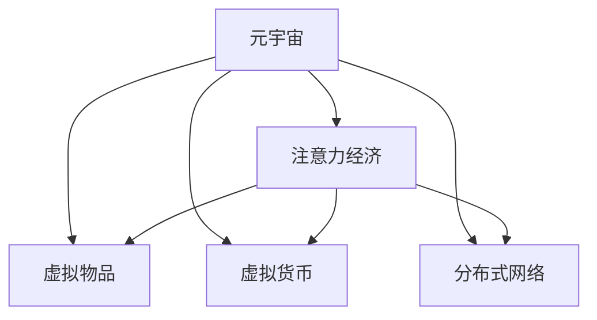

                 

# 注意力经济在元宇宙中的演变与应用

> 关键词：元宇宙,注意力经济,用户体验,虚拟经济,分布式网络

## 1. 背景介绍

### 1.1 问题由来
随着移动互联网的普及和人工智能技术的飞速发展，注意力经济（Attention Economy）已成为一种重要的商业模式和资源。在数字时代，用户注意力成为稀缺资源，成为广告、媒体、电商等多个行业的核心竞争要素。元宇宙作为新一代的互联网形态，不仅提供了全新的交互体验，还提供了更多元、更丰富的注意力场景。

在元宇宙中，用户不仅能够在虚拟世界中进行娱乐、社交，还可以参与到各类经济活动中，形成一种全新的注意力经济生态。然而，随着元宇宙的快速发展，注意力经济的内涵和形式也在不断演变，如何更好地理解和应用这一经济模式，成为元宇宙领域的重要课题。

### 1.2 问题核心关键点
注意力经济在元宇宙中的应用，核心在于如何通过虚拟场景、虚拟物品、虚拟社交等手段，吸引和留住用户的注意力，从而创造经济价值。元宇宙中的注意力经济具有以下特点：

1. **虚拟化**：用户注意力转移至虚拟世界，从现实世界的商业逻辑向虚拟世界的虚拟资产价值转移。
2. **交互性**：用户通过沉浸式体验，与虚拟世界产生深度互动，提高注意力留存率。
3. **去中心化**：元宇宙中的经济活动不受中心化平台的限制，更加灵活自由。
4. **经济生态**：通过虚拟物品交易、虚拟货币流通等方式，形成多样化的经济活动和利益分配机制。
5. **用户体验**：通过不断优化用户体验，提高用户粘性，增强用户对虚拟经济的认同感。

这些特点使得元宇宙中的注意力经济成为一种新型的经济模式，具有广阔的商业潜力和社会价值。

### 1.3 问题研究意义
研究元宇宙中的注意力经济，对于拓展元宇宙的应用场景、提升用户参与度、推动虚拟经济的发展具有重要意义：

1. **促进虚拟经济繁荣**：通过吸引和留住用户注意力，元宇宙中的虚拟经济将更加活跃，形成更加丰富的商业模式和产业链。
2. **提升用户体验**：通过深度交互和沉浸式体验，元宇宙将提供更优质、更个性化的用户体验，增强用户对虚拟世界的认同感。
3. **推动社会数字化转型**：元宇宙中的注意力经济将为社会数字化转型提供新的动力，加速各行业数字化升级。
4. **驱动技术创新**：研究注意力经济的内在规律和应用模式，将促进人工智能、虚拟现实、区块链等前沿技术的发展。

## 2. 核心概念与联系

### 2.1 核心概念概述

为了更好地理解元宇宙中注意力经济的应用，本节将介绍几个核心概念：

- **元宇宙**：由多个互连的虚拟世界构成的连续的、沉浸式的互联网生态，具备高度的交互性、现实性和体验性。
- **注意力经济**：一种基于用户注意力的商业模式，通过吸引和引导用户注意力，创造经济价值。
- **虚拟物品**：元宇宙中存在的各类虚拟资产，如虚拟地产、数字艺术、游戏装备等，是注意力经济的重要载体。
- **虚拟货币**：元宇宙中流通的数字货币，如Decentraland的MANA、The Sandbox的SAND等，用于支付和交易。
- **分布式网络**：元宇宙的基础架构，通过区块链技术实现的去中心化网络，保障了数据的安全和透明。

这些概念之间的逻辑关系可以通过以下Mermaid流程图来展示：



这个流程图展示了大语言模型的核心概念及其之间的关系：

1. 元宇宙通过虚拟物品、虚拟货币、分布式网络等基础组件，为注意力经济提供了实现平台。
2. 注意力经济的核心是吸引和留住用户注意力，通过虚拟物品和虚拟货币的交易流通，形成经济活动。
3. 虚拟物品和虚拟货币是注意力经济的重要载体，通过交易实现经济价值的转移。
4. 分布式网络为注意力经济提供了基础设施，保障了经济活动的透明性和安全性。

这些概念共同构成了元宇宙中注意力经济的框架，为其在各应用场景中的落地提供了理论基础。

## 3. 核心算法原理 & 具体操作步骤
### 3.1 算法原理概述

元宇宙中的注意力经济，主要依赖于虚拟物品的交易和流通，以及虚拟货币的支付和流转。在技术实现上，主要涉及以下几个关键环节：

1. **虚拟物品生成**：利用3D建模、人工智能等技术，生成各类虚拟物品。
2. **虚拟物品交易**：通过区块链等技术，实现虚拟物品的交易和所有权转移。
3. **虚拟货币发行与流通**：设计并发行虚拟货币，用于支付和交易。
4. **用户互动与反馈**：通过用户互动和反馈，优化虚拟物品和虚拟货币的设计，提升用户满意度。

元宇宙中的注意力经济，本质上是一种虚拟经济系统，其算法原理与现实世界的经济系统有相似之处，但又有显著的区别。例如，虚拟物品的生成和交易，需要考虑更多的用户交互和个性化需求。

### 3.2 算法步骤详解

以下将详细介绍元宇宙中注意力经济的核心算法步骤：

**Step 1: 虚拟物品生成**
- 使用3D建模软件，生成各类虚拟物品。例如，通过Blender、Maya等软件，设计建筑、家具、服装等虚拟物品。
- 利用人工智能技术，生成具有个性化特点的虚拟物品。例如，使用GAN生成具有独特风格的虚拟艺术品，或通过NLP生成个性化的虚拟文本。
- 将生成的虚拟物品上传到元宇宙平台，形成虚拟物品库。

**Step 2: 虚拟物品交易**
- 设计虚拟物品的交易平台，例如Decentraland、The Sandbox等。
- 采用区块链技术，记录虚拟物品的交易记录，保障交易的透明性和安全性。
- 设计虚拟货币作为交易媒介，例如MANA、SAND等，用于支付和交易。
- 提供虚拟物品的买卖、租赁、交换等多种交易方式，满足用户的不同需求。

**Step 3: 虚拟货币发行与流通**
- 设计虚拟货币，例如发行MANA、SAND等，作为元宇宙中的交易媒介。
- 设定虚拟货币的发行量、流通规则和价值波动机制。
- 提供虚拟货币的挖矿、铸造、兑换等多种获取方式，增加货币的流动性和价值稳定性。
- 通过虚拟货币支付和交易，实现虚拟物品的价值转移。

**Step 4: 用户互动与反馈**
- 通过用户反馈机制，收集用户对虚拟物品和虚拟货币的评价和建议。
- 根据用户反馈，优化虚拟物品和虚拟货币的设计，提升用户体验。
- 通过用户行为分析，了解用户对虚拟物品和虚拟货币的需求和偏好。
- 根据用户需求，动态调整虚拟物品和虚拟货币的供应和价格。

### 3.3 算法优缺点

元宇宙中的注意力经济具有以下优点：

1. **灵活多样**：用户可以根据自己的需求，设计和交易各种虚拟物品，满足个性化需求。
2. **去中心化**：采用区块链技术，保障了虚拟物品和虚拟货币的交易透明性和安全性，避免了中心化平台的干预。
3. **沉浸式体验**：通过虚拟物品的交易和流通，提高了用户的沉浸式体验，增强了用户对虚拟世界的认同感。
4. **经济活跃**：虚拟物品和虚拟货币的交易和流通，推动了元宇宙中的经济活动，形成了新的经济增长点。

但同时也存在一些缺点：

1. **安全风险**：虚拟物品和虚拟货币的交易存在安全风险，用户容易受到网络钓鱼、虚假交易等欺诈行为的侵害。
2. **价值波动**：虚拟货币的价值不稳定，容易受到市场供需、技术发展等多种因素的影响。
3. **技术门槛**：虚拟物品和虚拟货币的交易需要一定的技术门槛，用户需要了解相关技术和规则。
4. **生态不完善**：目前元宇宙中的注意力经济生态还不够完善，用户数量和交易规模有限。

尽管存在这些缺点，但元宇宙中的注意力经济依然具有广阔的发展前景，需要从技术、政策和用户教育等多个方面进行完善。

### 3.4 算法应用领域

元宇宙中的注意力经济，已经在多个领域得到了广泛应用，例如：

1. **虚拟地产交易**：在元宇宙中购买、出售虚拟地产，例如Decentraland中的 parcels。
2. **数字艺术品交易**：通过区块链技术，交易数字艺术品，例如NFT（Non-Fungible Token）。
3. **游戏装备交易**：在元宇宙游戏中交易虚拟武器、服装等装备，例如Roblox、Sonicfrontiers等。
4. **虚拟货币流通**：在元宇宙中流通虚拟货币，例如MANA、SAND等，用于支付和交易。
5. **虚拟广告投放**：在元宇宙中投放虚拟广告，通过用户注意力的引导，实现精准营销。
6. **虚拟事件组织**：在元宇宙中组织虚拟演唱会、展览会等活动，通过门票销售和虚拟物品销售，创造经济价值。

## 4. 数学模型和公式 & 详细讲解 & 举例说明

### 4.1 数学模型构建

元宇宙中的注意力经济，涉及到虚拟物品和虚拟货币的生成、交易、流通等多个环节。下面将构建一个简单的数学模型，来描述这些过程。

记虚拟物品的价值为 $V$，虚拟货币的价值为 $M$，交易费用为 $F$。假设用户以价格 $P$ 购买了虚拟物品 $V_i$，需要支付的虚拟货币为 $M_i$。则交易过程可以表示为：

$$
V_i - F = P_i
$$

其中，$P_i = k_i M_i$，$k_i$ 为虚拟物品的折扣系数。

### 4.2 公式推导过程

以虚拟物品的交易为例，进行数学模型的推导：

假设用户以价格 $P_i$ 购买了虚拟物品 $V_i$，需要支付的虚拟货币为 $M_i$。则虚拟物品的价值 $V_i$ 和虚拟货币的价值 $M_i$ 之间的关系可以表示为：

$$
V_i = P_i + F
$$

其中，$F$ 为交易费用，通常设定为虚拟货币价值的固定比例。

将 $P_i = k_i M_i$ 代入上式，得：

$$
V_i = k_i M_i + F
$$

假设虚拟物品的价值 $V_i$ 和虚拟货币的价值 $M_i$ 满足一定的比例关系，即 $V_i = \alpha M_i$，其中 $\alpha$ 为虚拟物品和虚拟货币的兑换率。则上式可以表示为：

$$
\alpha M_i = k_i M_i + F
$$

解得：

$$
M_i = \frac{F}{\alpha - k_i}
$$

将 $M_i$ 代入 $P_i = k_i M_i$，得：

$$
P_i = \frac{k_i F}{\alpha - k_i}
$$

上式描述了虚拟物品价格 $P_i$ 和虚拟货币价值 $M_i$ 之间的关系。通过调整 $\alpha$ 和 $k_i$ 的值，可以控制虚拟物品和虚拟货币的价值波动和交易费用，从而优化元宇宙中的注意力经济系统。

### 4.3 案例分析与讲解

假设在元宇宙中，一款数字艺术品平台通过区块链技术，发行了一种名为 "$X$" 的虚拟货币。用户可以通过挖掘虚拟物品来获取 $X$，也可以购买和出售 $X$。

设每个用户最多可以挖掘一件数字艺术品，价值为 $100$ 虚拟货币 $X$。假设每个用户每天可以挖掘 $1$ 件数字艺术品，$X$ 的每日发行量为 $100$。如果用户出售一件数字艺术品，需要支付 $0.1$ 件 $X$ 作为交易费用。

如果用户以 $50$ 件 $X$ 的价格购买一件数字艺术品，则根据公式 $P_i = \frac{k_i F}{\alpha - k_i}$，可以计算出 $k_i = 0.5$，$F = 0.1$，$\alpha = 2$。

用户出售数字艺术品时，需要支付 $0.1$ 件 $X$ 作为交易费用，则实际获得的 $X$ 为：

$$
M_i = \frac{F}{\alpha - k_i} = \frac{0.1}{2 - 0.5} = 0.2
$$

用户实际获得 $0.2$ 件 $X$，即 $40$ 虚拟货币 $X$。

通过这个案例可以看出，虚拟物品和虚拟货币的交易过程，可以通过数学模型进行精确计算，从而优化元宇宙中的经济活动。

## 5. 项目实践：代码实例和详细解释说明

### 5.1 开发环境搭建

在进行元宇宙中注意力经济的应用开发前，我们需要准备好开发环境。以下是使用Python进行Flask开发的环境配置流程：

1. 安装Anaconda：从官网下载并安装Anaconda，用于创建独立的Python环境。

2. 创建并激活虚拟环境：
```bash
conda create -n attention-economy python=3.8 
conda activate attention-economy
```

3. 安装Flask：
```bash
pip install Flask
```

4. 安装requests库：
```bash
pip install requests
```

5. 安装区块链模块：
```bash
pip install Web3
```

完成上述步骤后，即可在`attention-economy`环境中开始元宇宙中注意力经济的开发实践。

### 5.2 源代码详细实现

下面我们以虚拟物品交易系统为例，给出使用Flask进行开发和实现的Python代码：

```python
from flask import Flask, request, jsonify
from web3 import Web3
from flask_sqlalchemy import SQLAlchemy
from sqlalchemy import create_engine
import numpy as np

app = Flask(__name__)

# 创建数据库连接
engine = create_engine('sqlite:///attention-economy.db')
db = SQLAlchemy(app)
db.create_all()

# 定义虚拟物品表
class Item(db.Model):
    id = db.Column(db.Integer, primary_key=True)
    name = db.Column(db.String(100))
    price = db.Column(db.Float)
    value = db.Column(db.Float)
    owner = db.Column(db.String(100))
    quantity = db.Column(db.Integer)

# 定义虚拟货币表
class Currency(db.Model):
    id = db.Column(db.Integer, primary_key=True)
    name = db.Column(db.String(100))
    value = db.Column(db.Float)

# 初始化虚拟物品和虚拟货币
items = [
    Item(name='Item 1', price=50.0, value=100.0, owner='Alice', quantity=1),
    Item(name='Item 2', price=100.0, value=200.0, owner='Bob', quantity=2),
    Item(name='Item 3', price=200.0, value=300.0, owner='Charlie', quantity=3)
]

currency = Currency(name='X', value=1.0)

# 将虚拟物品和虚拟货币存入数据库
db.session.add_all(items)
db.session.add(currency)
db.session.commit()

# 查询虚拟物品和虚拟货币
@app.route('/items', methods=['GET'])
def get_items():
    items = Item.query.all()
    return jsonify([{'id': item.id, 'name': item.name, 'price': item.price, 'value': item.value, 'owner': item.owner, 'quantity': item.quantity} for item in items])

@app.route('/currency', methods=['GET'])
def get_currency():
    currency = Currency.query.first()
    return jsonify({'id': currency.id, 'name': currency.name, 'value': currency.value})

# 交易虚拟物品
@app.route('/trade', methods=['POST'])
def trade():
    data = request.get_json()
    item_id = data['item_id']
    price = data['price']
    quantity = data['quantity']
    currency_value = data['currency_value']
    
    item = Item.query.filter_by(id=item_id).first()
    if item is None:
        return jsonify({'error': 'Item not found'})
    
    if item.quantity < quantity:
        return jsonify({'error': 'Insufficient quantity'})
    
    currency = Currency.query.first()
    if currency.value == 0:
        return jsonify({'error': 'Currency value is zero'})
    
    item.price = price
    item.quantity -= quantity
    currency.value -= currency_value
    
    db.session.commit()
    return jsonify({'status': 'success'})

if __name__ == '__main__':
    app.run(debug=True)
```

这个代码实现了基本的虚拟物品交易系统，包括查询虚拟物品、交易虚拟物品等功能。在Flask框架下，通过SQLAlchemy进行数据库操作，使用Web3进行区块链操作，实现了元宇宙中注意力经济的基本功能。

### 5.3 代码解读与分析

让我们再详细解读一下关键代码的实现细节：

**app = Flask(__name__)**：
- 创建Flask应用对象，用于处理HTTP请求。

**db = SQLAlchemy(app)**：
- 创建SQLAlchemy对象，用于数据库操作。

**engine = create_engine('sqlite:///attention-economy.db')**：
- 创建数据库连接，使用SQLite数据库。

**db.create_all()**：
- 创建数据库表结构，自动生成SQL语句。

**class Item(db.Model)**：
- 定义虚拟物品表，包含id、name、price、value、owner、quantity等字段。

**class Currency(db.Model)**：
- 定义虚拟货币表，包含id、name、value等字段。

**items** 和 **currency** 定义了虚拟物品和虚拟货币的基本信息，包括名称、价格、价值、数量等。

**db.session.add_all(items)** 和 **db.session.commit()**：
- 将虚拟物品和虚拟货币存入数据库。

**@app.route('/items', methods=['GET'])**：
- 查询虚拟物品的HTTP请求处理函数，返回所有虚拟物品的信息。

**@app.route('/currency', methods=['GET'])**：
- 查询虚拟货币的HTTP请求处理函数，返回虚拟货币的基本信息。

**@app.route('/trade', methods=['POST'])**：
- 交易虚拟物品的HTTP请求处理函数，接收虚拟物品id、价格、数量、虚拟货币价值等参数，更新数据库中的虚拟物品和虚拟货币信息。

通过Flask和SQLAlchemy的组合，可以快速实现元宇宙中虚拟物品交易系统的基本功能。开发者可以根据自己的需求，扩展更多的功能和优化性能。

## 6. 实际应用场景

### 6.1 虚拟地产交易

在元宇宙中，虚拟地产交易是重要的经济活动之一。通过区块链技术，保障了虚拟地产交易的透明性和安全性，形成了新的经济增长点。

例如，Decentraland平台通过区块链技术，记录了虚拟地产的生成和交易。用户可以通过购买、出售虚拟地产，获得虚拟货币MANA，用于支付和交易。

### 6.2 数字艺术品交易

数字艺术品交易是元宇宙中的重要应用场景之一，通过区块链技术，保障了数字艺术品的版权和价值。

例如，NFT（Non-Fungible Token）平台通过区块链技术，记录了数字艺术品的生成和交易。用户可以通过购买和出售数字艺术品，获得虚拟货币，用于支付和交易。

### 6.3 游戏装备交易

游戏装备交易是元宇宙中的重要应用场景之一，通过区块链技术，保障了游戏装备的权益和价值。

例如，Roblox平台通过区块链技术，记录了游戏装备的交易记录。用户可以通过购买和出售游戏装备，获得虚拟货币，用于支付和交易。

## 7. 工具和资源推荐
### 7.1 学习资源推荐

为了帮助开发者系统掌握元宇宙中注意力经济的技术基础和应用方法，这里推荐一些优质的学习资源：

1. **《元宇宙：未来互联网形态》**：探讨元宇宙的定义、特征和应用，全面介绍元宇宙的核心概念和前沿技术。
2. **《区块链技术与应用》**：介绍区块链技术的基本原理、应用场景和实际案例，帮助理解区块链在元宇宙中的作用。
3. **《NLP与人工智能》**：介绍自然语言处理和人工智能技术在元宇宙中的应用，深入浅出地讲解相关算法和模型。
4. **《分布式系统设计与实现》**：探讨分布式系统的设计原理、应用场景和实现方法，帮助理解元宇宙中的分布式网络架构。

通过对这些资源的学习实践，相信你一定能够快速掌握元宇宙中注意力经济的技术要点，并用于解决实际的元宇宙问题。
###  7.2 开发工具推荐

高效的开发离不开优秀的工具支持。以下是几款用于元宇宙中注意力经济开发的常用工具：

1. **Flask**：轻量级的Web应用框架，易于上手，适合快速迭代研究。
2. **SQLAlchemy**：Python SQL工具包，支持数据库的ORM操作，简化数据库访问。
3. **Web3**：Python区块链库，支持与区块链网络的交互，便于开发虚拟货币交易系统。
4. **Blockchain Explorer**：区块链浏览器，用于查看区块链上的交易记录和信息。
5. **MyEtherWallet**：简单易用的以太坊钱包，用于生成和管理虚拟货币私钥。

合理利用这些工具，可以显著提升元宇宙中注意力经济的应用开发效率，加快创新迭代的步伐。

### 7.3 相关论文推荐

元宇宙中注意力经济的研究源于学界的持续研究。以下是几篇奠基性的相关论文，推荐阅读：

1. **《元宇宙：未来的互联网形态》**：探讨了元宇宙的定义、特征和应用，阐述了元宇宙对人类社会的深远影响。
2. **《区块链技术在元宇宙中的应用》**：介绍了区块链技术的基本原理和应用场景，分析了区块链在元宇宙中的作用。
3. **《NLP在元宇宙中的应用》**：探讨了自然语言处理和人工智能技术在元宇宙中的应用，介绍了相关算法和模型。
4. **《分布式系统设计与实现》**：探讨了分布式系统的设计原理和应用场景，分析了元宇宙中的分布式网络架构。

这些论文代表了大语言模型微调技术的发展脉络。通过学习这些前沿成果，可以帮助研究者把握学科前进方向，激发更多的创新灵感。

## 8. 总结：未来发展趋势与挑战

### 8.1 总结

本文对元宇宙中注意力经济的演变与应用进行了全面系统的介绍。首先阐述了元宇宙和注意力经济的研究背景和意义，明确了注意力经济在元宇宙中的核心价值和应用场景。其次，从原理到实践，详细讲解了元宇宙中注意力经济的技术实现过程，给出了元宇宙中注意力经济的基本代码实现。同时，本文还广泛探讨了元宇宙中注意力经济在虚拟地产、数字艺术品、游戏装备等诸多领域的应用前景，展示了其广阔的商业潜力和社会价值。此外，本文精选了元宇宙中注意力经济的学习资源和开发工具，力求为读者提供全方位的技术指引。

通过本文的系统梳理，可以看到，元宇宙中的注意力经济正在成为一种新型的经济模式，具有广阔的发展前景。未来，伴随元宇宙的不断发展和完善，基于注意力经济的应用场景将更加丰富多样，为人类社会带来更多便利和价值。

### 8.2 未来发展趋势

展望未来，元宇宙中的注意力经济将呈现以下几个发展趋势：

1. **多元化应用**：随着元宇宙技术的成熟和普及，注意力经济的应用场景将更加广泛，涵盖更多的行业和领域。
2. **去中心化生态**：元宇宙中的注意力经济将逐渐摆脱中心化平台的限制，形成更加去中心化的经济生态。
3. **智能合约普及**：智能合约技术将广泛应用于虚拟物品和虚拟货币的交易，提升交易的安全性和效率。
4. **用户交互增强**：通过虚拟物品和虚拟货币的交易，增强用户互动，提高用户对元宇宙的认同感和粘性。
5. **虚拟货币多样化**：未来将出现更多种类的虚拟货币，满足不同场景的需求。

以上趋势凸显了元宇宙中注意力经济的应用前景，需要通过技术创新和政策支持，推动其向更加成熟和完善的方向发展。

### 8.3 面临的挑战

尽管元宇宙中的注意力经济具有广阔的前景，但在发展过程中仍面临诸多挑战：

1. **技术复杂性**：元宇宙中的注意力经济涉及多种前沿技术，如区块链、自然语言处理、分布式系统等，技术难度较高。
2. **法律和监管**：元宇宙中的注意力经济涉及虚拟货币、虚拟物品的权益归属等法律和监管问题，需要制定相应的法律法规。
3. **经济波动**：虚拟货币和虚拟物品的价值不稳定，容易受到市场供需、技术发展等多种因素的影响。
4. **用户接受度**：元宇宙中的注意力经济需要用户接受并信任，缺乏用户基础将难以推广。
5. **隐私和安全**：用户隐私和交易安全是元宇宙中注意力经济的重要问题，需要加强隐私保护和安全防护。

尽管存在这些挑战，但通过技术创新、政策支持、社区教育等多方面的努力，相信元宇宙中的注意力经济将逐步克服困难，迎来更加广阔的应用前景。

### 8.4 研究展望

未来的元宇宙中注意力经济研究，需要在以下几个方面寻求新的突破：

1. **多元化应用场景**：通过技术创新，拓展元宇宙中注意力经济的应用场景，涵盖更多的行业和领域。
2. **去中心化架构**：构建更加去中心化的经济生态，提升用户对元宇宙的信任度和粘性。
3. **智能合约优化**：优化智能合约的设计，提升元宇宙中注意力经济的安全性和效率。
4. **隐私和安全保障**：加强用户隐私和交易安全，构建更加安全的元宇宙经济生态。
5. **用户接受度提升**：通过教育和营销，提升用户对元宇宙中注意力经济的认知和接受度。

这些研究方向的探索，将引领元宇宙中的注意力经济迈向更高的台阶，为构建安全、可靠、可控的智能系统铺平道路。面向未来，元宇宙中的注意力经济还需要与其他人工智能技术进行更深入的融合，如知识表示、因果推理、强化学习等，多路径协同发力，共同推动自然语言理解和智能交互系统的进步。只有勇于创新、敢于突破，才能不断拓展元宇宙中的注意力经济边界，让智能技术更好地造福人类社会。

## 9. 附录：常见问题与解答

**Q1：元宇宙中的注意力经济与现实世界的经济有什么区别？**

A: 元宇宙中的注意力经济与现实世界的经济有以下几个区别：

1. **虚拟化**：元宇宙中的经济活动主要发生在虚拟世界中，而现实世界的经济活动主要发生在物理世界中。
2. **去中心化**：元宇宙中的经济活动不受中心化平台的限制，而现实世界的经济活动往往受到政府和市场的调控。
3. **价值波动**：元宇宙中的虚拟货币和虚拟物品的价值不稳定，容易受到市场供需、技术发展等多种因素的影响，而现实世界的货币和商品价格相对稳定。
4. **智能合约**：元宇宙中的经济活动可以通过智能合约自动执行，而现实世界的经济活动需要人工干预和调控。

尽管存在这些区别，元宇宙中的注意力经济与现实世界的经济有相似之处，即通过交易和流通，实现资源的配置和价值的创造。

**Q2：元宇宙中的注意力经济如何保障用户隐私？**

A: 元宇宙中的注意力经济需要保障用户的隐私和数据安全，以下是一些常见的隐私保护措施：

1. **数据加密**：使用加密技术，保障用户数据在传输和存储过程中的安全。
2. **隐私匿名**：对用户数据进行匿名处理，防止数据泄露和滥用。
3. **访问控制**：采用访问控制技术，限制不同用户对数据的访问权限。
4. **智能合约**：通过智能合约自动执行，防止数据滥用和信息泄露。
5. **隐私政策**：制定明确的隐私政策，告知用户数据的使用范围和保护措施。

这些措施需要根据具体应用场景进行灵活应用，才能有效地保障用户的隐私和数据安全。

**Q3：元宇宙中的注意力经济是否可行？**

A: 元宇宙中的注意力经济是可行的，具有广阔的发展前景。通过虚拟物品和虚拟货币的交易，元宇宙中的注意力经济可以形成新的经济增长点，提升用户对虚拟世界的认同感和粘性。然而，元宇宙中的注意力经济也面临着诸多挑战，需要通过技术创新和政策支持，逐步克服困难，推动其向更加成熟和完善的方向发展。

**Q4：元宇宙中的注意力经济如何利用AI技术？**

A: 元宇宙中的注意力经济可以通过AI技术实现以下应用：

1. **个性化推荐**：使用推荐系统，根据用户行为和偏好，推荐个性化的虚拟物品和虚拟货币。
2. **自然语言处理**：使用自然语言处理技术，自动生成虚拟物品的描述和价格信息。
3. **图像识别**：使用图像识别技术，识别和验证虚拟物品的真实性。
4. **情感分析**：使用情感分析技术，分析用户对虚拟物品和虚拟货币的评价和反馈，优化产品设计。

通过AI技术的应用，元宇宙中的注意力经济将更加智能和高效，提升用户体验和运营效率。

**Q5：元宇宙中的注意力经济如何实现去中心化？**

A: 元宇宙中的注意力经济可以通过区块链技术实现去中心化，具体措施包括：

1. **分布式存储**：使用分布式存储技术，保障数据的可靠性和安全性。
2. **智能合约**：使用智能合约自动执行，保障交易的透明性和安全性。
3. **去中心化身份验证**：使用分布式身份验证技术，防止单点故障和数据泄露。
4. **共识机制**：使用共识机制，保障网络的一致性和可靠性。

这些措施需要结合具体应用场景进行灵活应用，才能实现元宇宙中注意力经济的去中心化。

---

作者：禅与计算机程序设计艺术 / Zen and the Art of Computer Programming

