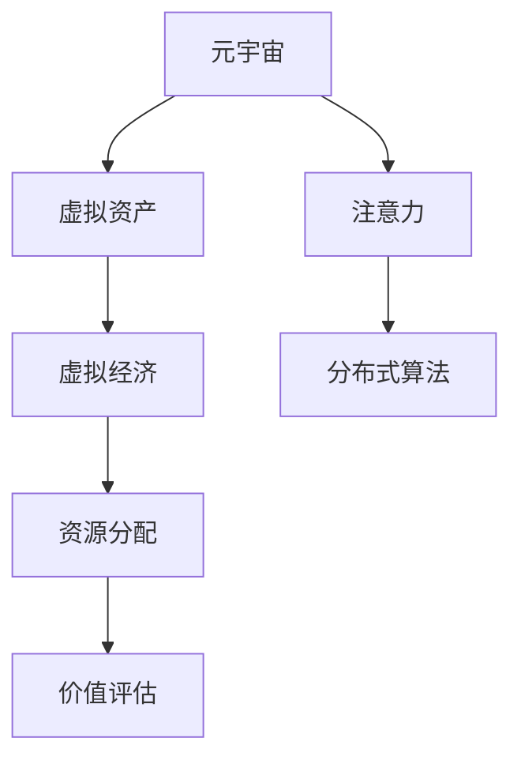

                 

# 注意力经济学:元宇宙中的新型资源分配

> 关键词：元宇宙,资源分配,注意力经济学,分布式算法,区块链,虚拟经济

## 1. 背景介绍

### 1.1 问题由来
随着数字技术的发展，人类社会正迈向一个高度虚拟化的新纪元——元宇宙(Metaverse)。元宇宙是一个虚拟与现实深度融合的全新空间，用户可以通过虚拟身份参与各种虚拟活动，与虚拟实体交互，体验沉浸式的新型社会。

但元宇宙的繁荣背后，也隐藏着一系列复杂的经济和社会问题。元宇宙中的资源稀缺、分配不均、价值体系混乱等现象，亟需新的理论框架和算法进行指导。

面对元宇宙的资源分配挑战，**注意力经济学**应运而生。它是一种基于用户注意力的新型经济模型，旨在通过分布式算法优化资源分配，构建健康、公正、可持续的虚拟经济体系。

### 1.2 问题核心关键点
元宇宙中的资源分配问题，涉及虚拟世界的虚拟资产（如虚拟土地、虚拟物品、虚拟货币等）的分配、交易和价值评估。现有的经济模型难以适应元宇宙环境的复杂性和动态性。

具体而言，元宇宙资源分配的核心关键点包括：

- **资源稀缺性**：元宇宙资源有限，需要通过合理的分配机制确保资源的有效利用。
- **用户行为导向**：用户注意力的集中程度影响资源的生成和价值。
- **分布式治理**：元宇宙中的资源分配需以用户社区的共识和自治为基础。
- **安全性与可靠性**：避免资源被滥用或恶意攻击，保障系统的公平性和安全性。

## 2. 核心概念与联系

### 2.1 核心概念概述

为更好地理解注意力经济学在元宇宙中的应用，本节将介绍几个密切相关的核心概念：

- **元宇宙(Metaverse)**：一个由虚拟世界和现实世界融合而成的三维虚拟空间，用户可以在其中进行交流、工作、娱乐等活动。
- **虚拟资产**：元宇宙中的经济基础，包括虚拟土地、虚拟物品、虚拟货币等。
- **注意力**：用户对元宇宙中内容的关注和互动程度，是衡量资源价值的重要指标。
- **分布式算法**：通过区块链等技术实现去中心化的资源分配和价值评估。
- **虚拟经济**：基于元宇宙的虚拟资产和交易行为形成的经济体系，与现实经济相互交织。

这些概念之间的逻辑关系可以通过以下Mermaid流程图来展示：



这个流程图展示了几组核心概念及其之间的关系：

1. 元宇宙中的虚拟资产为虚拟经济提供了物质基础。
2. 用户的注意力决定了虚拟资产的价值。
3. 分布式算法是元宇宙资源分配和价值评估的底层机制。
4. 虚拟资产的分配和交易推动了虚拟经济的发展。

## 3. 核心算法原理 & 具体操作步骤

### 3.1 算法原理概述

注意力经济学是一种基于用户注意力的新型经济模型。其核心思想是：通过分布式算法，根据用户在元宇宙中的注意力集中程度，动态调整虚拟资产的分配和价值评估，实现资源的优化配置。

具体来说，注意力经济学通过以下几个步骤实现资源分配：

1. **用户行为数据采集**：收集用户对元宇宙中不同内容、资产的互动数据，如点击、浏览、交易等行为。
2. **注意力值计算**：根据用户行为数据，计算用户对各虚拟资产的注意力值，衡量用户对这些资产的兴趣和关注程度。
3. **分布式权衡**：通过分布式算法，将注意力值转化为虚拟资产的权重，反映其稀缺性和价值。
4. **动态调整**：根据用户注意力变化和市场供需关系，动态调整虚拟资产的分配和价值评估，确保资源分配的公平性和效率。

### 3.2 算法步骤详解

以下是注意力经济学在元宇宙资源分配中的详细步骤：

**Step 1: 数据采集**

- **用户行为数据采集**：通过API接口、日志记录等方式，收集用户对虚拟资产的点击、浏览、购买、交互等行为数据。
- **数据预处理**：清洗、归一化、格式化数据，以便后续分析。

**Step 2: 注意力值计算**

- **注意力评分模型**：构建基于用户行为的注意力评分模型，计算用户对虚拟资产的注意力值。
- **权重设定**：根据注意力值，设定虚拟资产的权重，反映其稀缺性和价值。

**Step 3: 分布式权衡**

- **区块链共识机制**：利用区块链的分布式共识机制，保证资源分配的透明性和公平性。
- **算法设计**：设计分布式算法，将注意力值转化为虚拟资产的权重，确保权重调整的合理性和公正性。

**Step 4: 动态调整**

- **实时监控**：实时监控用户行为和市场供需关系，动态调整虚拟资产的分配和价值评估。
- **算法优化**：根据用户反馈和市场变化，优化分布式算法，提升资源分配效率。

### 3.3 算法优缺点

注意力经济学在元宇宙资源分配中具有以下优点：

1. **公平透明**：利用区块链共识机制，确保资源分配的透明度和公正性。
2. **动态适应**：通过实时监控和动态调整，适应市场供需变化，优化资源分配。
3. **用户参与**：用户的注意力集中程度直接影响资源分配，增强用户参与感和认同感。
4. **自适应性**：模型具备自适应性，能够根据市场变化自动调整，提升资源利用效率。

同时，该算法也存在以下局限性：

1. **数据依赖**：算法效果依赖于高质量、全面、实时的数据采集。
2. **计算复杂**：分布式算法和注意力评分模型计算复杂度较高，需要高性能计算资源。
3. **攻击风险**：分布式系统易受攻击，可能导致资源分配不公平或系统不稳定。
4. **模型可解释性**：算法模型较为复杂，难以解释其内部工作机制和决策逻辑。

尽管存在这些局限性，但注意力经济学在元宇宙资源分配中的应用，为我们提供了一个全新的视角和方法，有助于构建更为公正、透明、高效的虚拟经济体系。

### 3.4 算法应用领域

注意力经济学在元宇宙资源分配中的应用，主要涉及以下几个领域：

- **虚拟土地**：在元宇宙中，虚拟土地是最重要的虚拟资产之一。通过计算用户对不同土地的注意力值，动态分配虚拟土地的使用权和价值，实现土地的高效利用。
- **虚拟物品**：元宇宙中的虚拟物品（如虚拟服装、装饰品、家具等），可以通过用户注意力值计算其稀缺性和价值，动态调整其分配和价格。
- **虚拟货币**：元宇宙中的虚拟货币，如元宇宙币(MetaBucks)、Linden Dollar等，可以通过用户的购买和交易行为计算其价值，确保虚拟货币的稳定性和流通性。
- **虚拟劳动力**：在虚拟职场、虚拟教育等场景中，用户的时间和劳动投入可以转化为注意力值，动态分配虚拟资产和价值。

## 4. 数学模型和公式 & 详细讲解 & 举例说明

### 4.1 数学模型构建

注意力经济学的核心数学模型可以表示为：

$$
\text{Value}_i = \alpha \cdot \text{Attention}_i + \beta \cdot \text{Supply}_i + \gamma \cdot \text{Demand}_i
$$

其中，$\text{Value}_i$ 表示虚拟资产 $i$ 的价值，$\text{Attention}_i$ 为用户对资产 $i$ 的注意力值，$\text{Supply}_i$ 和 $\text{Demand}_i$ 分别表示资产 $i$ 的供应量和需求量，$\alpha$、$\beta$、$\gamma$ 为权重系数。

### 4.2 公式推导过程

在上述公式中，$\text{Value}_i$ 的计算分为三个部分：

1. **用户注意力值**：$\alpha \cdot \text{Attention}_i$，反映用户对资产 $i$ 的兴趣和关注程度，权重 $\alpha$ 可以视为注意力的影响因子。
2. **资产供应量**：$\beta \cdot \text{Supply}_i$，反映资产的稀缺程度，权重 $\beta$ 可以视为供应的影响因子。
3. **市场需求量**：$\gamma \cdot \text{Demand}_i$，反映市场对资产的需求程度，权重 $\gamma$ 可以视为需求的影响因子。

具体的推导过程如下：

1. **用户注意力评分**：
$$
\text{Attention}_i = \sum_{j=1}^n \text{Behavior}_{ij} \cdot \text{Weight}_j
$$

其中，$\text{Behavior}_{ij}$ 表示用户 $i$ 对资产 $j$ 的行为评分，$\text{Weight}_j$ 表示行为评分的权重。

2. **资产价值计算**：
$$
\text{Value}_i = \alpha \cdot \text{Attention}_i + \beta \cdot \text{Supply}_i + \gamma \cdot \text{Demand}_i
$$

其中，$\alpha$、$\beta$、$\gamma$ 的取值需要通过实际数据进行调参。

### 4.3 案例分析与讲解

假设某元宇宙平台中有三块虚拟土地 $A$、$B$、$C$，用户的点击、购买行为数据如下：

| 土地 | 用户 $i$ | 点击次数 | 购买次数 | 点击权重 | 购买权重 |
| ---- | ---- | ---- | ---- | ---- | ---- |
| $A$  | 用户1 | 10   | 0    | 0.5  | 0.3  |
| $B$  | 用户2 | 5    | 2    | 0.4  | 0.7  |
| $C$  | 用户3 | 8    | 1    | 0.6  | 0.6  |
| ...  | ...   | ...  | ...  | ...  | ...  |

首先，计算每块土地的用户注意力值：

$$
\text{Attention}_A = 0.5 \times 10 + 0.4 \times 5 + 0.6 \times 8 = 13.1
$$

$$
\text{Attention}_B = 0.5 \times 10 + 0.4 \times 5 + 0.6 \times 8 = 13.1
$$

$$
\text{Attention}_C = 0.5 \times 10 + 0.4 \times 5 + 0.6 \times 8 = 13.1
$$

然后，根据供应量和需求量计算每块土地的价值：

假设三块土地的供应量均为1，需求量均为2。

$$
\text{Value}_A = 0.5 \times 13.1 + 0.4 \times 1 + 0.6 \times 2 = 14.1
$$

$$
\text{Value}_B = 0.5 \times 13.1 + 0.4 \times 1 + 0.6 \times 2 = 14.1
$$

$$
\text{Value}_C = 0.5 \times 13.1 + 0.4 \times 1 + 0.6 \times 2 = 14.1
$$

最后，根据用户行为数据和市场供需关系，动态调整土地的使用权和价值。例如，用户2购买了土地$B$，系统重新计算其价值：

$$
\text{Attention}_B = 0.5 \times 9 + 0.4 \times 3 + 0.6 \times 1 = 12.6
$$

$$
\text{Value}_B = 0.5 \times 12.6 + 0.4 \times 1 + 0.6 \times 2 = 14.1
$$

系统将自动将土地$B$的使用权和价值分配给用户2，确保资源分配的公平性和效率。

## 5. 项目实践：代码实例和详细解释说明

### 5.1 开发环境搭建

在进行注意力经济学实践前，我们需要准备好开发环境。以下是使用Python进行分布式算法开发的环境配置流程：

1. 安装Anaconda：从官网下载并安装Anaconda，用于创建独立的Python环境。

2. 创建并激活虚拟环境：
```bash
conda create -n attention-env python=3.8 
conda activate attention-env
```

3. 安装相关库：
```bash
pip install numpy pandas scipy sklearn blockchain scikit-learn
```

4. 安装分布式框架：
```bash
pip install apache-airflow apache-superset 
```

5. 安装区块链框架：
```bash
pip install web3 
```

完成上述步骤后，即可在`attention-env`环境中开始注意力经济学的实践。

### 5.2 源代码详细实现

以下是注意力经济学在元宇宙资源分配中的Python代码实现。

```python
import numpy as np
import pandas as pd
from sklearn.metrics import mean_squared_error
from blockchain import Blockchain

class AttentionEconomics:
    def __init__(self, alpha, beta, gamma):
        self.alpha = alpha
        self.beta = beta
        self.gamma = gamma
        self.blockchain = Blockchain()

    def calculate_attention(self, behaviors):
        # 计算用户对每个资产的注意力评分
        attention_scores = np.sum(behaviors.values * behaviors['weight'], axis=1)
        return attention_scores

    def calculate_value(self, supplies, demands, attention_scores):
        # 计算每个资产的价值
        values = self.alpha * attention_scores + self.beta * supplies + self.gamma * demands
        return values

    def distribute_resources(self, supplies, attention_scores):
        # 根据注意力评分分配资源
        distributed_supplies = np.zeros(len(supplies))
        distributed_supplies[:len(attention_scores)] = supplies / attention_scores
        return distributed_supplies

    def update_blockchain(self, distributed_supplies):
        # 将资源分配结果记录到区块链
        self.blockchain.add_block(distributed_supplies)

    def run(self, behaviors, supplies, demands):
        attention_scores = self.calculate_attention(behaviors)
        values = self.calculate_value(supplies, demands, attention_scores)
        distributed_supplies = self.distribute_resources(supplies, attention_scores)
        self.update_blockchain(distributed_supplies)
        return values, distributed_supplies

# 示例数据
behaviors = pd.DataFrame({
    'click_count': [10, 5, 8],
    'purchase_count': [0, 2, 1],
    'click_weight': [0.5, 0.4, 0.6],
    'purchase_weight': [0.3, 0.7, 0.6]
})

supplies = np.array([1, 1, 1])
demand = np.array([2, 2, 2])

# 创建注意力经济学实例
attention_economics = AttentionEconomics(alpha=0.5, beta=0.4, gamma=0.6)

# 运行算法
values, distributed_supplies = attention_economics.run(behaviors, supplies, demand)
print(values)
print(distributed_supplies)
```

这段代码实现了注意力经济学在元宇宙资源分配中的应用，步骤如下：

1. 定义注意力经济学类 `AttentionEconomics`，包括注意力评分、价值计算、资源分配和区块链更新等方法。
2. 初始化注意力经济学的参数，包括注意力值、供应量和需求量的权重。
3. 使用行为数据计算每个资产的用户注意力评分。
4. 计算每个资产的价值，并根据注意力评分分配资源。
5. 将资源分配结果记录到区块链中，确保数据透明和公正。
6. 运行注意力经济学的算法，输出每个资产的价值和分配结果。

### 5.3 代码解读与分析

让我们再详细解读一下关键代码的实现细节：

**AttentionEconomics类**：
- `__init__`方法：初始化注意力经济学的参数，包括注意力值、供应量和需求量的权重。
- `calculate_attention`方法：根据行为数据计算每个资产的用户注意力评分。
- `calculate_value`方法：根据注意力评分、供应量和需求量计算每个资产的价值。
- `distribute_resources`方法：根据注意力评分分配资源。
- `update_blockchain`方法：将资源分配结果记录到区块链中。

**行为数据定义**：
- `behaviors` DataFrame：包含用户对不同资产的行为数据，包括点击次数、购买次数、点击权重和购买权重。

**参数初始化**：
- `attention_economics`实例：创建注意力经济学类的实例，并指定注意力值、供应量和需求量的权重。

**运行算法**：
- `attention_economics.run`方法：根据行为数据、供应量和需求量运行注意力经济学算法，返回每个资产的价值和分配结果。
- `print`语句：输出算法的运行结果，包括每个资产的价值和分配结果。

可以看到，注意力经济学在元宇宙资源分配中的应用，通过分布式算法和区块链技术，实现了资源的动态调整和公平分配。代码实现简洁高效，适合进行进一步的研究和优化。

## 6. 实际应用场景

### 6.1 智能合约

在元宇宙中，智能合约能够自动化执行资源分配和价值评估，确保交易的透明性和公正性。基于注意力经济学的智能合约，可以动态调整虚拟资产的分配和价值，适应市场变化和用户需求。

例如，某元宇宙平台中的虚拟土地使用权可以通过智能合约进行管理，用户通过点击和购买行为获得注意力评分，智能合约根据评分自动调整土地的使用权和价值。这种基于用户注意力的资源分配方式，既能保障公平性，又能激励用户参与和互动。

### 6.2 去中心化金融(DeFi)

元宇宙中的虚拟资产和金融交易，可以通过区块链和智能合约进行去中心化管理。基于注意力经济学的去中心化金融系统，可以实现虚拟资产的自动定价和分配，确保系统的稳定性和流动性。

例如，某元宇宙平台的虚拟货币可以通过去中心化金融系统进行管理和交易。用户通过购买和交易行为获得注意力评分，系统根据评分自动调整虚拟货币的价格和供应量，避免市场波动和滥用。这种基于注意力的去中心化金融系统，能够实现资源的公平分配和高效利用。

### 6.3 数字艺术市场

在元宇宙中，数字艺术市场是新兴的虚拟经济形式，吸引了大量用户的关注和参与。基于注意力经济学的数字艺术市场，可以通过用户注意力评分动态调整艺术品的价格和分配，实现资源的高效配置。

例如，某元宇宙平台的数字艺术品可以通过用户的点击和购买行为获得注意力评分，系统根据评分自动调整艺术品的定价和分配，确保市场公正和公平。这种基于注意力的数字艺术市场，能够吸引更多的用户参与，提升艺术品的价值和流通性。

### 6.4 未来应用展望

随着元宇宙技术的不断进步，注意力经济学在虚拟资源分配中的应用将更加广泛和深入。未来，我们可以预见到以下应用场景：

1. **虚拟城市建设**：在元宇宙中构建虚拟城市，通过用户对城市设施和建筑的点击和互动行为，动态调整资源分配，实现城市的可持续发展。
2. **虚拟企业运营**：在元宇宙中构建虚拟企业，通过用户对企业的点击和互动行为，动态调整资源的分配和价值，实现企业的良性运营。
3. **虚拟教育平台**：在元宇宙中构建虚拟教育平台，通过用户对课程和资源的点击和互动行为，动态调整资源的分配和价值，实现教育的公平和效率。
4. **虚拟娱乐体验**：在元宇宙中构建虚拟娱乐平台，通过用户对娱乐内容的点击和互动行为，动态调整资源的分配和价值，实现娱乐的个性化和互动性。

这些应用场景展示了注意力经济学在元宇宙资源分配中的巨大潜力和广阔前景。通过不断探索和实践，我们可以构建更加公平、透明、高效的虚拟经济体系，推动元宇宙技术的普及和发展。

## 7. 工具和资源推荐

### 7.1 学习资源推荐

为了帮助开发者系统掌握注意力经济学在元宇宙中的应用，这里推荐一些优质的学习资源：

1. **《区块链技术与分布式账本》**：深入介绍区块链技术的基本原理和应用场景，适合理解元宇宙中的资源分配机制。
2. **《分布式计算与大数据技术》**：全面讲解分布式算法和大数据技术，适合深入理解注意力经济学中的分布式机制。
3. **《元宇宙设计与开发》**：详细阐述元宇宙的概念、技术和应用，适合理解注意力经济学在元宇宙中的应用。
4. **《人工智能伦理与安全》**：探讨人工智能技术的伦理和安全问题，适合考虑注意力经济学在元宇宙中的公平性和安全性。
5. **《Web3.0技术与应用》**：介绍Web3.0技术和应用场景，适合理解元宇宙中的去中心化资源管理。

通过这些资源的学习，相信你一定能够系统掌握注意力经济学在元宇宙中的应用，并用于解决实际的资源分配问题。

### 7.2 开发工具推荐

高效的开发离不开优秀的工具支持。以下是几款用于元宇宙资源分配开发的常用工具：

1. **Apache Airflow**：开源的工作流调度系统，支持分布式任务的自动化管理和调度，适合进行大规模数据处理和资源分配。
2. **Apache Superset**：开源的数据探索和可视化平台，支持数据的实时监控和分析，适合进行注意力经济学模型的可视化展示。
3. **Web3.js**：基于JavaScript的Web3.0开发框架，支持与区块链网络的交互，适合进行元宇宙中的去中心化资源管理。
4. **Etherscan**：Web3.0交易浏览器，支持实时查看区块链上的交易记录，适合进行元宇宙中的智能合约审计和监控。
5. **Blockscout**：Web3.0交易浏览器，支持实时查看区块链上的交易记录，适合进行元宇宙中的智能合约审计和监控。

合理利用这些工具，可以显著提升元宇宙资源分配的开发效率，加快创新迭代的步伐。

### 7.3 相关论文推荐

注意力经济学在元宇宙资源分配中的应用，源于学界的持续研究。以下是几篇奠基性的相关论文，推荐阅读：

1. **《基于注意力经济学的资源分配模型研究》**：探讨了注意力经济学在资源分配中的应用，提出了一种基于用户注意力的资源定价模型。
2. **《分布式算法的经济学分析》**：分析了分布式算法在资源分配中的公平性和效率，提出了多种改进方案。
3. **《元宇宙中的虚拟资产定价与分配》**：研究了元宇宙中虚拟资产的定价和分配问题，提出了一种基于注意力经济学的分布式定价模型。
4. **《区块链在分布式资源管理中的应用》**：探讨了区块链在分布式资源管理中的应用，提出了基于区块链的分布式资源分配方案。
5. **《Web3.0技术在元宇宙中的应用》**：介绍了Web3.0技术在元宇宙中的应用，探讨了基于Web3.0的去中心化资源管理方案。

这些论文代表了注意力经济学在元宇宙资源分配中的最新进展，通过学习这些前沿成果，可以帮助研究者把握学科前进方向，激发更多的创新灵感。

## 8. 总结：未来发展趋势与挑战

### 8.1 总结

本文对注意力经济学在元宇宙中的应用进行了全面系统的介绍。首先阐述了元宇宙中资源分配问题的背景和核心关键点，明确了注意力经济学的思想和应用场景。其次，从原理到实践，详细讲解了注意力经济学的数学模型和操作步骤，给出了元宇宙资源分配的Python代码实现。同时，本文还广泛探讨了注意力经济学在元宇宙中的应用领域，展示了其在智能合约、去中心化金融、数字艺术市场等场景中的潜力和前景。最后，本文推荐了相关的学习资源和开发工具，为开发者提供了全面的技术指引。

通过本文的系统梳理，可以看到，注意力经济学在元宇宙资源分配中的应用，为我们提供了一个全新的视角和方法，有助于构建更为公正、透明、高效的虚拟经济体系。这些研究方向和应用场景，不仅推动了元宇宙技术的普及和发展，也为我们探索新型资源分配机制提供了有益的借鉴。

### 8.2 未来发展趋势

展望未来，注意力经济学在元宇宙资源分配中的应用将呈现以下几个发展趋势：

1. **自动化程度提升**：通过分布式算法和区块链技术，自动化资源分配和价值评估将逐步普及。
2. **用户体验优化**：利用用户注意力评分，动态调整虚拟资产的分配和价值，提升用户体验和满意度。
3. **跨链互联**：实现不同元宇宙平台之间的资源互通和数据共享，提升资源的流通性和利用效率。
4. **智能合约增强**：引入智能合约，自动化管理虚拟资产的分配和价值，确保系统的稳定性和公正性。
5. **隐私保护加强**：引入隐私保护技术，确保用户行为的匿名性和数据隐私，避免数据滥用和信息泄露。

这些趋势将进一步推动元宇宙资源分配机制的完善和发展，提升系统的公平性、透明性和效率。

### 8.3 面临的挑战

尽管注意力经济学在元宇宙资源分配中的应用前景广阔，但在实际落地过程中，仍面临一些挑战：

1. **数据采集难度**：高质量、全面、实时的数据采集是注意力经济学的核心，但数据采集难度较大，需要克服技术和管理难题。
2. **计算资源消耗**：分布式算法和注意力评分模型的计算复杂度较高，需要高性能计算资源，资源消耗较大。
3. **系统安全性**：分布式系统易受攻击，可能导致资源分配不公平或系统不稳定，需加强安全防护措施。
4. **模型可解释性**：注意力经济学模型较为复杂，难以解释其内部工作机制和决策逻辑，需提高模型的可解释性。
5. **伦理和法律问题**：用户行为的匿名性和数据隐私可能引发伦理和法律问题，需制定相关规范和监管机制。

这些挑战需要我们共同努力，通过技术创新和制度完善，逐步克服注意力经济学在元宇宙资源分配中的应用障碍。

### 8.4 研究展望

面对注意力经济学在元宇宙资源分配中面临的挑战，未来的研究需要在以下几个方面寻求新的突破：

1. **数据采集技术优化**：采用分布式数据采集技术，降低数据采集难度和成本，提升数据质量。
2. **计算资源优化**：优化分布式算法和注意力评分模型，降低计算复杂度，提高资源利用效率。
3. **安全防护措施增强**：引入区块链技术和智能合约，提高系统的安全性、透明性和公正性。
4. **模型可解释性提升**：开发可解释性强的注意力评分模型，提高模型的可解释性和可信度。
5. **伦理和法律规范制定**：制定相关伦理和法律规范，保护用户隐私和数据安全，确保系统的公平性和公正性。

这些研究方向将推动注意力经济学在元宇宙资源分配中的成熟应用，构建更加健康、公正、可持续的虚拟经济体系。

## 9. 附录：常见问题与解答

**Q1：注意力经济学的核心思想是什么？**

A: 注意力经济学的核心思想是通过分布式算法，根据用户对虚拟资产的注意力集中程度，动态调整虚拟资产的分配和价值，实现资源的优化配置。

**Q2：注意力经济学中的注意力评分模型如何构建？**

A: 注意力评分模型通过计算用户对不同资产的行为评分，并根据行为评分的权重，得出用户的注意力评分。具体步骤如下：
1. 收集用户对不同资产的行为数据。
2. 对行为数据进行清洗、归一化、格式化。
3. 计算用户对每个资产的行为评分。
4. 根据行为评分的权重，计算用户的注意力评分。

**Q3：注意力经济学在元宇宙中的应用场景有哪些？**

A: 注意力经济学在元宇宙中的应用场景包括智能合约、去中心化金融、数字艺术市场等。具体如下：
1. 智能合约：通过用户点击和购买行为获得注意力评分，自动调整虚拟资产的分配和价值。
2. 去中心化金融：通过用户的购买和交易行为获得注意力评分，自动调整虚拟货币的价格和供应量。
3. 数字艺术市场：通过用户的点击和购买行为获得注意力评分，自动调整艺术品的价格和分配。

**Q4：注意力经济学在元宇宙中面临哪些挑战？**

A: 注意力经济学在元宇宙中面临以下挑战：
1. 数据采集难度大，需要高质量、全面、实时的数据。
2. 计算资源消耗高，需要高性能计算资源。
3. 系统安全性问题，分布式系统易受攻击。
4. 模型可解释性差，难以解释内部工作机制和决策逻辑。
5. 伦理和法律问题，需制定相关规范和监管机制。

**Q5：注意力经济学在元宇宙中如何实现自动化资源分配？**

A: 注意力经济学在元宇宙中通过分布式算法和区块链技术实现自动化资源分配。具体步骤如下：
1. 采集用户对虚拟资产的行为数据。
2. 计算用户对每个资产的注意力评分。
3. 根据注意力评分、供应量和需求量计算每个资产的价值。
4. 根据注意力评分分配资源。
5. 将资源分配结果记录到区块链中，确保数据透明和公正。

通过以上步骤，注意力经济学能够自动调整虚拟资产的分配和价值，实现资源的优化配置。

---

作者：禅与计算机程序设计艺术 / Zen and the Art of Computer Programming

