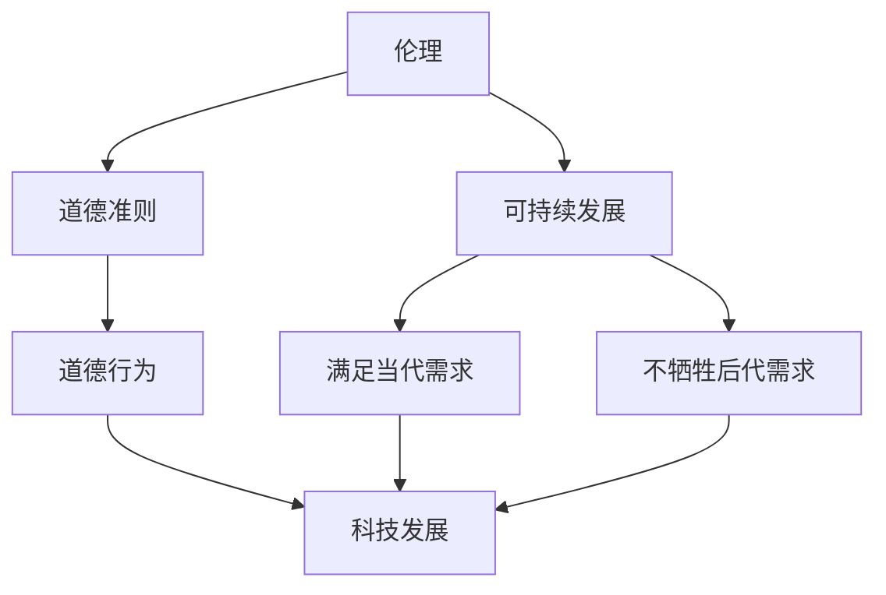
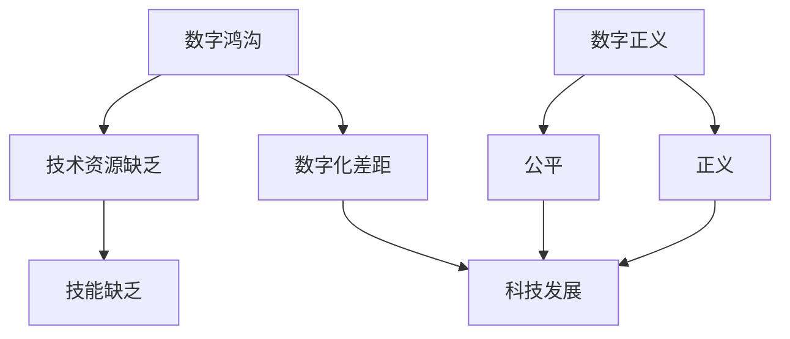
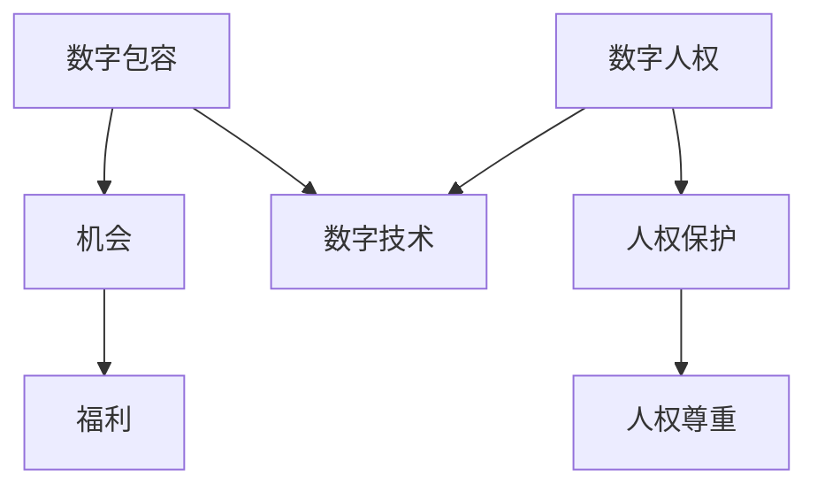

                 

**关键词：人工智能、伦理、可持续发展、数字鸿沟、数字正义、数字包容、数字人权**

## 1. 背景介绍

当今世界，科技以指数级速度发展，深刻地改变着我们的生活方式。然而，科技的进步也带来了新的挑战和不平等。如何确保科技造福全人类，而不是加剧社会问题，是我们必须面对的关键问题。本文将探讨如何运用人工智能等技术，以一种负责任的方式解决社会问题，实现科技向善。

## 2. 核心概念与联系

### 2.1 伦理与可持续发展

伦理是指导人类行为的道德准则，而可持续发展则是满足当代需求，而不牺牲后代满足他们需求的能力。这两个概念是指导科技发展的基石。我们必须确保技术的发展是道德的、可持续的，并造福全人类。



### 2.2 数字鸿沟与数字正义

数字鸿沟是指由于缺乏技术资源和技能而导致的数字化差距。数字正义则是指在数字化世界中实现公平和正义。这两个概念是科技向善的关键挑战。我们必须确保技术的发展不会加剧数字鸿沟，而是帮助缩小数字鸿沟，实现数字正义。



### 2.3 数字包容与数字人权

数字包容是指确保数字技术为所有人提供机会和福利。数字人权则是指在数字化世界中保护和尊重人权。这两个概念是科技向善的关键目标。我们必须确保技术的发展是包容的，尊重和保护人权。



## 3. 核心算法原理 & 具体操作步骤

### 3.1 算法原理概述

人工智能是解决社会问题的关键技术之一。它的核心是算法，算法是一系列指令，告诉计算机如何解决特定的问题。我们必须确保这些算法是公平的、可解释的，不会导致不良后果。

### 3.2 算法步骤详解

1. **数据收集**：收集与问题相关的数据。
2. **数据预处理**：清洗、标记、分割数据。
3. **特征选择**：选择影响结果的关键特征。
4. **模型训练**：使用选择的特征训练模型。
5. **模型评估**：评估模型的性能。
6. **部署**：将模型部署到生产环境。
7. **监控**：监控模型的性能，并进行必要的调整。

### 3.3 算法优缺点

**优点**：算法可以处理大量数据，可以学习和适应，可以做出预测和决策。

**缺点**：算法可能会导致不公平，可能会产生不良后果，可能会侵犯隐私。

### 3.4 算法应用领域

算法可以应用于各种领域，包括医疗保健、教育、交通、环境保护等。例如，算法可以帮助医生诊断疾病，可以帮助学生个性化学习，可以帮助减少交通拥堵，可以帮助保护环境。

## 4. 数学模型和公式 & 详细讲解 & 举例说明

### 4.1 数学模型构建

数学模型是描述系统行为的数学表示。例如，在交通拥堵问题中，我们可以使用流量模型来描述交通流量。

### 4.2 公式推导过程

流量模型可以使用流量方程来描述：

$$q = Q \cdot \frac{1}{1 + \frac{Q \cdot k}{c \cdot w}} \tag{1}$$

其中，$q$是流量，$Q$是车辆数，$k$是跟车距，$c$是车道宽度，$w$是车速。

### 4.3 案例分析与讲解

例如，在一个城市，每小时有1000辆车通过一个路口，$k=2m$，$c=3.5m$，$w=20km/h$. 使用公式(1)，我们可以计算出流量$q=250$辆/小时。这意味着每小时有250辆车通过路口。

## 5. 项目实践：代码实例和详细解释说明

### 5.1 开发环境搭建

我们将使用Python和Scikit-learn库来构建一个简单的交通预测模型。我们需要安装Python和Scikit-learn。

### 5.2 源代码详细实现

```python
from sklearn.linear_model import LinearRegression
from sklearn.model_selection import train_test_split
from sklearn.metrics import mean_squared_error
import pandas as pd

# Load data
data = pd.read_csv('traffic_data.csv')

# Preprocess data
X = data[['Q', 'k', 'c', 'w']]
y = data['q']

# Split data into training and test sets
X_train, X_test, y_train, y_test = train_test_split(X, y, test_size=0.2, random_state=42)

# Train model
model = LinearRegression()
model.fit(X_train, y_train)

# Evaluate model
y_pred = model.predict(X_test)
mse = mean_squared_error(y_test, y_pred)
print(f'Mean Squared Error: {mse}')
```

### 5.3 代码解读与分析

我们使用线性回归模型来预测交通流量。我们首先加载数据，然后预处理数据，将其分成训练集和测试集。我们然后训练模型，并使用测试集评估模型的性能。

### 5.4 运行结果展示

运行代码后，我们可以看到均方误差（MSE），这是评估模型性能的指标之一。

## 6. 实际应用场景

### 6.1 当前应用

交通预测模型可以应用于智能交通系统，帮助减少交通拥堵，提高交通效率。

### 6.2 未来应用展望

未来，交通预测模型可以与自动驾驶汽车结合，帮助汽车实时调整路线，避免拥堵。

## 7. 工具和资源推荐

### 7.1 学习资源推荐

- 书籍：《人工智能：一种现代 Approach》作者：斯图尔特·罗素、彼得·诺维格
- 在线课程：Coursera上的“机器学习”课程

### 7.2 开发工具推荐

- Python：一种通用的编程语言，广泛用于人工智能开发。
- Scikit-learn：一个机器学习库，提供了各种机器学习算法的实现。

### 7.3 相关论文推荐

- 论文：《交通预测：方法和应用》作者：Y. Y. Ye, X. S. Zhou, Y. P. Cai

## 8. 总结：未来发展趋势与挑战

### 8.1 研究成果总结

我们讨论了如何使用人工智能解决交通拥堵问题。我们构建了一个简单的交通预测模型，并展示了如何使用Scikit-learn库实现它。

### 8.2 未来发展趋势

未来，人工智能将继续发展，并应用于更多领域。我们将看到更复杂的模型，更先进的算法，更智能的系统。

### 8.3 面临的挑战

然而，人工智能也面临着挑战。我们必须确保算法是公平的、可解释的，不会导致不良后果。我们必须确保技术的发展是道德的、可持续的，并造福全人类。

### 8.4 研究展望

未来的研究将关注如何解决这些挑战，如何确保技术的发展是负责任的，如何使用技术解决社会问题。

## 9. 附录：常见问题与解答

**Q：人工智能会取代人类吗？**

**A：**人工智能不会取代人类，而是会与人类协作，帮助我们解决问题，提高效率。

**Q：人工智能是否会导致不公平？**

**A：**人工智能可能会导致不公平，但我们可以通过确保算法是公平的、可解释的来解决这个问题。

**Q：如何确保技术的发展是道德的、可持续的？**

**A：**我们需要在技术的发展过程中考虑道德和可持续性因素，需要进行伦理评估，需要听取各方意见。

**作者：禅与计算机程序设计艺术 / Zen and the Art of Computer Programming**

