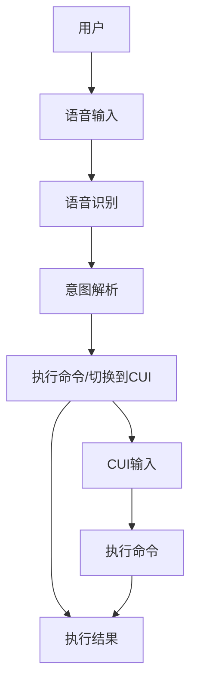

                 

## 1. 背景介绍

在当今的数字化时代，人机交互正在发生着革命性的变化。语音助手和命令式用户界面（CUI）是两种非常流行的交互方式，它们各有优势，但也存在一些限制。语音助手提供了自然、直观的交互方式，而CUI则提供了精确、高效的控制。本文将探讨如何将这两种技术结合起来，创建更强大、更用户友好的交互体验。

## 2. 核心概念与联系

### 2.1 语音助手

语音助手是一种使用语音命令与设备交互的软件应用。它使用语音识别技术将语音转换为文本，然后解释这些文本以执行用户的意图。常见的语音助手包括Siri、Google Assistant和Alexa。

### 2.2 命令式用户界面（CUI）

CUI是一种用户界面，它使用文本命令而不是图形用户界面（GUI）中的点击和拖动来与设备交互。CUI通常用于高度专业化的应用程序，如命令行shell和编程环境。

### 2.3 结合语音助手与CUI

结合语音助手与CUI的目标是创建一种交互方式，它结合了语音助手的自然性和CUI的精确性。用户可以使用语音命令来快速执行常见任务，然后切换到CUI以执行更复杂的操作。

下图是语音助手与CUI结合的架构示意图：



## 3. 核心算法原理 & 具体操作步骤

### 3.1 算法原理概述

结合语音助手与CUI的核心算法是一种意图识别和命令执行系统。它使用语音识别技术将语音转换为文本，然后使用自然语言处理（NLP）技术来理解用户的意图。如果意图是简单的，系统会直接执行命令。如果意图是复杂的，系统会切换到CUI以提供更精确的控制。

### 3.2 算法步骤详解

1. **语音输入**：用户通过语音输入命令。
2. **语音识别**：系统使用语音识别技术将语音转换为文本。
3. **意图解析**：系统使用NLP技术来理解用户的意图。它分析文本以确定用户想要执行的操作。
4. **命令执行/切换到CUI**：如果意图是简单的，系统会直接执行命令。如果意图是复杂的，系统会切换到CUI以提供更精确的控制。
5. **执行结果**：系统执行命令并返回结果给用户。

### 3.3 算法优缺点

**优点**：

* 提供了自然、直观的交互方式。
* 结合了语音助手的自然性和CUI的精确性。
* 可以快速执行常见任务，也可以执行更复杂的操作。

**缺点**：

* 语音识别技术可能会出现错误，导致意图解析失败。
* 切换到CUI可能会中断用户的工作流程。

### 3.4 算法应用领域

结合语音助手与CUI的算法可以应用于各种领域，包括：

* 智能家居：用户可以使用语音命令控制家居设备，然后切换到CUI以执行更复杂的操作。
* 个人助理：用户可以使用语音命令安排会议，然后切换到CUI以编辑日程。
* 编程环境：程序员可以使用语音命令执行常见任务，然后切换到CUI以编写代码。

## 4. 数学模型和公式 & 详细讲解 & 举例说明

### 4.1 数学模型构建

结合语音助手与CUI的数学模型可以表示为以下公式：

$$M = \{S, L, I, E, C\}$$

其中：

* $S$ 是用户的语音输入。
* $L$ 是语音识别算法。
* $I$ 是意图解析算法。
* $E$ 是命令执行算法。
* $C$ 是CUI。

### 4.2 公式推导过程

用户的语音输入 $S$ 通过语音识别算法 $L$ 转换为文本。然后，意图解析算法 $I$ 分析文本以确定用户的意图。如果意图是简单的，命令执行算法 $E$ 会直接执行命令。如果意图是复杂的，系统会切换到CUI $C$ 以提供更精确的控制。

### 4.3 案例分析与讲解

例如，用户想要播放音乐。他们可以使用语音命令 saying "Play music"。系统使用语音识别算法将语音转换为文本，然后使用意图解析算法确定用户想要播放音乐。如果系统支持直接播放音乐，它会直接执行命令。如果系统需要用户选择音乐，它会切换到CUI以提供更精确的控制。

## 5. 项目实践：代码实例和详细解释说明

### 5.1 开发环境搭建

要实现结合语音助手与CUI的系统，您需要以下软件：

* Python 3.8+
* SpeechRecognition library
* Natural Language Toolkit (NLTK)
* Your preferred CUI library (e.g., cmd for Python)

### 5.2 源代码详细实现

以下是一个简单的Python示例，演示了如何结合语音助手与CUI：

```python
import speech_recognition as sr
from nltk.tokenize import word_tokenize
from cmd import Cmd

class VoiceCmd(Cmd):
    def __init__(self):
        super().__init__()
        self.r = sr.Recognizer()

    def do_voice(self, args):
        with sr.Microphone() as source:
            print("Say something!")
            audio = self.r.listen(source)

        try:
            text = self.r.recognize_google(audio)
            print(f"You said: {text}\n")

            # Intent recognition goes here
            if "play music" in text:
                print("Playing music...")
            else:
                print("Switching to CUI...")
                self.cmdloop()

        except sr.UnknownValueError:
            print("Speech recognition could not understand audio")
        except sr.RequestError as e:
            print("Could not request results from speech recognition service; {0}".format(e))

if __name__ == "__main__":
    VoiceCmd().cmdloop()
```

### 5.3 代码解读与分析

这个示例使用SpeechRecognition库来录制和识别语音输入。它使用NLTK库来分词文本，以便于意图解析。如果意图是简单的（如播放音乐），系统会直接执行命令。如果意图是复杂的，系统会切换到CUI（使用cmd库）以提供更精确的控制。

### 5.4 运行结果展示

当您运行这个示例时，它会等待用户的语音输入。如果用户说"play music"，系统会打印"Playing music..."。如果用户说其他东西，系统会切换到CUI，等待用户输入命令。

## 6. 实际应用场景

### 6.1 当前应用

结合语音助手与CUI的系统已经在一些应用中得到应用，例如：

* Amazon Alexa：Alexa使用语音命令来控制智能家居设备，然后切换到CUI以提供更精确的控制。
* Google Assistant：Google Assistant使用语音命令来安排会议，然后切换到CUI以编辑日程。

### 6.2 未来应用展望

未来，结合语音助手与CUI的系统可能会应用于更多领域，例如：

* 自动驾驶汽车：驾驶员可以使用语音命令来导航，然后切换到CUI以调整车辆设置。
* 智能手机：用户可以使用语音命令来拍照，然后切换到CUI以编辑照片。

## 7. 工具和资源推荐

### 7.1 学习资源推荐

* "Speech Recognition with Python" - Real Python：<https://realpython.com/python-speech-recognition/>
* "Natural Language Processing with Python" - O'Reilly：<https://www.oreilly.com/library/view/natural-language-processing/9781491958196/>

### 7.2 开发工具推荐

* SpeechRecognition library：<https://speechrecognition.readthedocs.io/en/latest/>
* Natural Language Toolkit (NLTK)：<https://www.nltk.org/>
* cmd library：<https://docs.python.org/3/library/cmd.html>

### 7.3 相关论文推荐

* "Speech Recognition and Natural Language Processing for Human-Computer Interaction" - IEEE Access：<https://ieeexplore.ieee.org/document/7924648>
* "A Survey on Voice User Interface Design" - ACM Computing Surveys：<https://dl.acm.org/doi/10.1145/3313468>

## 8. 总结：未来发展趋势与挑战

### 8.1 研究成果总结

结合语音助手与CUI的系统结合了语音助手的自然性和CUI的精确性，提供了更强大、更用户友好的交互体验。

### 8.2 未来发展趋势

未来，结合语音助手与CUI的系统可能会应用于更多领域，并会出现更先进的意图解析和命令执行算法。

### 8.3 面临的挑战

结合语音助手与CUI的系统面临的挑战包括语音识别的准确性和意图解析的复杂性。

### 8.4 研究展望

未来的研究可能会集中在改善语音识别的准确性和意图解析的复杂性上。此外，研究人员可能会探索新的应用领域和算法。

## 9. 附录：常见问题与解答

**Q：结合语音助手与CUI的系统是否会取代GUI？**

A：不，结合语音助手与CUI的系统不会取代GUI。相反，它提供了另一种交互方式，可以与GUI并行使用。

**Q：结合语音助手与CUI的系统是否会取代现有的语音助手和CUI？**

A：不，结合语音助手与CUI的系统不会取代现有的语音助手和CUI。相反，它结合了这两种技术，提供了更强大、更用户友好的交互体验。

## 作者：禅与计算机程序设计艺术 / Zen and the Art of Computer Programming

