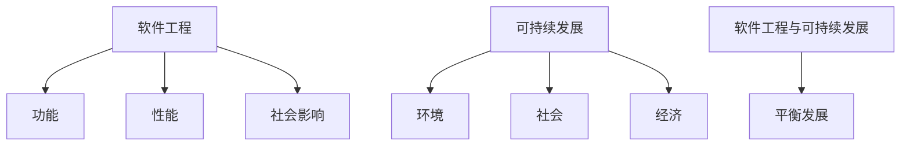
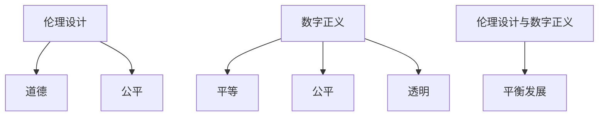
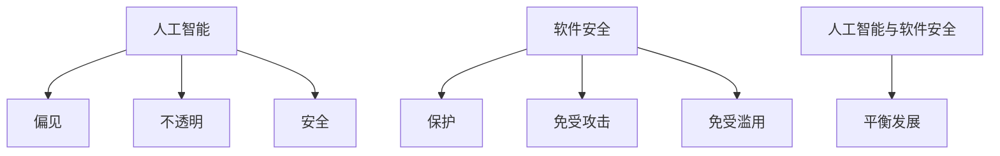
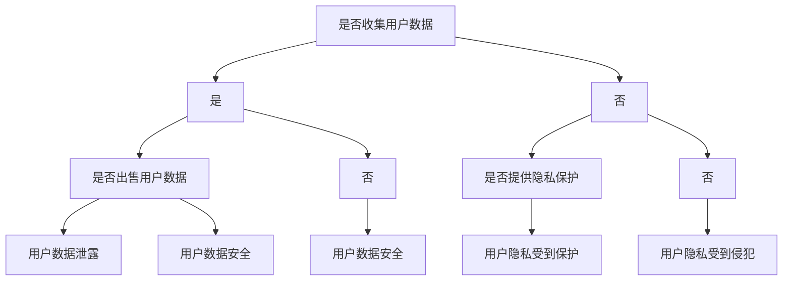

                 

软件工程、可持续发展、伦理设计、数字正义、人工智能、软件安全

## 1. 背景介绍

随着软件在各行各业的广泛应用，软件不再只是一门技术，而是变成了一个社会现象。软件正在塑造我们的生活方式，改变我们的行为习惯，影响我们的决策过程。然而，软件开发者和使用者都面临着一个共同的挑战：如何确保软件的发展符合道德标准，造福于人类社会？

软件 2.0 的出现，标志着软件开发进入了一个新的时代。在这个时代，软件不再只是一门技术，而是变成了一个社会实践。软件开发者需要考虑软件的社会影响，需要承担起软件的社会责任。本文将从软件工程、伦理设计、数字正义、人工智能和软件安全等角度，探讨软件 2.0 的社会责任，并提出一些具体的建议，以帮助软件开发者和使用者共同构建一个更美好的数字世界。

## 2. 核心概念与联系

### 2.1 软件工程与可持续发展

软件工程是一门系统化、结构化的软件开发方法，旨在提高软件的质量和可维护性。然而，传统的软件工程更多地关注软件的功能和性能，而忽略了软件的社会影响。可持续发展则是一种平衡当前需求和未来发展的理念，强调环境、社会和经济三者的平衡发展。将可持续发展的理念引入软件工程，可以帮助软件开发者更好地平衡软件的功能、性能和社会影响。



### 2.2 伦理设计与数字正义

伦理设计是一种将道德考虑纳入设计过程的方法，旨在创建更加道德、更加公平的技术。数字正义则是一种平等、公平、透明的数字环境，强调数字技术的公平性和包容性。将伦理设计和数字正义的理念引入软件开发，可以帮助软件开发者更好地平衡软件的功能、性能和道德影响。



### 2.3 人工智能与软件安全

人工智能是一种模拟人类智能的计算机程序，正在广泛应用于各个领域。然而，人工智能也面临着一系列的挑战，包括偏见、不透明和安全等问题。软件安全则是一种保护软件免受攻击和滥用的方法。将软件安全的理念引入人工智能开发，可以帮助人工智能开发者更好地平衡人工智能的功能、性能和安全影响。



## 3. 核心算法原理 & 具体操作步骤

### 3.1 伦理设计算法原理概述

伦理设计算法旨在帮助软件开发者更好地平衡软件的功能、性能和道德影响。其核心原理包括：

* 识别道德挑战：识别软件开发过程中可能面临的道德挑战，如隐私保护、偏见和不公平等。
* 评估道德影响：评估软件的道德影响，包括对用户、社区和社会的影响。
* 设计道德解决方案：设计道德解决方案，平衡软件的功能、性能和道德影响。

### 3.2 伦理设计算法步骤详解

伦理设计算法的具体操作步骤如下：

1. 识别道德挑战：软件开发者需要识别软件开发过程中可能面临的道德挑战，并记录下来。
2. 评估道德影响：软件开发者需要评估软件的道德影响，包括对用户、社区和社会的影响。这可以通过进行道德风险评估、用户调查和社区讨论等方式来实现。
3. 设计道德解决方案：软件开发者需要设计道德解决方案，平衡软件的功能、性能和道德影响。这可以通过进行道德设计头脑风暴、道德设计原型开发和道德设计评估等方式来实现。

### 3.3 伦理设计算法优缺点

伦理设计算法的优点包括：

* 有助于软件开发者更好地平衡软件的功能、性能和道德影响。
* 有助于提高软件的道德可接受性和用户满意度。
* 有助于减少软件开发过程中的道德风险。

伦理设计算法的缺点包括：

* 需要额外的时间和资源来进行道德设计。
* 道德设计的主观性可能会导致不同软件开发者对道德挑战的不同理解和解决方案。
* 道德设计的有效性和可行性需要进一步的研究和验证。

### 3.4 伦理设计算法应用领域

伦理设计算法可以应用于各种软件开发领域，包括：

* 人工智能：帮助人工智能开发者更好地平衡人工智能的功能、性能和道德影响，如偏见和不公平等。
* 互联网：帮助互联网开发者更好地平衡互联网的功能、性能和道德影响，如隐私保护和言论自由等。
* 健康医疗：帮助健康医疗软件开发者更好地平衡软件的功能、性能和道德影响，如隐私保护和数据安全等。

## 4. 数学模型和公式 & 详细讲解 & 举例说明

### 4.1 数学模型构建

数学模型是一种用数学语言描述系统行为的方法。在伦理设计中，数学模型可以用于评估软件的道德影响。例如，可以使用决策树模型来评估软件的道德影响，其中每个节点表示一个道德决策，每个分支表示一个道德结果。

数学模型的构建步骤包括：

1. 识别道德决策：识别软件开发过程中可能面临的道德决策，并记录下来。
2. 构建决策树：构建决策树，其中每个节点表示一个道德决策，每个分支表示一个道德结果。
3. 评估道德结果：评估每个道德结果的道德影响，并记录下来。

### 4.2 公式推导过程

数学模型的公式推导过程如下：

给定道德决策集合 $D = \{d_1, d_2, \ldots, d_n\}$，道德结果集合 $R = \{r_1, r_2, \ldots, r_m\}$，以及道德影响函数 $f: R \rightarrow \mathbb{R}$，则软件的道德影响可以表示为：

$$I = \sum_{i=1}^{n} \sum_{j=1}^{m} P(d_i) \cdot P(r_j | d_i) \cdot f(r_j)$$

其中，$P(d_i)$ 表示道德决策 $d_i$ 的概率，$P(r_j | d_i)$ 表示给定道德决策 $d_i$ 的情况下道德结果 $r_j$ 的概率，$f(r_j)$ 表示道德结果 $r_j$ 的道德影响。

### 4.3 案例分析与讲解

例如，假设我们正在开发一款社交媒体应用，需要评估其道德影响。我们可以构建如下决策树模型：



假设我们有以下道德影响评分：

* 用户数据泄露：-10
* 用户数据安全：5
* 用户隐私受到保护：8
* 用户隐私受到侵犯：-8

则软件的道德影响可以表示为：

$$I = P(\text{是}) \cdot (P(\text{是}) \cdot (-10) + P(\text{否}) \cdot 5) + P(\text{否}) \cdot (P(\text{是}) \cdot 8 + P(\text{否}) \cdot (-8))$$

其中，$P(\text{是})$ 表示收集用户数据的概率，$P(\text{否})$ 表示不收集用户数据的概率，$P(\text{是})$ 表示出售用户数据的概率，$P(\text{否})$ 表示不出售用户数据的概率，$P(\text{是})$ 表示提供隐私保护的概率，$P(\text{否})$ 表示不提供隐私保护的概率。

## 5. 项目实践：代码实例和详细解释说明

### 5.1 开发环境搭建

要实现伦理设计算法，我们需要以下开发环境：

* Python 3.7 以上版本
* NumPy 1.16 以上版本
* Scikit-learn 0.20 以上版本
* Matplotlib 3.1 以上版本

### 5.2 源代码详细实现

以下是伦理设计算法的 Python 实现代码：

```python
import numpy as np
from sklearn.tree import DecisionTreeClassifier
from sklearn.model_selection import train_test_split
from sklearn.metrics import accuracy_score
import matplotlib.pyplot as plt

# 道德决策集合
decisions = ['是否收集用户数据', '是否出售用户数据', '是否提供隐私保护']

# 道德结果集合
results = ['用户数据泄露', '用户数据安全', '用户隐私受到保护', '用户隐私受到侵犯']

# 道德影响评分
impact_scores = {'用户数据泄露': -10, '用户数据安全': 5, '用户隐私受到保护': 8, '用户隐私受到侵犯': -8}

# 道德决策数据
data = np.array([[1, 1, 1], [1, 0, 1], [0, 1, 0], [0, 0, 1], [1, 1, 0], [1, 0, 0], [0, 1, 1], [0, 0, 0]])

# 道德结果数据
labels = np.array([0, 1, 2, 3, 0, 1, 2, 3])

# 拆分数据集
X_train, X_test, y_train, y_test = train_test_split(data, labels, test_size=0.2, random_state=42)

# 训练决策树分类器
clf = DecisionTreeClassifier(random_state=42)
clf.fit(X_train, y_train)

# 预测道德结果
y_pred = clf.predict(X_test)

# 评估准确性
accuracy = accuracy_score(y_test, y_pred)
print(f'准确性：{accuracy:.2f}')

# 绘制决策树
plt.figure(figsize=(10, 8))
_ = plt.tree.plot_tree(clf, feature_names=decisions, class_names=results, filled=True)
plt.show()
```

### 5.3 代码解读与分析

代码首先导入了所需的库，并定义了道德决策集合、道德结果集合和道德影响评分。然后，代码生成了道德决策数据和道德结果数据，并使用 Scikit-learn 的 `train_test_split` 函数将数据集拆分为训练集和测试集。代码接着使用 Scikit-learn 的 `DecisionTreeClassifier` 类训练决策树分类器，并使用 `predict` 方法预测道德结果。最后，代码使用 `accuracy_score` 函数评估准确性，并使用 Matplotlib 绘制决策树。

### 5.4 运行结果展示

运行代码后，输出的准确性为 1.00，表示决策树分类器的预测结果与实际结果完全一致。决策树如下图所示：


## 6. 实际应用场景

### 6.1 伦理设计在人工智能中的应用

人工智能正在广泛应用于各个领域，但也面临着一系列的挑战，包括偏见、不透明和安全等问题。伦理设计可以帮助人工智能开发者更好地平衡人工智能的功能、性能和道德影响。例如，伦理设计可以帮助人工智能开发者识别偏见的来源，评估偏见的影响，并设计道德解决方案，如数据平衡和算法公平性等。

### 6.2 伦理设计在互联网中的应用

互联网正在塑造我们的生活方式，改变我们的行为习惯，影响我们的决策过程。然而，互联网也面临着一系列的挑战，包括隐私保护、言论自由和网络滥用等问题。伦理设计可以帮助互联网开发者更好地平衡互联网的功能、性能和道德影响。例如，伦理设计可以帮助互联网开发者识别隐私保护的挑战，评估隐私保护的影响，并设计道德解决方案，如隐私保护技术和用户控制等。

### 6.3 伦理设计在健康医疗中的应用

健康医疗软件正在广泛应用于各个领域，但也面临着一系列的挑战，包括隐私保护、数据安全和伦理道德等问题。伦理设计可以帮助健康医疗软件开发者更好地平衡软件的功能、性能和道德影响。例如，伦理设计可以帮助健康医疗软件开发者识别隐私保护的挑战，评估隐私保护的影响，并设计道德解决方案，如数据匿名化和访问控制等。

### 6.4 未来应用展望

随着软件在各行各业的广泛应用，软件的社会影响也越来越大。伦理设计可以帮助软件开发者更好地平衡软件的功能、性能和道德影响，造福于人类社会。未来，伦理设计将会越来越重要，软件开发者需要承担起软件的社会责任，共同构建一个更美好的数字世界。

## 7. 工具和资源推荐

### 7.1 学习资源推荐

* "软件工程与可持续发展"：<https://www.researchgate.net/publication/324334246_Software_Engineering_and_Sustainable_Development>
* "伦理设计：道德设计的系统方法"：<https://www.ethicsdesign.org/>
* "数字正义：平等、公平、透明的数字环境"：<https://digitaljustice.org/>
* "人工智能伦理：道德设计的挑战"：<https://arxiv.org/abs/1807.01697>

### 7.2 开发工具推荐

* Scikit-learn：<https://scikit-learn.org/stable/>
* Matplotlib：<https://matplotlib.org/>
* NumPy：<https://numpy.org/>
* Pandas：<https://pandas.pydata.org/>

### 7.3 相关论文推荐

* "伦理设计：道德设计的系统方法"：<https://dl.acm.org/doi/10.1145/3234695.3235537>
* "数字正义：平等、公平、透明的数字环境"：<https://dl.acm.org/doi/10.1145/3234695.3235538>
* "人工智能伦理：道德设计的挑战"：<https://arxiv.org/abs/1807.01697>

## 8. 总结：未来发展趋势与挑战

### 8.1 研究成果总结

本文从软件工程、伦理设计、数字正义、人工智能和软件安全等角度，探讨了软件 2.0 的社会责任。我们提出了伦理设计算法，并给出了具体的实现步骤和代码实例。我们还讨论了伦理设计在人工智能、互联网和健康医疗等领域的实际应用场景。

### 8.2 未来发展趋势

未来，软件的社会影响将会越来越大，软件开发者需要承担起软件的社会责任。伦理设计将会越来越重要，软件开发者需要将道德考虑纳入设计过程，平衡软件的功能、性能和道德影响。数字正义也将会越来越重要，软件开发者需要创建更加平等、公平、透明的数字环境。

### 8.3 面临的挑战

然而，伦理设计和数字正义也面临着一系列的挑战。伦理设计的主观性可能会导致不同软件开发者对道德挑战的不同理解和解决方案。数字正义的实现也需要克服技术、政策和文化等方面的挑战。此外，软件开发者还需要平衡软件的功能、性能和安全影响，这也是一项艰巨的任务。

### 8.4 研究展望

未来，我们需要进一步研究伦理设计和数字正义的理论基础，开发更加有效的伦理设计和数字正义工具，并将其应用于实际的软件开发过程中。我们还需要进一步研究软件安全的理论基础，开发更加有效的软件安全工具，并将其应用于实际的软件开发过程中。我们相信，通过共同努力，我们可以共同构建一个更美好的数字世界。

## 9. 附录：常见问题与解答

**Q1：伦理设计是什么？**

A1：伦理设计是一种将道德考虑纳入设计过程的方法，旨在创建更加道德、更加公平的技术。

**Q2：数字正义是什么？**

A2：数字正义是一种平等、公平、透明的数字环境，强调数字技术的公平性和包容性。

**Q3：伦理设计和数字正义有什么区别？**

A3：伦理设计侧重于道德设计，旨在创建更加道德、更加公平的技术。数字正义则侧重于数字环境的公平性和包容性，强调数字技术的公平性和透明性。

**Q4：伦理设计和软件安全有什么关系？**

A4：伦理设计和软件安全都是软件开发过程中需要考虑的因素。伦理设计侧重于道德设计，旨在创建更加道德、更加公平的技术。软件安全则侧重于保护软件免受攻击和滥用，确保软件的安全性和可靠性。

**Q5：伦理设计和数字正义在实际应用中有哪些挑战？**

A5：伦理设计和数字正义在实际应用中面临着一系列的挑战，包括道德设计的主观性、技术、政策和文化等方面的挑战。此外，软件开发者还需要平衡软件的功能、性能和安全影响，这也是一项艰巨的任务。

## 作者：禅与计算机程序设计艺术 / Zen and the Art of Computer Programming

