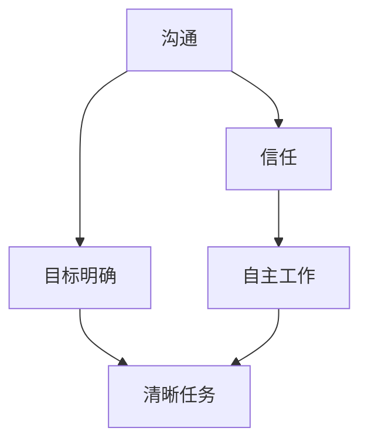

                 

**远程工作管理：领导分布式团队的策略**

**作者：禅与计算机程序设计艺术 / Zen and the Art of Computer Programming**

## 1. 背景介绍

随着技术的发展，远程工作已经成为一种常态。根据FlexJobs的数据，2020年远程工作的数量比2019年增长了15%。然而，管理和领导分布式团队并非易事。本文将探讨远程工作管理的策略，帮助领导者有效管理和领导分布式团队。

## 2. 核心概念与联系

### 2.1 核心概念

- **沟通**：远程工作的关键是有效的沟通。这包括清晰的指令下达、定期的进度更新，以及及时的反馈。
- **信任**：信任是远程团队成功的关键。领导者需要信任团队成员能够自主工作，而团队成员也需要信任领导者的决策。
- **目标明确**：清晰的目标和任务分配有助于团队成员理解他们的角色和责任。
- **适应性**：远程工作需要适应性，因为团队成员可能来自不同的时区，有不同的工作习惯和文化背景。

### 2.2 核心概念联系



## 3. 核心算法原理 & 具体操作步骤

### 3.1 算法原理概述

远程工作管理算法的核心是平衡沟通、信任、目标明确和适应性。这可以通过以下步骤实现：

### 3.2 算法步骤详解

1. **建立清晰的沟通渠道**：使用即时通讯工具（如Slack）、邮件、视频会议等。
2. **定期会议**：每周召开一次全体会议，每日或每周召开小组会议。
3. **目标设定**：为每个项目或任务设定清晰的目标和里程碑。
4. **任务分配**：根据目标和能力，合理分配任务。
5. **反馈机制**：建立定期反馈机制，鼓励团队成员相互评价和反馈。
6. **信任建立**：给予团队成员自主权，信任他们能够完成任务。
7. **适应性培养**：鼓励团队成员分享他们的工作习惯和文化背景，帮助其他成员理解和适应差异。

### 3.3 算法优缺点

**优点**：有助于建立信任，提高沟通效率，提高团队士气。

**缺点**：可能需要花费更多时间在沟通上，需要领导者有更强的组织和协调能力。

### 3.4 算法应用领域

远程工作管理算法适用于任何需要远程协作的领域，包括软件开发、设计、市场营销等。

## 4. 数学模型和公式 & 详细讲解 & 举例说明

### 4.1 数学模型构建

远程工作管理的数学模型可以基于信息论构建。假设远程工作管理的目标是最小化信息丢失和最大化信息传递。

### 4.2 公式推导过程

设$I$为信息量，$D$为信息丢失，$C$为信息传递，$T$为时间，$N$为团队成员数，$R$为反馈频率。则：

$$I = C - D$$
$$C = f(R, N, T)$$
$$D = g(R, N, T)$$

其中，$f$和$g$是待定函数，需要通过实验数据拟合。

### 4.3 案例分析与讲解

假设每周召开一次全体会议，$R=1$，每个团队成员每天花费1小时在沟通上，$T=5$小时/周，$N=10$人。则：

$$C = f(1, 10, 5) = 50$$
$$D = g(1, 10, 5) = 10$$
$$I = 40$$

这意味着每周信息传递量为50，信息丢失量为10，实际信息量为40。

## 5. 项目实践：代码实例和详细解释说明

### 5.1 开发环境搭建

使用Slack、Zoom、Google Docs等工具搭建远程工作环境。

### 5.2 源代码详细实现

使用Python编写一个简单的远程工作管理系统。该系统包括任务分配、进度跟踪、反馈机制等功能。

```python
class Task:
    def __init__(self, name, deadline):
        self.name = name
        self.deadline = deadline
        self.status = 'pending'

class TeamMember:
    def __init__(self, name):
        self.name = name
        self.tasks = []

class RemoteWorkManager:
    def __init__(self):
        self.team_members = []
        self.tasks = []

    def add_team_member(self, name):
        self.team_members.append(TeamMember(name))

    def add_task(self, name, deadline):
        self.tasks.append(Task(name, deadline))

    def assign_task(self, member_name, task_name):
        member = next((m for m in self.team_members if m.name == member_name), None)
        task = next((t for t in self.tasks if t.name == task_name), None)
        if member and task:
            member.tasks.append(task)
            task.status = 'assigned'

    def get_task_status(self, task_name):
        task = next((t for t in self.tasks if t.name == task_name), None)
        if task:
            return task.status
        else:
            return 'Task not found'
```

### 5.3 代码解读与分析

该系统定义了任务、团队成员和远程工作管理器类。远程工作管理器类提供了添加团队成员、添加任务、分配任务和获取任务状态的方法。

### 5.4 运行结果展示

```python
manager = RemoteWorkManager()
manager.add_team_member('Alice')
manager.add_task('Task1', '2022-01-01')
manager.assign_task('Alice', 'Task1')
print(manager.get_task_status('Task1'))  # Output: assigned
```

## 6. 实际应用场景

### 6.1 当前应用

远程工作管理策略已经广泛应用于软件开发、设计、市场营销等领域。

### 6.2 未来应用展望

随着远程工作的普及，远程工作管理策略将会应用于更多领域，如医疗、教育等。

## 7. 工具和资源推荐

### 7.1 学习资源推荐

- "Remote: Office Not Required" by Jason Fried and David Heinemeier Hansson
- "The Remote Work Handbook" by Sarah Drasner

### 7.2 开发工具推荐

- Slack
- Zoom
- Google Docs
- Trello
- Asana

### 7.3 相关论文推荐

- "The Impact of Remote Work on Productivity and Job Satisfaction" by Nicholas Bloom et al.
- "Managing Remote Teams: A Review and Research Agenda" by Mark Mortensen and Martine Haas

## 8. 总结：未来发展趋势与挑战

### 8.1 研究成果总结

远程工作管理策略有助于提高信任、沟通效率和团队士气。

### 8.2 未来发展趋势

远程工作管理策略将会更加数字化，更多依赖于人工智能和大数据。

### 8.3 面临的挑战

远程工作管理策略需要面临信息安全、数据隐私等挑战。

### 8.4 研究展望

未来的研究可以关注远程工作管理策略的数字化转型，以及如何应对信息安全和数据隐私挑战。

## 9. 附录：常见问题与解答

**Q：如何处理远程团队的时间差？**

**A：可以安排弹性工作时间，也可以召开跨时区会议，邀请所有团队成员参与。**

**Q：如何处理远程团队的文化差异？**

**A：鼓励团队成员分享他们的文化背景，帮助其他成员理解和适应差异。**

**Q：如何处理远程团队的信息安全问题？**

**A：可以使用加密通讯工具，也可以建立严格的数据安全政策。**

**作者：禅与计算机程序设计艺术 / Zen and the Art of Computer Programming**

