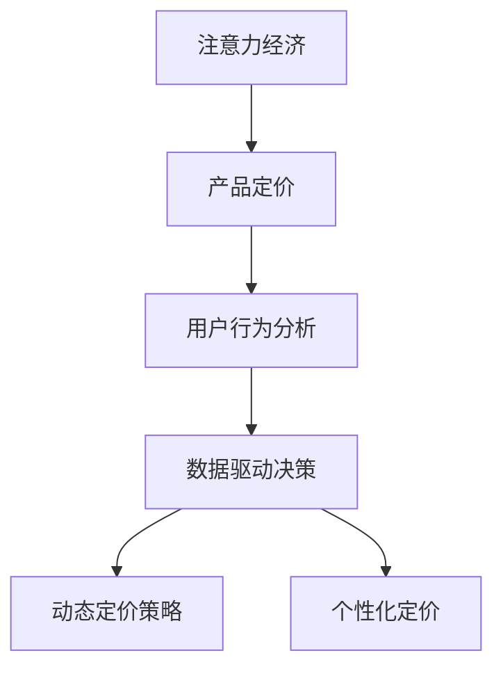

                 

# 注意力经济对企业产品定价的新要求

> 关键词：注意力经济, 产品定价, 用户行为分析, 数据驱动决策, 动态定价策略

## 1. 背景介绍

### 1.1 问题由来

随着互联网和移动设备的普及，人们获取信息和内容的方式发生了根本性变化。传统的线性媒体和电视广告模式逐渐被数字化内容所取代。企业和品牌面临着如何吸引和保持用户注意力的挑战。这不仅是一个市场竞争问题，更是一个关乎生存和发展的战略决策问题。

在这一背景下，“注意力经济”（Attention Economy）的概念应运而生。注意力经济强调，在信息过载的数字化时代，用户的时间和注意力是一种稀缺资源，企业需要运用各种策略和手段，吸引和保持用户的注意力，从而实现商业价值的最大化。

### 1.2 问题核心关键点

注意力经济的核心在于理解和预测用户的注意力行为，从而实现更为精准和有效的产品定价策略。具体来说，以下几个关键点构成了注意力经济对企业产品定价的新要求：

1. **用户行为分析**：通过对用户行为数据的深度挖掘和分析，识别用户注意力集中和流失的关键因素，为产品定价提供数据支持。
2. **数据驱动决策**：利用机器学习和数据分析技术，预测用户的购买行为和支付意愿，优化产品定价策略。
3. **动态定价策略**：根据用户的实时行为数据，动态调整产品价格，以最大化短期和长期收益。
4. **个性化定价**：根据用户的个人特征和行为偏好，提供个性化的定价方案，提升用户满意度和忠诚度。

### 1.3 问题研究意义

理解并应用注意力经济，对企业产品定价具有重要的现实意义：

1. **提高营销效率**：通过精确分析用户行为，企业可以更有针对性地开展营销活动，提升广告投放效果。
2. **优化库存管理**：动态定价策略有助于企业实时调整产品库存，减少积压和缺货情况，提高运营效率。
3. **增强用户体验**：个性化的定价策略可以满足不同用户的需求，提升用户体验和满意度。
4. **应对市场变化**：在快速变化的市场环境中，灵活的定价策略使企业能够迅速调整，保持竞争力。

## 2. 核心概念与联系

### 2.1 核心概念概述

为了更好地理解注意力经济对企业产品定价的影响，本节将介绍几个密切相关的核心概念：

- **注意力经济**：指在数字化时代，用户时间和注意力的稀缺性。企业和品牌需要通过多种策略吸引和保持用户注意力，从而实现商业价值最大化。
- **产品定价**：指企业根据市场需求、成本和竞争状况等因素，对产品和服务制定的价格。
- **用户行为分析**：通过收集和分析用户行为数据，理解用户的注意力偏好和行为模式。
- **数据驱动决策**：利用数据和分析工具，辅助企业进行决策和策略制定。
- **动态定价策略**：根据市场和用户实时数据，动态调整产品价格，以最大化收益。
- **个性化定价**：根据用户特征和行为，提供个性化的定价方案，提升用户体验和忠诚度。

这些概念之间的逻辑关系可以通过以下Mermaid流程图来展示：



这个流程图展示了几者之间的联系：注意力经济通过用户行为分析，辅助数据驱动决策，从而制定动态定价策略和个性化定价方案。

## 3. 核心算法原理 & 具体操作步骤

### 3.1 算法原理概述

注意力经济对企业产品定价的影响，主要通过以下算法原理实现：

1. **用户行为建模**：通过对用户历史行为数据的建模，预测用户未来的行为模式和支付意愿。
2. **价值评估**：基于用户行为模型和市场数据，评估不同用户的潜在价值。
3. **定价策略制定**：根据用户的潜在价值和市场需求，制定动态定价策略。
4. **定价策略优化**：利用优化算法，不断调整定价策略，以实现最优收益。

### 3.2 算法步骤详解

基于注意力经济的产品定价算法主要包括以下几个关键步骤：

**Step 1: 数据准备**
- 收集用户行为数据，包括浏览记录、购买记录、支付意愿等信息。
- 整理市场数据，如竞争对手价格、市场供需状况等。

**Step 2: 用户行为分析**
- 对用户行为数据进行预处理和清洗，去除噪声和异常值。
- 应用机器学习算法，如回归分析、分类算法、聚类算法等，构建用户行为模型。

**Step 3: 价值评估**
- 利用用户行为模型和市场数据，评估不同用户的潜在价值。
- 结合用户的年龄、性别、地理位置等信息，进行综合价值评估。

**Step 4: 定价策略制定**
- 根据用户的潜在价值和市场需求，制定初步的定价策略。
- 考虑竞争对手价格、市场供需状况等因素，调整定价策略。

**Step 5: 定价策略优化**
- 应用优化算法，如线性规划、梯度下降等，不断调整定价策略，以实现最优收益。
- 实时监测定价策略的效果，根据反馈调整策略。

### 3.3 算法优缺点

注意力经济下的产品定价算法具有以下优点：

1. **精准度提升**：通过用户行为分析和数据驱动决策，可以更精准地预测用户行为和支付意愿，从而制定更加有效的定价策略。
2. **灵活性增强**：动态定价策略可以根据市场变化和用户行为实时调整，保持价格的灵活性和竞争力。
3. **用户满意度提高**：个性化定价策略能够满足不同用户的需求，提升用户满意度和忠诚度。

但同时，该算法也存在一定的局限性：

1. **数据依赖性高**：算法的准确性高度依赖于高质量的用户行为数据，数据缺失或不准确将影响决策结果。
2. **复杂度高**：涉及用户行为建模、价值评估、定价策略制定等多个步骤，算法复杂度较高。
3. **技术门槛高**：需要一定的机器学习和数据分析背景，对企业的技术实力提出了较高要求。

### 3.4 算法应用领域

注意力经济下的产品定价算法广泛应用于以下领域：

- **电商平台**：通过分析用户行为和支付意愿，制定个性化定价策略，提升销售额和用户满意度。
- **旅游行业**：根据用户的出行历史和偏好，动态调整航班、酒店价格，提高预订率和收入。
- **金融服务**：基于用户的消费习惯和支付意愿，设计差异化金融产品定价方案，提升市场竞争力。
- **游戏行业**：通过分析用户的游戏行为和消费数据，制定个性化的游戏内物品定价策略，提高用户黏性和收入。

## 4. 数学模型和公式 & 详细讲解

### 4.1 数学模型构建

本节将使用数学语言对注意力经济下的产品定价算法进行严格描述。

设用户集合为 $U=\{u_1, u_2, ..., u_N\}$，每个用户 $u_i$ 在产品 $p$ 上的潜在价值为 $V_i(p)$，市场需求为 $D(p)$，固定成本为 $C$，变动成本为 $v(p)$，目标是最优化定价 $p$ 以最大化收益 $R(p)$。则收益 $R(p)$ 可以表示为：

$$
R(p) = \sum_{i=1}^{N} V_i(p) \cdot D(p) - C - \sum_{i=1}^{N} v(p)
$$

### 4.2 公式推导过程

为了求解最优定价 $p^*$，需要对收益函数 $R(p)$ 进行最大化求解。利用拉格朗日乘数法，引入拉格朗日乘子 $\lambda$ 和 $\mu$，构建拉格朗日函数：

$$
\mathcal{L}(p, \lambda, \mu) = \sum_{i=1}^{N} V_i(p) \cdot D(p) - C - \sum_{i=1}^{N} v(p) + \lambda (C + \sum_{i=1}^{N} v(p) - R(p))
$$

对 $p$ 求导并令导数等于零，可得：

$$
\frac{\partial \mathcal{L}}{\partial p} = D(p) \cdot \sum_{i=1}^{N} V_i'(p) - \mu = 0
$$

其中 $V_i'(p)$ 为 $V_i(p)$ 对 $p$ 的导数。

根据上述方程，可以求解出最优定价 $p^*$：

$$
p^* = \arg\max_{p} \sum_{i=1}^{N} V_i(p) \cdot D(p) - C - \sum_{i=1}^{N} v(p)
$$

### 4.3 案例分析与讲解

假设某电商平台销售一款新产品，收集了过去一年内所有用户的浏览记录和购买记录，建立了用户行为模型。通过市场调查，得知当前市场需求为 $D(p) = 1000 - 0.1p$，固定成本为 $C = 10000$，变动成本为 $v(p) = 0.2p^2$。利用上述公式，可以计算出最优定价 $p^*$ 及其对应的收益 $R(p^*)$。

## 5. 项目实践：代码实例和详细解释说明

### 5.1 开发环境搭建

在进行产品定价算法实践前，我们需要准备好开发环境。以下是使用Python进行项目实践的配置流程：

1. 安装Python 3.x及以上版本，建议使用Anaconda进行环境管理。
2. 安装所需库，包括Pandas、NumPy、SciPy、Scikit-learn等数据处理和机器学习库。
3. 配置本地或云端的计算资源，准备高性能计算机或云服务器。
4. 安装必要的软件工具，如Jupyter Notebook、PyCharm等。

### 5.2 源代码详细实现

以下是一个简化的产品定价算法实现示例：

```python
import pandas as pd
import numpy as np
from scipy.optimize import minimize

# 用户行为数据，包含用户的浏览记录和购买记录
data = pd.read_csv('user_behavior.csv')

# 计算每个用户在产品上的潜在价值
V = np.array([data['value'][i] for i in range(len(data))])

# 市场需求函数
def demand(p):
    return 1000 - 0.1 * p

# 固定成本和变动成本
C = 10000
v = 0.2 * p**2

# 定义目标函数
def objective(p):
    return V.dot(demand(p)) - C - v

# 求导并求解最优定价
res = minimize(objective, 0, method='BFGS')
p_opt = res.x[0]
R_opt = objective(p_opt)

print('最优定价：', p_opt)
print('最优收益：', R_opt)
```

### 5.3 代码解读与分析

让我们对代码进行详细解读：

**用户行为数据**：通过Pandas库读取用户行为数据，包含用户的浏览记录、购买记录和潜在价值。

**市场需求函数**：定义市场需求函数，根据价格 $p$ 计算市场需求。

**目标函数**：定义目标函数，包括用户潜在价值、市场需求、固定成本和变动成本，目标是最大化收益。

**优化求解**：使用SciPy库的minimize函数，通过BFGS算法求解目标函数的最大值，得到最优定价 $p^*$ 和对应的最优收益 $R^*$。

### 5.4 运行结果展示

运行上述代码，可以输出最优定价和对应的最优收益。例如，若最优定价为50元，则最优收益为：

$$
R^* = V \cdot D(p^*) - C - V \cdot v(p^*)
$$

将 $p^* = 50$ 代入，计算得到 $R^*$。

## 6. 实际应用场景

### 6.1 电商平台

电商平台可以通过用户行为数据分析，制定个性化的定价策略。例如，针对高价值用户提供更低的价格优惠，吸引其下单购买。同时，根据市场需求变化，实时调整商品价格，保持竞争力。

### 6.2 旅游行业

旅游行业可以根据用户的出行历史和偏好，动态调整航班和酒店价格。例如，对常旅客提供会员价，对临时用户提供促销价，提升预订率和收入。

### 6.3 金融服务

金融服务企业可以根据用户的消费习惯和支付意愿，设计差异化金融产品定价方案。例如，对高信用评分用户提供更低利率的贷款产品，提升客户满意度和忠诚度。

### 6.4 游戏行业

游戏行业可以通过分析用户的游戏行为和消费数据，制定个性化的游戏内物品定价策略。例如，对重度玩家提供低价道具，对新用户提供高折扣奖励，提高用户黏性和收入。

## 7. 工具和资源推荐

### 7.1 学习资源推荐

为了帮助开发者系统掌握注意力经济对产品定价的影响，这里推荐一些优质的学习资源：

1. 《注意力经济学：如何吸引和保持用户注意力》一书：深入分析注意力经济的核心概念和应用场景，提供系统化的理论框架。
2. Coursera的《数据科学与机器学习》课程：涵盖数据驱动决策和机器学习的基础知识，适合初学者入门。
3. Kaggle平台：提供丰富的用户行为数据集，供开发者实践和比赛。
4. Google Colab：提供免费的GPU/TPU算力，方便开发者快速实验和验证模型。
5. Scikit-learn官方文档：详细介绍了Scikit-learn库的使用方法，涵盖数据预处理、模型训练和评估等各个环节。

通过这些资源的学习实践，相信你一定能够快速掌握注意力经济对产品定价的影响，并用于解决实际的商业问题。

### 7.2 开发工具推荐

高效的开发离不开优秀的工具支持。以下是几款用于注意力经济产品定价开发的常用工具：

1. Jupyter Notebook：提供交互式的编程环境，方便调试和验证模型。
2. PyCharm：提供丰富的功能和工具，支持数据预处理、模型训练和部署等各个环节。
3. TensorBoard：提供可视化工具，实时监测模型的训练和推理效果。
4. Apache Spark：提供大规模数据处理能力，支持分布式计算和数据挖掘。
5. Dask：提供高性能数据处理框架，支持大规模数据集的处理和分析。

合理利用这些工具，可以显著提升注意力经济产品定价的开发效率，加快创新迭代的步伐。

### 7.3 相关论文推荐

注意力经济下的产品定价技术不断发展，以下是几篇奠基性的相关论文，推荐阅读：

1. 《注意力经济学：数字时代的新挑战》：探讨注意力经济对传统经济学模型的挑战和影响。
2. 《基于用户行为分析的定价策略》：利用机器学习模型预测用户行为，制定动态定价策略。
3. 《个性化的产品定价算法》：提出基于用户特征和行为的定价算法，提升用户体验和忠诚度。
4. 《分布式定价策略的优化》：研究分布式环境下的定价策略优化问题，提高定价效率。
5. 《大数据下的动态定价策略》：利用大数据分析技术，制定动态定价策略，优化资源配置。

这些论文代表了大数据定价技术的发展脉络，通过学习这些前沿成果，可以帮助研究者把握学科前进方向，激发更多的创新灵感。

## 8. 总结：未来发展趋势与挑战

### 8.1 总结

本文对注意力经济对企业产品定价的影响进行了全面系统的介绍。首先阐述了注意力经济的概念和重要性，明确了产品定价在注意力经济下的新要求。其次，从原理到实践，详细讲解了注意力经济下的产品定价算法原理和操作步骤，给出了代码实例和详细解释说明。同时，本文还广泛探讨了注意力经济在电商平台、旅游行业、金融服务和游戏行业等实际应用场景，展示了注意力经济对产品定价的广泛影响。

通过本文的系统梳理，可以看到，注意力经济下的产品定价算法为传统商业模型注入了新的活力，能够更精准地预测用户行为，制定个性化的定价策略，提升企业的市场竞争力。未来，伴随注意力经济和产品定价技术的不断演进，必将进一步推动企业的数字化转型和智能化发展。

### 8.2 未来发展趋势

展望未来，注意力经济下的产品定价技术将呈现以下几个发展趋势：

1. **深度学习和大数据分析的应用**：利用深度学习和大数据分析技术，构建更加精确的用户行为模型，优化定价策略。
2. **实时化、动态化定价**：实时监测市场和用户行为变化，动态调整定价策略，以最大化短期和长期收益。
3. **跨平台、跨渠道定价**：利用用户行为数据，实现跨平台、跨渠道的定价策略优化，提升资源利用效率。
4. **个性化、差异化定价**：根据用户特征和行为，提供个性化的定价方案，提升用户体验和忠诚度。
5. **多模态数据融合**：结合文本、图像、视频等多种模态数据，构建更加全面的用户行为模型，提高定价的准确性。

这些趋势凸显了注意力经济对产品定价技术的广阔前景。这些方向的探索发展，必将进一步提升企业定价的精准度和灵活性，为企业带来更大的商业价值。

### 8.3 面临的挑战

尽管注意力经济下的产品定价技术已经取得了瞩目成就，但在迈向更加智能化、普适化应用的过程中，它仍面临着诸多挑战：

1. **数据质量和安全**：高质量的数据是定价策略的基础，但数据收集、清洗和处理过程复杂且成本高。同时，用户隐私保护和数据安全也是重要问题。
2. **技术门槛高**：深度学习和数据分析技术需要专业的知识和技能，对企业的数据分析和算法开发能力提出了较高要求。
3. **市场和用户行为变化快**：市场环境和用户行为变化迅速，定价策略需要快速响应，否则容易错失市场机会。
4. **复杂性和成本高**：复杂的定价策略设计、实现和优化过程需要投入大量时间和资源。
5. **市场和用户道德风险**：定价策略需要考虑市场竞争和用户公平性问题，避免垄断和不公平竞争。

### 8.4 研究展望

面对注意力经济产品定价所面临的挑战，未来的研究需要在以下几个方面寻求新的突破：

1. **数据驱动定价方法**：开发更加高效、灵活的数据驱动定价方法，降低数据获取和处理的成本，提高定价的准确性和实时性。
2. **智能定价系统**：构建智能定价系统，结合机器学习和自然语言处理技术，实现更加精准的定价预测和策略优化。
3. **用户行为心理学研究**：结合用户行为心理学，深入理解用户需求和偏好，设计更加人性化和公平的定价策略。
4. **隐私保护和数据安全**：研究隐私保护技术，确保用户数据的隐私和安全，建立可信的用户行为模型。
5. **跨学科合作**：结合经济学、心理学、计算机科学等多学科知识，构建更加全面和系统化的定价模型。

这些研究方向的探索，必将引领注意力经济产品定价技术迈向更高的台阶，为构建智能、公平、高效的定价系统铺平道路。面向未来，注意力经济产品定价技术还需要与其他技术进行更深入的融合，如区块链、云计算、物联网等，多路径协同发力，共同推动商业智能和数字化转型。

## 9. 附录：常见问题与解答

**Q1：注意力经济下的产品定价是否适用于所有行业？**

A: 注意力经济下的产品定价方法对大部分行业都适用，特别是对需要精准预测用户行为和支付意愿的行业。但对于一些特殊行业，如能源、公共服务、农业等，定价机制较为复杂，需要结合行业特性进行调整。

**Q2：如何选择合适的用户行为特征？**

A: 选择合适的用户行为特征是构建用户行为模型的关键。一般选择与用户购买行为相关性强、能够反映用户兴趣和偏好的特征，如浏览记录、购买历史、社交媒体互动等。特征工程是数据科学中的重要环节，需要根据具体业务场景进行合理选择和组合。

**Q3：注意力经济下的产品定价是否会影响用户的信任和忠诚度？**

A: 合理的产品定价策略可以提高用户的满意度和忠诚度，但过于频繁的价格波动和复杂的定价机制也可能导致用户的不信任和反感。企业在制定定价策略时，需要平衡市场收益和用户体验，确保定价的透明性和公平性。

**Q4：如何应对竞争对手的定价策略？**

A: 竞争对手的定价策略是市场竞争的重要因素，企业需要实时监测市场动态，灵活调整定价策略。可以通过价格监测工具、市场调研等方式，及时获取竞争对手的价格信息，优化自身的定价策略。

**Q5：如何衡量定价策略的效果？**

A: 定价策略的效果可以通过多个指标进行衡量，如销售额、毛利润率、用户满意度等。通过数据分析和业务指标监测，评估定价策略的效果，及时调整和优化。同时，可以采用A/B测试等方法，验证新策略的效果，提升定价决策的科学性。

---

作者：禅与计算机程序设计艺术 / Zen and the Art of Computer Programming

