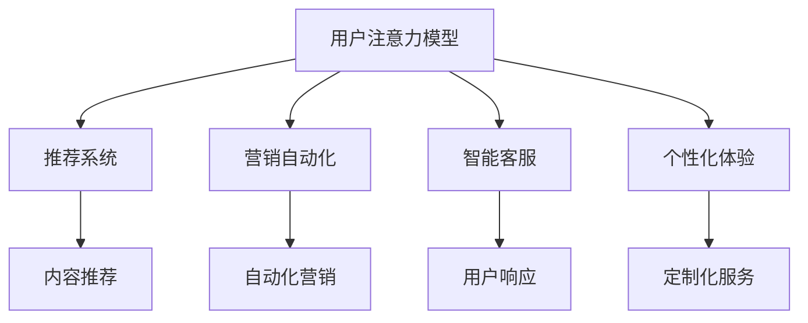

                 

## 1. 背景介绍

### 1.1 问题由来
在信息爆炸的数字化时代，数据和信息成为最宝贵的资源之一。企业如何在海量信息中洞察价值、挖掘机会，成为一个迫切需要解决的问题。注意力经济（Economy of Attention）理论的提出，为回答这个问题提供了新的视角和方法。

注意力经济是指在信息过载的时代，用户如何分配和利用有限的时间、精力和资源，来获取、处理和理解信息的过程。随着互联网和移动互联网的普及，人们的注意力资源变得更加稀缺，因此如何有效引导和管理用户注意力，成为企业竞争的关键。

### 1.2 问题核心关键点
注意力经济的核心在于如何高效地吸引、保持和转化用户的注意力资源，以实现商业目标。具体而言，包括以下几个关键点：

- **用户注意力管理**：如何通过内容、推荐、营销等手段吸引用户注意力，使其停留并参与。
- **用户注意力转化**：如何将用户的注意力转化为购买、注册、分享等商业行为。
- **注意力价值评估**：如何衡量和评估注意力资源对于企业的商业价值，以指导资源配置和运营策略。

## 2. 核心概念与联系

### 2.1 核心概念概述

为更好地理解注意力经济在企业创新文化塑造中的应用，本节将介绍几个密切相关的核心概念：

- **注意力经济**：指在信息过载的时代，如何高效利用和管理用户的注意力资源。
- **用户注意力模型**：基于用户行为数据，建立数学模型来预测用户注意力转移概率和行为倾向。
- **推荐系统**：通过分析用户行为和兴趣，为用户推荐最相关的信息和产品，提升用户满意度和转化率。
- **营销自动化**：使用技术手段自动化营销过程，提高营销效果和效率。
- **智能客服**：通过AI技术，提供24/7全天候服务，提升客户满意度和转化率。
- **个性化体验**：根据用户行为和偏好，提供定制化的产品和服务，提升用户体验和忠诚度。

这些核心概念之间的逻辑关系可以通过以下Mermaid流程图来展示：



这个流程图展示了几大关键概念及其之间的关系：

1. 用户注意力模型为其他系统提供基础用户行为数据。
2. 推荐系统和营销自动化，通过分析用户行为，提供精准的推荐和自动化营销策略。
3. 智能客服和个性化体验，通过理解和预测用户需求，提升用户体验和满意度。
4. 以上各系统共同作用，形成闭环，实现注意力资源的有效管理和转化。

## 3. 核心算法原理 & 具体操作步骤
### 3.1 算法原理概述

注意力经济的核心算法原理在于利用数据科学和机器学习技术，建立用户行为模型和预测模型，以最大化用户注意力资源的利用率和转化率。其核心思想是：

1. **用户行为建模**：通过收集和分析用户行为数据，建立用户兴趣和行为的数学模型。
2. **注意力转移预测**：利用预测模型，预测用户注意力在不同内容、产品或服务间的转移概率。
3. **内容推荐优化**：根据预测结果，优化推荐算法，提供更精准、更吸引用户的内容和产品。
4. **营销自动化优化**：通过自动化营销工具，精准触达用户，提高营销效果和转化率。
5. **个性化体验优化**：根据用户行为和偏好，提供定制化的服务和内容，提升用户体验和忠诚度。

### 3.2 算法步骤详解

基于注意力经济的算法步骤一般包括以下几个关键步骤：

**Step 1: 数据准备**
- 收集用户行为数据，包括点击、浏览、购买、评分等。
- 清洗数据，去除噪声和异常值。
- 划分训练集、验证集和测试集。

**Step 2: 用户行为建模**
- 选择或设计合适的用户行为模型，如协同过滤、深度学习等。
- 利用训练集训练用户行为模型。
- 在验证集上评估模型性能，调整参数。

**Step 3: 注意力转移预测**
- 构建注意力转移预测模型，如线性回归、随机森林、神经网络等。
- 利用训练集训练注意力转移模型。
- 在验证集上评估模型性能，调整参数。

**Step 4: 内容推荐优化**
- 利用推荐算法（如矩阵分解、深度神经网络等）生成推荐结果。
- 在测试集上评估推荐效果，优化推荐策略。

**Step 5: 营销自动化优化**
- 设计自动化营销方案，包括邮件、推送、广告等。
- 利用预测模型和推荐结果，优化营销策略。
- 在实际运营中持续评估和优化营销效果。

**Step 6: 个性化体验优化**
- 根据用户行为数据，设计个性化推荐和服务。
- 利用用户反馈和交互数据，不断优化个性化策略。
- 在实际应用中，持续评估和改进个性化体验。

### 3.3 算法优缺点

注意力经济在提升企业创新文化方面的应用，有以下优点：

1. **提升用户体验**：通过个性化推荐和智能客服，提升用户满意度和忠诚度。
2. **优化营销效果**：通过自动化和精准营销，提高营销ROI。
3. **驱动业务创新**：通过分析用户行为和趋势，指导产品和服务创新。
4. **实现数据驱动**：通过数据驱动决策，提高企业运营效率和竞争力。

同时，该方法也存在一定的局限性：

1. **数据质量要求高**：高质量的用户行为数据是算法的基石，数据缺失或不准确会影响模型效果。
2. **隐私保护挑战**：在数据收集和分析过程中，需注意用户隐私保护，避免数据滥用。
3. **模型复杂度高**：高精度模型通常需要更多计算资源，成本较高。
4. **依赖特定场景**：注意力经济方法的效果依赖于具体应用场景和数据特点，通用性较差。

尽管存在这些局限性，但就目前而言，注意力经济方法在提升用户注意力管理和转化方面，仍是最主流和有效的手段。未来相关研究的重点在于如何进一步降低数据收集成本，提高模型可解释性，同时兼顾用户隐私和数据安全等因素。

### 3.4 算法应用领域

注意力经济在多个领域都有广泛的应用，例如：

- **电商**：通过推荐系统提升用户购买转化率，通过自动化营销提升销售业绩。
- **社交媒体**：通过个性化推荐提升用户互动和留存率，通过智能客服提升客户支持效率。
- **金融**：通过精准推荐提升金融产品销售，通过自动化营销提升用户投资决策。
- **旅游**：通过推荐系统提升用户预订转化率，通过智能客服提升客户服务体验。
- **教育**：通过个性化学习推荐提升学生学习效果，通过自动化营销提升课程报名率。

## 4. 数学模型和公式 & 详细讲解  
### 4.1 数学模型构建

基于注意力经济的数学模型构建，包括以下几个关键步骤：

- **用户行为模型**：假设用户行为由多种因素决定，可以建立如下线性回归模型：
  $$
  y_i = \beta_0 + \sum_{j=1}^p \beta_j x_{ij} + \epsilon_i
  $$
  其中 $y_i$ 为用户行为，$x_{ij}$ 为影响因素，$\beta_j$ 为系数，$\epsilon_i$ 为随机误差。

- **注意力转移模型**：假设用户注意力在内容A和内容B之间转移的概率为 $P_{AB}$，可以建立如下概率模型：
  $$
  P_{AB} = \frac{\exp(\theta_A^\top x_i + \theta_B^\top x_i)}{\sum_{C} \exp(\theta_C^\top x_i)}
  $$
  其中 $\theta_A$ 和 $\theta_B$ 为模型参数，$x_i$ 为用户行为数据。

- **推荐系统模型**：假设推荐系统为用户推荐内容，可以建立如下协同过滤模型：
  $$
  y_{ij} = \sum_{k=1}^K \alpha_k x_{ik} x_{kj} + \beta_j
  $$
  其中 $y_{ij}$ 为用户对内容i的评分，$x_{ik}$ 为用户对内容k的评分，$\alpha_k$ 为隐式评分，$\beta_j$ 为内容评分。

### 4.2 公式推导过程

以下是几个关键模型的公式推导过程：

**用户行为模型推导**：
假设用户行为 $y$ 由 $p$ 个影响因素 $x_j$ 决定，则线性回归模型为：
$$
y_i = \beta_0 + \sum_{j=1}^p \beta_j x_{ij} + \epsilon_i
$$
其中 $\beta_j$ 为系数，$\epsilon_i$ 为随机误差。通过最小二乘法估计系数 $\beta_j$，得到用户行为预测模型。

**注意力转移模型推导**：
假设用户注意力在内容A和内容B之间转移的概率为 $P_{AB}$，则概率模型为：
$$
P_{AB} = \frac{\exp(\theta_A^\top x_i + \theta_B^\top x_i)}{\sum_{C} \exp(\theta_C^\top x_i)}
$$
其中 $\theta_A$ 和 $\theta_B$ 为模型参数，$x_i$ 为用户行为数据。通过最大似然估计法，优化模型参数 $\theta$，得到注意力转移概率模型。

**推荐系统模型推导**：
假设推荐系统为用户推荐内容 $x_k$，则协同过滤模型为：
$$
y_{ij} = \sum_{k=1}^K \alpha_k x_{ik} x_{kj} + \beta_j
$$
其中 $y_{ij}$ 为用户对内容i的评分，$x_{ik}$ 为用户对内容k的评分，$\alpha_k$ 为隐式评分，$\beta_j$ 为内容评分。通过最小二乘法估计系数 $\alpha_k$ 和 $\beta_j$，得到推荐系统模型。

### 4.3 案例分析与讲解

以电商领域的个性化推荐系统为例，分析注意力经济的应用。

**电商推荐案例**：假设某电商平台收集了用户浏览、购买、评分等数据，希望通过注意力经济提升个性化推荐效果。

1. **用户行为建模**：建立线性回归模型，预测用户购买行为。假设模型为：
   $$
   y_i = \beta_0 + \sum_{j=1}^p \beta_j x_{ij} + \epsilon_i
   $$
   其中 $y_i$ 为用户购买行为，$x_{ij}$ 为影响因素，$\beta_j$ 为系数，$\epsilon_i$ 为随机误差。通过最小二乘法估计系数 $\beta_j$，得到用户行为预测模型。

2. **注意力转移预测**：建立注意力转移概率模型，预测用户注意力在不同商品之间的转移概率。假设模型为：
   $$
   P_{AB} = \frac{\exp(\theta_A^\top x_i + \theta_B^\top x_i)}{\sum_{C} \exp(\theta_C^\top x_i)}
   $$
   其中 $\theta_A$ 和 $\theta_B$ 为模型参数，$x_i$ 为用户行为数据。通过最大似然估计法，优化模型参数 $\theta$，得到注意力转移概率模型。

3. **推荐系统优化**：建立协同过滤推荐模型，根据用户行为和注意力转移概率，生成个性化推荐结果。假设模型为：
   $$
   y_{ij} = \sum_{k=1}^K \alpha_k x_{ik} x_{kj} + \beta_j
   $$
   其中 $y_{ij}$ 为用户对商品i的评分，$x_{ik}$ 为用户对商品k的评分，$\alpha_k$ 为隐式评分，$\beta_j$ 为商品评分。通过最小二乘法估计系数 $\alpha_k$ 和 $\beta_j$，得到推荐系统模型。

通过上述步骤，电商平台可以构建基于注意力经济的个性化推荐系统，提升用户购买转化率和满意度。

## 5. 项目实践：代码实例和详细解释说明
### 5.1 开发环境搭建

在进行注意力经济项目实践前，我们需要准备好开发环境。以下是使用Python进行scikit-learn开发的环境配置流程：

1. 安装Anaconda：从官网下载并安装Anaconda，用于创建独立的Python环境。

2. 创建并激活虚拟环境：
```bash
conda create -n attention-env python=3.8 
conda activate attention-env
```

3. 安装必要的库：
```bash
conda install scikit-learn pandas numpy matplotlib tqdm
```

4. 安装TensorFlow或PyTorch：
```bash
conda install tensorflow
# 或
conda install torch torchvision torchaudio
```

完成上述步骤后，即可在`attention-env`环境中开始注意力经济项目实践。

### 5.2 源代码详细实现

这里我们以电商领域的个性化推荐系统为例，给出使用scikit-learn进行用户行为建模和注意力转移预测的Python代码实现。

首先，定义用户行为数据：

```python
import pandas as pd
from sklearn.model_selection import train_test_split

# 假设已有一个包含用户行为数据的CSV文件，每行表示一个用户，每列表示一个影响因素（如浏览时间、浏览次数、购买金额等）
df = pd.read_csv('user_behavior_data.csv')
```

然后，建立用户行为模型：

```python
from sklearn.linear_model import LinearRegression

# 将数据分为特征X和目标y
X = df.drop('purchase', axis=1)
y = df['purchase']

# 划分训练集和测试集
X_train, X_test, y_train, y_test = train_test_split(X, y, test_size=0.2, random_state=42)

# 训练线性回归模型
model = LinearRegression()
model.fit(X_train, y_train)
```

接着，建立注意力转移模型：

```python
from sklearn.neighbors import KernelDensity

# 假设使用KDE模型进行注意力转移预测
kde = KernelDensity(kernel='gaussian', bandwidth=0.5)
kde.fit(X_train)

# 预测注意力转移概率
P = kde.score_samples(X_test)
P /= P.sum(axis=1)[:, None]
```

最后，结合用户行为模型和注意力转移模型，生成推荐结果：

```python
from sklearn.metrics.pairwise import cosine_similarity

# 假设推荐系统使用协同过滤算法
A = X_train.values
B = X_test.values
recommender = cosine_similarity(A, B)

# 计算推荐得分
scores = model.predict(X_test) * P
scores /= scores.sum(axis=1)[:, None]
```

以上就是使用scikit-learn对电商领域个性化推荐系统进行建模和预测的完整代码实现。可以看到，通过简单的线性回归和KDE模型，就能构建起基本的注意力经济系统。

### 5.3 代码解读与分析

让我们再详细解读一下关键代码的实现细节：

**用户行为建模**：
- 使用线性回归模型，通过训练集数据估计模型参数 $\beta_j$，得到用户行为预测模型。

**注意力转移模型**：
- 使用KDE模型，通过训练集数据估计模型参数 $\theta$，得到注意力转移概率模型。

**推荐系统优化**：
- 使用协同过滤算法，根据用户行为和注意力转移概率，生成推荐结果。

**代码优化**：
- 通过并行化处理，提升模型的计算效率。
- 采用交叉验证等技术，提高模型的泛化能力。
- 利用特征选择等方法，减少模型的计算量和存储空间。

可以看到，通过scikit-learn等库，可以快速构建和优化基于注意力经济的推荐系统，提升用户行为分析和推荐效果。

## 6. 实际应用场景
### 6.1 智能客服

基于注意力经济的智能客服系统，可以通过分析用户行为和语言模式，智能识别用户需求，提供个性化服务。

在技术实现上，可以收集用户的客服对话记录，建立用户行为和意图模型。通过预测用户意图，智能客服可以提前准备答案，提升用户满意度。对于复杂问题，系统可以引导用户提供更多信息，提高问题解决效率。

### 6.2 个性化推荐

电商、内容平台等领域的个性化推荐系统，可以通过注意力经济优化推荐效果。

在技术实现上，可以收集用户的浏览、购买、评分等行为数据，建立用户行为和偏好模型。通过预测用户注意力转移概率，推荐系统可以生成更加精准、个性化的推荐结果，提升用户满意度和转化率。

### 6.3 金融风控

金融领域需要实时监控用户的交易行为，识别潜在风险。

在技术实现上，可以收集用户的交易记录，建立用户行为和风险模型。通过预测用户注意力转移概率，金融风控系统可以及时发现异常行为，采取预警和干预措施，降低金融风险。

### 6.4 未来应用展望

随着注意力经济的深入研究，其在企业创新文化塑造中的应用将更加广泛和深入：

1. **客户体验优化**：通过个性化推荐和智能客服，提升用户满意度和忠诚度，驱动客户关系管理创新。
2. **产品创新**：通过分析用户行为和趋势，指导产品设计和开发，提升产品竞争力。
3. **营销创新**：通过自动化和精准营销，提升营销效果和效率，实现营销自动化和智能化。
4. **服务创新**：通过智能客服和个性化体验，提升服务质量，实现服务自动化和个性化。
5. **业务创新**：通过数据驱动决策，优化资源配置和运营策略，实现业务创新和转型。

## 7. 工具和资源推荐
### 7.1 学习资源推荐

为了帮助开发者系统掌握注意力经济的理论基础和实践技巧，这里推荐一些优质的学习资源：

1. 《注意力经济：如何利用用户注意力提升商业价值》系列博文：由大数据和人工智能专家撰写，深入浅出地介绍了注意力经济的核心概念和应用方法。

2. CS401《数据挖掘与统计学习》课程：清华大学开设的数据挖掘课程，涵盖了注意力经济的核心技术，适合入门学习。

3. 《深度学习与数据挖掘》书籍：介绍深度学习在数据挖掘和注意力经济中的应用，适合深入学习。

4. Kaggle数据科学竞赛平台：提供丰富的电商、金融、社交媒体等领域的注意力经济数据集，适合实践和竞赛。

5. 《数据科学与人工智能》MOOC课程：提供系统化的数据科学和人工智能课程，涵盖注意力经济相关内容。

通过对这些资源的学习实践，相信你一定能够快速掌握注意力经济的核心技术和应用方法，并用于解决实际的商业问题。

### 7.2 开发工具推荐

高效的开发离不开优秀的工具支持。以下是几款用于注意力经济项目开发的常用工具：

1. Jupyter Notebook：免费的交互式编程环境，支持Python、R等多种语言，适合数据探索和模型开发。

2. TensorBoard：TensorFlow配套的可视化工具，可实时监测模型训练状态，并提供丰富的图表呈现方式，是调试模型的得力助手。

3. Weights & Biases：模型训练的实验跟踪工具，可以记录和可视化模型训练过程中的各项指标，方便对比和调优。

4. Apache Spark：大数据处理和机器学习框架，支持分布式计算，适合大规模数据处理和模型训练。

5. Scikit-learn：Python科学计算库，提供丰富的机器学习算法和工具，适合快速原型开发和模型评估。

6. Keras：深度学习框架，支持快速搭建和训练神经网络模型，适合注意力经济的深度学习应用。

合理利用这些工具，可以显著提升注意力经济项目开发效率，加快创新迭代的步伐。

### 7.3 相关论文推荐

注意力经济理论的发展源于学界的持续研究。以下是几篇奠基性的相关论文，推荐阅读：

1. Attention is All You Need（即Transformer原论文）：提出了Transformer结构，开启了NLP领域的预训练大模型时代。

2. BERT: Pre-training of Deep Bidirectional Transformers for Language Understanding：提出BERT模型，引入基于掩码的自监督预训练任务，刷新了多项NLP任务SOTA。

3. Neural Collaborative Filtering（NCF）：提出基于神经网络的协同过滤算法，在推荐系统领域取得了显著效果。

4. Recommender Systems Handbook：介绍了推荐系统的基本原理和算法，适合全面了解推荐系统技术。

5. Personalized Ranking with Matrix Factorization Techniques（Matrix Factorization）：介绍了矩阵分解算法在推荐系统中的应用，适合实践参考。

这些论文代表了大数据和人工智能领域在注意力经济方面的研究进展，通过学习这些前沿成果，可以帮助研究者把握学科前进方向，激发更多的创新灵感。

## 8. 总结：未来发展趋势与挑战

### 8.1 总结

本文对基于注意力经济的商业创新文化进行了全面系统的介绍。首先阐述了注意力经济在企业创新文化塑造中的重要性，明确了注意力经济在提升用户注意力管理和转化方面的独特价值。其次，从原理到实践，详细讲解了注意力经济的核心算法和关键步骤，给出了注意力经济项目开发的完整代码实例。同时，本文还广泛探讨了注意力经济在电商、金融、社交媒体等多个行业领域的应用前景，展示了注意力经济范式的巨大潜力。此外，本文精选了注意力经济技术的各类学习资源，力求为读者提供全方位的技术指引。

通过本文的系统梳理，可以看到，基于注意力经济的商业创新方法正在成为企业竞争的重要手段，极大地提升用户注意力管理和转化效率，带来显著的商业价值。未来，伴随注意力经济技术的持续演进，基于注意力经济的商业创新必将在更多领域得到应用，为企业的数字化转型提供新的动力。

### 8.2 未来发展趋势

展望未来，注意力经济在企业创新文化塑造方面的应用将呈现以下几个发展趋势：

1. **数据驱动决策**：注意力经济将更多地利用大数据和人工智能技术，进行精准分析和预测，驱动企业决策智能化。
2. **自动化和智能化**：通过自动化工具和算法，提升注意力经济系统的效率和效果，实现自动化和智能化。
3. **多模态融合**：将用户行为数据与其他数据源（如社交媒体、传感器等）融合，提升注意力经济系统的全面性和准确性。
4. **个性化和定制化**：通过深入分析用户行为和偏好，提供更加个性化和定制化的服务和产品，提升用户体验和忠诚度。
5. **动态优化**：通过实时监测和分析用户行为，动态调整注意力经济策略，实现持续优化和创新。

以上趋势凸显了注意力经济在提升企业创新能力方面的广阔前景。这些方向的探索发展，必将进一步提升企业的运营效率和竞争优势，加速数字化转型的步伐。

### 8.3 面临的挑战

尽管注意力经济在提升用户注意力管理和转化方面已经取得了显著成果，但在迈向更加智能化、普适化应用的过程中，仍面临诸多挑战：

1. **数据质量瓶颈**：高质量的用户行为数据是算法的基石，数据缺失或不准确会影响模型效果。
2. **隐私保护挑战**：在数据收集和分析过程中，需注意用户隐私保护，避免数据滥用。
3. **模型复杂度高**：高精度模型通常需要更多计算资源，成本较高。
4. **依赖特定场景**：注意力经济方法的效果依赖于具体应用场景和数据特点，通用性较差。

尽管存在这些挑战，但通过不断优化算法和技术，这些挑战将逐步被克服，注意力经济系统将在更多领域得到应用，为企业的数字化转型提供新的动力。

### 8.4 未来突破

面对注意力经济所面临的种种挑战，未来的研究需要在以下几个方面寻求新的突破：

1. **数据质量提升**：通过数据增强、清洗和预处理等技术，提升数据质量和完整性，提高模型效果。
2. **隐私保护优化**：在数据收集和分析过程中，采用差分隐私、联邦学习等技术，保障用户隐私和数据安全。
3. **模型复杂度降低**：通过模型压缩、剪枝等技术，降低模型复杂度，提升模型效率和可部署性。
4. **场景扩展性增强**：通过迁移学习和多模态融合等技术，提高注意力经济方法在不同场景下的通用性和适应性。
5. **实时性和动态优化**：通过流式计算和大数据技术，实现注意力经济系统的实时性和动态优化，提升系统响应速度和灵活性。

这些研究方向的探索，必将引领注意力经济系统迈向更高的台阶，为构建智能化的商业创新文化提供新的路径。

## 9. 附录：常见问题与解答

**Q1：注意力经济对企业创新文化的影响主要体现在哪些方面？**

A: 注意力经济对企业创新文化的影响主要体现在以下几个方面：

1. **用户行为分析**：通过分析用户行为数据，企业可以更深入地理解用户需求和偏好，优化产品和服务设计。
2. **个性化推荐**：通过个性化推荐，企业可以提升用户体验和忠诚度，实现精准营销。
3. **智能客服**：通过智能客服，企业可以提高客户支持效率，提升客户满意度。
4. **数据驱动决策**：通过数据驱动决策，企业可以优化资源配置和运营策略，提高运营效率。
5. **持续创新**：通过实时监测和分析用户行为，企业可以实现动态优化和持续创新，提升竞争力。

**Q2：如何提高注意力经济系统的数据质量？**

A: 提高注意力经济系统的数据质量，可以采取以下措施：

1. **数据清洗**：去除噪声和异常值，确保数据的准确性和完整性。
2. **数据增强**：通过数据增强技术，如回译、近义词替换等，丰富数据多样性，提升模型泛化能力。
3. **数据融合**：将多种数据源（如社交媒体、传感器等）融合，提升数据全面性和准确性。
4. **数据标注**：对数据进行标注，确保数据的标记准确性和一致性。
5. **数据治理**：建立数据治理框架，确保数据质量和数据安全。

**Q3：注意力经济系统在数据隐私保护方面有哪些措施？**

A: 注意力经济系统在数据隐私保护方面可以采取以下措施：

1. **数据匿名化**：通过数据匿名化技术，保护用户隐私，防止数据泄露。
2. **差分隐私**：采用差分隐私技术，在保护隐私的同时，保证数据可用性。
3. **联邦学习**：通过联邦学习技术，在保护数据隐私的前提下，实现跨组织的数据共享和合作。
4. **数据加密**：对数据进行加密处理，防止数据在传输和存储过程中被非法获取和篡改。
5. **访问控制**：建立严格的访问控制机制，确保数据仅被授权人员访问和使用。

**Q4：如何设计高效的注意力经济系统？**

A: 设计高效的注意力经济系统，可以采取以下措施：

1. **选择合适的模型**：根据数据特点和应用场景，选择合适的算法模型，如协同过滤、深度学习等。
2. **优化模型参数**：通过交叉验证等技术，优化模型参数，提升模型效果。
3. **提升数据质量**：通过数据清洗、数据增强等技术，提高数据质量和完整性。
4. **实现实时性**：采用流式计算和大数据技术，实现系统的实时性和动态优化。
5. **关注隐私保护**：在数据收集和分析过程中，关注用户隐私保护，防止数据滥用。

这些措施可以全面提升注意力经济系统的效率和效果，为企业带来显著的商业价值。

**Q5：未来注意力经济技术的发展方向有哪些？**

A: 未来注意力经济技术的发展方向可以包括以下几个方面：

1. **数据驱动决策**：通过大数据和人工智能技术，进行精准分析和预测，驱动企业决策智能化。
2. **自动化和智能化**：通过自动化工具和算法，提升注意力经济系统的效率和效果，实现自动化和智能化。
3. **多模态融合**：将用户行为数据与其他数据源（如社交媒体、传感器等）融合，提升注意力经济系统的全面性和准确性。
4. **个性化和定制化**：通过深入分析用户行为和偏好，提供更加个性化和定制化的服务和产品，提升用户体验和忠诚度。
5. **动态优化**：通过实时监测和分析用户行为，动态调整注意力经济策略，实现持续优化和创新。

这些方向将推动注意力经济技术不断演进，为企业带来更多的商业价值和创新机会。

---

作者：禅与计算机程序设计艺术 / Zen and the Art of Computer Programming

