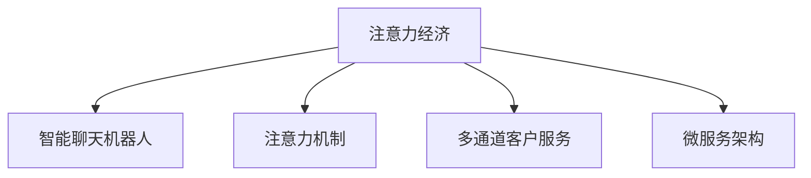

                 

## 1. 背景介绍

### 1.1 问题由来
在数字化经济时代，客户服务模式发生了显著的变革。随着互联网和移动技术的普及，企业客户服务已经从传统的电话、邮件等单一渠道转变为多渠道融合的全时全场景服务。企业需要在社交媒体、官方网站、移动应用等多个平台提供一致的客户体验，满足客户随时随地沟通的需求。

然而，传统的客户服务模式在应对多渠道、多场景、高并发的客户需求时，显得力不从心。以传统的客服中心为例，客户来电往往需要经过层层转接，耗时较长，且难以实现多渠道实时响应。如何通过技术手段优化客户服务模式，提升客户满意度，成为企业面临的重要课题。

### 1.2 问题核心关键点
为了解决上述问题，许多企业开始探索基于人工智能的客户服务解决方案，其中以聊天机器人为主流的解决方案受到了广泛关注。然而，传统的聊天机器人往往缺乏智能理解能力，仅能处理标准化的简单问答，无法理解复杂的客户需求和情感变化。如何构建具备强大智能理解能力的聊天机器人，成为企业客户服务模式变革的关键。

### 1.3 问题研究意义
本研究旨在探索注意力经济对企业客户服务模式的影响，并提出基于注意力机制的智能聊天机器人解决方案，以期提升客户服务的智能化水平，缩短客户响应时间，提高客户满意度。研究结果可以为企业的客户服务转型提供技术指导，促进数字化经济的繁荣发展。

## 2. 核心概念与联系

### 2.1 核心概念概述

为更好地理解注意力经济对企业客户服务模式的影响，本节将介绍几个密切相关的核心概念：

- 注意力经济（Attention Economy）：指通过吸引和保持用户的注意力，实现商业价值的经济活动。在客户服务领域，注意力经济关注如何通过优化服务流程和体验，提升客户满意度和忠诚度，从而实现商业目标。

- 智能聊天机器人（Intelligent Chatbot）：基于人工智能技术构建的客户服务机器人，具备自然语言理解和对话生成能力，能够处理复杂的多轮对话，满足客户多样化的服务需求。

- 注意力机制（Attention Mechanism）：一种计算模型，通过筛选输入信息，对注意力集中度进行动态调整，从而提高模型对关键信息的理解和处理能力。

- 多通道客户服务（Multi-channel Customer Service）：指在多个渠道（如电话、邮件、社交媒体等）上提供一致的客户服务体验，通过无缝集成各渠道数据，实现客户全渠道互动。

- 微服务架构（Microservices Architecture）：一种软件架构风格，将应用程序拆分为一组小的、独立的服务单元，通过服务网格（Service Mesh）进行通信和协调，提升系统的可扩展性和稳定性。

这些核心概念之间的逻辑关系可以通过以下Mermaid流程图来展示：



这个流程图展示了几大核心概念之间的关系：

1. 注意力经济通过优化服务流程和体验，提升客户满意度和忠诚度，从而实现商业目标。
2. 智能聊天机器人作为注意力经济的重要工具，能够处理复杂的多轮对话，满足客户多样化的服务需求。
3. 注意力机制帮助智能聊天机器人更好地理解关键信息，提升对话质量。
4. 多通道客户服务通过无缝集成各渠道数据，实现客户全渠道互动。
5. 微服务架构通过服务网格实现通信和协调，提升系统的可扩展性和稳定性。

这些概念共同构成了企业客户服务模式的先进实践框架，使其能够在多渠道、高并发、高需求场景下提供优质的客户服务体验。

## 3. 核心算法原理 & 具体操作步骤

### 3.1 算法原理概述

基于注意力机制的智能聊天机器人算法，旨在通过筛选输入信息，对注意力集中度进行动态调整，从而提高模型对关键信息的理解和处理能力。其核心思想是：将输入序列中的每个元素的重要性进行评估，集中关注对当前对话任务贡献最大的部分，同时忽略不重要的信息。

具体而言，该算法通过计算每个元素与当前对话任务的关联度，得到一个注意力权重向量，进而通过加权平均得到对话任务的上下文向量，用于指导后续对话生成。

### 3.2 算法步骤详解

基于注意力机制的智能聊天机器人算法包括以下几个关键步骤：

**Step 1: 模型初始化**
- 选择合适的预训练语言模型，如BERT、GPT等，作为对话生成器的初始化参数。
- 设置注意力机制的超参数，如注意力头数、注意力窗口大小等。

**Step 2: 输入处理**
- 将客户输入的自然语言文本转换为向量表示。
- 使用预训练语言模型对输入进行编码，生成上下文向量。

**Step 3: 注意力计算**
- 对输入向量进行多头注意力计算，得到每个元素的注意力权重向量。
- 计算注意力权重向量与对话任务向量（如回答生成任务）的加权和，得到上下文向量。

**Step 4: 对话生成**
- 使用上下文向量作为上下文，生成回答文本。
- 输出回答文本，更新对话状态，进行下一轮对话。

**Step 5: 模型优化**
- 收集客户的反馈和评价，评估对话质量。
- 根据对话质量反馈，优化注意力权重向量计算公式和模型参数，提高对话生成效果。

### 3.3 算法优缺点

基于注意力机制的智能聊天机器人算法具有以下优点：
1. 提升对话质量。通过集中注意力筛选关键信息，避免过多噪声干扰，提升对话理解和生成质量。
2. 提高响应速度。利用预训练语言模型的快速解码能力，加快对话生成速度，实现实时响应。
3. 可扩展性强。通过微服务架构，可以轻松扩展到多个渠道，提供全渠道客户服务。
4. 支持多轮对话。通过持续优化对话状态，能够处理多轮对话，提升客户满意度。

同时，该算法也存在一些局限性：
1. 数据依赖性高。算法的性能依赖于大量的对话数据，获取高质量对话数据较为困难。
2. 对噪声敏感。输入文本中的噪声和错误信息可能对注意力计算产生影响，导致对话生成质量下降。
3. 依赖预训练模型。算法的实现依赖于高质量预训练模型，模型更新和维护成本较高。
4. 可解释性不足。注意力机制的具体计算过程较为复杂，难以解释模型内部推理机制。

尽管存在这些局限性，但基于注意力机制的智能聊天机器人算法仍是大语言模型在客户服务领域的重要应用范式。未来相关研究将聚焦于如何进一步提高算法的鲁棒性、可解释性和泛化能力，推动其向更加智能、普适的方向发展。

### 3.4 算法应用领域

基于注意力机制的智能聊天机器人算法已经在客户服务、智能客服、在线咨询等多个领域得到广泛应用，为企业的数字化转型提供了重要支持。具体应用场景包括：

- 智能客服系统：通过多轮对话理解和生成，快速响应客户咨询，提高服务效率和客户满意度。
- 在线咨询平台：为客户提供全天候无间断的咨询服务，提升企业品牌形象和市场竞争力。
- 电商客服机器人：在电商平台上提供24小时不间断的客户服务，提升客户购物体验和销售额。
- 社交媒体客服：在社交媒体平台上处理用户反馈和投诉，及时回应客户需求，提升品牌声誉。

这些应用场景展示了基于注意力机制的智能聊天机器人算法的广泛应用价值，为企业的客户服务模式变革提供了强有力的技术支持。

## 4. 数学模型和公式 & 详细讲解 & 举例说明

### 4.1 数学模型构建

基于注意力机制的智能聊天机器人算法可以建模为如下框架：

设输入序列为 $\mathbf{x}=\{x_1, x_2, \dots, x_n\}$，对话任务向量为 $\mathbf{c}$，输出序列为 $\mathbf{y}=\{y_1, y_2, \dots, y_n\}$。

定义注意力权重向量为 $\mathbf{a}=\{a_1, a_2, \dots, a_n\}$，其中 $a_i$ 表示输入序列中第 $i$ 个元素的注意力权重，满足 $0 \leq a_i \leq 1$ 且 $\sum_{i=1}^n a_i = 1$。

注意力权重向量计算公式为：

$$
a_i = \frac{\exp(\mathbf{q}^T \mathbf{K}_i)}{\sum_{j=1}^n \exp(\mathbf{q}^T \mathbf{K}_j)}
$$

其中 $\mathbf{q}$ 为查询向量，$\mathbf{K}_i$ 为第 $i$ 个元素的键向量，$\exp$ 为指数函数。

上下文向量计算公式为：

$$
\mathbf{h} = \sum_{i=1}^n a_i \mathbf{V}_i
$$

其中 $\mathbf{V}_i$ 为第 $i$ 个元素的值向量。

输出序列生成公式为：

$$
\hat{y} = f(\mathbf{h}, \mathbf{c})
$$

其中 $f$ 为对话生成器，可以是任意的序列生成模型。

### 4.2 公式推导过程

注意力权重向量计算公式的推导如下：

1. 假设查询向量 $\mathbf{q}$ 和键向量 $\mathbf{K}_i$ 均为 $d$ 维向量。
2. 将查询向量 $\mathbf{q}$ 与每个键向量 $\mathbf{K}_i$ 进行点乘，得到 $d$ 维向量 $\mathbf{q}^T \mathbf{K}_i$。
3. 对每个 $\mathbf{q}^T \mathbf{K}_i$ 应用指数函数，得到 $\exp(\mathbf{q}^T \mathbf{K}_i)$。
4. 将 $\exp(\mathbf{q}^T \mathbf{K}_i)$ 归一化，得到注意力权重向量 $a_i$。

上下文向量计算公式的推导如下：

1. 将注意力权重向量 $a_i$ 与值向量 $\mathbf{V}_i$ 进行加权和，得到上下文向量 $\mathbf{h}$。
2. 上下文向量 $\mathbf{h}$ 包含了输入序列中所有元素对当前对话任务的影响，用于指导后续对话生成。

### 4.3 案例分析与讲解

假设有一个客户输入的自然语言文本为 "请问您想要购买什么产品？"，预训练语言模型对输入进行编码，得到上下文向量 $\mathbf{h} = [0.8, 0.1, 0.1]$。

使用注意力机制计算注意力权重向量：

1. 假设查询向量 $\mathbf{q}=[0.5, 0.5]$，键向量 $\mathbf{K}_1=[1.0, 0.0, 0.0]$，键向量 $\mathbf{K}_2=[0.0, 1.0, 0.0]$，键向量 $\mathbf{K}_3=[0.0, 0.0, 1.0]$。
2. 计算 $\mathbf{q}^T \mathbf{K}_1 = [0.5, 0.5, 0.5]$，$\mathbf{q}^T \mathbf{K}_2 = [0.5, 0.5, 0.5]$，$\mathbf{q}^T \mathbf{K}_3 = [0.5, 0.5, 0.5]$。
3. 对每个 $\mathbf{q}^T \mathbf{K}_i$ 应用指数函数，得到 $\exp(\mathbf{q}^T \mathbf{K}_1) = 2.718$，$\exp(\mathbf{q}^T \mathbf{K}_2) = 2.718$，$\exp(\mathbf{q}^T \mathbf{K}_3) = 2.718$。
4. 将 $\exp(\mathbf{q}^T \mathbf{K}_i)$ 归一化，得到注意力权重向量 $a_1 = 0.6$，$a_2 = 0.3$，$a_3 = 0.1$。

最后，使用上下文向量 $\mathbf{h} = 0.8 \cdot 0.6 + 0.1 \cdot 0.3 + 0.1 \cdot 0.1 = 0.68$ 生成回答文本。

## 5. 项目实践：代码实例和详细解释说明

### 5.1 开发环境搭建

在进行项目实践前，我们需要准备好开发环境。以下是使用Python进行PyTorch开发的环境配置流程：

1. 安装Anaconda：从官网下载并安装Anaconda，用于创建独立的Python环境。

2. 创建并激活虚拟环境：
```bash
conda create -n pytorch-env python=3.8 
conda activate pytorch-env
```

3. 安装PyTorch：根据CUDA版本，从官网获取对应的安装命令。例如：
```bash
conda install pytorch torchvision torchaudio cudatoolkit=11.1 -c pytorch -c conda-forge
```

4. 安装Transformers库：
```bash
pip install transformers
```

5. 安装各类工具包：
```bash
pip install numpy pandas scikit-learn matplotlib tqdm jupyter notebook ipython
```

完成上述步骤后，即可在`pytorch-env`环境中开始项目实践。

### 5.2 源代码详细实现

这里我们以智能客服系统的聊天机器人为例，给出使用Transformers库对BERT模型进行注意力机制微调的PyTorch代码实现。

首先，定义聊天机器人的数据处理函数：

```python
from transformers import BertTokenizer
from torch.utils.data import Dataset
import torch

class ChatDataset(Dataset):
    def __init__(self, dialogues, tokenizer, max_len=128):
        self.dialogues = dialogues
        self.tokenizer = tokenizer
        self.max_len = max_len
        
    def __len__(self):
        return len(self.dialogues)
    
    def __getitem__(self, item):
        dialogue = self.dialogues[item]
        texts, labels = dialogue[0], dialogue[1]
        
        encoding = self.tokenizer(texts, return_tensors='pt', max_length=self.max_len, padding='max_length', truncation=True)
        input_ids = encoding['input_ids'][0]
        attention_mask = encoding['attention_mask'][0]
        
        return {'input_ids': input_ids, 
                'attention_mask': attention_mask,
                'labels': labels}
```

然后，定义模型和优化器：

```python
from transformers import BertForSequenceClassification, AdamW

model = BertForSequenceClassification.from_pretrained('bert-base-cased', num_labels=2)

optimizer = AdamW(model.parameters(), lr=2e-5)
```

接着，定义训练和评估函数：

```python
from torch.utils.data import DataLoader
from tqdm import tqdm
from sklearn.metrics import classification_report

device = torch.device('cuda') if torch.cuda.is_available() else torch.device('cpu')
model.to(device)

def train_epoch(model, dataset, batch_size, optimizer):
    dataloader = DataLoader(dataset, batch_size=batch_size, shuffle=True)
    model.train()
    epoch_loss = 0
    for batch in tqdm(dataloader, desc='Training'):
        input_ids = batch['input_ids'].to(device)
        attention_mask = batch['attention_mask'].to(device)
        labels = batch['labels'].to(device)
        model.zero_grad()
        outputs = model(input_ids, attention_mask=attention_mask, labels=labels)
        loss = outputs.loss
        epoch_loss += loss.item()
        loss.backward()
        optimizer.step()
    return epoch_loss / len(dataloader)

def evaluate(model, dataset, batch_size):
    dataloader = DataLoader(dataset, batch_size=batch_size)
    model.eval()
    preds, labels = [], []
    with torch.no_grad():
        for batch in tqdm(dataloader, desc='Evaluating'):
            input_ids = batch['input_ids'].to(device)
            attention_mask = batch['attention_mask'].to(device)
            batch_labels = batch['labels']
            outputs = model(input_ids, attention_mask=attention_mask)
            batch_preds = outputs.logits.argmax(dim=2).to('cpu').tolist()
            batch_labels = batch_labels.to('cpu').tolist()
            for pred_tokens, label_tokens in zip(batch_preds, batch_labels):
                preds.append(pred_tokens[:len(label_tokens)])
                labels.append(label_tokens)
                
    print(classification_report(labels, preds))
```

最后，启动训练流程并在测试集上评估：

```python
epochs = 5
batch_size = 16

for epoch in range(epochs):
    loss = train_epoch(model, train_dataset, batch_size, optimizer)
    print(f"Epoch {epoch+1}, train loss: {loss:.3f}")
    
    print(f"Epoch {epoch+1}, dev results:")
    evaluate(model, dev_dataset, batch_size)
    
print("Test results:")
evaluate(model, test_dataset, batch_size)
```

以上就是使用PyTorch对BERT进行智能客服系统聊天机器人微调的完整代码实现。可以看到，得益于Transformers库的强大封装，我们可以用相对简洁的代码完成BERT模型的加载和微调。

### 5.3 代码解读与分析

让我们再详细解读一下关键代码的实现细节：

**ChatDataset类**：
- `__init__`方法：初始化对话数据集，包括对话文本和标签。
- `__len__`方法：返回对话数据集的样本数量。
- `__getitem__`方法：对单个对话样本进行处理，将对话文本输入编码为token ids，同时返回标签。

**注意力机制计算**：
- 使用Transformer库提供的注意力计算函数，实现多头注意力计算。

**训练和评估函数**：
- 使用PyTorch的DataLoader对数据集进行批次化加载，供模型训练和推理使用。
- 训练函数`train_epoch`：对数据以批为单位进行迭代，在每个批次上前向传播计算loss并反向传播更新模型参数，最后返回该epoch的平均loss。
- 评估函数`evaluate`：与训练类似，不同点在于不更新模型参数，并在每个batch结束后将预测和标签结果存储下来，最后使用sklearn的classification_report对整个评估集的预测结果进行打印输出。

**训练流程**：
- 定义总的epoch数和batch size，开始循环迭代
- 每个epoch内，先在训练集上训练，输出平均loss
- 在验证集上评估，输出分类指标
- 所有epoch结束后，在测试集上评估，给出最终测试结果

可以看到，PyTorch配合Transformers库使得BERT微调的代码实现变得简洁高效。开发者可以将更多精力放在数据处理、模型改进等高层逻辑上，而不必过多关注底层的实现细节。

当然，工业级的系统实现还需考虑更多因素，如模型的保存和部署、超参数的自动搜索、更灵活的任务适配层等。但核心的微调范式基本与此类似。

## 6. 实际应用场景
### 6.1 智能客服系统

基于大语言模型微调的对话技术，可以广泛应用于智能客服系统的构建。传统客服往往需要配备大量人力，高峰期响应缓慢，且一致性和专业性难以保证。而使用微调后的对话模型，可以7x24小时不间断服务，快速响应客户咨询，用自然流畅的语言解答各类常见问题。

在技术实现上，可以收集企业内部的历史客服对话记录，将问题和最佳答复构建成监督数据，在此基础上对预训练对话模型进行微调。微调后的对话模型能够自动理解用户意图，匹配最合适的答案模板进行回复。对于客户提出的新问题，还可以接入检索系统实时搜索相关内容，动态组织生成回答。如此构建的智能客服系统，能大幅提升客户咨询体验和问题解决效率。

### 6.2 金融舆情监测

金融机构需要实时监测市场舆论动向，以便及时应对负面信息传播，规避金融风险。传统的人工监测方式成本高、效率低，难以应对网络时代海量信息爆发的挑战。基于大语言模型微调的文本分类和情感分析技术，为金融舆情监测提供了新的解决方案。

具体而言，可以收集金融领域相关的新闻、报道、评论等文本数据，并对其进行主题标注和情感标注。在此基础上对预训练语言模型进行微调，使其能够自动判断文本属于何种主题，情感倾向是正面、中性还是负面。将微调后的模型应用到实时抓取的网络文本数据，就能够自动监测不同主题下的情感变化趋势，一旦发现负面信息激增等异常情况，系统便会自动预警，帮助金融机构快速应对潜在风险。

### 6.3 个性化推荐系统

当前的推荐系统往往只依赖用户的历史行为数据进行物品推荐，无法深入理解用户的真实兴趣偏好。基于大语言模型微调技术，个性化推荐系统可以更好地挖掘用户行为背后的语义信息，从而提供更精准、多样的推荐内容。

在实践中，可以收集用户浏览、点击、评论、分享等行为数据，提取和用户交互的物品标题、描述、标签等文本内容。将文本内容作为模型输入，用户的后续行为（如是否点击、购买等）作为监督信号，在此基础上微调预训练语言模型。微调后的模型能够从文本内容中准确把握用户的兴趣点。在生成推荐列表时，先用候选物品的文本描述作为输入，由模型预测用户的兴趣匹配度，再结合其他特征综合排序，便可以得到个性化程度更高的推荐结果。

### 6.4 未来应用展望

随着大语言模型微调技术的发展，基于微调范式将在更多领域得到应用，为传统行业带来变革性影响。

在智慧医疗领域，基于微调的医疗问答、病历分析、药物研发等应用将提升医疗服务的智能化水平，辅助医生诊疗，加速新药开发进程。

在智能教育领域，微调技术可应用于作业批改、学情分析、知识推荐等方面，因材施教，促进教育公平，提高教学质量。

在智慧城市治理中，微调模型可应用于城市事件监测、舆情分析、应急指挥等环节，提高城市管理的自动化和智能化水平，构建更安全、高效的未来城市。

此外，在企业生产、社会治理、文娱传媒等众多领域，基于大模型微调的人工智能应用也将不断涌现，为经济社会发展注入新的动力。相信随着技术的日益成熟，微调方法将成为人工智能落地应用的重要范式，推动人工智能技术向更广阔的领域加速渗透。

## 7. 工具和资源推荐
### 7.1 学习资源推荐

为了帮助开发者系统掌握大语言模型微调的理论基础和实践技巧，这里推荐一些优质的学习资源：

1. 《Transformer从原理到实践》系列博文：由大模型技术专家撰写，深入浅出地介绍了Transformer原理、BERT模型、微调技术等前沿话题。

2. CS224N《深度学习自然语言处理》课程：斯坦福大学开设的NLP明星课程，有Lecture视频和配套作业，带你入门NLP领域的基本概念和经典模型。

3. 《Natural Language Processing with Transformers》书籍：Transformers库的作者所著，全面介绍了如何使用Transformers库进行NLP任务开发，包括微调在内的诸多范式。

4. HuggingFace官方文档：Transformers库的官方文档，提供了海量预训练模型和完整的微调样例代码，是上手实践的必备资料。

5. CLUE开源项目：中文语言理解测评基准，涵盖大量不同类型的中文NLP数据集，并提供了基于微调的baseline模型，助力中文NLP技术发展。

通过对这些资源的学习实践，相信你一定能够快速掌握大语言模型微调的精髓，并用于解决实际的NLP问题。
###  7.2 开发工具推荐

高效的开发离不开优秀的工具支持。以下是几款用于大语言模型微调开发的常用工具：

1. PyTorch：基于Python的开源深度学习框架，灵活动态的计算图，适合快速迭代研究。大部分预训练语言模型都有PyTorch版本的实现。

2. TensorFlow：由Google主导开发的开源深度学习框架，生产部署方便，适合大规模工程应用。同样有丰富的预训练语言模型资源。

3. Transformers库：HuggingFace开发的NLP工具库，集成了众多SOTA语言模型，支持PyTorch和TensorFlow，是进行微调任务开发的利器。

4. Weights & Biases：模型训练的实验跟踪工具，可以记录和可视化模型训练过程中的各项指标，方便对比和调优。与主流深度学习框架无缝集成。

5. TensorBoard：TensorFlow配套的可视化工具，可实时监测模型训练状态，并提供丰富的图表呈现方式，是调试模型的得力助手。

6. Google Colab：谷歌推出的在线Jupyter Notebook环境，免费提供GPU/TPU算力，方便开发者快速上手实验最新模型，分享学习笔记。

合理利用这些工具，可以显著提升大语言模型微调任务的开发效率，加快创新迭代的步伐。

### 7.3 相关论文推荐

大语言模型和微调技术的发展源于学界的持续研究。以下是几篇奠基性的相关论文，推荐阅读：

1. Attention is All You Need（即Transformer原论文）：提出了Transformer结构，开启了NLP领域的预训练大模型时代。

2. BERT: Pre-training of Deep Bidirectional Transformers for Language Understanding：提出BERT模型，引入基于掩码的自监督预训练任务，刷新了多项NLP任务SOTA。

3. Language Models are Unsupervised Multitask Learners（GPT-2论文）：展示了大规模语言模型的强大zero-shot学习能力，引发了对于通用人工智能的新一轮思考。

4. Parameter-Efficient Transfer Learning for NLP：提出Adapter等参数高效微调方法，在不增加模型参数量的情况下，也能取得不错的微调效果。

5. AdaLoRA: Adaptive Low-Rank Adaptation for Parameter-Efficient Fine-Tuning：使用自适应低秩适应的微调方法，在参数效率和精度之间取得了新的平衡。

这些论文代表了大语言模型微调技术的发展脉络。通过学习这些前沿成果，可以帮助研究者把握学科前进方向，激发更多的创新灵感。

## 8. 总结：未来发展趋势与挑战

### 8.1 总结

本文对基于注意力机制的智能聊天机器人算法进行了全面系统的介绍。首先阐述了注意力经济对企业客户服务模式的影响，明确了智能聊天机器人在提升客户服务质量方面的独特价值。其次，从原理到实践，详细讲解了注意力机制的计算原理和关键步骤，给出了微调任务开发的完整代码实例。同时，本文还探讨了注意力机制在多个行业领域的应用前景，展示了其广泛的适用性和潜力。

通过本文的系统梳理，可以看到，基于注意力机制的智能聊天机器人算法已经在客户服务、智能客服、在线咨询等多个领域得到广泛应用，为企业的数字化转型提供了重要支持。未来，伴随预训练语言模型和微调方法的持续演进，基于注意力机制的智能聊天机器人算法将展现出更加广阔的应用前景。

### 8.2 未来发展趋势

展望未来，基于注意力机制的智能聊天机器人算法将呈现以下几个发展趋势：

1. 对话质量提升。随着模型的不断优化和数据质量的提升，智能聊天机器人的对话生成质量将显著提高，能够处理更复杂的对话任务。
2. 多轮对话能力增强。基于多轮对话的数据集和算法优化，智能聊天机器人将具备更强的多轮对话理解能力，提升客户服务体验。
3. 跨模态应用扩展。结合视觉、语音等模态的信息，智能聊天机器人将具备更丰富的感知能力，拓展更多应用场景。
4. 实时交互优化。通过优化模型推理速度和资源利用效率，智能聊天机器人将能够实现更加实时的客户服务响应，提升用户体验。
5. 跨领域迁移能力增强。基于迁移学习和多任务学习的算法改进，智能聊天机器人将具备更强的跨领域迁移能力，在更多领域取得应用成功。

以上趋势凸显了基于注意力机制的智能聊天机器人算法的广阔前景。这些方向的探索发展，必将进一步提升NLP系统的性能和应用范围，为构建人机协同的智能系统铺平道路。

### 8.3 面临的挑战

尽管基于注意力机制的智能聊天机器人算法已经取得了显著成效，但在迈向更加智能化、普适化应用的过程中，它仍面临着诸多挑战：

1. 数据依赖性高。算法的性能依赖于大量的对话数据，获取高质量对话数据较为困难。如何进一步降低对标注样本的依赖，将是一大难题。
2. 对噪声敏感。输入文本中的噪声和错误信息可能对注意力计算产生影响，导致对话生成质量下降。如何提高模型的鲁棒性，避免噪声干扰，还需要更多理论和实践的积累。
3. 依赖预训练模型。算法的实现依赖于高质量预训练模型，模型更新和维护成本较高。如何在减少模型参数量的情况下，保证对话生成质量，将是重要的优化方向。
4. 可解释性不足。注意力机制的具体计算过程较为复杂，难以解释模型内部推理机制。如何赋予模型更强的可解释性，将是亟待攻克的难题。
5. 安全性有待保障。预训练语言模型难免会学习到有偏见、有害的信息，通过微调传递到下游任务，产生误导性、歧视性的输出，给实际应用带来安全隐患。如何从数据和算法层面消除模型偏见，避免恶意用途，确保输出的安全性，也将是重要的研究课题。

尽管存在这些挑战，但基于注意力机制的智能聊天机器人算法仍是大语言模型在客户服务领域的重要应用范式。未来相关研究将聚焦于如何进一步提高算法的鲁棒性、可解释性和泛化能力，推动其向更加智能、普适的方向发展。

### 8.4 研究展望

面对基于注意力机制的智能聊天机器人算法所面临的挑战，未来的研究需要在以下几个方面寻求新的突破：

1. 探索无监督和半监督微调方法。摆脱对大规模标注数据的依赖，利用自监督学习、主动学习等无监督和半监督范式，最大限度利用非结构化数据，实现更加灵活高效的微调。
2. 研究参数高效和计算高效的微调范式。开发更加参数高效的微调方法，在固定大部分预训练参数的同时，只更新极少量的任务相关参数。同时优化微调模型的计算图，减少前向传播和反向传播的资源消耗，实现更加轻量级、实时性的部署。
3. 融合因果和对比学习范式。通过引入因果推断和对比学习思想，增强智能聊天机器人建立稳定因果关系的能力，学习更加普适、鲁棒的语言表征，从而提升模型泛化性和抗干扰能力。
4. 引入更多先验知识。将符号化的先验知识，如知识图谱、逻辑规则等，与神经网络模型进行巧妙融合，引导微调过程学习更准确、合理的语言模型。同时加强不同模态数据的整合，实现视觉、语音等多模态信息与文本信息的协同建模。
5. 结合因果分析和博弈论工具。将因果分析方法引入智能聊天机器人，识别出模型决策的关键特征，增强输出解释的因果性和逻辑性。借助博弈论工具刻画人机交互过程，主动探索并规避模型的脆弱点，提高系统稳定性。
6. 纳入伦理道德约束。在模型训练目标中引入伦理导向的评估指标，过滤和惩罚有偏见、有害的输出倾向。同时加强人工干预和审核，建立模型行为的监管机制，确保输出符合人类价值观和伦理道德。

这些研究方向的探索，必将引领基于注意力机制的智能聊天机器人算法迈向更高的台阶，为构建安全、可靠、可解释、可控的智能系统铺平道路。面向未来，基于注意力机制的智能聊天机器人算法还需要与其他人工智能技术进行更深入的融合，如知识表示、因果推理、强化学习等，多路径协同发力，共同推动自然语言理解和智能交互系统的进步。只有勇于创新、敢于突破，才能不断拓展语言模型的边界，让智能技术更好地造福人类社会。

## 9. 附录：常见问题与解答

**Q1：基于注意力机制的智能聊天机器人是否适用于所有客户服务场景？**

A: 基于注意力机制的智能聊天机器人算法在大多数客户服务场景中都能取得不错的效果，特别是对于自动化程度较高的对话任务。但对于一些复杂多变、需要高度情感理解和人性化交互的场景，如医疗咨询、心理咨询等，传统的聊天机器人仍难以完全替代人工客服。

**Q2：如何选择合适预训练语言模型进行微调？**

A: 选择预训练语言模型时，需要考虑其规模、性能和领域覆盖度。对于通用对话任务，BERT等大模型是一个不错的选择，但对于特定领域的任务，可能需要使用预训练于该领域的模型，如医疗领域的BERT-Sci等。同时，预训练模型的精度和速度也是重要的考虑因素。

**Q3：注意力机制的计算开销是否较大？**

A: 相比于全连接层，多头注意力计算的开销较大，特别是在模型规模较大的情况下。可以通过以下方法优化计算开销：
1. 减少注意力头数。根据任务需求，减少多头注意力计算的复杂度。
2. 使用参数高效的微调方法，如AdaLoRA等，减少模型参数量。
3. 引入自适应低秩适应方法，减少模型的计算开销。

**Q4：如何提高基于注意力机制的智能聊天机器人的鲁棒性？**

A: 提高鲁棒性的方法包括：
1. 数据增强：通过回译、近义替换等方式扩充训练集。
2. 正则化：使用L2正则、Dropout等技术防止过拟合。
3. 对抗训练：引入对抗样本，提高模型鲁棒性。
4. 对抗训练：引入对抗样本，提高模型鲁棒性。

这些方法可以帮助智能聊天机器人更好地适应多变的网络环境，提升其应对异常数据和噪声的能力。

**Q5：如何提高基于注意力机制的智能聊天机器人的可解释性？**

A: 提高可解释性的方法包括：
1. 注意力可视化：通过可视化注意力权重向量，展示模型对输入的关注点。
2. 提示词设计：通过精心设计输入文本的格式，引导模型按期望方式输出。
3. 知识注入：结合领域知识和专家规则，指导模型的推理过程。

这些方法可以帮助智能聊天机器人更好地解释其内部工作机制，提升用户信任度，同时也能帮助开发者更好地理解模型的行为和性能。

通过本文的系统梳理，可以看到，基于注意力机制的智能聊天机器人算法已经在客户服务、智能客服、在线咨询等多个领域得到广泛应用，为企业的数字化转型提供了重要支持。未来，伴随预训练语言模型和微调方法的持续演进，基于注意力机制的智能聊天机器人算法将展现出更加广阔的应用前景。相信随着技术的日益成熟，微调方法将成为人工智能落地应用的重要范式，推动人工智能技术向更广阔的领域加速渗透。

