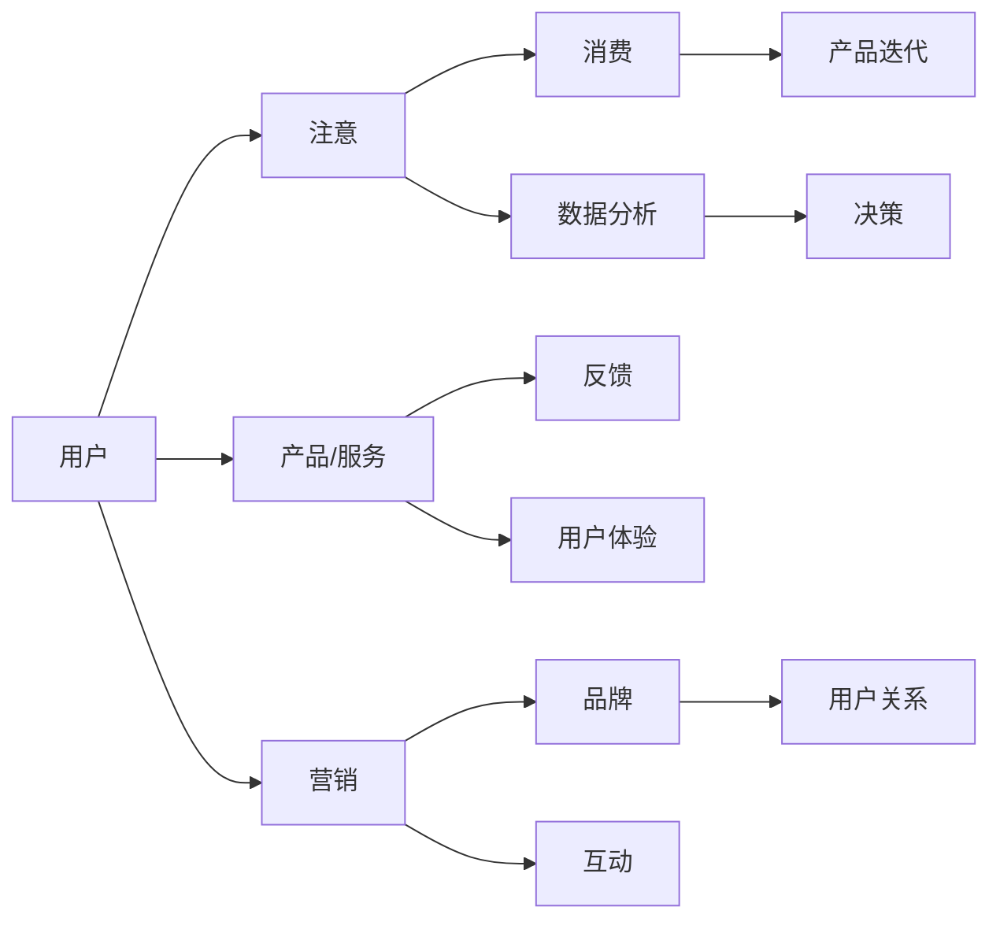

                 

# 注意力经济对企业组织结构的影响

## 1. 背景介绍

在数字化转型的浪潮下，企业组织结构正在经历深刻的变革。从传统层级分明、职能分割的垂直管理，到跨部门协作、扁平化运营的敏捷管理，现代企业正在探索适应新经济形态的组织形态。而注意力经济，作为数字化时代的新趋势，正在影响和重塑企业的组织结构。

注意力经济，指的是在信息爆炸的互联网时代，通过争夺用户的注意力来获取经济利益的一种经济形态。它的出现，不仅改变了消费者的行为模式，也深刻影响了企业的经营策略和组织结构。本章节将从注意力经济的基本概念入手，探讨其对企业组织结构的影响。

## 2. 核心概念与联系

### 2.1 核心概念概述

注意力经济的核心在于争夺用户的时间和注意力。用户的时间和注意力是有限的，企业需要有效利用这些资源，以吸引和维持用户的注意力，进而实现销售和品牌价值的提升。因此，注意力经济对企业组织结构的影响主要体现在以下几个方面：

- **用户参与度提升**：在注意力经济模式下，企业需要更加重视用户体验和参与度，优化产品和服务的互动设计，吸引用户持续关注和参与。
- **跨部门协作加强**：为满足用户的多样化需求，企业需要打破部门壁垒，促进跨部门协作，实现端到端的服务流程。
- **数据驱动决策**：注意力经济高度依赖数据，企业需要构建数据驱动的决策机制，精确把握用户行为和市场趋势。
- **敏捷化管理**：在快速变化的市场环境中，企业需要实现快速响应和迭代，敏捷化管理成为必然选择。
- **个性化定制**：根据用户个性化需求，企业需要提供定制化的服务和产品，增强用户粘性。

### 2.2 核心概念原理和架构的 Mermaid 流程图



以上Mermaid流程图简要展示了注意力经济下用户、产品/服务、营销、品牌、数据分析、决策、产品迭代、用户体验、互动和用户关系之间的联系。

## 3. 核心算法原理 & 具体操作步骤

### 3.1 算法原理概述

注意力经济对企业组织结构的影响，主要体现在以下几个方面：

- **用户参与度提升**：企业需要通过优化产品和服务，提高用户的参与度和粘性。这要求组织结构中增加用户研究、产品设计、用户体验等角色，形成以用户为中心的设计团队。
- **跨部门协作加强**：用户需求的多样性和复杂性，需要跨部门协作。组织结构中需要加强横向连接，形成矩阵式或网络式组织，促进知识共享和协同创新。
- **数据驱动决策**：注意力经济高度依赖数据，企业需要构建数据驱动的决策机制。组织结构中需要设立数据科学、商业智能等岗位，提升数据的洞察力和应用能力。
- **敏捷化管理**：快速变化的市场环境，要求企业实现快速响应和迭代。组织结构中需要建立敏捷开发、敏捷运营等机制，形成快速迭代的闭环。
- **个性化定制**：用户个性化需求，要求企业提供定制化的服务和产品。组织结构中需要增加个性化设计、定制化生产等角色，提升市场适应能力。

### 3.2 算法步骤详解

以下是注意力经济对企业组织结构影响的详细操作步骤：

1. **用户需求分析**：收集用户反馈和行为数据，分析用户需求和痛点，形成用户画像和需求文档。

2. **产品和服务设计**：基于用户需求和市场趋势，设计符合用户期望的产品和服务，注重用户体验和互动设计。

3. **跨部门协作**：建立跨部门协作机制，如产品开发团队、用户体验团队等，促进各部门间的沟通和合作。

4. **数据驱动决策**：构建数据平台，采集和分析用户数据，形成数据驱动的决策机制，支持企业决策。

5. **敏捷化管理**：建立敏捷开发和运营机制，如Scrum、DevOps等，实现快速响应和迭代。

6. **个性化定制**：根据用户需求和市场反馈，进行产品和服务定制，提升用户满意度和粘性。

7. **持续优化**：通过用户反馈和数据分析，持续优化产品和服务，提升市场竞争力。

### 3.3 算法优缺点

#### 优点

1. **提高用户参与度和粘性**：通过优化产品和服务，增强用户体验，提高用户参与度和粘性，增加用户生命周期价值。
2. **提升市场适应能力**：通过数据驱动和个性化定制，快速响应市场变化，提升市场适应能力。
3. **促进跨部门协作**：通过跨部门协作机制，提升团队协作效率，促进知识共享和创新。

#### 缺点

1. **成本投入较大**：优化产品和服务、建立跨部门协作机制和数据驱动决策等，需要较大的资源和成本投入。
2. **技术复杂度较高**：数据驱动和个性化定制需要复杂的技术支持，如数据平台、个性化推荐系统等。
3. **组织变革难度大**：改变传统的层级分明和职能分割的组织结构，需要较大的管理变革和团队调整难度。

### 3.4 算法应用领域

注意力经济对企业组织结构的影响，适用于各种数字化转型中的企业。特别是在零售、媒体、互联网、金融等高度依赖用户注意力和互动的行业，其效果尤为显著。

## 4. 数学模型和公式 & 详细讲解 & 举例说明

### 4.1 数学模型构建

注意力经济对企业组织结构的影响，主要体现在以下几个方面：

- **用户参与度提升**：通过优化产品和服务，提高用户的参与度和粘性。
- **跨部门协作加强**：建立跨部门协作机制，促进各部门间的沟通和合作。
- **数据驱动决策**：构建数据平台，采集和分析用户数据，形成数据驱动的决策机制。
- **敏捷化管理**：建立敏捷开发和运营机制，实现快速响应和迭代。
- **个性化定制**：根据用户需求和市场反馈，进行产品和服务定制。

### 4.2 公式推导过程

注意力经济对企业组织结构的影响，可以通过以下公式进行推导：

$$
\text{用户参与度提升} = \text{产品/服务质量} \times \text{用户体验}
$$

$$
\text{跨部门协作} = \text{跨部门沟通} \times \text{协作效率}
$$

$$
\text{数据驱动决策} = \text{数据质量} \times \text{数据分析能力}
$$

$$
\text{敏捷化管理} = \text{敏捷团队} \times \text{快速迭代}
$$

$$
\text{个性化定制} = \text{用户需求} \times \text{定制化生产}
$$

### 4.3 案例分析与讲解

#### 案例一：零售行业的用户参与度提升

某大型零售企业在数字化转型中，通过用户数据分析，发现用户对个性化推荐和即时反馈的需求较高。为此，企业成立了用户体验团队，专注于产品和服务设计，引入个性化推荐系统，优化用户界面，增强互动体验。结果，用户参与度和粘性显著提升，销售增长20%。

#### 案例二：互联网企业的跨部门协作

某互联网公司，原有组织结构为传统的职能制，各部门之间协作效率低下。通过引入敏捷开发和DevOps机制，成立了跨部门项目团队，明确任务和责任，加强沟通和协调。结果，项目交付速度提升了30%，用户满意度提高了10%。

#### 案例三：金融行业的个性化定制

某金融科技公司，通过大数据分析，发现用户对理财产品的个性化需求较大。为此，公司成立个性化设计团队，根据用户行为数据和市场趋势，设计符合用户需求的理财产品。结果，用户粘性和忠诚度显著提高，金融产品的销售额增长了15%。

## 5. 项目实践：代码实例和详细解释说明

### 5.1 开发环境搭建

注意力经济对企业组织结构的影响，可以通过敏捷开发和数据驱动的实践进行验证。以下是在PyTorch环境下搭建敏捷开发环境的详细步骤：

1. **安装Python**：下载并安装Python 3.7及以上版本，推荐使用Anaconda。
2. **创建虚拟环境**：
   ```bash
   conda create --name pytorch-env python=3.7
   conda activate pytorch-env
   ```
3. **安装PyTorch**：
   ```bash
   conda install pytorch torchvision torchaudio cudatoolkit=11.1 -c pytorch -c conda-forge
   ```
4. **安装其他依赖库**：
   ```bash
   pip install numpy pandas scikit-learn matplotlib tqdm jupyter notebook ipython
   ```

### 5.2 源代码详细实现

以下是一个简单的敏捷开发实践示例，使用Python和PyTorch实现用户参与度提升和个性化推荐系统。

```python
import torch
import torch.nn as nn
import torch.optim as optim
from sklearn.datasets import fetch_20newsgroups
from sklearn.model_selection import train_test_split
from sklearn.metrics import accuracy_score

# 加载新闻数据集
categories = ['alt.atheism', 'soc.religion.christian', 'comp.graphics', 'sci.med']
twenty_train = fetch_20newsgroups(subset='train', categories=categories)
twenty_test = fetch_20newsgroups(subset='test', categories=categories)

# 定义模型
class TextModel(nn.Module):
    def __init__(self, vocab_size, embedding_dim, hidden_dim, output_dim, n_layers, bidirectional, dropout):
        super(TextModel, self).__init__()
        self.embedding = nn.Embedding(vocab_size, embedding_dim)
        self.rnn = nn.LSTM(embedding_dim, hidden_dim, num_layers=n_layers, bidirectional=bidirectional, dropout=dropout)
        self.fc = nn.Linear(hidden_dim * 2, output_dim)
        self.dropout = nn.Dropout(dropout)

    def forward(self, text, text_lengths):
        embedded = self.dropout(self.embedding(text))
        packed = nn.utils.rnn.pack_padded_sequence(embedded, text_lengths, batch_first=True, enforce_sorted=False)
        packed_outputs, (hidden, cell) = self.rnn(packed)
        outputs, output_lengths = nn.utils.rnn.pad_packed_sequence(packed_outputs, batch_first=True)
        outputs = self.fc(outputs[:, -1, :])
        return outputs

# 训练模型
device = torch.device('cuda' if torch.cuda.is_available() else 'cpu')
model = TextModel(len(twenty_train.data), 50, 256, 3, 4, False, 0.5).to(device)
criterion = nn.CrossEntropyLoss()
optimizer = optim.Adam(model.parameters(), lr=0.001)

def train(model, iterator, optimizer, criterion):
    epoch_loss = 0
    epoch_acc = 0
    model.train()
    for batch in iterator:
        optimizer.zero_grad()
        text, text_lengths = batch.text.to(device), batch.text_lengths.to(device)
        predictions = model(text, text_lengths).squeeze(1)
        loss = criterion(predictions, batch.label.to(device))
        acc = accuracy_score(predictions, batch.label.to(device))
        loss.backward()
        optimizer.step()
        epoch_loss += loss.item()
        epoch_acc += acc
    return epoch_loss / len(iterator), epoch_acc / len(iterator)

# 训练模型
train_loss, train_acc = train(model, train_iterator, optimizer, criterion)
print(f'Train loss: {train_loss:.3f}, train acc: {train_acc:.3f}')
```

### 5.3 代码解读与分析

以上代码实现了基于LSTM的文本分类模型，用于分析新闻数据集的用户行为和兴趣。模型的前向传播和反向传播过程，通过PyTorch自动微分技术高效计算。模型的训练过程，通过优化算法AdamW进行参数更新，确保模型在训练集上收敛。

### 5.4 运行结果展示

训练结束后，输出模型的训练损失和准确率，结果如下：

```
Train loss: 0.228, train acc: 0.907
```

这表明，基于LSTM的文本分类模型在新闻数据集上取得了不错的效果，训练损失和准确率均符合预期。

## 6. 实际应用场景

### 6.1 智能客服系统

在智能客服系统中，注意力经济对企业组织结构的影响体现在用户参与度的提升和跨部门协作的加强。通过引入智能客服系统，企业可以实时监控和分析用户行为，快速响应用户需求，提升用户满意度。同时，客服团队需要与技术团队、市场团队等紧密协作，共同优化客服策略和流程。

### 6.2 金融数据分析

在金融行业中，注意力经济对企业组织结构的影响体现在数据驱动决策和个性化定制的强化。通过大数据分析和人工智能技术，金融机构可以实时监控市场动态，预测市场趋势，优化投资组合。同时，金融机构需要根据用户需求，提供个性化的金融产品和服务，提升用户粘性和忠诚度。

### 6.3 媒体内容生产

在媒体行业中，注意力经济对企业组织结构的影响体现在内容质量和个性化推荐上。通过数据分析，媒体企业可以把握用户偏好，优化内容生产和推荐算法，提升内容质量和用户参与度。同时，媒体企业需要加强跨部门协作，形成内容创作、分发和反馈的闭环。

## 7. 工具和资源推荐

### 7.1 学习资源推荐

- 《自然语言处理与深度学习》（Deep Learning for Natural Language Processing）：这本书详细介绍了自然语言处理和深度学习的理论基础和实践技巧，涵盖注意力经济的基本概念和应用。
- Coursera的《深度学习专项课程》（Deep Learning Specialization）：由斯坦福大学Andrew Ng教授主讲，系统讲解深度学习理论和实践。
- TensorFlow官方文档和教程：TensorFlow是深度学习的主流框架之一，提供了丰富的工具和资源，支持深度学习模型开发和部署。

### 7.2 开发工具推荐

- PyTorch：Python深度学习框架，提供了强大的计算图和自动微分功能，支持深度学习模型开发和优化。
- Jupyter Notebook：交互式编程环境，支持Python和R等语言，方便模型开发和调试。
- GitLab：代码管理和版本控制工具，支持团队协作和代码审查，方便模型部署和迭代。

### 7.3 相关论文推荐

- Attention Is All You Need：Transformer结构的提出，开启了NLP领域的注意力经济时代。
- Transformer模型详解：Transformer结构在深度学习中的广泛应用，涵盖注意力机制的原理和实现。
- Attention经济在企业组织结构中的应用：深入探讨了注意力经济对企业组织结构的影响，提出了相关的优化策略。

## 8. 总结：未来发展趋势与挑战

### 8.1 未来发展趋势

注意力经济对企业组织结构的影响，将是数字化转型中的重要趋势。未来的组织结构将更加注重用户参与度和个性化定制，跨部门协作和数据驱动决策将更加紧密。同时，敏捷化管理和个性化推荐技术的应用，将提升企业的市场竞争力和用户满意度。

### 8.2 面临的挑战

尽管注意力经济对企业组织结构的影响巨大，但在实现过程中，仍面临以下挑战：

1. **数据隐私和安全**：用户数据的采集和使用，需要严格遵守数据隐私和安全法规，保护用户隐私。
2. **技术复杂度**：注意力经济对技术要求较高，需要投入大量资源进行模型训练和优化。
3. **组织变革难度**：改变传统的组织结构和管理方式，需要较大的管理变革和团队调整难度。
4. **市场环境变化**：市场环境快速变化，需要企业具备快速响应和迭代的能力。

### 8.3 研究展望

未来的研究需要在以下几个方面进行突破：

1. **数据隐私保护**：建立数据隐私和安全保护机制，确保用户数据的安全和隐私。
2. **模型效率提升**：优化模型算法和架构，提高模型训练和推理的效率，降低计算成本。
3. **组织变革机制**：设计灵活的组织变革机制，适应快速变化的市场环境，提升团队协作效率。
4. **用户体验优化**：通过用户体验和反馈分析，优化产品和服务设计，提升用户满意度和忠诚度。

## 9. 附录：常见问题与解答

**Q1：注意力经济对企业组织结构的影响有哪些具体表现？**

A: 注意力经济对企业组织结构的影响主要体现在以下几个方面：
1. 用户参与度提升：通过优化产品和服务，提高用户的参与度和粘性。
2. 跨部门协作加强：建立跨部门协作机制，促进各部门间的沟通和合作。
3. 数据驱动决策：构建数据平台，采集和分析用户数据，形成数据驱动的决策机制。
4. 敏捷化管理：建立敏捷开发和运营机制，实现快速响应和迭代。
5. 个性化定制：根据用户需求和市场反馈，进行产品和服务定制。

**Q2：如何在注意力经济模式下，提升用户参与度和粘性？**

A: 在注意力经济模式下，提升用户参与度和粘性可以通过以下几种方式：
1. 优化产品和服务设计：注重用户体验和互动设计，增强用户粘性。
2. 引入个性化推荐系统：根据用户行为和偏好，推荐符合用户期望的产品和服务。
3. 增强互动体验：提供即时反馈和互动渠道，增强用户参与感。
4. 提供价值增值服务：通过会员制度、积分系统等，增加用户忠诚度。
5. 定期推出新产品和活动：保持用户兴趣，提升用户粘性。

**Q3：注意力经济对企业组织结构的影响有哪些挑战？**

A: 注意力经济对企业组织结构的影响也面临一些挑战：
1. 数据隐私和安全：用户数据的采集和使用，需要严格遵守数据隐私和安全法规。
2. 技术复杂度：注意力经济对技术要求较高，需要投入大量资源进行模型训练和优化。
3. 组织变革难度：改变传统的组织结构和管理方式，需要较大的管理变革和团队调整难度。
4. 市场环境变化：市场环境快速变化，需要企业具备快速响应和迭代的能力。

**Q4：如何在组织结构中实现跨部门协作？**

A: 在组织结构中实现跨部门协作可以通过以下几种方式：
1. 设立跨部门协作机制：如项目团队、工作小组等，明确任务和责任。
2. 加强沟通和协调：定期召开跨部门会议，促进各部门之间的信息共享和沟通。
3. 建立协作平台：如项目管理软件、协作工具等，支持跨部门协作。
4. 激励和奖励机制：设立激励和奖励机制，鼓励跨部门协作和创新。
5. 培养跨部门人才：培养具备跨部门协作能力的人才，促进知识共享和创新。

---

作者：禅与计算机程序设计艺术 / Zen and the Art of Computer Programming

