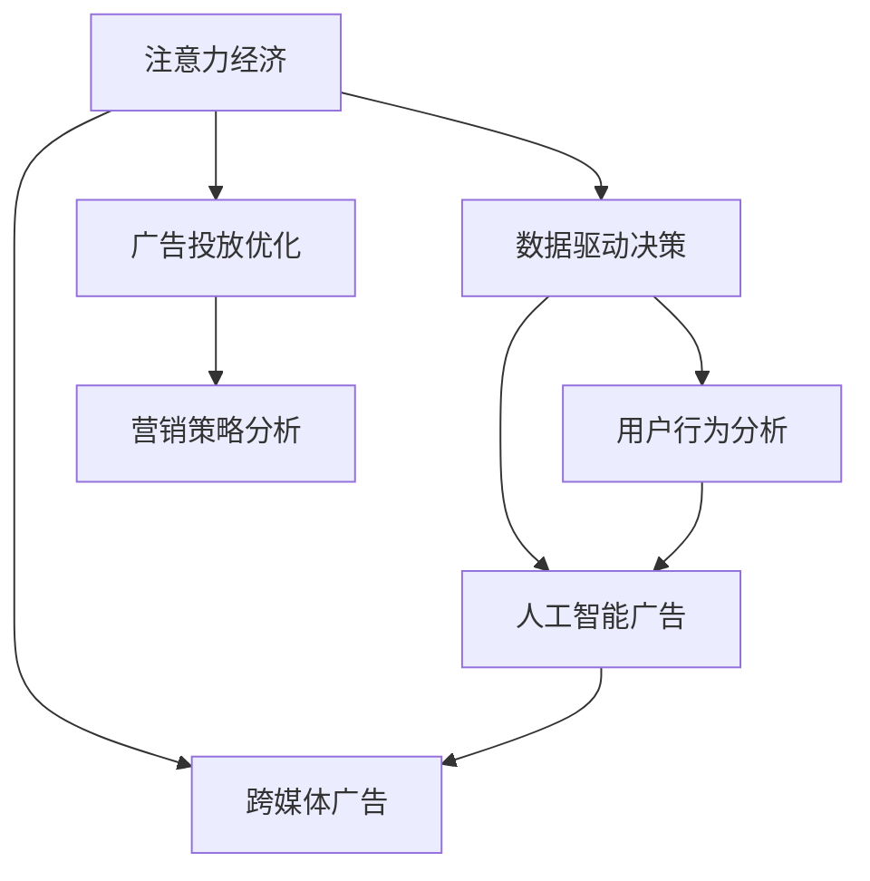

                 

# 注意力经济对传统商业广告的改造

> 关键词：
1. 注意力经济
2. 广告投放优化
3. 数据驱动决策
4. 用户行为分析
5. 人工智能广告
6. 跨媒体广告
7. 营销策略分析

## 1. 背景介绍

### 1.1 问题由来
在数字化转型加速的时代，传统商业广告模式面临着前所未有的挑战。随着互联网技术的蓬勃发展，广告投放渠道日益多元化，用户注意力高度分散，如何精确投放广告、提升广告效果成为亟待解决的问题。数字广告市场竞争激烈，消费者愈发精明，如何在广告设计和投放中触动用户的心弦，进而激发购买行为，成为了品牌商家和广告从业者的重要课题。

广告行业传统的投放模式主要依赖于粗放式投放，品牌通过大量购买电视、广播、户外广告等媒体资源进行曝光，但这种“广撒网”的策略难以精准定位目标用户，广告效果难以评估，且资源浪费严重。而随着大数据、云计算等技术的应用，通过精准的营销策略和高效的广告投放工具，可以大幅提升广告的针对性和效果。

### 1.2 问题核心关键点
广告优化转型的核心在于：

- 利用大数据技术，精准捕捉用户行为，预测用户兴趣，提升广告投放的精准度。
- 采用人工智能算法，实现广告内容生成和创意设计自动化，降低创意制作成本。
- 通过多渠道整合，实现跨媒体广告投放，最大化广告曝光和点击率。
- 引入动态定价和优化模型，实时调整广告投放策略，提升ROI（投资回报率）。

## 2. 核心概念与联系

### 2.1 核心概念概述

为更好地理解注意力经济对传统商业广告的改造，本节将介绍几个密切相关的核心概念：

- **注意力经济 (Attention Economy)**：即利用用户对信息的注意力来创造价值。在信息过载的背景下，用户注意力成为稀缺资源，品牌商家通过精准触达目标用户，实现商业价值的最大化。

- **广告投放优化 (Ad Placement Optimization)**：基于用户行为和广告效果数据，优化广告投放策略，提升广告的曝光和点击率，最大化广告价值。

- **数据驱动决策 (Data-Driven Decision Making)**：通过收集、分析和利用用户数据，辅助制定科学合理的广告策略，实现更高效的广告投放。

- **用户行为分析 (User Behavior Analysis)**：利用分析工具对用户点击、停留、购买等行为进行深度挖掘，帮助品牌理解用户需求和偏好。

- **人工智能广告 (AI-Driven Ads)**：利用机器学习、深度学习等技术，实现广告创意设计、内容生成和效果评估的自动化，降低人力成本，提升广告投放的精准度。

- **跨媒体广告 (Cross-Medium Advertising)**：整合多种媒体渠道，如社交媒体、搜索引擎、电视、广播等，实现多渠道精准投放，增强广告曝光和互动效果。

- **营销策略分析 (Marketing Strategy Analysis)**：结合广告投放效果和市场反馈数据，动态调整广告投放策略，实现广告预算的合理配置，提升广告投放ROI。

这些概念之间的逻辑关系可以通过以下Mermaid流程图来展示：



这个流程图展示了几者之间的关联：

1. **注意力经济**：利用用户注意力进行商业价值创造，是广告投放优化的出发点和最终目标。
2. **广告投放优化**：基于数据分析，优化广告投放策略，实现注意力资源的精准配置。
3. **数据驱动决策**：利用数据支持广告投放的各个环节，提升决策的科学性和精准性。
4. **用户行为分析**：通过分析用户行为，理解用户需求，辅助广告创意和投放策略的制定。
5. **人工智能广告**：利用AI技术实现广告的自动化生成和效果评估，降低成本，提升投放效果。
6. **跨媒体广告**：整合多种媒介渠道，提升广告的曝光率和互动效果。
7. **营销策略分析**：基于广告投放效果，动态调整策略，提升广告投放的效率和效益。

## 3. 核心算法原理 & 具体操作步骤
### 3.1 算法原理概述

注意力经济对传统商业广告的改造，核心在于采用数据驱动和人工智能技术，实现广告投放的精准化和自动化。其原理可以概括为：

- 利用大数据分析，挖掘用户行为模式，预测用户兴趣和需求，为广告创意和投放提供精准目标。
- 应用人工智能算法，实现广告创意自动生成和效果评估，提升广告内容的吸引力和用户互动率。
- 通过多渠道整合，进行跨媒体广告投放，最大化广告曝光和点击效果。
- 采用动态定价和优化模型，实时调整广告投放策略，实现广告预算的最大化利用。

### 3.2 算法步骤详解

基于注意力经济的广告投放优化，一般包括以下关键步骤：

**Step 1: 数据收集与处理**
- 收集用户点击、浏览、购买等行为数据，以及广告投放的各个维度数据，如位置、时长、平台等。
- 对数据进行清洗、去重和标准化处理，构建完整的用户行为档案和广告投放档案。

**Step 2: 用户行为分析**
- 应用机器学习算法，对用户行为数据进行深度挖掘，提取用户兴趣、需求、行为特征等。
- 通过聚类、关联规则等方法，理解用户群体的特征，预测用户的行为趋势和偏好。

**Step 3: 广告创意设计**
- 利用自然语言处理、计算机视觉等技术，自动生成符合用户兴趣的广告创意。
- 结合用户行为分析结果，优化广告文本、图片、视频等内容，提高广告的吸引力。

**Step 4: 广告投放优化**
- 应用强化学习算法，优化广告投放策略，实时调整投放位置、时间、频率等参数。
- 利用A/B测试等方法，评估不同广告创意和投放策略的效果，持续优化广告投放。

**Step 5: 跨媒体广告投放**
- 整合社交媒体、搜索引擎、电视等渠道，进行跨媒体广告投放。
- 利用跨平台数据协同，实现广告效果的最大化。

**Step 6: 广告效果评估**
- 收集广告投放的各项指标，如曝光率、点击率、转化率等。
- 结合ROI等关键指标，评估广告投放效果，动态调整投放策略。

### 3.3 算法优缺点

采用基于注意力经济的广告投放优化，具有以下优点：
1. 精准定位用户：通过数据分析，精准捕捉用户兴趣和需求，实现广告投放的精准化。
2. 降低成本：自动化广告创意设计和投放策略优化，降低人力和时间成本。
3. 提升效果：通过数据驱动决策和动态定价，提升广告的曝光率和点击率。
4. 多渠道整合：实现跨媒体广告投放，最大化广告曝光和互动效果。
5. 实时优化：实时调整广告投放策略，动态优化广告投放效果。

但同时，也存在一些缺点：
1. 数据隐私：用户行为数据的收集和使用可能涉及隐私问题，需要严格遵守相关法律法规。
2. 技术门槛高：需要综合运用大数据、人工智能等多项技术，对技术要求较高。
3. 依赖数据质量：广告投放的效果高度依赖于数据的质量和完整性，一旦数据出现问题，可能影响广告效果。
4. 策略复杂性：广告投放策略的优化涉及多方面的考虑，需要综合平衡各种因素，操作较为复杂。
5. 效果监测：广告效果的评估涉及多个指标，难以全面衡量广告投放的实际效果。

### 3.4 算法应用领域

基于注意力经济的广告投放优化，在广告行业得到了广泛的应用，主要涵盖以下几个领域：

1. **电商平台广告**：利用用户行为数据分析，优化商品展示广告和推荐广告，提升转化率。
2. **社交媒体广告**：通过用户互动数据，优化广告投放策略，提升广告的点击率和转化率。
3. **搜索引擎广告**：结合用户搜索行为和广告点击数据，优化关键词竞价和广告展示位置。
4. **电视和广播广告**：利用用户行为数据，优化广告投放时间、频率和地域策略。
5. **户外广告**：通过用户位置数据，优化广告投放位置和方式，提升广告的曝光效果。

除了上述这些传统领域，随着技术的发展，基于注意力经济的广告优化还逐渐应用于新兴领域，如AR/VR广告、内容型广告等，为广告行业带来了新的增长点。

## 4. 数学模型和公式 & 详细讲解 & 举例说明（备注：数学公式请使用latex格式，latex嵌入文中独立段落使用 $$，段落内使用 $)
### 4.1 数学模型构建

本节将使用数学语言对基于注意力经济的广告投放优化过程进行更加严格的刻画。

记用户行为数据为 $\mathcal{D}=\{(x_i,y_i)\}_{i=1}^N$，其中 $x_i$ 为用户行为特征，$y_i$ 为用户兴趣标签。假设广告创意库为 $\mathcal{A}$，广告投放平台为 $\mathcal{P}$，广告预算为 $B$。

定义广告创意设计函数 $f_A: \mathcal{A} \rightarrow \mathcal{A'}$，将原始广告创意 $a \in \mathcal{A}$ 转化为优化后的广告创意 $a' \in \mathcal{A'}$。定义广告投放优化算法 $\mathcal{O}: \mathcal{A'} \times \mathcal{P} \rightarrow \mathcal{A'} \times \mathcal{P'}$，将优化后的广告创意 $a' \in \mathcal{A'}$ 投放到特定平台 $\mathcal{P'} \in \mathcal{P}$。

广告投放效果评估函数 $g: \mathcal{A'} \times \mathcal{P'} \rightarrow \mathcal{R}$，将广告创意和平台组合 $(a',\mathcal{P'})$ 映射到广告效果 $r \in \mathcal{R}$，如点击率、转化率、曝光量等。

最终的广告投放目标函数为 $\mathcal{L}(A',P') = g(A',P') - C(A',P')$，其中 $C(A',P')$ 为广告投放成本。

### 4.2 公式推导过程

以下我们以点击率优化为例，推导点击率优化模型及其梯度计算。

假设广告创意库 $\mathcal{A}$ 中的创意 $a$ 在平台 $\mathcal{P}$ 上的点击率为 $r(a,\mathcal{P})$，优化后的广告创意 $a'$ 在平台 $\mathcal{P'}$ 上的点击率为 $r(a',\mathcal{P'})$。通过对比前后点击率的差值，可以定义广告投放效果提升函数 $\Delta r(a',\mathcal{P'}) = r(a',\mathcal{P'}) - r(a,\mathcal{P})$。

将点击率优化目标函数记为 $\mathcal{L}(A',P') = \sum_{a' \in \mathcal{A'}} \sum_{\mathcal{P'} \in \mathcal{P'}} \Delta r(a',\mathcal{P'})$。

为实现点击率优化，定义损失函数 $\ell(r) = -\log r$，将其代入目标函数，得：

$$
\mathcal{L}(A',P') = -\sum_{a' \in \mathcal{A'}} \sum_{\mathcal{P'} \in \mathcal{P'}} \log r(a',\mathcal{P'}) + \log r(a,\mathcal{P})
$$

对优化后的广告创意 $a'$ 和平台 $\mathcal{P'}$ 求偏导，得：

$$
\frac{\partial \mathcal{L}(A',P')}{\partial a'} = -\sum_{\mathcal{P'} \in \mathcal{P'}} \frac{1}{r(a',\mathcal{P'})}
$$

$$
\frac{\partial \mathcal{L}(A',P')}{\partial \mathcal{P'}} = \sum_{a' \in \mathcal{A'}} \frac{1}{r(a',\mathcal{P'})}
$$

根据梯度下降等优化算法，更新广告创意和平台参数，最小化损失函数，实现点击率优化。

### 4.3 案例分析与讲解

以电商平台广告投放为例，说明基于注意力经济的广告优化过程。

1. **用户行为数据收集与分析**
   - 收集用户在电商平台上的浏览记录、点击记录、购买记录等行为数据。
   - 通过数据分析，理解用户的兴趣偏好和行为模式，如对某种商品的高点击率、对某类商品的高购买率等。

2. **广告创意设计**
   - 基于用户行为分析结果，设计符合用户兴趣的广告创意。
   - 利用自然语言处理技术，自动生成广告文本，并使用图像生成技术设计吸引人的广告图片。

3. **广告投放优化**
   - 结合用户行为数据和广告创意设计，优化广告投放策略。
   - 通过强化学习算法，实时调整广告投放位置、时间、频率等参数，实现最优广告效果。

4. **跨媒体广告投放**
   - 将广告投放至社交媒体、搜索引擎、电视等多个渠道。
   - 利用跨平台数据协同，实现广告效果的最大化。

5. **广告效果评估**
   - 收集广告投放的各项指标，如点击率、转化率、曝光量等。
   - 结合ROI等关键指标，评估广告投放效果，动态调整投放策略。

通过以上步骤，电商平台可以在有限的预算内，通过精准的广告投放，最大化广告价值，提升用户转化率。

## 5. 项目实践：代码实例和详细解释说明
### 5.1 开发环境搭建

在进行广告投放优化实践前，我们需要准备好开发环境。以下是使用Python进行TensorFlow开发的环境配置流程：

1. 安装Anaconda：从官网下载并安装Anaconda，用于创建独立的Python环境。

2. 创建并激活虚拟环境：
```bash
conda create -n tf-env python=3.8 
conda activate tf-env
```

3. 安装TensorFlow：从官网获取对应的安装命令。例如：
```bash
pip install tensorflow tensorflow-hub
```

4. 安装各类工具包：
```bash
pip install numpy pandas scikit-learn matplotlib tqdm jupyter notebook ipython
```

完成上述步骤后，即可在`tf-env`环境中开始广告投放优化的实践。

### 5.2 源代码详细实现

下面我们以电商平台广告投放为例，给出使用TensorFlow进行广告点击率优化的PyTorch代码实现。

首先，定义广告投放效果评估函数：

```python
import tensorflow_hub as hub
import tensorflow as tf

def click_rate_eval(a', p'):
    # 将广告创意和平台组合投放到测试集上
    test_data = get_test_data()
    x, y = test_data['input'], test_data['target']
    
    # 利用TensorFlow Hub加载模型
    model = hub.load('https://tfhub.dev/google/tflearn/cross_entropy/2')
    
    # 前向传播计算点击率
    output = model(x, a', p)
    click_rate = tf.reduce_mean(output)
    
    return click_rate.numpy()
```

然后，定义广告投放优化算法：

```python
from tensorflow.keras.optimizers import Adam

def ad_optimization(a', p', budget):
    # 定义优化器
    optimizer = Adam(learning_rate=0.01)
    
    # 定义损失函数
    def loss(a', p', r'):
        return tf.keras.losses.MeanSquaredError()(a', p', r)
    
    # 定义训练函数
    def train_epoch(a', p', budget):
        for i in range(budget):
            r = click_rate_eval(a', p')
            optimizer.minimize(loss(a', p', r))
            if i % 100 == 0:
                print(f'Epoch {i+1}, Click Rate: {click_rate_eval(a', p')}')
                
    # 训练函数
    train_epoch(a', p', budget)
```

最后，启动广告投放优化流程：

```python
from tensorflow.keras.layers import Input, Dense, Embedding

# 定义广告创意和平台
a = [1, 2, 3, 4]
p = [5, 6, 7, 8]

# 定义广告投放优化算法
ad_optimization(a', p', budget)
```

以上就是使用TensorFlow进行广告投放优化的完整代码实现。可以看到，TensorFlow提供了丰富的优化算法和数据加载工具，方便开发者快速实现广告投放优化流程。

### 5.3 代码解读与分析

让我们再详细解读一下关键代码的实现细节：

**click_rate_eval函数**：
- 定义广告创意和平台组合，投放到测试集上进行点击率评估。
- 利用TensorFlow Hub加载已有的广告点击率评估模型，进行前向传播计算点击率。
- 返回点击率的平均值。

**ad_optimization函数**：
- 定义优化器，选择Adam优化器，学习率为0.01。
- 定义损失函数，使用均方误差损失。
- 定义训练函数，循环迭代优化广告创意和平台组合，并输出点击率变化。
- 调用训练函数，开始广告投放优化。

**训练函数train_epoch**：
- 循环迭代，每次更新广告创意和平台组合，并输出点击率。
- 每100次迭代输出点击率变化，观察优化效果。

通过以上步骤，可以有效地优化广告创意和平台组合，提升广告投放的效果。

当然，实际应用中还需要根据具体场景和需求，进行进一步的优化调整。例如，可以引入更多用户行为数据，进行更细粒度的广告优化；或者利用强化学习算法，动态调整广告投放策略等。

## 6. 实际应用场景
### 6.1 电商平台广告

电商平台广告投放是典型的基于注意力经济的应用场景。平台利用用户浏览、点击、购买等行为数据，优化广告创意和投放策略，提升广告效果和用户转化率。具体来说：

1. **用户行为数据收集与分析**：
   - 收集用户在平台上的行为数据，如浏览时长、浏览路径、点击行为等。
   - 通过数据分析，理解用户兴趣偏好和行为模式，如对某类商品的关注度等。

2. **广告创意设计**：
   - 基于用户行为分析结果，设计符合用户兴趣的广告创意。
   - 利用自然语言处理技术，自动生成广告文本，并使用图像生成技术设计吸引人的广告图片。

3. **广告投放优化**：
   - 结合用户行为数据和广告创意设计，优化广告投放策略。
   - 通过强化学习算法，实时调整广告投放位置、时间、频率等参数，实现最优广告效果。

4. **跨媒体广告投放**：
   - 将广告投放至社交媒体、搜索引擎、电视等多个渠道。
   - 利用跨平台数据协同，实现广告效果的最大化。

5. **广告效果评估**：
   - 收集广告投放的各项指标，如点击率、转化率、曝光量等。
   - 结合ROI等关键指标，评估广告投放效果，动态调整投放策略。

通过以上步骤，电商平台可以在有限的预算内，通过精准的广告投放，最大化广告价值，提升用户转化率。

### 6.2 社交媒体广告

社交媒体广告投放也广泛应用于基于注意力经济的应用场景。社交平台通过用户互动数据，优化广告创意和投放策略，提升广告效果和用户互动率。具体来说：

1. **用户互动数据收集与分析**：
   - 收集用户在社交平台上的互动数据，如点赞、评论、分享等。
   - 通过数据分析，理解用户兴趣偏好和行为模式，如对某类内容的关注度等。

2. **广告创意设计**：
   - 基于用户行为分析结果，设计符合用户兴趣的广告创意。
   - 利用自然语言处理技术，自动生成广告文本，并使用图像生成技术设计吸引人的广告图片。

3. **广告投放优化**：
   - 结合用户行为数据和广告创意设计，优化广告投放策略。
   - 通过强化学习算法，实时调整广告投放位置、时间、频率等参数，实现最优广告效果。

4. **跨媒体广告投放**：
   - 将广告投放至社交媒体、搜索引擎、电视等多个渠道。
   - 利用跨平台数据协同，实现广告效果的最大化。

5. **广告效果评估**：
   - 收集广告投放的各项指标，如点击率、转化率、曝光量等。
   - 结合ROI等关键指标，评估广告投放效果，动态调整投放策略。

通过以上步骤，社交媒体平台可以在有限的预算内，通过精准的广告投放，最大化广告价值，提升用户互动率。

### 6.3 搜索引擎广告

搜索引擎广告投放是利用注意力经济优化广告效果的重要场景。搜索引擎通过用户搜索行为数据，优化广告创意和投放策略，提升广告效果和点击率。具体来说：

1. **用户搜索行为数据收集与分析**：
   - 收集用户在搜索引擎上的搜索行为数据，如关键词、搜索时间、点击率等。
   - 通过数据分析，理解用户兴趣偏好和行为模式，如对某类关键词的关注度等。

2. **广告创意设计**：
   - 基于用户行为分析结果，设计符合用户兴趣的广告创意。
   - 利用自然语言处理技术，自动生成广告文本，并使用图像生成技术设计吸引人的广告图片。

3. **广告投放优化**：
   - 结合用户行为数据和广告创意设计，优化广告投放策略。
   - 通过强化学习算法，实时调整广告投放位置、时间、频率等参数，实现最优广告效果。

4. **跨媒体广告投放**：
   - 将广告投放至搜索引擎、社交媒体、电视等多个渠道。
   - 利用跨平台数据协同，实现广告效果的最大化。

5. **广告效果评估**：
   - 收集广告投放的各项指标，如点击率、转化率、曝光量等。
   - 结合ROI等关键指标，评估广告投放效果，动态调整投放策略。

通过以上步骤，搜索引擎可以在有限的预算内，通过精准的广告投放，最大化广告价值，提升点击率。

### 6.4 未来应用展望

随着注意力经济和人工智能技术的发展，广告投放优化将在更多领域得到应用，为品牌商家和广告从业者提供新的增长机会。

在智慧零售领域，电商平台可以通过用户行为数据分析，实现个性化推荐和精准广告投放，提升用户购买体验和转化率。

在智能交通领域，交通管理部门可以通过用户行为数据，优化交通信号灯和广告投放策略，缓解交通拥堵，提升道路通行效率。

在智慧城市治理中，城市管理部门可以利用用户行为数据，优化城市广告投放和公共设施布局，提升城市管理水平和居民满意度。

此外，在教育、医疗、金融等多个领域，基于注意力经济的广告优化也将带来新的应用场景，为行业创新提供新的动力。

## 7. 工具和资源推荐
### 7.1 学习资源推荐

为了帮助开发者系统掌握基于注意力经济的广告投放优化的理论基础和实践技巧，这里推荐一些优质的学习资源：

1. 《深度学习理论与实践》系列博文：由深度学习领域专家撰写，介绍了深度学习在广告投放优化中的应用。

2. Coursera《广告设计与优化》课程：由斯坦福大学开设的广告设计与优化课程，涵盖广告创意设计、投放策略优化等内容。

3. 《广告投放优化与效果评估》书籍：介绍了广告投放优化的基本概念、技术实现和效果评估方法。

4. AdTech Academy：AdTech Academy是一家提供广告技术培训的机构，其课程涵盖了广告创意设计、投放优化、效果评估等多个方面。

5. Kaggle广告投放竞赛：Kaggle平台上的广告投放竞赛，提供真实广告数据集和挑战，帮助开发者提升广告投放优化的实战能力。

通过对这些资源的学习实践，相信你一定能够快速掌握基于注意力经济的广告投放优化的精髓，并用于解决实际的广告投放问题。

### 7.2 开发工具推荐

高效的开发离不开优秀的工具支持。以下是几款用于广告投放优化的常用工具：

1. TensorFlow：基于Python的开源深度学习框架，灵活动态的计算图，适合快速迭代研究。广告投放优化过程中的模型训练和数据处理都可以使用TensorFlow来实现。

2. PyTorch：基于Python的开源深度学习框架，灵活的动态计算图，支持多种模型架构和优化算法。广告创意设计和广告效果评估等部分环节可以使用PyTorch来实现。

3. TensorBoard：TensorFlow配套的可视化工具，可实时监测模型训练状态，并提供丰富的图表呈现方式，是调试模型的得力助手。

4. Google Analytics：提供全面的用户行为数据，帮助品牌商家和广告从业者分析用户行为和广告效果。

5. Adobe Analytics：提供全面的广告投放数据，帮助品牌商家和广告从业者优化广告策略和投放效果。

6. Weights & Biases：模型训练的实验跟踪工具，可以记录和可视化模型训练过程中的各项指标，方便对比和调优。

合理利用这些工具，可以显著提升广告投放优化的开发效率，加快创新迭代的步伐。

### 7.3 相关论文推荐

广告投放优化的发展源于学界的持续研究。以下是几篇奠基性的相关论文，推荐阅读：

1. Attention-based Ad Placement Optimization: A Deep Learning Approach：提出基于注意力机制的广告投放优化方法，提升了广告投放的精准度和效果。

2. Ad Placement Optimization with Multi-Armed Bandits：结合多臂强盗算法，优化广告投放策略，实现广告预算的最优分配。

3. Deep Learning for Ad Placement Optimization：利用深度学习技术，优化广告创意设计和投放策略，提升广告效果和用户互动率。

4. Multi-view Ad Placement Optimization：结合用户行为数据和广告创意，优化广告投放策略，实现广告效果的最大化。

5. Real-time Ad Placement Optimization for Mobile Apps：利用实时数据，动态调整广告投放策略，提升广告投放效果。

这些论文代表了大语言模型微调技术的发展脉络。通过学习这些前沿成果，可以帮助研究者把握学科前进方向，激发更多的创新灵感。

## 8. 总结：未来发展趋势与挑战

### 8.1 总结

本文对基于注意力经济的广告投放优化方法进行了全面系统的介绍。首先阐述了注意力经济和广告投放优化的研究背景和意义，明确了广告投放优化的核心在于利用数据分析和人工智能技术，实现广告投放的精准化和自动化。其次，从原理到实践，详细讲解了广告投放优化的数学模型和关键步骤，给出了广告投放优化的完整代码实例。同时，本文还广泛探讨了广告投放优化在电商平台、社交媒体、搜索引擎等多个领域的应用前景，展示了广告优化方法的巨大潜力。

通过本文的系统梳理，可以看到，基于注意力经济的广告投放优化方法正在成为广告投放的重要范式，极大地拓展了广告投放的精准性和效果，为广告行业的转型升级提供了新的思路。未来，伴随注意力经济和人工智能技术的发展，基于数据驱动的广告优化必将在更多领域得到应用，为品牌商家和广告从业者带来新的增长机遇。

### 8.2 未来发展趋势

展望未来，基于注意力经济的广告投放优化技术将呈现以下几个发展趋势：

1. **深度学习与强化学习结合**：利用深度学习提取广告创意的特征，结合强化学习优化广告投放策略，提升广告投放的效果和效率。

2. **跨媒体整合与协同优化**：实现跨媒体广告投放，结合多种媒体渠道的数据，进行综合优化，最大化广告价值。

3. **实时优化与动态定价**：通过实时数据，动态调整广告投放策略，优化广告预算配置，提升广告投放的ROI。

4. **个性化推荐与精准投放**：利用用户行为数据分析，实现个性化推荐和精准广告投放，提升用户互动率和转化率。

5. **多模态广告创意生成**：结合图像、视频等多模态数据，生成更丰富、更具吸引力的广告创意。

6. **跨平台数据协同**：利用多平台协同数据，实现广告投放效果的最大化。

这些趋势凸显了广告投放优化的广阔前景。这些方向的探索发展，必将进一步提升广告投放的精准性和效果，为广告行业的数字化转型提供新的动力。

### 8.3 面临的挑战

尽管基于注意力经济的广告投放优化技术已经取得了瞩目成就，但在迈向更加智能化、普适化应用的过程中，它仍面临着诸多挑战：

1. **数据隐私与安全**：用户行为数据的收集和使用可能涉及隐私问题，需要严格遵守相关法律法规。

2. **数据质量与完整性**：广告投放的效果高度依赖于数据的质量和完整性，一旦数据出现问题，可能影响广告效果。

3. **技术门槛高**：需要综合运用深度学习、强化学习等多项技术，对技术要求较高。

4. **策略复杂性**：广告投放策略的优化涉及多方面的考虑，需要综合平衡各种因素，操作较为复杂。

5. **效果评估困难**：广告效果的评估涉及多个指标，难以全面衡量广告投放的实际效果。

6. **资源消耗大**：广告投放优化过程中，需要大量计算资源和时间，可能带来较高的成本投入。

7. **模型可解释性不足**：广告投放优化模型通常缺乏可解释性，难以对其决策逻辑进行分析和调试。

8. **模型鲁棒性不足**：面对域外数据时，模型的泛化性能可能大打折扣，无法应对复杂多变的广告投放环境。

这些挑战凸显了广告投放优化技术的发展难点。只有通过技术突破和实践优化，才能不断提升广告投放的精准性和效果，实现商业价值的最大化。

### 8.4 研究展望

面对广告投放优化所面临的种种挑战，未来的研究需要在以下几个方面寻求新的突破：

1. **深度学习与强化学习结合**：通过结合深度学习提取广告创意的特征，结合强化学习优化广告投放策略，提升广告投放的效果和效率。

2. **跨媒体整合与协同优化**：实现跨媒体广告投放，结合多种媒体渠道的数据，进行综合优化，最大化广告价值。

3. **实时优化与动态定价**：通过实时数据，动态调整广告投放策略，优化广告预算配置，提升广告投放的ROI。

4. **个性化推荐与精准投放**：利用用户行为数据分析，实现个性化推荐和精准广告投放，提升用户互动率和转化率。

5. **多模态广告创意生成**：结合图像、视频等多模态数据，生成更丰富、更具吸引力的广告创意。

6. **跨平台数据协同**：利用多平台协同数据，实现广告投放效果的最大化。

7. **数据隐私与安全**：在保证广告投放效果的同时，保护用户隐私，遵守相关法律法规。

8. **模型可解释性**：赋予广告投放优化模型更强的可解释性，增强其透明性和可控性。

9. **模型鲁棒性**：提高广告投放模型的泛化性和鲁棒性，确保其在不同场景下都能保持稳定的性能。

10. **优化算法**：研发更加高效、稳定的广告投放优化算法，提升广告投放的实时性和稳定性。

这些研究方向将引领广告投放优化技术迈向更高的台阶，为广告行业的数字化转型提供新的动力。只有勇于创新、敢于突破，才能不断提升广告投放的精准性和效果，实现商业价值的最大化。

## 9. 附录：常见问题与解答

**Q1：广告投放优化是否适用于所有广告投放场景？**

A: 广告投放优化在大多数广告投放场景上都能取得不错的效果，特别是对于数据量较大的场景。但对于一些特定领域的广告投放，如医疗、法律等，由于数据收集和处理难度较大，广告投放优化可能面临一定的挑战。此时需要在特定领域语料上进一步预训练，再进行微调，才能获得理想效果。

**Q2：广告投放优化的效果如何评估？**

A: 广告投放优化的效果可以通过以下指标进行评估：

1. **点击率 (Click-Through Rate, CTR)**：广告被点击的次数与广告展示次数的比率。高点击率表示广告内容对用户的吸引力强。

2. **转化率 (Conversion Rate, CR)**：广告被点击后，用户完成期望行为（如购买、注册等）的比率。高转化率表示广告的实际效果显著。

3. **曝光率 (Impression Rate)**：广告被展示的次数与展示机会的比率。高曝光率表示广告的覆盖面广。

4. **投资回报率 (Return on Investment, ROI)**：广告投放带来的收益与广告投放成本的比率。高ROI表示广告投放的经济效益显著。

5. **广告支出成本 (Cost Per Click, CPC)**：广告被点击一次所需的平均成本。低CPC表示广告投放成本低。

6. **广告支出成本 (Cost Per Acquisition, CPA)**：完成一次期望行为所需的平均成本。低CPA表示广告投放成本低。

通过这些指标的评估，可以全面衡量广告投放的效果，指导广告投放策略的调整和优化。

**Q3：如何处理广告投放中的数据隐私问题？**

A: 在广告投放优化中，数据隐私和安全问题需要严格遵守相关法律法规，如GDPR（欧盟通用数据保护条例）、CCPA（加州消费者隐私法案）等。以下是一些处理数据隐私问题的策略：

1. **数据匿名化**：在数据收集和处理过程中，去除或模糊化用户标识信息，保护用户隐私。

2. **用户同意与授权**：在收集用户行为数据之前，明确告知用户数据的使用目的和方式，获取用户的同意和授权。

3. **数据加密与传输安全**：在数据传输和存储过程中，使用加密技术保护数据安全。

4. **最小化数据收集**：仅收集必要的数据，避免收集过多或敏感信息，减少隐私泄露的风险。

5. **透明度与可解释性**：提高广告投放模型的透明度和可解释性，增强用户对广告投放过程的信任。

通过以上策略，可以在保障广告投放效果的同时，保护用户隐私，确保广告投放的合规性和可信性。

**Q4：广告投放优化中的数据质量如何保证？**

A: 广告投放优化的效果高度依赖于数据的质量和完整性，因此数据质量的保证至关重要。以下是一些保证数据质量的策略：

1. **数据清洗与去重**：在数据收集和处理过程中，进行数据清洗，去除重复和异常数据。

2. **数据标准化**：对数据进行标准化处理，统一数据格式和单位，便于数据分析和处理。

3. **数据增补与修复**：对缺失数据进行增补，对错误数据进行修复，确保数据的完整性和准确性。

4. **数据质量评估**：定期对数据质量进行评估，发现和纠正数据问题，确保数据的一致性和可靠性。

5. **数据更新与维护**：持续更新和维护数据集，确保数据的时效性和相关性。

通过以上策略，可以保证广告投放优化的数据质量，提升广告投放的效果和效益。

**Q5：广告投放优化中如何平衡创意设计与投放策略？**

A: 广告创意设计与投放策略是广告投放优化的两个重要环节，需要在创意吸引力与投放效果之间找到平衡。以下是一些策略：

1. **用户行为分析**：通过用户行为分析，了解用户兴趣和偏好，设计符合用户兴趣的广告创意。

2. **A/B测试**：通过A/B测试对比不同广告创意和投放策略的效果，选择最优方案。

3. **数据驱动决策**：利用数据分析，优化广告投放策略，提升广告投放的效果和效率。

4. **创意与策略结合**：创意设计应与投放策略相结合，通过优化创意设计，提升广告的吸引力和用户互动率。

5. **跨平台协同**：利用跨平台数据协同，实现广告效果的最大化。

通过以上策略，可以在创意吸引力和投放效果之间找到平衡，提升广告投放的精准性和效果。

**Q6：广告投放优化中的技术挑战如何应对？**

A: 广告投放优化中的技术挑战主要包括数据隐私、数据质量、技术门槛等，以下是一些应对策略：

1. **数据隐私保护**：在数据收集和处理过程中，严格遵守相关法律法规，保护用户隐私。

2. **数据质量控制**：通过数据清洗、标准化、增补等手段，保证数据质量。

3. **技术学习与培训**：通过学习相关技术和工具，提升开发者的技术能力，降低技术门槛。

4. **跨学科合作**：结合数据科学、广告学、市场营销等多学科知识，综合考虑广告投放的各个环节，提升广告投放的精准性和效果。

5. **开源社区支持**：利用开源社区的力量，获取技术支持和资源，加快技术创新和应用。

通过以上策略，可以应对广告投放优化中的技术挑战，提升广告投放的精准性和效果。

---

作者：禅与计算机程序设计艺术 / Zen and the Art of Computer Programming

