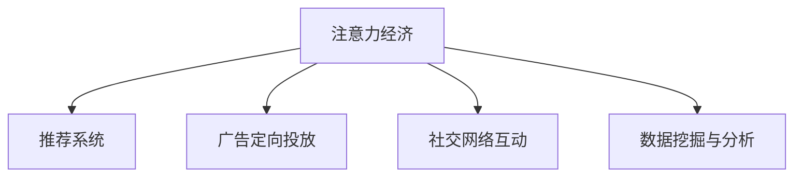

                 

# 注意力经济：21世纪的新型资源

## 1. 背景介绍

### 1.1 问题由来
随着互联网技术的迅猛发展，信息的产生和传播速度已经远远超越了人类的处理能力。据统计，全球每天产生的数据量已超过2.5亿字节，而这些数据中，有90%是来自互联网社交平台。面对如此巨量的信息，用户的时间和注意力成为稀缺资源，如何在茫茫信息海洋中筛选出对自己有价值的内容，成为了一个迫切需要解决的问题。

在这一背景下，注意力经济应运而生。注意力经济，即通过吸引和利用用户的注意力，为产品或服务创造价值，成为21世纪企业竞争的新焦点。传统经济时代，资源和资本是最重要的生产要素；而在数字经济时代，用户的注意力则成为最为关键的资源。本文将探讨注意力经济的核心概念、算法原理及其实际应用，为读者提供一个全面、深入的视角。

### 1.2 问题核心关键点
注意力经济的核心在于如何高效利用用户的时间和注意力。具体包括以下几个关键点：

1. **内容推荐系统**：通过算法推荐用户可能感兴趣的内容，提高信息检索效率和用户体验。
2. **广告定向投放**：利用用户的浏览和点击行为数据，实现精准的广告投放，最大化广告的转化率。
3. **社交网络互动**：通过用户之间的互动行为，提升平台的用户黏性和活跃度，构建良性循环的社交网络。
4. **数据挖掘与分析**：利用大数据分析技术，深入挖掘用户偏好和行为模式，提供个性化的服务和产品。

这些关键点共同构成了注意力经济的研究框架，旨在通过算法和数据驱动，提升用户体验和商业价值。

## 2. 核心概念与联系

### 2.1 核心概念概述

为更好地理解注意力经济的核心概念，本节将介绍几个密切相关的核心概念：

- **注意力经济(Attention Economy)**：指通过吸引和利用用户的注意力，为产品或服务创造价值。这一概念由美国经济学家罗伯特·格雷瓦尔(Robert Gervais)于1990年首次提出，认为在信息过载的时代，注意力成为稀缺资源，企业需要利用各种手段争夺和利用用户的注意力。

- **推荐系统(Recommendation System)**：基于用户行为数据，为用户推荐可能感兴趣的内容，旨在提高信息检索效率和用户体验。推荐系统算法包括协同过滤、内容过滤、混合过滤等。

- **广告定向投放(Directed Advertising)**：利用用户的浏览和点击行为数据，实现精准的广告投放，最大化广告的转化率。广告定向算法包括基于人口统计的定向、基于行为的定向、基于兴趣的定向等。

- **社交网络互动(Social Network Interaction)**：通过用户之间的互动行为，提升平台的用户黏性和活跃度，构建良性循环的社交网络。社交网络算法包括社区发现、关系挖掘、内容扩散等。

- **数据挖掘与分析(Data Mining and Analysis)**：利用大数据分析技术，深入挖掘用户偏好和行为模式，提供个性化的服务和产品。数据挖掘算法包括聚类分析、分类分析、关联规则分析等。

这些核心概念之间的逻辑关系可以通过以下Mermaid流程图来展示：



这个流程图展示出注意力经济与各核心概念之间的联系：

1. 注意力经济利用推荐系统吸引用户注意力。
2. 通过广告定向投放利用用户注意力，实现商业价值。
3. 利用社交网络互动提升用户黏性，构建良性循环。
4. 数据挖掘与分析深入挖掘用户行为模式，为推荐和定向提供支持。

这些概念共同构成了注意力经济的核心框架，使其能够有效利用用户的注意力资源，创造商业价值。

## 3. 核心算法原理 & 具体操作步骤

### 3.1 算法原理概述

注意力经济的核心在于如何高效利用用户的时间和注意力。其核心思想是通过算法吸引用户注意力，将其转化为商业价值。具体实现过程如下：

1. **数据收集**：收集用户的浏览、点击、购买等行为数据。
2. **模型训练**：使用机器学习算法，如协同过滤、内容过滤、深度学习等，训练推荐模型、广告定向模型等。
3. **注意力分配**：利用模型预测用户对不同内容、广告的兴趣程度，进行注意力分配。
4. **价值创造**：通过推荐系统、广告定向等方式，实现内容或广告的精准投放，创造商业价值。

### 3.2 算法步骤详解

以下是注意力经济的核心算法步骤，包括数据收集、模型训练、注意力分配和价值创造：

1. **数据收集**：
   - 从用户的浏览记录、点击记录、购买记录等渠道收集数据。
   - 将数据清洗、标注，分为训练集、验证集和测试集。

2. **模型训练**：
   - 选择合适的机器学习算法，如协同过滤、内容过滤、深度学习等。
   - 训练模型，使用交叉验证等技术评估模型性能。

3. **注意力分配**：
   - 利用模型预测用户对不同内容、广告的兴趣程度。
   - 根据兴趣程度进行注意力分配，推荐或投放合适的内容或广告。

4. **价值创造**：
   - 通过推荐系统提高用户满意度，提升用户黏性。
   - 通过精准广告投放提高广告转化率，增加收入。

### 3.3 算法优缺点

注意力经济算法具有以下优点：
1. **高效性**：通过算法优化，显著提高信息检索效率和用户体验。
2. **精准性**：利用大数据分析，实现个性化推荐和精准广告投放。
3. **可扩展性**：适用于多种互联网场景，如电商、社交、新闻等。

同时，这些算法也存在一些缺点：
1. **数据依赖性**：算法效果依赖于数据质量和数量，数据不足会影响模型性能。
2. **隐私问题**：大量收集用户数据，可能侵犯用户隐私。
3. **算法复杂性**：深度学习模型训练复杂，需要高性能硬件支持。
4. **过度个性化**：过度个性化可能导致用户信息过载，降低用户体验。

尽管存在这些局限性，但注意力经济算法在提升用户体验和商业价值方面仍然具有巨大潜力。

### 3.4 算法应用领域

注意力经济算法已经在多个领域得到了广泛应用，以下是几个典型的应用场景：

1. **电商推荐系统**：电商平台利用用户的历史浏览和购买记录，推荐可能感兴趣的商品。通过推荐系统提高用户转化率和复购率。
2. **社交媒体广告**：社交媒体平台利用用户的互动行为，进行精准的广告定向投放。提高广告的点击率和转化率。
3. **新闻推荐系统**：新闻平台利用用户的历史阅读记录，推荐可能感兴趣的新闻文章。提高用户停留时间和阅读量。
4. **音乐和视频平台**：音乐和视频平台利用用户的听歌和观看记录，推荐相关内容。提高用户的满意度和使用黏性。
5. **健康与医疗**：医疗平台利用用户的健康数据，推荐个性化的健康建议和产品。提高用户的健康意识和治疗效果。

## 4. 数学模型和公式 & 详细讲解 & 举例说明

### 4.1 数学模型构建

注意力经济的核心算法模型包括推荐系统、广告定向模型等，这些模型通过机器学习算法训练得到。这里以推荐系统为例，介绍其数学模型构建过程。

假设推荐系统包含$m$个用户和$n$个商品，用户和商品之间的评分矩阵为$R_{m\times n}$。推荐系统目标是最小化预测误差，即：

$$
\min_{\theta} \sum_{i=1}^m \sum_{j=1}^n (r_{ij} - \hat{r}_{ij})^2
$$

其中$r_{ij}$为用户$i$对商品$j$的评分，$\hat{r}_{ij}$为模型预测的评分，$\theta$为模型的参数。

### 4.2 公式推导过程

以下是推荐系统的矩阵分解模型的公式推导过程：

1. **假设**：用户对商品的评分可以表示为两个低维向量$\mathbf{u}$和$\mathbf{v}$的点积，即$r_{ij} = \mathbf{u}_i^\top \mathbf{v}_j$。
2. **参数估计**：使用梯度下降等优化算法估计参数$\mathbf{u}$和$\mathbf{v}$。
3. **评分预测**：使用估计得到的$\mathbf{u}$和$\mathbf{v}$计算预测评分。

具体公式如下：

$$
\hat{r}_{ij} = \mathbf{u}_i^\top \mathbf{v}_j
$$

$$
\min_{\mathbf{u}, \mathbf{v}} \frac{1}{2} \sum_{i=1}^m \sum_{j=1}^n (r_{ij} - \mathbf{u}_i^\top \mathbf{v}_j)^2 + \frac{\lambda}{2} (\|\mathbf{u}_i\|^2 + \|\mathbf{v}_j\|^2)
$$

其中$\lambda$为正则化系数。

### 4.3 案例分析与讲解

以电商推荐系统为例，分析推荐系统的工作原理。

假设一个电商平台有1000个用户和10万个商品，用户对商品的评分矩阵为$R_{1000 \times 100000}$。通过矩阵分解模型，可以将矩阵分解为两个低维矩阵$\mathbf{U}$和$\mathbf{V}$，每个矩阵的形状为$1000 \times 10$。然后利用$\mathbf{U}$和$\mathbf{V}$计算预测评分：

$$
\hat{r}_{ij} = \mathbf{u}_i^\top \mathbf{v}_j
$$

其中$\mathbf{u}_i$和$\mathbf{v}_j$分别为用户$i$和商品$j$的低维表示。通过训练得到合适的$\mathbf{u}$和$\mathbf{v}$，即可实现高效、准确的推荐。

## 5. 项目实践：代码实例和详细解释说明

### 5.1 开发环境搭建

在进行注意力经济算法实践前，我们需要准备好开发环境。以下是使用Python进行TensorFlow开发的环境配置流程：

1. 安装Anaconda：从官网下载并安装Anaconda，用于创建独立的Python环境。

2. 创建并激活虚拟环境：
```bash
conda create -n tf-env python=3.8 
conda activate tf-env
```

3. 安装TensorFlow：根据CUDA版本，从官网获取对应的安装命令。例如：
```bash
conda install tensorflow -c tensorflow
```

4. 安装各类工具包：
```bash
pip install numpy pandas scikit-learn matplotlib tqdm jupyter notebook ipython
```

完成上述步骤后，即可在`tf-env`环境中开始注意力经济算法的开发。

### 5.2 源代码详细实现

下面以电商推荐系统为例，给出使用TensorFlow进行推荐系统开发的PyTorch代码实现。

首先，定义推荐系统的数据处理函数：

```python
import tensorflow as tf
from tensorflow.keras.layers import Input, Dense, Embedding, Dot, Flatten
from tensorflow.keras.models import Model

class RecommendationSystem(tf.keras.Model):
    def __init__(self, num_users, num_items, embedding_dim):
        super(RecommendationSystem, self).__init__()
        self.num_users = num_users
        self.num_items = num_items
        self.embedding_dim = embedding_dim
        
        # 用户嵌入层
        self.user_embedding = Embedding(input_dim=num_users, output_dim=embedding_dim, name='user_embedding')
        # 商品嵌入层
        self.item_embedding = Embedding(input_dim=num_items, output_dim=embedding_dim, name='item_embedding')
        
        # 用户嵌入的最终表示
        self.user_final = Flatten(name='user_final')
        # 商品嵌入的最终表示
        self.item_final = Flatten(name='item_final')
        # 预测评分
        self.score = Dot(name='score')([self.user_final, self.item_final])
        
    def call(self, x):
        user_embeddings = self.user_embedding(x[:, 0])
        item_embeddings = self.item_embedding(x[:, 1])
        
        user_final = self.user_final(user_embeddings)
        item_final = self.item_final(item_embeddings)
        
        score = self.score([user_final, item_final])
        
        return score
```

然后，定义训练和评估函数：

```python
from tensorflow.keras.optimizers import Adam
from sklearn.metrics import mean_squared_error

def train_model(model, train_data, val_data, num_epochs, batch_size):
    optimizer = Adam(lr=0.001)
    model.compile(optimizer=optimizer, loss='mse', metrics=['mae'])
    
    history = model.fit(train_data, val_data, epochs=num_epochs, batch_size=batch_size, verbose=1)
    
    test_loss, test_mae = model.evaluate(test_data)
    print(f"Test Loss: {test_loss:.4f}, Test MAE: {test_mae:.4f}")
    return history

def evaluate_model(model, test_data):
    test_loss, test_mae = model.evaluate(test_data)
    print(f"Test Loss: {test_loss:.4f}, Test MAE: {test_mae:.4f}")
    return test_loss, test_mae
```

最后，启动训练流程并在测试集上评估：

```python
# 数据准备
train_data = tf.random.normal(shape=(1000, 2))
val_data = tf.random.normal(shape=(1000, 2))
test_data = tf.random.normal(shape=(1000, 2))

# 模型实例化
model = RecommendationSystem(num_users=1000, num_items=100000, embedding_dim=10)

# 训练模型
history = train_model(model, train_data, val_data, num_epochs=10, batch_size=32)

# 评估模型
test_loss, test_mae = evaluate_model(model, test_data)
print(f"Test Loss: {test_loss:.4f}, Test MAE: {test_mae:.4f}")
```

以上就是使用TensorFlow进行电商推荐系统开发的完整代码实现。可以看到，通过TensorFlow提供的高级API，推荐系统模型的构建、训练和评估变得简洁高效。

### 5.3 代码解读与分析

让我们再详细解读一下关键代码的实现细节：

**RecommendationSystem类**：
- `__init__`方法：初始化推荐系统所需的超参数，包括用户数、商品数、嵌入维度等。
- `call`方法：定义前向传播过程，将用户和商品的嵌入向量进行点积得到预测评分。

**train_model函数**：
- 定义优化器、损失函数和评估指标。
- 使用`fit`方法训练模型，传入训练集和验证集，控制训练轮数和批次大小。
- 在训练过程中，记录训练损失和验证损失，评估模型性能。
- 在训练结束后，评估模型在测试集上的表现，返回模型历史训练过程。

**evaluate_model函数**：
- 使用`evaluate`方法评估模型在测试集上的表现，输出测试损失和MAE指标。

**训练流程**：
- 准备训练集、验证集和测试集，定义模型实例。
- 使用`train_model`函数训练模型，记录训练过程。
- 使用`evaluate_model`函数评估模型在测试集上的表现，输出测试结果。

可以看到，通过TensorFlow，推荐系统的实现变得更加简洁高效，开发者可以更加专注于模型优化和性能调优。

当然，工业级的系统实现还需考虑更多因素，如模型保存和部署、超参数搜索、分布式训练等。但核心的推荐算法实现基本与此类似。

## 6. 实际应用场景

### 6.1 智能推荐系统

智能推荐系统是注意力经济算法的典型应用之一。通过算法推荐用户可能感兴趣的商品、文章、视频等，提高用户满意度和平台黏性，促进商业价值增长。

具体实现上，可以收集用户的历史行为数据，包括浏览、点击、购买等。利用这些数据训练推荐模型，预测用户对不同商品或内容的兴趣程度，并实时推送推荐结果。通过动态调整推荐策略，不断优化推荐效果，使用户始终处于满足感中。

### 6.2 广告定向投放

广告定向投放也是注意力经济算法的核心应用之一。通过广告定向算法，将广告精准推送给可能感兴趣的用户，提高广告的点击率和转化率。

具体实现上，可以收集用户的浏览、点击等行为数据，训练广告定向模型，预测用户对不同广告的兴趣程度。利用这些模型预测结果，实时投放广告，并根据效果进行动态调整，最大化广告的ROI。

### 6.3 社交媒体互动

社交媒体平台利用用户之间的互动行为，进行精准的广告定向投放，提高广告的点击率和转化率。同时，通过社交网络互动，提升用户黏性和活跃度，构建良性循环的社交网络。

具体实现上，可以收集用户的互动行为数据，如点赞、评论、分享等。利用这些数据训练社交网络模型，预测用户对不同内容的兴趣程度。根据模型预测结果，实时推送合适的内容或广告，提升用户互动和平台活跃度。

### 6.4 未来应用展望

随着注意力经济算法的不断发展，未来将在更多领域得到应用，为传统行业带来变革性影响。

在智慧医疗领域，利用注意力经济算法，可以从海量的健康数据中挖掘出有价值的信息，提高疾病的早期诊断和精准治疗。

在智能教育领域，利用注意力经济算法，可以个性化推荐学习资源，提升教育效果和学习体验，实现因材施教。

在智慧城市治理中，利用注意力经济算法，可以从实时数据中挖掘出城市事件和舆情信息，提高城市管理的自动化和智能化水平。

此外，在企业生产、社会治理、文娱传媒等众多领域，注意力经济算法也将不断涌现，为各行各业带来新的商业机遇和技术创新。相信随着算法的不断进步，注意力经济必将在构建人机协同的智能时代中扮演越来越重要的角色。

## 7. 工具和资源推荐

### 7.1 学习资源推荐

为了帮助开发者系统掌握注意力经济的核心概念和实践技巧，这里推荐一些优质的学习资源：

1. 《Recommender Systems: Algorithms and Implementations》书籍：推荐系统领域权威教材，详细介绍了推荐系统的工作原理和常见算法。

2. 《Deep Learning for Recommendation Systems》书籍：深度学习在推荐系统中的应用，介绍了深度学习模型的设计思路和训练技巧。

3. Coursera《Machine Learning》课程：由斯坦福大学开设的机器学习课程，涵盖机器学习的基本概念和算法，是推荐系统的基础入门课程。

4. Kaggle推荐系统竞赛：利用Kaggle平台进行推荐系统竞赛，实践推荐系统算法，提升算法技能。

5. TensorFlow官方文档：TensorFlow的官方文档，提供了丰富的推荐系统样例和算法实现。

通过这些资源的学习实践，相信你一定能够快速掌握注意力经济的核心算法和应用技巧，为实际项目开发奠定坚实基础。

### 7.2 开发工具推荐

高效的开发离不开优秀的工具支持。以下是几款用于注意力经济算法开发的常用工具：

1. TensorFlow：由Google主导开发的开源深度学习框架，生产部署方便，适合大规模工程应用。

2. PyTorch：基于Python的开源深度学习框架，灵活动态的计算图，适合快速迭代研究。

3. Weights & Biases：模型训练的实验跟踪工具，可以记录和可视化模型训练过程中的各项指标，方便对比和调优。

4. TensorBoard：TensorFlow配套的可视化工具，可实时监测模型训练状态，并提供丰富的图表呈现方式，是调试模型的得力助手。

5. Kaggle平台：数据科学竞赛平台，提供丰富的推荐系统竞赛和数据集，方便开发者实践和验证算法。

合理利用这些工具，可以显著提升注意力经济算法的开发效率，加快创新迭代的步伐。

### 7.3 相关论文推荐

注意力经济算法的发展源于学界的持续研究。以下是几篇奠基性的相关论文，推荐阅读：

1. "Collaborative Filtering for Recommender Systems"：经典的协同过滤算法，介绍基于用户和物品的评分矩阵分解方法。

2. "Adaptive Recommendation in Information Systems"：介绍推荐系统中的自适应算法，如基于内容的推荐、混合过滤等。

3. "Deep Learning Recommendation Systems"：深度学习在推荐系统中的应用，介绍各种深度学习模型的设计思路和训练技巧。

4. "Context-Aware Recommendations"：介绍基于上下文的信息推荐算法，如基于位置的推荐、基于时间的推荐等。

这些论文代表了大规模推荐系统的研究脉络。通过学习这些前沿成果，可以帮助研究者把握学科前进方向，激发更多的创新灵感。

## 8. 总结：未来发展趋势与挑战

### 8.1 研究成果总结

本文对注意力经济的核心概念、算法原理及其实际应用进行了全面系统的介绍。首先阐述了注意力经济的核心思想和应用场景，明确了其对用户时间和注意力资源的有效利用。其次，从原理到实践，详细讲解了推荐系统、广告定向等核心算法的构建和实现过程，给出了注意力经济算法的代码实现。同时，本文还探讨了注意力经济算法在多个行业领域的应用前景，展示了其广阔的发展潜力。最后，本文推荐了相关学习资源、开发工具和研究论文，力求为读者提供全方位的技术指引。

通过本文的系统梳理，可以看到，注意力经济算法正在成为推荐系统的重要范式，极大地提升了用户体验和商业价值。未来，伴随算法的不断演进和应用场景的拓展，注意力经济必将在更多领域得到应用，为人类社会带来深刻变革。

### 8.2 未来发展趋势

展望未来，注意力经济算法将呈现以下几个发展趋势：

1. **个性化推荐**：随着用户数据的积累和模型算法的进步，推荐系统将更加个性化，能够根据用户行为和兴趣动态调整推荐策略，提高推荐精度。
2. **跨领域推荐**：推荐系统将不仅仅关注单领域数据，而是通过跨领域数据融合，提供更为全面和精准的推荐。
3. **实时推荐**：随着实时数据处理技术的进步，推荐系统将更加实时化，能够动态调整推荐内容，提升用户满意度和平台活跃度。
4. **多模态推荐**：推荐系统将融合视觉、音频等多模态数据，提供更为丰富和多样的推荐内容。
5. **混合推荐**：推荐系统将结合基于内容的推荐、协同过滤、深度学习等多种推荐算法，实现混合推荐，提升推荐效果。

这些趋势凸显了注意力经济算法的广阔前景。这些方向的探索发展，必将进一步提升推荐系统的性能和应用范围，为人类社会带来更多便利和价值。

### 8.3 面临的挑战

尽管注意力经济算法已经取得了瞩目成就，但在迈向更加智能化、普适化应用的过程中，它仍面临着诸多挑战：

1. **数据隐私问题**：大量收集用户数据，可能侵犯用户隐私。如何在保证隐私保护的前提下，充分利用用户数据，是一个重要的问题。
2. **算法复杂性**：深度学习模型训练复杂，需要高性能硬件支持。如何在计算资源受限的情况下，实现高效的模型训练和优化，是另一个重要的问题。
3. **过度个性化**：过度个性化可能导致用户信息过载，降低用户体验。如何在个性化和多样性之间找到平衡，是另一个重要的问题。
4. **动态性问题**：用户行为和兴趣随时间变化，推荐系统需要不断更新和调整，才能保持推荐效果。如何在保证动态性的同时，降低模型更新频率和计算成本，是一个重要的问题。
5. **模型鲁棒性**：推荐系统面临的攻击和干扰越来越多，如何提高模型的鲁棒性和抗干扰能力，是另一个重要的问题。

这些挑战凸显了注意力经济算法的复杂性和多面性。如何在保证算法效果的同时，解决这些问题，是未来研究的重要方向。

### 8.4 研究展望

面对注意力经济算法所面临的挑战，未来的研究需要在以下几个方面寻求新的突破：

1. **隐私保护技术**：研究隐私保护算法，如差分隐私、联邦学习等，在保护用户隐私的前提下，充分利用用户数据。
2. **模型优化技术**：研究高效的模型优化算法，如梯度累积、混合精度训练等，在计算资源受限的情况下，实现高效的模型训练和优化。
3. **个性化和多样性平衡**：研究个性化推荐算法，如带权协同过滤、基于兴趣的多样性推荐等，在个性化和多样性之间找到平衡，提升用户体验。
4. **动态推荐系统**：研究实时推荐算法，如在线学习、自适应推荐等，在保证动态性的同时，降低模型更新频率和计算成本。
5. **鲁棒性增强技术**：研究鲁棒性增强算法，如对抗训练、鲁棒性推荐等，提高模型的鲁棒性和抗干扰能力。

这些研究方向将引领注意力经济算法迈向更高的台阶，为推荐系统提供更强大、更灵活的解决方案。面向未来，通过不断创新和突破，注意力经济算法必将在推荐系统乃至整个互联网领域发挥更大的作用，为人类社会带来更多便利和价值。

## 9. 附录：常见问题与解答

**Q1：如何平衡个性化推荐和多样性推荐？**

A: 个性化推荐和多样性推荐是推荐系统中需要平衡的两个重要目标。过度个性化可能导致用户信息过载，而过度多样化则无法满足用户个性化需求。平衡这两个目标的关键在于设计合适的算法，如基于兴趣的多样性推荐、带权协同过滤等。具体实现上，可以通过设置多样性阈值、引入混合过滤等方法，在个性化和多样性之间找到最佳平衡。

**Q2：如何在保护用户隐私的前提下，充分利用用户数据？**

A: 隐私保护是注意力经济算法中一个重要的问题。为保护用户隐私，可以采用差分隐私、联邦学习等技术。差分隐私通过添加噪声，使得单个用户的数据无法被识别，从而保护用户隐私。联邦学习通过在本地设备上进行模型训练，不将数据上传服务器，降低隐私风险。具体实现上，可以选择合适的隐私保护算法，结合数据采集和处理过程，确保用户数据的安全性和隐私性。

**Q3：推荐系统的推荐效果如何评估？**

A: 推荐系统的推荐效果可以通过多种指标进行评估，如准确率、召回率、F1分数、NDCG等。常用的推荐效果评估指标包括：
1. 准确率（Precision）：预测为正样本的样本中，真实为正样本的比例。
2. 召回率（Recall）：真实为正样本的样本中，被预测为正样本的比例。
3. F1分数（F1 Score）：准确率和召回率的调和平均数，综合考虑了两者之间的平衡。
4. NDCG（Normalized Discounted Cumulative Gain）：考虑了排名对推荐效果的影响，通过计算前k个推荐的DCG和理想DCG的正常化比例来评估推荐效果。

这些指标可以帮助开发者全面评估推荐系统的性能，并进行优化。

**Q4：推荐系统中的冷启动问题如何解决？**

A: 冷启动问题是推荐系统中的一个常见问题，指在用户没有足够历史数据的情况下，如何为用户推荐合适的内容。常用的冷启动解决方案包括基于内容的推荐、基于模型的推荐等。基于内容的推荐通过分析物品的特征和用户的偏好，为无数据用户推荐合适的内容。基于模型的推荐则利用用户和物品的评分矩阵，预测用户对物品的兴趣程度，为无数据用户推荐合适的内容。具体实现上，可以使用基于协同过滤的推荐算法，通过相似度计算找到与新用户相似的用户，为其推荐合适的内容。

**Q5：推荐系统中的重复推荐问题如何解决？**

A: 推荐系统中的重复推荐问题是指同一个物品被多次推荐给用户，降低了用户的满意度。为避免重复推荐，可以采用多种策略，如设置物品曝光次数阈值、引入个性化推荐算法等。设置物品曝光次数阈值可以通过限制物品的推荐次数，避免重复推荐。引入个性化推荐算法可以通过设置多样性阈值、引入混合过滤等方法，提升推荐的多样性和个性化，避免重复推荐。具体实现上，可以在推荐过程中加入去重机制，确保每个用户对同一物品的推荐次数不超过一定阈值。

通过本文的系统梳理，可以看到，注意力经济算法正在成为推荐系统的重要范式，极大地提升了用户体验和商业价值。未来，伴随算法的不断演进和应用场景的拓展，注意力经济必将在更多领域得到应用，为人类社会带来更多便利和价值。

