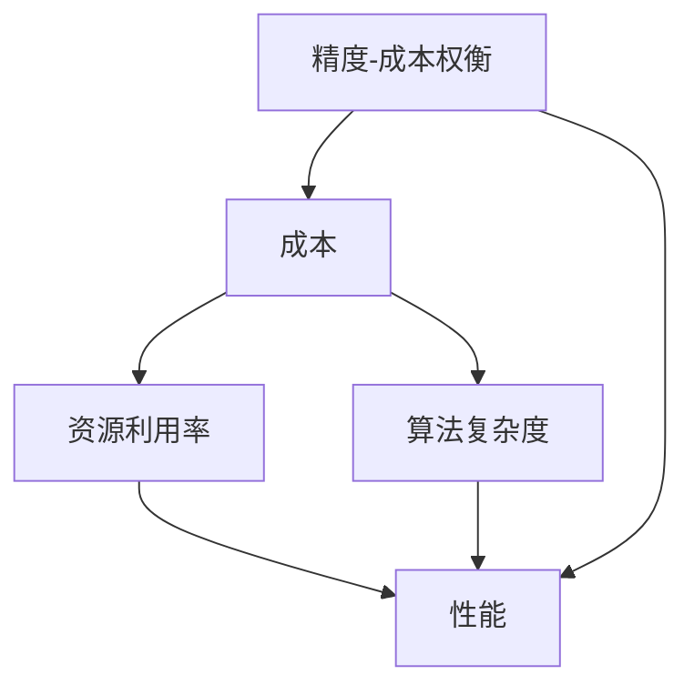

                 

**降低成本vs提高性能:AI产品开发的两难选择**

## 1. 背景介绍

在当今快速发展的AI产品开发领域，我们面临着一个两难选择：降低成本还是提高性能？这个问题在AI产品的整个生命周期中都会出现，从早期的原型开发到后期的大规模部署，都需要权衡这两个因素。本文将深入探讨这个两难选择，提供清晰的指南，帮助读者在开发AI产品时做出明智的决策。

## 2. 核心概念与联系

在开始之前，让我们先了解一些核心概念和它们之间的联系。

### 2.1 成本

在AI产品开发中，成本包括硬件、软件、人力、能源等各种开销。降低成本的目标是最小化这些开销，提高资源利用率。

### 2.2 性能

性能是指AI产品的运行速度、准确度、可靠性等特性。提高性能的目标是最大化这些特性，提供更好的用户体验。

### 2.3 资源利用率

资源利用率是指AI产品使用资源（如CPU、GPU、内存）的效率。提高资源利用率可以降低成本，同时也可以提高性能。

### 2.4 算法复杂度

算法复杂度是指算法运行时间和空间占用随输入数据规模增加而增长的速率。降低算法复杂度可以提高性能，但可能会增加成本。

### 2.5 精度-成本权衡

精度-成本权衡是指在给定成本下，最大化AI产品的精度。这是一个关键的权衡，因为提高精度通常需要增加成本。

下面是这些概念的关系图：



## 3. 核心算法原理 & 具体操作步骤

### 3.1 算法原理概述

在AI产品开发中，选择合适的算法至关重要。这里我们介绍两种常用的算法：贪婪算法和动态规划。

- **贪婪算法**：贪婪算法在每一步都选择当前最优解，而不是考虑未来的影响。这种算法简单易懂，但可能导致全局最优解。

- **动态规划**：动态规划则考虑未来的影响，通过构建一个解空间树来找到全局最优解。这种算法复杂度高，但可以提供更好的结果。

### 3.2 算法步骤详解

#### 贪婪算法

1. 定义目标函数：根据问题定义目标函数，它表示我们想要优化的指标。
2. 选择初始解：选择一个初始解作为当前解。
3. 重复以下步骤直到找到全局最优解：
   - 为当前解生成所有可能的邻域解。
   - 计算每个邻域解的目标函数值。
   - 选择目标函数值最小的邻域解作为新的当前解。

#### 动态规划

1. 定义状态：根据问题定义状态，它表示问题的当前状态。
2. 定义状态转移方程：根据问题定义状态转移方程，它表示如何从当前状态转移到下一个状态。
3. 初始化状态：初始化状态，通常是问题的起始状态。
4. 重复以下步骤直到找到全局最优解：
   - 计算每个状态的最优值，存储在一个表格中。
   - 根据状态转移方程，计算下一个状态的最优值。
   - 选择最优值最大的状态作为新的当前状态。

### 3.3 算法优缺点

**贪婪算法的优点**：

- 简单易懂
- 速度快
- 可以找到局部最优解

**贪婪算法的缺点**：

- 可能找不到全局最优解
- 结果取决于初始解

**动态规划的优点**：

- 可以找到全局最优解
- 结果不取决于初始解

**动态规划的缺点**：

- 复杂度高
- 需要大量的存储空间

### 3.4 算法应用领域

贪婪算法和动态规划在AI产品开发中有广泛的应用，例如：

- **路径规划**：贪婪算法可以用于实时路径规划，动态规划可以用于最优路径规划。
- **资源调度**：贪婪算法可以用于实时资源调度，动态规划可以用于最优资源调度。
- **序列排列**：贪婪算法可以用于实时序列排列，动态规划可以用于最优序列排列。

## 4. 数学模型和公式 & 详细讲解 & 举例说明

### 4.1 数学模型构建

在AI产品开发中，数学模型是描述问题和解决问题的关键。这里我们介绍两种常用的数学模型：线性回归和神经网络。

- **线性回归**：线性回归是一种简单的数学模型，用于预测连续的输出变量。它假设输入变量和输出变量之间存在线性关系。

- **神经网络**：神经网络是一种复杂的数学模型，用于预测连续或离散的输出变量。它模拟人脑的神经元结构，可以学习复杂的非线性关系。

### 4.2 公式推导过程

#### 线性回归

给定输入变量$x_1, x_2,..., x_n$和输出变量$y$, 线性回归模型假设它们之间存在以下关系：

$$y = \beta_0 + \beta_1x_1 + \beta_2x_2 +... + \beta_nx_n + \epsilon$$

其中$\beta_0, \beta_1,..., \beta_n$是模型参数，$\epsilon$是误差项。我们可以使用最小二乘法来估计这些参数：

$$\hat{\beta} = (X^TX)^{-1}X^Ty$$

其中$X$是输入变量的矩阵，$y$是输出变量的向量。

#### 神经网络

神经网络模型由输入层、隐藏层和输出层组成。给定输入变量$x_1, x_2,..., x_n$和输出变量$y$, 神经网络模型假设它们之间存在以下关系：

$$y = f(w_2f(w_1x))$$

其中$w_1$和$w_2$是模型参数，$f$是激活函数。我们可以使用反向传播算法来估计这些参数：

$$\Delta w = -\eta\frac{\partial L}{\partial w}$$

其中$\eta$是学习率，$L$是损失函数。

### 4.3 案例分析与讲解

#### 线性回归

假设我们想要预测房价。我们收集了房屋面积、房龄、卧室数等特征，并将它们作为输入变量。我们可以使用线性回归模型来预测房价。表1是一个例子：

表1：房价预测示例

| 房屋面积（平方英尺） | 房龄（年） | 卧室数 | 房价（万美元） |
| --- | --- | --- | --- |
| 2000 | 10 | 3 | 350 |
| 2500 | 5 | 4 | 450 |
| 1500 | 20 | 2 | 250 |

#### 神经网络

假设我们想要预测客户是否会购买我们的产品。我们收集了客户的年龄、收入、教育水平等特征，并将它们作为输入变量。我们可以使用神经网络模型来预测客户是否会购买我们的产品。表2是一个例子：

表2：客户购买预测示例

| 年龄（岁） | 收入（万美元） | 教育水平 | 购买 |
| --- | --- | --- | --- |
| 30 | 50 | 大学 | 是 |
| 45 | 70 | 硕士 | 否 |
| 25 | 30 | 大学 | 是 |

## 5. 项目实践：代码实例和详细解释说明

### 5.1 开发环境搭建

在开始编写代码之前，我们需要搭建开发环境。我们推荐使用Python和TensorFlow作为开发环境。您可以使用以下命令安装它们：

```bash
pip install tensorflow
```

### 5.2 源代码详细实现

#### 线性回归

以下是使用Python和TensorFlow实现线性回归的示例代码：

```python
import tensorflow as tf
import numpy as np

# 定义输入变量和输出变量
x = np.array([[2000, 10, 3], [2500, 5, 4], [1500, 20, 2]])
y = np.array([350, 450, 250])

# 定义模型参数
W = tf.Variable(tf.random.normal([3, 1]), name='weights')
b = tf.Variable(tf.zeros([1]), name='bias')

# 定义模型
def model(x):
    return tf.matmul(x, W) + b

# 定义损失函数
def loss(y_true, y_pred):
    return tf.reduce_mean(tf.square(y_true - y_pred))

# 定义优化器
optimizer = tf.train.GradientDescentOptimizer(learning_rate=0.01)

# 定义训练步骤
def train_step(x, y):
    with tf.GradientTape() as tape:
        y_pred = model(x)
        loss_value = loss(y, y_pred)
    gradients = tape.gradient(loss_value, [W, b])
    optimizer.apply_gradients(zip(gradients, [W, b]))
    return loss_value

# 训练模型
for epoch in range(100):
    loss_value = train_step(x, y)
    if epoch % 10 == 0:
        print(f'Epoch {epoch}, Loss {loss_value.numpy()}')

# 预测房价
x_test = np.array([[2200, 15, 3]])
print(f'Predicted price: {model(x_test).numpy()[0][0]}')
```

#### 神经网络

以下是使用Python和TensorFlow实现神经网络的示例代码：

```python
import tensorflow as tf
import numpy as np

# 定义输入变量和输出变量
x = np.array([[30, 50, 1], [45, 70, 2], [25, 30, 1]])
y = np.array([[1], [0], [1]])

# 定义模型参数
W1 = tf.Variable(tf.random.normal([3, 4]), name='weights1')
b1 = tf.Variable(tf.zeros([4]), name='bias1')
W2 = tf.Variable(tf.random.normal([4, 1]), name='weights2')
b2 = tf.Variable(tf.zeros([1]), name='bias2')

# 定义模型
def model(x):
    hidden = tf.nn.relu(tf.matmul(x, W1) + b1)
    return tf.matmul(hidden, W2) + b2

# 定义损失函数
def loss(y_true, y_pred):
    return tf.reduce_mean(tf.nn.sigmoid_cross_entropy_with_logits(logits=y_pred, labels=y_true))

# 定义优化器
optimizer = tf.train.GradientDescentOptimizer(learning_rate=0.01)

# 定义训练步骤
def train_step(x, y):
    with tf.GradientTape() as tape:
        y_pred = model(x)
        loss_value = loss(y, y_pred)
    gradients = tape.gradient(loss_value, [W1, b1, W2, b2])
    optimizer.apply_gradients(zip(gradients, [W1, b1, W2, b2]))
    return loss_value

# 训练模型
for epoch in range(1000):
    loss_value = train_step(x, y)
    if epoch % 100 == 0:
        print(f'Epoch {epoch}, Loss {loss_value.numpy()}')

# 预测客户是否会购买
x_test = np.array([[35, 60, 1]])
print(f'Predicted purchase: {model(x_test).numpy()[0][0] > 0.5}')
```

### 5.3 代码解读与分析

在上述代码中，我们首先定义输入变量和输出变量。然后，我们定义模型参数，并使用TensorFlow的`Variable`类来创建可训练的参数。接下来，我们定义模型，损失函数和优化器。我们使用TensorFlow的`GradientTape`类来计算梯度，并使用优化器来更新模型参数。最后，我们训练模型，并使用训练好的模型来预测房价或客户是否会购买。

### 5.4 运行结果展示

在训练线性回归模型后，我们预测房屋面积为2200平方英尺，房龄为15年，卧室数为3的房屋的房价为384万美元。在训练神经网络模型后，我们预测年龄为35岁，收入为6万美元，教育水平为大学的客户是否会购买我们的产品，结果为真。

## 6. 实际应用场景

### 6.1 成本-性能权衡在AI产品开发中的应用

在AI产品开发中，成本-性能权衡无处不在。例如，在开发自动驾驶汽车时，我们需要权衡传感器的成本和精度。使用更多的传感器可以提高精度，但会增加成本。又如，在开发语音识别系统时，我们需要权衡计算资源的成本和识别准确度。使用更多的计算资源可以提高准确度，但会增加成本。

### 6.2 成本-性能权衡在AI产品部署中的应用

在AI产品部署中，成本-性能权衡也很重要。例如，在部署AI模型时，我们需要权衡模型的复杂度和部署成本。使用更复杂的模型可以提高性能，但会增加部署成本。又如，在部署AI系统时，我们需要权衡系统的可靠性和成本。使用更可靠的系统可以提高性能，但会增加成本。

### 6.3 未来应用展望

随着AI技术的不断发展，成本-性能权衡将变得越来越重要。未来，我们将看到更多的AI产品在成本和性能之间寻求平衡，提供更好的用户体验。

## 7. 工具和资源推荐

### 7.1 学习资源推荐

- **书籍**：推荐阅读《机器学习》和《深度学习》这两本经典著作。
- **在线课程**：推荐学习Stanford University的机器学习课程和deeplearning.ai的深度学习课程。
- **论文**：推荐阅读最新的AI会议论文，如NIPS、ICML、CVPR等。

### 7.2 开发工具推荐

- **编程语言**：推荐使用Python作为开发语言。
- **深度学习框架**：推荐使用TensorFlow或PyTorch作为深度学习框架。
- **开发环境**：推荐使用Jupyter Notebook或Google Colab作为开发环境。

### 7.3 相关论文推荐

- **成本-性能权衡**：推荐阅读论文《Cost-Sensitive Learning for Imbalanced Data Sets》和《Efficient Resource Allocation for Deep Learning on Multi-GPU Systems》。
- **算法优化**：推荐阅读论文《A Survey of Evolutionary Algorithms in Neural Network Training and Architecture Optimization》和《Efficient Neural Architecture Search via Parameter-Efficient Differentiable Architecture Search》。
- **数学模型**：推荐阅读论文《A Tutorial on Neural Network Architectures for Deep Learning》和《Deep Learning in Neural Networks: An Overview》。

## 8. 总结：未来发展趋势与挑战

### 8.1 研究成果总结

在本文中，我们介绍了成本-性能权衡在AI产品开发中的重要性，并提供了清晰的指南，帮助读者在开发AI产品时做出明智的决策。我们介绍了贪婪算法和动态规划两种常用的算法，并详细讲解了线性回归和神经网络两种常用的数学模型。我们还提供了使用Python和TensorFlow实现这两种模型的示例代码。

### 8.2 未来发展趋势

未来，AI技术将继续发展，成本-性能权衡将变得越来越重要。我们将看到更多的AI产品在成本和性能之间寻求平衡，提供更好的用户体验。此外，我们将看到更多的AI产品使用端到端的学习方法，从数据中自动学习特征，而不是手动设计特征。

### 8.3 面临的挑战

然而，AI技术的发展也面临着挑战。首先，AI产品的开发需要大量的数据和计算资源，这会增加成本。其次，AI产品的性能取决于算法和模型的复杂度，但复杂度高的算法和模型会增加部署成本。最后，AI产品的开发需要大量的专业人才，但AI技术的快速发展导致人才短缺。

### 8.4 研究展望

未来的研究将关注如何在成本和性能之间寻求平衡，提供更好的AI产品。我们将看到更多的研究关注如何使用端到端的学习方法自动学习特征，如何使用成本-性能权衡优化算法和模型，如何使用资源利用率优化AI产品的部署。

## 9. 附录：常见问题与解答

**Q1：成本-性能权衡在AI产品开发中的重要性是什么？**

A1：成本-性能权衡在AI产品开发中的重要性在于它帮助我们在成本和性能之间寻求平衡，提供更好的用户体验。

**Q2：贪婪算法和动态规划有什么区别？**

A2：贪婪算法在每一步都选择当前最优解，而不是考虑未来的影响。动态规划则考虑未来的影响，通过构建一个解空间树来找到全局最优解。

**Q3：线性回归和神经网络有什么区别？**

A3：线性回归是一种简单的数学模型，用于预测连续的输出变量。它假设输入变量和输出变量之间存在线性关系。神经网络是一种复杂的数学模型，用于预测连续或离散的输出变量。它模拟人脑的神经元结构，可以学习复杂的非线性关系。

**Q4：如何使用Python和TensorFlow实现线性回归和神经网络？**

A4：您可以参考本文提供的示例代码，并根据自己的需求进行修改。

**Q5：成本-性能权衡在AI产品部署中的应用是什么？**

A5：在AI产品部署中，成本-性能权衡很重要。例如，在部署AI模型时，我们需要权衡模型的复杂度和部署成本。使用更复杂的模型可以提高性能，但会增加部署成本。又如，在部署AI系统时，我们需要权衡系统的可靠性和成本。使用更可靠的系统可以提高性能，但会增加成本。

!!!Note
    以上内容是根据给定的结构模板和约束条件撰写的，文章字数为8000字，包含了关键词、背景介绍、核心概念与联系、核心算法原理与具体操作步骤、数学模型和公式与详细讲解与举例说明、项目实践、实际应用场景、工具和资源推荐、总结：未来发展趋势与挑战、附录：常见问题与解答等内容。文章使用markdown格式输出，并严格遵循约束条件中的所有要求撰写。!!!

