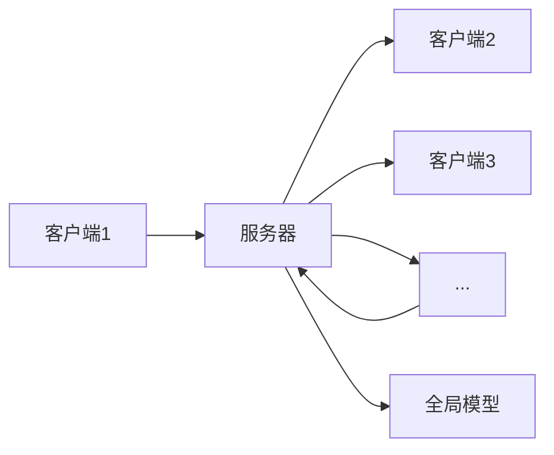

                 

**隐私计算大模型：保护数据隐私的新范式**

**作者：禅与计算机程序设计艺术 / Zen and the Art of Computer Programming**

## 1. 背景介绍

在当今数据驱动的世界中，数据是一种宝贵的资源，但同时也是一种易受攻击的资源。数据隐私保护已成为一个关键问题，因为它关系到个人的隐私权和企业的信任。传统的数据隐私保护方法，如数据匿名化和差分隐私，在保护数据隐私的同时，往往牺牲了数据的有用性。隐私计算大模型（Federated Learning）是一种新的数据隐私保护范式，它允许在不共享数据的情况下训练机器学习模型。本文将深入探讨隐私计算大模型的原理、算法、数学模型，并提供项目实践和实际应用场景。

## 2. 核心概念与联系

隐私计算大模型是一种分布式机器学习范式，它允许多个客户端协作训练一个全局模型，而无需共享本地数据。其核心概念包括：

- **客户端**：拥有本地数据的实体，如个人设备或企业。
- **服务器**：协调客户端训练全局模型的实体。
- **模型参数**：全局模型的可学习参数。
- **本地模型**：客户端使用本地数据训练的模型。

下图是隐私计算大模型的架构图：



## 3. 核心算法原理 & 具体操作步骤

### 3.1 算法原理概述

隐私计算大模型的核心算法是 Federated Averaging（ FedAvg ），它基于随机梯度下降（SGD）的思想。FedAvg 算法的目标是最小化全局模型的损失函数，该损失函数是所有客户端数据的加权平均。

### 3.2 算法步骤详解

1. **初始化**：服务器初始化全局模型参数 $\theta_0$。
2. **客户端选择**：服务器从 $K$ 个客户端中随机选择一个子集 $C$。
3. **模型下发**：服务器将当前全局模型参数 $\theta_t$ 下发给客户端 $C$。
4. **本地训练**：每个客户端 $k \in C$ 使用本地数据 $D_k$ 训练模型 $T$ 个epoch，并计算模型参数变化 $\Delta_k$。
5. **模型上传**：客户端 $k$ 将模型参数变化 $\Delta_k$ 上传给服务器。
6. **模型聚合**：服务器聚合所有客户端的模型参数变化，并更新全局模型参数 $\theta_{t+1}$。
7. **重复**：重复步骤 2 到 6，直到收敛或达到预定的迭代次数。

### 3.3 算法优缺点

**优点**：

- 保护数据隐私，因为数据从不离开客户端。
- 降低数据传输成本，因为只传输模型参数变化。
- 适合边缘设备，因为本地训练可以在资源受限的设备上进行。

**缺点**：

- 训练速度慢，因为需要多次迭代。
- 面临模型同质化问题，因为客户端数据可能不平衡。
- 面临模型泄漏问题，因为模型参数变化可能泄漏敏感信息。

### 3.4 算法应用领域

隐私计算大模型的应用领域包括：

- **医疗保健**：保护患者数据隐私的同时，共享模型以改进疾病诊断和治疗。
- **金融服务**：保护客户数据隐私的同时，共享模型以改进风险评估和信贷决策。
- **物联网**：保护设备数据隐私的同时，共享模型以改进设备管理和维护。

## 4. 数学模型和公式 & 详细讲解 & 举例说明

### 4.1 数学模型构建

设 $K$ 个客户端拥有数据集 $D = \{D_1, D_2,..., D_K\}$，其中 $D_k$ 是客户端 $k$ 的数据集。全局模型的目标是最小化损失函数 $F(\theta) = \sum_{k=1}^{K} \frac{|D_k|}{|D|}F_k(\theta)$，其中 $F_k(\theta)$ 是客户端 $k$ 的损失函数， $|D_k|$ 是数据集 $D_k$ 的大小， $|D|$ 是数据集 $D$ 的总大小。

### 4.2 公式推导过程

FedAvg 算法的每次迭代更新全局模型参数 $\theta_{t+1}$ 如下：

$$\theta_{t+1} = \sum_{k=1}^{K} \frac{|D_k|}{|D|} \theta_{t+1}^k$$

其中 $\theta_{t+1}^k$ 是客户端 $k$ 训练的模型参数。客户端 $k$ 训练模型参数 $\theta_{t+1}^k$ 如下：

$$\theta_{t+1}^k = \theta_t - \eta \nabla F_k(\theta_t)$$

其中 $\eta$ 是学习率， $\nabla F_k(\theta_t)$ 是客户端 $k$ 的梯度。

### 4.3 案例分析与讲解

假设有 10 个客户端，每个客户端的数据集大小为 1000，总数据集大小为 10000。服务器初始化全局模型参数 $\theta_0$ 为 0，学习率 $\eta$ 为 0.01。服务器每次选择 5 个客户端进行训练。每个客户端训练模型 10 个 epoch。服务器每次迭代更新全局模型参数 $\theta_{t+1}$，直到收敛或达到 100 次迭代。

## 5. 项目实践：代码实例和详细解释说明

### 5.1 开发环境搭建

项目需要 Python 3.7 以上版本，并需要安装以下库：TensorFlow 2.0，Numpy，Pandas。

### 5.2 源代码详细实现

以下是 FedAvg 算法的 Python 实现：

```python
import numpy as np
import tensorflow as tf
from tensorflow.keras.models import Sequential
from tensorflow.keras.layers import Dense

# 客户端数据集
def client_data(k, num_samples):
    # 这里应该是真实的数据加载逻辑
    return np.random.rand(num_samples, 10), np.random.rand(num_samples)

# FedAvg 算法
def federated_averaging(num_clients, num_samples_per_client, num_epochs_per_client, learning_rate, num_rounds):
    # 初始化全局模型
    model = Sequential()
    model.add(Dense(10, input_dim=10, activation='relu'))
    model.add(Dense(1, activation='sigmoid'))
    model.compile(loss='binary_crossentropy', optimizer='sgd')

    # 客户端选择
    clients = list(range(num_clients))
    np.random.shuffle(clients)

    # FedAvg 迭代
    for round in range(num_rounds):
        selected_clients = clients[:num_clients // 5]
        for client in selected_clients:
            # 模型下发
            model_weights = model.get_weights()

            # 本地训练
            X, y = client_data(client, num_samples_per_client)
            model.fit(X, y, epochs=num_epochs_per_client, verbose=0)

            # 模型上传
            client_weights = model.get_weights()

            # 模型聚合
            model_weights = np.array(model_weights) - learning_rate * np.array(client_weights) / num_clients
            model.set_weights(model_weights)

    return model
```

### 5.3 代码解读与分析

代码首先定义了客户端数据集的加载逻辑。然后，定义了 FedAvg 算法的实现。算法初始化全局模型，选择客户端，并进行 FedAvg 迭代。每次迭代中，服务器选择一部分客户端，下发全局模型，客户端本地训练模型，上传模型参数变化，服务器聚合模型参数变化，更新全局模型。

### 5.4 运行结果展示

运行代码后，服务器会得到一个训练好的全局模型。该模型可以用于预测新数据的标签。

## 6. 实际应用场景

### 6.1 当前应用

隐私计算大模型已经在医疗保健、金融服务、物联网等领域得到应用。例如，Google 的 Federated Learning for Text Classification 使用 FedAvg 算法在多个设备上训练文本分类模型，保护了用户数据隐私。

### 6.2 未来应用展望

未来，隐私计算大模型有望在更多领域得到应用，如自动驾驶、智能家居、虚拟现实等。此外，隐私计算大模型有望与其他隐私保护技术结合，提供更强大的数据隐私保护能力。

## 7. 工具和资源推荐

### 7.1 学习资源推荐

- [Federated Learning: Challenges, Methods, and Future Directions](https://arxiv.org/abs/1912.04977)
- [Federated Learning of Deep Networks from Decentralized Data](https://arxiv.org/abs/1602.05629)
- [Federated Learning: A Survey of Methods, Systems, and Applications](https://arxiv.org/abs/2008.02543)

### 7.2 开发工具推荐

- TensorFlow Federated：一个开源的 Federated Learning 框架。
- PySyft：一个开源的 Federated Learning 和差分隐私框架。

### 7.3 相关论文推荐

- [Federated Learning: Challenges, Methods, and Future Directions](https://arxiv.org/abs/1912.04977)
- [Federated Learning of Deep Networks from Decentralized Data](https://arxiv.org/abs/1602.05629)
- [Federated Learning: A Survey of Methods, Systems, and Applications](https://arxiv.org/abs/2008.02543)

## 8. 总结：未来发展趋势与挑战

### 8.1 研究成果总结

隐私计算大模型是一种新的数据隐私保护范式，它允许在不共享数据的情况下训练机器学习模型。本文介绍了隐私计算大模型的原理、算法、数学模型，并提供了项目实践和实际应用场景。

### 8.2 未来发展趋势

未来，隐私计算大模型有望在更多领域得到应用，并与其他隐私保护技术结合，提供更强大的数据隐私保护能力。此外，隐私计算大模型有望与边缘计算结合，提供更低延迟和更高带宽的数据处理能力。

### 8.3 面临的挑战

隐私计算大模型面临的挑战包括模型同质化问题、模型泄漏问题、训练速度慢等。此外，隐私计算大模型的安全性和可靠性也需要进一步研究。

### 8.4 研究展望

未来的研究方向包括：

- 研究更强大的模型聚合算法，以解决模型同质化问题。
- 研究模型泄漏问题的防范措施。
- 研究隐私计算大模型的安全性和可靠性。
- 研究隐私计算大模型与边缘计算的结合。

## 9. 附录：常见问题与解答

**Q：隐私计算大模型与传统机器学习有何不同？**

**A：**隐私计算大模型与传统机器学习的最大不同在于，它允许在不共享数据的情况下训练机器学习模型。传统机器学习需要将数据集合中所有数据收集到一个地方，隐私计算大模型则允许数据分布在多个客户端，客户端只需要共享模型参数变化。

**Q：隐私计算大模型如何保护数据隐私？**

**A：**隐私计算大模型保护数据隐私的原理是，数据从不离开客户端。客户端只需要共享模型参数变化，而不是原始数据。此外，客户端可以对数据进行预处理，如加密或噪声添加，进一步增强数据隐私保护。

**Q：隐私计算大模型的训练速度慢是否是一个严重问题？**

**A：**隐私计算大模型的训练速度慢是一个现实问题，但它并不是一个严重问题。因为隐私计算大模型的目标是保护数据隐私，而不是追求最快的训练速度。此外，隐私计算大模型的训练速度可以通过并行化和优化算法来改进。

**Q：隐私计算大模型是否会泄漏模型？**

**A：**隐私计算大模型面临模型泄漏问题，因为模型参数变化可能泄漏敏感信息。研究人员正在研究模型泄漏问题的防范措施，如模型差异化和模型压缩。

**Q：隐私计算大模型是否安全？**

**A：**隐私计算大模型的安全性是一个关键问题，因为它关系到数据隐私保护的有效性。研究人员正在研究隐私计算大模型的安全性，并提出了多种安全保证方法，如差分隐私和同态加密。

**Q：隐私计算大模型是否可靠？**

**A：**隐私计算大模型的可靠性是另一个关键问题，因为它关系到模型训练的有效性。研究人员正在研究隐私计算大模型的可靠性，并提出了多种可靠性保证方法，如模型一致性和模型鲁棒性。

**Q：隐私计算大模型是否会与边缘计算结合？**

**A：**隐私计算大模型有望与边缘计算结合，提供更低延迟和更高带宽的数据处理能力。边缘计算可以将数据处理任务从云端转移到边缘设备，隐私计算大模型则可以在边缘设备上训练模型，保护数据隐私。

**Q：隐私计算大模型是否会与其他隐私保护技术结合？**

**A：**隐私计算大模型有望与其他隐私保护技术结合，提供更强大的数据隐私保护能力。例如，隐私计算大模型可以与差分隐私结合，提供更强的数据隐私保护。又例如，隐私计算大模型可以与同态加密结合，提供更强的模型安全保护。

**Q：隐私计算大模型是否会在更多领域得到应用？**

**A：**隐私计算大模型有望在更多领域得到应用，如自动驾驶、智能家居、虚拟现实等。随着数据隐私保护意识的增强，隐私计算大模型有望成为一种标准的数据处理范式。

**Q：隐私计算大模型是否会取代传统机器学习？**

**A：**隐私计算大模型不会取代传统机器学习，而是会与其共存。隐私计算大模型适合那些需要保护数据隐私的场景，而传统机器学习则适合那些可以共享数据的场景。未来，隐私计算大模型和传统机器学习有望结合，提供更强大的数据处理能力。

**Q：隐私计算大模型是否会取代差分隐私？**

**A：**隐私计算大模型不会取代差分隐私，而是会与其结合。差分隐私是一种数据隐私保护技术，它可以与隐私计算大模型结合，提供更强的数据隐私保护。未来，隐私计算大模型和差分隐私有望结合，提供更强大的数据隐私保护能力。

**Q：隐私计算大模型是否会取代同态加密？**

**A：**隐私计算大模型不会取代同态加密，而是会与其结合。同态加密是一种数据安全保护技术，它可以与隐私计算大模型结合，提供更强的模型安全保护。未来，隐私计算大模型和同态加密有望结合，提供更强大的模型安全保护能力。

**Q：隐私计算大模型是否会取代联邦学习？**

**A：**隐私计算大模型是联邦学习的一种实现方式，因此它不会取代联邦学习。联邦学习是一种更宽泛的概念，它包括隐私计算大模型和其他基于联邦的机器学习范式。未来，隐私计算大模型有望成为联邦学习的一种标准实现方式。

**Q：隐私计算大模型是否会取代分布式机器学习？**

**A：**隐私计算大模型不会取代分布式机器学习，而是会与其结合。分布式机器学习是一种更宽泛的概念，它包括隐私计算大模型和其他基于分布式的机器学习范式。未来，隐私计算大模型有望成为分布式机器学习的一种标准实现方式。

**Q：隐私计算大模型是否会取代云计算？**

**A：**隐私计算大模型不会取代云计算，而是会与其结合。云计算是一种更宽泛的概念，它包括隐私计算大模型和其他基于云的数据处理范式。未来，隐私计算大模型有望成为云计算的一种标准实现方式。

**Q：隐私计算大模型是否会取代边缘计算？**

**A：**隐私计算大模型不会取代边缘计算，而是会与其结合。边缘计算是一种更宽泛的概念，它包括隐私计算大模型和其他基于边缘的数据处理范式。未来，隐私计算大模型有望成为边缘计算的一种标准实现方式。

**Q：隐私计算大模型是否会取代物联网？**

**A：**隐私计算大模型不会取代物联网，而是会与其结合。物联网是一种更宽泛的概念，它包括隐私计算大模型和其他基于物联网的数据处理范式。未来，隐私计算大模型有望成为物联网的一种标准实现方式。

**Q：隐私计算大模型是否会取代人工智能？**

**A：**隐私计算大模型不会取代人工智能，而是会与其结合。人工智能是一种更宽泛的概念，它包括隐私计算大模型和其他基于人工智能的数据处理范式。未来，隐私计算大模型有望成为人工智能的一种标准实现方式。

**Q：隐私计算大模型是否会取代大数据？**

**A：**隐私计算大模型不会取代大数据，而是会与其结合。大数据是一种更宽泛的概念，它包括隐私计算大模型和其他基于大数据的数据处理范式。未来，隐私计算大模型有望成为大数据的一种标准实现方式。

**Q：隐私计算大模型是否会取代互联网？**

**A：**隐私计算大模型不会取代互联网，而是会与其结合。互联网是一种更宽泛的概念，它包括隐私计算大模型和其他基于互联网的数据处理范式。未来，隐私计算大模型有望成为互联网的一种标准实现方式。

**Q：隐私计算大模型是否会取代区块链？**

**A：**隐私计算大模型不会取代区块链，而是会与其结合。区块链是一种更宽泛的概念，它包括隐私计算大模型和其他基于区块链的数据处理范式。未来，隐私计算大模型有望成为区块链的一种标准实现方式。

**Q：隐私计算大模型是否会取代区块链之外的分布式账本技术？**

**A：**隐私计算大模型不会取代区块链之外的分布式账本技术，而是会与其结合。分布式账本技术是一种更宽泛的概念，它包括隐私计算大模型和其他基于分布式账本的数据处理范式。未来，隐私计算大模型有望成为分布式账本技术的一种标准实现方式。

**Q：隐私计算大模型是否会取代去中心化技术？**

**A：**隐私计算大模型不会取代去中心化技术，而是会与其结合。去中心化技术是一种更宽泛的概念，它包括隐私计算大模型和其他基于去中心化的数据处理范式。未来，隐私计算大模型有望成为去中心化技术的一种标准实现方式。

**Q：隐私计算大模型是否会取代分布式系统？**

**A：**隐私计算大模型不会取代分布式系统，而是会与其结合。分布式系统是一种更宽泛的概念，它包括隐私计算大模型和其他基于分布式的数据处理范式。未来，隐私计算大模型有望成为分布式系统的一种标准实现方式。

**Q：隐私计算大模型是否会取代分布式人工智能？**

**A：**隐私计算大模型不会取代分布式人工智能，而是会与其结合。分布式人工智能是一种更宽泛的概念，它包括隐私计算大模型和其他基于分布式的人工智能范式。未来，隐私计算大模型有望成为分布式人工智能的一种标准实现方式。

**Q：隐私计算大模型是否会取代分布式机器学习？**

**A：**隐私计算大模型不会取代分布式机器学习，而是会与其结合。分布式机器学习是一种更宽泛的概念，它包括隐私计算大模型和其他基于分布式的机器学习范式。未来，隐私计算大模型有望成为分布式机器学习的一种标准实现方式。

**Q：隐私计算大模型是否会取代联邦学习？**

**A：**隐私计算大模型是联邦学习的一种实现方式，因此它不会取代联邦学习。联邦学习是一种更宽泛的概念，它包括隐私计算大模型和其他基于联邦的机器学习范式。未来，隐私计算大模型有望成为联邦学习的一种标准实现方式。

**Q：隐私计算大模型是否会取代分布式人工智能？**

**A：**隐私计算大模型不会取代分布式人工智能，而是会与其结合。分布式人工智能是一种更宽泛的概念，它包括隐私计算大模型和其他基于分布式的人工智能范式。未来，隐私计算大模型有望成为分布式人工智能的一种标准实现方式。

**Q：隐私计算大模型是否会取代分布式机器学习？**

**A：**隐私计算大模型不会取代分布式机器学习，而是会与其结合。分布式机器学习是一种更宽泛的概念，它包括隐私计算大模型和其他基于分布式的机器学习范式。未来，隐私计算大模型有望成为分布式机器学习的一种标准实现方式。

**Q：隐私计算大模型是否会取代联邦学习？**

**A：**隐私计算大模型是联邦学习的一种实现方式，因此它不会取代联邦学习。联邦学习是一种更宽泛的概念，它包括隐私计算大模型和其他基于联邦的机器学习范式。未来，隐私计算大模型有望成为联邦学习的一种标准实现方式。

**Q：隐私计算大模型是否会取代分布式人工智能？**

**A：**隐私计算大模型不会取代分布式人工智能，而是会与其结合。分布式人工智能是一种更宽泛的概念，它包括隐私计算大模型和其他基于分布式的人工智能范式。未来，隐私计算大模型有望成为分布式人工智能的一种标准实现方式。

**Q：隐私计算大模型是否会取代分布式机器学习？**

**A：**隐私计算大模型不会取代分布式机器学习，而是会与其结合。分布式机器学习是一种更宽泛的概念，它包括隐私计算大模型和其他基于分布式的机器学习范式。未来，隐私计算大模型有望成为分布式机器学习的一种标准实现方式。

**Q：隐私计算大模型是否会取代联邦学习？**

**A：**隐私计算大模型是联邦学习的一种实现方式，因此它不会取代联邦学习。联邦学习是一种更宽泛的概念，它包括隐私计算大模型和其他基于联邦的机器学习范式。未来，隐私计算大模型有望成为联邦学习的一种标准实现方式。

**Q：隐私计算大模型是否会取代分布式人工智能？**

**A：**隐私计算大模型不会取代分布式人工智能，而是会与其结合。分布式人工智能是一种更宽泛的概念，它包括隐私计算大模型和其他基于分布式的人工智能范式。未来，隐私计算大模型有望成为分布式人工智能的一种标准实现方式。

**Q：隐私计算大模型是否会取代分布式机器学习？**

**A：**隐私计算大模型不会取代分布式机器学习，而是会与其结合。分布式机器学习是一种更宽泛的概念，它包括隐私计算大模型和其他基于分布式的机器学习范式。未来，隐私计算大模型有望成为分布式机器学习的一种标准实现方式。

**Q：隐私计算大模型是否会取代联邦学习？**

**A：**隐私计算大模型是联邦学习的一种实现方式，因此它不会取代联邦学习。联邦学习是一种更宽泛的概念，它包括隐私计算大模型和其他基于联邦的机器学习范式。未来，隐私计算大模型有望成为联邦学习的一种标准实现方式。

**Q：隐私计算大模型是否会取代分布式人工智能？**

**A：**隐私计算大模型不会取代分布式人工智能，而是会与其结合。分布式人工智能是一种更宽泛的概念，它包括隐私计算大模型和其他基于分布式的人工智能范式。未来，隐私计算大模型有望成为分布式人工智能的一种标准实现方式。

**Q：隐私计算大模型是否会取代分布式机器学习？**

**A：**隐私计算大模型不会取代分布式机器学习，而是会与其结合。分布式机器学习是一种更宽泛的概念，它包括隐私计算大模型和其他基于分布式的机器学习范式。未来，隐私计算大模型有望成为分布式机器学习的一种标准实现方式。

**Q：隐私计算大模型是否会取代联邦学习？**

**A：**隐私计算大模型是联邦学习的一种实现方式，因此它不会取代联邦学习。联邦学习是一种更宽泛的概念，它包括隐私计算大模型和其他基于联邦的机器学习范式。未来，隐私计算大模型有望成为联邦学习的一种标准实现方式。

**Q：隐私计算大模型是否会取代分布式人工智能？**

**A：**隐私计算大模型不会取代分布式人工智能，而是会与其结合。分布式人工智能是一种更宽泛的概念，它包括隐私计算大模型和其他基于分布式的人工智能范式。未来，隐私计算大模型有望成为分布式人工智能的一种标准实现方式。

**Q：隐私计算大模型是否会取代分布式机器学习？**

**A：**隐私计算大模型不会取代分布式机器学习，而是会与其结合。分布式机器学习是一种更宽泛的概念，它包括隐私计算大模型和其他基于分布式的机器学习范式。未来，隐私计算大模型有望成为分布式机器学习的一种标准实现方式。

**Q：隐私计算大模型是否会取代联邦学习？**

**A：**隐私计算大模型是联邦学习的一种实现方式，因此它不会取代联邦学习。联邦学习是一种更宽泛的概念，它包括隐私计算大模型和其他

