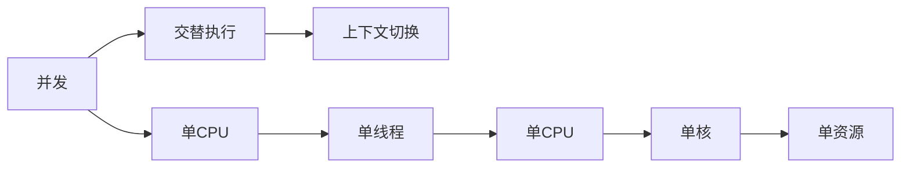
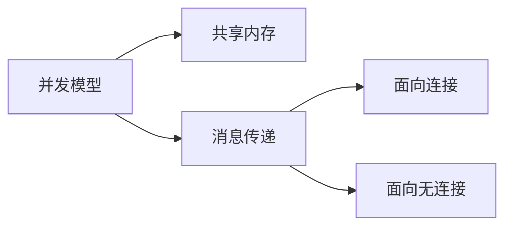
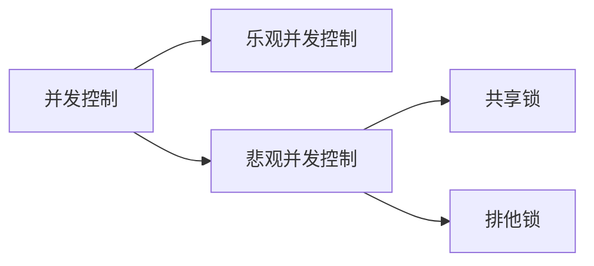

                 

## 1. 背景介绍

在互联网时代，高并发系统设计已成为一项关键技术，以应对大规模用户访问。随着移动互联网、物联网和人工智能等技术的发展，用户数量和访问频率呈指数级增长，对系统的并发处理能力提出了更高的要求。本文将深入探讨高并发系统设计的核心概念、算法原理、数学模型、项目实践，并提供实际应用场景、工具和资源推荐，以及对未来发展趋势和挑战的总结。

## 2. 核心概念与联系

### 2.1 并发与并行

并发（Concurrency）和并行（Parallelism）是高并发系统设计的基础概念。并发指的是在同一时间段内，多个任务交替执行，而并行则指的是同时执行多个任务。二者的区别在于资源利用方式和系统开销。



### 2.2 并发模型

并发模型描述了系统如何管理并发任务。常见的并发模型包括：

- **共享内存模型（Shared Memory）**：多个任务共享同一内存空间，通过同步机制（如锁、信号量）控制对共享资源的访问。
- **消息传递模型（Message Passing）**：任务通过消息传递进行通信，每个任务有自己的内存空间。消息传递模型进一步分为：
  - **面向连接的消息传递（Connected）**：任务之间建立连接后进行通信。
  - **面向无连接的消息传递（Connectionless）**：任务之间不建立连接，直接发送消息。



### 2.3 并发控制

并发控制（Concurrency Control）是并发系统的关键组成部分，用于维护数据一致性和并发安全。常见的并发控制机制包括：

- **乐观并发控制（Optimistic Concurrency Control，OCC）**：在事务结束时检查是否发生了冲突，如果没有冲突则提交事务。
- **悲观并发控制（Pessimistic Concurrency Control，PCC）**：在事务执行期间防止冲突，常用的悲观锁机制包括共享锁（S-Lock）和排他锁（X-Lock）。



## 3. 核心算法原理 & 具体操作步骤

### 3.1 算法原理概述

高并发系统设计中常用的算法包括负载均衡算法、缓存算法和并发控制算法。本节将重点介绍分布式锁算法，用于实现并发控制。

### 3.2 算法步骤详解

分布式锁算法的目的是在分布式系统中实现互斥访问共享资源。常见的分布式锁算法包括：

- **基于数据库的分布式锁**：使用数据库的行锁或表锁实现分布式锁。
- **基于缓存的分布式锁**：使用缓存系统（如Redis）的原子操作实现分布式锁。
- **基于ZooKeeper的分布式锁**：利用ZooKeeper的原子广播和顺序一致性特性实现分布式锁。

### 3.3 算法优缺点

分布式锁算法的优缺点如下：

| 算法 | 优点 | 缺点 |
| --- | --- | --- |
| 基于数据库的分布式锁 | 易于实现，无需额外依赖 | 依赖数据库，性能受限 |
| 基于缓存的分布式锁 | 高性能，低延迟 | 依赖缓存系统，单点故障风险 |
| 基于ZooKeeper的分布式锁 | 可靠性高，容错性好 | 依赖ZooKeeper，复杂度高 |

### 3.4 算法应用领域

分布式锁算法广泛应用于分布式系统的并发控制，如：

- 分布式事务管理
- 分布式任务调度
- 分布式缓存管理
- 分布式数据库并发控制

## 4. 数学模型和公式 & 详细讲解 & 举例说明

### 4.1 数学模型构建

为分析高并发系统的性能，我们构建以下数学模型：

- **请求到达模型**：使用泊松分布描述请求到达的随机性。
- **服务时间模型**：使用指数分布描述服务时间。
- **系统模型**：使用M/M/c/K模型描述系统的性能，其中M表示泊松分布，c表示服务器数量，K表示系统容量。

### 4.2 公式推导过程

假设请求到达率为λ，服务时间为μ，服务器数量为c，系统容量为K。则系统的利用率ρ可以表示为：

$$
\rho = \frac{\lambda}{c\mu}
$$

系统的吞吐量T可以表示为：

$$
T = \lambda(1 - \rho)
$$

系统的响应时间R可以表示为：

$$
R = \frac{1}{\mu(1 - \rho)}
$$

### 4.3 案例分析与讲解

假设一个高并发系统有10个服务器，请求到达率为1000个请求/秒，服务时间为0.1秒。则系统的利用率为：

$$
\rho = \frac{1000}{10 \times 100} = 0.1
$$

系统的吞吐量为：

$$
T = 1000 \times (1 - 0.1) = 900 \text{个请求/秒}
$$

系统的响应时间为：

$$
R = \frac{1}{100 \times (1 - 0.1)} = 1 \text{秒}
$$

## 5. 项目实践：代码实例和详细解释说明

### 5.1 开发环境搭建

本项目使用Java语言，Maven构建工具，并依赖Spring Boot框架。开发环境包括：

- Java 8+
- Maven 3+
- Spring Boot 2+
- Redis 5+

### 5.2 源代码详细实现

以下是基于Redis实现分布式锁的示例代码：

```java
import org.springframework.data.redis.core.StringRedisTemplate;
import org.springframework.data.redis.core.ValueOperations;

import java.util.concurrent.TimeUnit;

public class DistributedLock {

    private final StringRedisTemplate redisTemplate;
    private final String lockKey;
    private final long lockExpirationMs;
    private final long lockAcquisitionTimeoutMs;

    public DistributedLock(StringRedisTemplate redisTemplate, String lockKey, long lockExpirationMs, long lockAcquisitionTimeoutMs) {
        this.redisTemplate = redisTemplate;
        this.lockKey = lockKey;
        this.lockExpirationMs = lockExpirationMs;
        this.lockAcquisitionTimeoutMs = lockAcquisitionTimeoutMs;
    }

    public boolean tryLock() {
        ValueOperations<String, String> operations = redisTemplate.opsForValue();
        long end = System.currentTimeMillis() + lockAcquisitionTimeoutMs;
        while (System.currentTimeMillis() < end) {
            if (operations.setIfAbsent(lockKey, "1", lockExpirationMs, TimeUnit.MILLISECONDS)) {
                return true;
            }
            try {
                Thread.sleep(1);
            } catch (InterruptedException e) {
                Thread.currentThread().interrupt();
            }
        }
        return false;
    }

    public void unlock() {
        redisTemplate.delete(lockKey);
    }
}
```

### 5.3 代码解读与分析

`DistributedLock`类使用Redis的`setIfAbsent`原子操作实现分布式锁。`tryLock`方法尝试获取锁，如果锁已被占用，则使用自旋等待，最多等待`lockAcquisitionTimeoutMs`毫秒。`unlock`方法用于释放锁。

### 5.4 运行结果展示

在实际运行中，分布式锁可以有效防止并发冲突，保证系统的数据一致性。通过监控 Redis 的锁的数量和持有时间，可以分析系统的并发情况和锁的利用率。

## 6. 实际应用场景

### 6.1 电商系统

在电商系统中，分布式锁可以用于防止并发修改同一商品的库存，保证库存的准确性。例如，在下单时，需要先获取分布式锁，然后检查库存，如果库存足够，则扣减库存并下单；如果库存不足，则释放锁并提示用户库存不足。

### 6.2 金融系统

在金融系统中，分布式锁可以用于防止并发修改同一账户的余额，保证账户余额的准确性。例如，在转账时，需要先获取分布式锁，然后检查余额，如果余额足够，则扣减余额并转账；如果余额不足，则释放锁并提示用户余额不足。

### 6.3 未来应用展望

随着分布式系统的发展，分布式锁将越来越广泛地应用于各种场景，如分布式事务管理、分布式任务调度和分布式缓存管理等。此外，分布式锁的实现也将越来越智能化，如支持动态锁过期时间、支持锁续期等。

## 7. 工具和资源推荐

### 7.1 学习资源推荐

- **书籍**
  - "高并发服务器设计"（淘宝技术团队）
  - "分布式系统设计"（布莱恩·戈特曼）
- **在线课程**
  - Coursera - "分布式系统设计"（斯坦福大学）
  - Udacity - "分布式系统"（Google）
- **博客**
  - [高并发之道](https://www.hightraffic.io/)
  - [分布式系统设计](https://dist-sys-design.com/)

### 7.2 开发工具推荐

- **缓存系统**
  - Redis
  - Memcached
- **分布式协调系统**
  - ZooKeeper
  - etcd
- **分布式事务管理系统**
  - Seata
  - Spring Cloud Alibaba

### 7.3 相关论文推荐

- "Distributed Locking: A Survey"（IEEE）
- "Consistent Hashing and Random Trees: Distributed Caching Protocols for Relieving Hot Spots on the World Wide Web"（ACM）
- "The Chubby Lock Service for Loosely-Coupled Distributed Systems"（Google）

## 8. 总结：未来发展趋势与挑战

### 8.1 研究成果总结

本文介绍了高并发系统设计的核心概念、算法原理、数学模型、项目实践，并提供了实际应用场景、工具和资源推荐。通过分析和实践，我们可以有效地设计和实现高并发系统，应对大规模用户访问。

### 8.2 未来发展趋势

未来，高并发系统设计将面临更大的挑战，如：

- **更大规模的用户访问**：随着移动互联网、物联网和人工智能等技术的发展，用户数量和访问频率呈指数级增长。
- **更复杂的系统架构**：分布式系统的规模和复杂性不断增加，对系统设计和管理提出了更高的要求。
- **更严格的性能和可靠性要求**：用户对系统性能和可靠性的要求不断提高，对系统设计提出了更高的标准。

### 8.3 面临的挑战

未来，高并发系统设计面临的挑战包括：

- **系统可扩展性**：如何设计和实现可扩展的高并发系统，以应对不断增长的用户访问量。
- **系统可靠性**：如何设计和实现高可靠性的高并发系统，以保证系统的连续性和可用性。
- **系统性能**：如何设计和实现高性能的高并发系统，以满足用户对响应时间的要求。

### 8.4 研究展望

未来，高并发系统设计的研究方向包括：

- **弹性系统设计**：研究如何设计和实现弹性系统，以应对不断变化的负载和故障。
- **自适应系统设计**：研究如何设计和实现自适应系统，以根据系统的运行状态动态调整系统参数。
- **分布式事务管理**：研究如何设计和实现分布式事务管理系统，以保证分布式系统的数据一致性。

## 9. 附录：常见问题与解答

**Q1：什么是高并发系统设计？**

高并发系统设计是指设计和实现能够应对大规模用户访问的系统。高并发系统需要处理大量并发请求，并保证系统的性能、可靠性和一致性。

**Q2：什么是分布式锁？**

分布式锁是一种并发控制机制，用于在分布式系统中实现互斥访问共享资源。分布式锁允许多个进程或线程并发执行，但只允许一个进程或线程访问共享资源。

**Q3：什么是并发控制？**

并发控制是并发系统的关键组成部分，用于维护数据一致性和并发安全。并发控制机制包括乐观并发控制和悲观并发控制。

**Q4：什么是并发与并行？**

并发指的是在同一时间段内，多个任务交替执行，而并行则指的是同时执行多个任务。二者的区别在于资源利用方式和系统开销。

**Q5：什么是并发模型？**

并发模型描述了系统如何管理并发任务。常见的并发模型包括共享内存模型和消息传递模型。

## 作者：禅与计算机程序设计艺术 / Zen and the Art of Computer Programming

