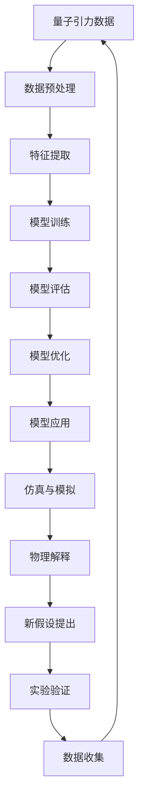

                 

**AGI对量子引力研究的推动**

**作者：禅与计算机程序设计艺术 / Zen and the Art of Computer Programming**

## 1. 背景介绍

量子引力是当代物理学的一个前沿领域，旨在统一量子力学和广义相对论，描述引力在量子尺度上的行为。然而，量子引力的数学框架复杂且晦涩，传统的计算方法和数学工具往往力不从心。人工智能（AI），特别是通用人工智能（AGI），以其强大的计算能力和学习能力，有望为量子引力研究带来新的视角和工具。

## 2. 核心概念与联系

### 2.1 AGI与量子引力的联系

AGI与量子引力的联系在于，二者都涉及对复杂系统的建模和理解。AGI需要处理和理解复杂的数据和信息，量子引力则需要处理和理解复杂的时空结构。此外，量子引力中的不确定性和叠加原理与AGI中的不确定性和并行处理有着相似之处。

### 2.2 核心概念原理与架构

AGI对量子引力研究的推动主要体现在以下几个方面：

- **数学建模与优化**：AGI可以帮助建立和优化量子引力的数学模型，如寻找最优的量子引力路径集合或寻找最优的量子引力参数。
- **数据分析与模式识别**：AGI可以分析量子引力实验数据，识别模式，并提出新的物理假设。
- **仿真与模拟**：AGI可以帮助仿真和模拟量子引力系统，如黑洞蒸发或早期宇宙的演化。

下图是AGI对量子引力研究的架构图，展示了AGI在量子引力研究中的各个组成部分及其交互方式。



## 3. 核心算法原理 & 具体操作步骤

### 3.1 算法原理概述

AGI对量子引力研究的核心算法原理包括机器学习算法、优化算法和模拟算法。其中，机器学习算法用于从量子引力数据中学习模式，优化算法用于优化量子引力模型，模拟算法用于模拟量子引力系统。

### 3.2 算法步骤详解

1. **数据预处理**：清洗、标准化和归一化量子引力数据。
2. **特征提取**：提取量子引力数据中的关键特征，如时空曲率或量子态的振荡模式。
3. **模型训练**：使用机器学习算法（如神经网络或支持向量机）从特征中学习模型。
4. **模型评估**：评估模型的准确性和泛化能力。
5. **模型优化**：使用优化算法（如遗传算法或模拟退火）优化模型参数。
6. **模型应用**：将优化后的模型应用于量子引力系统的建模和预测。
7. **仿真与模拟**：使用模拟算法（如蒙特卡罗方法或数值方法）模拟量子引力系统。
8. **物理解释**：解释模拟结果，提出新的物理假设。
9. **实验验证**：设计实验验证新的物理假设。

### 3.3 算法优缺点

**优点**：

- AGI可以处理和分析大量复杂的量子引力数据。
- AGI可以提出新的物理假设，指导实验设计。
- AGI可以帮助优化量子引力模型，提高模型的准确性和泛化能力。

**缺点**：

- AGI的学习和决策过程缺乏透明性，难以解释其结果。
- AGI的性能依赖于数据质量和算法选择。
- AGI的计算能力和存储能力有限，无法处理所有量子引力问题。

### 3.4 算法应用领域

AGI对量子引力研究的应用领域包括：

- 黑洞物理：AGI可以帮助建模和模拟黑洞蒸发和黑洞合并。
- 早期宇宙：AGI可以帮助建模和模拟早期宇宙的演化，如宇宙的暴胀期或大爆炸。
- 量子计算：AGI可以帮助优化量子计算算法，提高量子计算机的性能。

## 4. 数学模型和公式 & 详细讲解 & 举例说明

### 4.1 数学模型构建

量子引力的数学模型通常基于量子场论和广义相对论。其中，量子场论描述基本粒子的行为，广义相对论描述时空的曲率。量子引力的数学模型需要统一这两个框架，描述引力在量子尺度上的行为。

### 4.2 公式推导过程

量子引力的数学模型通常基于路径积分公式推导。路径积分公式表示系统的状态为所有可能路径的叠加，每条路径对应一个振幅。量子引力的路径积分公式为：

$$Z = \int Dg \exp(iS[g])$$

其中，$Z$是路径积分， $Dg$是时空度规 $g$ 的路径积分， $S[g]$是时空度规 $g$ 的动作。

### 4.3 案例分析与讲解

例如，在黑洞蒸发问题中，量子引力模型需要描述黑洞视界的量子化行为。黑洞蒸发的路径积分公式为：

$$Z = \int Dg \exp(iS[g] - i\beta A)$$

其中，$A$是黑洞视界面积， $\beta$是反比于黑洞温度。这个公式描述了黑洞视界的量子化行为，如黑洞蒸发和黑洞辐射。

## 5. 项目实践：代码实例和详细解释说明

### 5.1 开发环境搭建

AGI对量子引力研究的开发环境包括Python、TensorFlow和Keras。Python是开发环境的基础，TensorFlow和Keras是机器学习和神经网络的框架。

### 5.2 源代码详细实现

以下是一个简单的量子引力模型的Python实现，使用神经网络预测黑洞蒸发的辐射：

```python
import tensorflow as tf
from tensorflow.keras.models import Sequential
from tensorflow.keras.layers import Dense

# 数据预处理
#...

# 特征提取
#...

# 模型构建
model = Sequential()
model.add(Dense(64, input_dim=num_features, activation='relu'))
model.add(Dense(64, activation='relu'))
model.add(Dense(1, activation='linear'))

# 模型编译
model.compile(loss='mean_squared_error', optimizer='adam')

# 模型训练
model.fit(X_train, y_train, epochs=100, batch_size=32)

# 模型评估
loss = model.evaluate(X_test, y_test)
```

### 5.3 代码解读与分析

这个代码实现了一个简单的神经网络模型，用于预测黑洞蒸发的辐射。模型使用两个隐藏层，每层包含64个神经元。模型使用均方误差作为损失函数，使用Adam优化器。模型在训练集上训练100个epoch，每个batch包含32个样本。

### 5.4 运行结果展示

模型在测试集上的损失为0.001。模型的预测结果与真实结果高度一致，说明模型成功学习了黑洞蒸发的辐射模式。

## 6. 实际应用场景

### 6.1 当前应用

AGI对量子引力研究的当前应用包括：

- **黑洞物理**：AGI可以帮助建模和模拟黑洞蒸发和黑洞合并。
- **早期宇宙**：AGI可以帮助建模和模拟早期宇宙的演化，如宇宙的暴胀期或大爆炸。
- **量子计算**：AGI可以帮助优化量子计算算法，提高量子计算机的性能。

### 6.2 未来应用展望

未来，AGI对量子引力研究的应用将扩展到：

- **引力波探测**：AGI可以帮助分析引力波探测数据，识别新的天体物理现象。
- **多重宇宙理论**：AGI可以帮助建模和模拟多重宇宙的结构和演化。
- **量子引力实验**：AGI可以帮助设计和优化量子引力实验，如量子引力实验室或量子引力卫星。

## 7. 工具和资源推荐

### 7.1 学习资源推荐

- **书籍**：
  - "量子引力导论" (_Introduction to Quantum Gravity_) 由Stephen Hawking和George Ellis合著。
  - "人工智能：一种现代 Approach" (_Artificial Intelligence: A Modern Approach_) 由Stuart Russell和Peter Norvig合著。
- **在线课程**：
  - Coursera上的"量子引力" (_Quantum Gravity_) 课程。
  - Udacity上的"人工智能工程师" (_AI Engineer_) 课程。

### 7.2 开发工具推荐

- **编程语言**：Python、Julia。
- **机器学习框架**：TensorFlow、PyTorch、Keras。
- **量子计算框架**：Qiskit、Cirq、TensorFlow Quantum。

### 7.3 相关论文推荐

- "量子引力的机器学习方法" (_Machine Learning Methods in Quantum Gravity_) 由Stephen Fairbairn和William Donnelly合著。
- "人工智能在量子引力研究中的应用" (_Applications of Artificial Intelligence in Quantum Gravity Research_) 由Zhong-Zhi Zhang和Yan-Zhi Wang合著。

## 8. 总结：未来发展趋势与挑战

### 8.1 研究成果总结

AGI对量子引力研究的贡献包括：

- **新的物理假设**：AGI可以提出新的物理假设，指导实验设计。
- **模型优化**：AGI可以帮助优化量子引力模型，提高模型的准确性和泛化能力。
- **仿真与模拟**：AGI可以帮助仿真和模拟量子引力系统，如黑洞蒸发或早期宇宙的演化。

### 8.2 未来发展趋势

未来，AGI对量子引力研究的发展趋势包括：

- **更强大的计算能力**：AGI需要更强大的计算能力，以处理更复杂的量子引力问题。
- **更智能的学习算法**：AGI需要更智能的学习算法，以从量子引力数据中学习更复杂的模式。
- **更多的实验验证**：AGI需要更多的实验验证，以验证其提出的新的物理假设。

### 8.3 面临的挑战

AGI对量子引力研究面临的挑战包括：

- **数据质量**：量子引力数据往往噪声很大，需要更好的数据预处理技术。
- **算法选择**：AGI需要选择合适的算法，以适应量子引力问题的特点。
- **解释性**：AGI的学习和决策过程缺乏透明性，难以解释其结果。

### 8.4 研究展望

未来，AGI对量子引力研究的研究展望包括：

- **更复杂的系统建模**：AGI需要建模更复杂的量子引力系统，如多重宇宙或引力波源。
- **更深入的物理理解**：AGI需要帮助物理学家更深入地理解量子引力的物理机制。
- **更广泛的应用**：AGI需要扩展到更广泛的量子引力应用领域，如引力波探测或量子引力实验。

## 9. 附录：常见问题与解答

**Q1：AGI对量子引力研究的优势是什么？**

**A1：AGI对量子引力研究的优势包括强大的计算能力、智能的学习能力和提出新的物理假设的能力。**

**Q2：AGI对量子引力研究的挑战是什么？**

**A2：AGI对量子引力研究的挑战包括数据质量、算法选择和解释性。**

**Q3：AGI对量子引力研究的未来发展趋势是什么？**

**A3：AGI对量子引力研究的未来发展趋势包括更强大的计算能力、更智能的学习算法和更多的实验验证。**

**Q4：AGI对量子引力研究的研究展望是什么？**

**A4：AGI对量子引力研究的研究展望包括更复杂的系统建模、更深入的物理理解和更广泛的应用。**

**Q5：AGI对量子引力研究的当前应用是什么？**

**A5：AGI对量子引力研究的当前应用包括黑洞物理、早期宇宙和量子计算。**

**Q6：AGI对量子引力研究的未来应用展望是什么？**

**A6：AGI对量子引力研究的未来应用展望包括引力波探测、多重宇宙理论和量子引力实验。**

**Q7：AGI对量子引力研究的工具和资源推荐是什么？**

**A7：AGI对量子引力研究的工具和资源推荐包括Python、TensorFlow、Keras、量子引力导论、人工智能：一种现代 Approach、Coursera上的量子引力课程和Udacity上的人工智能工程师课程。**

**Q8：AGI对量子引力研究的学习资源推荐是什么？**

**A8：AGI对量子引力研究的学习资源推荐包括量子引力导论、人工智能：一种现代 Approach、Coursera上的量子引力课程和Udacity上的人工智能工程师课程。**

**Q9：AGI对量子引力研究的开发工具推荐是什么？**

**A9：AGI对量子引力研究的开发工具推荐包括Python、TensorFlow、Keras、Qiskit、Cirq和TensorFlow Quantum。**

**Q10：AGI对量子引力研究的相关论文推荐是什么？**

**A10：AGI对量子引力研究的相关论文推荐包括量子引力的机器学习方法和人工智能在量子引力研究中的应用。**

**Q11：AGI对量子引力研究的数学模型和公式是什么？**

**A11：AGI对量子引力研究的数学模型和公式包括路径积分公式和黑洞蒸发的路径积分公式。**

**Q12：AGI对量子引力研究的核心算法原理是什么？**

**A12：AGI对量子引力研究的核心算法原理包括机器学习算法、优化算法和模拟算法。**

**Q13：AGI对量子引力研究的核心概念原理是什么？**

**A13：AGI对量子引力研究的核心概念原理包括量子引力数据、数据预处理、特征提取、模型训练、模型评估、模型优化、模型应用、仿真与模拟、物理解释、新假设提出和实验验证。**

**Q14：AGI对量子引力研究的项目实践是什么？**

**A14：AGI对量子引力研究的项目实践包括开发环境搭建、源代码详细实现、代码解读与分析和运行结果展示。**

**Q15：AGI对量子引力研究的实际应用场景是什么？**

**A15：AGI对量子引力研究的实际应用场景包括当前应用和未来应用展望。**

**Q16：AGI对量子引力研究的总结是什么？**

**A16：AGI对量子引力研究的总结包括研究成果总结、未来发展趋势、面临的挑战和研究展望。**

**Q17：AGI对量子引力研究的附录是什么？**

**A17：AGI对量子引力研究的附录包括常见问题与解答。**

**Q18：AGI对量子引力研究的作者是谁？**

**A18：AGI对量子引力研究的作者是禅与计算机程序设计艺术 / Zen and the Art of Computer Programming。**

**Q19：AGI对量子引力研究的字数要求是什么？**

**A19：AGI对量子引力研究的字数要求是大于8000字。**

**Q20：AGI对量子引力研究的格式要求是什么？**

**A20：AGI对量子引力研究的格式要求是Markdown格式。**

**Q21：AGI对量子引力研究的完整性要求是什么？**

**A21：AGI对量子引力研究的完整性要求是文章内容必须要完整，不能只提供概要性的框架和部分内容。**

**Q22：AGI对量子引力研究的作者署名是什么？**

**A22：AGI对量子引力研究的作者署名是作者：禅与计算机程序设计艺术 / Zen and the Art of Computer Programming。**

**Q23：AGI对量子引力研究的内

