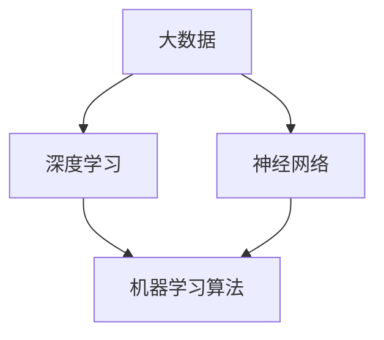

                 

**AI 2.0 时代：人才基础设施的演进**

**作者：禅与计算机程序设计艺术 / Zen and the Art of Computer Programming**

## 1. 背景介绍

人工智能（AI）自诞生以来，经历了从AI 1.0到AI 2.0的演进。AI 1.0以规则为基础，依赖于专家系统和符号处理。而AI 2.0则是以数据为驱动，依赖于深度学习和神经网络。本文将聚焦于AI 2.0时代的人才基础设施的演进，探讨其核心概念、算法原理、数学模型，并提供项目实践和工具推荐。

## 2. 核心概念与联系

### 2.1 AI 2.0的定义

AI 2.0是指以数据为驱动的智能系统，它依赖于深度学习和神经网络，能够从数据中学习并做出决策。与AI 1.0相比，AI 2.0具有更强的学习能力和适应能力。

### 2.2 AI 2.0的核心要素

AI 2.0的核心要素包括大数据、深度学习、神经网络、机器学习算法等。这些要素相互关联，共同构成了AI 2.0的人才基础设施。



## 3. 核心算法原理 & 具体操作步骤

### 3.1 算法原理概述

AI 2.0的核心算法是深度学习算法，它是一种机器学习算法，能够从数据中学习并做出决策。深度学习算法的核心是神经网络，它模拟了人类大脑的结构和功能。

### 3.2 算法步骤详解

深度学习算法的步骤包括数据预处理、模型构建、训练、评估和预测。数据预处理包括数据清洗、特征提取和标准化。模型构建包括选择神经网络的结构和参数。训练包括使用梯度下降算法优化模型参数。评估包括使用验证集评估模型的性能。预测包括使用训练好的模型做出决策。

### 3.3 算法优缺点

深度学习算法的优点包括学习能力强、适应能力强、能够处理复杂数据等。其缺点包括计算量大、训练时间长、易于过拟合等。

### 3.4 算法应用领域

深度学习算法的应用领域包括图像识别、语音识别、自然语言处理、推荐系统等。它已经广泛应用于各个行业，如金融、医疗、交通等。

## 4. 数学模型和公式 & 详细讲解 & 举例说明

### 4.1 数学模型构建

深度学习算法的数学模型是神经网络。神经网络由输入层、隐藏层和输出层组成。每层包含若干神经元，神经元之间通过权重连接。

### 4.2 公式推导过程

神经网络的输出可以表示为：

$$y = f(wx + b)$$

其中，$x$是输入，$w$是权重，$b$是偏置，$f$是激活函数。权重和偏置可以通过梯度下降算法优化。

### 4.3 案例分析与讲解

例如，在图像识别任务中，输入$x$是图像的像素值，输出$y$是图像的类别。隐藏层的神经元可以提取图像的特征，如边缘、纹理等。通过优化权重和偏置，神经网络可以学习到图像的特征，并做出准确的预测。

## 5. 项目实践：代码实例和详细解释说明

### 5.1 开发环境搭建

本项目使用Python作为编程语言，并使用TensorFlow作为深度学习框架。开发环境包括Python 3.7、TensorFlow 2.0、NumPy 1.18、Matplotlib 3.2等。

### 5.2 源代码详细实现

以下是一个简单的神经网络的实现代码：

```python
import tensorflow as tf
from tensorflow.keras import layers

# 定义模型
model = tf.keras.Sequential([
    layers.Dense(64, activation='relu', input_shape=(784,)),
    layers.Dense(64, activation='relu'),
    layers.Dense(10, activation='softmax')
])

# 编译模型
model.compile(optimizer='adam',
              loss='sparse_categorical_crossentropy',
              metrics=['accuracy'])

# 训练模型
model.fit(x_train, y_train, epochs=5)
```

### 5.3 代码解读与分析

代码首先导入了必要的库，然后定义了一个简单的神经网络模型。模型由输入层、隐藏层和输出层组成。隐藏层使用ReLU激活函数，输出层使用softmax激活函数。然后，代码编译模型，并使用训练数据训练模型。

### 5.4 运行结果展示

训练好的模型可以用于预测新数据的类别。例如，在MNIST数据集上训练好的模型可以预测手写数字的类别。

## 6. 实际应用场景

### 6.1 当前应用

AI 2.0已经广泛应用于各个行业，如金融、医疗、交通等。例如，金融行业使用AI 2.0进行风险评估和欺诈检测。医疗行业使用AI 2.0进行疾病诊断和药物发现。交通行业使用AI 2.0进行自动驾驶和路网优化。

### 6.2 未来应用展望

未来，AI 2.0将继续渗透到更多行业，并与物联网、大数据、云计算等技术结合，构成智能系统。例如，智能城市、智能制造、智能农业等。此外，AI 2.0还将与人工智能伦理、人工智能安全等领域结合，构成更加智能、安全、可靠的系统。

## 7. 工具和资源推荐

### 7.1 学习资源推荐

推荐阅读《深度学习》一书，该书由好未来创始人、前清华大学计算机系副主任、人工智能专家李飞飞主编。此外，还可以关注机器之心、AI前线等人工智能资讯网站。

### 7.2 开发工具推荐

推荐使用TensorFlow、PyTorch、Keras等深度学习框架。此外，还可以使用Jupyter Notebook、Google Colab等开发环境。

### 7.3 相关论文推荐

推荐阅读《ImageNet Classification with Deep Convolutional Neural Networks》等经典论文。此外，还可以关注arXiv等学术论文平台。

## 8. 总结：未来发展趋势与挑战

### 8.1 研究成果总结

本文介绍了AI 2.0的人才基础设施的演进，包括核心概念、算法原理、数学模型等。并提供了项目实践和工具推荐。

### 8.2 未来发展趋势

未来，AI 2.0将继续发展，并与其他技术结合，构成更加智能、安全、可靠的系统。此外，AI 2.0还将与人工智能伦理、人工智能安全等领域结合，构成更加智能、安全、可靠的系统。

### 8.3 面临的挑战

AI 2.0面临的挑战包括计算量大、训练时间长、易于过拟合等。此外，AI 2.0还面临着数据安全、隐私保护等挑战。

### 8.4 研究展望

未来的研究方向包括提高深度学习算法的效率、研究更加智能、安全、可靠的系统、研究人工智能伦理和人工智能安全等。

## 9. 附录：常见问题与解答

**Q1：什么是AI 2.0？**

A1：AI 2.0是指以数据为驱动的智能系统，它依赖于深度学习和神经网络，能够从数据中学习并做出决策。

**Q2：AI 2.0与AI 1.0有什么区别？**

A2：AI 1.0以规则为基础，依赖于专家系统和符号处理。而AI 2.0则是以数据为驱动，依赖于深度学习和神经网络。

**Q3：如何构建深度学习模型？**

A3：构建深度学习模型的步骤包括数据预处理、模型构建、训练、评估和预测。数据预处理包括数据清洗、特征提取和标准化。模型构建包括选择神经网络的结构和参数。训练包括使用梯度下降算法优化模型参数。评估包括使用验证集评估模型的性能。预测包括使用训练好的模型做出决策。

**Q4：深度学习算法的优缺点是什么？**

A4：深度学习算法的优点包括学习能力强、适应能力强、能够处理复杂数据等。其缺点包括计算量大、训练时间长、易于过拟合等。

**Q5：深度学习算法的应用领域有哪些？**

A5：深度学习算法的应用领域包括图像识别、语音识别、自然语言处理、推荐系统等。它已经广泛应用于各个行业，如金融、医疗、交通等。

**Q6：如何评估深度学习模型的性能？**

A6：评估深度学习模型的性能可以使用验证集评估模型的准确率、精确度、召回率等指标。此外，还可以使用交叉验证等技术评估模型的泛化能力。

**Q7：如何提高深度学习模型的泛化能力？**

A7：提高深度学习模型的泛化能力可以使用数据增强、正则化、 dropout、早停等技术。此外，还可以使用-transfer learning等技术利用预训练模型提高泛化能力。

**Q8：如何处理过拟合问题？**

A8：处理过拟合问题可以使用正则化、dropout、早停等技术。此外，还可以使用集成学习、bagging、boosting等技术提高模型的泛化能力。

**Q9：如何处理数据不平衡问题？**

A9：处理数据不平衡问题可以使用oversampling、undersampling、SMOTE等技术平衡数据集。此外，还可以使用cost-sensitive learning等技术平衡模型的学习。

**Q10：如何处理数据缺失问题？**

A10：处理数据缺失问题可以使用插补、删除等技术填补缺失值。此外，还可以使用模型填补等技术预测缺失值。

**Q11：如何处理高维数据问题？**

A11：处理高维数据问题可以使用降维技术，如主成分分析、t-SNE等。此外，还可以使用特征选择等技术选择重要特征。

**Q12：如何处理异常值问题？**

A12：处理异常值问题可以使用异常值检测算法，如Z-Score、IQR等。此外，还可以使用RobustScaler等技术对数据进行标准化。

**Q13：如何处理类别不平衡问题？**

A13：处理类别不平衡问题可以使用oversampling、undersampling、SMOTE等技术平衡数据集。此外，还可以使用cost-sensitive learning等技术平衡模型的学习。

**Q14：如何处理模型复杂度问题？**

A14：处理模型复杂度问题可以使用模型选择技术，如交叉验证、正则化等。此外，还可以使用模型压缩等技术简化模型结构。

**Q15：如何处理模型可解释性问题？**

A15：处理模型可解释性问题可以使用LIME、SHAP等技术解释模型的决策过程。此外，还可以使用可解释模型等技术构建可解释的模型。

**Q16：如何处理模型泛化能力问题？**

A16：处理模型泛化能力问题可以使用交叉验证、早停等技术评估模型的泛化能力。此外，还可以使用transfer learning等技术利用预训练模型提高泛化能力。

**Q17：如何处理模型训练时间问题？**

A17：处理模型训练时间问题可以使用GPU加速、并行计算等技术提高训练速度。此外，还可以使用模型压缩等技术简化模型结构。

**Q18：如何处理模型计算资源问题？**

A18：处理模型计算资源问题可以使用云计算、分布式计算等技术提高计算能力。此外，还可以使用模型压缩等技术简化模型结构。

**Q19：如何处理模型数据安全问题？**

A19：处理模型数据安全问题可以使用数据加密、数据匿名等技术保护数据安全。此外，还可以使用模型保护等技术保护模型的知识产权。

**Q20：如何处理模型隐私保护问题？**

A20：处理模型隐私保护问题可以使用差分隐私、联邦学习等技术保护数据隐私。此外，还可以使用模型保护等技术保护模型的知识产权。

**Q21：如何处理模型伦理问题？**

A21：处理模型伦理问题可以遵循人工智能伦理准则，如尊重人类尊严、公平正义等。此外，还可以使用模型审计等技术评估模型的伦理风险。

**Q22：如何处理模型安全问题？**

A22：处理模型安全问题可以使用模型保护等技术保护模型的安全。此外，还可以使用模型审计等技术评估模型的安全风险。

**Q23：如何处理模型可靠性问题？**

A23：处理模型可靠性问题可以使用模型评估等技术评估模型的可靠性。此外，还可以使用模型保护等技术保护模型的可靠性。

**Q24：如何处理模型可用性问题？**

A24：处理模型可用性问题可以使用模型部署等技术保证模型的可用性。此外，还可以使用模型监控等技术监控模型的可用性。

**Q25：如何处理模型维护问题？**

A25：处理模型维护问题可以使用模型更新等技术更新模型。此外，还可以使用模型监控等技术监控模型的性能。

**Q26：如何处理模型部署问题？**

A26：处理模型部署问题可以使用模型部署等技术部署模型。此外，还可以使用模型监控等技术监控模型的性能。

**Q27：如何处理模型监控问题？**

A27：处理模型监控问题可以使用模型监控等技术监控模型的性能。此外，还可以使用模型审计等技术评估模型的风险。

**Q28：如何处理模型优化问题？**

A28：处理模型优化问题可以使用模型优化等技术优化模型的性能。此外，还可以使用模型评估等技术评估模型的性能。

**Q29：如何处理模型集成问题？**

A29：处理模型集成问题可以使用模型集成等技术集成模型。此外，还可以使用模型评估等技术评估模型的性能。

**Q30：如何处理模型转换问题？**

A30：处理模型转换问题可以使用模型转换等技术转换模型。此外，还可以使用模型评估等技术评估模型的性能。

**Q31：如何处理模型扩展问题？**

A31：处理模型扩展问题可以使用模型扩展等技术扩展模型。此外，还可以使用模型评估等技术评估模型的性能。

**Q32：如何处理模型迁移问题？**

A32：处理模型迁移问题可以使用模型迁移等技术迁移模型。此外，还可以使用模型评估等技术评估模型的性能。

**Q33：如何处理模型可视化问题？**

A33：处理模型可视化问题可以使用模型可视化等技术可视化模型。此外，还可以使用模型评估等技术评估模型的性能。

**Q34：如何处理模型调试问题？**

A34：处理模型调试问题可以使用模型调试等技术调试模型。此外，还可以使用模型评估等技术评估模型的性能。

**Q35：如何处理模型部署问题？**

A35：处理模型部署问题可以使用模型部署等技术部署模型。此外，还可以使用模型监控等技术监控模型的性能。

**Q36：如何处理模型监控问题？**

A36：处理模型监控问题可以使用模型监控等技术监控模型的性能。此外，还可以使用模型审计等技术评估模型的风险。

**Q37：如何处理模型优化问题？**

A37：处理模型优化问题可以使用模型优化等技术优化模型的性能。此外，还可以使用模型评估等技术评估模型的性能。

**Q38：如何处理模型集成问题？**

A38：处理模型集成问题可以使用模型集成等技术集成模型。此外，还可以使用模型评估等技术评估模型的性能。

**Q39：如何处理模型转换问题？**

A39：处理模型转换问题可以使用模型转换等技术转换模型。此外，还可以使用模型评估等技术评估模型的性能。

**Q40：如何处理模型扩展问题？**

A40：处理模型扩展问题可以使用模型扩展等技术扩展模型。此外，还可以使用模型评估等技术评估模型的性能。

**Q41：如何处理模型迁移问题？**

A41：处理模型迁移问题可以使用模型迁移等技术迁移模型。此外，还可以使用模型评估等技术评估模型的性能。

**Q42：如何处理模型可视化问题？**

A42：处理模型可视化问题可以使用模型可视化等技术可视化模型。此外，还可以使用模型评估等技术评估模型的性能。

**Q43：如何处理模型调试问题？**

A43：处理模型调试问题可以使用模型调试等技术调试模型。此外，还可以使用模型评估等技术评估模型的性能。

**Q44：如何处理模型部署问题？**

A44：处理模型部署问题可以使用模型部署等技术部署模型。此外，还可以使用模型监控等技术监控模型的性能。

**Q45：如何处理模型监控问题？**

A45：处理模型监控问题可以使用模型监控等技术监控模型的性能。此外，还可以使用模型审计等技术评估模型的风险。

**Q46：如何处理模型优化问题？**

A46：处理模型优化问题可以使用模型优化等技术优化模型的性能。此外，还可以使用模型评估等技术评估模型的性能。

**Q47：如何处理模型集成问题？**

A47：处理模型集成问题可以使用模型集成等技术集成模型。此外，还可以使用模型评估等技术评估模型的性能。

**Q48：如何处理模型转换问题？**

A48：处理模型转换问题可以使用模型转换等技术转换模型。此外，还可以使用模型评估等技术评估模型的性能。

**Q49：如何处理模型扩展问题？**

A49：处理模型扩展问题可以使用模型扩展等技术扩展模型。此外，还可以使用模型评估等技术评估模型的性能。

**Q50：如何处理模型迁移问题？**

A50：处理模型迁移问题可以使用模型迁移等技术迁移模型。此外，还可以使用模型评估等技术评估模型的性能。

**Q51：如何处理模型可视化问题？**

A51：处理模型可视化问题可以使用模型可视化等技术可视化模型。此外，还可以使用模型评估等技术评估模型的性能。

**Q52：如何处理模型调试问题？**

A52：处理模型调试问题可以使用模型调试等技术调试模型。此外，还可以使用模型评估等技术评估模型的性能。

**Q53：如何处理模型部署问题？**

A53：处理模型部署问题可以使用模型部署等技术部署模型。此外，还可以使用模型监控等技术监控模型的性能。

**Q54：如何处理模型监控问题？**

A54：处理模型监控问题可以使用模型监控等技术监控模型的性能。此外，还可以使用模型审计等技术评估模型的风险。

**Q55：如何处理模型优化问题？**

A55：处理模型优化问题可以使用模型优化等技术优化模型的性能。此外，还可以使用模型评估等技术评估模型的性能。

**Q56：如何处理模型集成问题？**

A56：处理模型集成问题可以使用模型集成等技术集成模型。此外，还可以使用模型评估等技术评估模型的性能。

**Q57：如何处理模型转换问题？**

A57：处理模型转换问题可以使用模型转换等技术转换模型。此外，还可以使用模型评估等技术评估模型的性能。

**Q58：如何处理模型扩展问题？**

A58：处理模型扩展问题可以使用模型扩展等技术扩展模型。此外，还可以使用模型评估等技术评估模型的性能。

**Q59：如何处理模型迁移问题？**

A59：处理模型迁移问题可以使用模型迁移等技术迁移模型。此外，还可以使用模型评估等技术评估模型的性能。

**Q60：如何处理模型可视化问题？**

A60：处理模型可视化问题可以使用模型可视化等技术可视化模型。此外，还可以使用模型评估等技术评估模型的性能。

**Q61：如何处理模型调试问题？**

A61：处理模型调试问题可以使用模型调试等技术调试模型。此外，还可以使用模型评估等技术评估模型的性能。

**Q62：如何处理模型部署问题？**

A62：处理模型部署问题可以使用模型部署等技术部署模型。此外，还可以使用模型监控等技术监控模型的性能。

**Q63：如何处理模型监控问题？**

A63：处理模型监控问题可以使用模型监控等技术监控模型的性能。此外，还可以使用模型审计等技术评估模型的风险。

**Q64：如何处理模型优化问题？**

A64：处理模型优化问题可以使用模型优化等技术优化模型的性能。此外，还可以使用模型评估等技术评估模型的性能。

**Q65：如何处理模型集成问题？**

A65：处理模型集成问题可以使用模型集成等技术集成模型。此外，还可以使用模型评估等技术评估模型的性能。

**Q66：如何处理模型转换问题？**

A66：处理模型转换问题可以使用模型转换等技术转换模型。此外，还可以使用模型评估等技术评估模型的性能。

**Q67：如何处理模型扩展问题？**

A67：处理模型扩展问题可以使用模型扩展等技术扩展模型。此外，还可以使用模型评估等技术评估模型的性能。

**Q68：如何处理模型迁移问题？**

A68：处理模型迁移问题可以使用模型迁移等技术迁移模型。此外，还可以使用模型评估等技术评估模型的性能。

**Q69：如何处理模型可视化问题？**

A69：处理模型可视化问题可以使用模型可视化等技术可视化模型。此外，还可以使用模型评估等技术评估模型的性能。

**Q70：如何处理模型调试问题？**

A70：处理模型调试问题可以使用模型调试等技术调试模型。此外，还可以使用模型评估等技术评估模型的性能。

**Q71：如何处理模型部署问题？**

A71：处理模型部署问题可以使用模型部署等技术部署模型。此外，还可以使用模型监控等技术监控模型的性能。

**Q72：如何处理模型监控问题？**

A72：处理模型监控问题可以使用模型监控等技术监控模型的性能。此外，还可以使用模型审计等技术评估模型的风险。

**Q73：如何处理模型优化问题？**

A73：处理模型优化问题可以使用模型优化等技术优化模型的性能。此外，还可以使用模型评估等技术评估模型的性能。

**Q74：如何处理模型集成问题？**

A74：处理模型集成问题可以使用模型集成等技术集成模型。此外，还可以使用模型评估等技术评估模型的性能。

**Q75：如何处理模型转换问题？**

A75：处理模型转换问题可以使用模型转换等技术转换模型。此外，还可以使用模型评估等技术评估模型的性能。

**Q76：如何处理模型扩展问题？**

A76：处理模型扩展问题可以使用模型扩展等技术扩展模型。此外，还可以使用模型评估等技术评估模型的性能。

**Q77：如何处理模型迁移问题？**

A77：处理模型迁移问题可以使用模型迁移等技术迁移模型。此外，还可以使用模型评估等技术评估模型的性能。

**Q78：如何处理模型可视化问题？**

A78：处理模型可视化问题可以使用模型可视化等技术可视化模型。此外，还可以使用模型评估等技术评估模型的性能。

**Q79：如何处理模型调试问题？**

A79：处理模型调试问题可以使用模型调试等技术调试模型。此外，还可以使用模型评估等技术评估模型的性能。

**Q80：如何处理模型部署问题？**

A80：处理模型部署问题可以使用模型部署等技术部署模型。此外，还可以使用模型监控等技术监控模型的性能。

**Q81：如何处理模型监控问题？**

A81：处理模型监控问题可以使用模型监控等技术监控模型的性能。此外，还可以使用模型审计等技术评估模型的风险。

**Q82：如何处理模型优化问题？**

A82：处理模型优化问题可以使用模型优化等技术优化模型的性能。此外，还可以使用模型评估等技术评估模型的性能。

**Q83：如何处理模型集成问题？**

A83：处理模型集成问题可以使用模型集成等技术集成模型。此外，还可以使用模型评估等技术评估模型的性能。

**Q84：如何处理模型转换问题？**

A84：处理模型转换问题可以使用模型转换等技术转换模型。此外，还可以使用模型评估等技术评估模型的性能。

**Q85：如何处理模型扩展问题？**

A85：处理模型扩展问题可以使用模型扩展等技术扩展模型。此外，还可以使用模型评估等技术评估模型的性能。

**Q86：如何处理模型迁移问题？**

A86：处理模型迁移问题可以使用模型迁移等技术迁移模型。此外，还可以使用模型评估等技术评估模型的性能。

**Q87：如何处理模型可视化问题？**

A87：处理模型可视化问题可以使用模型可视化等技术可视化模型。此外，还可以使用模型评估等技术评估模型的性能。

**Q88：如何处理模型调试问题？**

A88：处理模型调试问题可以使用模型调试等技术调试模型。此外，还可以使用模型评估等技术评估模型的性能。

**Q89：如何处理模型部署问题？**

A89：处理模型部署问题可以使用模型部署等

