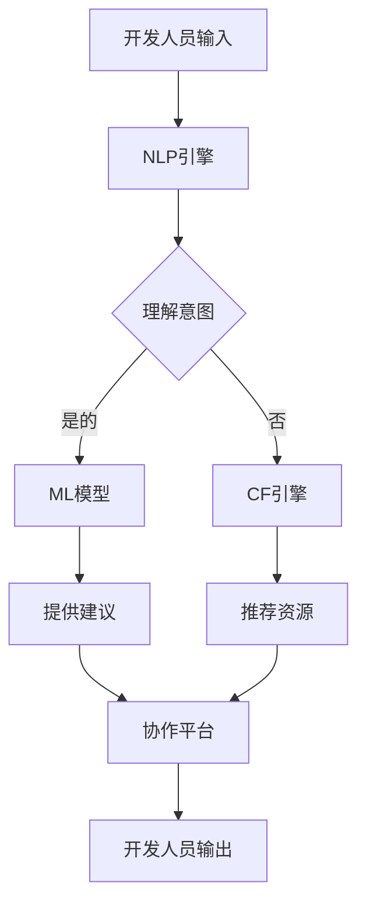

                 

**AI Agent: AI的下一个风口 ChatDev：重塑软件开发的AI群体智能协作框架**

**作者：禅与计算机程序设计艺术 / Zen and the Art of Computer Programming**

## 1. 背景介绍

在当今快速变化的软件开发领域，协作和效率是成功的关键。然而，传统的开发方法面临着沟通障碍、知识共享困难和低效的协作流程等挑战。人工智能（AI）的崛起为重塑软件开发提供了新的可能性。本文将介绍ChatDev，一个旨在重塑软件开发的AI群体智能协作框架。

## 2. 核心概念与联系

### 2.1 核心概念

ChatDev的核心概念是利用AI驱动的聊天机器人（Chatbot）来协助软件开发团队进行沟通、协作和知识共享。它结合了自然语言处理（NLP）、机器学习（ML）和协作过滤（CF）等技术，为开发人员提供了一个智能化的协作平台。

### 2.2 核心架构


如上图所示，ChatDev的核心架构包括以下组件：

- **NLP引擎**：负责理解和生成人类语言，实现与开发人员的自然交互。
- **ML模型**：学习和预测开发人员的意图，提供个性化的建议和推荐。
- **CF引擎**：分析和推荐相关的代码片段、文档和资源，促进知识共享。
- **协作平台**：提供一个集成的环境，支持开发人员与AI代理（AI Agent）的互动。

### 2.3 Mermaid流程图



## 3. 核心算法原理与具体操作步骤

### 3.1 算法原理概述

ChatDev的核心算法包括NLP、ML和CF算法。NLP算法用于理解和生成人类语言，ML算法用于学习和预测开发人员的意图，CF算法用于推荐相关的代码片段和资源。

### 3.2 算法步骤详解

1. **NLP算法**：使用预训练的语言模型（如BERT）对开发人员的输入进行编码，然后使用序列到序列（Seq2Seq）模型生成响应。
2. **ML算法**：使用监督学习算法（如随机森林或支持向量机）学习开发人员的意图，然后使用推荐系统算法（如协作过滤或内容过滤）提供个性化的建议。
3. **CF算法**：使用用户-用户（User-User）或项目-项目（Item-Item）协作过滤算法推荐相关的代码片段和资源。

### 3.3 算法优缺点

**优点**：

- 提高了开发人员之间的沟通和协作效率。
- 促进了知识共享和学习。
- 提供了个性化的建议和推荐。

**缺点**：

- 依赖于AI模型的准确性和可靠性。
- 需要大量的数据和计算资源。
- 可能会面临隐私和安全问题。

### 3.4 算法应用领域

ChatDev的算法可以应用于软件开发的各个领域，包括：

- 代码审查和质量评估。
- 代码片段和资源推荐。
- 开发人员培训和指导。
- 项目管理和进度跟踪。

## 4. 数学模型和公式

### 4.1 数学模型构建

ChatDev的数学模型基于信息检索（IR）和推荐系统（RS）的数学基础。IR模型用于检索相关的代码片段和资源，RS模型用于提供个性化的建议和推荐。

### 4.2 公式推导过程

**IR模型**：假设有$n$个开发人员，$m$个代码片段，$q$是当前开发人员的查询，$S$是相关性评分函数。则IR模型的目标是最大化$S(q, d)$，其中$d$是代码片段。

**RS模型**：假设有$n$个开发人员，$m$个代码片段，$R$是开发人员对代码片段的评分矩阵。则RS模型的目标是预测开发人员$u$对代码片段$i$的评分$\hat{r}_{ui}$。

### 4.3 案例分析与讲解

假设开发人员A输入查询"如何优化数据库查询"，IR模型检索出相关的代码片段和资源，RS模型预测出开发人员A可能感兴趣的建议和推荐。然后，ChatDev的NLP引擎生成响应，提供给开发人员A。

## 5. 项目实践：代码实例和详细解释说明

### 5.1 开发环境搭建

ChatDev的开发环境包括Python、TensorFlow、PyTorch、Spacy和Transformers等常用的AI开发工具。此外，还需要一个集成开发环境（IDE）来支持开发人员与AI代理的互动。

### 5.2 源代码详细实现

ChatDev的源代码包括NLP、ML和CF模块。NLP模块使用Transformers库实现，ML模块使用TensorFlow或PyTorch实现，CF模块使用Surprise库实现。

### 5.3 代码解读与分析

**NLP模块**：

```python
from transformers import pipeline

nlp = pipeline('text-generation', model='t5-base', tokenizer='t5-base')

def generate_response(input_text):
    output = nlp(input_text)[0]['generated_text']
    return output
```

**ML模块**：

```python
import tensorflow as tf
from tensorflow.keras.models import Sequential
from tensorflow.keras.layers import Dense

model = Sequential()
model.add(Dense(64, input_dim=100, activation='relu'))
model.add(Dense(1, activation='sigmoid'))

model.compile(loss='binary_crossentropy', optimizer='adam', metrics=['accuracy'])
```

**CF模块**：

```python
from surprise import KNNWithMeans

algo = KNNWithMeans(k=50, sim_options={'name': 'pearson_baseline', 'user_based': True})

algo.fit(data)
predictions = algo.test(test_set)
```

### 5.4 运行结果展示

ChatDev的运行结果包括与开发人员的对话记录、提供的建议和推荐、检索的代码片段和资源等。这些结果可以通过协作平台进行可视化和交互。

## 6. 实际应用场景

### 6.1 当前应用

ChatDev当前应用于软件开发团队的日常协作中，帮助开发人员提高沟通和协作效率，促进知识共享和学习。

### 6.2 未来应用展望

未来，ChatDev可以扩展到更广泛的应用领域，包括：

- **开发人员培训**：提供个性化的学习路径和资源推荐。
- **项目管理**：提供项目进度跟踪和风险预测。
- **代码生成**：提供代码片段和模板推荐，帮助开发人员快速生成代码。

## 7. 工具和资源推荐

### 7.1 学习资源推荐

- **NLP**：[Hugging Face Transformers](https://huggingface.co/transformers/)，[Spacy](https://spacy.io/)
- **ML**：[TensorFlow](https://www.tensorflow.org/)，[PyTorch](https://pytorch.org/)
- **CF**：[Surprise](https://surprise.readthedocs.io/en/latest/)，[Implicit](https://github.com/benfred/implicit)

### 7.2 开发工具推荐

- **IDE**：[PyCharm](https://www.jetbrains.com/pycharm/)，[Visual Studio Code](https://code.visualstudio.com/)
- **数据库**：[PostgreSQL](https://www.postgresql.org/)，[MongoDB](https://www.mongodb.com/)
- **云平台**：[AWS](https://aws.amazon.com/)，[GCP](https://cloud.google.com/)，[Azure](https://azure.microsoft.com/)

### 7.3 相关论文推荐

- [Code2Vec: Learning Distributed Representations of Code](https://arxiv.org/abs/1802.09088)
- [DeepCode: Learning from Billions of Lines of Code](https://arxiv.org/abs/1707.07724)
- [CodeSearchNet: A Large Dataset for Search in Code](https://arxiv.org/abs/1909.11942)

## 8. 总结：未来发展趋势与挑战

### 8.1 研究成果总结

ChatDev的研究成果包括一个AI驱动的协作平台，结合了NLP、ML和CF技术，为软件开发团队提供了一个智能化的协作环境。

### 8.2 未来发展趋势

未来，ChatDev可以进一步发展以下方向：

- **多模式交互**：支持文本、语音和图形等多模式交互。
- **可解释AI**：提供可解释的建议和推荐，帮助开发人员理解AI的决策过程。
- **联邦学习**：支持分布式的AI模型训练和部署，保护开发人员的隐私和数据安全。

### 8.3 面临的挑战

ChatDev面临的挑战包括：

- **数据质量**：需要大量的高质量数据来训练AI模型。
- **模型泛化**：需要保证AI模型在不同开发人员和项目中的泛化能力。
- **隐私和安全**：需要保护开发人员的隐私和数据安全。

### 8.4 研究展望

未来，我们计划扩展ChatDev的功能和应用领域，并与开发人员和团队合作，收集反馈和建议，不断改进和完善ChatDev的设计和实现。

## 9. 附录：常见问题与解答

**Q1：ChatDev是如何理解开发人员的意图的？**

A1：ChatDev使用ML模型学习开发人员的意图，并结合NLP技术理解开发人员的输入。

**Q2：ChatDev是如何推荐代码片段和资源的？**

A2：ChatDev使用CF算法分析开发人员的历史行为和偏好，推荐相关的代码片段和资源。

**Q3：ChatDev是否会取代开发人员？**

A3：不，ChatDev旨在协助开发人员，提高他们的效率和能力，而不是取代他们。

**Q4：ChatDev是否会泄露开发人员的隐私？**

A4：不，ChatDev采取了严格的措施保护开发人员的隐私和数据安全，包括数据加密和匿名化等。

**Q5：如何开始使用ChatDev？**

A5：开发人员可以访问ChatDev的官方网站，注册并登录账号，然后开始与AI代理互动。

## 作者署名

作者：禅与计算机程序设计艺术 / Zen and the Art of Computer Programming

