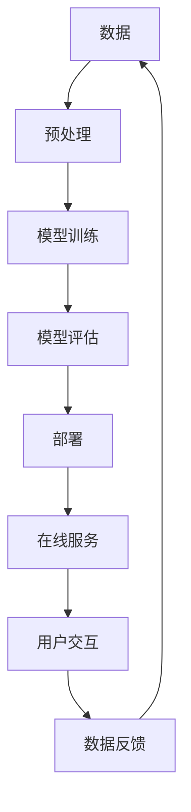

                 

## AI 大模型创业：如何利用商业优势？

> 关键词：大模型、商业优势、创业、AI、数据、算法、基础设施、可解释性、监管、商业模式

## 1. 背景介绍

当前，人工智能（AI）领域正在经历一场大模型（Large Language Models）的革命。这些模型通过处理大量数据和计算资源，能够理解和生成人类语言，展现出了惊人的能力。然而，如何将这些技术转化为商业成功，是当前AI创业者面临的主要挑战之一。本文将探讨如何利用大模型的商业优势，成功开展AI创业。

## 2. 核心概念与联系

### 2.1 大模型的定义与特点

大模型是指通过处理大量数据和计算资源训练出来的模型，具有以下特点：

- **规模（Scale）**：大模型需要大量的数据和计算资源进行训练。
- **泛化能力（Generalization）**：大模型能够在未见过的数据上表现出良好的泛化能力。
- **多模式能力（Multimodality）**：大模型能够处理多种模式的数据，如文本、图像、音频等。
- **上下文理解（Context Understanding）**：大模型能够理解上下文，从而生成更相关、更有意义的输出。

### 2.2 大模型与商业优势的联系

大模型的特点为商业创新提供了新的可能性。通过利用大模型的泛化能力、多模式能力和上下文理解，企业可以开发出更智能、更个性化的产品和服务，从而提高客户满意度和盈利能力。此外，大模型还可以帮助企业提高效率，降低成本，并发现新的商业机会。

### 2.3 核心概念原理与架构的 Mermaid 流程图



## 3. 核心算法原理 & 具体操作步骤

### 3.1 算法原理概述

大模型的核心算法是Transformer模型，它使用自注意力机制（Self-Attention）和位置编码（Positional Encoding）来处理序列数据。Transformer模型的优势在于能够处理长序列数据，并捕捉到序列中各个元素之间的相关性。

### 3.2 算法步骤详解

1. **数据预处理**：收集、清洗、标记和切分数据。
2. **模型构建**：构建Transformer模型，包括编码器和解码器。
3. **模型训练**：使用反向传播算法和Adam优化器训练模型。
4. **模型评估**：使用验证集评估模型的性能，并调整超参数。
5. **模型部署**：将模型部署到生产环境中，提供在线服务。
6. **用户交互**：用户与模型进行交互，获取输出结果。
7. **数据反馈**：收集用户反馈，并将其用于模型的进一步训练和优化。

### 3.3 算法优缺点

**优点**：

- 可以处理长序列数据。
- 能够捕捉到序列中各个元素之间的相关性。
- 具有良好的泛化能力。

**缺点**：

- 计算资源需求高。
- 训练时间长。
- 缺乏可解释性。

### 3.4 算法应用领域

大模型的应用领域包括自然语言处理（NLP）、计算机视觉（CV）、语音识别、推荐系统等。在商业领域，大模型可以用于客户服务、营销、销售、人力资源等各个方面。

## 4. 数学模型和公式 & 详细讲解 & 举例说明

### 4.1 数学模型构建

大模型的数学模型是基于Transformer架构构建的。Transformer模型使用自注意力机制和位置编码来处理序列数据。自注意力机制可以表示为：

$$ \text{Attention}(Q, K, V) = \text{softmax}\left(\frac{QK^T}{\sqrt{d_k}}\right)V $$

其中，$Q$, $K$, $V$分别是查询（Query）、键（Key）和值（Value）矩阵，$d_k$是键矩阵的维度。

### 4.2 公式推导过程

自注意力机制的推导过程如下：

1. 计算查询、键和值矩阵。
2. 计算查询和键矩阵的点积，并除以键矩阵的维度的平方根。
3. 使用softmax函数对上一步的结果进行归一化，得到注意力权重。
4. 将注意力权重与值矩阵相乘，得到自注意力的输出。

### 4.3 案例分析与讲解

例如，在NLP任务中，查询矩阵可以是当前单词的嵌入向量，键和值矩阵可以是序列中所有单词的嵌入向量。通过自注意力机制，模型可以理解当前单词与序列中其他单词的相关性，从而生成更相关、更有意义的输出。

## 5. 项目实践：代码实例和详细解释说明

### 5.1 开发环境搭建

大模型的开发需要强大的计算资源和软件环境。推荐使用NVIDIA A100 GPU和NVIDIA CUDA工具包，以及PyTorch或TensorFlow框架。

### 5.2 源代码详细实现

以下是大模型的简化实现代码示例：

```python
import torch
import torch.nn as nn
import torch.nn.functional as F

class Transformer(nn.Module):
    def __init__(self, d_model, n_head, n_layers, vocab_size):
        super(Transformer, self).__init__()
        self.embedding = nn.Embedding(vocab_size, d_model)
        self.pos_encoding = PositionalEncoding(d_model)
        self.encoder = nn.TransformerEncoder(
            nn.TransformerEncoderLayer(d_model, n_head), n_layers)
        self.decoder = nn.Linear(d_model, vocab_size)

    def forward(self, src):
        src = self.embedding(src) * torch.sqrt(torch.tensor(0.02))
        src = self.pos_encoding(src)
        output = self.encoder(src)
        output = self.decoder(output)
        return output
```

### 5.3 代码解读与分析

代码中定义了一个Transformer模型，包括嵌入层、位置编码层、编码器和解码器。在前向传播过程中，首先对输入进行嵌入和位置编码，然后通过编码器进行自注意力机制的计算，最后通过解码器生成输出。

### 5.4 运行结果展示

在训练和评估大模型后，可以使用生成的模型提供在线服务，并与用户进行交互。例如，在NLP任务中，模型可以生成文本、回答问题或进行文本分类。

## 6. 实际应用场景

### 6.1 客户服务

大模型可以用于构建智能客户服务系统，提供24/7在线支持，并帮助客户解决问题。例如，在电商平台上，大模型可以帮助客户查找商品、解答购物问题或提供个性化推荐。

### 6.2 营销

大模型可以帮助企业开展个性化营销，根据客户的偏好和行为提供定制化的内容。例如，在社交媒体上，大模型可以生成吸引人的广告文案或推荐相关的产品。

### 6.3 销售

大模型可以帮助企业提高销售效率，通过自动化对话或个性化推荐吸引潜在客户。例如，在销售平台上，大模型可以帮助销售人员快速找到潜在客户并提供个性化的解决方案。

### 6.4 未来应用展望

未来，大模型将会在更多领域得到应用，如自动驾驶、医疗保健、金融服务等。此外，大模型还将与其他技术结合，如物联网、区块链和虚拟现实，从而开创新的商业机会。

## 7. 工具和资源推荐

### 7.1 学习资源推荐

- **课程**：斯坦福大学的“深度学习”课程（CS224n）和“自然语言处理”课程（CS224u）是学习大模型的良好起点。
- **书籍**：“注意力是所有事情的关键”一书详细介绍了自注意力机制和Transformer模型。
- **论文**：阅读相关的学术论文，如“Attention is All You Need”、“BERT：Pre-training of Deep Bidirectional Transformers for Language Understanding”等。

### 7.2 开发工具推荐

- **框架**：PyTorch和TensorFlow是开发大模型的流行框架。
- **库**：Hugging Face的Transformers库提供了预训练的大模型和方便的API。
- **硬件**：NVIDIA A100 GPU和NVIDIA CUDA工具包是开发大模型的强大硬件和软件环境。

### 7.3 相关论文推荐

- **Attention is All You Need** - Vaswani et al. (2017)
- **BERT: Pre-training of Deep Bidirectional Transformers for Language Understanding** - Jacob Devlin and Ming-Wei Chang and Kenton Lee (2018)
- **Language Models are Few-Shot Learners** - Tom B. Brown et al. (2020)

## 8. 总结：未来发展趋势与挑战

### 8.1 研究成果总结

本文介绍了大模型的原理、算法、数学模型和应用，并提供了代码实例和实际应用场景。大模型的商业优势为企业提供了新的可能性，帮助企业提高客户满意度、盈利能力和效率。

### 8.2 未来发展趋势

未来，大模型的发展趋势包括：

- **模型规模扩大**：大模型的规模将会进一步扩大，从而提高泛化能力和多模式能力。
- **多模式能力增强**：大模型将会更好地处理多模式数据，如文本、图像、音频等。
- **可解释性提高**：大模型的可解释性将会得到提高，从而帮助企业更好地理解模型的决策过程。

### 8.3 面临的挑战

大模型面临的挑战包括：

- **计算资源需求高**：大模型需要大量的计算资源进行训练和部署。
- **训练时间长**：大模型的训练时间长，需要大量的时间和资源。
- **缺乏可解释性**：大模型缺乏可解释性，难以理解模型的决策过程。

### 8.4 研究展望

未来的研究方向包括：

- **模型压缩**：开发新的技术将大模型压缩为更小、更快的模型，从而降低计算资源需求。
- **可解释性提高**：开发新的技术提高大模型的可解释性，帮助企业更好地理解模型的决策过程。
- **多模式能力增强**：开发新的技术帮助大模型更好地处理多模式数据，从而扩展大模型的应用领域。

## 9. 附录：常见问题与解答

**Q1：大模型需要多少计算资源？**

A1：大模型需要大量的计算资源进行训练和部署。例如，训练一个具有1750万参数的大模型需要数千个GPU小时。

**Q2：大模型的训练时间有多长？**

A2：大模型的训练时间长，需要大量的时间和资源。例如，训练一个具有1750万参数的大模型需要数天甚至数周的时间。

**Q3：大模型的可解释性如何？**

A3：大模型缺乏可解释性，难以理解模型的决策过程。然而， recent research has proposed several methods to improve the interpretability of large language models.

## 作者：禅与计算机程序设计艺术 / Zen and the Art of Computer Programming

（完）

