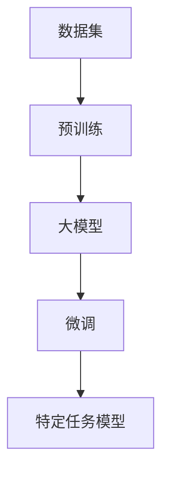

                 

## AI 大模型创业：如何利用技术优势？

> 关键词：大模型、创业、技术优势、预训练模型、 fine-tuning、商业化、数据策略、计算资源、模型部署

## 1. 背景介绍

当前，人工智能（AI）领域正处于大模型（Large Language Models）的发展时期。这些模型通过处理大量文本数据，学习到丰富的语义表示，从而展现出强大的理解和生成文本的能力。大模型的出现为各行各业带来了新的机遇，也为创业者提供了新的可能性。本文将探讨如何利用大模型的技术优势进行创业，并分享相关的原理、算法、数学模型、项目实践和工具资源。

## 2. 核心概念与联系

### 2.1 大模型的定义与特点

大模型是指通过处理大量数据训练而来的模型，具有以下特点：

- **规模（Scale）**：大模型通常包含数十亿甚至数千亿个参数。
- **泛化能力（Generalization）**：大模型可以在未见过的数据上表现出色，展现出强大的泛化能力。
- **多模式能力（Multimodal）**：大模型可以处理文本、图像、音频等多种模式的数据。

### 2.2 大模型的训练过程

大模型的训练过程通常分为两个阶段：预训练（Pre-training）和微调（Fine-tuning）。预训练阶段，模型在大量数据上进行自监督学习，学习到语义表示；微调阶段，模型在特定任务的数据上进行监督学习，适应特定任务的需求。



## 3. 核心算法原理 & 具体操作步骤

### 3.1 算法原理概述

大模型的核心算法是Transformer模型（Vaswani et al., 2017），它使用自注意力机制（Self-Attention）和位置编码（Positional Encoding）处理序列数据。Transformer模型的优势在于可以并行处理序列数据，且可以学习到长程依赖关系。

### 3.2 算法步骤详解

1. **数据预处理**：将文本数据转换为 token IDs，并添加位置编码。
2. **嵌入层（Embedding Layer）**：将 token IDs 映射为向量表示。
3. **编码器（Encoder）**：由多个 Transformer 块组成，每个块包含多头自注意力机制和前向网络（Feed-Forward Network）。
4. **解码器（Decoder）**：在序列生成过程中，使用自注意力机制和编码器-解码器注意力机制生成下一个 token。
5. **微调**：在特定任务的数据上进行监督学习，调整模型参数。

### 3.3 算法优缺点

**优点**：

- 可以学习到丰富的语义表示。
- 可以并行处理序列数据。
- 可以学习到长程依赖关系。

**缺点**：

- 训练大模型需要大量的计算资源。
- 微调阶段需要大量的标注数据。
- 存在过拟合和泄露问题。

### 3.4 算法应用领域

大模型的应用领域非常广泛，包括自然语言处理（NLP）、计算机视觉（CV）、生物信息学、推荐系统等。在 NLP 领域，大模型可以用于文本生成、机器翻译、问答系统等任务。

## 4. 数学模型和公式 & 详细讲解 & 举例说明

### 4.1 数学模型构建

大模型的数学模型可以表示为以下形式：

$$L(\theta) = -\frac{1}{N} \sum_{i=1}^{N} \log P_{\theta}(x_i | x_{<i})$$

其中，$\theta$ 表示模型参数，$N$ 表示序列长度，$x_i$ 表示第 $i$ 个 token，$P_{\theta}(x_i | x_{<i})$ 表示模型预测第 $i$ 个 token 的概率。

### 4.2 公式推导过程

大模型的损失函数可以通过交叉熵损失函数推导而来：

$$L(\theta) = -\frac{1}{N} \sum_{i=1}^{N} \log \frac{\exp(z_i)}{\sum_{j=1}^{V} \exp(z_j)}$$

其中，$z_i$ 表示模型预测第 $i$ 个 token 的 logits，$V$ 表示 token 词表大小。

### 4.3 案例分析与讲解

例如，在机器翻译任务中，大模型可以用于生成目标语言的序列。给定源语言序列 $x = (x_1, x_2,..., x_N)$，模型预测目标语言序列 $y = (y_1, y_2,..., y_M)$ 的概率为：

$$P_{\theta}(y | x) = \prod_{i=1}^{M} P_{\theta}(y_i | y_{<i}, x)$$

## 5. 项目实践：代码实例和详细解释说明

### 5.1 开发环境搭建

大模型的开发需要强大的计算资源，通常需要GPU集群。推荐使用 Python 语言，并结合 PyTorch、Hugging Face Transformers 等深度学习框架。

### 5.2 源代码详细实现

以下是大模型训练的伪代码：

```python
import torch
from transformers import AutoModelForCausalLM, AutoTokenizer

# 加载预训练模型
model = AutoModelForCausalLM.from_pretrained("bigscience/bloom")
tokenizer = AutoTokenizer.from_pretrained("bigscience/bloom")

# 准备数据
inputs = tokenizer("Hello, I'm a big model!", return_tensors="pt")
labels = inputs["input_ids"].clone()

# 训练模型
optimizer = torch.optim.AdamW(model.parameters(), lr=1e-4)
for epoch in range(10):
    outputs = model(**inputs, labels=labels)
    loss = outputs.loss
    loss.backward()
    optimizer.step()
    optimizer.zero_grad()
```

### 5.3 代码解读与分析

上述代码首先加载预训练模型，然后准备数据，并进行模型训练。在训练过程中，模型预测序列的概率，并计算交叉熵损失。然后，使用 AdamW 优化器更新模型参数。

### 5.4 运行结果展示

在训练过程中，可以监控模型的损失值，并观察模型在验证集上的表现。随着训练的进行，模型的损失值应该逐渐下降，并在验证集上表现出色。

## 6. 实际应用场景

### 6.1 商业化应用

大模型可以商业化应用于各种场景，例如：

- **文本生成**：为内容创作提供灵感和帮助。
- **机器翻译**：提高翻译质量和效率。
- **问答系统**：提供更准确和丰富的回答。

### 6.2 数据策略

大模型的训练需要大量的数据。因此，收集和处理高质量的数据是成功的关键。此外，还需要考虑数据的合法性和隐私问题。

### 6.3 计算资源

大模型的训练需要强大的计算资源。因此，需要考虑如何高效利用计算资源，并降低成本。例如，可以使用分布式训练、混合精度训练等技术。

### 6.4 未来应用展望

未来，大模型将继续发展，并应用于更多领域。例如，多模式大模型可以处理文本、图像、音频等多种模式的数据，从而实现更复杂的任务。此外，大模型还可以与其他技术结合，实现更强大的功能。

## 7. 工具和资源推荐

### 7.1 学习资源推荐

- **课程**：斯坦福大学的 CS224n 自然语言处理课程（<https://online.stanford.edu/courses/cs224n-natural-language-processing-winter-2019>）
- **书籍**："Natural Language Processing with Python"（<https://www.nltk.org/book/>）
- **论文**："Attention is All You Need"（<https://arxiv.org/abs/1706.03762>）

### 7.2 开发工具推荐

- **PyTorch**：<https://pytorch.org/>
- **Hugging Face Transformers**：<https://huggingface.co/transformers/>
- **TensorFlow**：<https://www.tensorflow.org/>

### 7.3 相关论文推荐

- "BERT: Pre-training of Deep Bidirectional Transformers for Language Understanding"（<https://arxiv.org/abs/1810.04805>）
- "RoBERTa: A Robustly Optimized BERT Pretraining Approach"（<https://arxiv.org/abs/1907.11692>）
- "T5: Text-to-Text Transfer Transformer"（<https://arxiv.org/abs/1910.10683>）

## 8. 总结：未来发展趋势与挑战

### 8.1 研究成果总结

大模型在自然语言处理领域取得了显著的成果，展现出强大的理解和生成文本的能力。然而，大模型仍然面临着许多挑战。

### 8.2 未来发展趋势

未来，大模型将继续发展，并应用于更多领域。例如，多模式大模型可以处理文本、图像、音频等多种模式的数据，从而实现更复杂的任务。此外，大模型还可以与其他技术结合，实现更强大的功能。

### 8.3 面临的挑战

大模型面临的挑战包括：

- **计算资源**：大模型的训练需要强大的计算资源，如何高效利用计算资源是一个关键问题。
- **数据策略**：大模型的训练需要大量的数据。如何收集和处理高质量的数据，并考虑数据的合法性和隐私问题是成功的关键。
- **模型部署**：大模型的部署需要考虑模型的规模和复杂性。如何高效部署大模型，并实现实时推理是一个挑战。

### 8.4 研究展望

未来的研究方向包括：

- **多模式大模型**：开发可以处理多种模式数据的大模型。
- **小模型大表现**：研究如何使用更少的参数实现更好的表现。
- **可解释的大模型**：研究如何使大模型更易于理解和解释。

## 9. 附录：常见问题与解答

**Q：大模型的训练需要多长时间？**

A：大模型的训练时间取决于模型的规模和计算资源。通常，大模型的训练需要数天甚至数周的时间。

**Q：大模型的训练需要多少计算资源？**

A：大模型的训练需要强大的计算资源，通常需要GPU集群。例如，训练一个包含数十亿个参数的大模型需要数百甚至数千张GPU。

**Q：大模型的部署需要多少计算资源？**

A：大模型的部署需要考虑模型的规模和复杂性。通常，大模型的部署需要强大的服务器和高速网络。

## 作者：禅与计算机程序设计艺术 / Zen and the Art of Computer Programming

_本文由禅与计算机程序设计艺术 / Zen and the Art of Computer Programming 编写，欢迎转载，但请保留作者署名和原文链接。_

