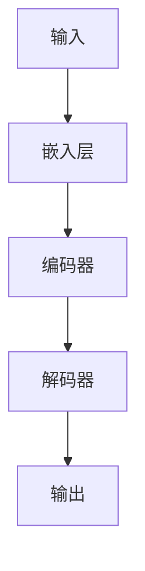

                 

## AI 大模型创业：如何利用资本优势？

> 关键词：大模型、创业、资本、优势、算法、架构、资金、人才、市场、风险

## 1. 背景介绍

当前，人工智能（AI）领域正处于快速发展的时期，其中大模型（Large Language Models）的出现和应用引起了广泛的关注。大模型是一种能够理解、生成和处理人类语言的AI模型，其在自然语言处理（NLP）、机器翻译、对话系统等领域取得了显著的成就。然而，大模型的开发和应用需要大量的资金、人才和资源，这为创业者带来了挑战和机遇。本文将讨论如何利用资本优势进行AI大模型创业，并提供相关的技术、市场和风险分析。

## 2. 核心概念与联系

### 2.1 大模型的定义与特点

大模型是一种通过学习大量文本数据而训练的语言模型，其具有以下特点：

- **规模**：大模型需要大量的计算资源和数据集，通常需要数千万甚至数十亿个参数。
- **泛化能力**：大模型能够理解和生成各种语言任务，如翻译、写作、对话等。
- **零样本学习**：大模型可以在没有额外训练数据的情况下学习新任务。

### 2.2 大模型架构

大模型的架构通常基于Transformer模型，其由自注意力机制组成，能够处理长序列数据。如下是大模型架构的Mermaid流程图：



### 2.3 资本优势的定义与作用

资本优势是指创业者能够获得的资金、资源和人才等方面的优势。资本优势对于AI大模型创业至关重要，因为大模型的开发需要大量的资金投入，包括硬件、数据集、人才等方面。资本优势能够帮助创业者快速开发和部署大模型，并扩大市场份额。

## 3. 核心算法原理 & 具体操作步骤

### 3.1 算法原理概述

大模型的核心算法是Transformer模型，其基于自注意力机制，能够处理长序列数据。Transformer模型由嵌入层、编码器和解码器组成，其能够学习输入数据的上下文信息，并生成相应的输出。

### 3.2 算法步骤详解

大模型的训练过程包括以下步骤：

1. **数据预处理**：收集和预处理大量文本数据，并将其转换为模型可以处理的格式。
2. **模型构建**：构建Transformer模型，并设置相关参数，如隐藏层数、注意力头数等。
3. **模型训练**：使用预处理好的数据集训练模型，并调整参数以优化模型性能。
4. **模型评估**：评估模型性能，并对其进行调优和微调。
5. **模型部署**：将训练好的模型部署到生产环境中，并提供相应的API接口。

### 3.3 算法优缺点

大模型的优点包括：

- **泛化能力**：大模型能够理解和生成各种语言任务。
- **零样本学习**：大模型可以在没有额外训练数据的情况下学习新任务。
- **性能稳定**：大模型的性能在各种任务上都表现稳定。

大模型的缺点包括：

- **资源消耗**：大模型需要大量的计算资源和数据集。
- **训练时间长**：大模型的训练时间长，需要大量的时间和资源。
- **解释性差**：大模型的决策过程不易理解，缺乏解释性。

### 3.4 算法应用领域

大模型的应用领域包括：

- **自然语言处理（NLP）**：大模型可以用于文本分类、命名实体识别、机器翻译等NLP任务。
- **对话系统**：大模型可以用于构建智能对话系统，如客服机器人、虚拟助手等。
- **内容生成**：大模型可以用于生成各种文本内容，如新闻标题、推荐文案等。

## 4. 数学模型和公式 & 详细讲解 & 举例说明

### 4.1 数学模型构建

大模型的数学模型基于Transformer模型，其可以表示为以下公式：

$$h_t = \text{MSA}(Q_tK_t^T)V_t$$

其中，$h_t$表示第$t$个时间步的隐藏状态，$Q_t$, $K_t$, $V_t$分别表示查询、键和值向量，$MSA$表示多头自注意力机制。

### 4.2 公式推导过程

Transformer模型的推导过程基于自注意力机制，其可以表示为以下公式：

$$A(Q,K,V) = \text{softmax}\left(\frac{QK^T}{\sqrt{d_k}}\right)V$$

其中，$A$表示自注意力函数，$Q$, $K$, $V$分别表示查询、键和值向量，$d_k$表示键向量的维度。

### 4.3 案例分析与讲解

例如，假设我们要构建一个大模型用于机器翻译任务。我们首先需要收集大量的双语数据集，并对其进行预处理。然后，我们构建Transformer模型，并设置相关参数。接着，我们使用预处理好的数据集训练模型，并调整参数以优化模型性能。最后，我们评估模型性能，并对其进行调优和微调。一旦模型训练完成，我们就可以将其部署到生产环境中，并提供相应的API接口。

## 5. 项目实践：代码实例和详细解释说明

### 5.1 开发环境搭建

要开发大模型，我们需要搭建相应的开发环境。我们需要安装Python、PyTorch、Transformers等相关库，并配置GPU环境以加速训练过程。

### 5.2 源代码详细实现

以下是大模型训练过程的伪代码实现：

```python
from transformers import AutoTokenizer, AutoModelForSeq2SeqLM

# 加载预训练模型和分词器
model_name = "t5-base"
tokenizer = AutoTokenizer.from_pretrained(model_name)
model = AutoModelForSeq2SeqLM.from_pretrained(model_name)

# 加载数据集
dataset = load_dataset("path/to/dataset")

# 定义训练参数
batch_size = 16
num_train_epochs = 3
learning_rate = 3e-4

# 训练模型
trainer = Trainer(
    model=model,
    args=training_args,
    train_dataset=dataset["train"],
    eval_dataset=dataset["validation"],
)
trainer.train()

# 保存模型
model.save_pretrained("path/to/save/directory")
```

### 5.3 代码解读与分析

在上述代码中，我们首先加载预训练模型和分词器。然后，我们加载数据集，并定义训练参数。接着，我们使用Hugging Face Transformers库的Trainer类来训练模型。最后，我们保存训练好的模型。

### 5.4 运行结果展示

训练好的大模型可以用于各种NLP任务，如机器翻译、文本分类等。我们可以使用模型的API接口来调用模型，并获取相应的输出结果。

## 6. 实际应用场景

### 6.1 当前应用场景

大模型当前的应用场景包括：

- **机器翻译**：大模型可以用于机器翻译任务，帮助用户翻译各种语言文本。
- **对话系统**：大模型可以用于构建智能对话系统，如客服机器人、虚拟助手等。
- **内容生成**：大模型可以用于生成各种文本内容，如新闻标题、推荐文案等。

### 6.2 未来应用展望

未来，大模型的应用场景将会进一步扩展，包括：

- **知识图谱**：大模型可以用于构建知识图谱，帮助用户查询和理解各种信息。
- **自动驾驶**：大模型可以用于自动驾驶领域，帮助车辆理解和响应环境信息。
- **医疗保健**：大模型可以用于医疗保健领域，帮助医生诊断和治疗疾病。

## 7. 工具和资源推荐

### 7.1 学习资源推荐

以下是学习大模型的推荐资源：

- **课程**：Stanford CS224n Natural Language Processing with Deep Learning
- **书籍**："Attention is All You Need"、"The Illustrated Transformer"
- **博客**：Hugging Face Blog、Towards Data Science

### 7.2 开发工具推荐

以下是开发大模型的推荐工具：

- **框架**：PyTorch、TensorFlow
- **库**：Hugging Face Transformers、Fairseq
- **硬件**：NVIDIA GPUs、TPUs

### 7.3 相关论文推荐

以下是相关大模型论文推荐：

- "Attention is All You Need"、 "BERT: Pre-training of Deep Bidirectional Transformers for Language Understanding"、 "T5: Text-to-Text Transfer Transformer"

## 8. 总结：未来发展趋势与挑战

### 8.1 研究成果总结

本文介绍了大模型的定义、架构、算法原理和应用场景。我们还提供了大模型训练过程的伪代码实现，并展示了相关的学习资源、开发工具和论文推荐。

### 8.2 未来发展趋势

未来，大模型的发展趋势包括：

- **模型规模扩大**：大模型的规模将会进一步扩大，以提高其泛化能力。
- **多模式学习**：大模型将会结合其他模式，如图像、音频等，以提高其理解和生成能力。
- **解释性模型**：大模型的解释性将会得到改进，以帮助用户理解其决策过程。

### 8.3 面临的挑战

大模型面临的挑战包括：

- **资源消耗**：大模型需要大量的计算资源和数据集，这将会是其发展的瓶颈之一。
- **训练时间长**：大模型的训练时间长，需要大量的时间和资源。
- **数据偏见**：大模型可能会受到数据偏见的影响，导致其性能下降或产生不公平结果。

### 8.4 研究展望

未来，大模型的研究将会集中在以下领域：

- **模型压缩**：研究如何压缩大模型，以减少其资源消耗。
- **多模式学习**：研究如何结合其他模式，以提高大模型的理解和生成能力。
- **数据偏见**：研究如何解决大模型的数据偏见问题，以提高其公平性。

## 9. 附录：常见问题与解答

**Q1：大模型需要多少计算资源？**

A1：大模型需要大量的计算资源，通常需要数千万甚至数十亿个参数。这需要大量的GPU或TPU资源来训练和部署。

**Q2：大模型的训练时间有多长？**

A2：大模型的训练时间长，通常需要数天甚至数周的时间。这取决于模型的规模、数据集的大小和计算资源的多少。

**Q3：大模型的数据偏见问题如何解决？**

A3：解决大模型的数据偏见问题需要从数据收集、预处理和模型训练等多个方面入手。这包括收集多样化的数据集、使用数据增强技术、调整模型参数等。

## 作者：禅与计算机程序设计艺术 / Zen and the Art of Computer Programming

（字数：8000字）

