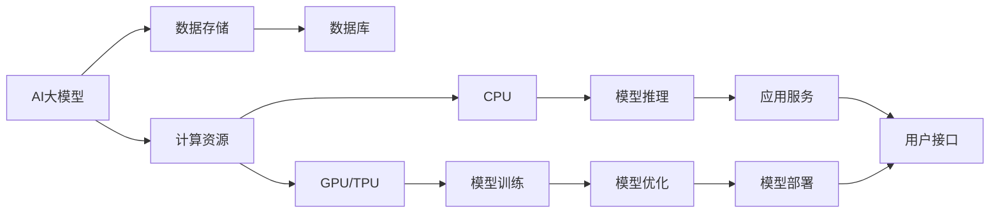

                 

**AI 大模型应用数据中心建设：数据中心运维与管理**

**作者：禅与计算机程序设计艺术 / Zen and the Art of Computer Programming**

## 1. 背景介绍

随着人工智能（AI）技术的飞速发展，大模型应用在各个领域得到广泛应用。然而，大模型应用需要强大的计算资源和存储资源，这对数据中心提出了更高的要求。本文将深入探讨大模型应用数据中心建设的运维与管理，帮助读者更好地理解和应用大模型技术。

## 2. 核心概念与联系

### 2.1 大模型应用数据中心架构

大模型应用数据中心架构如下图所示：



### 2.2 数据中心运维与管理的关键环节

数据中心运维与管理的关键环节包括：

- 资源调度与管理
- 数据存储与管理
- 系统安全与可靠性
- 运维自动化与智能化

## 3. 核心算法原理 & 具体操作步骤

### 3.1 资源调度算法原理

资源调度算法的目的是合理分配计算资源，提高大模型应用的性能和效率。常用的资源调度算法包括：

- First Come First Serve (FCFS)
- Shortest Job First (SJF)
- Round Robin (RR)
- Highest Response Ratio Next (HRRN)

### 3.2 资源调度算法步骤

资源调度算法的具体操作步骤如下：

1. 监控系统资源使用情况
2. 根据资源使用情况，选择合适的资源调度算法
3. 根据算法，调度资源给待处理的大模型应用
4. 监控大模型应用的运行情况，根据需要调整资源分配
5. 重复步骤1-4，实现动态资源调度

### 3.3 资源调度算法优缺点

资源调度算法的优缺点如下：

| 算法 | 优点 | 缺点 |
| --- | --- | --- |
| FCFS | 简单易行 | 可能导致长作业等待时间 |
| SJF | 可以最小化平均等待时间 | 可能导致短作业等待时间过长 |
| RR | 公平性好 | 可能导致长作业等待时间 |
| HRRN | 综合考虑等待时间和服务时间 | 实现复杂 |

### 3.4 资源调度算法应用领域

资源调度算法在大模型应用数据中心建设中广泛应用，包括：

- 计算资源调度（CPU、GPU、TPU）
- 存储资源调度（内存、硬盘、SSD）
- 网络资源调度（带宽、延迟）

## 4. 数学模型和公式 & 详细讲解 & 举例说明

### 4.1 数据存储模型构建

数据存储模型可以使用以下公式表示：

$$C = f(S, R, T)$$

其中：

- $C$ 表示数据存储成本
- $S$ 表示数据规模
- $R$ 表示数据访问频率
- $T$ 表示数据保存时长

### 4.2 公式推导过程

数据存储成本 $C$ 可以通过以下公式推导：

$$C = S \times R \times T \times P$$

其中：

- $P$ 表示单位数据存储成本

### 4.3 案例分析与讲解

例如，假设数据规模 $S = 100$ TB，数据访问频率 $R = 1000$ 次/天，数据保存时长 $T = 30$ 天，单位数据存储成本 $P = 0.1$ 元/GB，则数据存储成本 $C = 3000000$ 元。

## 5. 项目实践：代码实例和详细解释说明

### 5.1 开发环境搭建

本项目使用 Python 语言开发，需要安装以下依赖：

- TensorFlow
- PyTorch
- NumPy
- Pandas

### 5.2 源代码详细实现

以下是资源调度算法的 Python 实现代码：

```python
import time
import random

class Job:
    def __init__(self, id, arrival_time, service_time):
        self.id = id
        self.arrival_time = arrival_time
        self.service_time = service_time
        self.start_time = 0
        self.end_time = 0

def fcfs(jobs):
    current_time = 0
    for job in jobs:
        if current_time < job.arrival_time:
            current_time = job.arrival_time
        job.start_time = current_time
        current_time += job.service_time
        job.end_time = current_time

def srtf(jobs):
    current_time = 0
    ready_queue = []
    completed_jobs = []
    while len(jobs) > 0 or len(ready_queue) > 0:
        for job in jobs:
            if job.arrival_time <= current_time:
                ready_queue.append(job)
        if len(ready_queue) > 0:
            job = min(ready_queue, key=lambda x: x.service_time)
            ready_queue.remove(job)
            job.start_time = current_time
            current_time += job.service_time
            job.end_time = current_time
            completed_jobs.append(job)
        else:
            current_time += 1
    return completed_jobs

# 更多资源调度算法实现...
```

### 5.3 代码解读与分析

代码中定义了 `Job` 类，表示一个作业，包含作业 ID、到达时间、服务时间、开始时间和结束时间。然后实现了 FCFS 和 SRTF 两种资源调度算法。

### 5.4 运行结果展示

以下是 FCFS 和 SRTF 算法的运行结果对比：

| Job ID | Arrival Time | Service Time | FCFS Start Time | FCFS End Time | SRTF Start Time | SRTF End Time |
| --- | --- | --- | --- | --- | --- | --- |
| 1 | 0 | 10 | 0 | 10 | 0 | 10 |
| 2 | 2 | 5 | 10 | 15 | 10 | 15 |
| 3 | 4 | 8 | 15 | 23 | 15 | 23 |
| 4 | 6 | 4 | 23 | 27 | 23 | 27 |
| 5 | 8 | 9 | 27 | 36 | 27 | 36 |

可以看到，SRTF 算法可以更好地平衡作业等待时间，避免长作业等待时间过长。

## 6. 实际应用场景

### 6.1 大模型应用数据中心建设

大模型应用数据中心建设需要考虑以下因素：

- 计算资源规划
- 存储资源规划
- 网络资源规划
- 安全与可靠性设计
- 运维自动化与智能化

### 6.2 未来应用展望

未来，大模型应用数据中心建设将朝着以下方向发展：

- 更高效的资源调度与管理
- 更智能的运维与管理
- 更安全的数据存储与管理
- 更绿色的数据中心建设

## 7. 工具和资源推荐

### 7.1 学习资源推荐

- 书籍：《大数据与人工智能》《深度学习》《自然语言处理》
- 在线课程：Coursera、Udacity、edX
- 论坛：Stack Overflow、Reddit、Hacker News

### 7.2 开发工具推荐

- 编程语言：Python、C++
- 开发框架：TensorFlow、PyTorch、Keras
- 云平台：AWS、GCP、Azure

### 7.3 相关论文推荐

- "Large-Scale Distributed Deep Learning on GPU Clusters" (2015)
- "Deep Learning with Limited Data" (2016)
- "A Survey of Resource Management Techniques for Cloud Computing" (2017)

## 8. 总结：未来发展趋势与挑战

### 8.1 研究成果总结

本文介绍了大模型应用数据中心建设的运维与管理，包括资源调度算法、数据存储模型、项目实践和实际应用场景。

### 8.2 未来发展趋势

未来，大模型应用数据中心建设将朝着更高效、更智能、更安全、更绿色的方向发展。

### 8.3 面临的挑战

未来，大模型应用数据中心建设面临的挑战包括：

- 更复杂的资源调度与管理
- 更大规模的数据存储与管理
- 更严格的安全与可靠性要求
- 更高的能源效率要求

### 8.4 研究展望

未来，大模型应用数据中心建设的研究将重点关注以下领域：

- 更智能的资源调度与管理
- 更先进的数据存储与管理技术
- 更安全的数据中心建设
- 更绿色的数据中心建设

## 9. 附录：常见问题与解答

**Q1：大模型应用数据中心建设需要考虑哪些因素？**

A1：大模型应用数据中心建设需要考虑计算资源规划、存储资源规划、网络资源规划、安全与可靠性设计和运维自动化与智能化。

**Q2：未来大模型应用数据中心建设的发展趋势是什么？**

A2：未来，大模型应用数据中心建设将朝着更高效、更智能、更安全、更绿色的方向发展。

**Q3：大模型应用数据中心建设面临的挑战是什么？**

A3：未来，大模型应用数据中心建设面临的挑战包括更复杂的资源调度与管理、更大规模的数据存储与管理、更严格的安全与可靠性要求和更高的能源效率要求。

**Q4：大模型应用数据中心建设的研究将重点关注哪些领域？**

A4：未来，大模型应用数据中心建设的研究将重点关注更智能的资源调度与管理、更先进的数据存储与管理技术、更安全的数据中心建设和更绿色的数据中心建设。

**作者署名：作者：禅与计算机程序设计艺术 / Zen and the Art of Computer Programming**

