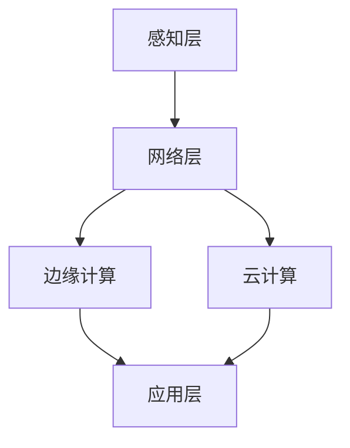

                 

**AIoT：人工智能与物联网的融合**

> 关键词：物联网、人工智能、边缘计算、云计算、数据分析、智能设备

## 1. 背景介绍

在当今的数字化世界中，物联网（IoT）和人工智能（AI）正在快速发展，并开始相互融合，形成了一个新的领域：AIoT（Artificial Intelligence of Things）。AIoT将物联网的海量数据与人工智能的分析和决策能力结合起来，为我们带来了更智能、更高效的解决方案。

## 2. 核心概念与联系

### 2.1 物联网与人工智能

物联网是一个由物理对象（如传感器、设备、车辆等）和虚拟对象（如数字化资产、数字孪生等）组成的网络，这些对象通过互联网连接，可以进行数据交换和通信。人工智能则是指模拟人类智能的计算机系统，它可以学习、推理和解决问题。


### 2.2 AIoT架构

AIoT架构主要包括三个层次：感知层、网络层和应用层。感知层由各种物理设备组成，它们通过传感器收集数据。网络层负责数据的传输和处理，它包括边缘计算和云计算两部分。应用层则提供了各种AIoT应用，如智能家居、智能城市、智能制造等。



## 3. 核心算法原理 & 具体操作步骤

### 3.1 算法原理概述

AIoT中的算法主要包括数据预处理算法、特征提取算法、机器学习算法和深度学习算法等。这些算法的目的是从物联网数据中提取有用的信息，并基于这些信息进行预测和决策。

### 3.2 算法步骤详解

1. 数据收集：从物联网设备收集数据。
2. 数据预处理：清洗、转换和标准化数据。
3. 特征提取：从数据中提取有用的特征。
4. 机器学习/深度学习：使用机器学习或深度学习算法进行模型训练和预测。
5. 决策：基于预测结果进行决策。

### 3.3 算法优缺点

优点：可以从海量数据中提取有用信息，进行预测和决策；可以适应新数据，不断学习和改进。

缺点：算法复杂，需要大量计算资源；数据安全和隐私保护是一个挑战。

### 3.4 算法应用领域

AIoT算法可以应用于智能家居、智能城市、智能制造、智能交通等领域。例如，在智能家居中，AIoT算法可以用于预测用户的需求，自动调节环境；在智能制造中，AIoT算法可以用于设备故障预测，维护保养。

## 4. 数学模型和公式 & 详细讲解 & 举例说明

### 4.1 数学模型构建

在AIoT中，常用的数学模型包括线性回归模型、逻辑回归模型、支持向量机模型、神经网络模型等。这些模型都可以用来进行预测和分类任务。

### 4.2 公式推导过程

例如，线性回归模型的公式推导过程如下：

给定数据集$(x_1, y_1), (x_2, y_2), \ldots, (x_n, y_n)$, 其中$x_i \in \mathbb{R}^d, y_i \in \mathbb{R}$, 我们的目的是找到一个线性函数$f(x) = wx + b$使得$y = f(x)$。

我们可以使用最小二乘法来找到这个函数。最小二乘法的目的是最小化误差平方和：

$$\min_{w, b} \sum_{i=1}^{n} (y_i - f(x_i))^2$$

通过计算导数并设置为零，我们可以找到$w$和$b$的解析解：

$$w = (X^TX)^{-1}X^Ty$$

$$b = \bar{y} - w\bar{x}$$

其中$X$是输入数据的特征矩阵，$y$是输出数据向量，$\bar{x}$和$\bar{y}$分别是$x$和$y$的均值。

### 4.3 案例分析与讲解

例如，在智能交通中，我们可以使用线性回归模型来预测交通拥堵。给定历史交通数据，我们可以使用线性回归模型来预测未来的交通流量。通过输入当前的交通流量和其他特征（如天气、时间等），我们可以预测未来的交通流量，从而帮助司机规划路线，避免拥堵。

## 5. 项目实践：代码实例和详细解释说明

### 5.1 开发环境搭建

在开始编写AIoT项目代码之前，我们需要搭建开发环境。我们需要安装Python、TensorFlow、Keras、Pandas、NumPy等库。我们还需要一个物联网设备（如Raspberry Pi）来收集数据。

### 5.2 源代码详细实现

以下是一个简单的AIoT项目的源代码实现。这个项目使用Raspberry Pi收集环境数据（如温度、湿度等），并使用线性回归模型预测未来的环境变化。

```python
import pandas as pd
import numpy as np
from sklearn.model_selection import train_test_split
from sklearn.linear_model import LinearRegression
from sklearn.metrics import mean_squared_error
import tensorflow as tf
import keras

# 从Raspberry Pi收集数据
data = pd.read_csv('environment_data.csv')

# 数据预处理
data = data.dropna()
X = data.drop('temperature', axis=1)
y = data['temperature']

# 特征提取
X = pd.get_dummies(X)

# 机器学习模型训练
X_train, X_test, y_train, y_test = train_test_split(X, y, test_size=0.2, random_state=42)
model = LinearRegression()
model.fit(X_train, y_train)

# 预测
y_pred = model.predict(X_test)

# 评估
mse = mean_squared_error(y_test, y_pred)
print('Mean Squared Error:', mse)
```

### 5.3 代码解读与分析

这段代码首先从Raspberry Pi收集环境数据，然后进行数据预处理（去除缺失值）。接下来，我们使用One-Hot Encoding进行特征提取。然后，我们使用线性回归模型进行模型训练，并使用训练好的模型进行预测。最后，我们使用均方误差（MSE）来评估模型的性能。

### 5.4 运行结果展示

运行这段代码后，我们可以看到均方误差（MSE）的值。这个值越小，说明模型的性能越好。我们可以根据这个值来调整模型的参数，改进模型的性能。

## 6. 实际应用场景

### 6.1 智能家居

AIoT可以应用于智能家居领域，帮助用户自动调节环境（如温度、光线等），提高生活质量。例如，我们可以使用AIoT来实现智能照明系统。通过分析用户的活动模式，我们可以预测用户何时需要打开或关闭灯光，从而节省能源。

### 6.2 智能城市

AIoT可以应用于智能城市领域，帮助城市管理者更好地管理资源，提高城市运行效率。例如，我们可以使用AIoT来实现智能交通系统。通过分析交通流量数据，我们可以预测交通拥堵，帮助司机规划路线，减少交通拥堵。

### 6.3 未来应用展望

未来，AIoT将会应用于更多领域，如智能制造、智能医疗、智能农业等。AIoT将会帮助我们更好地理解世界，更智能地决策，更高效地运行系统。

## 7. 工具和资源推荐

### 7.1 学习资源推荐

* "物联网与人工智能"课程（清华大学在线课程）
* "AIoT: Artificial Intelligence of Things"课程（Coursera）
* "AIoT: Artificial Intelligence of Things"书籍（Springer）

### 7.2 开发工具推荐

* Python：AIoT项目的开发语言
* TensorFlow：AIoT项目的深度学习框架
* Keras：AIoT项目的机器学习框架
* Raspberry Pi：AIoT项目的物联网设备

### 7.3 相关论文推荐

* "AIoT: A Survey on Artificial Intelligence of Things"（IEEE Access）
* "AIoT: A New Paradigm for Internet of Things"（IEEE Internet of Things Journal）
* "AIoT: A Survey on Artificial Intelligence of Things"（Sensors）

## 8. 总结：未来发展趋势与挑战

### 8.1 研究成果总结

AIoT是物联网和人工智能的结合，它可以帮助我们更智能地决策，更高效地运行系统。AIoT的核心是数据分析，它需要大量的数据和计算资源。AIoT的应用领域非常广泛，从智能家居到智能城市，从智能制造到智能医疗，AIoT都有着巨大的应用潜力。

### 8.2 未来发展趋势

未来，AIoT将会继续发展，并应用于更多领域。随着物联网设备的增多，AIoT的数据量将会进一步增加。因此，边缘计算和云计算将会成为AIoT的关键技术。此外，AIoT的安全和隐私保护也将会成为一个关键问题，需要进一步的研究和解决。

### 8.3 面临的挑战

AIoT面临的挑战包括：

* 数据安全和隐私保护
* 算法复杂性和计算资源需求
* 物联网设备的可靠性和稳定性
* AIoT系统的可解释性和可靠性

### 8.4 研究展望

未来，AIoT的研究将会集中在以下几个方向：

* AIoT的安全和隐私保护
* AIoT的边缘计算和云计算技术
* AIoT的可解释性和可靠性
* AIoT的新应用领域的研究

## 9. 附录：常见问题与解答

**Q1：AIoT与IoT有什么区别？**

A1：IoT是指物理对象通过互联网连接，进行数据交换和通信。AIoT则是指在IoT的基础上，使用人工智能技术进行数据分析和决策。

**Q2：AIoT需要哪些技术？**

A2：AIoT需要物联网技术、人工智能技术、边缘计算技术、云计算技术等。

**Q3：AIoT有哪些应用领域？**

A3：AIoT有智能家居、智能城市、智能制造、智能交通等应用领域。

**Q4：AIoT面临哪些挑战？**

A4：AIoT面临的挑战包括数据安全和隐私保护、算法复杂性和计算资源需求、物联网设备的可靠性和稳定性、AIoT系统的可解释性和可靠性等。

**Q5：未来AIoT的发展趋势是什么？**

A5：未来AIoT的发展趋势包括边缘计算和云计算技术的发展、安全和隐私保护的研究、新应用领域的研究等。

## 作者：禅与计算机程序设计艺术 / Zen and the Art of Computer Programming

