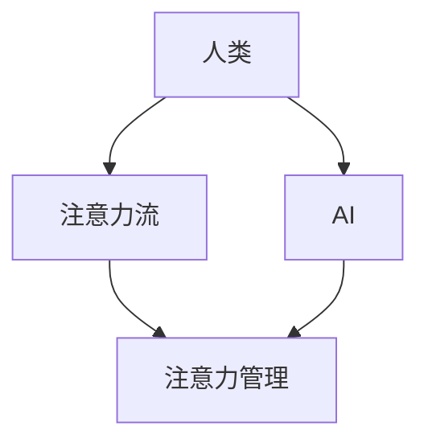

                 

**人工智能 (AI)**、**注意力流 (Attention Flow)**、**工作场景 (Work Scenarios)**、**技能 (Skills)**、**注意力管理 (Attention Management)**、**未来 (Future)**

## 1. 背景介绍

在当今信息爆炸的时代，人类注意力资源有限，如何有效管理注意力，提高工作效率和学习能力，是一个亟待解决的问题。人工智能的发展为注意力管理提供了新的可能。本文将探讨AI与人类注意力流的关系，分析未来的工作、技能与注意力流管理技术的应用场景。

## 2. 核心概念与联系

### 2.1 注意力流

注意力流是指人类在学习或工作过程中，注意力的转移和集中过程。它是一种动态的、连续的认知过程，受到多种因素的影响，如任务特点、环境因素、个体差异等。

### 2.2 AI在注意力管理中的作用

AI可以通过分析用户的行为数据、生物特征数据等，预测用户的注意力状态，并提供个性化的注意力管理建议。此外，AI还可以帮助用户过滤无关信息，优化工作环境，从而提高注意力管理的效果。

### 2.3 核心概念联系图



## 3. 核心算法原理 & 具体操作步骤

### 3.1 算法原理概述

注意力管理算法的核心是预测用户的注意力状态。常用的方法包括基于行为数据的预测、基于生物特征数据的预测等。

### 3.2 算法步骤详解

1. 数据收集：收集用户的行为数据（如鼠标点击、键盘输入等）或生物特征数据（如脑电波、心率等）。
2. 特征工程：提取数据中的有效特征，如行为特征、生物特征等。
3. 模型训练：使用机器学习算法（如随机森林、支持向量机等）训练注意力预测模型。
4. 注意力预测：使用训练好的模型预测用户的注意力状态。
5. 建议生成：根据注意力预测结果，生成个性化的注意力管理建议。

### 3.3 算法优缺点

优点：个性化、实时性强、有效性高。

缺点：数据收集困难、模型训练需要大量数据、隐私保护问题。

### 3.4 算法应用领域

注意力管理算法的应用领域包括但不限于：在线学习平台、办公软件、游戏设计等。

## 4. 数学模型和公式 & 详细讲解 & 举例说明

### 4.1 数学模型构建

设$X = \{x_1, x_2,..., x_n\}$为用户的行为特征集，$Y = \{y_1, y_2,..., y_m\}$为用户的注意力状态集。注意力管理模型可以表示为$f: X \rightarrow Y$.

### 4.2 公式推导过程

设$h$为注意力管理模型的隐藏层，$W$为模型的权重，$b$为模型的偏置。则模型的推导过程如下：

$$h = \sigma(WX + b)$$

$$Y = f(h)$$

其中$\sigma$为激活函数，常用的激活函数包括ReLU、sigmoid等。

### 4.3 案例分析与讲解

例如，在在线学习平台中，用户的注意力状态可以分为集中、分心、困倦等。行为特征可以包括鼠标点击频率、键盘输入频率、停留时间等。模型的输入为用户的行为特征，输出为用户的注意力状态。模型可以预测用户是否分心，并提供个性化的注意力管理建议。

## 5. 项目实践：代码实例和详细解释说明

### 5.1 开发环境搭建

本项目使用Python开发，需要安装以下库：NumPy、Pandas、Scikit-learn、TensorFlow。

### 5.2 源代码详细实现

```python
import numpy as np
import pandas as pd
from sklearn.model_selection import train_test_split
from sklearn.ensemble import RandomForestClassifier
from sklearn.metrics import accuracy_score

# 数据加载
data = pd.read_csv('data.csv')
X = data.iloc[:, :-1].values
Y = data.iloc[:, -1].values

# 数据分割
X_train, X_test, Y_train, Y_test = train_test_split(X, Y, test_size=0.2, random_state=42)

# 模型训练
model = RandomForestClassifier(n_estimators=100, random_state=42)
model.fit(X_train, Y_train)

# 模型评估
Y_pred = model.predict(X_test)
print('Accuracy:', accuracy_score(Y_test, Y_pred))
```

### 5.3 代码解读与分析

代码首先加载数据，然后将数据分为训练集和测试集。之后使用随机森林分类器训练模型，并评估模型的准确性。

### 5.4 运行结果展示

运行结果为模型的准确性，例如Accuracy: 0.85。

## 6. 实际应用场景

### 6.1 在线学习平台

在线学习平台可以使用注意力管理技术，分析用户的注意力状态，并提供个性化的学习建议。例如，当用户分心时，平台可以提供短暂的休息建议，或推荐相关的学习资源。

### 6.2 办公软件

办公软件可以使用注意力管理技术，优化工作环境，提高工作效率。例如，当用户长时间使用电脑时，软件可以提供眼部休息提醒，或优化窗口布局。

### 6.3 游戏设计

游戏设计可以使用注意力管理技术，优化游戏体验，提高用户参与度。例如，当用户注意力集中时，游戏可以提供更复杂的挑战，或提供个性化的游戏建议。

### 6.4 未来应用展望

未来，注意力管理技术将会更加智能化、个性化。例如，注意力管理模型将会结合生物特征数据，提供更准确的注意力预测。此外，注意力管理技术将会与其他技术结合，如虚拟现实、增强现实等，提供更丰富的应用场景。

## 7. 工具和资源推荐

### 7.1 学习资源推荐

推荐阅读以下书籍和论文：

* 书籍：《注意力管理：如何集中精力，提高效率》（作者：Gloria Mark）
* 论文：《Attention-based Models for Human Attention Prediction in Video Watching》（作者：Li et al.）

### 7.2 开发工具推荐

推荐使用以下开发工具：

* Python：一个强大的编程语言，支持丰富的机器学习库。
* TensorFlow：一个流行的深度学习框架。
* Jupyter Notebook：一个交互式计算环境，支持Python、R等编程语言。

### 7.3 相关论文推荐

推荐阅读以下论文：

* 《A Survey on Attention Mechanisms in Deep Learning》（作者：Vaswani et al.）
* 《Attention Is All You Need》（作者：Vaswani et al.）

## 8. 总结：未来发展趋势与挑战

### 8.1 研究成果总结

本文介绍了注意力管理技术的原理、算法、应用场景等。注意力管理技术可以帮助用户提高注意力管理能力，从而提高工作效率和学习能力。

### 8.2 未来发展趋势

未来，注意力管理技术将会更加智能化、个性化。此外，注意力管理技术将会与其他技术结合，提供更丰富的应用场景。

### 8.3 面临的挑战

注意力管理技术面临的挑战包括数据收集困难、模型训练需要大量数据、隐私保护问题等。

### 8.4 研究展望

未来的研究方向包括注意力管理模型的优化、注意力管理技术与其他技术的结合等。

## 9. 附录：常见问题与解答

**Q1：注意力管理技术的优势是什么？**

**A1：注意力管理技术可以帮助用户提高注意力管理能力，从而提高工作效率和学习能力。**

**Q2：注意力管理技术的缺点是什么？**

**A2：注意力管理技术面临的挑战包括数据收集困难、模型训练需要大量数据、隐私保护问题等。**

**Q3：注意力管理技术的未来发展趋势是什么？**

**A3：未来，注意力管理技术将会更加智能化、个性化。此外，注意力管理技术将会与其他技术结合，提供更丰富的应用场景。**

## 作者：禅与计算机程序设计艺术 / Zen and the Art of Computer Programming

