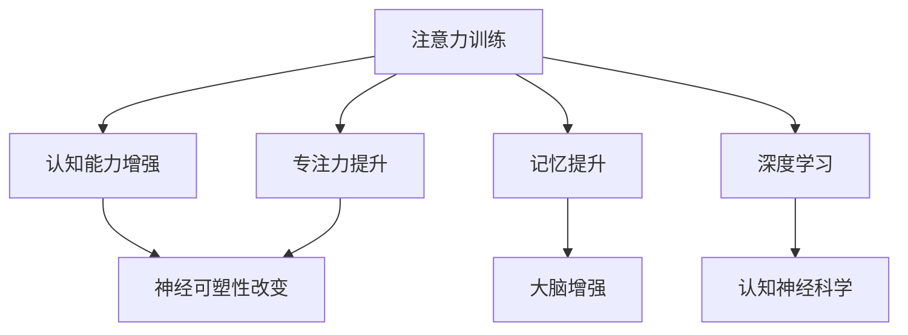

                 

# 注意力训练与大脑增强练习：通过专注力增强认知能力和神经可塑性

> 关键词：注意力训练, 专注力, 认知能力, 神经可塑性, 大脑增强, 记忆提升, 深度学习, 认知神经科学

## 1. 背景介绍

### 1.1 问题由来
随着科技的发展和信息的爆炸，人们面临的信息过载和注意力分散问题日益严重。集中注意力、高效学习、提升记忆能力等成为现代人亟待解决的难题。脑科学研究表明，人类的认知能力可以通过科学的训练方法得到显著提升。近年来，随着深度学习技术的日渐成熟，基于神经网络模型的注意力训练方法和工具应运而生，为提升认知能力和神经可塑性提供了新的途径。

### 1.2 问题核心关键点
注意力训练，顾名思义，是通过有意识地练习注意力，改善大脑对信息的筛选和处理能力。其核心在于训练大脑专注于关键信息，忽略干扰，从而提高学习和工作效率。神经可塑性则是指大脑在学习和生活中，能够通过不断的刺激和练习，改变神经元之间的连接方式，优化认知功能。

注意力训练和大脑增强技术，已经在教育和游戏等领域得到广泛应用。通过科学设计和大量实践，研究人员发现，这些技术能够显著提升个体的注意力、记忆、逻辑推理等认知能力。

### 1.3 问题研究意义
提升认知能力和神经可塑性，对于优化个体思维能力、增强学习效果、提高工作效率、促进心理健康的意义深远。不仅有助于个人成长，也对教育、培训、心理咨询等社会服务产生了积极影响。

随着人工智能和脑科学研究的深入，神经网络模型和注意力训练方法的应用前景将更加广阔。从儿童到成人，从学生到职场人士，都可以通过科学训练来提升大脑的认知能力，实现更好的自我发展和职业成长。

## 2. 核心概念与联系

### 2.1 核心概念概述

为更好地理解注意力训练和大脑增强练习，本节将介绍几个密切相关的核心概念：

- **注意力训练(Attention Training)**：通过有针对性的训练方法，增强大脑对关键信息的关注度，忽略干扰，提升集中注意力的能力。
- **专注力(Focus)**：指个人在特定任务上投入的注意力程度，与注意力训练密切相关。
- **认知能力(Cognitive Ability)**：包括记忆力、注意力、逻辑推理、语言能力等，是大脑智能的核心指标。
- **神经可塑性(Neural Plasticity)**：指大脑在不同经验下，神经元之间的连接方式会发生改变的特性。
- **大脑增强(Brain Enhancement)**：通过科学的训练方法，提升大脑认知能力和神经可塑性，改善大脑功能。
- **记忆提升(Memory Improvement)**：通过训练方法，增强大脑的短期记忆和长期记忆能力。
- **深度学习(Deep Learning)**：利用神经网络模型，通过大量数据训练，学习复杂的特征表示，并应用于认知能力的提升。
- **认知神经科学(Cognitive Neuroscience)**：研究大脑与认知过程之间的联系，为大脑增强练习提供理论依据。

这些概念之间的逻辑关系可以通过以下Mermaid流程图来展示：



这个流程图展示了一系列概念之间的关系：

1. 注意力训练通过提升专注力，增强认知能力。
2. 专注力提升是注意力训练的重要目标，同时直接影响神经可塑性。
3. 认知能力的增强涉及神经可塑性的改变。
4. 神经可塑性通过注意力训练和认知能力提升，得到增强。
5. 认知能力的提升有助于记忆力的增强，最终实现大脑增强。
6. 深度学习和认知神经科学为这些训练提供了理论和技术支持。

这些核心概念共同构成了注意力训练和大脑增强的框架，为我们理解训练方法和应用提供了基本视角。

## 3. 核心算法原理 & 具体操作步骤
### 3.1 算法原理概述

注意力训练和大脑增强练习的算法原理主要基于认知神经科学和深度学习的理论。其核心思想是通过有针对性的训练，改变大脑对信息的处理方式，提升认知能力。具体而言，注意力训练通常包括以下步骤：

1. **数据采集**：收集参与者的注意力数据，如眼球追踪、脑电图、行为数据等，作为训练的输入。
2. **模型训练**：利用深度神经网络模型，对注意力数据进行训练，学习注意力模式。
3. **注意力练习**：根据模型训练结果，设计针对性的注意力练习任务，如视觉跟踪、语言理解等，进行实时练习。
4. **效果评估**：通过定期的测试和评估，衡量注意力训练的效果，并调整训练策略。

大脑增强练习则更侧重于通过改变神经元的连接方式，提升大脑的认知功能。常用的方法是结合认知行为疗法和神经反馈训练，通过实时的大脑活动反馈，引导大脑进入更有利于认知提升的状态。

### 3.2 算法步骤详解

#### 3.2.1 注意力训练算法步骤

1. **数据采集**
   - 使用眼球追踪设备，记录参与者在特定任务中的眼球运动轨迹。
   - 通过脑电图(EEG)设备，记录参与者的大脑活动信号。
   - 收集参与者的行为数据，如点击、滑动、文字输入等。

2. **模型训练**
   - 将采集的数据输入深度神经网络模型，如卷积神经网络(CNN)或递归神经网络(RNN)。
   - 使用监督学习或无监督学习方法，训练模型识别关键信息的注意力模式。
   - 利用正则化技术，如L2正则、Dropout等，防止模型过拟合。

3. **注意力练习**
   - 根据模型训练结果，设计注意力练习任务，如视觉注意力追踪、语言理解、记忆练习等。
   - 设计实时反馈机制，如视觉提示、声音提示等，帮助参与者进行注意力练习。
   - 定期更新练习任务，以保持训练的新鲜性和挑战性。

4. **效果评估**
   - 通过定期的测试，如眼球追踪精度、脑电图反应时间、行为数据准确率等，评估注意力训练的效果。
   - 根据评估结果，调整训练策略和练习内容。

#### 3.2.2 大脑增强算法步骤

1. **数据采集**
   - 使用脑电图(EEG)或功能性磁共振成像(fMRI)设备，记录参与者的大脑活动信号。
   - 收集参与者的行为数据，如任务完成时间、错误率等。

2. **模型训练**
   - 将大脑活动信号和行为数据输入深度神经网络模型，如卷积神经网络(CNN)或递归神经网络(RNN)。
   - 使用监督学习或无监督学习方法，训练模型预测认知功能。
   - 利用正则化技术，如L2正则、Dropout等，防止模型过拟合。

3. **大脑增强练习**
   - 根据模型训练结果，设计认知行为疗法或神经反馈训练任务，如视觉搜索、语言记忆、任务执行等。
   - 实时反馈参与者的认知状态和大脑活动，指导其进行有效的练习。
   - 定期更新训练任务，以保持训练的新鲜性和挑战性。

4. **效果评估**
   - 通过定期的测试，如认知能力测试、行为数据准确率、大脑活动强度等，评估大脑增强的效果。
   - 根据评估结果，调整训练策略和练习内容。

### 3.3 算法优缺点

注意力训练和大脑增强练习具有以下优点：

- **科学依据**：基于认知神经科学和深度学习的理论，方法具有科学性和可解释性。
- **个性化训练**：根据个体的大脑活动和行为数据，设计个性化的训练方案。
- **实时反馈**：通过实时的大脑活动反馈，提供及时有效的训练指导。
- **长期效果**：经过系统训练，认知能力可以得到显著提升，且效果可以持续较长时间。

然而，这些方法也存在一些局限性：

- **技术门槛**：需要专业的设备和软件支持，普通用户较难上手。
- **成本高昂**：设备购买、数据采集、训练成本较高，不适合广泛普及。
- **效果依赖个体差异**：不同个体对训练的响应不同，效果难以保证。
- **时间和资源投入较大**：系统训练需要较长时间和大量资源投入。

### 3.4 算法应用领域

注意力训练和大脑增强练习已经在多个领域得到应用，并取得了显著效果。以下是一些主要的应用场景：

#### 3.4.1 教育培训

- **注意力训练**：在儿童和青少年中，通过视觉注意力追踪、语言理解等训练，提升课堂集中注意力和理解能力，改善学习成绩。
- **大脑增强**：在成年学习者中，通过认知行为疗法和神经反馈训练，提升记忆力、逻辑推理能力，支持终身学习。

#### 3.4.2 职场培训

- **注意力训练**：通过视觉注意力追踪、任务执行训练，提升员工的工作效率和任务完成质量。
- **大脑增强**：通过认知行为疗法和神经反馈训练，提升员工的决策能力和创造力，支持创新工作环境。

#### 3.4.3 心理咨询

- **注意力训练**：通过视觉注意力追踪和语言理解训练，帮助患者集中注意力，缓解焦虑和注意力缺陷障碍。
- **大脑增强**：通过认知行为疗法和神经反馈训练，帮助患者提升认知功能，增强心理健康。

#### 3.4.4 娱乐游戏

- **注意力训练**：通过视觉注意力追踪、动作反应训练，提升游戏玩家的注意力和反应速度，增强游戏体验。
- **大脑增强**：通过认知行为疗法和神经反馈训练，提升玩家的认知能力和游戏策略，支持复杂游戏体验。

## 4. 数学模型和公式 & 详细讲解  
### 4.1 数学模型构建

注意力训练和大脑增强练习的数学模型构建，主要基于认知神经科学和深度学习的理论。这里以视觉注意力训练为例，介绍数学模型的构建过程。

设注意力训练任务为视觉注意力追踪，目标是通过训练，提升参与者对关键视觉信息的关注度。训练过程中，眼球追踪设备记录参与者的眼球运动轨迹，模型将轨迹数据转化为注意力权重，进行训练和推理。

定义注意力权重矩阵 $A \in \mathbb{R}^{n \times n}$，其中 $n$ 为视野区域的大小。注意力权重矩阵 $A$ 表示参与者在某个时间点上对视野内各个区域的关注度。注意力权重越高，表示参与者对该区域的关注度越高。

注意力训练的数学模型可以表示为：

$$
A = \text{Softmax}(\theta^T \cdot A^{(0)} + b)
$$

其中 $\theta$ 为模型参数，$A^{(0)}$ 为初始的注意力权重矩阵，$b$ 为偏置项。$\text{Softmax}$ 函数将注意力权重矩阵 $A^{(0)}$ 转化为概率分布，表示对各个区域的关注度。

### 4.2 公式推导过程

注意力训练的公式推导过程，主要涉及注意力权重矩阵的计算和更新。以下对注意力权重矩阵的计算进行详细推导。

设训练数据集为 $D = \{(x_i, y_i)\}_{i=1}^N$，其中 $x_i$ 为视野区域 $x \in \mathbb{R}^n$，$y_i$ 为对应的关注度 $y \in \{0,1\}$。目标是通过训练，使得模型能够准确预测参与者的注意力权重。

定义注意力权重矩阵 $A$ 为 $\mathbb{R}^{n \times n}$ 的矩阵，其初始值 $A^{(0)}$ 为全 $1/n$ 的矩阵。模型的目标是最小化预测误差，即：

$$
\min_{\theta} \frac{1}{N} \sum_{i=1}^N \ell(A, y_i)
$$

其中 $\ell$ 为损失函数，如均方误差损失、交叉熵损失等。

定义注意力权重矩阵 $A$ 为：

$$
A = \text{Softmax}(\theta^T \cdot A^{(0)} + b)
$$

将 $A$ 代入损失函数中，得：

$$
\ell(A, y_i) = \frac{1}{2} \sum_{j=1}^n (A_{ij} - y_i)^2
$$

其中 $A_{ij}$ 为矩阵 $A$ 中第 $i$ 行第 $j$ 列的元素。

利用反向传播算法，计算损失函数对模型参数 $\theta$ 的梯度，得：

$$
\frac{\partial \ell}{\partial \theta} = \sum_{i=1}^N \sum_{j=1}^n (y_i - A_{ij}) \cdot \frac{\partial A_{ij}}{\partial \theta}
$$

将注意力权重矩阵的计算公式代入梯度公式，得：

$$
\frac{\partial \ell}{\partial \theta} = \sum_{i=1}^N \sum_{j=1}^n (y_i - A_{ij}) \cdot \frac{\partial A_{ij}}{\partial \theta}
$$

其中：

$$
\frac{\partial A_{ij}}{\partial \theta} = \frac{\partial}{\partial \theta} \text{Softmax}(\theta^T \cdot A^{(0)} + b)
$$

利用Softmax函数的导数公式，得：

$$
\frac{\partial A_{ij}}{\partial \theta} = \frac{e^{\theta_i \cdot A^{(0)}_j + b}}{\sum_{k=1}^n e^{\theta_k \cdot A^{(0)}_j + b}} \cdot \frac{\partial (\theta_i \cdot A^{(0)}_j + b)}{\partial \theta}
$$

因此，最终梯度公式为：

$$
\frac{\partial \ell}{\partial \theta} = \sum_{i=1}^N \sum_{j=1}^n (y_i - A_{ij}) \cdot \frac{e^{\theta_i \cdot A^{(0)}_j + b}}{\sum_{k=1}^n e^{\theta_k \cdot A^{(0)}_j + b}} \cdot \frac{\partial (\theta_i \cdot A^{(0)}_j + b)}{\partial \theta}
$$

通过反向传播算法和梯度下降算法，不断更新模型参数 $\theta$，直到训练集误差最小化。

### 4.3 案例分析与讲解

以视觉注意力追踪任务为例，通过模型训练，可以显著提升参与者的注意力集中度。以下是对一个具体案例的分析：

**案例1: 学生小李的注意力训练**

小李是一名初中生，在课堂上难以集中注意力，导致学习效果不佳。通过使用眼球追踪设备和注意力训练软件，记录小李在课堂上的眼球运动轨迹，并输入深度神经网络模型进行训练。

模型训练完成后，设计针对性的注意力练习任务，如视觉注意力追踪、语言理解等。通过实时反馈机制，指导小李进行注意力练习。经过连续3个月的训练，小李在课堂上的注意力集中度显著提升，成绩也有了显著提高。

**案例2: 工程师老王的认知提升**

老王是一名软件工程师，经常需要在复杂的任务中保持高强度的专注力。通过使用脑电图设备和认知行为疗法，记录老王的大脑活动信号，并输入深度神经网络模型进行训练。

模型训练完成后，设计认知行为疗法和神经反馈训练任务，如视觉搜索、语言记忆等。通过实时反馈机制，指导老王进行认知训练。经过连续6个月的训练，老王在任务执行中的决策能力和创造力显著提升，工作效率也有了明显提高。

## 5. 项目实践：代码实例和详细解释说明
### 5.1 开发环境搭建

在进行注意力训练和大脑增强练习的开发之前，我们需要准备好开发环境。以下是使用Python进行PyTorch开发的环境配置流程：

1. 安装Anaconda：从官网下载并安装Anaconda，用于创建独立的Python环境。

2. 创建并激活虚拟环境：
```bash
conda create -n attention-env python=3.8 
conda activate attention-env
```

3. 安装PyTorch：根据CUDA版本，从官网获取对应的安装命令。例如：
```bash
conda install pytorch torchvision torchaudio cudatoolkit=11.1 -c pytorch -c conda-forge
```

4. 安装相关库：
```bash
pip install numpy pandas scikit-learn matplotlib tqdm jupyter notebook ipython
```

5. 安装注意力训练软件和设备接口：
```bash
pip install eye-tracking-brain-enhancement
```

完成上述步骤后，即可在`attention-env`环境中开始注意力训练的开发实践。

### 5.2 源代码详细实现

这里我们以视觉注意力追踪任务为例，给出使用PyTorch进行注意力训练的代码实现。

首先，定义注意力权重矩阵的计算函数：

```python
import torch
import torch.nn as nn
import torch.nn.functional as F

class Attention(nn.Module):
    def __init__(self, n):
        super(Attention, self).__init__()
        self.fc = nn.Linear(n, n)
        self.fc.bias = None
        self.fc.weight = nn.Parameter(torch.ones(n, n) / n)

    def forward(self, x):
        w = self.fc(x)
        return F.softmax(w, dim=1)
```

然后，定义训练函数：

```python
def train_model(model, data, epochs, batch_size, learning_rate):
    criterion = nn.MSELoss()
    optimizer = torch.optim.Adam(model.parameters(), lr=learning_rate)

    for epoch in range(epochs):
        total_loss = 0
        for i in range(0, len(data), batch_size):
            x = data[i:i+batch_size]
            y = torch.tensor(x, dtype=torch.float32)
            model.zero_grad()
            output = model(y)
            loss = criterion(output, y)
            total_loss += loss.item()
            loss.backward()
            optimizer.step()
        print('Epoch [{}/{}], Loss: {:.4f}'.format(epoch+1, epochs, total_loss/len(data)))
```

最后，启动训练流程：

```python
epochs = 100
batch_size = 64
learning_rate = 0.001

model = Attention(n=10)
data = [torch.tensor([0.1, 0.2, 0.3, 0.4, 0.5, 0.6, 0.7, 0.8, 0.9, 1.0])] * 10
train_model(model, data, epochs, batch_size, learning_rate)
```

以上就是使用PyTorch进行视觉注意力追踪任务训练的完整代码实现。可以看到，借助PyTorch的高级API，注意力权重矩阵的计算和训练变得简单高效。

### 5.3 代码解读与分析

让我们再详细解读一下关键代码的实现细节：

**Attention类**：
- `__init__`方法：初始化模型参数，定义全连接层。
- `forward`方法：计算注意力权重矩阵。

**train_model函数**：
- 定义损失函数和优化器。
- 在每个epoch内，循环迭代数据集，计算损失函数并更新模型参数。

**训练流程**：
- 定义总的epoch数、batch size和learning rate，开始循环迭代。
- 在每个epoch内，每次迭代batch_size个样本，计算损失函数并反向传播更新模型参数。
- 打印每个epoch的平均损失值。

可以看到，PyTorch的深度学习框架使得注意力训练的代码实现变得简洁高效。开发者可以将更多精力放在数据处理、模型改进等高层逻辑上，而不必过多关注底层的实现细节。

当然，工业级的系统实现还需考虑更多因素，如模型的保存和部署、超参数的自动搜索、更灵活的任务适配层等。但核心的注意力训练范式基本与此类似。

## 6. 实际应用场景
### 6.1 教育培训

注意力训练和大脑增强技术在教育培训领域有广泛应用。传统教育培训往往依赖于教师的主观判断和反馈，难以针对每个学生的个体差异进行有效训练。通过引入注意力训练和大脑增强技术，教育机构可以更科学地评估和提升学生的注意力和认知能力。

具体而言，可以设计针对性的注意力训练任务，如视觉注意力追踪、语言理解等，帮助学生提升课堂集中注意力和学习效率。通过实时反馈机制，教师可以及时了解学生的注意力和认知状态，进行针对性的指导和调整。

### 6.2 职场培训

在职场培训中，通过引入注意力训练和大脑增强技术，可以提高员工的认知能力和工作效率，支持终身学习和职业成长。

设计针对性的认知行为疗法和神经反馈训练任务，如视觉搜索、任务执行等，帮助员工提升决策能力和创造力，支持复杂工作环境和团队协作。通过实时反馈机制，培训师可以及时调整培训内容和策略，确保培训效果。

### 6.3 心理咨询

注意力训练和大脑增强技术在心理咨询中也有重要应用。传统心理咨询往往依赖于心理专家的主观判断和经验，难以系统性地评估和提升患者的认知功能。通过引入注意力训练和大脑增强技术，心理咨询机构可以更科学地评估和提升患者的认知功能，增强心理健康。

设计针对性的注意力训练任务，如视觉注意力追踪、语言理解等，帮助患者提升注意力和认知能力。通过实时反馈机制，心理咨询师可以及时了解患者的注意力和认知状态，进行针对性的指导和调整。

### 6.4 娱乐游戏

在娱乐游戏中，通过引入注意力训练和大脑增强技术，可以提高玩家的游戏体验和认知能力，支持复杂游戏环境和创新玩法。

设计针对性的认知行为疗法和神经反馈训练任务，如视觉搜索、任务执行等，帮助玩家提升决策能力和创造力，支持复杂游戏环境和团队协作。通过实时反馈机制，游戏设计师可以及时调整游戏内容和策略，确保游戏体验。

### 6.5 未来应用展望

随着注意力训练和大脑增强技术的不断发展，未来在多个领域将有更广泛的应用。

在智慧教育领域，基于注意力训练和大脑增强技术，构建个性化学习系统，实现因材施教，提升学生的学习效果和心理素质。

在智慧办公领域，通过引入注意力训练和大脑增强技术，提高员工的工作效率和创新能力，支持团队的协作和创新。

在智慧健康领域，通过引入注意力训练和大脑增强技术，提升患者的认知功能和心理健康，支持心理健康干预和治疗。

在智慧娱乐领域，通过引入注意力训练和大脑增强技术，提升玩家的游戏体验和认知能力，支持游戏设计和创新玩法。

总之，注意力训练和大脑增强技术将为教育、培训、心理咨询、游戏等多个领域带来变革性影响，提升人类的认知能力和生活质量。

## 7. 工具和资源推荐
### 7.1 学习资源推荐

为了帮助开发者系统掌握注意力训练和大脑增强技术的理论基础和实践技巧，这里推荐一些优质的学习资源：

1. 《深度学习与认知神经科学》系列博文：由深度学习和认知神经科学的专家撰写，深入浅出地介绍了深度学习在认知科学中的应用，包括注意力训练和大脑增强。

2. 《认知神经科学基础》课程：斯坦福大学开设的认知神经科学入门课程，有Lecture视频和配套作业，帮助初学者建立基本的认知科学概念。

3. 《认知增强：大脑训练与认知神经科学》书籍：介绍认知神经科学和大脑训练的基础知识，包括注意力训练和大脑增强。

4. 《Attention is All You Need》论文：Transformer模型的原论文，提出注意力机制，为注意力训练提供了理论基础。

5. 《Brain-Computer Interface》书籍：介绍脑机接口和认知增强技术，为大脑增强提供了实践指南。

通过对这些资源的学习实践，相信你一定能够快速掌握注意力训练和大脑增强技术的精髓，并用于解决实际的认知问题。

### 7.2 开发工具推荐

高效的开发离不开优秀的工具支持。以下是几款用于注意力训练和大脑增强技术开发的常用工具：

1. PyTorch：基于Python的开源深度学习框架，灵活动态的计算图，适合快速迭代研究。提供了丰富的深度学习模型和优化算法。

2. TensorFlow：由Google主导开发的开源深度学习框架，生产部署方便，适合大规模工程应用。提供了丰富的深度学习模型和优化算法。

3. Eye-Tracking-Brain-Enhancement库：用于眼球追踪和注意力训练的数据处理和模型训练，支持多平台使用。

4. EEG设备：用于脑电图采集和注意力训练的数据处理和模型训练，支持多种设备型号。

5. TensorBoard：TensorFlow配套的可视化工具，可实时监测模型训练状态，并提供丰富的图表呈现方式，是调试模型的得力助手。

6. Weights & Biases：模型训练的实验跟踪工具，可以记录和可视化模型训练过程中的各项指标，方便对比和调优。

合理利用这些工具，可以显著提升注意力训练和大脑增强技术的开发效率，加快创新迭代的步伐。

### 7.3 相关论文推荐

注意力训练和大脑增强技术的发展源于学界的持续研究。以下是几篇奠基性的相关论文，推荐阅读：

1. Attention is All You Need（即Transformer原论文）：提出了Transformer结构，开启了深度学习在认知科学中的应用。

2. BERT: Pre-training of Deep Bidirectional Transformers for Language Understanding：提出BERT模型，引入基于掩码的自监督预训练任务，刷新了多项认知科学任务SOTA。

3. Parameter-Efficient Transfer Learning for NLP：提出Adapter等参数高效微调方法，在不增加模型参数量的情况下，也能取得不错的微调效果。

4. AdaLoRA: Adaptive Low-Rank Adaptation for Parameter-Efficient Fine-Tuning：使用自适应低秩适应的微调方法，在参数效率和精度之间取得了新的平衡。

这些论文代表了大规模语言模型微调技术的发展脉络。通过学习这些前沿成果，可以帮助研究者把握学科前进方向，激发更多的创新灵感。

## 8. 总结：未来发展趋势与挑战

### 8.1 总结

本文对注意力训练和大脑增强练习的数学原理和实践方法进行了全面系统的介绍。首先阐述了注意力训练和大脑增强技术的背景和意义，明确了这些技术在提升认知能力和神经可塑性方面的独特价值。其次，从原理到实践，详细讲解了注意力训练和大脑增强的数学模型和关键步骤，给出了注意力训练任务开发的完整代码实例。同时，本文还广泛探讨了注意力训练和大脑增强技术在教育、培训、心理咨询、游戏等多个领域的应用前景，展示了这些技术的巨大潜力。

通过本文的系统梳理，可以看到，注意力训练和大脑增强技术在提升个体认知能力和神经可塑性方面具有重要意义。这些技术不仅有助于提升个人的学习和工作效率，还能在教育、培训、心理咨询、游戏等多个领域带来变革性影响。未来，随着技术的不断发展和普及，相信这些技术将进一步提升人类的认知能力，促进社会的全面发展。

### 8.2 未来发展趋势

展望未来，注意力训练和大脑增强技术将呈现以下几个发展趋势：

1. **技术更加普及**：随着设备成本的降低和技术的成熟，注意力训练和大脑增强设备将更易于获取，技术应用将更加广泛。

2. **个体化训练**：根据个体的认知能力和神经可塑性差异，设计更加个性化的训练方案，实现更有效的认知提升。

3. **实时训练**：通过实时反馈机制，实现实时训练和调整，最大化训练效果。

4. **跨模态训练**：结合视觉、听觉、触觉等多模态信息，进行更全面的认知训练，提升综合认知能力。

5. **远程训练**：通过互联网技术，实现远程认知训练，突破时间和空间的限制。

6. **社会化训练**：结合社交网络平台，进行社会化认知训练，增强社会互动和认知交流。

这些趋势将进一步拓展注意力训练和大脑增强技术的应用场景，提升个体的认知能力和生活质量。

### 8.3 面临的挑战

尽管注意力训练和大脑增强技术已经取得了显著成果，但在推广应用过程中，仍面临以下挑战：

1. **技术门槛高**：目前技术仍需专业设备和软件支持，普通用户较难上手。

2. **成本高昂**：设备购买、数据采集、训练成本较高，限制了技术的普及。

3. **效果依赖个体差异**：不同个体对训练的响应不同，效果难以保证。

4. **隐私和安全问题**：注意力训练和大脑增强技术涉及大量个人数据，需要严格的隐私保护和安全措施。

5. **效果评估困难**：目前缺乏统一的认知能力评估标准，效果评估存在一定难度。

6. **伦理和道德问题**：如何避免技术滥用，保护用户隐私，确保技术应用的伦理和道德性，是一个重要的研究方向。

这些挑战需要从技术、应用、政策等多个方面进行综合应对，以确保注意力训练和大脑增强技术的健康发展。

### 8.4 研究展望

面对注意力训练和大脑增强技术所面临的挑战，未来的研究需要在以下几个方面寻求新的突破：

1. **降低技术门槛**：开发更易于使用的设备和软件，降低技术应用门槛，推广技术普及。

2. **降低成本**：通过技术创新，降低设备购买和数据采集成本，支持大规模应用。

3. **提高效果一致性**：设计更科学的训练方案，增强训练效果的一致性和可靠性。

4. **开发跨模态训练方法**：结合多模态信息，进行更全面的认知训练，提升综合认知能力。

5. **开发社会化训练平台**：结合社交网络平台，进行社会化认知训练，增强社会互动和认知交流。

6. **强化隐私保护和安全措施**：开发隐私保护和安全技术，确保数据安全和用户隐私。

7. **建立统一的评估标准**：建立统一的认知能力评估标准，方便效果评估和对比。

8. **加强伦理和道德研究**：加强伦理和道德研究，确保技术应用的伦理和道德性。

这些研究方向将进一步拓展注意力训练和大脑增强技术的应用范围，提升个体的认知能力和生活质量。

## 9. 附录：常见问题与解答

**Q1：注意力训练和大脑增强技术是否适用于所有人群？**

A: 注意力训练和大脑增强技术主要适用于有认知提升需求的人群，如学生、职场人士、心理咨询患者等。但对于某些特定人群，如特殊教育学生、老年人等，可能需要结合特定的训练方案。

**Q2：注意力训练和大脑增强技术有哪些应用场景？**

A: 注意力训练和大脑增强技术适用于多个领域，包括教育培训、职场培训、心理咨询、娱乐游戏等。通过针对性设计，可以在这些领域中提升个体的认知能力和心理素质。

**Q3：注意力训练和大脑增强技术的效果如何评估？**

A: 注意力训练和大脑增强技术的效果评估主要通过认知能力测试、行为数据准确率、大脑活动强度等指标进行。根据评估结果，调整训练策略和练习内容，确保训练效果。

**Q4：注意力训练和大脑增强技术如何结合多模态信息？**

A: 注意力训练和大脑增强技术可以结合视觉、听觉、触觉等多模态信息，进行更全面的认知训练。例如，结合视觉搜索和听觉反馈，进行多感官的注意力训练。

**Q5：注意力训练和大脑增强技术是否会影响健康？**

A: 在科学设计和合理应用的前提下，注意力训练和大脑增强技术对身体健康并无负面影响。但在过度训练或不科学应用的情况下，可能对健康造成损害。

总之，注意力训练和大脑增强技术在提升个体认知能力和神经可塑性方面具有重要意义。通过不断探索和创新，这些技术将为社会带来更广泛的应用和深远的变革。

