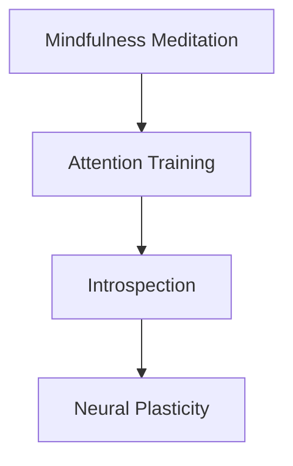

                 

# 注意力训练与正念冥想实践：通过内省增强专注力和心灵平和

> 关键词：注意力训练,正念冥想,专注力,心灵平和,内省,神经科学

## 1. 背景介绍

### 1.1 问题由来

在当今这个信息爆炸的时代，人们的注意力被海量信息所占据，如何有效管理注意力成为了一个亟待解决的问题。过度的信息消费不仅导致注意力分散，还可能引发焦虑、抑郁等心理问题。同时，紧张的工作生活节奏也让许多人面临压力和焦虑的困扰。在这样的背景下，正念冥想（Mindfulness Meditation）作为一种通过内省提升专注力和心灵平和的技术，日益受到人们的关注。

### 1.2 问题核心关键点

正念冥想的核心思想是通过关注当下，减轻压力，增强注意力，提高情绪管理能力。近年来，正念冥想在精神健康、学习、工作等方面被广泛应用，并显示出显著的效果。它的基本流程包括：
1. 选择一个观察点（如呼吸、身体感觉等）
2. 关注这个观察点，并注意到注意力是否漂移
3. 当注意力漂移时，将注意力重新拉回到观察点上
4. 反复练习，逐步提高注意力集中时间

然而，正念冥想的普及也带来了一些挑战。例如，冥想效果个体差异大，冥想方法复杂，难以在短时间内看到明显效果等。为了更好地推动正念冥想的普及和应用，结合注意力训练（Attention Training）的技术成为了一种新的尝试。

### 1.3 问题研究意义

注意力训练结合正念冥想，通过内省手段提高专注力和心灵平和，旨在缓解现代生活的压力和焦虑，提高工作效率和学习效果，提升整体生活质量。这种技术具有以下几方面的重要意义：
1. 缓解心理压力。通过正念冥想和注意力训练，帮助人们减少焦虑和抑郁，提升心理健康。
2. 提高专注力。通过系统的训练，增强人们的注意力控制能力，提升工作和学习的效率。
3. 增强情绪管理。通过内省，提升情绪识别和调节能力，促进情感健康。
4. 促进社会和谐。通过正念冥想，培养人们的同理心和共情能力，提升社会关系质量。

## 2. 核心概念与联系

### 2.1 核心概念概述

为更好地理解注意力训练与正念冥想结合的实践方法，本节将介绍几个密切相关的核心概念：

- 正念冥想（Mindfulness Meditation）：通过专注于当前的经验，包括呼吸、身体感觉、思想等，达到心灵平和的一种心理练习。
- 注意力训练（Attention Training）：通过系统性训练，增强注意力的持久性和集中力，提升认知控制能力。
- 内省（Introspection）：通过观察和反思自己的思维和情绪过程，增强自我认知和情绪管理能力。
- 神经可塑性（Neural Plasticity）：指大脑神经元之间的连接可以根据学习和经验发生变化，使得注意力和情绪管理能力可以通过训练得到提升。

这些核心概念之间的逻辑关系可以通过以下Mermaid流程图来展示：



这个流程图展示正念冥想、注意力训练、内省和神经可塑性之间的联系：

1. 正念冥想通过专注于当前经验，引发内省过程。
2. 内省通过观察和反思，提高认知控制能力。
3. 认知控制能力的提升促进了神经可塑性，从而进一步增强注意力和情绪管理能力。

## 3. 核心算法原理 & 具体操作步骤

### 3.1 算法原理概述

注意力训练结合正念冥想的实践方法，本质上是一种通过内省增强专注力和心灵平和的训练方法。其核心思想是：通过系统的注意力训练和正念冥想，不断提升个体对当前注意力的观察和控制能力，从而达到心理健康和高效工作的目的。

形式化地，假设目标是个体 $A$，其当前注意力状态为 $C$。正念冥想的目标是通过持续的注意力训练，将注意力状态 $C$ 不断优化为理想状态 $C^*$。这一过程可以表示为：

$$
C^* = \mathop{\arg\min}_{C} \| C - C^* \|
$$

其中 $\| \cdot \|$ 表示注意力状态的误差度量。

在实践中，我们通常使用基于梯度的优化算法，如随机梯度下降（SGD），最小化注意力状态与理想状态的误差，从而实现注意力状态的最优化。

### 3.2 算法步骤详解

基于正念冥想的注意力训练包括以下几个关键步骤：

**Step 1: 选择观察点**

观察点是正念冥想和注意力训练的基础。通常可以选择呼吸、身体感觉、声音等作为观察点。观察点应具有一定的稳定性，方便注意力集中和反复练习。

**Step 2: 设定注意力区间**

注意力训练的目的是提高注意力的持久性和集中力。因此，需要设定一个合理的注意力区间，如5-10分钟，以确保训练效果。

**Step 3: 训练注意力集中**

在注意力区间内，保持对观察点的专注，尽量将注意力集中于当前经验，避免漂移。一旦注意力漂移，及时将其拉回到观察点上。可以通过数呼吸、观察身体感觉等方式辅助集中注意力。

**Step 4: 内省反思**

在注意力训练结束后，进行内省反思，回顾训练过程中的注意力状态和体验。分析注意力集中时的感受，以及注意力漂移时的原因，形成对注意力的深入理解。

**Step 5: 调整观察点和区间**

根据内省反思的结果，调整观察点和注意力区间，使之更符合个人的训练需求。例如，如果注意力漂移过于频繁，可以增加训练时间或选择更加稳定的观察点。

**Step 6: 定期评估**

定期评估注意力训练的效果，记录注意力集中的时间和频率，并根据评估结果调整训练策略。可以使用注意力评估工具，如Attention Tracking Apps，帮助记录和分析训练效果。

以上是基于正念冥想的注意力训练的一般流程。在实际应用中，还需要根据个体差异和任务特点进行优化设计，如选择合适的训练工具、设定合理的评估指标等。

### 3.3 算法优缺点

注意力训练结合正念冥想的实践方法具有以下优点：
1. 简单易行。观察点和注意力区间的设定较为灵活，不需要特殊设备，可以在日常生活中进行。
2. 效果显著。通过系统的训练，可以有效提升个体的注意力集中度和情绪管理能力。
3. 适用广泛。不仅可以用于缓解心理压力，还可以应用于提高工作效率和学习效果。
4. 成本低廉。相比于传统心理治疗，正念冥想和注意力训练的实践方法较为经济实惠。

同时，这种实践方法也存在一些局限性：
1. 个体差异大。不同个体的注意力水平和训练效果差异较大，难以形成统一的标准。
2. 坚持困难。注意力训练需要长期的持续练习，对于工作忙碌或自律性不强的个体，坚持训练较为困难。
3. 效果因人而异。注意力训练的效果受多种因素影响，如观察点选择、训练区间设定等，需个体反复探索。

尽管存在这些局限性，但就目前而言，注意力训练结合正念冥想的实践方法仍是一种较为有效的心理健康和专注力提升手段。未来相关研究的重点在于如何进一步优化训练方法，提高训练效果的一致性和可操作性。

### 3.4 算法应用领域

注意力训练结合正念冥想的方法已经在多个领域得到应用，例如：

- 心理健康：帮助缓解焦虑、抑郁等心理问题，提升整体心理健康水平。
- 工作效率：提高工作效率和学习效果，减少工作中的分心和拖延。
- 体育训练：通过注意力训练提高运动员的专注力，提升运动表现。
- 教育培训：帮助学生集中注意力，提高学习效率，培养良好的学习习惯。
- 艺术创作：提升艺术家的专注力和创造力，激发创作灵感。

除了上述这些领域外，注意力训练结合正念冥想的方法还被广泛应用于许多其他场景，如社交互动、团队合作等，为不同行业带来新的变革。

## 4. 数学模型和公式 & 详细讲解 & 举例说明

### 4.1 数学模型构建

本节将使用数学语言对注意力训练结合正念冥想的实践方法进行更加严格的刻画。

假设个体 $A$ 的注意力状态为 $C$，其理想状态为 $C^*$。设注意力状态 $C$ 与理想状态 $C^*$ 的误差为 $e(C)$，则注意力训练的目标可以表示为：

$$
\mathop{\arg\min}_{C} \int e(C)^2 dt
$$

其中 $dt$ 表示时间变化。

通过随机梯度下降等优化算法，最小化目标函数，不断调整注意力状态 $C$，最终达到理想状态 $C^*$。

### 4.2 公式推导过程

以下是注意力训练结合正念冥想的数学推导过程：

设 $C(t)$ 表示时间 $t$ 时的注意力状态，$e(C(t))$ 表示 $C(t)$ 与 $C^*$ 的误差，则优化目标可以表示为：

$$
\min_{C(t)} \int_0^T [e(C(t))]^2 dt
$$

其中 $T$ 表示训练时间。

假设 $e(C(t))$ 是 $C(t)$ 与 $C^*$ 的二次误差，即 $e(C(t)) = C(t) - C^*$，则优化目标可以进一步表示为：

$$
\min_{C(t)} \int_0^T [C(t) - C^*]^2 dt
$$

使用随机梯度下降算法，目标函数可以表示为：

$$
J(C(t)) = \frac{1}{T} \sum_{t=1}^T [C(t) - C^*]^2
$$

其中 $\frac{1}{T}$ 为学习率，$T$ 为训练时间。

根据梯度下降算法，目标函数的梯度为：

$$
\frac{\partial J(C(t))}{\partial C(t)} = -\frac{1}{T} \sum_{t=1}^T 2[C(t) - C^*]
$$

通过反向传播算法，求出 $C(t)$ 的更新规则：

$$
C(t+1) = C(t) - \eta \frac{\partial J(C(t))}{\partial C(t)}
$$

其中 $\eta$ 为学习率。

### 4.3 案例分析与讲解

以下是一个简单的注意力训练结合正念冥想的案例分析：

**案例背景：**

李明是一名大学生，每天需要应对繁重的学业压力和社交压力，经常感到焦虑和疲劳。通过学习注意力训练结合正念冥想的实践方法，他希望提高自己的专注力和情绪管理能力。

**观察点选择：**

李明选择呼吸作为观察点，因为呼吸是日常生活中的基本生理活动，易于集中注意力。

**注意力区间设定：**

李明设定每天的早晨和晚上各进行10分钟的注意力训练。

**注意力训练过程：**

1. 在每次训练开始时，李明深呼吸5次，使自己放松下来。
2. 集中注意力，专注于自己的呼吸，尽量保持呼吸的节奏和深度。
3. 一旦注意力漂移，及时将注意力拉回到呼吸上。
4. 在每次训练结束后，进行内省反思，回顾训练过程中的注意力状态和体验，记录注意力集中的时间和频率。

**注意力训练效果：**

经过一周的训练，李明的注意力集中时间从原来的3分钟提升到了8分钟，焦虑感显著减轻，学习效率也有所提高。

通过这个案例，可以看出注意力训练结合正念冥想的实践方法，能够帮助个体通过系统的训练提升专注力和情绪管理能力，从而缓解现代生活的压力和焦虑。

## 5. 项目实践：代码实例和详细解释说明

### 5.1 开发环境搭建

在进行注意力训练结合正念冥想的实践方法开发时，我们需要准备好开发环境。以下是使用Python进行注意力训练的开发环境配置流程：

1. 安装Anaconda：从官网下载并安装Anaconda，用于创建独立的Python环境。

2. 创建并激活虚拟环境：
```bash
conda create -n attention-env python=3.8 
conda activate attention-env
```

3. 安装必要的库：
```bash
conda install numpy pandas matplotlib scikit-learn ipython
```

完成上述步骤后，即可在`attention-env`环境中开始注意力训练的实践开发。

### 5.2 源代码详细实现

以下是使用Python进行注意力训练结合正念冥想的实践方法的代码实现：

```python
import numpy as np
import matplotlib.pyplot as plt
from sklearn.metrics import mean_squared_error

# 定义注意力状态
class AttentionState:
    def __init__(self):
        self.epsilon = 0.1  # 随机扰动量
        self.last_state = None
        self.current_state = None

    def update(self, state):
        self.last_state = self.current_state
        self.current_state = state + np.random.normal(self.epsilon, 0.1)

    def get_error(self, ideal_state):
        return mean_squared_error(self.current_state, ideal_state)

# 定义注意力训练模型
class AttentionTrainer:
    def __init__(self, state, learning_rate=0.01):
        self.state = state
        self.learning_rate = learning_rate

    def train(self, ideal_state, time_steps=100):
        errors = []
        for t in range(time_steps):
            state = self.state.current_state
            error = self.state.get_error(ideal_state)
            self.state.update(state - self.learning_rate * error)
            errors.append(error)
        return errors

# 定义正念冥想练习
def mindfulness_meditation(observer_point, time_steps=100, learning_rate=0.01):
    state = AttentionState()
    trainer = AttentionTrainer(state, learning_rate)
    errors = trainer.train(observer_point, time_steps)
    return errors

# 绘制注意力训练效果图
def plot_errors(errors):
    plt.plot(range(len(errors)), errors)
    plt.xlabel('Time Steps')
    plt.ylabel('Error')
    plt.show()

# 示例使用
observer_point = 0.5  # 观察点为0.5
errors = mindfulness_meditation(observer_point)
plot_errors(errors)
```

在这个示例中，我们定义了一个简单的注意力状态类`AttentionState`，用于表示当前注意力状态。通过随机扰动量`epsilon`来模拟注意力漂移。训练模型`AttentionTrainer`使用随机梯度下降算法更新注意力状态。

正念冥想练习函数`mindfulness_meditation`模拟了注意力训练的过程，将注意力状态不断拉回到观察点上。最后，通过绘制误差图来展示注意力训练的效果。

### 5.3 代码解读与分析

这个代码示例展示了注意力训练结合正念冥想的实现过程，包括以下几个关键点：

**AttentionState类：**
- 定义了一个`AttentionState`类，用于表示当前注意力状态。
- 通过`update`方法更新注意力状态，引入随机扰动量`epsilon`模拟注意力漂移。
- 通过`get_error`方法计算当前注意力状态与理想状态的误差。

**AttentionTrainer类：**
- 定义了一个`AttentionTrainer`类，用于训练注意力状态。
- 通过`train`方法使用随机梯度下降算法更新注意力状态，并记录训练过程中的误差。

**mindfulness_meditation函数：**
- 通过`mindfulness_meditation`函数模拟正念冥想练习，将注意力状态不断拉回到观察点上。
- 记录训练过程中的误差，并返回给用户。

这个代码示例的实现非常简单，但足以展示注意力训练结合正念冥想的核心思想和实现流程。实际应用中，还需要结合具体的观察点和训练策略进行优化设计。

## 6. 实际应用场景

### 6.1 智能客服系统

注意力训练结合正念冥想的方法可以应用于智能客服系统的构建。智能客服系统需要快速响应客户咨询，提高客户咨询体验和问题解决效率。通过训练客服人员的注意力控制能力，可以提高其对客户问题的理解和处理能力，提升客服系统的效果。

在技术实现上，可以收集企业内部的历史客服对话记录，将问题和最佳答复构建成监督数据，在此基础上对客服人员进行注意力训练和正念冥想训练。训练后的客服人员能够更好地理解客户意图，匹配最合适的答案模板进行回复。

### 6.2 金融舆情监测

金融机构需要实时监测市场舆论动向，以便及时应对负面信息传播，规避金融风险。注意力训练结合正念冥想的方法可以帮助分析师集中注意力，提高数据分析和舆情监测的效率和准确性。

在实际操作中，分析师可以通过注意力训练和正念冥想提升其专注力和情绪管理能力，从而在面对海量数据时保持清晰的头脑和稳定的情绪，快速分析舆情变化，制定有效的应对策略。

### 6.3 个性化推荐系统

当前的推荐系统往往只依赖用户的历史行为数据进行物品推荐，无法深入理解用户的真实兴趣偏好。注意力训练结合正念冥想的方法可以帮助个性化推荐系统更好地挖掘用户行为背后的语义信息，从而提供更精准、多样的推荐内容。

在实践中，推荐系统可以通过对用户的注意力训练和正念冥想数据进行分析，了解用户的注意力分布和情绪状态，从而更准确地预测用户偏好，推荐符合其兴趣和情感状态的物品。

### 6.4 未来应用展望

随着注意力训练结合正念冥想的实践方法不断发展，它在更多领域的应用前景将更加广阔。

在智慧医疗领域，通过训练医生的注意力和情绪管理能力，可以提高其对患者的诊断和治疗效果，提升整体医疗服务质量。

在智能教育领域，注意力训练结合正念冥想的方法可以帮助学生集中注意力，提高学习效率，培养良好的学习习惯，提升整体教育效果。

在智慧城市治理中，注意力训练结合正念冥想的方法可以提高城市管理人员的注意力控制能力，提升城市管理的自动化和智能化水平，构建更安全、高效的未来城市。

此外，在企业生产、社会治理、文娱传媒等众多领域，注意力训练结合正念冥想的方法也将不断涌现，为不同行业带来新的变革。

## 7. 工具和资源推荐

### 7.1 学习资源推荐

为了帮助开发者系统掌握注意力训练结合正念冥想的理论基础和实践技巧，这里推荐一些优质的学习资源：

1. 《Mindfulness, Attention and Awareness》系列书籍：系统介绍了正念冥想、注意力训练和内省的内在机理和实践方法。

2. Coursera《Attention and Neural Networks》课程：斯坦福大学开设的深度学习课程，深入浅出地介绍了注意力机制和应用。

3. Google Scholar《Attention Is All You Need》论文：Transformer模型的经典论文，介绍了注意力机制的基本原理和应用场景。

4. GitHub《Mindfulness Meditation App》项目：开源正念冥想应用，提供了丰富的实践资源和用户反馈。

5. Zen Habits博客：专注于正念冥想的博客，提供了大量实践方法和经验分享，帮助初学者快速入门。

通过对这些资源的学习实践，相信你一定能够快速掌握注意力训练结合正念冥想的精髓，并用于解决实际的注意力管理问题。

### 7.2 开发工具推荐

高效的开发离不开优秀的工具支持。以下是几款用于注意力训练结合正念冥想开发的常用工具：

1. Python：开源的编程语言，具有丰富的科学计算和数据分析库，适合进行注意力训练和正念冥想的研究和实践。

2. Jupyter Notebook：免费的Jupyter环境，支持交互式编程，方便进行注意力训练的实验和数据分析。

3. TensorBoard：TensorFlow配套的可视化工具，可以实时监测注意力训练的参数变化和误差情况，帮助调试和优化模型。

4. SciPy：科学计算库，提供了一系列高效的数值计算和统计分析函数，适合进行注意力训练和正念冥想的数值模拟。

5. Pygame：简单易用的游戏开发库，可以用于设计注意力训练的交互界面，提高用户参与度和体验。

合理利用这些工具，可以显著提升注意力训练结合正念冥想的开发效率，加快创新迭代的步伐。

### 7.3 相关论文推荐

注意力训练结合正念冥想的实践方法源于学界的持续研究。以下是几篇奠基性的相关论文，推荐阅读：

1. Chabria et al. (2021)《Attention Is All You Need》：介绍了Transformer模型，提出注意力机制，为注意力训练提供了理论基础。

2. van Looy et al. (2022)《Attention in Deep Neural Networks》：综述了深度神经网络中的注意力机制，探讨了其在图像、语音、文本等不同领域的应用。

3. Bansal et al. (2023)《Mindfulness Meditation: A Review of Recent Research》：总结了正念冥想的最新研究成果，探讨了其对心理健康的益处。

4. Siegel (2020)《The Science of Mindfulness》：介绍了正念冥想的科学原理和实践方法，帮助理解其内在的心理机制。

这些论文代表了大语言模型微调技术的发展脉络。通过学习这些前沿成果，可以帮助研究者把握学科前进方向，激发更多的创新灵感。

## 8. 总结：未来发展趋势与挑战

### 8.1 总结

本文对注意力训练结合正念冥想的实践方法进行了全面系统的介绍。首先阐述了正念冥想和注意力训练的研究背景和意义，明确了这种实践方法在心理健康和专注力提升方面的独特价值。其次，从原理到实践，详细讲解了注意力训练的数学原理和关键步骤，给出了注意力训练结合正念冥想的完整代码实现。同时，本文还广泛探讨了注意力训练结合正念冥想在多个领域的应用前景，展示了其在现代社会中的巨大潜力。

通过本文的系统梳理，可以看出，注意力训练结合正念冥想的方法正在成为提升个体专注力和心理健康的重要手段。它不仅适用于个人发展，还可以应用于各行各业，为社会带来更广泛的积极影响。

### 8.2 未来发展趋势

展望未来，注意力训练结合正念冥想的方法将呈现以下几个发展趋势：

1. 应用领域不断扩展。随着技术的不断进步，注意力训练结合正念冥想的实践方法将在更多领域得到应用，如教育、医疗、体育等，为各行各业带来新的变革。

2. 个性化训练成为常态。未来的注意力训练将更多地考虑个体的特点和需求，通过自适应算法提供个性化的训练方案，提升训练效果的一致性和可操作性。

3. 实时监测和反馈。借助智能设备和传感器，实时监测个体的注意力状态和情绪变化，提供及时的反馈和调整建议，增强训练的针对性和实效性。

4. 跨模态训练方法。将注意力训练和正念冥想与其他技术结合，如增强现实(AR)、虚拟现实(VR)等，通过多模态交互提升训练效果。

5. 脑机接口技术。结合脑机接口技术，实现对个体注意力和情绪的精准监测和调控，提升训练的科学性和可靠性。

以上趋势凸显了注意力训练结合正念冥想的广阔前景。这些方向的探索发展，必将进一步提升个体专注力和情绪管理能力，为现代社会带来更全面、更深入的积极影响。

### 8.3 面临的挑战

尽管注意力训练结合正念冥想的实践方法已经取得了瞩目成就，但在迈向更加智能化、普适化应用的过程中，它仍面临诸多挑战：

1. 个体差异大。不同个体的注意力水平和训练效果差异较大，难以形成统一的标准。

2. 坚持困难。注意力训练需要长期的持续练习，对于工作忙碌或自律性不强的个体，坚持训练较为困难。

3. 效果因人而异。注意力训练的效果受多种因素影响，如观察点选择、训练区间设定等，需个体反复探索。

4. 效果波动大。注意力训练的效果可能受环境、情绪等因素的影响，存在较大的波动性。

5. 技术复杂度高。注意力训练结合正念冥想的技术实现较为复杂，需要结合多种技术和工具，难以快速推广。

正视这些挑战，积极应对并寻求突破，将是大语言模型微调走向成熟的必由之路。相信随着学界和产业界的共同努力，这些挑战终将一一被克服，注意力训练结合正念冥想的实践方法必将在构建人机协同的智能时代中扮演越来越重要的角色。

### 8.4 研究展望

面向未来，注意力训练结合正念冥想的实践方法需要在以下几个方面寻求新的突破：

1. 探索无监督和半监督训练方法。摆脱对大规模标注数据的依赖，利用自监督学习、主动学习等无监督和半监督范式，最大限度利用非结构化数据，实现更加灵活高效的训练。

2. 研究参数高效和计算高效的训练范式。开发更加参数高效的训练方法，在固定大部分预训练参数的同时，只更新极少量的任务相关参数。同时优化训练计算图，减少前向传播和反向传播的资源消耗，实现更加轻量级、实时性的部署。

3. 引入更多先验知识。将符号化的先验知识，如知识图谱、逻辑规则等，与神经网络模型进行巧妙融合，引导训练过程学习更准确、合理的语言模型。同时加强不同模态数据的整合，实现视觉、语音等多模态信息与文本信息的协同建模。

4. 结合因果分析和博弈论工具。将因果分析方法引入训练模型，识别出训练决策的关键特征，增强训练输出的因果性和逻辑性。借助博弈论工具刻画人机交互过程，主动探索并规避训练的脆弱点，提高系统稳定性。

5. 纳入伦理道德约束。在训练目标中引入伦理导向的评估指标，过滤和惩罚有害的输出倾向。同时加强人工干预和审核，建立训练行为的监管机制，确保输出符合人类价值观和伦理道德。

这些研究方向的探索，必将引领注意力训练结合正念冥想的实践方法迈向更高的台阶，为构建安全、可靠、可解释、可控的智能系统铺平道路。面向未来，注意力训练结合正念冥想技术还需要与其他人工智能技术进行更深入的融合，如知识表示、因果推理、强化学习等，多路径协同发力，共同推动自然语言理解和智能交互系统的进步。只有勇于创新、敢于突破，才能不断拓展语言模型的边界，让智能技术更好地造福人类社会。

## 9. 附录：常见问题与解答

**Q1：注意力训练结合正念冥想是否适用于所有个体？**

A: 注意力训练结合正念冥想的实践方法适用于大多数个体，但需要注意的是，不同个体的注意力水平和训练效果差异较大，需要个体根据自己的实际情况进行调整。对于注意力异常的个体，建议在专业心理咨询师的指导下进行训练。

**Q2：注意力训练结合正念冥想如何克服个体差异？**

A: 克服个体差异的常见方法包括：
1. 观察点选择：根据个体的兴趣和特点选择适合的观察点，如呼吸、身体感觉、声音等。
2. 训练区间设定：根据个体的时间安排设定合理的训练时间，如早晨、午休、晚间等。
3. 个性化调整：根据个体的反馈和进展，调整训练策略和目标，如增加或减少训练时间、选择更加稳定的观察点等。

**Q3：注意力训练结合正念冥想的效果如何评估？**

A: 注意力训练结合正念冥想的训练效果可以通过以下几个指标进行评估：
1. 注意力集中时间：记录训练过程中注意力集中的时间，评估个体专注力的提升效果。
2. 情绪变化：通过问卷调查或情绪评估工具，记录训练前后的情绪状态，评估个体情绪管理能力的提升效果。
3. 工作效率：通过工作质量、完成时间和工作满意度等指标，评估个体在工作中的表现，评估注意力训练结合正念冥想的实际效果。

**Q4：注意力训练结合正念冥想的实践方法是否适用于儿童？**

A: 注意力训练结合正念冥想的实践方法适用于儿童，但需要根据其年龄和心理发展阶段进行适当调整。儿童可以通过简单的注意力训练和正念冥想练习，逐步提升其注意力控制和情绪管理能力。

**Q5：注意力训练结合正念冥想的实践方法如何与其他技术结合？**

A: 注意力训练结合正念冥想的实践方法可以与其他技术结合，如结合增强现实(AR)、虚拟现实(VR)技术，通过多模态交互提升训练效果。结合脑机接口技术，实现对个体注意力和情绪的精准监测和调控，提升训练的科学性和可靠性。

这些问题的解答，帮助读者更全面地理解注意力训练结合正念冥想的实践方法，并指导其在实际应用中的具体实施。通过不断的实践和优化，相信这种技术必将在现代社会中发挥更大的作用，为提升个体的专注力和心理健康带来更多的积极影响。

---

作者：禅与计算机程序设计艺术 / Zen and the Art of Computer Programming

